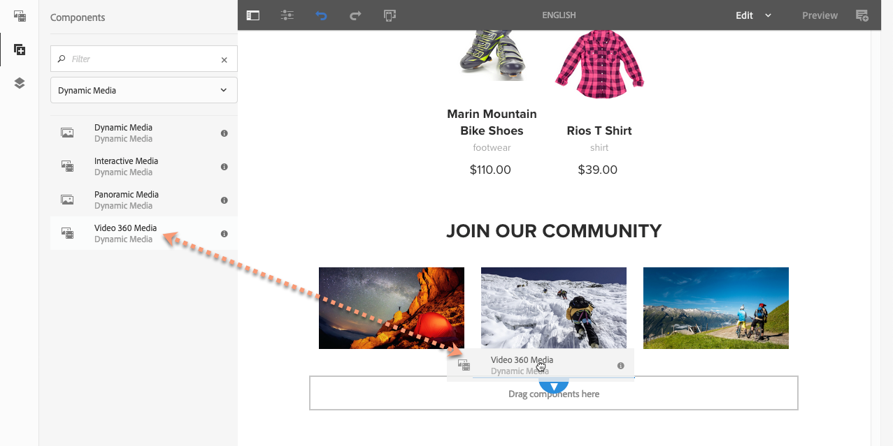

# Adding Dynamic Media Assets to Pages{#adding-dynamic-media-assets-to-pages}

Als u de functionaliteit voor dynamische media wilt toevoegen aan assets die u op uw websites gebruikt, kunt u de component **Dynamische media**, **Interactieve media**, **Panoramische media** of **Video 360-media** rechtstreeks op de pagina toevoegen. U doet dit door naar de modus Lay-out te gaan en de componenten voor dynamische media in te schakelen. Vervolgens kunt u deze componenten aan de pagina toevoegen en assets aan de component toevoegen. De componenten voor dynamische media zijn slim: ze weten of u een afbeelding of een video toevoegt en de beschikbare configuratieopties veranderen dienovereenkomstig.

U voegt dynamische media-assets rechtstreeks aan de pagina toe als u AEM als uw WCM gebruikt. Als u een oplossing van derden gebruikt voor uw WCM, moet u uw assets [koppelen](/help/assets/dynamic-media/linking-urls-to-yourwebapplication.md) of [insluiten](/help/assets/dynamic-media/embed-code.md). Voor een responsieve website van derden raadpleegt u het [leveren van geoptimaliseerde afbeeldingen op een responsieve site](/help/assets/dynamic-media/responsive-site.md).

>[!NOTE]
>
>U moet elementen publiceren voordat u deze aan pagina&#39;s in AEM toevoegt. See [Publishing Dynamic Media Assets](/help/assets/dynamic-media/publishing-dynamicmedia-assets.md).

## Een component Dynamische media aan een pagina toevoegen {#adding-a-dynamic-media-component-to-a-page}

Het toevoegen van 3D-media, dynamische media, interactieve media, panoramische media, SmartCrop-video of Video 360-mediacomponent aan een pagina is hetzelfde als het toevoegen van een component aan een pagina. De dynamische componenten van Media worden beschreven in de volgende secties.

**Een component Dynamische media aan een pagina toevoegen**

1. Open in AEM de pagina waaraan u de component Dynamische media wilt toevoegen.
1. Tik in het linkerdeelvenster op het **[!UICONTROL Components]** pictogram en filter vervolgens op Dynamische media.

   Als geen lijst van Dynamische componenten van Media beschikbaar is, moet u waarschijnlijk de Dynamische componenten van Media toelaten die u wilt gebruiken. Zie [Dynamische mediacomponenten](#enabling-dynamic-media-components)inschakelen.

   

1. Sleep een **[!UICONTROL Dynamic Media]** component en zet deze neer op de gewenste locatie op de pagina.

   In het onderstaande voorbeeld wordt de **[!UICONTROL Video 360 Media]** component gebruikt.

   

1. Houd de muisaanwijzer rechtstreeks boven de component. Tik eenmaal om de werkbalk van de component weer te geven wanneer de component is omringd door een blauw vak. Tik op het **[!UICONTROL Configuration (wrench)]** pictogram.

   

1. Afhankelijk van de Dynamic Media-component die u op de pagina hebt neergezet, wordt een configuratiedialoogvenster geopend. [Stel de componentopties](/help/assets/dynamic-media/adding-dynamic-media-assets-to-pages.md#dynamic-media-components) naar wens in.

   In het onderstaande voorbeeld ziet u het dialoogvenster Dynamische media **[!UICONTROL Video 360 Media]** en de opties die beschikbaar zijn in de vervolgkeuzelijst Voorinstelling viewer.

   

   De Dynamic Media Video 360 Media-component.

1. Als u klaar bent, tikt u in de rechterbovenhoek van het dialoogvenster op het vinkje om de wijzigingen op te slaan.

### Dynamische mediacomponenten inschakelen {#enabling-dynamic-media-components}

Als er geen dynamische mediacomponenten beschikbaar zijn om aan een pagina toe te voegen, betekent dit waarschijnlijk dat u eerst de componenten moet inschakelen die u wilt gebruiken.

1. Open in AEM de pagina waaraan u de component Dynamische media wilt toevoegen.
1. Tik links op de werkbalk naast de pagina op het pictogram Pagina-informatie en tik vervolgens **[!UICONTROL Edit Template]** in de vervolgkeuzelijst.

   

1. Tik in de vervolgkeuzelijst rechts van de werkbalk naast de pagina op **[!UICONTROL Structure]**.

   

1. Tik onder aan de pagina **[!UICONTROL Layout Container]** op de werkbalk om deze te openen en tik vervolgens op het pictogram Beleid.
1. Controleer of op de **[!UICONTROL Layout Container]** pagina onder de **[!UICONTROL Properties]** kop de **[!UICONTROL Allowed Components]** tab is geselecteerd.

   

1. Schuif totdat u het ziet **[!UICONTROL Dynamic Media]**.
1. Tik op het pictogram > links van **[!UICONTROL Dynamic Media]** om de lijst uit te vouwen, selecteer de dynamische mediacomponenten die u wilt inschakelen.

   

1. Tik in de rechterbovenhoek van de **[!UICONTROL Layout Container]** pagina op het pictogram Gereed (vinkje).

1. Tik in de vervolgkeuzelijst rechts op de werkbalk boven aan de pagina op **[!UICONTROL Initial Content]** en [voeg op de gebruikelijke manier een component Dynamische media aan een pagina](#adding-a-dynamic-media-component-to-a-page) toe.

## Dynamische mediacomponenten lokaliseren {#localizing-dynamic-media-components}

U kunt dynamische mediacomponenten op twee manieren lokaliseren:

* Open **[!UICONTROL Properties]** en selecteer het tabblad **[!UICONTROL Advanced]** op een webpagina in Sites. Selecteer de gewenste taal voor lokalisatie.

   

* Selecteer de gewenste pagina of paginagroep in de sitekiezer. Tik **[!UICONTROL Properties]** en selecteer de **[!UICONTROL Advanced]** tab. Selecteer de gewenste taal voor lokalisatie.

   >[!NOTE]
   >
   >Niet alle talen in het **[!UICONTROL Language]** menu hebben tokens toegewezen.

## Beschikbare dynamische mediacomponenten {#dynamic-media-components}

De dynamische componenten van Media zijn beschikbaar wanneer u het **[!UICONTROL Components]** pictogram tikt, dan filter op **[!UICONTROL Dynamic Media]**.

De dynamische componenten van Media die beschikbaar zijn omvatten het volgende:

* **[!UICONTROL Dynamic Media]** - Wordt gebruikt voor assets zoals afbeeldingen, video, e-catalogi en spinsets.
* **[!UICONTROL Interactive Media]** - Wordt gebruikt voor interactieve elementen zoals interactieve video, interactieve afbeeldingen of carrouselsets.
* **[!UICONTROL Panoramic Media]** - Gebruik voor panoramische afbeeldingen of panoramische VR-afbeeldingselementen.
* **[!UICONTROL Video 360 Media]** - Wordt gebruikt voor 360 video- en 360 VR-video-elementen.

>[!NOTE]
>
>Deze componenten zijn niet standaard beschikbaar en moeten via de sjablooneditor beschikbaar worden gemaakt voordat ze kunnen worden gebruikt. Nadat ze in de sjablooneditor beschikbaar zijn gemaakt, kunt u de componenten aan de pagina toevoegen, net als alle andere AEM-componenten.

### Component: Dynamische media {#dynamic-media-component}

De component Dynamische media is slim. Afhankelijk van het feit of u een afbeelding of video toevoegt, hebt u verschillende opties. De component ondersteunt voorinstellingen voor afbeeldingen, op afbeeldingen gebaseerde viewers, zoals afbeeldingssets, centrifuges, gemengde mediasets en video. Bovendien reageert de viewer hierop. De grootte van het scherm verandert automatisch op basis van de schermgrootte. Alle viewers zijn HTML5-viewers.

>[!NOTE]
>
>Als uw webpagina het volgende heeft:
>
>* Meerdere instanties van de component Dynamic Media die op dezelfde pagina worden gebruikt.
>* Elke instantie gebruikt hetzelfde elementtype.
>
>
Houd er rekening mee dat het toewijzen van een andere viewervoorinstelling aan elke Dynamic Media-component op die pagina niet wordt ondersteund.
>
>U kunt echter dezelfde viewervoorinstelling gebruiken voor alle Dynamic Media-componenten die elementen van hetzelfde type gebruiken, op de pagina.

Wanneer u de component Dynamische media toevoegt en leeg **[!UICONTROL Dynamic Media Settings]** is of wanneer u een element niet correct kunt toevoegen, controleert u het volgende:

* De afbeelding heeft een piramideTIFF-bestand. Afbeeldingen die zijn geïmporteerd voordat dynamische media is ingeschakeld, hebben geen TIFF-bestand met piramide.

#### Wanneer u met afbeeldingen werkt {#when-working-with-images}

Met de component Dynamische media kunt u dynamische afbeeldingen toevoegen, zoals afbeeldingssets, centrifuges en gemengde mediasets. U kunt inzoomen, uitzoomen en, indien van toepassing, een afbeelding binnen een centrifugeset draaien of een afbeelding van een ander type set selecteren.

U kunt de viewervoorinstelling, afbeeldingsvoorinstelling of afbeeldingsindeling ook rechtstreeks in de component configureren. Als u een afbeelding responsief wilt maken, kunt u de onderbrekingspunten instellen of een responsieve voorinstelling voor de afbeelding toepassen.

U kunt de volgende instellingen voor dynamische media bewerken door op het **[!UICONTROL Edit]** pictogram in de component te tikken en vervolgens **[!UICONTROL Dynamic Media Settings]**.

>[!NOTE]
>
>Standaard is de afbeeldingscomponent voor dynamische media adaptief. Als u een vaste grootte wilt instellen, stelt u dit in de component op het tabblad **[!UICONTROL Advanced]** met **[!UICONTROL Width]** en **[!UICONTROL Height]** in.

* **[!UICONTROL Viewer preset]**—Selecteer een bestaande viewervoorinstelling in het keuzemenu. Als de viewervoorinstelling die u zoekt niet zichtbaar is, moet u deze mogelijk zichtbaar maken. Zie Viewer-voorinstellingen beheren. U kunt geen viewervoorinstelling selecteren als u een voorinstelling voor afbeeldingen gebruikt en andersom.

   Dit is de enige beschikbare optie als u beeldreeksen, spin reeksen, of gemengde media reeksen bekijkt. De weergegeven viewervoorinstellingen zijn ook slim. Alleen relevante viewervoorinstellingen worden weergegeven.

* **[!UICONTROL Viewer modifiers]**—Viewermodifiers hebben de vorm van name=value pair met een &amp; delimiter en laten u kijkers veranderen zoals die in de Gids van de Verwijzing van Kijkers worden geschetst. Een voorbeeld van een viewermodifier is `posterimage=img.jpg&caption=text.vtt,1` die een andere afbeelding instelt voor de videominiatuur en een ondertitelingsbestand aan de video koppelt.

* **[!UICONTROL Image preset]**—Selecteer een bestaande voorinstelling voor de afbeelding in het keuzemenu. Als de voorinstelling die u zoekt niet zichtbaar is, moet u deze mogelijk zichtbaar maken. Zie Voorinstellingen afbeelding beheren. U kunt geen viewervoorinstelling selecteren als u een voorinstelling voor afbeeldingen gebruikt en andersom.

   Deze optie is niet beschikbaar als u afbeeldingssets, centrifuges of gemengde mediasets bekijkt.

* **[!UICONTROL Image Modifiers]**—U kunt afbeeldingseffecten toepassen door extra opdrachten voor afbeeldingen te geven. Deze worden beschreven in Voorinstellingen afbeelding en de verwijzing Opdracht Beeldserver.

   Deze optie is niet beschikbaar als u afbeeldingssets, centrifuges of gemengde mediasets bekijkt.

* **[!UICONTROL Breakpoints]**—Als u dit middel op een ontvankelijke plaats gebruikt, moet u de beeldbreekpunten toevoegen. Afbeeldingsonderbrekingspunten moeten door komma&#39;s (,) worden gescheiden. Deze optie werkt wanneer er geen hoogte of breedte is gedefinieerd in een voorinstelling voor afbeeldingen.

   Deze optie is niet beschikbaar als u afbeeldingssets, centrifuges of gemengde mediasets bekijkt.

   You can edit the following Advanced Settings by tapping **[!UICONTROL Edit]** in the component.

* **[!UICONTROL Title]**—Wijzig de titel van de afbeelding.

* **[!UICONTROL Alt Text]**—Voeg een titel toe aan de afbeelding voor gebruikers die afbeeldingen hebben uitgeschakeld.

   Deze optie is niet beschikbaar als u afbeeldingssets, centrifuges of gemengde mediasets bekijkt.

* **[!UICONTROL URL, Open in]**—U kunt een middel plaatsen om een verbinding te openen. Stel de URL in en kies Openen in om aan te geven of deze in hetzelfde venster of in een nieuw venster moet worden geopend.

   Deze optie is niet beschikbaar als u afbeeldingssets, centrifuges of gemengde mediasets bekijkt.

* **[!UICONTROL Width]**—Voer een waarde in pixels in als u wilt dat de afbeelding een vaste grootte heeft. Als u deze waarde leeg laat, wordt het element adaptief.

* **[!UICONTROL Height]**—Voer een waarde in pixels in als u wilt dat de afbeelding een vaste grootte heeft. Als u deze waarde leeg laat, wordt het element adaptief.

#### Wanneer u werkt met video {#when-working-with-video}

Met de component Dynamische media kunt u dynamische video toevoegen aan uw webpagina&#39;s. Wanneer u de component bewerkt, kunt u een vooraf gedefinieerde videoviewer gebruiken om de video op de pagina af te spelen.

U kunt de volgende instellingen voor dynamische media bewerken door in **[!UICONTROL Edit]** de component te klikken.

>[!NOTE]
>
>Standaard is de videocomponent Dynamic Media adaptief. If you want to make it a fixed size, set it in the component with the **[!UICONTROL Width]** and **[!UICONTROL Height]** in the **[!UICONTROL Advanced]** tab.

* **[!UICONTROL Viewer preset**—Selecteer een bestaande voorinstelling voor een videoviewer in het vervolgkeuzemenu. Als de viewervoorinstelling die u zoekt niet zichtbaar is, moet u deze mogelijk zichtbaar maken. Zie Viewer-voorinstellingen beheren.

* **[!UICONTROL Viewer modifiers**—Viewer modifiers have the form of name=value pair with a &amp; delimiter and let you change viewers as described in the Adobe Viewers Reference Guide. Een voorbeeld van een viewer-modifier is `posterimage=img.jpg&caption=text.vtt,1`

   Met viewermodifiers kunt u bijvoorbeeld het volgende doen:

   * Een bijschriftbestand koppelen aan een video: [bijschrift](https://docs.adobe.com/content/help/en/dynamic-media-developer-resources/library/viewers-aem-assets-dmc/video/command-reference-url-video/r-html5-video-viewer-url-caption.html)
   * Een navigatiebestand koppelen aan een video: [navigatie](https://docs.adobe.com/content/help/en/dynamic-media-developer-resources/library/viewers-aem-assets-dmc/video/command-reference-url-video/r-html5-video-viewer-url-navigation.html)
   You can edit the following Advanced Settings by clicking **[!UICONTROL Edit]** in the component.

* **[!UICONTROL Titel**—Wijzig de titel van de video.

* **[!UICONTROL Width]**—Voer een waarde in pixels in als u wilt dat de afbeelding een vaste grootte heeft. Als u deze waarde leeg laat, wordt het element adaptief.

* **[!UICONTROL Height]**—Voer een waarde in pixels in als u wilt dat de afbeelding een vaste grootte heeft. Als u deze waarde leeg laat, wordt het element adaptief.

#### Wanneer u werkt met Slim uitsnijden {#when-working-with-smart-crop}

Met de component Dynamische media kunt u SmartCrop-afbeeldingselementen toevoegen aan uw webpagina&#39;s. Wanneer u de component bewerkt, kunt u een vooraf gedefinieerde videoviewer gebruiken om de video op de pagina af te spelen.

Zie Slim uitsnijden [gebruiken met dynamische media van AEM-elementen](https://docs.adobe.com/content/help/en/experience-manager-learn/assets/dynamic-media/smart-crop-feature-video-use.html)

Zie ook [Afbeeldingsprofielen](/help/assets/dynamic-media/image-profiles.md).

U kunt de volgende instelling voor dynamische media bewerken door in **[!UICONTROL Edit]** de component te klikken.

>[!NOTE]
>
>Standaard is de afbeeldingscomponent voor dynamische media adaptief. Als u een vaste grootte wilt instellen, stelt u dit in de component op het tabblad **[!UICONTROL Advanced]** met **[!UICONTROL Width]** en **[!UICONTROL Height]** in.

* **[!UICONTROL Image Modifiers]**—U kunt afbeeldingseffecten toepassen door extra opdrachten voor afbeeldingen te geven. Deze worden beschreven in Voorinstellingen afbeelding en de verwijzing Opdracht Beeldserver.

   Deze optie is niet beschikbaar als u afbeeldingssets, centrifuges of gemengde mediasets bekijkt.

   You can edit the following Advanced Settings by clicking **[!UICONTROL Edit]** in the component.

* **[!UICONTROL Enable Aspect Ration match]**—Selecteer deze optie als u wilt dat Dynamic Media een slimme uitsnijdvertoning kiest met een hoogte-breedteverhouding die het best overeenkomt met de hoogte-breedteverhouding van de oorspronkelijke afbeelding.

* **[!UICONTROL Title]**—Wijzig de titel van de slimme-uitsnijdafbeelding.

* **[!UICONTROL Alt Text]**—Voeg een titel toe aan de slimme-uitsnijdafbeelding voor gebruikers die afbeeldingen hebben uitgeschakeld.

   Deze optie is niet beschikbaar als u afbeeldingssets, centrifuges of gemengde mediasets bekijkt.

* **[!UICONTROL URL, Open in]**—U kunt een middel plaatsen om een verbinding te openen. Stel de URL in en kies Openen in om aan te geven of deze in hetzelfde venster of in een nieuw venster moet worden geopend.

   Deze optie is niet beschikbaar als u afbeeldingssets, centrifuges of gemengde mediasets bekijkt.

* **[!UICONTROL Width]**—Voer een waarde in pixels in als u wilt dat de afbeelding een vaste grootte heeft. Als u deze waarde leeg laat, wordt het element adaptief.

* **[!UICONTROL Height]**—Voer een waarde in pixels in als u wilt dat de afbeelding een vaste grootte heeft. Als u deze waarde leeg laat, wordt het element adaptief.

### Component: Interactieve media {#interactive-media-component}

De interactieve component van Media is voor die activa die interactiviteit op hen zoals hotspots of beeldkaarten hebben. Gebruik de **[!UICONTROL Interactive Media]** component als u een interactieve afbeelding, interactieve video of carrouselbanner hebt.

De component Interactieve media is slim. Afhankelijk van het feit of u een afbeelding of video toevoegt, hebt u verschillende opties. Bovendien reageert de viewer hierop. De grootte van het scherm verandert automatisch op basis van de schermgrootte. Alle viewers zijn HTML5-viewers.

>[!NOTE]
>
>Als uw webpagina het volgende heeft:
>
>* Meerdere instanties van de component Interactive Media die op dezelfde pagina worden gebruikt.
>* Elke instantie gebruikt hetzelfde elementtype.
>
>
Houd er rekening mee dat het toewijzen van een andere viewervoorinstelling aan elke interactieve mediacomponent op die pagina niet wordt ondersteund.
>
>U kunt echter dezelfde viewervoorinstelling gebruiken voor alle interactieve mediacomponenten die op de pagina elementen van hetzelfde type gebruiken.

U kunt de volgende **[!UICONTROL General]** instellingen bewerken door **[!UICONTROL Edit]** in de component te tikken.

* **[!UICONTROL Viewer preset]**—Selecteer een bestaande viewervoorinstelling in het keuzemenu. Als de viewervoorinstelling die u zoekt niet zichtbaar is, moet u deze mogelijk zichtbaar maken. Voorinstellingen voor viewers moeten worden gepubliceerd voordat ze kunnen worden gebruikt. Zie Viewer-voorinstellingen beheren.

* **[!UICONTROL Title]**—Wijzig de titel van de video.

* **[!UICONTROL Width]**—Voer een waarde in pixels in als u wilt dat de afbeelding een vaste grootte heeft. Als u deze waarde leeg laat, wordt het element adaptief.

* **[!UICONTROL Height]**—Voer een waarde in pixels in als u wilt dat de afbeelding een vaste grootte heeft. Als u deze waarde leeg laat, wordt het element adaptief.

   You can edit the following **[!UICONTROL Add To Cart]** settings by clicking **[!UICONTROL Edit]** in the component.

* **[!UICONTROL Show Product Asset]**—Deze waarde is standaard geselecteerd. Het productelement toont een afbeelding van het product zoals gedefinieerd in de module Handel. Schakel het vinkje uit om het productelement niet weer te geven.

* **[!UICONTROL Show Product Price]**—Deze waarde is standaard geselecteerd. De prijs van het product is de prijs van het object zoals gedefinieerd in de module Handel. Schakel het vinkje uit om de productprijs niet weer te geven.

* **[!UICONTROL Show Product Form]**—Deze waarde is standaard niet geselecteerd. Het productformulier bevat alle productvarianten zoals grootte en kleur. Schakel het vinkje uit om de productvarianten niet weer te geven.

### Component: Panoramische media {#panoramic-media-component}

Panoramische media-component is bedoeld voor die elementen die bolvormige panoramische afbeeldingen zijn. Dergelijke afbeeldingen bieden een kijkervaring van 360° voor een ruimte, eigenschap, locatie of landschap. Een afbeelding kan alleen als bolvormig panorama worden beschouwd als de afbeelding een van de volgende opties of beide heeft:

* Een hoogte-breedteverhouding van 2:1.
* Gelabeld met de trefwoorden `equirectangular` (`spherical` + `panorama`) of (`spherical` + `panoramic`). Zie [Tags](/help/sites-cloud/authoring/features/tags.md)gebruiken.

Zowel de criteria voor hoogte-breedteverhouding als voor trefwoorden zijn van toepassing op panoramische assets voor de pagina met assetdetails en de **[!UICONTROL Panoramic Media]** WCM-component.

>[!NOTE]
>
>Als uw webpagina het volgende heeft:
>
>* Meerdere instanties van de **[!UICONTROL Panoramic Media]** component die op dezelfde pagina worden gebruikt.
>* Elke instantie gebruikt hetzelfde elementtype.
>
>
Houd er rekening mee dat het toewijzen van een andere viewervoorinstelling aan elke component **[!UICONTROL Panoramic Media]** op die pagina niet wordt ondersteund.
>
>U kunt echter dezelfde viewervoorinstelling gebruiken voor alle Panoramische Media-componenten die elementen van hetzelfde type gebruiken, op de pagina.

U kunt de volgende instelling bewerken door in de component te tikken. **[!UICONTROL Configure]**

* **[!UICONTROL Viewer Preset]**—Selecteer een bestaande viewer in het keuzemenu met voorinstellingen voor viewer.

Als de viewervoorinstelling die u zoekt niet zichtbaar is, controleert u of deze is gepubliceerd. U moet viewervoorinstellingen publiceren voordat u deze kunt gebruiken. Zie Voorinstellingen [van viewers](/help/assets/dynamic-media/managing-viewer-presets.md)beheren.

### Component: Video 360-media {#video-media-component}

Gebruik de **[!UICONTROL Video 360 Media]** component om rechthoekige video op uw webpagina te renderen voor een indrukwekkende kijkervaring van een kamer, eigenschap, locatie, landschap of medische procedure.

Tijdens het afspelen op een plat beeldscherm heeft de gebruiker controle over de kijkhoek; afspelen op mobiele apparaten maakt doorgaans gebruik van de ingebouwde gyroscopische besturingselementen.

De viewer bevat native ondersteuning voor de levering van 360 video-elementen. Standaard is geen aanvullende configuratie nodig voor weergave of afspelen. U levert 360 Video gebruikend standaardvideouitbreidingen zoals .mp4, .mkv, en .mov. De meest algemene codec is H.264.

U kunt de volgende instelling bewerken door in de component te tikken. **[!UICONTROL Configure]**

* **[!UICONTROL Viewer Preset]**—Selecteer een bestaande viewer in het keuzemenu met voorinstellingen voor viewer. Gebruik Video360VR voor eindgebruikers die een virtuele realiteitsbril gebruiken. Bevat basisbesturingselementen voor het afspelen van video en functies voor sociale media. Gebruik Video360_social, die basisbesturingselementen voor het afspelen van video bevat. Video renderen wordt uitgevoerd in de stereomodus. Handmatige zichtpuntcontrole is uitgeschakeld, maar gyroscopische controle is ingeschakeld. Er zijn geen functies voor sociale media.

Als de viewervoorinstelling die u zoekt niet zichtbaar is, controleert u of deze is gepubliceerd. U moet viewervoorinstellingen publiceren voordat u deze kunt gebruiken. Zie Voorinstellingen [van viewers](/help/assets/dynamic-media/managing-viewer-presets.md)beheren.

### HTTP/2 gebruiken om dynamische media-elementen te leveren {#using-http-to-delivery-dynamic-media-assets}

HTTP/2 is het nieuwe, bijgewerkte webprotocol dat de manier verbetert waarop browsers en servers communiceren. Het zorgt voor een snellere overdracht van informatie en vermindert de hoeveelheid verwerkingskracht die nodig is. De levering van dynamische media-elementen kan nu plaatsvinden via HTTP/2, wat betere responstijd en laadtijden biedt.

Zie [HTTP2 Levering van Inhoud](/help/assets/dynamic-media/http2faq.md) voor volledige details over begonnen worden het gebruiken van HTTP/2 met uw Dynamische rekening van Media.

>[!MORELIKETHIS]
>
>* [De videospeler gebruiken in dynamische AEM-media](https://docs.adobe.com/content/help/en/experience-manager-learn/assets/dynamic-media/dynamic-media-video-player-feature-video-use.html)
>* [Interactieve video gebruiken met AEM Dynamic Media](https://docs.adobe.com/content/help/en/experience-manager-learn/assets/dynamic-media/dynamic-media-interactive-video-feature-video-use.html)
>* [Understanding the Asset Viewer with AEM Dynamic Media](https://docs.adobe.com/content/help/en/experience-manager-learn/assets/dynamic-media/dynamic-media-viewer-feature-video-understand.html)
>* [Aangepaste videominiatuur gebruiken met dynamische AEM-media](https://docs.adobe.com/content/help/en/experience-manager-learn/assets/dynamic-media/dynamic-media-video-thumbnails-feature-video-use.html)
>* [Werken met kleurbeheer met dynamische AEM-media](https://docs.adobe.com/content/help/en/experience-manager-learn/assets/dynamic-media/dynamic-media-color-management-technical-video-setup.html)
>* [Afbeelding verscherpen gebruiken met dynamische AEM-media](https://docs.adobe.com/content/help/en/experience-manager-learn/assets/dynamic-media/dynamic-media-image-sharpening-feature-video-use.html)

