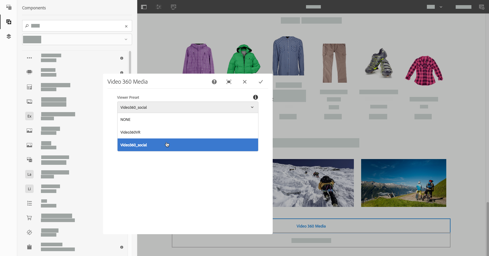

# Dynamic Media-elementen toevoegen aan pagina&#39;s{#adding-dynamic-media-assets-to-pages}

Als u de functionaliteit voor dynamische media wilt toevoegen aan assets die u op uw websites gebruikt, kunt u de component **Dynamische media**, **Interactieve media**, **Panoramische media** of **Video 360-media** rechtstreeks op de pagina toevoegen. U opent de modus Lay-out en schakelt de Dynamic Media-componenten in. Vervolgens voegt u deze componenten aan de pagina toe en voegt u elementen aan de component toe. De componenten voor dynamische media zijn slim: ze weten of u een afbeelding of een video toevoegt en de beschikbare configuratieopties veranderen dienovereenkomstig.

U voegt Dynamic Media-elementen rechtstreeks aan de pagina toe als u Experience Manager als uw WCM gebruikt. Als u een derde voor uw WCM gebruikt, of [link](/help/assets/dynamic-media/linking-urls-to-yourwebapplication.md) of [embed](/help/assets/dynamic-media/embed-code.md) uw activa. Zie [geoptimaliseerde afbeeldingen leveren aan een responsieve site](/help/assets/dynamic-media/responsive-site.md) voor een responsieve website van derden.

>[!NOTE]
>
>Zorg ervoor dat u elementen publiceert voordat u ze in Experience Manager aan pagina&#39;s toevoegt. Zie [Dynamic Media-middelen publiceren](/help/assets/dynamic-media/publishing-dynamicmedia-assets.md).

## Een Dynamic Media-component toevoegen aan een pagina {#adding-a-dynamic-media-component-to-a-page}

Het toevoegen van een 3D-mediacomponent, Dynamic Media, Interactieve media, Panoramische media, SmartCrop-video of Video 360-mediacomponent aan een pagina is hetzelfde als het toevoegen van een component aan een pagina.

**Een Dynamic Media-component aan een pagina toevoegen:**

1. Open in Experience Manager de pagina waaraan u de Dynamic Media-component wilt toevoegen.
1. Tik in het linkervenster op het pictogram **[!UICONTROL Components]** en filter vervolgens voor Dynamic Media.

   Als er geen lijst met Dynamic Media-componenten beschikbaar is, moet u waarschijnlijk de Dynamic Media-componenten inschakelen die u wilt gebruiken. Zie [Dynamic Media-componenten inschakelen](#enabling-dynamic-media-components).

   

1. Sleep een **[!UICONTROL Dynamic Media]** component en zet het neer op de gewenste plaats op de pagina.

1. Plaats de aanwijzer rechtstreeks op de component. Tik eenmaal om de werkbalk van de component weer te geven wanneer de component is omringd door een blauw vak. Tik op het pictogram **[!UICONTROL Configuration (wrench)]**.

   

1. Afhankelijk van de Dynamic Media-component die u op de pagina hebt neergezet, wordt een configuratiedialoogvenster geopend. [Stel de ](/help/assets/dynamic-media/adding-dynamic-media-assets-to-pages.md#dynamic-media-components) opties van de component naar wens in.

   In het onderstaande voorbeeld ziet u het dialoogvenster Dynamic Media **[!UICONTROL Video 360 Media]** en de opties die beschikbaar zijn in de vervolgkeuzelijst Voorinstelling viewer.

   

   De Dynamic Media Video 360 Media-component.

1. Tik op het vinkje om de wijzigingen op te slaan in de rechterbovenhoek van het dialoogvenster als u klaar bent.

### Dynamic Media-componenten {#enabling-dynamic-media-components} inschakelen

Als er geen Dynamic Media-componenten beschikbaar zijn om aan een pagina toe te voegen, betekent dit waarschijnlijk dat u de componenten moet inschakelen die u wilt gebruiken.

1. Open in Experience Manager de pagina waaraan u de Dynamic Media-component wilt toevoegen.
1. Tik links van de werkbalk naast de pagina op het pictogram Pagina-informatie en tik vervolgens op **[!UICONTROL Edit Template]** in de vervolgkeuzelijst.

   

1. Tik in de vervolgkeuzelijst rechts van de werkbalk naast de pagina op **[!UICONTROL Structure]**.

   

1. Tik onder aan de pagina op **[!UICONTROL Layout Container]** om de werkbalk te openen en tik vervolgens op het pictogram Beleid.
1. Controleer of op de pagina **[!UICONTROL Layout Container]** onder de kop **[!UICONTROL Properties]** het tabblad **[!UICONTROL Allowed Components]** is geselecteerd.

   

1. Schuif totdat u **[!UICONTROL Dynamic Media]** ziet.
1. Tik op het pictogram > links van **[!UICONTROL Dynamic Media]** en selecteer vervolgens de Dynamic Media-componenten die u wilt inschakelen.

   

1. Tik in de rechterbovenhoek van de pagina **[!UICONTROL Layout Container]** op het pictogram Done (vinkje).

1. Tik in de vervolgkeuzelijst rechts van de werkbalk naast de pagina op **[!UICONTROL Initial Content]**.
1. [Voeg zoals gewoonlijk een Dynamic Media-component toe aan een ](#adding-a-dynamic-media-component-to-a-page) pagina.

## Dynamic Media-componenten lokaliseren {#localizing-dynamic-media-components}

U kunt Dynamic Media-componenten op twee manieren lokaliseren:

* Open **[!UICONTROL Properties]** en selecteer het tabblad **[!UICONTROL Advanced]** op een webpagina in Sites. Selecteer de gewenste taal voor lokalisatie.

   

* Selecteer de gewenste pagina of paginagroep in de sitekiezer. Tik **[!UICONTROL Properties]** en selecteer het tabblad **[!UICONTROL Advanced]**. Selecteer de gewenste taal voor lokalisatie.

   >[!NOTE]
   >
   >Niet alle talen die beschikbaar zijn in het menu **[!UICONTROL Language]** hebben tokens die momenteel zijn toegewezen.

## Beschikbare Dynamic Media-componenten {#dynamic-media-components}

Dynamic Media-componenten zijn beschikbaar wanneer u op het **[!UICONTROL Components]**-pictogram tikt en vervolgens op **[!UICONTROL Dynamic Media]** filtert.

De volgende Dynamic Media-componenten zijn beschikbaar:

* **[!UICONTROL Dynamic Media]** - Wordt gebruikt voor assets zoals afbeeldingen, video, e-catalogi en spinsets.
* **[!UICONTROL Interactive Media]** - Wordt gebruikt voor interactieve elementen zoals interactieve video, interactieve afbeeldingen of carrouselsets.
* **[!UICONTROL Panoramic Media]** - Gebruik voor panoramische afbeeldingen of panoramische VR-afbeeldingselementen.
* **[!UICONTROL Video 360 Media]** - Wordt gebruikt voor 360 video- en 360 VR-video-elementen.

>[!NOTE]
>
>Deze componenten zijn niet standaard beschikbaar en moeten beschikbaar worden gemaakt in de sjablooneditor voordat u ze kunt gebruiken. Nadat zij in de malplaatjeredacteur ter beschikking worden gesteld, kunt u de componenten aan uw pagina toevoegen zoals u een andere component van de Experience Manager.

### Component: Dynamic Media {#dynamic-media-component}

De Dynamic Media-component is slim. Afhankelijk van het feit of u een afbeelding of video toevoegt, hebt u verschillende opties. De component ondersteunt voorinstellingen voor afbeeldingen, op afbeeldingen gebaseerde viewers, zoals afbeeldingssets, centrifuges, gemengde mediasets en video. Bovendien reageert de viewer hierop. De grootte van het scherm verandert automatisch op basis van de schermgrootte. Alle viewers zijn HTML5-viewers.

>[!NOTE]
>
>Als uw webpagina het volgende heeft:
>
>* Meerdere instanties van de Dynamic Media-component die op dezelfde pagina worden gebruikt.
>* Elke instantie gebruikt hetzelfde elementtype.

>
>
Het toewijzen van een andere viewervoorinstelling aan elke Dynamic Media-component op die pagina wordt niet ondersteund.
>
>U kunt echter dezelfde viewervoorinstelling gebruiken voor alle Dynamic Media-componenten die op de pagina elementen van hetzelfde type gebruiken.

Wanneer u de Dynamic Media-component toevoegt en **[!UICONTROL Dynamic Media Settings]** leeg is of wanneer u een element niet correct kunt toevoegen, controleert u het volgende:

* De afbeelding heeft een piramideTIFF-bestand. Afbeeldingen die worden geïmporteerd voordat u Dynamic Media inschakelt, beschikken niet over een TIFF-bestand met piramide.

#### Wanneer u werkt met afbeeldingen {#when-working-with-images}

Met de Dynamic Media-component kunt u dynamische afbeeldingen toevoegen, zoals afbeeldingssets, centrifuges en gemengde mediasets. U kunt inzoomen, uitzoomen en, indien van toepassing, een afbeelding binnen een centrifugeset draaien of een afbeelding van een ander type set selecteren.

U kunt de viewervoorinstelling, afbeeldingsvoorinstelling of afbeeldingsindeling ook rechtstreeks in de component configureren. Als u een afbeelding responsief wilt maken, kunt u de onderbrekingspunten instellen of een responsieve voorinstelling voor de afbeelding toepassen.

U kunt de volgende Dynamic Media-instellingen bewerken door op het pictogram **[!UICONTROL Edit]** in de component te tikken en vervolgens **[!UICONTROL Dynamic Media Settings]**.

>[!NOTE]
>
>Standaard is de afbeeldingscomponent voor dynamische media adaptief. Als u een vaste grootte wilt instellen, stelt u dit in de component op het tabblad **[!UICONTROL Advanced]** met **[!UICONTROL Width]** en **[!UICONTROL Height]** in.

* **[!UICONTROL Viewer preset]** - Selecteer een bestaande viewervoorinstelling in de vervolgkeuzelijst. Als de viewervoorinstelling die u zoekt niet zichtbaar is, moet u deze zichtbaar maken. Zie Viewer-voorinstellingen beheren. U kunt geen viewervoorinstelling selecteren als u een voorinstelling voor afbeeldingen gebruikt en omgekeerd.

   Dit is de enige optie die beschikbaar is als u afbeeldingssets, centrifuges of gemengde mediasets bekijkt. De weergegeven viewervoorinstellingen zijn ook slimme voorinstellingen voor relevante viewers.

* **[!UICONTROL Viewer modifiers]** - Viewer-modifiers hebben de vorm van name=value pair met een &amp;-scheidingsteken en laten u viewers wijzigen zoals beschreven in de Viewer Reference Guide. Een voorbeeld van een viewermodifier is `posterimage=img.jpg&caption=text.vtt,1`, die een andere afbeelding instelt voor de videominiatuur en een ondertitelingsbestand aan de video koppelt.

* **[!UICONTROL Image preset]** - Selecteer een bestaande voorinstelling voor de afbeelding in de vervolgkeuzelijst. Als de voorinstelling die u zoekt niet zichtbaar is, moet u deze zichtbaar maken. Zie Voorinstellingen afbeelding beheren. U kunt geen viewervoorinstelling selecteren als u een voorinstelling voor afbeeldingen gebruikt en omgekeerd.

   Deze optie is niet beschikbaar als u afbeeldingssets, centrifuges of gemengde mediasets bekijkt.

* **[!UICONTROL Image Modifiers]** - U kunt afbeeldingseffecten toepassen door meer afbeeldingsopdrachten te geven. Deze opdrachten worden beschreven in Voorinstellingen afbeelding en de verwijzing Opdracht Beeldserver.

   Deze optie is niet beschikbaar als u afbeeldingssets, centrifuges of gemengde mediasets bekijkt.

* **[!UICONTROL Breakpoints]** - Als u dit middel op een ontvankelijke plaats gebruikt, moet u de beeldbreekpunten toevoegen. Afbeeldingsonderbrekingspunten moeten worden gescheiden door komma&#39;s (,). Deze optie werkt wanneer er geen hoogte of breedte is gedefinieerd in een voorinstelling voor afbeeldingen.

   Deze optie is niet beschikbaar als u afbeeldingssets, centrifuges of gemengde mediasets bekijkt.

   U kunt de volgende Geavanceerde Montages uitgeven door **[!UICONTROL Edit]** in de component te tikken.

* **[!UICONTROL Title]** - Wijzig de titel van de afbeelding.

* **[!UICONTROL Alt Text]** - Voeg een titel aan de afbeelding toe voor gebruikers die afbeeldingen hebben uitgeschakeld.

   Deze optie is niet beschikbaar als u afbeeldingssets, centrifuges of gemengde mediasets bekijkt.

* **[!UICONTROL URL, Open in]** - U kunt een element zo instellen dat een koppeling wordt geopend. Stel de URL in en kies Openen in om aan te geven of deze in hetzelfde venster of in een nieuw venster moet worden geopend.

   Deze optie is niet beschikbaar als u afbeeldingssets, centrifuges of gemengde mediasets bekijkt.

* **[!UICONTROL Width]** - Voer een waarde in pixels in als u wilt dat de afbeelding een vaste grootte heeft. Als u deze waarde leeg laat, wordt het element adaptief.

* **[!UICONTROL Height]** - Voer een waarde in pixels in als u wilt dat de afbeelding een vaste grootte heeft. Als u deze waarde leeg laat, wordt het element adaptief.

#### Bij het werken met video {#when-working-with-video}

Met de Dynamic Media-component kunt u dynamische video toevoegen aan uw webpagina&#39;s. Wanneer u de component bewerkt, kunt u een vooraf gedefinieerde videoviewer gebruiken om de video op de pagina af te spelen.

U kunt de volgende Dynamic Media-instellingen bewerken door in de component op **[!UICONTROL Edit]** te klikken.

>[!NOTE]
>
>De Dynamic Media-videocomponent is standaard adaptief. Als u van het een vaste grootte wilt maken, plaats het in de component met **[!UICONTROL Width]** en **[!UICONTROL Height]** in **[!UICONTROL Advanced]** tabel.

* **[!UICONTROL Viewer preset]** - Selecteer een bestaande voorinstelling voor een videoviewer in de vervolgkeuzelijst. Als de viewervoorinstelling die u zoekt niet zichtbaar is, moet u deze zichtbaar maken. Zie Viewer-voorinstellingen beheren.

* **[!UICONTROL Viewer modifiers]** - Viewer-modifiers hebben de vorm van  `name=value` twee met een  `&` scheidingsteken. Hiermee kunt u viewers wijzigen zoals wordt beschreven in de naslaggids voor Adobe-viewers. Een voorbeeld van een viewermodifier is `posterimage=img.jpg&caption=text.vtt,1`

   Met vieweropties kunt u bijvoorbeeld het volgende doen:

   * Een bijschriftbestand koppelen aan een video: [caption](https://experienceleague.adobe.com/docs/dynamic-media-developer-resources/library/viewers-aem-assets-dmc/video/command-reference-url-video/r-html5-video-viewer-url-caption.html)
   * Een navigatiebestand koppelen aan een video: [navigatie](https://experienceleague.adobe.com/docs/dynamic-media-developer-resources/library/viewers-aem-assets-dmc/video/command-reference-url-video/r-html5-video-viewer-url-navigation.html)

      U kunt de volgende Geavanceerde Montages uitgeven door **[!UICONTROL Edit]** in de component te klikken.

* **[!UICONTROL Title]** - Wijzig de titel van de video.

* **[!UICONTROL Width]** - Voer een waarde in pixels in als u wilt dat de afbeelding een vaste grootte heeft. Als u deze waarde leeg laat, wordt het element adaptief.

* **[!UICONTROL Height]** - Voer een waarde in pixels in als u wilt dat de afbeelding een vaste grootte heeft. Als u deze waarde leeg laat, wordt het element adaptief.

#### Wanneer u werkt met Slim uitsnijden {#when-working-with-smart-crop}

Met de Dynamic Media-component kunt u SmartCrop-afbeeldingselementen toevoegen aan uw webpagina&#39;s. Wanneer u de component bewerkt, kunt u een vooraf gedefinieerde videoviewer gebruiken om de video op de pagina af te spelen.

Zie [Smart Crop gebruiken met Experience Manager Assets Dynamic Media](https://experienceleague.adobe.com/docs/experience-manager-learn/assets/dynamic-media/smart-crop-feature-video-use.html#dynamic-media)

Zie ook [Afbeeldingsprofielen](/help/assets/dynamic-media/image-profiles.md).

U kunt de volgende Dynamic Media-instelling bewerken door in de component op **[!UICONTROL Edit]** te klikken.

>[!NOTE]
>
>Standaard is de afbeeldingscomponent voor dynamische media adaptief. Als u een vaste grootte wilt instellen, stelt u dit in de component op het tabblad **[!UICONTROL Advanced]** met **[!UICONTROL Width]** en **[!UICONTROL Height]** in.

* **[!UICONTROL Image Modifiers]** - U kunt afbeeldingseffecten toepassen door meer afbeeldingsopdrachten te geven. Deze opdrachten worden beschreven in Voorinstellingen afbeelding en de verwijzing Opdracht Beeldserver.

   Deze optie is niet beschikbaar als u afbeeldingssets, centrifuges of gemengde mediasets bekijkt.

   U kunt de volgende Geavanceerde Montages uitgeven door **[!UICONTROL Edit]** in de component te klikken.

* **[!UICONTROL Enable Aspect Ration match]** - Selecteer deze optie als u wilt dat Dynamic Media een slimme uitsnijdvertoning kiest met een hoogte-breedteverhouding die het beste overeenkomt met de hoogte-breedteverhouding van de oorspronkelijke afbeelding.

* **[!UICONTROL Title]** - Wijzig de titel van de slimme-uitsnijdafbeelding.

* **[!UICONTROL Alt Text]** - Voeg een titel toe aan de slimme-uitsnijdafbeelding voor gebruikers die afbeeldingen hebben uitgeschakeld.

   Deze optie is niet beschikbaar als u afbeeldingssets, centrifuges of gemengde mediasets bekijkt.

* **[!UICONTROL URL, Open in]** - U kunt een element zo instellen dat een koppeling wordt geopend. Stel de URL in en kies Openen in om aan te geven of deze in hetzelfde venster of in een nieuw venster moet worden geopend.

   Deze optie is niet beschikbaar als u afbeeldingssets, centrifuges of gemengde mediasets bekijkt.

* **[!UICONTROL Width]** - Voer een waarde in pixels in als u wilt dat de afbeelding een vaste grootte heeft. Als u deze waarde leeg laat, wordt het element adaptief.

* **[!UICONTROL Height]** - Voer een waarde in pixels in als u wilt dat de afbeelding een vaste grootte heeft. Als u deze waarde leeg laat, wordt het element adaptief.

### Component: Interactieve media {#interactive-media-component}

De interactieve component van Media is voor die activa die interactiviteit op hen zoals hotspots of beeldkaarten hebben. Als u een interactieve afbeelding, interactieve video of carrouselbanner hebt, gebruikt u de component **[!UICONTROL Interactive Media]**.

De component Interactieve media is slim. Afhankelijk van het feit of u een afbeelding of video toevoegt, hebt u verschillende opties. Bovendien reageert de viewer snel. De grootte van het scherm wordt automatisch aangepast op basis van de schermgrootte. Alle viewers zijn HTML5-viewers.

>[!NOTE]
>
>Als uw webpagina het volgende heeft:
>
>* Meerdere instanties van de component Interactive Media die op dezelfde pagina worden gebruikt.
>* Elke instantie gebruikt hetzelfde elementtype.

>
>
Het toewijzen van een andere viewervoorinstelling aan elke interactieve mediacomponent op die pagina wordt niet ondersteund.
>
>U kunt echter dezelfde viewervoorinstelling gebruiken voor alle interactieve mediacomponenten die op de pagina elementen van hetzelfde type gebruiken.

U kunt de volgende **[!UICONTROL General]** montages uitgeven door **[!UICONTROL Edit]** in de component te tikken.

* **[!UICONTROL Viewer preset]** - Selecteer een bestaande viewervoorinstelling in de vervolgkeuzelijst. Als de viewervoorinstelling die u zoekt niet zichtbaar is, moet u deze zichtbaar maken. Voorinstellingen voor viewers moeten worden gepubliceerd voordat ze kunnen worden gebruikt. Zie Viewer-voorinstellingen beheren.

* **[!UICONTROL Title]** - Wijzig de titel van de video.

* **[!UICONTROL Width]** - Voer een waarde in pixels in als u wilt dat de afbeelding een vaste grootte heeft. Als u deze waarde leeg laat, wordt het element adaptief.

* **[!UICONTROL Height]** - Voer een waarde in pixels in als u wilt dat de afbeelding een vaste grootte heeft. Als u deze waarde leeg laat, wordt het element adaptief.

   U kunt de volgende **[!UICONTROL Add To Cart]** montages uitgeven door **[!UICONTROL Edit]** in de component te klikken.

* **[!UICONTROL Show Product Asset]** - Deze waarde is standaard geselecteerd. Het productelement toont een afbeelding van het product zoals gedefinieerd in de module Handel. Schakel het vinkje uit om het productelement niet weer te geven.

* **[!UICONTROL Show Product Price]** - Deze waarde is standaard geselecteerd. De prijs van het product is de prijs van het object zoals gedefinieerd in de module Handel. Schakel het vinkje uit om de productprijs niet weer te geven.

* **[!UICONTROL Show Product Form]** - Deze waarde is standaard niet geselecteerd. Het productformulier bevat alle productvarianten zoals grootte en kleur. Schakel het vinkje uit om de productvarianten niet weer te geven.

### Component: Panoramische media {#panoramic-media-component}

Panoramische media-component is bedoeld voor die elementen die bolvormige panoramische afbeeldingen zijn. Dergelijke afbeeldingen bieden een kijkervaring van 360° voor een ruimte, eigenschap, locatie of landschap. Een afbeelding kan alleen als bolvormig panorama worden beschouwd als de afbeelding een van de volgende opties of beide heeft:

* Een hoogte-breedteverhouding van 2:1.
* Gelabeld met de trefwoorden `equirectangular` of (`spherical` + `panorama`) of (`spherical` + `panoramic`). Zie [Tags gebruiken](/help/sites-cloud/authoring/features/tags.md).

Zowel de criteria voor hoogte-breedteverhouding als voor trefwoorden zijn van toepassing op panoramische assets voor de pagina met assetdetails en de **[!UICONTROL Panoramic Media]** WCM-component.

>[!NOTE]
>
>Als uw webpagina het volgende heeft:
>
>* Meerdere instanties van de component **[!UICONTROL Panoramic Media]** die op dezelfde pagina worden gebruikt.
>* Elke instantie gebruikt hetzelfde elementtype.

>
>
Het toewijzen van een andere viewervoorinstelling aan elke **[!UICONTROL Panoramic Media]**-component op die pagina wordt niet ondersteund.
>
>U kunt echter dezelfde viewervoorinstelling gebruiken voor alle Panoramische Media-componenten die elementen van hetzelfde type gebruiken, op de pagina.

U kunt de volgende instelling bewerken door te tikken op **[!UICONTROL Configure]** in de component.

* **[!UICONTROL Viewer Preset]** - Selecteer een bestaande viewer in de vervolgkeuzelijst met voorinstellingen voor viewer.

Als de viewervoorinstelling die u zoekt niet zichtbaar is, controleert u of deze is gepubliceerd. Publiceer viewervoorinstellingen voordat u deze gebruikt. Zie [Viewer-voorinstellingen beheren](/help/assets/dynamic-media/managing-viewer-presets.md).

### Component: Video 360 Media {#video-media-component}

Met de component **[!UICONTROL Video 360 Media]** kunt u rechthoekige video op uw webpagina renderen. Dit zorgt voor een indrukwekkende kijkervaring van een kamer, eigenschap, locatie, landschap of medische procedure.

Tijdens het afspelen op een plat beeldscherm heeft de gebruiker controle over de kijkhoek; Bij het afspelen op mobiele apparaten worden doorgaans de ingebouwde gyroscopische besturingselementen gebruikt.

De viewer bevat native ondersteuning voor de levering van 360 video-elementen. Standaard is geen aanvullende configuratie nodig voor weergave of afspelen. U levert 360 Video gebruikend standaardvideouitbreidingen zoals .mp4, .mkv, en .mov. De meest algemene codec is H.264.

U kunt de volgende instelling bewerken door te tikken op **[!UICONTROL Configure]** in de component.

* **[!UICONTROL Viewer Preset]** - Selecteer een bestaande viewer in de vervolgkeuzelijst met voorinstellingen voor viewer. Gebruik Video360VR voor eindgebruikers die een virtuele realiteitsbril gebruiken. Bevat basisbesturingselementen voor het afspelen van video en functies voor sociale media. Gebruik Video360_social, die basisbesturingselementen voor het afspelen van video bevat. Video renderen wordt uitgevoerd in de stereomodus. Handmatige zichtpuntcontrole is uitgeschakeld, maar gyroscopische controle is ingeschakeld. Er zijn geen functies voor sociale media.

Als de viewervoorinstelling die u zoekt niet zichtbaar is, controleert u of deze is gepubliceerd. Publiceer viewervoorinstellingen voordat u deze gebruikt. Zie [Viewer-voorinstellingen beheren](/help/assets/dynamic-media/managing-viewer-presets.md).

### HTTP/2 gebruiken om Dynamic Media-elementen {#using-http-to-delivery-dynamic-media-assets} te leveren

HTTP/2 is het nieuwe, bijgewerkte webprotocol dat de manier verbetert waarop browsers en servers communiceren. Het zorgt voor een snellere overdracht van informatie en vermindert de hoeveelheid verwerkingskracht die nodig is. De levering van Dynamic Media-middelen kan nu plaatsvinden via HTTP/2, wat betere responstijd en laadtijden biedt.

Zie [HTTP2 Levering van Inhoud](/help/assets/dynamic-media/http2faq.md) voor volledige informatie over het gaan gebruiken van HTTP/2 met uw Dynamic Media-account.

>[!MORELIKETHIS]
>
>* [De videospeler gebruiken in Experience Manager Dynamic Media](https://experienceleague.adobe.com/docs/experience-manager-learn/assets/dynamic-media/dynamic-media-video-player-feature-video-use.html#dynamic-media)
>* [Interactieve video gebruiken met Experience Manager Dynamic Media](https://experienceleague.adobe.com/docs/experience-manager-learn/assets/dynamic-media/dynamic-media-interactive-video-feature-video-use.html#dynamic-media)
>* [De Asset Viewer begrijpen met Experience Manager Dynamic Media](https://experienceleague.adobe.com/docs/experience-manager-learn/assets/dynamic-media/dynamic-media-viewer-feature-video-understand.html#dynamic-media)
>* [Aangepaste videominiatuur gebruiken met Experience Manager Dynamic Media](https://experienceleague.adobe.com/docs/experience-manager-learn/assets/dynamic-media/dynamic-media-video-thumbnails-feature-video-use.html#dynamic-media)
>* [Werken met kleurbeheer met Experience Manager Dynamic Media](https://experienceleague.adobe.com/docs/experience-manager-learn/assets/dynamic-media/dynamic-media-color-management-technical-video-setup.html#dynamic-media)
>* [Afbeelding verscherpen gebruiken met Experience Manager Dynamic Media](https://experienceleague.adobe.com/docs/experience-manager-learn/assets/dynamic-media/dynamic-media-image-sharpening-feature-video-use.html#dynamic-media)

