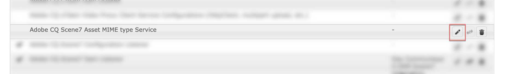

# Informatie over het configureren van Dynamic Media Cloud Service {#configuring-dynamic-media}

{{work-with-dynamic-media}}

Als u Adobe Experience Manager voor verschillende omgevingen gebruikt, zoals ontwikkeling, staging en live productie, configureert u Dynamic Media-Cloud Servicen voor elk van deze omgevingen.

Zie ook [ een het bedrijfalias rekening van Dynamic Media ](/help/assets/dynamic-media/dm-alias-account.md) vormen

## Architectuurdiagram van Dynamic Media {#architecture-diagram-of-dynamic-media}

In het volgende architectuurdiagram wordt beschreven hoe Dynamic Media werkt.

Met de nieuwe architectuur is Experience Manager verantwoordelijk voor primaire bronactiva en syncs met Dynamic Media voor activa verwerking en het publiceren:

1. Wanneer het primaire bronelement naar Adobe Experience Manager as a Cloud Service wordt geüpload, wordt het naar Dynamic Media gerepliceerd. Op dat moment verwerkt Dynamic Media alle processen voor het genereren van elementen, zoals videocodering en dynamische varianten van een afbeelding.
1. Nadat de vertoningen worden geproduceerd, kunnen de as a Cloud Service van de Experience Manager veilig tot de verre vertoningen van Dynamic Media toegang hebben en voorproef (geen binaire getallen worden teruggestuurd naar de as a Cloud Service instantie van de Experience Manager).
1. Nadat de inhoud klaar is om te publiceren en goed te keuren, brengt het de dienst van Dynamic Media teweeg om inhoud aan leveringsservers en geheim voorgeheugeninhoud bij CDN (het Netwerk van de Levering van de Inhoud) te duwen.

>[!NOTE]
>
>Voor de volgende lijst met functies moet u de CDN uit de doos gebruiken die is gebundeld met Adobe Experience Manager - Dynamic Media. Een andere aangepaste CDN wordt niet ondersteund met deze functies.
>
>* [Smart Imaging](/help/assets/dynamic-media/imaging-faq.md)
>* [ de ongeldigverklaring van het Geheime voorgeheugen ](/help/assets/dynamic-media/invalidate-cdn-cache-dynamic-media.md)
>* [ Hotlink bescherming ](/help/assets/dynamic-media/hotlink-protection.md)
>* [ HTTP/2 levering van inhoud ](/help/assets/dynamic-media/http2faq.md)
>* URL omleiden op CDN-niveau
>* Akamai ChinaCDN (voor optimale levering in China)

<!-- OBSOLETE CONTENT

## (Optional) Migrating Dynamic Media presets and configurations from 6.3 to 6.5 Zero Downtime {#optional-migrating-dynamic-media-presets-and-configurations-from-to-zero-downtime}

If you are upgrading Experience Manager as a Cloud Service Dynamic Media from 6.3 to 6.4 or 6.5 (which now includes the ability for zero downtime deployments), you are required to run the following curl command to migrate all your presets and configurations from `/etc` to `/conf` in CRXDE Lite.

>[!NOTE]
>
>If you run your Experience Manager as a Cloud Service instance in compatibility mode--that is, you have the compatibility packaged installed--you do not need to run these commands.

For all upgrades, either with or without the compatibility package, you can copy the default, out-of-the-box viewer presets that originally came with Dynamic Media by running the following Linux curl command:

`curl -u admin:admin -X POST https://<server_address>:<server_port>/libs/settings/dam/dm/presets/viewer.pushviewerpresets.json`

To migrate any custom viewer presets and configurations that you have created from `/etc` to `/conf`, run the following Linux curl command:

`curl -u admin:admin -X POST https://<server_address>:<server_port>/libs/settings/dam/dm/presets.migratedmcontent.json`

-->

## Een Dynamic Media-configuratie maken in Cloud Servicen {#configuring-dynamic-media-cloud-services}

<!-- **Before you creating a Dynamic Media Configuration in Cloud Services**: After you receive your provisioning email with Dynamic Media credentials, you must open the [Dynamic Media Classic desktop application](https://experienceleague.adobe.com/docs/dynamic-media-classic/using/getting-started/signing-out.html#getting-started), then sign in to your account to change your password. The password provided in the provisioning email is system-generated and intended to be a temporary password only. It is important that you update the password so that Dynamic Media Cloud Service is set up with the correct credentials. -->

1. In Experience Manager as a Cloud Service, selecteer het as a Cloud Service embleem van de Experience Manager om tot de globale navigatieconsole toegang te hebben.
1. Selecteer links van de console het pictogram Gereedschappen en ga naar **[!UICONTROL Cloud Services > Dynamic Media Configuration]** .
1. Selecteer **[!UICONTROL global]** op de pagina Dynamic Media Configuration Browser in het linkerdeelvenster (selecteer niet het mappictogram links van **[!UICONTROL global]** ). Selecteer vervolgens **[!UICONTROL Create]** .
1. Voer op de pagina **[!UICONTROL Create Dynamic Media Configuration]** de titel, het e-mailadres van de Dynamic Media-account en het wachtwoord van de bedrijfsbeheerder van de Dynamic Media-account in en selecteer vervolgens uw regio. Deze informatie wordt u per Adobe verstrekt in de levering e-mail. Neem contact op met de klantenondersteuning van de Adobe als u dit e-mailbericht niet hebt ontvangen.
1. Selecteer **[!UICONTROL Connect to Dynamic Media]** .
1. Voer in het veld **[!UICONTROL New Password]** in het dialoogvenster **[!UICONTROL Change Password]** een nieuw wachtwoord in dat uit 8-25 tekens bestaat. Het wachtwoord moet ten minste een van de volgende elementen bevatten:

   * Hoofdletter
   * Kleine letter
   * Getal
   * Speciaal teken: `# $ & . - _ : { }`

   Het veld **[!UICONTROL Current Password]** wordt opzettelijk voorgevuld en verborgen voor interactie.

   Indien nodig kunt u de spelling controleren van een wachtwoord dat u hebt getypt of dat u opnieuw hebt getypt door het oogpictogram voor het wachtwoord te selecteren om het wachtwoord weer te geven. Selecteer opnieuw het pictogram om het wachtwoord te verbergen.

1. Typ in het veld **[!UICONTROL Repeat Password]** het nieuwe wachtwoord opnieuw en selecteer vervolgens **[!UICONTROL Done]** .

   Het nieuwe wachtwoord wordt opgeslagen wanneer u **[!UICONTROL Save]** in de rechterbovenhoek van de pagina **[!UICONTROL Create Dynamic Media Configuration]** selecteert.

   Als u **[!UICONTROL Cancel]** hebt geselecteerd in het dialoogvenster **[!UICONTROL Change Password]** , moet u nog steeds een nieuw wachtwoord invoeren wanneer u de gemaakte Dynamic Media-configuratie opslaat.

   Zie ook [ Verandering het wachtwoord in Dynamic Media ](#change-dm-password).

1. Wanneer de verbinding tot stand is gebracht, kunt u het volgende instellen:

   | Eigenschap | Beschrijving |
   |---|---|
   | Bedrijf | De naam van de Dynamic Media-account. **Belangrijk**: Slechts één Configuratie van Dynamic Media in Cloud Servicen wordt gesteund op een geval van Experience Manager; voeg niet meer dan één configuratie toe. De veelvoudige Configuraties van Dynamic Media op een instantie van de Experience Manager worden _niet_ gesteund of door Adobe geadviseerd.<!-- CQDOC-19579 and CQDOC-19612 -->  zie ook [ een het bedrijfalias rekening van Dynamic Media ](/help/assets/dynamic-media/dm-alias-account.md) vormen. |
   | Pad naar hoofdmap van bedrijf | Het pad naar de hoofdmap van uw bedrijf. |
   | Assets publiceren | U kunt uit de volgende drie opties kiezen: **[!UICONTROL Immediately]**- wanneer de activa worden geupload, neemt het systeem de activa op en verstrekt onmiddellijk URL/Embed. Er is geen tussenkomst van de gebruiker nodig om elementen te publiceren. **[!UICONTROL On Activation]** - U moet het element eerst expliciet publiceren voordat er een koppeling URL/Insluiten wordt opgegeven. **[!UICONTROL Selective Publish]**- Assets wordt automatisch gepubliceerd voor een beveiligde voorvertoning. Zij kunnen ook uitdrukkelijk aan Experience Manager as a Cloud Service worden gepubliceerd zonder aan DMS7 voor levering in het openbare domein te publiceren. In de toekomst is deze optie bedoeld om elementen te publiceren naar Experience Manager as a Cloud Service en om elementen te publiceren naar Dynamic Media, die elkaar wederzijds uitsluiten. Met andere woorden, u kunt elementen publiceren naar DMS7 zodat u functies als Slim uitsnijden of dynamische uitvoeringen kunt gebruiken. Of u kunt elementen uitsluitend publiceren in Experience Manager as a Cloud Service voor voorvertoning; deze elementen worden niet gepubliceerd in DMS7 voor levering in het publieke domein. |
   | Secure Preview Server | Hier kunt u het URL-pad naar de voorvertoningsserver voor veilige vertoningen opgeven. Dat wil zeggen dat nadat uitvoeringen zijn gegenereerd, Experience Manager as a Cloud Service veilig de externe Dynamic Media-uitvoeringen kan openen en bekijken (er worden geen binaire bestanden teruggestuurd naar de as a Cloud Service instantie van de Experience Manager).  tenzij u een speciale regeling hebt om de server van uw eigen bedrijf of een speciale server te gebruiken, adviseert de Adobe dat u dit het plaatsen zoals gespecificeerd verlaat. |
   | Alle inhoud synchroniseren | Standaard geselecteerd. Schakel deze optie uit als u elementen selectief wilt opnemen in of uitsluiten van de synchronisatie met Dynamic Media. Als u deze optie uitschakelt, kunt u kiezen uit de volgende twee Dynamic Media-synchronisatiemodi: **[!UICONTROL Dynamic Media sync mode]** **[!UICONTROL Enable by default]**- De configuratie wordt standaard toegepast op alle mappen, tenzij u een specifieke map markeert voor uitsluiting.<!-- you can then deselect the folders that you do not want the configuration applied to.--> **[!UICONTROL Disabled by default]** - De configuratie wordt pas op een map toegepast als u een geselecteerde map expliciet markeert voor synchronisatie met Dynamic Media.  om een geselecteerde omslag voor synchronisatie aan Dynamic Media te merken, selecteer een activaomslag, dan in de toolbar, uitgezochte **[!UICONTROL Properties]**. Kies op het tabblad **[!UICONTROL Details]** in de vervolgkeuzelijst **[!UICONTROL Dynamic Media sync mode]** een van de volgende drie opties. Selecteer **[!UICONTROL Save]** als u klaar bent. _Herinner me: deze drie opties zijn niet beschikbaar als u **Synchroniseer alle inhoud**vroeger selecteerde._ zie ook [ Werk met Selectieve Publish op het omslagniveau in Dynamic Media ](/help/assets/dynamic-media/selective-publishing.md). **[!UICONTROL Inherited]**- Geen expliciete synchronisatiewaarde in de map. In plaats daarvan neemt de map de synchronisatiewaarde over van een van de bovenliggende mappen of de standaardmodus in de cloudconfiguratie. De gedetailleerde status voor overgeërfde toont dit als knopinfo. **[!UICONTROL Enable for subfolders]** - Neem alles op in deze substructuur voor synchronisatie met Dynamic Media. De mapspecifieke instellingen overschrijven de standaardmodus in de cloudconfiguratie. **[!UICONTROL Disabled for subfolders]**- Sluit alles in deze substructuur uit van synchroniseren naar Dynamic Media. |

   >[!NOTE]
   >
   >Er is geen ondersteuning voor versiebeheer in Dynamische media. Uitgestelde activering is ook alleen van toepassing als **[!UICONTROL Publish Assets]** in de pagina Dynamic Media-configuratie bewerken is ingesteld op **[!UICONTROL Upon Activation]** . En dan, slechts tot de eerste keer wordt het middel geactiveerd.
   >
   >
   >Nadat een middel wordt geactiveerd, worden om het even welke updates onmiddellijk gepubliceerd live aan S7 Levering.

   

1. Selecteer **[!UICONTROL Save]**. Het nieuwe Dynamic Media-wachtwoord en de nieuwe configuratie worden opgeslagen. Als u in plaats daarvan **[!UICONTROL Cancel]** hebt geselecteerd, wordt het wachtwoord niet bijgewerkt.
1. Selecteer in het dialoogvenster **[!UICONTROL Configuring Dynamic Media]** de optie **[!UICONTROL OK]** om de configuratie te starten.

   >[!IMPORTANT]
   >
   >Wanneer de nieuwe configuratie van Dynamic Media zijn opstelling beëindigt, ontvangt u een statusbericht binnen Experience Manager as a Cloud Service Inbox.
   >
   >Dit Inbox bericht deelt u als de configuratie of succesvol of niet was.
   > Zie [ problemen oplossen een nieuwe configuratie van Dynamic Media ](#troubleshoot-dm-config) en [ Uw Inbox ](/help/sites-cloud/authoring/inbox.md) voor meer informatie.

1. Als u Dynamic Media-inhoud veilig wilt voorvertonen voordat deze wordt gepubliceerd, gebruikt Experience Manager as a Cloud Service op token gebaseerde validatie en wordt Dynamic Media-inhoud standaard voorvertoond door de auteur van de Experience Manager. Nochtans, kunt u *meer IPs van de lijst van gewenste personen*  om gebruikers toegang tot veilig voorproefinhoud te verlenen. Aan opstelling deze actie in as a Cloud Service Experience Manager, zie [ Dynamic Media Publish Opstelling voor de Server van het Beeld - het lusje van de Veiligheid vormen ](/help/assets/dynamic-media/dm-publish-settings.md#security-tab). <!-- To securely preview Dynamic Media content before it gets published, you must "allowlist" the Experience Manager as a Cloud Service author instance to connect to Dynamic Media. To set up this action, do the following: -->

<!--
    * Open the [Dynamic Media Classic desktop application](https://experienceleague.adobe.com/docs/dynamic-media-classic/using/getting-started/signing-out.html#getting-started), then sign in to your account. Your credentials and sign-in details were provided by Adobe at the time of provisioning. If you do not have this information, contact Adobe Customer Support.
    * On the navigation bar near the upper right corner of the page, go to **[!UICONTROL Setup]** > **[!UICONTROL Application Setup]** > **[!UICONTROL Publish Setup]** > **[!UICONTROL Image Server]**.
    * On the Image Server Publish page, in the **[!UICONTROL Publish Context]** drop-down list, select **[!UICONTROL Test Image Serving]**.
    * For the Client Address Filter, select **[!UICONTROL Add]**.
    * To enable (turn on) the address, select the check box, then enter the IP address of the Experience Manager Author instance (not Dispatcher IP).
    * Select **[!UICONTROL Save]**. -->

U bent nu klaar met de basisconfiguratie. U kunt Dynamic Media gebruiken.

Als u uw configuratie, zoals het toelaten van ACL (de Lijst van het Toegangsbeheer) toestemmingen verder wilt aanpassen, kunt u naar keuze om het even welke taken voltooien onder [ Geavanceerde Montages in Dynamic Media ](#optional-configuring-advanced-settings-in-dynamic-media-scene-mode) vormen.

### Een nieuwe Dynamic Media-configuratie oplossen {#troubleshoot-dm-config}

Wanneer een nieuwe configuratie van Dynamic Media zijn opstelling beëindigt, ontvangt u een statusbericht binnen Experience Manager as a Cloud Service Inbox. Deze melding geeft aan of de configuratie is gelukt of niet, zoals in de volgende afbeeldingen in het Postvak In wordt getoond.

Zie ook [ Uw Inbox ](/help/sites-cloud/authoring/inbox.md).

**om een nieuwe configuratie van Dynamic Media problemen op te lossen:**

1. Selecteer in de rechterbovenhoek van de as a Cloud Service pagina Experience Manager het belpictogram en selecteer vervolgens **[!UICONTROL View All]** .
1. Voor de Inbox pagina, selecteer het succesbericht om een overzicht van de status en de logboeken van de configuratie te lezen.

   Als de configuratie ontbrak, selecteer het mislukkingsbericht gelijkend op het volgende screenshot.

   

1. Controleer op de pagina **[!UICONTROL DMSETUP]** de configuratiedetails die de fout beschrijven. Let met name op foutberichten of foutcodes. Neem contact op met de Klantenondersteuning van de Adobe voor deze informatie.

   

### Het wachtwoord wijzigen in Dynamic Media {#change-dm-password}

Het verlopen van wachtwoorden in Dynamic Media is ingesteld op 100 jaar vanaf de huidige systeemdatum.

Het wachtwoord moet ten minste een van de volgende elementen bevatten:

* Hoofdletter
* Kleine letter
* Getal
* Speciaal teken: `# $ & . - _ : { }`

Indien nodig kunt u de spelling controleren van een wachtwoord dat u hebt getypt of dat u opnieuw hebt getypt door het oogpictogram voor het wachtwoord te selecteren om het wachtwoord weer te geven. Selecteer opnieuw het pictogram om het wachtwoord te verbergen.

Het gewijzigde wachtwoord wordt opgeslagen wanneer u **[!UICONTROL Save]** in de rechterbovenhoek van de pagina **[!UICONTROL Edit Dynamic Media Configuration]** selecteert.

1. In Experience Manager as a Cloud Service, selecteer het as a Cloud Service embleem van de Experience Manager om tot de globale navigatieconsole toegang te hebben.
1. Selecteer links van de console het pictogram Gereedschappen en ga naar **[!UICONTROL Cloud Services > Dynamic Media Configuration]** .
1. Selecteer **[!UICONTROL global]** in het linkerdeelvenster van de Dynamic Media Configuration Browser-pagina. Selecteer het mappictogram links van **[!UICONTROL global]** niet. Selecteer vervolgens **[!UICONTROL Edit]** .
1. Selecteer op de pagina **[!UICONTROL Edit Dynamic Media Configuration]** direct onder het veld **[!UICONTROL Password]** de optie **[!UICONTROL Change Password]** .
1. Ga als volgt te werk in het dialoogvenster **[!UICONTROL Change Password]** :

   * Voer in het veld **[!UICONTROL New Password]** een nieuw wachtwoord in.

     Het veld **[!UICONTROL Current Password]** wordt opzettelijk voorgevuld en verborgen voor interactie.

   * Typ in het veld **[!UICONTROL Repeat Password]** het nieuwe wachtwoord opnieuw en selecteer vervolgens **[!UICONTROL Done]** .

1. Selecteer **[!UICONTROL Save]** in de rechterbovenhoek van de pagina **[!UICONTROL Edit Dynamic Media Configuration]** en selecteer vervolgens **[!UICONTROL OK]** .

## (Optioneel) Geavanceerde instellingen configureren in Dynamic Media{#optional-configuring-advanced-settings-in-dynamic-media-scene-mode}

Om de configuratie en de opstelling van Dynamic Media verder aan te passen, of zijn prestaties te optimaliseren, kunt u één of meer van de volgende _facultatieve_ taken voltooien:

* [(Optioneel) ACL-machtigingen inschakelen in Dynamic Media](#optional-enable-acl)
* [(Optioneel) Dynamic Media-instellingen instellen en configureren](#optional-setup-and-configuration-of-dynamic-media-scene-mode-settings)
* [(Optioneel) Pas de prestaties van Dynamic Media aan](#optional-tuning-the-performance-of-dynamic-media-scene-mode)

<!--

* [(Optional) Filtering assets for replication](#optional-filtering-assets-for-replication)

-->

### (Optioneel) De toegangsbeheerlijst inschakelen in Dynamic Media {#optional-enable-acl}

Wanneer u Dynamic Media op AEM in werking stelt, stuurt het momenteel `/is/image` verzoeken om het Beeld van de Voorproef te beveiligen die zonder ACL (de Lijst van het Toegangsbeheer) toestemmingen op PlatformServerServlet te controleren. U kunt, echter, __ ACL toestemmingen toelaten. Hiermee stuurt u de geautoriseerde `/is/image` -aanvragen door. Als een gebruiker niet gemachtigd is om toegang te krijgen tot het middel, wordt de fout &quot;403 - Verboden&quot; weergegeven.

**om ACL toestemmingen in Dynamic Media toe te laten:**

1. Navigeer vanuit Experience Manager naar **[!UICONTROL Tools]** > **[!UICONTROL Operations]** > **[!UICONTROL Web Console]** .

   

1. Er wordt een nieuw browsertabblad geopend voor de pagina **[!UICONTROL Adobe Experience Manager Web Console Configuration]** .

   

1. Voor de pagina, scrol aan de naam _Adobe CQ Scene7 PlatformServer_.

1. Rechts van de naam selecteert u het potloodpictogram (**[!UICONTROL Edit the configuration values]**).

1. Voor de **com.adobe.cq.dam.s7imaging.impl.ps.PlatformServerServlet.name** pagina, selecteer de controledoos voor de volgende twee montages:

   * `com.adobe.cq.dam.s7imaging.impl.ps.PlatformServerServlet.cache.enable.name` - Als deze instelling is ingeschakeld, wordt de toestemming voor het opslaan gedurende twee minuten (standaard) in cache geplaatst.
   * `com.adobe.cq.dam.s7imaging.impl.ps.PlatformServerServlet.validate.userAccess.name` - Als deze instelling is ingeschakeld, wordt de toegang van een gebruiker gevalideerd terwijl deze elementen voorvertoont via Dynamic Media Image Server.

   

1. Selecteer **[!UICONTROL Save]** in de rechterbenedenhoek van de pagina.

### (Optioneel) Dynamic Media-instellingen instellen en configureren {#optional-setup-and-configuration-of-dynamic-media-scene-mode-settings}

Met de Dynamic Media Classic-gebruikersinterface kunt u uw Dynamic Media-instellingen wijzigen.

<!-- Some of the tasks above require that you open the [Dynamic Media Classic desktop application](https://experienceleague.adobe.com/docs/dynamic-media-classic/using/getting-started/signing-out.html#getting-started), then sign in to your account. -->

De taken van de opstelling en van de configuratie omvatten het volgende:

* [Dynamic Media Publish Setup (-instelling voor imageserver) configureren](#publishing-setup-for-image-server)
* [Algemene instellingen van Dynamic Media configureren](#configuring-application-general-settings)
* [Kleurbeheer configureren](#configuring-color-management)
* [MIME-typen bewerken voor ondersteunde indelingen](#editing-mime-types-for-supported-formats)
* [MIME-typen toevoegen voor niet-ondersteunde indelingen](#adding-mime-types-for-unsupported-formats)
<!-- OBSOLETE BUT LEAVE FOR POSSIBLE FUTURE* [Creating batch set presets to auto-generate Image Sets and Spin Sets](#creating-batch-set-presets-to-auto-generate-image-sets-and-spin-sets) -->

#### Dynamic Media Publish Setup (-instelling voor imageserver) configureren {#publishing-setup-for-image-server}

Op de pagina Dynamic Media Publish Setup worden standaardinstellingen vastgelegd die bepalen hoe elementen van Adobe Dynamic Media-servers worden geleverd aan websites of toepassingen.

Zie [ Dynamic Media Publish Opstelling voor de Server van het Beeld vormen ](/help/assets/dynamic-media/dm-publish-settings.md).

#### Algemene instellingen van Dynamic Media configureren {#configuring-application-general-settings}

Configureer de Dynamic Media **[!UICONTROL Publish Server Name]** URL en de **[!UICONTROL Origin Server Name]** URL. U kunt ook **[!UICONTROL Upload to Application]** instellingen opgeven en **[!UICONTROL Default Upload Options]** allemaal op basis van uw specifieke gebruiksscenario.

Zie [ Dynamic Media Algemene Montages ](/help/assets/dynamic-media/dm-general-settings.md) vormen.

#### Kleurbeheer configureren {#configuring-color-management}

Met Dynamic Media-kleurbeheer kunt u correcte elementen kleuren. Met kleurcorrectie behouden ingesloten elementen hun kleurruimte (RGB, CMYK, Grijs) en ingesloten kleurprofiel. Wanneer u een dynamische uitvoering aanvraagt, wordt de afbeeldingskleur met CMYK-, RGB- of grijsuitvoer gecorrigeerd naar de doelkleurruimte.

Zie [ Beeld vormen vooraf instelt ](/help/assets/dynamic-media/managing-image-presets.md).

De standaardkleureigenschappen configureren voor het inschakelen van kleurcorrectie bij het aanvragen van afbeeldingen:

1. Open de [ Desktoptoepassing van Dynamic Media Classic ](https://experienceleague.adobe.com/docs/dynamic-media-classic/using/getting-started/signing-out.html#getting-started), dan login aan uw rekening gebruikend geloofsbrieven die tijdens levering worden verstrekt.
1. Ga naar **[!UICONTROL Setup > Application Setup]** .
1. Vouw het gebied **[!UICONTROL Publish Setup]** uit en selecteer **[!UICONTROL Image Server]**. Stel **[!UICONTROL Publish Context]** in op **[!UICONTROL Image Serving]** wanneer u standaardinstellingen voor publicatie-exemplaren instelt.
1. Blader naar de eigenschap die u moet wijzigen, bijvoorbeeld een eigenschap in het gebied **[!UICONTROL Color Management Attributes]** .
U kunt de volgende eigenschappen voor kleurcorrectie instellen:

   | Eigenschap | Beschrijving |
   |---|---|
   | CMYK-standaardkleurruimte | Naam van het standaard CMYK-kleurprofiel. |
   | Standaardkleurruimte grijswaarden | Naam van het standaardkleurprofiel Grijs. |
   | RGB, standaardkleurruimte | Naam van het standaardkleurprofiel RGB. |
   | Render-intentie kleurconversie | Geeft de render-intentie aan. Acceptabele waarden zijn: **[!UICONTROL perceptual]** , **[!UICONTROL relative colometric]** , **[!UICONTROL saturation]** , **[!UICONTROL absolute colometric]** . Adobe raadt **[!UICONTROL relative]** aan als de standaardinstelling. |

1. Selecteer **[!UICONTROL Save]** .

U kunt bijvoorbeeld **[!UICONTROL RGB Default Color Space]** instellen op *sRGB* en **[!UICONTROL CMYK Default Color Space]** op *WebCoated*.

Dit doet het volgende:

* Hiermee schakelt u kleurcorrectie in voor RGB- en CMYK-afbeeldingen.
* De beelden van RGB die geen kleurenprofiel hebben worden verondersteld om in de *sRGB* kleurenruimte te zijn.
* CMYK de beelden die geen kleurenprofiel hebben worden verondersteld om in *WebCoated* kleurenruimte te zijn.
* De dynamische vertoningen die RGB output terugkeren, keren het in *sRGB* kleurenruimte terug.
* De dynamische vertoningen die output CMYK terugkeren, keren het in *WebCoated* kleurenruimte terug.

#### MIME-typen bewerken voor ondersteunde indelingen {#editing-mime-types-for-supported-formats}

U kunt bepalen welke elementtypen door Dynamic Media worden verwerkt en geavanceerde parameters voor elementverwerking aanpassen. U kunt bijvoorbeeld parameters voor elementverwerking opgeven om het volgende te doen:

* Een Adobe PDF converteren naar een eCatalog-element.
* Converteer een Adobe Photoshop-document (.PSD) naar een bannersjabloonelement voor personalisatie.
* Rasteren een Adobe Illustrator-bestand (.AI) of een Adobe Photoshop Encapsulated-PostScript® (.EPS).
* [ Videoprofielen ](/help/assets/dynamic-media/video-profiles.md) en [ Profielen van het Beeld ](/help/assets/dynamic-media/image-profiles.md) kunnen worden gebruikt om verwerking van video&#39;s en beelden te bepalen, respectievelijk.

Zie [ activa ](/help/assets/add-assets.md) uploaden.

**om MIME types voor gesteunde formaten uit te geven:**

1. Meld u aan bij de as a Cloud Service van uw Experience Manager als de productbeheerder.
1. Selecteer in Experience Manager as a Cloud Service het as a Cloud Service logo van de Experience Manager voor toegang tot de algemene navigatieconsole en ga vervolgens naar **[!UICONTROL General > CRXDE Lite]** .

   Als u geen toegang tot CRXDE Lite hebt, zie [ Gebruikend CRXDE Lite ](/help/implementing/developing/tools/crxde.md).

1. Navigeer in de linkerspoorstaaf naar het volgende:

   `/conf/global/settings/cloudconfigs/dmscene7/jcr:content/mimeTypes`

   

1. Selecteer een MIME-type onder de map mimeTypes.
1. Aan de rechterkant van de pagina CRXDE Lite, in het onderste gedeelte:

   * Dubbelselecteer het veld **[!UICONTROL enabled]** . Standaard zijn alle MIME-elementtypen ingeschakeld (ingesteld op **[!UICONTROL true]**), wat betekent dat de elementen worden gesynchroniseerd met Dynamic Media voor verwerking. Als u dit MIME-type van het element wilt uitsluiten van verwerking, wijzigt u deze instelling in **[!UICONTROL false]** .

   * Dubbelselecteer **[!UICONTROL jobParam]** om het bijbehorende tekstveld te openen. Zie [ Gesteunde Types MIME ](/help/assets/file-format-support.md) voor een lijst van toegelaten waarden van de verwerkingsparameter die u voor een bepaald type MIME kunt gebruiken.

1. Voer een van de volgende handelingen uit:
   * Herhaal stap 3-4 om meer MIME-typen te bewerken.
   * Selecteer **[!UICONTROL Save All]** op de menubalk van de pagina CRXDE Lite.

1. Selecteer in de linkerbovenhoek van de pagina de optie **[!UICONTROL CRXDE Lite]** om terug te keren naar de as a Cloud Service Experience Manager.

#### MIME-typen toevoegen voor niet-ondersteunde indelingen {#adding-mime-types-for-unsupported-formats}

U kunt aangepaste MIME-typen toevoegen voor niet-ondersteunde indelingen in Experience Manager Assets. Verplaats het MIME-type vóór `image_` om te zorgen dat nieuwe knooppunten die u toevoegt in CRXDE Lite, niet worden verwijderd door de Experience Manager. Zorg er ook voor dat de ingeschakelde waarde is ingesteld op **[!UICONTROL false]** .

**MIME types voor niet gestaafde formaten toe te voegen:**

1. Meld u aan bij de as a Cloud Service van uw Experience Manager als de productbeheerder.
1. Ga van Experience Manager as a Cloud Service naar **[!UICONTROL Tools > Operations > Web Console]** .

   

1. Er wordt een nieuw browsertabblad geopend voor de pagina **[!UICONTROL Adobe Experience Manager Web Console Configuration]** .

   

1. Schuif op de pagina omlaag naar de naam *Adobe CQ Scene7 Asset MIME type Service*, zoals u in de volgende schermafbeelding ziet. Selecteer rechts van de naam het pictogram **[!UICONTROL Edit the configuration values]** (potlood).

    uit

1. Voor **Adobe CQ Scene7 het typeDienst van het MIME van Activa** pagina, selecteer om het even welk plusteken pictogram &lt;+>. De locatie in de tabel waar u het plusteken selecteert om het nieuwe MIME-type toe te voegen, is triviaal.

   

1. Typ `DWG=image/vnd.dwg` in het lege tekstveld dat u zojuist hebt toegevoegd.

   Het MIME-type `DWG=image/vnd.dwg` is alleen bedoeld voor voorbeelddoeleinden. Het MIME-type dat u hier toevoegt, kan elke andere niet-ondersteunde indeling hebben.

   

1. Selecteer **[!UICONTROL Save]** rechtsonder op de pagina.

   Op dit punt kunt u het browsertabblad sluiten waarop de pagina Configuratie Adobe Experience Manager-webconsole is geopend.

1. Keer terug naar het browser lusje dat uw open Experience Manager as a Cloud Service console heeft.
1. Ga van Experience Manager as a Cloud Service naar **[!UICONTROL Tools > General > CRXDE Lite]** .

   Als u geen toegang tot CRXDE Lite hebt, zie [ Gebruikend CRXDE Lite ](/help/implementing/developing/tools/crxde.md).

   

1. Navigeer in de linkerspoorstaaf naar het volgende:

   `conf/global/settings/cloudconfigs/dmscene7/jcr:content/mimeTypes`

1. Sleep het MIME-type `image_vnd.dwg` en zet dit direct boven `image_` in de boomstructuur neer, zoals in de volgende schermafbeelding wordt getoond.

   

1. Selecteer het MIME-type `image_vnd.dwg` nog steeds via de tab **[!UICONTROL Properties]** in de rij **[!UICONTROL enabled]** onder de kolomkop **[!UICONTROL Value]** de waarde. De vervolgkeuzelijst **[!UICONTROL Value]** wordt geopend.
1. Typ `false` in het veld (of selecteer **[!UICONTROL false]** in de vervolgkeuzelijst).

   

1. Selecteer **[!UICONTROL Save All]** in de linkerbovenhoek van de pagina CRXDE Lite.

### (Optioneel) Pas de prestaties van Dynamic Media aan {#optional-tuning-the-performance-of-dynamic-media-scene-mode}

Om Dynamic Media <!--(with `dynamicmedia_scene7` run mode)--> vloeiend te laten werken, raadt Adobe de volgende tips voor synchronisatieprestaties/schaalbaarheid aan:

* [ werk de vooraf bepaalde parameters van de Baan voor verwerking van verschillende dossierformaten ](#update-job-para) bij.
* [Werk de vooraf bepaalde de arbeidersthreads van de Rij van de Werkstroom van de Granite (videoactiva) bij](#update-granite-workflow-queue-worker-threads-video)
* [ werk de vooraf bepaalde Geriet Vooraf ingestelde Rij van het Werkschema van de Overgang van de Post (beelden en niet-videoactiva) arbeidersthreads ](#update-granite-transient-workflow-queue-worker-threads-images) bij.
* [ werk de maximum uploadt verbindingen aan de server van Dynamic Media Classic (Scene7) ](#update-max-s7-upload-connections) bij.

#### De vooraf gedefinieerde taakparameters bijwerken voor de verwerking van verschillende bestandsindelingen {#update-job-para}

U kunt taakparameters aanpassen zodat bestanden sneller worden verwerkt. Als u bijvoorbeeld PSD-bestanden uploadt, maar deze niet als sjablonen wilt verwerken, kunt u de uitname van lagen instellen op false (uitgeschakeld). In dat geval ziet de aangepaste taakparameter er als volgt uit: `process=None&createTemplate=false` .

Gebruik de volgende parameters als u sjabloonontwerp wilt inschakelen: `process=MaintainLayers&layerNaming=AppendName&createTemplate=true` .

<!-- THIS PARAGRAPH WAS REPLACED WITH THE TWO PARAGRAPHS DIRECTLY ABOVE BASED ON CQDOC-17657 You can tune job parameters for faster processing when you upload files. For example, if you are uploading PSD files, but do not want to process them as templates, you can set layer extraction to false (off). In such case, the tuned job parameter would appear as `process=None&createTemplate=false`. -->

Adobe raadt u aan de volgende taakparameters voor PDF-, PostScript®- en PSD-bestanden te gebruiken:

| Bestandstype | Aanbevolen taakparameters |
| ---| ---|
| PDF | `pdfprocess=Rasterize&resolution=150&colorspace=Auto&pdfbrochure=false&keywords=false&links=false` |
| PostScript® | `psprocess=Rasterize&psresolution=150&pscolorspace=Auto&psalpha=false&psextractsearchwords=false&aiprocess=Rasterize&airesolution=150&aicolorspace=Auto&aialpha=false` |
| PSD | `process=None&layerNaming=AppendName&anchor=Center&createTemplate=false&extractText=false&extendLayers=false` |

<!-- CQDOC-17657 for PSD entry in table above -->

Om om het even welk van deze parameters bij te werken, zie [ het Uitgeven MIME types voor gesteunde formaten ](#editing-mime-types-for-supported-formats).

Zie ook [ Toevoegend MIME types voor niet gestaafde formaten ](#adding-mime-types-for-unsupported-formats).

#### Werk de vooraf bepaalde de arbeidersthreads van de Rij van de Werkstroom van de Granite (videoactiva) bij {#update-granite-workflow-queue-worker-threads-video}

De Granite Workflow-wachtrij wordt gebruikt voor niet-tijdelijke workflows. In Dynamic Media werd video verwerkt met de **[!UICONTROL Dynamic Media Encode Video]** -workflow.

>[!NOTE]
>
>U moet als productbeheerder zijn aangemeld bij Experience Manager as a Cloud Service om deze taak te voltooien.

Als u geen toegang tot OSGi hebt, zie {Configuratie 0} OSGi ](/help/implementing/developing/components/overview.md#osgi-configuration).[

**om de vooraf bepaalde de arbeidersthreads bij te werken van de Rij van het Werkschema van Granite (videoactiva):**

1. Navigeer aan `https://<server>/system/console/configMgr` en onderzoek naar **Rij: De Rij van het Werkschema van Granite**.

   >[!NOTE]
   >
   >Een tekstonderzoek is noodzakelijk in plaats van een directe URL omdat OSGi PID dynamisch wordt geproduceerd.

1. Wijzig in het veld **[!UICONTROL Maximum Parallel Jobs]** het getal in de gewenste waarde.

   Standaard is het maximale aantal parallelle taken afhankelijk van het aantal beschikbare CPU-cores. Op een 4-core server worden bijvoorbeeld twee threads voor workers toegewezen. (Een waarde tussen 0.0 en 1.0 is op verhouding-gebaseerd, of om het even welke aantallen groter dan één wijst het aantal arbeidersdraden toe.)

   In de meeste gevallen is de standaardinstelling 0,5 voldoende.

   

1. Selecteer **[!UICONTROL Save]** .

#### Werk de vooraf bepaalde de arbeidersthreads bij van de Rij van de Rij van de Rij van de Granite Transiet {#update-granite-transient-workflow-queue-worker-threads-images}

De Granite Transit Workflow-wachtrij wordt gebruikt voor de **[!UICONTROL DAM Update Asset]** -workflow. In Dynamic Media wordt het gebruikt voor het opnemen en verwerken van afbeeldings- en niet-video-elementen.

>[!NOTE]
>
>U moet als productbeheerder zijn aangemeld bij Experience Manager as a Cloud Service om deze taak te voltooien.

**om de vooraf bepaalde de rijarbeidersthreads bij te werken van de de rij van de Werkstroom van de Granite Transient:**

1. Ga aan de **Configuratie van de Console van het Web van Adobe Experience Manager** bij `http://<host>:<port>/system/console/configMgr`
1. Onderzoek naar **Rij: De Rij van het Werkschema van de Overgang van de Graniet**.

   >[!NOTE]
   >
   >Een tekstonderzoek is noodzakelijk in plaats van een directe URL omdat OSGi PID dynamisch wordt geproduceerd.

1. Wijzig in het veld **[!UICONTROL Maximum Parallel Jobs]** het getal in de gewenste waarde.

   U kunt **[!UICONTROL Maximum Parallel Jobs]** verhogen om voldoende ondersteuning te bieden voor het uploaden van bestanden naar Dynamic Media. De exacte waarde is afhankelijk van de hardwarecapaciteit. In bepaalde scenario&#39;s, zoals een eerste migratie of een eenmalige bulkupload, kunt u een grote waarde gebruiken. Houd er echter rekening mee dat het gebruik van een grote waarde (bijvoorbeeld twee keer het aantal cores) negatieve gevolgen kan hebben voor andere gelijktijdige activiteiten. Als dusdanig, test en pas de waarde aan die op uw bepaald gebruiksgeval wordt gebaseerd.

<!--    By default, the maximum number of parallel jobs depends on the number of available CPU cores. For example, on a 4-core server, it assigns 2 worker threads. (A value between 0.0 and 1.0 is ratio based, or any numbers greater than 1 will assign the number of worker threads.)

   Adobe recommends that 32 **[!UICONTROL Maximum Parallel Jobs]** be configured to adequately support heavy upload of files to Dynamic Media Classic. -->

1. Selecteer **[!UICONTROL Save]** .

#### De maximale uploadverbindingen naar de Dynamic Media Classic (Scene7)-server bijwerken {#update-max-s7-upload-connections}

Met de instelling Dynamic Media Classic (Scene7) Upload Connection synchroniseert u Experience Managers met Dynamic Media Classic-servers.

>[!NOTE]
>
>U moet als productbeheerder zijn aangemeld bij Experience Manager as a Cloud Service om deze taak te voltooien.

**om de maximum uploadt verbindingen aan de server van Dynamic Media Classic (Scene7) bij te werken:**

1. Navigeren naar `https://<server>/system/console/configMgr/com.day.cq.dam.scene7.impl.Scene7UploadServiceImpl`
1. Wijzig het nummer in het veld **[!UICONTROL Number of connections]** of in het veld **[!UICONTROL Active job timeout]** of in beide.

   Met de instelling **[!UICONTROL Number of connections]** bepaalt u het maximum aantal HTTP-verbindingen dat is toegestaan voor Experience Managers naar Dynamic Media-upload. Doorgaans is de vooraf gedefinieerde waarde van tien verbindingen voldoende.

   De instelling **[!UICONTROL Active job timeout]** bepaalt de wachttijd voordat geüploade Dynamic Media-elementen worden gepubliceerd op de leveringsserver. Deze waarde is standaard 2100 seconden of 35 minuten.

   In de meeste gevallen is de instelling 2100 voldoende.

   

1. Selecteer **[!UICONTROL Save]** .

<!-- NOTE - OBSOLETE that customisations to replication agents to transform content are no longer used; the following content is obsolete now 

### (Optional) Filtering assets for replication {#optional-filtering-assets-for-replication}

In non-Dynamic Media deployments, you replicate *all* assets (both images and video) from your Experience Manager as a Cloud Service author environment to the Experience Manager as a Cloud Service publish node. This workflow is necessary because the Experience Manager as a Cloud Service publish servers also deliver the assets.

However, in Dynamic Media deployments, because assets are delivered by way of the cloud service, there is no need to replicate those same assets to Experience Manager as a Cloud Service publish nodes. Such a "hybrid publishing" workflow avoids extra storage costs and longer processing times to replicate assets. Other content, such as Site pages, continue to be served from the Experience Manager as a Cloud Service publish nodes.

The filters provide a way for you to *exclude* assets from being replicated to the Experience Manager as a Cloud Service publish node.

#### Using default asset filters for replication {#using-default-asset-filters-for-replication}

If you are using Dynamic Media for imaging and/or video, then you can use the default filters that we provide as-is. The following filters are active by default:

<table>
 <tbody>
  <tr>
   <td> </td>
   <td><strong>Filter</strong></td>
   <td><strong>Mimetype</strong></td>
   <td><strong>Renditions</strong></td>
  </tr>
  <tr>
   <td>Dynamic Media Image Delivery</td>
   <td>
filter-images
 
filter-sets
 
 
 </td>
   <td>
Starts with <strong>image/</strong>
 
Contains <strong>application/</strong> and ends with <strong>set</strong>.
 </td>
   <td>The out-of-the-box "filter-images" (applies to single images assets, including interactive images) and "filter-sets" (applies to Spin Sets, Image Sets, Mixed Media Sets, and Carousel Sets) will:
    <ul>
     <li>Exclude from replication the original image and static image renditions.</li>
    </ul> </td>
  </tr>
  <tr>
   <td>Dynamic Media Video Delivery</td>
   <td>filter-video</td>
   <td>Starts with <strong>video/</strong></td>
   <td>The out-of-the-box "filter-video" will:
    <ul>
     <li>Exclude from replication the original video and static thumbnail renditions.    </li>
    </ul> </td>
  </tr>
 </tbody>
</table>

>[!NOTE]
>
>Filters apply to mime types and cannot be path specific.

#### Customizing asset filters for replication {#customizing-asset-filters-for-replication}

1. In Experience Manager as a Cloud Service, select the Experience Manager as a Cloud Service logo to access the global navigation console and select the **[!UICONTROL Tools > General > CRXDE Lite]**.
1. In the left folder tree, navigate to `/etc/replication/agents.author/publish/jcr:content/damRenditionFilters` to review the filters.

   

1. To define the Mime Type for the filter, you can locate the Mime Type as follows:

   In the left rail, expand `content > dam > <locate_your_asset> > jcr:content > metadata`, and then in the table, locate `dc:format`.

   The following graphic is an example of an asset's path to `dc:format`.

   

   Notice that the `dc:format` for the asset `Fiji Red.jpg` is `image/jpeg`.

   To have this filter apply to all images, regardless of their format, set the value to `image/*` where `*` is a regular expression that is applied to all images of any format.

   To have the filter apply only to images of the type JPEG, enter a value of `image/jpeg`.

1. Define what renditions you want to include or exclude from replication.

   Characters that you can use to filter for replication include the following:

<table>
 <tbody>
  <tr>
   <td><strong>Character to use</strong></td>
   <td><strong>How it filters assets for replication</strong></td>
  </tr>
  <tr>
   <td>*</td>
   <td>Wildcard character  </td>
  </tr>
  <tr>
   <td>+</td>
   <td>Includes assets for replication.</td>
  </tr>
  <tr>
   <td>-</td>
   <td>Excludes assets from replication.</td>
  </tr>
 </tbody>
</table>

   Navigate to `content/dam/<locate your asset>/jcr:content/renditions`.

   The following graphic is an example of an asset's renditions.

   

   If you only wanted to replicate the original, then you would enter `+original`.

   -->
