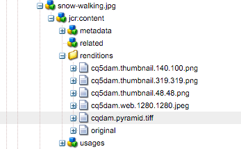

# Werken met Dynamic Media {#working-with-dynamic-media}

[Met Dynamic Media](https://www.adobe.com/solutions/web-experience-management/dynamic-media.html) kunt u op aanvraag rijke visuele producten en marketingmaterialen leveren, die automatisch worden geschaald voor gebruik op websites, mobiele apparaten en sociale sites. Met behulp van een set primaire bronelementen genereert en levert Dynamic Media in real-time meerdere variaties van rijke inhoud via het globale, schaalbare, voor prestaties geoptimaliseerde netwerk.

Dynamische media zijn geschikt voor interactieve kijkervaringen, zoals zoomen, 360 graden draaien en video. Dynamic Media integreert op unieke wijze de workflows van de Adobe Experience Manager Digital Asset Management (Assets)-oplossing om het beheerproces voor digitale campagnes te vereenvoudigen en te stroomlijnen.

>[!NOTE]
>
>Er is een communautair artikel beschikbaar over [Werken met Adobe Experience Manager en Dynamic Media](https://helpx.adobe.com/experience-manager/using/aem_dynamic_media.html).

## Wat u met Dynamic Media kunt doen {#what-you-can-do-with-dynamic-media}

Met Dynamic Media kunt u uw elementen beheren voordat u ze publiceert. Over het werken met middelen in het algemeen wordt uitvoerig ingegaan in het [Werken met Digitale Activa](/help/assets/manage-digital-assets.md). Algemene onderwerpen zijn het uploaden, downloaden, bewerken en publiceren van middelen; weergeven en bewerken van eigenschappen en zoeken naar elementen.

Tot de Dynamic Media-enige eigenschappen behoren het volgende:

* [Carousel-banners](carousel-banners.md)
* [Image Sets](image-sets.md)
* [Interactieve afbeeldingen](interactive-images.md)
* [Interactieve video&#39;s](interactive-videos.md)
* [Mixed Media Sets](mixed-media-sets.md)
* [Panoramische afbeeldingen](panoramic-images.md)

* [Spin Sets](spin-sets.md)
* [Video](video.md)
* [Dynamic Media-elementen leveren](delivering-dynamic-media-assets.md)
* [Elementen beheren](managing-assets.md)
* [Quickviews gebruiken om aangepaste pop-ups te maken](custom-pop-ups.md)

Zie ook Dynamic Media instellen.

<!-- 

OBSOLETE UNTIL INTEGRATING SCENE7 TOPIC GETS A MAJOR UPDATE
>[!NOTE]
>
>To understand the differences between using Dynamic Media and integrating Dynamic Media Classic with AEM, see [Dynamic Media Classic integration versus Dynamic Media](/help/sites-cloud/administering/integrating-scene7.md#aem-scene-integration-versus-dynamic-media).

-->

## Dynamic Media ingeschakeld en Dynamic Media uitgeschakeld {#dynamic-media-on-versus-dynamic-media-off}

U kunt zien of Dynamic Media zijn ingeschakeld (ingeschakeld) door de volgende kenmerken:

* Dynamische uitvoeringen zijn beschikbaar wanneer u elementen downloadt of een voorvertoning weergeeft.
* Afbeeldingssets, centrifuges en gemengde mediasets zijn beschikbaar.
* PTIFF-uitvoeringen worden gemaakt.

Wanneer u op een afbeeldingselement klikt, is de weergave van het element anders en zijn Dynamic Media ingeschakeld. Dynamic Media gebruiken de HTML5-viewers op aanvraag.

### Dynamische uitvoeringen {#dynamic-renditions}

Dynamische uitvoeringen zoals voorinstellingen voor afbeeldingen en viewers (onder **[!UICONTROL Dynamic]**) zijn beschikbaar wanneer Dynamic Media zijn ingeschakeld.

### Afbeeldingssets, spelensets, gemengde mediasets {#image-sets-spins-sets-mixed-media-sets}

Afbeeldingssets, centrifuges en gemengde mediasets zijn beschikbaar als Dynamic Media is ingeschakeld.

### PTIFF-uitvoeringen {#ptiff-renditions}

Dynamische media-elementen zijn onder andere `pyramid.tiffs`.

### Weergave van element wijzigen {#asset-views-change}

Als Dynamic Media zijn ingeschakeld, kunt u in- en uitzoomen door op de knoppen `+` en `-` knoppen te klikken. U kunt ook op een bepaald gebied klikken of erop tikken. Met Omkeren gaat u naar de oorspronkelijke versie en u kunt de afbeelding op het volledige scherm weergeven door op de diagonale pijlen te klikken. Dynamic Media ingeschakeld zien er als volgt uit:

Als Dynamic Media zijn uitgeschakeld, kunt u in- en uitzoomen en terugkeren naar de oorspronkelijke grootte:

