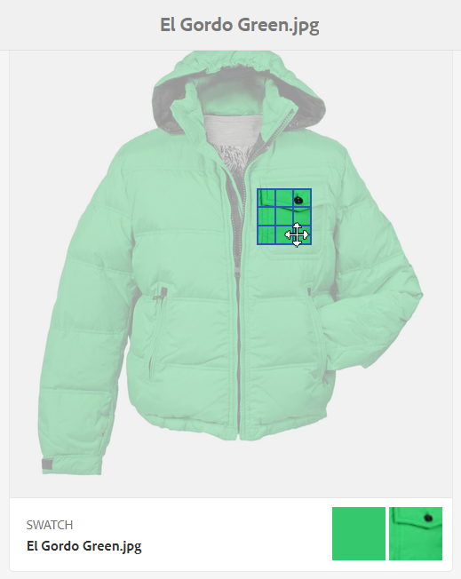

# Dynamic Media-afbeeldingsprofielen {#image-profiles}

Wanneer u afbeeldingen uploadt, kunt u de afbeelding tijdens het uploaden automatisch uitsnijden door een afbeeldingsprofiel toe te passen op de map.

## Opties voor uitsnijden {#crop-options}

<!-- CQDOC-16069 -->Smart Crop coordinates are aspect ratio dependent. That is, for the various smart crop settings in an image profile, if the aspect ratio is the same for the added dimensions that are in the image profile, then the same aspect ratio is sent to Dynamic media. Because of this, Adobe recommends that you use the same crop area. Doing so will ensure that there is no impact to different dimensions used in the image profile.

Houd er rekening mee dat voor elke SmartCrop-generatie die u maakt extra verwerkingstijd nodig is. Als u bijvoorbeeld meer dan vijf slimme-uitsnijdverhoudingen toevoegt, kan dit leiden tot een langzame opname van elementen. Het kan ook een verhoogde belasting van systemen veroorzaken. Omdat u Slim uitsnijden kunt toepassen op mapniveau, raadt Adobe u aan het effect *alleen* in mappen te gebruiken als dat nodig is.

U hebt twee opties voor het uitsnijden van afbeeldingen waaruit u kunt kiezen. U kunt ook het maken van kleuren- en afbeeldingsstalen automatiseren.

<table>
 <tbody>
  <tr>
   <td><strong>Optie</strong></td>
   <td><strong>Wanneer gebruiken</strong></td>
   <td><strong>Beschrijving</strong></td>
  </tr>
  <tr>
   <td>Uitsnijden met pixels</td>
   <td>Bulk uitsnijdafbeeldingen alleen op basis van afmetingen.</td>
   <td>
Als u deze optie wilt gebruiken, selecteert u <strong>Pixeluitsnede</strong> in de vervolgkeuzelijst Uitsnijdopties.
 
Als u wilt uitsnijden vanaf de zijkanten van een afbeelding, voert u het aantal pixels in dat u wilt uitsnijden vanaf een zijde of elke zijde van de afbeelding. Hoeveel van de afbeelding wordt uitgesneden, is afhankelijk van de ppi-instelling (pixels per inch) in het afbeeldingsbestand.
 
Een pixeluitsnijding voor een afbeeldingsprofiel wordt op de volgende manier weergegeven:  

    <ul>
     <li>Waarden zijn Boven, Onder, Links en Rechts.</li>
     <li>Linksboven wordt beschouwd als 0,0 en de pixeluitsnijding wordt daar berekend.</li>
     <li>Beginpunt voor uitsnijden: Links is X en Boven is Y</li>
     <li>Horizontale berekening: horizontale pixelafmetingen van de oorspronkelijke afbeelding min links en vervolgens min rechts.</li>
     <li>Verticale berekening: verticale pixelhoogte min Boven en vervolgens min Onder.</li>
    </ul> 
Stel dat u een afbeelding van 4000 x 3000 pixels hebt. U gebruikt waarden: Top=250, Bottom=500, Left=300, Right=700.
 
Van linksboven (300.250) uitsnijden met de vulruimte (4000-300-700, 3000-250-500 of 3000,2250).
 </td>
  </tr>
  <tr>
   <td>Slim uitsnijden</td>
   <td>Bulk uitsnijdafbeeldingen op basis van hun visuele brandpunt.</td>
   <td>
Smart Crop maakt gebruik van de kracht van kunstmatige intelligentie in Adobe Sensei om het uitsnijden van afbeeldingen in bulk snel te automatiseren. Met Slim uitsnijden wordt automatisch het brandpunt in een afbeelding opgespoord en uitgesneden om het gewenste aandachtspunt vast te leggen, ongeacht de schermgrootte.
 
Als u Slim uitsnijden wilt gebruiken, selecteert u <strong>Slim uitsnijden</strong> in de vervolgkeuzelijst Uitsnijdopties en schakelt u de functie in (inschakelen), rechts van Uitsnijden van responsieve afbeelding.
 
De standaardbreekpuntgrootten Groot, Normaal, en Klein omvatten over het algemeen de volledige waaier van grootte dat de meeste beelden op mobiele en tabletapparaten, Desktops, en banners worden gebruikt. Desgewenst kunt u de standaardnamen van Groot, Normaal, en Klein uitgeven.
 
Als u meer onderbrekingspunten wilt toevoegen, klikt u op Uitsnijden <strong></strong>toevoegen. Als u een uitsnijding wilt verwijderen, klikt u op het pictogram met de prullenbak.
 </td>
  </tr>
  <tr>
   <td>Kleur en afbeeldingsstaal</td>
   <td>Met Bolvormig maakt u een afbeeldingsstaal voor elke afbeelding.</td>
   <td>
<strong>Opmerking</strong>: Slim staal wordt niet ondersteund in Dynamic Media Classic.
 
Zoek en genereer automatisch stalen van hoge kwaliteit op basis van productafbeeldingen met kleuren of structuur.
 
Als u Kleur en afbeeldingsstaal wilt gebruiken, selecteert u <strong>Slim uitsnijden</strong> in de vervolgkeuzelijst Uitsnijdopties, rechts van Kleur en Afbeeldingsstaal, schakelt u de functie in (inschakelen). Geef een pixelwaarde op in de tekstvakken Breedte en Hoogte.
 
Alle uitsnijdingen van afbeeldingen zijn beschikbaar via de Renditions-rail, maar stalen worden alleen gebruikt via de functie URL kopiëren. U moet uw eigen weergavecomponent gebruiken om het staal op uw site te renderen. (De uitzondering hierop zijn carrouselbanners. Dynamic Media biedt de weergavecomponent voor het staal dat wordt gebruikt in carrouselbanners.)
 
<strong>Afbeeldingsstalen gebruiken</strong>
 
De URL voor afbeeldingsstalen is eenvoudig. Dat is:
 
<code>/is/image/company/&lt;asset_name&gt;:Swatch</code>
 
waar <code>:Swatch</code> wordt toegevoegd aan het verzoek om activa.
 
<strong>Kleurstalen gebruiken</strong>
 
Als u kleurstalen wilt gebruiken, kunt u het volgende <code>req=userdata</code> aanvragen:
 
<code>/is/image/&lt;company_name&gt;/&lt;swatch_asset_name&gt;:Swatch?req=userdata</code>
 
Het volgende is bijvoorbeeld een staalelement in Dynamic Media Classic (Scene7):
 
<code>https://my.company.com:8080/is/image/DemoCo/Sleek:Swatch</code>
 
en hier is de overeenkomstige <code>req=userdata</code> URL van het stalenelement:
 
<code>https://my.company.com:8080/is/image/DemoCo/Sleek:Swatch?req=userdata</code>
 
Het <code>req=userdata</code> antwoord is als volgt:
 
<code class="code">SmartCropDef=Swatch
       SmartCropHeight=200.0
       SmartCropRect=0.421671,0.389815,0.0848564,0.0592593,200,200
       SmartCropType=Swatch
       SmartCropWidth=200.0
       SmartSwatchColor=0xA56DB2</code>
 
U kunt ook een <code>req=userdata</code> reactie aanvragen in XML- of JSON-indeling, zoals in de volgende URL-voorbeelden:
 
<code>https://my.company.com:8080/is/image/DemoCo/Sleek:Swatch?req=userdata,xml</code>

<code>SmartSwatchColor</code>

</td></tr></tbody></table>

## Onscherp masker {#unsharp-mask}

U gebruikt **[!UICONTROL Unsharp mask]** om een verscherpingsfiltereffect op de definitieve gedownsampelde afbeelding nauwkeurig af te stemmen. U kunt de intensiteit van het effect, de straal van het effect (gemeten in pixels) en een drempel voor het contrast die wordt genegeerd, instellen. Voor dit effect worden dezelfde opties gebruikt als voor het filter Onscherp masker van Adobe Photoshop.

>[!NOTE]
>
>Onscherp masker wordt alleen toegepast op verkleinde uitvoeringen in de PTIFF-indeling (piramide tiff) die meer dan 50% zijn gedownsampled. Dit betekent dat de grootst mogelijke uitvoeringen binnen de titel niet worden beïnvloed door een onscherp masker, terwijl kleinere uitvoeringen zoals miniaturen worden gewijzigd (en het onscherpe masker tonen).

In **[!UICONTROL Unsharp Mask]** hebt u de volgende filteropties:

<table>
 <tbody>
  <tr>
   <td><strong>Optie</strong></td>
   <td><strong>Beschrijving</strong></td>
  </tr>
  <tr>
   <td>Hoeveelheid</td>
   <td>Hiermee bepaalt u de hoeveelheid contrast die wordt toegepast op de randpixels. De standaardwaarde is 1,75. Voor afbeeldingen met een hoge resolutie kunt u de resolutie verhogen tot maximaal 5. Beschouw Hoeveelheid als een maat voor de filterintensiteit. Bereik is 0-5.</td>
  </tr>
  <tr>
   <td>Radius</td>
   <td>Hiermee bepaalt u het aantal pixels rondom de randpixels dat invloed heeft op de verscherping. Voer voor afbeeldingen met een hoge resolutie een waarde in tussen 1 en 2. Bij een lage waarde worden alleen de randpixels verscherpt. met een hoge waarde wordt een grotere reeks pixels verscherpt . De juiste waarde is afhankelijk van de grootte van de afbeelding. De standaardwaarde is 0,2. Bereik is 0-250.</td>
  </tr>
  <tr>
   <td>Drempel</td>
   <td>
Hiermee bepaalt u het contrastbereik dat moet worden genegeerd wanneer het filter Onscherp masker wordt toegepast. Met andere woorden, met deze optie bepaalt u hoe verschillend de verscherpte pixels moeten zijn van het omringende gebied voordat ze als randpixels worden beschouwd en worden verscherpt. Experimenteer met waarden tussen 0 en 255 om ruis te voorkomen.
 </td>
  </tr>
 </tbody>
</table>

Verscherpen wordt beschreven in [Verscherpen van afbeeldingen](/help/assets/dynamic-media/assets/s7_sharpening_images.pdf.

## Creating Dynamic Media Image Profiles {#creating-image-profiles}

Zie [Elementverwerking](config-dm.md#configuring-asset-processing)configureren voor het definiëren van geavanceerde verwerkingsparameters voor andere elementtypen.

Zie [Profielen voor het verwerken van metagegevens, afbeeldingen en video](/help/assets/dynamic-media/processing-profiles.md)&#39;s.

Zie ook [Aanbevolen procedures voor het ordenen van uw digitale middelen voor het gebruik van verwerkingsprofielen](/help/assets/dynamic-media/best-practices-for-file-management.md).

**Dynamische afbeeldingsprofielen voor media maken**

1. Tik op het AEM-logo en ga naar **[!UICONTROL Tools > Assets > Image Profiles]**.
1. Tik **[!UICONTROL Create]** om een nieuw afbeeldingsprofiel toe te voegen.
1. Voer een profielnaam en waarden in voor onscherp masker, uitsnijden of staal of voor beide.

   Het kan handig zijn een profielnaam te gebruiken die specifiek is voor het beoogde doel. Als u bijvoorbeeld een profiel wilt maken dat alleen stalen genereert, dat wil zeggen dat Slim uitsnijden is uitgeschakeld (uitgeschakeld) en Kleur en Afbeeldingsstaal is ingeschakeld (ingeschakeld), kunt u de profielnaam &quot;Slimme stalen&quot; gebruiken.

   Zie ook [Opties voor slim bijsnijden en slimme stalen](#crop-options) en [Onscherp masker](#unsharp-mask).

   

1. Tik op **[!UICONTROL Save]**. Het nieuwe profiel wordt weergegeven in de lijst met beschikbare profielen.

## Dynamische afbeeldingsprofielen van media bewerken of verwijderen {#editing-or-deleting-image-profiles}

1. Tik op het AEM-logo en ga naar **[!UICONTROL Tools > Assets > Image Profiles]**.
1. Selecteer het afbeeldingsprofiel dat u wilt bewerken of verwijderen. Selecteer **[!UICONTROL Edit Image Processing Profile]**. Selecteer **[!UICONTROL Delete Image Processing Profile]** deze optie als u deze wilt verwijderen.

   

1. Sla de wijzigingen op als u het bestand bewerkt. Bevestig bij verwijderen dat u het profiel wilt verwijderen.

## Een afbeeldingsprofiel voor dynamische media toepassen op mappen {#applying-an-image-profile-to-folders}

Wanneer u een afbeeldingsprofiel toewijst aan een map, nemen eventuele submappen het profiel automatisch over van de bovenliggende map. Dit betekent dat u slechts één afbeeldingsprofiel kunt toewijzen aan een map. Denk daarom zorgvuldig na over de mapstructuur van de locatie waar u middelen uploadt, opslaat, gebruikt en archiveert.

Als u een ander afbeeldingsprofiel aan een map hebt toegewezen, overschrijft het nieuwe profiel het vorige profiel. De vorige bestaande mapelementen blijven ongewijzigd. Het nieuwe profiel wordt toegepast op de elementen die later aan de map worden toegevoegd.

Mappen waaraan een profiel is toegewezen, worden in de gebruikersinterface aangeduid met de naam van het profiel dat op de kaart wordt weergegeven.

<!-- When you add smart crop to an existing image profile, you need to re-trigger the [DAM Update Asset workflow](assets-workflow.md) if you want to generate crops for existing assets in your asset repository. -->

U kunt afbeeldingsprofielen toepassen op specifieke mappen of op alle elementen.

U kunt elementen opnieuw verwerken in een map die al een bestaand afbeeldingsprofiel heeft dat u later hebt gewijzigd. Zie Elementen [opnieuw verwerken in een map nadat u het verwerkingsprofiel](/help/assets/dynamic-media/processing-profiles.md#reprocessing-assets)hebt bewerkt.

### Afbeeldingsprofielen voor dynamische media toepassen op specifieke mappen {#applying-image-profiles-to-specific-folders}

U kunt een afbeeldingsprofiel toepassen op een map vanuit het menu **[!UICONTROL Tools]**, of vanuit **[!UICONTROL Properties]** als u zich in een map bevindt. In deze sectie wordt beschreven hoe u afbeeldingsprofielen op beide manieren op mappen kunt toepassen.

Mappen waaraan al een profiel is toegewezen, worden aangegeven door de naam van het profiel direct onder de mapnaam weer te geven.

U kunt elementen in een map opnieuw verwerken die al een bestaand videoprofiel heeft dat u later wijzigt. Zie Elementen [opnieuw verwerken in een map nadat u het verwerkingsprofiel](/help/assets/dynamic-media/processing-profiles.md#reprocessing-assets)hebt bewerkt.

#### Dynamische media-afbeeldingsprofielen toepassen op mappen vanuit de gebruikersinterface van Profielen {#applying-image-profiles-to-folders-from-profiles-user-interface}

1. Tik op het AEM-logo en ga naar **[!UICONTROL Tools > Assets > Image Profiles]**.
1. Selecteer het afbeeldingsprofiel dat u wilt toepassen op een of meerdere mappen.

   

1. Tap **[!UICONTROL Apply Processing Profile to Folder(s)]** and select the folder or multiple folders you want use to receive the newly uploaded assets and tap/click **[!UICONTROL Apply]**. Mappen waaraan al een profiel is toegewezen, worden aangegeven door de naam van het profiel direct onder de mapnaam weer te geven.

#### Dynamische mediaafbeeldingsprofielen toepassen op mappen vanuit eigenschappen {#applying-image-profiles-to-folders-from-properties}

1. Tik op het AEM-logo en navigeer naar **[!UICONTROL Assets]** en naar de map waarop u een afbeeldingsprofiel wilt toepassen.
1. Tik in de map op het vinkje om het te selecteren en tik vervolgens op **[!UICONTROL Properties]**.
1. Tik op het tabblad **[!UICONTROL Image Profiles]**. Selecteer het profiel in de vervolgkeuzelijst **[!UICONTROL Profile Name]** en tik vervolgens op **[!UICONTROL Save & Close]**. Mappen waaraan al een profiel is toegewezen, worden aangegeven door de naam van het profiel direct onder de mapnaam weer te geven.

   

### Een afbeeldingsprofiel voor dynamische media algemeen toepassen {#applying-an-image-profile-globally}

Naast het toepassen van een profiel op een map, kunt u ook een profiel globaal toepassen, zodat het geselecteerde profiel wordt toegepast op inhoud die in AEM-elementen in een map is geüpload.

U kunt elementen in een map opnieuw verwerken die al een bestaand videoprofiel heeft dat u later wijzigt. Zie Elementen [opnieuw verwerken in een map nadat u het verwerkingsprofiel](/help/assets/dynamic-media/processing-profiles.md#reprocessing-assets)hebt bewerkt.

**Een profiel voor dynamische media-afbeeldingen algemeen** toepassen:

1. Voer een van de volgende handelingen uit:

   * Navigeer naar `https://&lt;AEM server&gt;/mnt/overlay/dam/gui/content/assets/foldersharewizard.html/content/dam` en pas het juiste profiel toe en tik op **[!UICONTROL Save]**.

      

   * Navigeer naar CRXDE Lite naar het volgende knooppunt: `/content/dam/jcr:content`.

      Voeg de eigenschap toe `imageProfile:/conf/global/settings/dam/adminui-extension/imageprofile/<name of image profile>` en tik op **[!UICONTROL Save All]**.

      

## Het slimme uitsnijdstaal of het slimme staal van één afbeelding bewerken {#editing-the-smart-crop-or-smart-swatch-of-a-single-image}

U kunt het venster voor slimme uitsnijden van een afbeelding handmatig opnieuw uitlijnen of het formaat ervan wijzigen om het brandpunt verder te verfijnen.

Nadat u een slim uitsnijden hebt bewerkt en opgeslagen, wordt de wijziging doorgegeven overal waar u het uitsnijden voor de specifieke afbeeldingen gebruikt.

Indien nodig kunt u SmartCrop opnieuw uitvoeren om de extra uitsnijdingen opnieuw te genereren.

Zie ook Het slimme uitsnijdstaal of het slimme staal [bewerken van meerdere afbeeldingen](#editing-the-smart-crop-or-smart-swatch-of-multiple-images).

**Het slimme uitsnijdstaal of het slimme staal van één afbeelding** bewerken:

1. Tik op het AEM-logo en navigeer naar **[!UICONTROL Assets]** de map waarop een profiel voor slimme uitsnijdingen of slimme stalen is toegepast.

1. Tik op de map om de inhoud ervan te openen.
1. Tik op de afbeelding waarvan u het slimme uitsnijdstaal of het slimme staal wilt aanpassen.
1. Tik op de werkbalk **[!UICONTROL Smart Crop]**.

1. Voer een van de volgende handelingen uit:

   * Sleep de schuifregelaar naar links of rechts boven in de rechterbovenhoek van de pagina om respectievelijk de weergave van de afbeelding te vergroten of te verkleinen.
   * Sleep in de afbeelding een hoekgreep om de grootte van het zichtbare gebied van het uitsnijden of staal aan te passen.
   * Sleep het vak of het staal in de afbeelding naar een nieuwe locatie. U kunt alleen afbeeldingsstalen bewerken; kleurstalen zijn statisch.
   * Tik boven de afbeelding **[!UICONTROL Revert]** om alle bewerkingen ongedaan te maken en het oorspronkelijke uitsnijd of staal te herstellen.

1. Tik in de rechterbovenhoek van de pagina op **[!UICONTROL Save]** en tik vervolgens **[!UICONTROL Close]** om terug te keren naar de map met middelen.

## Het slimme uitsnijdstaal of het slimme staal van meerdere afbeeldingen bewerken {#editing-the-smart-crop-or-smart-swatch-of-multiple-images}

Nadat u een afbeeldingsprofiel met slimme uitsnijding hebt toegepast op een map, is op alle afbeeldingen in die map een uitsnijding toegepast. Desgewenst kunt u het venster voor slimme uitsnijden in meerdere afbeeldingen *handmatig* opnieuw uitlijnen of het formaat ervan wijzigen om het brandpunt verder te verfijnen.

Nadat u een slim uitsnijden hebt bewerkt en opgeslagen, wordt de wijziging doorgegeven overal waar u het uitsnijden voor de specifieke afbeeldingen gebruikt.

Indien nodig kunt u SmartCrop opnieuw uitvoeren om de extra uitsnijdingen opnieuw te genereren.

**Het slimme uitsnijdstaal of het slimme staal van meerdere afbeeldingen** bewerken:

1. Tik op het AEM-logo en navigeer naar **[!UICONTROL Assets]**, en vervolgens naar een map waarop een profiel voor slimme uitsnijdingen of slimme stalen is toegepast.
1. Tik in de map op het pictogram **[!UICONTROL More Actions]** (...) en tik vervolgens op **[!UICONTROL Smart Crop]**.

1. Voer op de **[!UICONTROL Edit Smart Crops]** pagina een van de volgende handelingen uit:

   * Pas de weergavegrootte van afbeeldingen op de pagina aan.

      Sleep de schuifregelaar naar links of rechts naast de vervolgkeuzelijst voor de naam van het onderbrekingspunt om het formaat van de weergave van de weer te geven afbeelding te wijzigen.

      

   * Filter de lijst met weer te geven afbeeldingen op basis van namen van onderbrekingspunten. In het onderstaande voorbeeld worden de afbeeldingen gefilterd op de naam van het onderbrekingspunt &quot;Normaal&quot;.

      Selecteer in de vervolgkeuzelijst in de rechterbovenhoek van de pagina een naam voor het onderbrekingspunt om te filteren op welke afbeeldingen u ziet. (Zie de bovenstaande afbeelding.)

      

   * Pas het formaat van het vak voor slimme uitsnijden aan. Voer een van de volgende handelingen uit:

      * Als de afbeelding alleen een slim uitsnijden of een slim staal bevat, sleept u de hoekgreep van het uitsnijdvak om de grootte van het zichtbare gebied van het uitsnijden aan te passen.
      * Als de afbeelding zowel een slim uitsnijden als een slim staal bevat, sleept u de hoekgreep van het uitsnijdvak om de grootte van het zichtbare gebied van het uitsnijden aan te passen. Of tik of klik op het slimme staal onder de afbeelding (kleurstalen zijn statisch) en sleep vervolgens de hoekgreep van het uitsnijdvak om de grootte van het zichtbare gebied van het staal aan te passen.
      

   * Het vak voor slimme uitsnijding verplaatsen. Voer een van de volgende handelingen uit:

      * Als de afbeelding alleen een slim uitsnijden of een slim staal bevat, sleept u het uitsnijdvak naar een nieuwe locatie.
      * Als de afbeelding zowel een slim uitsnijden als een slim staal bevat, sleept u het vak voor slim uitsnijden naar een nieuwe locatie. Of tik of klik op het slimme staal onder de afbeelding (kleurstalen zijn statisch) en sleep het uitsnijdvak van het slimme staal naar een nieuwe locatie.
      

   * Maak alle bewerkingen ongedaan en herstel het oorspronkelijke slimme uitsnijdstaal of het oorspronkelijke slimme staal (alleen van toepassing op de huidige bewerkingssessie).

      Tik **[!UICONTROL Revert]** boven de afbeelding.

      

1. Near the upper-right corner of the page, tap **[!UICONTROL Save]**. Tik vervolgens **[!UICONTROL Close]** om terug te keren naar de map met middelen.

## Een afbeeldingsprofiel uit mappen verwijderen {#removing-an-image-profile-from-folders}

Wanneer u een afbeeldingsprofiel uit een map verwijdert, nemen eventuele submappen automatisch de verwijdering van het profiel uit de bovenliggende map over. Alle verwerking van bestanden die in de mappen zijn opgetreden, blijft echter intact.

U kunt een afbeeldingsprofiel uit een map verwijderen vanuit het menu **[!UICONTROL Tools]**, of vanuit **[!UICONTROL Properties]** als u zich in een map bevindt. In deze sectie wordt beschreven hoe u afbeeldingsprofielen op beide manieren uit mappen kunt verwijderen.

### Dynamische mediaafbeeldingsprofielen uit mappen verwijderen via de gebruikersinterface Profielen {#removing-image-profiles-from-folders-via-profiles-user-interface}

1. Tik op het AEM-logo en ga naar **[!UICONTROL Tools > Assets > Image Profiles]**.
1. Selecteer het afbeeldingsprofiel dat u uit een of meerdere mappen wilt verwijderen.
1. Tik op **[!UICONTROL Remove Processing Profile from Folder(s)]** en selecteer de map of meerdere mappen die u wilt gebruiken om het profiel te verwijderen en tik op **[!UICONTROL Remove]**.

   U kunt bevestigen dat het afbeeldingsprofiel niet meer wordt toegepast op een map omdat de naam niet langer onder de mapnaam wordt weergegeven.

### Dynamische mediaafbeeldingsprofielen uit mappen verwijderen met eigenschappen {#removing-image-profiles-from-folders-via-properties}

1. Tik op het AEM-logo en navigeer **[!UICONTROL Assets]** naar de map waarvan u een afbeeldingsprofiel wilt verwijderen.
1. Tik in de map op het vinkje om het te selecteren en tik vervolgens op **[!UICONTROL Properties]**.
1. Selecteer het **[!UICONTROL Image Profiles]** tabblad.
1. From the **[!UICONTROL Profile Name]** drop-down list, select **[!UICONTROL None]**, then tap **[!UICONTROL Save & Close]**.

   Mappen waaraan al een profiel is toegewezen, worden aangegeven door de naam van het profiel direct onder de mapnaam weer te geven.
