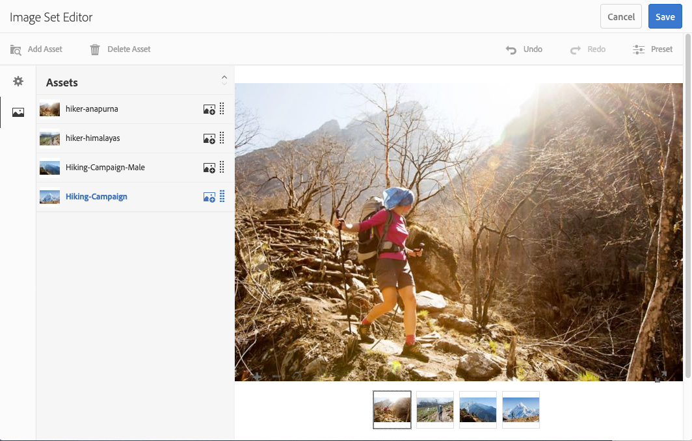
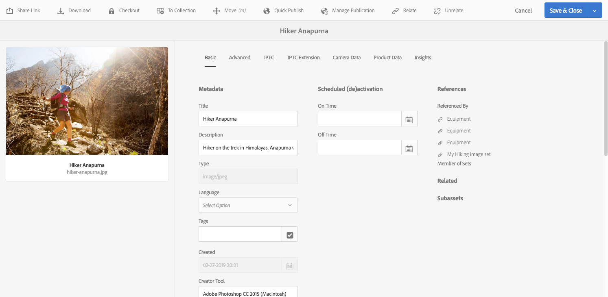

# Afbeeldingssets {#image-sets}

Afbeeldingssets bieden gebruikers een geïntegreerde weergave, waarbij gebruikers verschillende weergaven van een item kunnen zien door op een miniatuurafbeelding te klikken. Met Afbeeldingssets kunt u alternatieve weergaven van een item presenteren en de viewer beschikt over zoomgereedschappen waarmee u afbeeldingen op de juiste wijze kunt bekijken.

Afbeeldingssets worden aangegeven door een banner met het woord `IMAGESET`. Als de Afbeeldingsset is gepubliceerd, bevindt de publicatiedatum, die wordt aangegeven door het pictogram **[!UICONTROL Wereld]** , zich bovendien op de banner samen met de laatste wijzigingsdatum, die wordt aangegeven door het **[!UICONTROL potloodpictogram]** .

In de afbeeldingsset kunt u ook stalen maken door een afbeeldingsset te maken en miniaturen toe te voegen.

Deze toepassing is vooral handig wanneer u een item in een andere kleur, in een ander patroon of in een ander patroon wilt weergeven. Als u een afbeeldingsset met kleurstalen wilt maken, hebt u één afbeelding nodig voor elke andere kleur, elk patroon of elke afwerking die u aan de gebruikers wilt presenteren. Voor elke kleur, elk patroon of elke afwerking hebt u ook één kleur-, patroon- of eindstaal nodig.

Stel dat u afbeeldingen van uiteinden met verschillende kleurrekeningen wilt weergeven. de rekeningen zijn rood , groen en blauw . In dit geval hebt u drie opnamen van hetzelfde kapje nodig. Je hebt een opname nodig met een rood, een met een groen en een met een blauwe rekening. U hebt ook een rood, groen en blauw kleurenstaal nodig. De kleurstalen fungeren als de miniaturen die gebruikers in de Staalset-viewer klikken om het rode, groene of blauwe kader met vulling weer te geven.

>[!NOTE]
>
>Zie Elementen [beheren met de aanraakinterface](/help/assets/manage-digital-assets.md)voor informatie over de gebruikersinterface van Elementen.

## Snel starten:Afbeeldingssets {#quick-start-image-sets}

Zo kunt u snel aan de slag:

1. [Upload uw hoofdafbeeldingen voor meerdere weergaven.](#uploading-assets-in-image-sets)

   Begin door de beelden voor uw Reeksen van het Beeld te uploaden. Omdat gebruikers kunnen inzoomen op afbeeldingen in de Vastgestelde Kijker van het Beeld, houd rekening met het zoemen wanneer u beelden kiest. Zorg ervoor dat de afbeeldingen ten minste 2000 pixels groot zijn. AEM-elementen ondersteunen een groot aantal bestandsindelingen voor afbeeldingen, maar het wordt aanbevolen afbeeldingen zonder verlies in de indeling TIFF, PNG en EPS te gebruiken.

1. [Afbeeldingssets maken.](#creating-image-sets)

   In de Reeksen van het Beeld, klikken de gebruikers duimnagelbeelden in de Vastgestelde Kijker van het Beeld.

   Tik of klik op **[!UICONTROL Maken > Afbeeldingssets]** om een Afbeeldingsset in elementen te maken. Voeg vervolgens afbeeldingen toe en klik op **[!UICONTROL Opslaan]**.

   U kunt ook automatisch afbeeldingssets maken via voorinstellingen voor [batchsets](/help/assets/dynamic-media/config-dm.md#creating-batch-set-presets-to-auto-generate-image-sets-and-spin-sets).

   >[!IMPORTANT]
   >
   >De reeksen van de partij worden gecreeerd door IPS (het Systeem van de Productie van het Beeld) als deel van activa opnemen.

   Zie [Afbeeldingsset-elementen voorbereiden voor het uploaden en uploaden van uw bestanden](#uploading-assets-in-image-sets).

   Zie [Werken met kiezers.](/help/assets/dynamic-media/working-with-selectors.md)

1. Voeg desgewenst voorinstellingen voor de [afbeeldingsset Viewer](/help/assets/dynamic-media/managing-viewer-presets.md)toe.

   Beheerders kunnen voorinstellingen voor de afbeeldingsset Viewer maken of wijzigen. Als u de afbeeldingsset wilt weergeven met een viewervoorinstelling, selecteert u de afbeeldingsset en selecteert u **[!UICONTROL Viewers]** in het keuzemenu voor de linkerrails.

   Zie **[!UICONTROL Gereedschappen > Middelen > Voorinstellingen]** viewer om voorinstellingen voor viewers te maken of te bewerken.

1. (Optioneel) [Afbeeldingssets](/help/assets/dynamic-media/image-sets.md#viewing-image-sets) weergeven die zijn gemaakt met voorinstellingen voor batchsets.
1. [Voorvertoning van afbeeldingssets.](/help/assets/dynamic-media/previewing-assets.md)

   Selecteer de Afbeeldingsset en u kunt er een voorvertoning van weergeven. Klik op de miniatuurpictogrammen om de Afbeeldingsset in de geselecteerde viewer te bekijken. U kunt verschillende viewers kiezen in het menu **[!UICONTROL Viewers]** , beschikbaar in het keuzemenu voor de linkertrack.

1. [Afbeeldingssets publiceren.](/help/assets/dynamic-media/publishing-dynamicmedia-assets.md)

   Als u een Afbeeldingsset publiceert, wordt de URL- en insluitreeks geactiveerd. Bovendien moet u een aangepaste viewer-voorinstelling [die u hebt gemaakt,](/help/assets/dynamic-media/managing-viewer-presets.md) publiceren. Voorinstellingen voor viewers buiten de box zijn al gepubliceerd.

1. [Koppel URL&#39;s aan uw webtoepassing](/help/assets/dynamic-media/linking-urls-to-yourwebapplication.md) of [sluit de video- of afbeeldingsviewer](/help/assets/dynamic-media/embed-code.md)in.

   AEM Assets leidt tot URL vraag naar de Reeksen van het Beeld en activeert hen nadat u de beeldreeksen publiceert. U kunt deze URL&#39;s kopiëren wanneer u elementen voorvertoont. U kunt ze ook insluiten op uw website.

   Selecteer de Afbeeldingsset en selecteer **[!UICONTROL Viewers]** in het keuzemenu voor de linkerrails.

   Zie Een afbeeldingsset [koppelen aan een webpagina](/help/assets/dynamic-media/linking-urls-to-yourwebapplication.md) en de video- of afbeeldingsviewer insluiten.

Zie Afbeeldingssets [bewerken als u Afbeeldingssets wilt bewerken.](#editing-image-sets) Bovendien kunt u de eigenschappen [van de](/help/assets/manage-digital-assets.md#editing-properties)Afbeeldingsset weergeven en bewerken.

Als u problemen hebt met het maken van sets, raadpleegt u Afbeeldingen en sets in Dynamische media oplossen van problemen.

## Elementen uploaden in afbeeldingssets {#uploading-assets-in-image-sets}

Begin door de beelden voor uw Reeksen van het Beeld te uploaden. Omdat gebruikers kunnen inzoomen op afbeeldingen in de Vastgestelde Kijker van het Beeld, houd rekening met het zoemen wanneer u beelden kiest. Zorg ervoor dat de afbeeldingen ten minste 2000 pixels groot zijn. Afbeeldingssets ondersteunen veel bestandsindelingen voor afbeeldingen, maar afbeeldingen zonder verlies van de indeling TIFF, PNG en EPS worden aanbevolen.

U kunt afbeeldingen voor Afbeeldingssets uploaden zoals u elk ander element in Elementen [zou](/help/assets/manage-digital-assets.md#uploading-assets)uploaden.

### Afbeeldingsset-elementen voorbereiden voor uploaden {#preparing-image-set-assets-for-upload}

Voordat u Afbeeldingssets maakt, moet u ervoor zorgen dat de afbeeldingen de juiste grootte en indeling hebben.

Als u een Afbeeldingsset met meerdere weergaven wilt maken, hebt u afbeeldingen nodig die een item vanuit verschillende gezichtspunten weergeven of verschillende aspecten van hetzelfde item weergeven. Het doel is om de belangrijke kenmerken van een item te benadrukken, zodat gebruikers een volledig beeld hebben van hoe het eruit ziet of werkt.

Omdat gebruikers kunnen inzoomen op afbeeldingen in Afbeeldingssets, moet u ervoor zorgen dat de afbeeldingen ten minste 2000 pixels groot zijn. Elementen ondersteunen veel bestandsindelingen voor afbeeldingen, maar TIFF-, PNG- en EPS-afbeeldingen zonder gegevensverlies worden aanbevolen.

>[!NOTE]
>
>Als u miniaturen gebruikt om productstalen aan te geven, moet u het volgende doen:
>
>U hebt vignetten of verschillende opnamen van dezelfde afbeelding nodig die deze in verschillende kleuren, patronen of afwerkingen weergeven. U hebt ook miniatuurbestanden nodig die overeenkomen met de verschillende kleuren, patronen of afwerkingen. Als u bijvoorbeeld miniaturen wilt weergeven met een Afbeeldingsset die hetzelfde jasje in zwart, bruin en groen toont, hebt u het volgende nodig:
>
>* Een zwarte, bruine en groene opname van hetzelfde jasje.
>* Een zwarte, bruine en groene kleurminiatuur.

## Afbeeldingssets maken {#creating-image-sets}

U kunt Afbeeldingssets maken via de gebruikersinterface of via de API. In deze sectie wordt beschreven hoe u afbeeldingssets maakt in de gebruikersinterface.

>[!NOTE]
>
>U kunt ook automatisch afbeeldingssets maken via voorinstellingen voor [batchsets](/help/assets/dynamic-media/config-dm.md#creating-batch-set-presets-to-auto-generate-image-sets-and-spin-sets).
>****Belangrijk:De reeksen van de partij worden gecreeerd door IPS (het Systeem van de Productie van het Beeld) als deel van activa opnemen.

Wanneer u elementen aan de set toevoegt, worden deze automatisch in alfanumerieke volgorde toegevoegd. U kunt elementen handmatig opnieuw ordenen of sorteren nadat u ze hebt toegevoegd.

>[!NOTE]
>
>Afbeeldingssets worden niet ondersteund voor elementen met &quot;,&quot; (komma) in de bestandsnaam.

**Een afbeeldingsset maken**

1. Tik in AEM op het AEM-logo om toegang te krijgen tot de algemene navigatieconsole en tik vervolgens op **[!UICONTROL Navigatie > Middelen]**. Navigeer naar de plaats waar u een afbeeldingsset wilt maken en tik vervolgens op **[!UICONTROL Maken > Afbeeldingsset]** om de pagina Editor afbeeldingsset te openen.

   U kunt de set ook maken vanuit een map die uw elementen bevat.

   

1. Voer op de pagina Editor afbeeldingsset in het veld **[!UICONTROL Titel]** een naam in voor de afbeeldingsset. De naam wordt weergegeven in de banner in de Afbeeldingsset. Voer eventueel een beschrijving in.

   

1. Voer een van de volgende handelingen uit:

   * Tik in de linkerbovenhoek van de pagina Editor afbeeldingsset op Element **[!UICONTROL toevoegen]**.

   * Tik in het midden van de pagina Editor afbeeldingsset op **[!UICONTROL Tikken om de Asset Selector]** te openen.
   Tik om elementen te selecteren die u in de afbeeldingsset wilt opnemen. Geselecteerde elementen hebben een vinkje erboven. Tik op **[!UICONTROL Selecteren]** in de rechterbovenhoek van de pagina als u klaar bent.

   Met de Kiezer van Activa, kunt u naar activa zoeken door in sleutelwoord te typen en te tikken of **[!UICONTROL Terugkeer]** te klikken. U kunt ook filters toepassen om de zoekresultaten te verfijnen. U kunt filteren op pad, verzameling, bestandstype en tag. Selecteer het filter en tik op het pictogram **[!UICONTROL Filter]** op de werkbalk. Wijzig de weergave door op het pictogram Weergave te tikken en **[!UICONTROL Kolomweergave]**, **[!UICONTROL Kaartweergave]** of **[!UICONTROL Lijstweergave]** te selecteren.

   Zie [Werken met kiezers.](/help/assets/dynamic-media/working-with-selectors.md)

   

1. Wanneer u elementen aan de set toevoegt, worden deze automatisch in alfanumerieke volgorde toegevoegd. Nadat u elementen hebt toegevoegd, kunt u deze handmatig opnieuw ordenen of sorteren.

   Sleep indien nodig het pictogram Opnieuw ordenen van een element naar de rechterkant van de bestandsnaam van het element om de volgorde van de afbeeldingen in de lijst met sets te wijzigen.

   

   Als u een miniatuur of staal wilt wijzigen, klikt u op het pictogram **+** **miniatuur** naast de afbeelding en navigeert u naar de gewenste miniatuur of staal. Als u alle afbeeldingen hebt geselecteerd, klikt u op **[!UICONTROL Opslaan]**.

1. (Optioneel) Voer een van de volgende handelingen uit:

   * Als u een afbeelding wilt verwijderen, selecteert u de afbeelding en tikt u op Element **** verwijderen.

   * Tik op **[!UICONTROL Voorinstelling]** en selecteer vervolgens een voorinstelling die u op alle elementen tegelijk wilt toepassen om een voorinstelling toe te passen in de rechterbovenhoek van de pagina.
   >[!NOTE]
   >
   >Wanneer u de afbeeldingsset maakt, kunt u de miniatuur van de afbeeldingsset wijzigen of AEM toestaan de miniatuur automatisch te selecteren op basis van de elementen in de afbeeldingsset. Als u een miniatuur wilt selecteren, tikt u op de miniatuur **** Wijzigen boven het veld Titel op de pagina Editor afbeeldingsset en selecteert u een willekeurige afbeelding (u kunt ook naar andere mappen navigeren om afbeeldingen te zoeken). Als u een miniatuur hebt geselecteerd en vervolgens besluit dat u AEM een miniatuur wilt genereren op basis van de set afbeeldingen, selecteert u **[!UICONTROL Overschakelen naar]** **[!UICONTROL automatische miniatuur]**.

1. Click **[!UICONTROL Save]**. De nieuwe afbeeldingsset wordt weergegeven in de map waarin u deze hebt gemaakt.

## Afbeeldingssets weergeven {#viewing-image-sets}

U kunt afbeeldingssets maken in de gebruikersinterface of u kunt automatisch [batchvoorinstellingen](/help/assets/dynamic-media/config-dm.md#creating-batch-set-presets-to-auto-generate-image-sets-and-spin-sets)gebruiken.

>[!IMPORTANT]
>
>De reeksen van de partij worden gecreeerd door het IPS Systeem [van de Productie van het] Beeld als deel van activa opnemen.

Set die is gemaakt met voorinstellingen voor batchsets, wordt echter *niet* weergegeven in de gebruikersinterface. U kunt deze sets op drie verschillende manieren weergeven. (Deze methoden zijn ook beschikbaar als u de afbeeldingssets in de gebruikersinterface hebt gemaakt.)

* Open de eigenschappen van een afzonderlijk element. Eigenschappen geven aan naar welke sets van het geselecteerde element wordt verwezen of een lid van. Klik op de naam van de set om de volledige set weer te geven.

   

* Van een lidafbeelding van om het even welke reeks. Selecteer het menu **[!UICONTROL Sets** om de sets weer te geven waarvan het element lid is.

   

* U kunt **[!UICONTROL-filter** selecteren en vervolgens **[!UICONTROL Dynamic Media** selecteren en **[!UICONTROL Sets]** selecteren.

   De zoekopdracht retourneert overeenkomende sets die handmatig in de gebruikersinterface zijn gemaakt of die automatisch zijn gemaakt met voorinstellingen voor batchsets. Voor geautomatiseerde reeksen, wordt de onderzoeksvraag geleid gebruikend &quot;Begint met&quot;onderzoekscriteria die van het onderzoek AEM verschillend zijn die op het gebruiken van &quot;bevat&quot;onderzoekscriteria gebaseerd is. Het instellen van het filter op **[!UICONTROL Sets]** is de enige manier om geautomatiseerde sets te doorzoeken.

   

>[!NOTE]
>
>U kunt sets weergeven in de gebruikersinterface, zoals wordt beschreven in Afbeeldingssets bewerken.

## Afbeeldingssets bewerken {#editing-image-sets}

U kunt diverse bewerkingstaken uitvoeren op Afbeeldingssets, zoals:

* Voeg afbeeldingen toe aan de Afbeeldingsset.
* Wijzig de volgorde van de afbeeldingen in de set Afbeeldingen.
* Elementen in de afbeeldingsset verwijderen.
* Voorinstellingen voor viewers toepassen.
* Verwijder de afbeeldingsset.

**Afbeeldingssets bewerken**

1. Voer een van de volgende handelingen uit:

   * Houd de cursor boven een afbeeldingsset en tik op **[!UICONTROL Bewerken]** (potloodpictogram).
   * Houd de muisaanwijzer boven een afbeeldingsset, tik op **[!UICONTROL Selecteren]** (vinkpictogram) en tik vervolgens op **[!UICONTROL Bewerken]** op de werkbalk.
   * Tik op een afbeeldingsset en tik vervolgens op **[!UICONTROL Bewerken]** (potloodpictogram) op de werkbalk.

1. Voer een van de volgende handelingen uit om de afbeeldingen in de Afbeeldingsset te bewerken:

   * Als u elementen opnieuw wilt rangschikken, sleept u een afbeelding naar een nieuwe locatie (selecteer het pictogram voor opnieuw ordenen om items te verplaatsen).
   * Als u items in oplopende of aflopende volgorde wilt sorteren, klikt u op de kolomkop.
   * Als u een element wilt toevoegen of een bestaand element wilt bijwerken, klikt u op Element **[!UICONTROL toevoegen]**. Navigeer naar een element, selecteer het en tik op **[!UICONTROL Selecteren]** in de rechterbovenhoek van de pagina.
      >[!NOTE]
      >
      >Als u de afbeelding verwijdert die AEM voor de miniatuur gebruikt door deze te vervangen door een andere afbeelding, wordt het oorspronkelijke element nog steeds weergegeven.
   * Als u een element wilt verwijderen, selecteert u het en tikt u erop of klikt u op Element **** verwijderen.
   * Tik op **[!UICONTROL Voorinstelling]** en selecteer een voorinstelling voor de viewer om een voorinstelling toe te passen in de rechterbovenhoek van de pagina.
   * Als u een miniatuur wilt toevoegen of wijzigen, selecteert u het miniatuurpictogram rechts van het element. Navigeer naar de nieuwe miniatuur of het nieuwe stalenelement, selecteer het en tik op **[!UICONTROL Selecteren]**.
   * Als u een hele afbeeldingsset wilt verwijderen, navigeert u naar de afbeeldingsset, selecteert u deze en tikt u op **[!UICONTROL Verwijderen]**.
   >[!NOTE]
   >
   >U kunt de afbeeldingen in een Afbeeldingsset bewerken door naar de set te navigeren, op Leden **** instellen in de linkertrack te tikken en vervolgens op het potloodpictogram op een afzonderlijk element te tikken om het bewerkingsvenster te openen.

1. Tik op **[!UICONTROL Opslaan]** als u klaar bent met bewerken.

## Voorvertoning van afbeeldingssets {#previewing-image-sets}

Zie [Voorvertoning van elementen](/help/assets/dynamic-media/previewing-assets.md)weergeven.

## Afbeeldingssets publiceren {#publishing-image-sets}

Zie Elementen publiceren.
