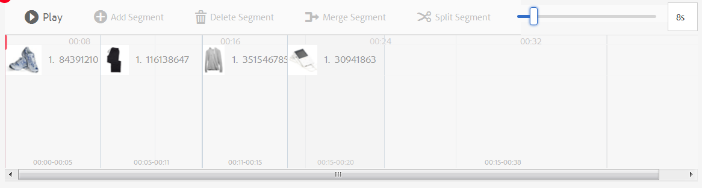

# Interactieve video&#39;s{#interactive-videos}


U kunt gemakkelijk interactieve video&#39;s maken, ook wel shoppable video&#39;s genoemd, die de conversie rechtstreeks vanuit de video stimuleren. De betrokkenheid van de klant bij de video vindt plaats in een deelvenster naast de videospeler, waar gerelateerde service-, informatie- of productminiaturen worden weergegeven op basis van wat in de video wordt getoond. Klanten kunnen op de miniatuur tikken en rechtstreeks aan de service worden gekoppeld, het item toevoegen aan een winkelwagentje voor directe aankoop of worden gekoppeld aan een webpagina voor meer informatie.

Wanneer de video eindigt, wordt een visueel overzicht van al dienstenaanbod getoond om een vraag aan actie te drijven. Klanten hebben nog een kans om op het gewenste item te tikken. Handelbare en specifieke ervaringen zoals deze verhogen de betrokkenheid en conversie van klanten.

Zie ook [Interactieve afbeeldingen](/help/assets/dynamic-media/interactive-images.md).

## Interactieve video in actie {#interactive-video-in-action}

Als u een interactieve, shoppable video in actie wilt zien, klikt u op [Livedemo&#39;s](https://landing.adobe.com/en/na/dynamic-media/ctir-2755/live-demos.html), bladert u naar de kop **[!UICONTROL Shoppable Media]** op de pagina en klikt u op de shoppable video om het afspelen te starten.

* Terwijl producten tijdens het afspelen in de video worden gebruikt, wordt het identieke product rechts weergegeven als een miniatuurafbeelding.

* Klik op de miniatuur om de video te pauzeren en de snelweergave van het product te openen. Klik bijvoorbeeld op de miniatuurafbeelding van de KitchenAid in de video om een centrifugeweergave van 360 graden van de mixer te bekijken of zoom in om details van de mixer te zien.

Zie ook Interactieve video [gebruiken met dynamische media](https://docs.adobe.com/content/help/en/experience-manager-learn/assets/dynamic-media/dynamic-media-interactive-video-feature-video-use.html)

<!-- 

There was a link here that showed the video frame of an interactive video and when the reader clicked the frame the video would play https://marketing.adobe.com/resources/help/en_US/dm/shoppable-video/AXIS/index.html. This now needs to call a new interactive video

-->

<!-- 

[A frame from an interactive, shoppable video](assets/chlimage_1-126.png) *A video frame capture from an interactive, shoppable video.*

-->

>[!NOTE]
>
>Als u een interactieve video maakt om een webpagina te starten wanneer een gebruiker op een miniatuurafbeelding klikt, blokkeren sommige apparaten het openen van de pop-upwebpagina. In dergelijke gevallen moet u de instelling van de pop-upblokkering op het apparaat wijzigen. Tik bijvoorbeeld op een Apple iPhone 6 **[!UICONTROL Settings > Safari > Block Pop-ups]** en schuif het besturingselement naar **[!UICONTROL Off]**. Wanneer u nu een interactieve video afspeelt en op een miniatuur klikt, wordt u gevraagd of u de pop-up wilt openen. Als u akkoord gaat, wordt de webpagina geopend.

### Controleren hoe interactieve video&#39;s worden gemaakt {#watch-how-interactive-videos-are-created}

Bekijk een analyse van 7 minuten en 30 seconden over [hoe interactieve video&#39;s worden gemaakt](https://s7d5.scene7.com/s7viewers/html5/VideoViewer.html?videoserverurl=https://s7d5.scene7.com/is/content/&amp;emailurl=https://s7d5.scene7.com/s7/emailFriend&amp;serverUrl=https://s7d5.scene7.com/is/image/&amp;config=Scene7SharedAssets/Universal_HTML5_Video_social&amp;contenturl=https://s7d5.scene7.com/skins/&amp;asset=S7tutorials/InteractiveVideo) [](https://outv.omniture.com?v=s4NHQ2dzqd7hIqWjeG2sIdyNWsTWyupA).
(Hoewel de videoanalyse met Assets on Demand is gemaakt, zijn de principes en de stappen ook van toepassing op interactieve video in AEM Assets.)

### Webinar voor geslaagde Adobe-klanten {#adobe-customer-success-webinar}

Het [gebruiken van Interactieve Video, het Delen van de Verbinding, en het delen YouTube in de webinar van Activa](https://adobecustomersuccess.adobeconnect.com/p1yxzdo4aec/) AEM leert u hoe te om interactieve video en andere eigenschappen te gebruiken om omzetting gedreven gebeurtenissen in uw video marketing inhoud te binden.

## Snel starten: Interactieve video&#39;s {#quick-start-interactive-videos}

De volgende stapsgewijze beschrijving van de workflow is ontworpen om u te helpen snel aan de slag te gaan met interactieve video&#39;s in Dynamic Media.

Zoek de kop **Voorbeeld** in sommige van de taken van Snel starten. Het bevat een korte zelfstudie die is gebaseerd op deze [startdemo-webpagina waaraan nog *geen* interactiviteit is toegevoegd](https://marketing.adobe.com/resources/help/en_US/dm/shoppable-video/john-lewis/landing-0.html).

Met behulp van de **voorbeelden** kunt u de stappen illustreren voor het integreren van interactieve video&#39;s op uw eigen website.

Wanneer u de zelfstudie voltooit in de laatste voorbeeldsectie, ziet [dit eruit als](https://marketing.adobe.com/resources/help/en_US/dm/shoppable-video/john-lewis/landing-3.html)uw uiteindelijke demo-webpagina met de volledig geïntegreerde interactieve video.


Interactieve videostappen:

1. **(Optioneel) Quickview-variabelen** identificeren - Begin door dynamische variabelen te identificeren die worden gebruikt door uw bestaande QuickView-implementatie. U gebruikt de variabelen om productminiaturen toe te wijzen aan hun overeenkomstige productQuickView wanneer u uw interactieve video creeert. Zie [(Optioneel) Quickview-variabelen](#optional-identifying-quickview-variables)identificeren.
   **Deze stap is alleen vereist als aan alle volgende voorwaarden wordt voldaan**:
・ U wilt interactiviteit aan uw video toevoegen door aan snelle meningen in werking te stellen.
・ Uw implementatie van AEM maakt *geen* gebruik van een eCommerce-integratiekader om productgegevens uit een eCommerce-oplossing zoals IBM Websphere Commerce, Elastic Path, hybris of Intershop naar AEM te halen.

1. **(Optioneel) Een voorinstelling** voor een interactieve videoviewer maken - Pas de weergave en het gedrag aan van de verschillende componenten waaruit de speler bestaat, zoals de videoscrubber en de interactieve miniaturen.
Het is niet nodig een eigen voorinstelling voor een interactieve videoviewer te maken als u de voorinstellingen voor de Interactieve videoviewer buiten de box wilt gebruiken `Shoppable_Video_Light` of `Shoppable_Video_Dark` in plaats daarvan.
Zie [Een nieuwe voorinstelling](/help/assets/dynamic-media/managing-viewer-presets.md#creating-a-new-viewer-preset) voor de viewer maken (optioneel) en [Speciale overwegingen voor het maken van een interactieve voorinstelling](/help/assets/dynamic-media/managing-viewer-presets.md#special-considerations-for-creating-an-interactive-viewer-preset)voor de viewer.

1. **Een video en de bijbehorende afbeeldingselementen** uploaden - Een video en de bijbehorende afbeeldingen die u interactief wilt maken uploaden.
Zie Een video [uploaden en de bijbehorende miniatuurelementen](#uploading-a-video-and-its-associated-thumbnail-assets).

1. **Interactiviteit aan uw video** toevoegen - voeg één of meerdere tijdsegmenten aan de video toe. Koppel vervolgens afbeeldingsminiaturen aan die tijdsegmenten. Wijs elke afbeeldingsminiatuur toe aan een handeling zoals een hyperlink, een Snelle weergave of een Ervingspatroon.
(Let op: de op URL gebaseerde methode van koppelen is niet mogelijk als uw interactieve inhoud koppelingen bevat met relatieve URL&#39;s, in het bijzonder koppelingen naar pagina&#39;s van AEM-sites.)
Voltooi de bewerking door de interactieve video-elementen te publiceren. Bij het publiceren wordt de insluitcode of URL gemaakt die u uiteindelijk wilt kopiëren en toepassen op de openingspagina van uw website. Zie Interactiviteit [toevoegen aan uw video](#adding-interactivity-to-your-video).
Zie Elementen [](/help/assets/dynamic-media/publishing-dynamicmedia-assets.md)publiceren.

1. **Een interactieve video toevoegen aan uw website of uw website in AEM** Als u AEM-sites of AEM e-commerce gebruikt, of beide, kunt u de interactieve video rechtstreeks toevoegen aan een webpagina in AEM door de component Interactieve media naar de pagina te slepen. See [Adding Dynamic Media Assets to Pages.](/help/assets/dynamic-media/adding-dynamic-media-assets-to-pages.md)
Gebruik de insluitcode of URL om uw interactieve video te integreren met uw ervaringen op de website. Zie Een interactieve video [integreren met uw website](#integrating-an-interactive-video-with-your-website).
Als u WCM (Web Content Manager) van derden gebruikt, moet u de nieuwe interactieve video integreren met de bestaande implementatie van de Snelle weergave die op uw website wordt gebruikt. Zie Een interactieve video [integreren met een bestaande QuickView](#integrating-an-interactive-video-with-an-existing-quickview).
   [](/help/assets/dynamic-media/adding-dynamic-media-assets-to-pages.md)

## (Optioneel) Quickview-variabelen identificeren {#optional-identifying-quickview-variables}

>[!NOTE]
Deze taak is alleen vereist als aan de volgende voorwaarden wordt voldaan:
* U wilt interactiviteit aan uw video toevoegen door aan Snelle meningen in werking te stellen.
* Uw implementatie van AEM maakt *geen* gebruik van een eCommerce-integratieframework om productgegevens uit een eCommerce-oplossing zoals IBM Websphere Commerce, Elastic Path, hybris of Intershop naar AEM te halen. <!-- See [eCommerce concepts in AEM Assets](/help/sites-administering/concepts.md).-->

Als uw implementatie van AEM eCommerce gebruikt, kunt u deze taak overslaan en aan de volgende taak te werk gaan.

Begin door dynamische variabelen te identificeren die door uw bestaande implementatie van QuickView worden gebruikt zodat u productduimnagels aan hun overeenkomstige productSnelle mening tijdens het interactieve videoaanmaakproces kunt in kaart brengen.

Wanneer u tijdsegmenten aan een video toevoegt, wijst u SKU en om het even welke extra variabelen aan elke duimnagel toe u aan een segment toevoegt. Dergelijke variabelen worden later gebruikt om het juiste product van de Snelle mening te tonen.

Het is belangrijk om behoorlijk te identificeren welke variabelen worden vereist om een productQuickView uniek teweeg te brengen.

Soms is het voldoende om IT-specialisten te raadplegen die verantwoordelijk zijn voor uw bestaande Quickview-implementatie. Zij zullen waarschijnlijk de minimumreeks gegevens kennen die nodig is om Snelle mening in het systeem te identificeren. In de meeste gevallen is het echter ook mogelijk om eenvoudig het bestaande gedrag van de front-end code te analyseren.

De meeste implementaties van de Snelle mening gebruiken het volgende paradigma:

* De gebruiker activeert een gebruikersinterface-element op de website. Klik bijvoorbeeld op een knop Snelle weergave.
* De website verzendt een Ajax-aanvraag naar de achterkant om de Quickview-gegevens of -inhoud te laden, indien nodig.
* De Quickview-gegevens worden omgezet in de inhoud ter voorbereiding op de weergave op de webpagina.
* Tot slot geeft de front-end code dergelijke inhoud visueel op het scherm terug.

Daarom is het verstandig verschillende gebieden van uw bestaande website te bezoeken waar QuickView is geïmplementeerd, de QuickView te activeren en de Ajax-URL vast te leggen die door de webpagina is verzonden voor het laden van de gegevens of inhoud van de QuickView.

Normaal is er geen behoefte aan u om het even welke gespecialiseerde het zuiveren hulpmiddelen te gebruiken. Moderne webbrowsers beschikken over webinspecteurs die hun werk naar behoren doen. Hieronder volgen enkele voorbeelden van webbrowsers met webcontroles:

* Om alle uitgaande HTTP- verzoeken in Google Chrome te zien, druk **F12** (Vensters) of **Command+Options+I** (MAC) om het paneel van de Hulpmiddelen van de Ontwikkelaar te openen, en dan het **Netwerk** tabel te klikken.

* In Firefox kunt u de Firebug-invoegtoepassing activeren door op **F12** (Windows) of **Command+Option+I** (Mac) te drukken en het tabblad **[Net]** te gebruiken. U kunt ook de ingebouwde Inspector-tool en het bijbehorende tabblad Netwerk gebruiken.

* Activeer in Internet Explorer het foutopsporingsprogramma door op **F12** te drukken.

Wanneer netwerkcontrole in browser wordt aangezet, teweeg de Snelle mening op de pagina.

Zoek nu de URL van Quickview Ajax in het netwerklogboek en kopieer de geregistreerde URL voor toekomstige analyse. In de meeste gevallen wanneer u de Quickview teweegbrengt zijn er talrijke verzoeken die naar de server worden verzonden. De URL van Quickview Ajax is doorgaans een van de eerste in de lijst. Het heeft of een complex gedeelte of een weg van het vraagkoord, en zijn reactieMIME type of, `text/html`, of `text/xml``text/javascript`.

Tijdens dit proces is het belangrijk om verschillende delen van uw website te bezoeken, met verschillende productcategorieën en typen. De reden hiervoor is dat URL&#39;s in de Snelle weergave onderdelen kunnen bevatten die algemeen gelden voor een bepaalde categorie websites, maar deze alleen wijzigen als u een ander gedeelte van de website bezoekt.

In het eenvoudigste geval, is het enige veranderlijke deel in Quickview URL productSKU. In dit geval is de product-SKU-waarde het enige gegevensstuk dat nodig is om miniaturen toe te voegen aan een tijdsegment in de interactieve video in AEM.

In complexe gevallen heeft de URL van de Snelle weergave echter andere variërende elementen naast de SKU van het product, zoals categorie-id, kleurcode enzovoort. In dergelijke gevallen wordt elk dergelijk element een afzonderlijke variabele in de definitie van miniatuurgegevens in AEM.

Bekijk de volgende voorbeelden van URL&#39;s van QuickView en de bijbehorende miniatuurvariabelen:

<table>
  <tbody>
  <tr>
    <td><p>Enige SKU, die in het vraagkoord wordt gevonden.</p> </td>
    <td><p>De opgenomen URL's van de Snelle weergave bevatten het volgende:</p>
    <ul>
      <li><p><code>https://server/json?productId=866558&amp;source=100</code></p> </li>
      <li><p><code>https://server/json?productId=1196184&amp;source=100</code></p> </li>
      <li><p><code>https://server/json?productId=1081492&amp;source=100</code></p> </li>
      <li><p><code>https://server/json?productId=1898294&amp;source=100</code></p> </li>
    </ul> <p>Het enige variabele deel in URL is de waarde van de parameter van het <code>productId=</code> vraagkoord, en het is duidelijk een waarde SKU. Onze miniaturen hebben daarom alleen SKU-velden nodig die zijn gevuld met waarden als <strong><code>866558</code></strong>, <strong><code>1196184</code></strong>, <strong><code>1081492</code></strong>, <strong><code>1898294</code></strong>.</p> </td>
  </tr>
  <tr>
    <td><p>Eén SKU, gevonden in het URL-pad.</p> </td>
    <td><p>De opgenomen URL's van de Snelle weergave bevatten het volgende:</p>
    <ul>
      <li><p><code>https://server/product/6422350843</code></p> </li>
      <li><p><code>https://server/product/1607745002</code></p> </li>
      <li><p><code>https://server/product/0086724882</code></p> </li>
    </ul> <p>Het variabele gedeelte bevindt zich in het laatste gedeelte van het pad en wordt de SKU-waarde van AEM-miniaturen: <strong><code>6422350843</code></strong>, <strong><code>1607745002</code></strong>, <strong><code>0086724882</code></strong>.</p> </td>
  </tr>
  <tr>
    <td><p>SKU en categorie-id in de queryreeks.</p> </td>
    <td><p>De opgenomen URL's van de Snelle weergave bevatten het volgende:</p>
    <ul>
      <li><p><code>https://server/quickView/product/?category=1100004&amp;prodId=305466</code></p> </li>
      <li><p><code>https://server/quickView/product/?category=1100004&amp;prodId=310181</code></p> </li>
      <li><p><code>https://server/quickView/product/?category=1740148&amp;prodId=308706</code></p> </li>
    </ul> <p>In dit geval bevat de URL twee verschillende onderdelen. SKU wordt opgeslagen in de <code>prodId</code> parameter en categorieidentiteitskaart wordt opgeslagen in de <code>category=</code> parameter.</p> <p>Daarom zijn de miniatuurdefinities paren. Dat wil zeggen, een SKU-waarde en een aanvullende variabele <code>categoryId</code>. De resulterende paren zijn:</p>
    <ul>
      <li>SKU is <code>305466</code> en <code>categoryId</code> is <code>1100004</code></li>
      <li>SKU is <code>310181</code> en <code>categoryId</code> is <code>1100004</code></li>
      <li>SKU is <code>308706</code> en <code>categoryId</code> is <code>1740148</code></li>
    </ul> <p> </p> </td>
  </tr>
  </tbody>
</table>

**Voorbeeld**

Wanneer de bovenstaande benadering wordt toegepast op onze website Example, hebben we een webpagina met een aantal productminiaturen, elk met een knop &quot;MEER INFORMATIE&quot;:

[https://marketing.adobe.com/resources/help/en_US/dm/shoppable-video/john-lewis/landing-0.html](https://marketing.adobe.com/resources/help/en_US/dm/shoppable-video/john-lewis/landing-0.html)

Nadat u alle Quickviews van het product beschikbaar op de pagina activeert, krijgt u de volgende lijst van verzoeken die van de Snelle mening aan het achterste eind worden gemaakt:

* datafeed/candles-233396346.json
* datafeed/candles-233978050.json
* datafeed/candles-234024346.json
* datafeed/candles-234024356.json
* datafeed/candles-234024359.json
* datafeed/cushions-233939848.json
* datafeed/cushions-234019477.json
* datafeed/cushions-234019483.json
* datafeed/furniture-231747479.json
* datafeed/furniture-232625621.json
* datafeed/furniture-232625626.json
* datafeed/furniture-233939810.json
* datafeed/furniture-233939825.json
* datafeed/furniture-233939828.json
* datafeed/furniture-233939853.json
* datafeed/furniture-233940334.json
* datafeed/glassware-000064007.json
* datafeed/glassware-230722193.json
* datafeed/glassware-233916550.json
* datafeed/glassware-233916597.json

Wanneer u deze serveraanroepen bekijkt, ziet u dat productspecifieke informatie alleen aanwezig is in het aanvraagpad. U merkt ook dat het vraagkoord helemaal niet wordt gebruikt, en er zijn twee verschillende types van gegevensstukken in kwestie:

* Het eerste type is kaarsen, kussens, meubelen en glaswerk. Je kunt deze &#39;productcategorie&#39; noemen.
* Het tweede type is productcode, zoals 233916597. Je kan aannemen dat het &quot;product SKU&quot; is.

Op basis van deze informatie heeft de volledige URL van de Snelle weergave het volgende patroon:

`/datafeed/$categoryId$-$SKU$.json`

Op basis van deze analyse concludeert u dat u de volgende twee variabelen kunt gebruiken voor de miniaturen: `categoryId` en `SKU`.

U kunt nu een video en de bijbehorende miniatuurelementen uploaden.

## (Optioneel) Een voorinstelling voor een interactieve videoviewer maken {#optional-creating-an-interactive-video-viewer-preset}

U kunt deze taak overslaan en naar de volgende taak gaan als u een van de standaardtypen of voorinstellingen voor interactieve videoviewers wilt gebruiken die niet in de box staan `Shoppable_Video_dark` of `Shoppable_Video_light`.

Wanneer op een miniatuur wordt geklikt in de ontwerpomgeving, wordt een voorbeeld van het dialoogvenster Snelle weergave weergegeven.


U kunt desgewenst uw eigen aangepaste voorinstelling voor een interactieve videoviewer maken. U kunt onder andere de opmaak bepalen van de videospeler, de interactieve miniaturen en de weergave van het miniatuurraster die aan het einde van de video wordt weergegeven.

Een voorinstelling voor een interactieve videoviewer geeft de video en alle tijdlijnsegmenten die u hebt toegevoegd correct weer. Er wordt ook een voorbeeld van standaard QuickView gebruikt wanneer u op een productminiatuur klikt in de modus Voorbeeld, zodat u de interactiviteit kunt testen voordat u publiceert.

Nadat u de viewervoorinstelling hebt opgeslagen, wordt de status ervan automatisch ingesteld op **On** (Ingeschakeld) op de pagina Viewervoorinstellingen. Deze status betekent dat deze zichtbaar is in de component Dynamische media en wanneer u een voorvertoning van een video weergeeft. Zorg ervoor dat u de nieuwe viewervoorinstelling ook handmatig publiceert.

Zie Een nieuwe voorinstelling [voor de viewer](/help/assets/dynamic-media/managing-viewer-presets.md#creating-a-new-viewer-preset) maken om uw eigen voorinstelling voor de interactieve videoviewer te maken.

## Een video en de bijbehorende miniatuurelementen uploaden {#uploading-a-video-and-its-associated-thumbnail-assets}

Als u de video en miniatuurelementen al hebt geüpload, gaat u verder met [Interactiviteit toevoegen aan uw video](#adding-interactivity-to-your-video).

Zie Elementen [](/help/assets/manage-digital-assets.md#delete-assets)verwijderen als u onjuiste video&#39;s of afbeeldingen hebt geüpload of als u geüploade video&#39;s of afbeeldingen wilt verwijderen die u niet meer nodig hebt.

Een video en de bijbehorende miniatuurelementen uploaden:

1. Upload de video en de bijbehorende miniatuurbestanden naar de gewenste map of mappen.

   Zie Elementen [uploaden](/help/assets/manage-digital-assets.md).
Zie Elementen [uploaden met FTP-taakplanning](/help/assets/manage-digital-assets.md).

   Voeg nu interactiviteit toe aan uw video.

## Interactiviteit toevoegen aan uw video {#adding-interactivity-to-your-video}

U voegt tijdlijnsegmenten aan een video toe met de lokale visuele editor op de pagina Interactieve video maken.

Nadat u tijdlijnsegmenten hebt toegevoegd, voegt u miniatuurafbeeldingen toe binnen elk segment. Voor elke miniatuur die u toevoegt, past u er een actie op toe. U kunt bijvoorbeeld een Snelle weergave toepassen op de miniatuur, u kunt er een hyperlink aan toewijzen of u kunt een Experience-fragment toevoegen.

Zie Fragmenten [ervaren](/help/sites-cloud/authoring/fundamentals/experience-fragments.md).

>[!NOTE]
Houd er rekening mee dat de gereedschappen voor het delen van sociale media in interactieve video niet worden ondersteund wanneer u de viewer insluit in een Experience-fragment.
 U kunt dit omzeilen door voorinstellingen voor viewers te gebruiken of te maken die geen gereedschappen voor het delen van sociale media hebben. Met dergelijke voorinstellingen voor viewers kunt u de voorinstelling met succes insluiten in Experience Fragments.

>[!NOTE]
De op URL gebaseerde methode van het verbinden is niet mogelijk als uw interactieve inhoud verbindingen met relatieve URLs, in het bijzonder verbindingen met de pagina&#39;s van Plaatsen AEM heeft.

Opties voor Ongedaan maken en Opnieuw worden in de rechterbovenhoek van de pagina ondersteund tijdens de huidige sessie voor maken en bewerken.

Nadat u de interactieve video hebt opgeslagen, wordt de video direct geopend in Voorvertoning. Van daaruit kunt u een voorinstelling voor een interactieve videoviewer selecteren en de video afspelen om bij benadering te zien hoe deze aan klanten wordt weergegeven.

Om interactiviteit aan uw video toe te voegen:

1. Navigeer in de weergave Elementen naar de video die u hebt geüpload en maak een interactieve video.
1. Voer een van de volgende handelingen uit:

   * Hover on the image, then tap **[!UICONTROL Select]** (checkmark icon). Tik op de werkbalk **[!UICONTROL Edit]**.

   * Tik op de afbeelding en tik vervolgens op **[!UICONTROL More actions]** (driepuntpictogram) **[!UICONTROL > Edit]**.

   * Tik op de afbeelding om deze te openen in de detailweergave. Tik op de werkbalk **[!UICONTROL Edit]**.

1. Voer op de pagina Interactieve video maken een van de volgende handelingen uit:

   * Tik op de **[!UICONTROL Play]** knop om de video af te spelen. Tik op de werkbalk wanneer een bepaald product, een bepaalde service of een bepaald detail dat u wilt markeren, in beeld komt. **[!UICONTROL Add Segment]** Herhaal deze bewerking totdat u het einde van de video hebt bereikt.

      Voor elk tijdsegment dat u toevoegt, kunt u er een of meer miniatuurafbeeldingen aan toewijzen en deze miniaturen vervolgens koppelen aan de productpagina&#39;s van de Snelle weergave die klanten kunnen kopen of aan webpagina&#39;s voor meer informatie.

   * Tik op de **[!UICONTROL Play]** knop om de video af te spelen. Tik op een bepaald product, een bepaalde service of een bepaald detail dat u wilt markeren, **[!UICONTROL Pause]** in beeld. Tik op **[!UICONTROL Add Segment]**.

      Ga door met het afspelen en pauzeren van de video op punten langs de tijdlijn waar u een segment wilt toevoegen totdat u het einde van de video hebt bereikt.

1. (Optioneel) Sleep de balk op de **[!UICONTROL Timeline Scale Slider]** naar links om in te zoomen of naar rechts om uit te zoomen. Zo bepaalt u hoeveel details u ziet van de segmenten die u hebt toegevoegd.

   

   Afhankelijk van de lengte van uw video, blijft de Duur van het Segment aan de volgende waarden in gebreke:

   <table>
      <tbody>
        <tr>
        <td><strong>Als de videolengte...</strong></td>
        <td><strong>De instelling voor Duur segment is standaard ingesteld op...</strong></td>
        </tr>
        <tr>
        <td>3 minuten of meer</td>
        <td>60 seconden</td>
        </tr>
        <tr>
        <td>2-3 minuten</td>
        <td>30 seconden</td>
        </tr>
        <tr>
        <td>1-2 minuten</td>
        <td>20 seconden<br /> </td>
        </tr>
        <tr>
        <td>30-60 seconden</td>
        <td>10 seconden</td>
        </tr>
        <tr>
        <td>30 seconden of minder</td>
        <td>5 seconden</td>
        </tr>
      </tbody>
    </table>

   De videotijdlijn gebruikt evenveel schermruimte als de ruimte die er beschikbaar voor is. Als u de grootte van de browser wijzigt, behouden de segmenten die u hebt toegevoegd de juiste breedte.

   Ter illustratie gebruiken de volgende drie schermafbeeldingen dezelfde video. U ziet dat de breedte van elk segment afhankelijk is van de instelling voor de tijdlijnschaal.

   

   Schermafbeelding A

   Screenshot A hierboven toont u de standaardweergave van een 29-secondenproductvideo. De tijdlijnschaal wordt standaard ingesteld op 5 seconden.

   

   Schermafbeelding B

   In bovenstaande afbeelding B werd de schuifregelaar Tijdlijnschaal van de standaardduur van 5 seconden naar 3 seconden gesleept. De afzonderlijke tijdstempels voor de schaal van de tijdlijn zijn nu allemaal ingesteld op intervallen van 3 seconden.

   

   Screenshot C

   In bovenstaande screenshot C is de instelling voor Tijdlijnschaal verplaatst naar 8 seconden. U ziet hoe de segmenten met productminiaturen zijn verkleind. Op deze manier uitzoomen is handig als u een lange video hebt en u een overzicht wilt kunnen zien van meer segmenten die normaal gesproken in de breedte van de pagina passen.

1. (Optioneel) Voer een van de volgende handelingen uit:

   * De begintijd en eindtijd van een segment aanpassen.

      Selecteer een segment en sleep vervolgens de voorloopblauwe of navolgende blauwe ovaal om respectievelijk de begin- of eindtijd aan te passen. Het weergegeven videoframe wordt op basis van uw aanpassingen naar de juiste tijd in de video verplaatst. De verplaatsing van het tijdlijnsegment wordt beperkt op basis van eventuele aangrenzende segmenten in de tijdlijn. De minimaal toegestane segmenttijd is één seconde.

      Gebruik de volgende sneltoetsen voor navigatie om uw videosegmenten snel te controleren en af te stemmen:

      * Tik op de blauwe ovaal aan de voorzijde om de video direct naar het begin van dat segment te zoeken.
      * Tik op de navolgende blauwe ovaal om de video direct naar het einde van dat segment te zoeken.
      * Tik op het gehele segment om het afspelen van de video te hervatten naar het begin van dat segment
   

   Het einde van een tijdlijnsegment verplaatsen

   * Een segment verwijderen

      Selecteer het laatste segment dat zich op de tijdlijn bevindt en tik vervolgens op de werkbalk **[!UICONTROL Delete Segment]**. Als twee of meer segmenten zijn geselecteerd, is de functie Segment verwijderen uitgeschakeld.

      U kunt alleen het laatste segment verwijderen. Als u bijvoorbeeld alle segmenten op de tijdlijn wilt verwijderen, moet u altijd de laatste selecteren en vervolgens tikken **[!UICONTROL Delete Segment]**.


1. Selecteer een tijdsegment waaraan u een of meer miniatuurafbeeldingen wilt koppelen.
1. Tik rechts van de video op het **[!UICONTROL Content]** tabblad.
1. Tik op het tabblad Inhoud en blader **[!UICONTROL Select Assets]** door alle afbeeldingselementen die u voor de video wilt gebruiken. De geselecteerde elementen worden toegevoegd aan het deelvenster Elementkiezer op het tabblad Inhoud.

1. Voer een van de volgende handelingen uit in de elementkiezer onder het tabblad Inhoud:

   <table>
      <tbody>
        <tr>
        <td>Een miniatuur koppelen aan het geselecteerde tijdlijnsegment</td>
        <td><p>Tik op de afbeelding in het deelvenster met middelenkiezers aan de rechterkant.</p> <p>U kunt zoveel miniaturen toevoegen als u wilt aan een tijdlijnsegment. Voor elke afbeelding die u selecteert, verschijnt een vinkje boven de afbeelding in de elementenkiezer.</p> </td>
        </tr>
        <tr>
        <td>Een miniatuur verwijderen uit het geselecteerde tijdlijnsegment</td>
        <td><p>Voer een van de volgende handelingen uit:</p>
          <ul>
          <li>Tik in het deelvenster met middelenkiezers op een afbeelding met een vinkje om de selectie ervan op te heffen. Het afbeeldingselement wordt verwijderd uit het tijdlijnsegment.<br /> </li>
          <li>Tik in het geselecteerde tijdlijnsegment op een afbeelding en tik vervolgens op de werkbalk op Product <strong></strong>verwijderen.</li>
          </ul> </td>
        </tr>
      </tbody>
    </table>

   

   Tik op een afbeelding in het deelvenster met middelenkiezers om deze toe te voegen aan het geselecteerde tijdlijnsegment.

1. Selecteer één miniatuurafbeelding in een van de tijdlijnsegmenten en tik op het **[!UICONTROL Actions]** tabblad.
1. Voer een van de volgende handelingen uit:
   <table> 
    <tbody> 
      <tr> 
      <td>De geselecteerde miniatuurafbeelding aan een Snelle weergave koppelen</td> 
      <td><p>Tik onder Type handeling op <strong>QuickView</strong>.</p> <p>Als u een klant van de Plaatsen AEM en van de Handel bent:</p> 
       <ul> 
       <li>U ziet dat het tekstveld SKU-waarde vooraf is ingevuld met de SKU (Stock Keeping Unit) van het geselecteerde product. Dit is een unieke id voor elk afzonderlijk product of elke service die u aanbiedt. Deze wordt automatisch gevuld wanneer de afbeelding aan een product in AEM Commerce is gekoppeld.</li> 
       <li>Als de vooraf ingevulde SKU onjuist is, tikt u op het pictogram Productkiezer (vergrootglas) of klikt u op dit pictogram om de pagina Selecteer product te openen. Tik op het product dat u wilt gebruiken of klik op het vinkje in de rechterbovenhoek van de pagina om terug te keren naar de Interactieve video-editor.</li> 
       </ul> <p> Als u <em>geen</em> klant van de Plaatsen AEM of van de Handel bent</p> 
       <ul> 
       <li>Zie <a href="/help/assets/dynamic-media/carousel-banners.md#identifying-hotspot-and-image-map-variables">Hotspot-variabelen</a>identificeren. U moet deze variabelen definiëren. </li> 
       <li>Standaard gebruikt dit SKU-veld de bestandsnaam van het afbeeldingselement zonder de extensie. Als u een standaardnaamgevingsconventie volgt voor uw bestanden die op SKU zijn gebaseerd, hoeft u hiervoor gewoonlijk geen aanvullende bewerkingen uit te voeren. </li> 
       <li>Anders, geef de standaardwaarde uit en ga de correcte waarde SKU in. Typ in het tekstveld SKU-waarde de SKU (Stock Keeping Unit) van het product. Dit is een unieke id voor elk afzonderlijk product of elke service die u aanbiedt. De ingegaan waarde van SKU bevolkt automatisch het veranderlijke gedeelte van het malplaatje van de Snelle mening zodat het systeem weet om het in kaart gebrachte beeld met de Snelle mening van SKU te associëren.</li> 
       </ul> <p>(Optioneel) Tik op Algemene variabele <strong></strong>toevoegen als er andere variabelen in de Snelle weergave zijn die u nodig hebt om een product nader te identificeren. Geef in het tekstveld een extra variabele op. Dit <code>category=Womens</code> is bijvoorbeeld een toegevoegde variabele.</p> <p> </p> </td> 
      </tr> 
      <tr> 
      <td>De geselecteerde miniatuurafbeelding aan een hyperlink koppelen</td> 
      <td><p>Tik onder Type handeling op <strong>Hyperlink</strong>en voer een van de volgende handelingen uit:</p> 
       <ul> 
       <li>Als u een klant van de Plaatsen AEM bent, tik het pictogram van de Selecteur van de Plaats (omslag) om aan een webpagina te navigeren. De op URL gebaseerde methode voor koppelen is niet mogelijk als uw interactieve inhoud koppelingen naar relatieve URL's bevat, met name koppelingen naar pagina's van AEM-sites.</li> 
       <li>Als u een zelfstandige Dynamic Media-klant bent, geeft u in het tekstveld HREF het volledige URL-pad naar een gekoppelde webpagina op.</li> 
       </ul> <p>Zorg ervoor dat u opgeeft of u de koppeling wilt openen op een nieuw browsertabblad of op het huidige tabblad.</p> </td> 
      </tr> 
      <tr> 
      <td>De geselecteerde miniatuurafbeelding aan een ervaringsfragment koppelen</td> 
      <td><p>Tik onder Type handeling op Fragment <strong></strong>Ervaring en voer de volgende handelingen uit:<p> 
       <ul> 
       <li>Als u een klant van de Plaatsen AEM bent, tik of klik het pictogram van het Onderzoek (vergrootglas) om de pagina van het Fragment van de Ervaring te openen. Tik of klik op het gewenste fragment van de Ervaring en tik vervolgens op <strong>Selecteren </strong>in de rechterbovenhoek van de pagina om terug te keren naar het deelvenster Handelingen op de vorige pagina.<br /> Zie Fragmenten <a href="/help/sites-cloud/authoring/fundamentals/experience-fragments.md">ervaren</a>.</li> 
      </ul> 
       <ul> 
       <li>Geef de breedte en hoogte van het ervaringsfragment op zoals dit in de video wordt weergegeven.</li>
       </ul><strong>Opmerking</strong>: Houd er rekening mee dat de gereedschappen voor het delen van sociale media in interactieve video niet worden ondersteund wanneer u de viewer insluit in een Experience-fragment. U kunt dit omzeilen door voorinstellingen voor viewers te gebruiken of te maken die geen gereedschappen voor het delen van sociale media hebben. Met dergelijke voorinstellingen voor viewers kunt u de voorinstelling met succes insluiten in Experience Fragments.</p></tr>&lt; 
      <tr> 
      <td>Een handeling bewerken die al is toegewezen aan een miniatuurafbeelding</td> 
      <td>Tik binnen een tijdlijnsegment op een miniatuurafbeelding met een kettingkoppeling rechts van het tekstlabel. De kettingkoppeling geeft aan dat er een handeling aan is toegewezen. Tik op het tabblad <strong>Handelingen</strong> om de wijzigingen aan te brengen.</td> 
      </tr> 
      <tr> 
      <td>Het tekstlabel van een miniatuurafbeelding wijzigen</td> 
      <td><p>Standaard gebruikt het tekstlabel het <code>Title</code> metagegevensveld van de miniatuurafbeelding. Als dit niet het geval <code>Title</code> is, wordt in plaats daarvan de bestandsnaam van de miniatuurafbeelding gebruikt, maar zonder de extensie.</p> <p>Als u het tekstlabel van een miniatuurafbeelding direct onder het <strong>tabblad </strong>Handelingen onder het afbeeldingselement dat wordt weergegeven, wilt wijzigen, voert u de gewenste tekst in. Zie de onderstaande afbeelding.</p> <p>Het nieuwe tekstlabel wordt alleen gebruikt door de videospeler zelf en de miniatuurtekst die in het tijdlijnsegment wordt weergegeven. De labelwijziging heeft geen invloed op het metagegevensveld Titel van de miniatuurafbeelding en de bestandsnaam van de miniatuurafbeelding.</p> </td> 
      </tr> 
      <tr> 
      <td>Een aangebrachte wijziging herstellen</td> 
      <td>Tik in de rechterbovenhoek van de pagina op <strong>Ongedaan maken</strong> of <strong>Opnieuw</strong>.</td> 
      </tr> 
    </tbody> 
   </table>

   

   Er wordt een nieuw tekstlabel toegevoegd aan de miniatuurafbeelding.

1. Voer een van de volgende handelingen uit:

   * Herhaal stap 6-11 om meer miniatuurafbeeldingen toe te voegen aan tijdlijnsegmenten in uw video.
   * Ga verder met de optionele stap 13.

1. (Optioneel) Voer een van de volgende handelingen uit:

   * **[!UICONTROL Merge Segment]** - U kunt twee aangrenzende segmenten (met of zonder productminiaturen aan hen toegewezen) in één segment combineren.

      Tik in de tijdlijn op twee of meer aangrenzende segmenten die u wilt samenvoegen. Er zijn geen blauwe, ovale sleepgrepen op de twee geselecteerde segmenten in de onderstaande afbeelding.

      Tap **[!UICONTROL Merge Segment]** on the toolbar.
   

   Twee geselecteerde vijf tweede segmenten samenvoegen tot één tien tweede segment.

   * **[!UICONTROL Split Segment]** - U kunt één segment opsplitsen in twee segmenten met gelijke tijdnotatie. Als er al productminiaturen aan het segment zijn toegewezen, worden de miniaturen gecombineerd in het linkersegment.

      Tik op de tijdlijn op een segment dat u in tweeën wilt delen en tik vervolgens op **[!UICONTROL Split Segment]** de werkbalk.

      Als u twee of meer segmenten selecteert, wordt de **[!UICONTROL Split Segment]** functie uitgeschakeld.
   

   Een geselecteerd tien-secondensegment splitsen in twee segmenten van vijf seconden elk.

1. In de rechterbovenhoek van de **[!UICONTROL Create Interactive Video]** pagina wordt de naam weergegeven van de geselecteerde viewer-voorinstelling die bij de video wordt gebruikt. Tik op de naam om een andere voorinstelling voor de viewer te selecteren.

   Met de voorinstelling van de `Shoppable_Video_light` viewer kunt u bijvoorbeeld de video afspelen met een wit weergavegebied naast de video. In het weergavegebied worden de aanklikbare miniatuurafbeeldingen tijdens het afspelen weergegeven. Met de voorinstelling van de `Shoppable_Video_dark` viewer kunt u de video afspelen met een zwart weergavegebied naast de video.

   Als u uw eigen voorinstelling voor de interactieve videoviewer hebt gemaakt, wordt deze ook weergegeven in de lijst met voorinstellingen waaruit u kunt kiezen.

   Tik op **[!UICONTROL Save]** als u klaar bent.

   >[!NOTE]
   Wanneer u uw interactieve video opslaat, wordt er automatisch een gekoppeld `.vtt`-bestand bij opgeslagen. Het `.vtt`-bestand wordt opgeslagen in de map `_VTT` die zich in de hoofdmap van **[!UICONTROL Assets]** bevindt. Uw interactieve video kan alleen correct worden afgespeeld op uw website als het bestand en de map aanwezig zijn. Verplaats, bewerk of verwijder daarom de map `_VTT` of de content ervan niet.

1. Publiceer de interactieve video. Bij het publiceren wordt de insluitcode of URL gemaakt die u uiteindelijk naar uw website gaat kopiëren en plakken.

   Als u interactiviteit met Snelle meningen toevoegde, gebruik slechts de ingebedcode; Als u interactiviteit hebt toegevoegd aan hypergekoppelde webpagina&#39;s, kunt u ook de gepubliceerde URL gebruiken. De op URL gebaseerde methode voor koppelen is echter niet mogelijk als uw interactieve inhoud koppelingen naar relatieve URL&#39;s bevat, met name koppelingen naar pagina&#39;s van AEM-sites.

   Zie [Elementen](publishing-dynamicmedia-assets.md)publiceren.

   >[!NOTE]
   Als u een schokkende video met Quickviews wilt publiceren, moet u ook elk van de verwante afbeeldingselementen van de video afzonderlijk publiceren vanuit uw handelsgebied.

   Nadat u tijdlijnsegmenten hebt toegevoegd en de interactieve video hebt gepubliceerd, kunt u deze toevoegen aan de openingspagina van uw bestaande website. Zie Een interactieve video [integreren met uw website.](#integrating-an-interactive-video-with-your-website)

## Interactieve video-elementen publiceren {#publishing-interactive-video-assets}

Zie Elementen [](/help/assets/dynamic-media/publishing-dynamicmedia-assets.md) publiceren voor meer informatie over het publiceren van interactieve video-elementen.

## Een interactieve video integreren met uw website {#integrating-an-interactive-video-with-your-website}

Nadat u een video hebt geüpload, tijdlijnsegmenten hebt toegevoegd en de interactieve video hebt gepubliceerd, kunt u deze nu toevoegen aan uw bestaande website.

Als u een klant van de Plaatsen AEM bent, kunt u de interactieve video toevoegen door de Interactieve component van Media aan uw pagina te slepen. See [Adding Dynamic Media Assets to Pages.](/help/assets/dynamic-media/adding-dynamic-media-assets-to-pages.md)

Als u een zelfstandige klant bent van AEM Assets, kunt u de interactieve video handmatig toevoegen aan uw website, zoals beschreven in deze sectie.

1. Kopieer de insluitcode of URL van de gepubliceerde interactieve video.
See [Embedding the Video or Image Viewer on a Web Page](/help/assets/dynamic-media/embed-code.md).
Als u interactiviteit met Snelle meningen toevoegde, gebruik slechts de ingebedcode; Als u interactiviteit hebt toegevoegd aan hypergekoppelde webpagina&#39;s, kunt u ook de gepubliceerde URL gebruiken. De op URL gebaseerde methode voor koppelen is echter niet mogelijk als uw interactieve inhoud koppelingen naar relatieve URL&#39;s bevat, met name koppelingen naar pagina&#39;s van AEM-sites.

1. Geef in de webpaginacode van het doel aan waar de statische video zich bevindt.
1. Verwijder de statische video en vervang de code door de insluitcode of URL die u uit AEM Assets hebt gekopieerd.
De gekopieerde insluitcode wordt ingesteld voor een responsieve omgeving, zodat deze automatisch past in het gebied dat eerder door de statische video werd ingenomen.

>[!NOTE]
Als u nu alleen interactiviteit met hypergekoppelde webpagina&#39;s hebt toegevoegd, bent u klaar.
Als u echter interactiviteit hebt toegevoegd om een Snelle weergave te activeren, gelden de miniaturen naast de interactieve video alleen voor weergavedoeleinden. ze zijn nog niet geïntegreerd met uw bestaande QuickView. In dat geval moet u nu de interactieve video integreren met bestaande QuickView op uw website.

**Voorbeeld**

De demo-website als voorbeeld gebruiken:

[https://marketing.adobe.com/resources/help/en_US/dm/shoppable-video/john-lewis/landing-0.html](https://marketing.adobe.com/resources/help/en_US/dm/shoppable-video/john-lewis/landing-0.html)

U ziet dat het standaardvideo-insluitcode is:

```xml
<style type="text/css">
 #s7video_div.s7videoviewer{
   width:100%;
   height:auto;
 }
</style>

<script type="text/javascript" src="https://demos-pub.assetsadobe.com/etc/dam/viewers/s7viewers/html5/js/VideoViewer.js"></script>
<div id="s7video_div"></div>
<script type="text/javascript">
 var s7videoviewer = new s7viewers.VideoViewer({
  "containerId" : "s7video_div",
  "params" : {
   "serverurl" : "https://adobedemo62-h.assetsadobe.com/is/image",
   "contenturl" : "https://demos-pub.assetsadobe.com/",
   "config" : "/etc/dam/presets/viewer/Video",
   "config2": "/etc/dam/presets/analytics",
   "videoserverurl": "https://gateway-na.assetsadobe.com/DMGateway/public/demoCo",
   "posterimage": "/content/dam/marketing/shoppable-video/john-lewis/shoppable-video-john-lewis-2014.mp4",
   "asset" : "/content/dam/marketing/shoppable-video/john-lewis/shoppable-video-john-lewis-2014.mp4" }
 }).init();
</script>
```

Integratie is zo eenvoudig als het verwijderen van de video-insluitcode en het vervangen van deze code door de interactieve video-insluitcode uit AEM. U kunt het resultaat op de volgende URL zien. Hoewel er een interactieve video op de pagina wordt weergegeven, is deze nog niet geïntegreerd met de bestaande QuickView:

[https://marketing.adobe.com/resources/help/en_US/dm/shoppable-video/john-lewis/landing-1.html](https://marketing.adobe.com/resources/help/en_US/dm/shoppable-video/john-lewis/landing-1.html)

## Een interactieve video integreren met een bestaande QuickView {#integrating-an-interactive-video-with-an-existing-quickview}

>[!NOTE]
Deze taak is alleen van toepassing als u een zelfstandige klant van AEM Assets bent.

De laatste stap in dit proces is uw interactieve video te integreren met een bestaande implementatie van de Snelle mening die op uw website wordt gebruikt. Er is geen oplossing voor de integratie die in alle gevallen werkt. Elke Quickview-implementatie is uniek. Daarom is een specifieke aanpak nodig, die hoogstwaarschijnlijk de hulp van een front-end IT-persoon omvat.

De bestaande implementatie van QuickView vertegenwoordigt normaal gesproken een reeks onderling samenhangende acties die op de webpagina in de volgende volgorde plaatsvinden:

1. Een gebruiker activeert een element in de gebruikersinterface van uw website.
1. De front-end code verkrijgt een Quickview URL die op het gebruikersinterface element wordt gebaseerd dat in stap 1 werd teweeggebracht.
1. De front-end code verzendt een AJAX- verzoek gebruikend URL die in stap 2 wordt verkregen.
1. De achterste logica keert de overeenkomstige gegevens of inhoud van de Snelle mening terug naar de front-end code.
1. De front-end code laadt de gegevens of de inhoud van de Snelle mening.
1. Naar keuze, zet de front-end code de geladen gegevens van de Snelle mening in een vertegenwoordiging van HTML om.
1. De front-end code geeft een modaal dialoogvenster of deelvenster weer en geeft de HTML-inhoud op het scherm weer voor de eindgebruiker.

Deze vraag kan onafhankelijke openbare API vraag niet vertegenwoordigen die door de Webpaginalogica van een willekeurige stap kan worden geroepen. In plaats daarvan, is het een geketende vraag waar elke volgende stap in de laatste fase (callback) van de vorige stap verborgen is.

Wanneer een gebruiker op een miniatuur in de interactieve video klikt en tegelijkertijd de interactieve video stap 1 en gedeeltelijk stap 2 vervangt, wordt deze gebruikersinteractie door de viewer afgehandeld. De viewer retourneert een gebeurtenis naar de webpagina die alle miniatuurgegevens bevat die eerder aan AEM zijn toegevoegd.

In een dergelijke gebeurtenishandler doet de front-end code het volgende:

* Luistert naar een gebeurtenis die wordt uitgegeven door de interactieve video.
* Hiermee maakt u een URL van de Snelle weergave op basis van de miniatuurgegevens.
* Triggert het proces om de Snelle mening van het achtereind te laden en het terug te geven op het scherm voor vertoning.

Bovendien ondersteunt de Interactieve Video-viewer de modus Volledig scherm. De eindgebruiker activeert QuickView door op een miniatuur te klikken zonder het volledige scherm te verlaten. Om deze functionaliteit te bereiken, wijzigt u de front-end code zodat het modale dialoogvenster van de Snelle weergave aan de container van de kijker wordt vastgemaakt. Voeg geen BODY van het document of een ander Webpagina-element toe dat niet beschikbaar is wanneer de kijker op volledig-schermwijze is. De code die deze taak uitvoert, moet naar een andere viewer-callback luisteren die wordt verzonden nadat de viewer op de pagina is geladen.

De insluitcode die door AEM wordt geretourneerd, heeft al een gebruiksklare gebeurtenishandler. Er wordt opmerkingen toegevoegd zoals in het volgende gemarkeerde codefragment wordt getoond:

```xml
<style type="text/css">
 #s7interactivevideo_div.s7interactivevideoviewer{
   width:100%;
   height:auto;
 }
</style>
<script type="text/javascript" src="https://demos-pub.assetsadobe.com/etc/dam/viewers/s7viewers/html5/js/InteractiveVideoViewer.js"></script>

<div id="s7interactivevideo_div"></div>
<script type="text/javascript">
 var s7interactivevideoviewer = new s7viewers.InteractiveVideoViewer({
  "containerId" : "s7interactivevideo_div",
  "params" : {
   "serverurl" : "https://adobedemo62-h.assetsadobe.com/is/image",
   "contenturl" : "https://demos-pub.assetsadobe.com/",
   "config" : "/etc/dam/presets/viewer/Shoppable_Video_light",
   "config2": "/etc/dam/presets/analytics",
   "videoserverurl": "https://gateway-na.assetsadobe.com/DMGateway/public/demoCo",
   "interactivedata": "content/dam/_VTT/marketing/shoppable-video/john-lewis/shoppable-video-john-lewis-2014.mp4.svideo.vtt",
   "VideoPlayer.contenturl": "https://adobedemo62-h.assetsadobe.com/is/content",
   "asset" : "/content/dam/marketing/shoppable-video/john-lewis/shoppable-video-john-lewis-2014.mp4" }
 })
 /* // Example of interactive video event for quickview.
   s7interactivevideoviewer.setHandlers({
   "quickViewActivate": function(inData) {
     var sku=inData.sku; //SKU for product ID
    //To pass other parameter from the hotspot, you need to add custom parameter during the hotspot setup as parameterName=value
    loadQuickView(sku); //Replace this call with your quickview plugin
    //Please refer to your quickviewer plugin for the quickview call
    },
"initComplete":function() {
    //--- Attach quickview popup to viewer container so popup will work in fullscreen mode ---
    var popup = document.getElementById('quickview_div'); // get custom quickview container
    popup.parentNode.removeChild(popup); // remove it from current DOM
    var sdkContainerId = s7interactivevideoviewer.getComponent("container").getInnerContainerId(); // get viewer container component
    var inner_container = document.getElementById(sdkContainerId);
    inner_container.appendChild(popup); //Attach custom quickview container to viewer
    }
   });
 */
 s7interactivevideoviewer.init();
</script>
```

Het is dus alleen nodig de commentaarmarkering van het gemarkeerde codefragment hierboven ongedaan te maken en de dummy-handlers te vervangen door code die specifiek is voor de specifieke webpagina.

Er zijn twee standaardcallback managers aanwezig in de standaard insluitcode: `quickViewActivate` en `initComplete`. De `quickViewActivate` handler activeert wanneer op een miniatuur wordt geklikt in de viewer. Gebruik deze optie om de viewer te integreren met de activeringslogica van de Snelle weergave. De `initComplete` handler wordt slechts één keer geactiveerd wanneer de viewer op de pagina wordt geladen. Deze handler wordt gebruikt om de locatie van het dialoogvenster QuickView in het DOM van de webpagina aan te passen.

Het proces om QuickView URL te construeren is tegengesteld aan het proces om duimnagelvariabelen te identificeren die vroeger in dit onderwerp worden behandeld. Met behulp van onze eerder geïdentificeerde URL-voorbeelden van QuickView kunt u zien hoe de URL van de Snelle weergave in elk geval wordt samengesteld:

<table>
  <tbody>
  <tr>
    <td><p>Single SKU, gevonden in het vraagkoord</p> </td>
    <td><code class="code">s7interactivevideoviewer.setHandlers({
      "quickViewActivate": function(inData) {
      var quickViewUrl = "https://server/json?productId=" + inData.sku + "&amp;source=100";
      },
      });</code></td>
  </tr>
  <tr>
    <td>Enkele SKU, gevonden in het pad URL</td>
    <td><code class="code">s7interactivevideoviewer.setHandlers({
      "quickViewActivate": function(inData) {
      var quickViewUrl = "https://server/product/" + inData.sku;
      },
      });</code></td>
  </tr>
  <tr>
    <td><p>SKU en categorie-id in de queryreeks</p> </td>
    <td><code class="code">s7interactivevideoviewer.setHandlers({
      "quickViewActivate": function(inData) {
      var quickViewUrl = "https://server/quickView/product/?category=" + inData.categoryId + "&amp;prodId=" + inData.sku;
      },
      });</code></td>
  </tr>
  </tbody>
</table>

De laatste stap om de Quickview URL teweeg te brengen en het paneel van de Snelle mening te activeren vereist hoogstwaarschijnlijk de hulp van een front-end persoon van IT van uw afdeling van IT. Zij hebben de kennis om het best te weten hoe te om de implementatie van de Snelle mening van de juiste stap nauwkeurig teweeg te brengen, die een klaar-aan-gebruiksKickview URL hebben.

U kunt zien hoe deze stappen worden toegepast op de demo-website om een interactieve video volledig te integreren met de Quickview-code. Eerder in dit onderwerp, werd de structuur van Snelle mening URL geïdentificeerd als het volgende:

```xml
/datafeed/$CategoryId$-$SKU$.json
```

Het is eenvoudig om deze URL in de `quickViewActivate` handler te reconstrueren met behulp `categoryId` en `sku` velden die beschikbaar zijn in het `inData` object dat aan de handler is doorgegeven via de code van de viewer, zoals in het volgende voorbeeld:

```xml
var sku=inData.sku;
var categoryId=inData.categoryId;
var quickViewUrl = "datafeed/" + categoryId + "-" + sku + ".json";
```

De demowebsite activeert het dialoogvenster Snelle weergave met behulp van een eenvoudige `loadQuickView()` functieaanroep. Deze functie heeft slechts één argument, namelijk de gegevens-URL van de Snelle weergave. De laatste stap die nodig is om de interactieve video te integreren, is dus het toevoegen van de volgende coderegel aan de `quickViewActivate` handler:

```xml
loadQuickView(quickViewUrl);
```

Tot slot moet u ervoor zorgen dat het dialoogvenster QuickView is gekoppeld aan het containerelement van de viewer. De standaard insluitcode bevat voorbeeldstappen om deze functionaliteit te bereiken. Als u een verwijzing naar het containerelement van de viewer wilt verkrijgen, kunt u de volgende coderegels gebruiken:

```xml
var sdkContainerId = s7interactivevideoviewer.getComponent("container").getInnerContainerId(); // get viewer container component
var inner_container = document.getElementById(sdkContainerId);
```

Waar `inner_container` is een verwijzing naar een `DIV` element dat door de kijker wordt beheerd. U wilt dat het dialoogvenster een onderliggend item van dat dialoogvenster is `DIV`.

De stappen om het element van het modale dialoogvenster daadwerkelijk te vinden en aan de bovenstaande container te koppelen, zijn hoofdletterspecifiek. Opnieuw, kunt u de hulp van uw front-end ontwikkelaar zoeken die met uw implementatie vertrouwd is Quickview die nodig is.

In het geval van de voorbeeldwebsite wordt het modale dialoogvenster van de Snelle weergave geïmplementeerd als een bestand `DIV` met de modale id voor de snelweergave die rechtstreeks aan het document is gekoppeld `BODY`. De code waarmee dat dialoogvenster naar de container van de viewer wordt verplaatst, is daarom even eenvoudig als de volgende code:

```xml
var sdkContainerId = s7interactivevideoviewer.getComponent("container").getInnerContainerId(); // get viewer container component
var inner_container = document.getElementById(sdkContainerId);
inner_container.appendChild(document.getElementById("quickview-modal"));
```

De volledige broncode ziet er als volgt uit:

```xml
<style type="text/css">
 #s7interactivevideo_div.s7interactivevideoviewer{
   width:100%;
   height:auto;
 }
</style>
<script type="text/javascript" src="https://demos-pub.assetsadobe.com/etc/dam/viewers/s7viewers/html5/js/InteractiveVideoViewer.js"></script>

<div id="s7interactivevideo_div"></div>
<script type="text/javascript">
 var s7interactivevideoviewer = new s7viewers.InteractiveVideoViewer({
  "containerId" : "s7interactivevideo_div",
  "params" : {
   "serverurl" : "https://adobedemo62-h.assetsadobe.com/is/image",
   "contenturl" : "https://demos-pub.assetsadobe.com/",
   "config" : "/etc/dam/presets/viewer/Shoppable_Video_light",
   "videoserverurl": "https://gateway-na.assetsadobe.com/DMGateway/public/demoCo",
   "interactivedata": "content/dam/_VTT/marketing/shoppable-video/john-lewis/shoppable-video-john-lewis-2014.mp4.svideo.vtt",
   "VideoPlayer.contenturl": "https://adobedemo62-h.assetsadobe.com/is/content",
   "asset" : "/content/dam/marketing/shoppable-video/john-lewis/shoppable-video-john-lewis-2014.mp4" }
 })
 // Example of interactive video event for quickview.
   s7interactivevideoviewer.setHandlers({
   "quickViewActivate": function(inData) {
     var sku=inData.sku; //SKU for product ID
     var categoryId=inData.categoryId; //categoryId
    var quickViewUrl = "datafeed/" + categoryId + "-" + sku + ".json";
    loadQuickView(quickViewUrl);
    },
   "initComplete":function() {
    //--- Attach quickview popup to viewer container so popup will work in fullscreen mode ---
    var sdkContainerId = s7interactivevideoviewer.getComponent("container").getInnerContainerId(); // get viewer container component
    var inner_container = document.getElementById(sdkContainerId);
    inner_container.appendChild(document.getElementById("quickview-modal"));
    }
   });
 s7interactivevideoviewer.init();
</script>
```

De laatste demo-website met de volledig geïntegreerde interactieve video ziet er als volgt uit:

[https://marketing.adobe.com/resources/help/en_US/dm/shoppable-video/john-lewis/landing-3.html](https://marketing.adobe.com/resources/help/en_US/dm/shoppable-video/john-lewis/landing-3.html)

## Quickviews gebruiken om aangepaste pop-ups te maken {#using-quickviews-to-create-custom-pop-ups}

See [Using Quickviews to create custom pop-ups](/help/assets/dynamic-media/custom-pop-ups.md).
-->