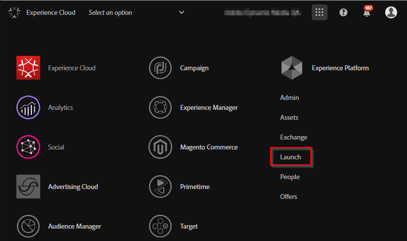
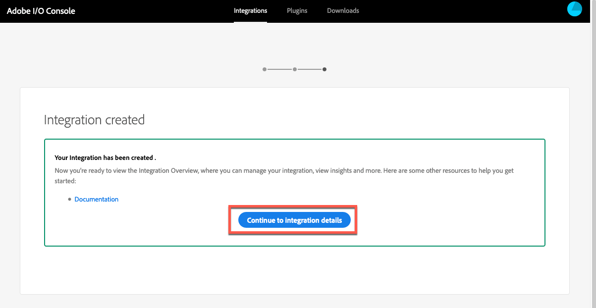

# Dynamic Media-viewers integreren met Adobe Analytics en Adobe Launch {#integrating-dynamic-media-viewers-with-adobe-analytics-and-adobe-launch}

## Wat is de integratie van Dynamic Media Viewers met Adobe Analytics en Adobe Launch? {#what-is-dynamic-media-viewers-integration-with-adobe-analytics-and-adobe-launch}

Met de nieuwe extensie *Dynamic Media Viewers* voor Adobe Launch en de recente release van Dynamic Media Viewers 5.13 kunnen klanten van Dynamic Media, Adobe Analytics en Adobe Launch gebeurtenissen en gegevens gebruiken die specifiek zijn voor de Dynamic Media Viewers in hun Adobe Launch-configuratie.

Dankzij deze integratie kunt u het gebruik van Dynamic Media Viewers op uw website bijhouden met Adobe Analytics. Tegelijkertijd kunt u de gebeurtenissen en gegevens gebruiken die door de viewers beschikbaar worden gesteld, met elke andere extensie voor Starten die afkomstig is van Adobe of een derde.

Zie [Adobe Extension](https://docs.adobe.com/content/help/en/launch/using/extensions-ref/overview.html) in de gebruikershandleiding van het Experience Platform voor meer informatie over extensies.

**Doelgroep van deze documentatie:** Sitebeheerders, ontwikkelaars op het AEM-platform en beheerders in bewerkingen.

### Beperkingen van de integratie {#limitations-of-the-integration}

* De integratie van Adobe Launch voor Dynamic Media-viewers werkt niet in het auteurknooppunt van AEM. U kunt geen het volgen van een pagina zien WCM tot het wordt gepubliceerd.
* De integratie van Adobe Launch voor Dynamic Media-viewers wordt niet ondersteund in de pop-upbewerkingsmodus, waarin de URL van de viewer wordt verkregen met de knop &quot;URL&quot; op de pagina Asset Details.
* Adobe Launch-integratie kan niet gelijktijdig worden gebruikt met de integratie van verouderde viewers Analytics (via de `config2=` parameter).
* Ondersteuning voor het bijhouden van video&#39;s is beperkt tot alleen het bijhouden van de kern, zoals wordt beschreven in [Overzicht](https://docs.adobe.com/content/help/en/media-analytics/using/sdk-implement/track-av-playback/track-core-overview.html)van bijhouden. Met name QoS, Advertenties, Hoofdstuk/Segmenten, of het volgen van Fouten wordt niet gesteund.
* De configuratie van de Duur van de opslag voor Elementen van Gegevens wordt niet gesteund voor Elementen van Gegevens gebruikend de *Dynamische uitbreiding van Kijkers* van Media. Opslagduur moet zijn ingesteld op **[!UICONTROL None]**.

### Gebruik de integratiegevallen {#use-cases-for-the-integration}

Het belangrijkste gebruiksscenario voor de integratie met Adobe Launch zijn klanten die zowel AEM Assets als AEM Sites gebruiken. In dergelijke scenario&#39;s kunt u een standaardintegratie instellen tussen uw AEM-auteurknooppunt en Adobe Launch en vervolgens uw Sites-instantie koppelen aan de Adobe Launch-eigenschap. Daarna, zal om het even welke Dynamische component van Media WCM die aan een pagina van Plaatsen wordt toegevoegd gegevens en gebeurtenissen van kijkers volgen.

Zie [Informatie over het bijhouden van dynamische mediasviewers in AEM-sites](https://wiki.corp.adobe.com/display/~oufimtse/Dynamic+Media+Viewers+integration+with+Adobe+Launch#DynamicMediaViewersintegrationwithAdobeLaunch-TrackingDynamicMediaViewersinAEMSites).

Een tweede gebruiksgeval dat de integratie steunt zijn die klanten die slechts de Middelen van AEM, of Dynamische Klassiek van Media gebruiken. In dergelijke gevallen ontvangt u de insluitcode voor uw viewer en voegt u deze toe aan de websitepagina. Vervolgens haalt u de URL voor de productie van de Adobe-bibliotheek bij Starten op en voegt u deze handmatig toe aan de webpaginacode.

Zie [Informatie over het bijhouden van Dynamic Media-viewers met gebruik van ingesloten code](https://wiki.corp.adobe.com/display/~oufimtse/Dynamic+Media+Viewers+integration+with+Adobe+Launch#DynamicMediaViewersintegrationwithAdobeLaunch-TrackingDynamicMediaViewersusingEmbedcode).

## Hoe gegevens en gebeurtenis volgen werkt in de integratie {#how-data-and-event-tracking-works-in-the-integration}

De integratie maakt gebruik van twee afzonderlijke en onafhankelijke typen van Dynamic Media Viewers die worden bijgehouden: *Adobe Analytics* en *Adobe Analytics for Audio and Video*.

### Informatie over reeksspatiëring met Adobe Analytics  {#about-tracking-using-adobe-analytics}

Met Adobe Analytics kunt u handelingen bijhouden die door de eindgebruiker worden uitgevoerd wanneer deze met Dynamic Media Viewers op uw website werkt. Met Adobe Analytics kunt u ook viewerspecifieke gegevens bijhouden. U kunt bijvoorbeeld de laadgebeurtenissen van de weergave bijhouden en opnemen, samen met de naam van het element, eventuele zoomacties die zijn uitgevoerd, handelingen voor het afspelen van video enzovoort.

In Adobe Launch werken de concepten *Data Elements* en *Rules* samen om het bijhouden van Adobe-analysemogelijkheden in te schakelen.

#### Over gegevenselementen in Adobe Launch {#about-data-elements-in-adobe-launch}

Een gegevenselement in Adobe Launch is een benoemde eigenschap waarvan de waarde statisch is gedefinieerd of dynamisch is berekend op basis van de status van een webpagina of gegevens van Dynamic Media Viewers.

Welke opties beschikbaar zijn voor een definitie van een gegevenselement, is afhankelijk van de lijst met extensies die zijn geïnstalleerd in de Adobe-starteigenschap. De &quot;Core&quot;uitbreiding is vooraf geïnstalleerd en beschikbaar uit de doos in om het even welke configuratie. Met deze extensie &quot;Core&quot; kunt u een gegevenselement definiëren dat afkomstig is van cookie, JavaScript-code, queryreeks en vele andere bronnen.

Voor het bijhouden van Adobe Analytics moeten verschillende extra extensies worden geïnstalleerd, zoals wordt beschreven in [Installatie en installatie van extensies](#installing-and-setup-of-extensions). Met de extensie Dynamic Media Viewers kunt u een gegevenselement definiëren dat een argument is van de gebeurtenis Dynamic Viewer. Het is bijvoorbeeld mogelijk te verwijzen naar het viewertype, of de naam van het element die tijdens het laden door de viewer wordt gemeld, het zoomniveau dat wordt gemeld wanneer de eindgebruiker zoomt en nog veel meer.

Met de extensie Dynamic Media Viewer worden de waarden van de Data Elements automatisch bijgewerkt.

Nadat u het hebt bepaald, kan een Element van Gegevens in andere plaatsen van de UI van de Lancering van Adobe worden gebruikt, gebruikend de plukker van het Element van Gegevens widget. In het bijzonder wordt in de regel naar gegevenselementen die zijn gedefinieerd voor het bijhouden van Dynamic Media Viewers verwezen door Handeling voor variabelen instellen van de extensie Adobe Analytics (zie hieronder).

Zie [Gegevenselementen](https://docs.adobe.com/content/help/en/launch/using/reference/manage-resources/data-elements.html) in de Gids van de Gebruiker van de Lancering van het Platform van de Ervaring om meer te leren.

#### Informatie over regels in Adobe Launch {#about-rules-in-adobe-launch}

Een regel in de Lancering van Adobe is een agnostische configuratie die drie gebieden bepaalt die omhoog een regel maken: *Gebeurtenissen*, *Voorwaarden* en *Acties*:

* *Gebeurtenissen* (als) geven aan wanneer Adobe Launch een regel moet activeren.
* *Voorwaarden* (als) geven aan welke aanvullende beperkingen Adobe Launch moet toestaan of weigeren wanneer een regel wordt geactiveerd.
* *Handelingen* (vervolgens) geven aan wat Adobe Launch moet doen wanneer een regel wordt geactiveerd.

Welke opties beschikbaar zijn in de sectie Gebeurtenissen, Voorwaarden en Handelingen, is afhankelijk van de extensies die zijn geïnstalleerd in de Adobe-starteigenschap. De *Core* -extensie is vooraf geïnstalleerd en is in elke configuratie offline beschikbaar. De extensie biedt verschillende opties voor gebeurtenissen, zoals standaardacties op browserniveau, zoals focuswijziging, toetsdrukken, formulierverzendingen enzovoort. Het bevat ook opties voor Voorwaarden, zoals cookiewaarde, browsertype en meer. Voor Acties is alleen de optie Aangepaste code beschikbaar.

Voor het bijhouden van Adobe-analyses moeten verschillende extra extensies worden geïnstalleerd, zoals wordt beschreven in [Installatie en installatie van extensies](#installing-and-setup-of-extensions). Specifiek:

* De extensie Dynamic Media Viewers breidt de lijst met ondersteunde gebeurtenissen uit tot gebeurtenissen die specifiek zijn voor dynamische mediasviewers, zoals het laden van de viewer, het wisselen van elementen, inzoomen en het afspelen van video.
* De extensie Adobe Analytics breidt de lijst met ondersteunde handelingen uit met twee handelingen die vereist zijn voor het verzenden van gegevens naar trackingservers: *Stel variabelen* in en *verzend baken*.

Als u dynamische mediasviewers wilt bijhouden, kunt u een van de volgende typen gebruiken:

* Gebeurtenissen van de extensie Dynamic Media Viewers, Core-extensie of een andere extensie.
* Voorwaarden in de definitie van de regel. Of u kunt het gebied met voorwaarden leeg laten.

In de sectie van Acties, wordt het vereist dat u een *Vastgestelde actie van Variabelen* hebt. Deze actie vertelt Adobe Analytics hoe te om het volgen variabelen met gegevens te bevolken. Tegelijkertijd verzendt de actie Variabelen ** instellen niets naar de volgende server.

De *Vastgestelde actie van Variabelen* moet door een *Send actie* van het Baken worden gevolgd. De *Send actie van het Band* verzendt eigenlijk gegevens naar de analytische volgende server. Beide acties, *Vastgestelde Variabelen* en *Send Beacon*, komen van de uitbreiding van de Analyse van Adobe.

Zie [Regels](https://docs.adobe.com/content/help/en/launch/using/reference/manage-resources/rules.html) in de Gids van de Gebruiker van de Lancering van het Platform van de Ervaring om meer te leren.

#### Voorbeeldconfiguratie {#sample-configuration}

In de volgende voorbeeldconfiguratie in Adobe Launch ziet u hoe u een elementnaam kunt bijhouden tijdens het laden van de viewer.

1. Definieer op het **[!UICONTROL Data Elements]** tabblad een gegevenselement `AssetName` dat verwijst naar `asset` de parameter van de `LOAD` gebeurtenis vanuit de extensie Dynamische mediaquery&#39;s.

   

1. Definieer op het **[!UICONTROL Rules]** tabblad een regel *TrackAssetOnLoad*.

   In deze regel gebruikt het **[!UICONTROL Event]** veld de **[!UICONTROL LOAD]** gebeurtenis van de extensie Dynamische mediaverviewers.

   

1. De configuratie Handeling heeft twee actietypen van de extensie Adobe Analytics:

   *Stel Variabelen* in, die een door u gekozen analytische variabele toewijzen aan de waarde van `AssetName` Gegevenselement.

   *Stuur Beacon*, die trackinggegevens naar Adobe Analytics verzendt.

   

1. De resulterende regelconfiguratie ziet er als volgt uit:

   

### Informatie over Adobe Analytics voor audio en video {#about-adobe-analytics-for-audio-and-video}

Als een Experience Cloud-account is geabonneerd op Adobe Analytics voor Audio en Video, is het voldoende om het bijhouden van video in te schakelen in de extensie-instellingen voor *Dynamic Media Viewers* . Videomeetgegevens zijn beschikbaar in Adobe Analytics. Het bijhouden van video&#39;s is afhankelijk van de aanwezigheid van Adobe Media Analytics voor de extensie Audio en Video.

Zie [Installatie en installatie van extensies](#installing-and-setup-of-extensions).

De ondersteuning voor het bijhouden van video&#39;s is momenteel beperkt tot het bijhouden van de &#39;kern-afspeelfunctie&#39;, zoals wordt beschreven in [Overzicht](https://docs.adobe.com/content/help/en/media-analytics/using/sdk-implement/track-av-playback/track-core-overview.html)van bijhouden. Met name QoS, Advertenties, Hoofdstuk/Segmenten, of het volgen van Fouten wordt niet gesteund.

## De extensie Dynamische mediaverviewers gebruiken {#using-the-dynamic-media-viewers-extension}

Zoals vermeld in de [Gebruiksscenario&#39;s voor de integratie](#use-cases-for-the-integration), is het mogelijk om Dynamic Media-viewers bij te houden met de nieuwe Adobe Launch-integratie in AEM-sites en door insluitcode te gebruiken.

### Dynamische mediasviewers bijhouden in AEM-sites {#tracking-dynamic-media-viewers-in-aem-sites}

Om de Dynamische kijkers van Media in Plaatsen te volgen AEM, moeten alle stappen die onder het [Vormen van alle integratiestukken](#configuring-all-the-integration-pieces) worden vermeld worden uitgevoerd. U moet met name de IMS-configuratie en de Adobe Launch Cloud Configuration maken.

Na de correcte configuratie, om het even welke Dynamische kijker van Media die u aan een pagina van Plaatsen toevoegt, gebruikend een component WCM die door Dynamische Media wordt gesteund, volgt automatisch gegevens aan de Analytics van Adobe, of Analytics van Adobe voor Video, of allebei.

Zie Dynamische media-elementen [toevoegen aan pagina&#39;s met Adobe-sites](/help/assets/dynamic-media/adding-dynamic-media-assets-to-pages.md).

### Dynamische mediasviewers bijhouden met gebruik van ingesloten code {#tracking-dynamic-media-viewers-using-embed-code}

Klanten die geen gebruik maken van AEM-sites of die geen gebruik maken van Dynamic Media-viewers voor webpagina&#39;s buiten AEM-sites, of beide, kunnen nog steeds de Adobe Launch-integratie gebruiken.

U moet de configuratiestappen van de secties [Adobe Analytics configureren](#configuring-adobe-analytics-for-the-integration) en [Adobe Launch configureren](#configuring-adobe-launch-for-the-integration) voltooien. Aan AEM gerelateerde configuratiestappen zijn echter niet nodig.

Na de juiste configuratie kunt u ondersteuning voor het starten van Adobe toevoegen aan een webpagina met een Dynamic Media-viewer.

Zie [De insluitcode](https://docs.adobe.com/content/help/en/launch/using/implement/configure/implement-the-launch-install-code.html) starten toevoegen voor meer informatie over het gebruik van de insluitcode van de Adobe-bibliotheek.

Zie De video- of afbeeldingsviewer [insluiten op een webpagina](/help/assets/dynamic-media/embed-code.md) voor meer informatie over het gebruik van de insluitcodefunctie van AEM Dynamic Media.

**Dynamische mediaviewers volgen met behulp van ingesloten code**

1. Zorg dat een webpagina gereed is voor het insluiten van een Dynamic Media-viewer.
1. Vraag de insluitcode voor de Adobe-opstartenbibliotheek aan door u eerst aan te melden bij Adobe Launch (zie Adobe [Launch](#configuring-adobe-launch-for-the-integration)configureren).
1. Click **[!UICONTROL Property]**, then click the **[!UICONTROL Environments]** tab.
1. Ophalen van het milieuniveau dat relevant is voor de omgeving van de webpagina. Klik vervolgens in de **[!UICONTROL Install]** kolom op het pictogram van het vak.
1. **[!UICONTROL In the Web Install Instructions]** kopieert u de volledige insluitcode van de Adobe Launch-bibliotheek, samen met de omringende `<script/>` tags.

## Referentiegids voor de extensie Dynamic Media Viewers {#reference-guide-for-the-dynamic-media-viewers-extension}

### Over de configuratie van Dynamic Media Viewers {#about-the-dynamic-media-viewers-configuration}

De extensie Dynamic Media Viewer wordt automatisch geïntegreerd met de Adobe Launch-bibliotheek als aan alle onderstaande voorwaarden wordt voldaan:

* Adobe Launch library global object ( `_satellite`) is aanwezig op de pagina.
* De extensiefunctie Dynamische media Viewers `_dmviewers_v001()` is ingeschakeld `_satellite`.

* `config2=` Er is geen viewerparameter opgegeven, wat betekent dat de viewer geen gebruik maakt van verouderde analytische integratie.

Bovendien is er een optie om Adobe Launch-integratie expliciet uit te schakelen in de viewer door `launch=0` parameter op te geven in de configuratie van de viewer. De standaardwaarde van deze parameter is `1`.

### De extensie Dynamic Media Viewers configureren {#configuring-the-dynamic-media-viewers-extension}

De enige configuratieoptie voor de extensie Dynamic Media Viewers is **[!UICONTROL Enable Adobe Media Analytics for Audio and Video]**.

Wanneer u deze optie inschakelt (inschakelen of inschakelen) en als Adobe Media Analytics for Audio and Video is geïnstalleerd en correct is geconfigureerd, worden meetgegevens voor het afspelen van video verzonden naar de Adobe Analytics for Audio and Video-oplossing. Als u deze optie uitschakelt, wordt het bijhouden van video uitgeschakeld.

Als u deze optie inschakelt *zonder* dat Adobe Media Analytics for Audio and Video-extensie is geïnstalleerd, heeft deze optie geen effect.

### Informatie over gegevenselementen in de extensie Dynamische media-viewers {#about-data-elements-in-the-dynamic-media-viewers-extension}

Het enige data-elementtype dat de uitbreiding Dynamische mediaviewers biedt, is **[!UICONTROL Viewer Event]** in de vervolgkeuzelijst **[!UICONTROL Data Element Type]**.

Als deze optie is geselecteerd, maakt de Data Element-editor een formulier met twee velden:

* **[!UICONTROL DM viewers event data type]** - een vervolgkeuzelijst met alle viewergebeurtenissen die door de uitbreiding Dynamische mediaviewers worden ondersteund en die argumenten bevatten, plus een speciaal **[!UICONTROL COMMON]**-item. Een **[!UICONTROL COMMON]**-item vertegenwoordigt een lijst met gebeurtenisparameters die gemeenschappelijk zijn voor alle typen gebeurtenissen die door de viewers worden verzonden.
* **[!UICONTROL Tracking parameter]** - een argument van de geselecteerde Dynamic Media Viewer-gebeurtenis.

Zie de naslaggids [voor](https://marketing.adobe.com/resources/help/en_US/s7/viewers_ref/c_html5_s7_aem_asset_viewers.html) Dynamic Media Viewers voor de lijst met ondersteunde gebeurtenissen per viewertype. Ga naar de specifieke viewersectie en klik vervolgens op Ondersteuning voor de sectie Adobe Analytics bijhouden. Op dit moment worden in de naslaggids voor dynamische media-viewers geen gebeurtenisargumenten vastgelegd.

Laten we nu eens kijken naar de levenscyclus van het *gegevenselement* van Dynamic Media Viewers. De waarde van een dergelijk gegevenselement wordt gevuld nadat de bijbehorende dynamische mediaviewer-gebeurtenis op de pagina plaatsvindt. Als het gegevenselement bijvoorbeeld naar de **[!UICONTROL LOAD]** gebeurtenis en het bijbehorende argument &#39;asset&#39; verwijst, ontvangt de waarde van dat gegevenselement geldige gegevens nadat de viewer de gebeurtenis LOAD voor de eerste keer uitvoert. Als het gegevenselement naar de **[!UICONTROL ZOOM]** gebeurtenis en zijn &quot;schaal&quot;argument wijst, zal de waarde van zulk een Element van Gegevens leeg blijven tot de kijker een **[!UICONTROL ZOOM]** gebeurtenis voor het eerst verzendt.

Op dezelfde manier worden de waarden van data-elementen automatisch bijgewerkt wanneer de viewer een overeenkomstige gebeurtenis op de pagina verzendt. De waarde-update gebeurt zelfs als de specifieke gebeurtenis niet in de regelconfiguratie is opgegeven. Als bijvoorbeeld het data-element **[!UICONTROL ZoomScale]** is gedefinieerd voor de &quot;scale&quot;-parameter van de ZOOM-gebeurtenis, maar de enige regel in de regelconfiguratie door de gebeurtenis **[!UICONTROL LOAD]** wordt getriggerd, wordt de waarde van **[!UICONTROL ZoomScale]** nog steeds bijgewerkt telkens als een gebruiker zoomt in de viewer.

Elke viewer voor dynamische media heeft een unieke id op de webpagina. Het data-element houdt de waarde zelf bij en de viewer die de waarde heeft ingevuld. Dit betekent dat als er meerdere viewers op dezelfde pagina zijn en er een data-element **[!UICONTROL AssetName]** is dat naar de gebeurtenis **[!UICONTROL LOAD]** en het bijbehorende &quot;asset&quot;-argument verwijst, het data-element **[!UICONTROL AssetName]** een verzameling assetnamen bijhoudt die zijn gekoppeld aan elke viewer die op de pagina is geladen.

De exacte waarde die door het gegevenselement wordt geretourneerd, is afhankelijk van de context. Als het gegevenselement in een Regel wordt gevraagd die door een Dynamische de kijkergebeurtenis van Media werd teweeggebracht, dan is de waarde van het Element van Gegevens teruggekeerd voor de kijker die de Regel in werking stelde. En als het gegevenselement wordt aangevraagd in een regel die is geactiveerd door een gebeurtenis van een andere Adobe-extensie voor starten, is de waarde van het gegevenselement de waarde van de viewer die als laatste het gegevenselement heeft bijgewerkt.

**Bekijk de volgende voorbeeldset-up**:

* Een webpagina met twee Dynamic Media Zoom-viewers; wij zullen naar hen als *kijker1* en *kijker2* verwijzen.

* **[!UICONTROL ZoomScale]** Data Element verwijst naar de **[!UICONTROL ZOOM]** gebeurtenis en het argument &#39;scale&#39; ervan.
* **[!UICONTROL TrackPan]** Regel met het volgende:

   * Gebruikt de Dynamic Media Viewer- **[!UICONTROL PAN]** gebeurtenis als trigger.
   * Verzendt de waarde van het Element van **[!UICONTROL ZoomScale]** Gegevens naar de Analytics van Adobe.

* 
   * **[!UICONTROL TrackKey]** Regel met het volgende:

   * Gebruikt de toetsdrukgebeurtenis van de Core Adobe Launch-extensie als een trigger.
   * Verzendt de waarde van het Element van **[!UICONTROL ZoomScale]** Gegevens naar de Analytics van Adobe.

Nu, veronderstel de eindgebruiker de Web-pagina met de twee kijkers laadt. In *viewer1* zoomen ze in op een schaal van 50%; vervolgens zoomen ze in *viewer2* in op een schaal van 25%. In *viewer1* pannen ze de afbeelding rond en drukken ze ten slotte op een toets op het toetsenbord.

De activiteit van de eindgebruiker resulteert in de volgende twee het volgen vraag wordt gemaakt aan de Analytics van Adobe:

* De eerste vraag komt voor omdat de **[!UICONTROL TrackPan]** Regel wordt teweeggebracht wanneer de gebruiker in *viewer1* pant. Die vraag verzendt 50% als waarde van het Element van **[!UICONTROL ZoomScale]** Gegevens omdat het Element van Gegevens zal weten dat de Regel door *viewer1* wordt teweeggebracht en de overeenkomstige schaalwaarde haalt;
* De tweede vraag komt voor omdat de **[!UICONTROL TrackKey]** Regel wordt teweeggebracht wanneer de gebruiker op een sleutel op het toetsenbord duwde. Die vraag verzendt 25% als waarde van het Element van **[!UICONTROL ZoomScale]** Gegevens omdat de Regel niet door de kijker werd teweeggebracht. Als dusdanig, keert het Element van Gegevens de meest bijgewerkte waarde terug.

Het voorbeeld hierboven heeft ook invloed op de levensduur van de waarde voor het gegevenselement. De waarde van het gegevenselement dat door de Dynamic Media Viewer wordt beheerd, wordt opgeslagen in de Adobe Launch-bibliotheekcode, zelfs nadat de viewer zelf op de webpagina is verwijderd. Dit betekent dat als er een Regel is die door een niet-Dynamische uitbreiding van de Kijker van Media wordt teweeggebracht en verwijzingen zoals het Element van Gegevens, het Element van Gegevens de laatste bekende waarde terugkeert, zelfs als de kijker niet meer op de Web-pagina aanwezig is.

In elk geval worden de waarden van gegevenselementen die door Dynamic Media Viewers worden aangestuurd, niet opgeslagen op de lokale opslag of op de server. in plaats daarvan worden ze alleen in de Adobe Launch-bibliotheek op de client bewaard. Waarden van een dergelijk gegevenselement verdwijnen als de webpagina opnieuw wordt geladen.

Over het algemeen biedt de editor voor gegevenselementen ondersteuning voor de [opslagduur](https://docs.adobe.com/content/help/en/launch/using/reference/manage-resources/data-elements.html#create-a-data-element). Data Elements die de extensie Dynamic Media Viewers gebruiken, ondersteunen echter alleen de opslagduuroptie van **[!UICONTROL None]**. Het instellen van een andere waarde is mogelijk in de gebruikersinterface, maar het gedrag Gegevenselement is in dit geval niet gedefinieerd. De extensie beheert de waarde van het gegevenselement op zichzelf: het gegevenselement dat de waarde van het gebeurtenisargument van de viewer tijdens de volledige de levenscyclus van de kijker handhaaft.

### Over Regels in de extensie Dynamische mediasviewers {#about-rules-in-the-dynamic-media-viewers-extension}

In de redacteur van de Regel, voegt de uitbreiding nieuwe configuratieopties voor de redacteur van Gebeurtenissen toe. Ook biedt de toepassing een optie om handmatig te verwijzen naar gebeurtenisparameters in de Action Editor als een kortzichtige optie in plaats van vooraf geconfigureerde gegevenselementen te gebruiken.

#### Informatie over de Events-editor {#about-the-events-editor}

In de gebeurteniseditor voegt de uitbreiding Dynamische mediaviewers een nieuw **[!UICONTROL Event Type]** genaamd **[!UICONTROL Viewer Event]** toe.

Als deze optie is geselecteerd, wordt het vervolgkeuzemenu weergegeven in de gebeurteniseditor **[!UICONTROL Dynamic Media Viewer events]** met een lijst van alle beschikbare gebeurtenissen die worden ondersteund door Dynamic Media-viewers.

#### De Editor voor handelingen {#about-the-actions-editor}

Met de extensie Dynamische media-viewers kunt u gebeurtenisparameters van Dynamic Media-viewers gebruiken voor het toewijzen van variabelen aan analytische variabelen in de editor Variabelen instellen van de extensie Adobe Analytics.

De eenvoudigste methode om dat te doen is het volgende proces te voltooien in twee stappen:

* Definieer eerst een of meer gegevenselementen, waarbij elk gegevenselement een parameter van een dynamische Media Viewer-gebeurtenis vertegenwoordigt.
* Tot slot klikt u in de editor Variabelen instellen van de extensie Adobe Analytics op het pictogram voor de kiezer voor gegevenselement (drie gestapelde schijven) om het dialoogvenster Gegevenselement selecteren te openen en selecteert u vervolgens een gegevenselement in het dialoogvenster.

Het is echter mogelijk om een alternatieve manier te gebruiken en het maken van data-elementen te omzeilen. U kunt rechtstreeks naar een argument van een Dynamische mediaviewer-gebeurtenis verwijzen door de volledig gekwalificeerde naam van het gebeurtenisargument in te voeren in het invoerveld **[!UICONTROL value]** van de Analytics-variabeletoewijzing, omringd door procenttekens (%). Bijvoorbeeld,

`%event.detail.dm.LOAD.asset%`

Er is een belangrijk verschil tussen het gebruik van Data Elements en de verwijzing naar directe-gebeurtenisargumenten. Voor het Element van Gegevens, maakt het niet uit welke gebeurtenis de Vastgestelde actie van Variabelen teweegbrengt, de gebeurtenis die de Regel teweegbrengt kan niet met Dynamische Kijker (als een muisklik op de Web-pagina van de uitbreiding van de Kern) niet van belang zijn. Maar wanneer het gebruiken van een directe argumentverwijzing is het belangrijk om ervoor te zorgen dat de gebeurtenis die de regel teweegbrengt aan het gebeurtenisargument beantwoordt dat het verwijst.

Als bijvoorbeeld wordt verwezen naar `%event.detail.dm.LOAD.asset%`, wordt de juiste assetnaam geretourneerd als de regel wordt getriggerd door de gebeurtenis **[!UICONTROL LOAD]** van de uitbreiding Dynamische mediaviewer. Er wordt echter een lege waarde voor elke andere gebeurtenis geretourneerd.

In de volgende tabel worden de gebeurtenissen van de Dynamic Media Viewer en de ondersteunde argumenten weergegeven:

<table>
 <tbody>
  <tr>
   <td>Naam van viewergebeurtenis</td>
   <td>Argument reference</td>
  </tr>
  <tr>
   <td><code>COMMON</code></td>
   <td><code>%event.detail.dm.objID%</code></td>
  </tr>
  <tr>
   <td> </td>
   <td><code>%event.detail.dm.compClass%</code></td>
  </tr>
  <tr>
   <td> </td>
   <td><code>%event.detail.dm.instName%</code></td>
  </tr>
  <tr>
   <td> </td>
   <td><code>%event.detail.dm.timeStamp%</code></td>
  </tr>
  <tr>
   <td><code>BANNER</code> </td>
   <td><code>%event.detail.dm.BANNER.asset%</code></td>
  </tr>
  <tr>
   <td> </td>
   <td><code>%event.detail.dm.BANNER.frame%</code></td>
  </tr>
  <tr>
   <td> </td>
   <td><code>%event.detail.dm.BANNER.label%</code></td>
  </tr>
  <tr>
   <td><code>HREF</code></td>
   <td><code>%event.detail.dm.HREF.rollover%</code></td>
  </tr>
  <tr>
   <td><code>ITEM</code></td>
   <td><code>%event.detail.dm.ITEM.rollover%</code></td>
  </tr>
  <tr>
   <td><code>LOAD</code></td>
   <td><code>%event.detail.dm.LOAD.applicationname%</code></td>
  </tr>
  <tr>
   <td><strong> </strong></td>
   <td><code>%event.detail.dm.LOAD.asset%</code></td>
  </tr>
  <tr>
   <td><strong> </strong></td>
   <td><code>%event.detail.dm.LOAD.company%</code></td>
  </tr>
  <tr>
   <td><strong> </strong></td>
   <td><code>%event.detail.dm.LOAD.sdkversion%</code></td>
  </tr>
  <tr>
   <td><strong> </strong></td>
   <td><code>%event.detail.dm.LOAD.viewertype%</code></td>
  </tr>
  <tr>
   <td><strong> </strong></td>
   <td><code>%event.detail.dm.LOAD.viewerversion%</code></td>
  </tr>
  <tr>
   <td><code>METADATA</code></td>
   <td><code>%event.detail.dm.METADATA.length%</code></td>
  </tr>
  <tr>
   <td> </td>
   <td><code>%event.detail.dm.METADATA.type%</code></td>
  </tr>
  <tr>
   <td><code>MILESTONE</code></td>
   <td><code>%event.detail.dm.MILESTONE.milestone%</code></td>
  </tr>
  <tr>
   <td><code>PAGE</code></td>
   <td><code>%event.detail.dm.PAGE.frame%</code></td>
  </tr>
  <tr>
   <td> </td>
   <td><code>%event.detail.dm.PAGE.label%</code></td>
  </tr>
  <tr>
   <td><code>PAUSE</code></td>
   <td><code>%event.detail.dm.PAUSE.timestamp%</code></td>
  </tr>
  <tr>
   <td><code>PLAY</code></td>
   <td><code>%event.detail.dm.PLAY.timestamp%</code></td>
  </tr>
  <tr>
   <td><code>SPIN</code></td>
   <td><code>%event.detail.dm.SPIN.framenumber%</code></td>
  </tr>
  <tr>
   <td><code>STOP</code></td>
   <td><code>%event.detail.dm.STOP.timestamp%</code></td>
  </tr>
  <tr>
   <td><code>SWAP</code></td>
   <td><code>%event.detail.dm.SWAP.asset%</code></td>
  </tr>
  <tr>
   <td><code>SWATCH</code></td>
   <td><code>%event.detail.dm.SWATCH.frame%</code></td>
  </tr>
  <tr>
   <td> </td>
   <td><code>%event.detail.dm.SWATCH.label%</code></td>
  </tr>
  <tr>
   <td><code>TARG</code></td>
   <td><code>%event.detail.dm.TARG.frame%</code></td>
  </tr>
  <tr>
   <td> </td>
   <td><code>%event.detail.dm.TARG.label%</code></td>
  </tr>
  <tr>
   <td><code>ZOOM</code></td>
   <td><code>%event.detail.dm.ZOOM.scale%</code></td>
  </tr>
 </tbody>
</table>

## Alle integratieonderdelen configureren {#configuring-all-the-integration-pieces}

**VOORDAT U BEGINT**

Als u dit nog niet hebt gedaan, raadt Adobe u aan alle documentatie voorafgaand aan deze sectie grondig te controleren, zodat u de volledige integratie begrijpt.

In deze sectie worden de configuratiestappen beschreven die nodig zijn om Dynamic Media-viewers te integreren met Adobe Analytics en Adobe Analytics voor Audio en Video. Hoewel het gebruik van de extensie Dynamic Media Viewers voor andere doeleinden in Adobe Launch mogelijk is, worden dergelijke scenario&#39;s niet in deze documentatie besproken.

U configureert de integratie in de volgende Adobe-producten:

* Adobe Analytics - u zult het volgen variabelen en rapporten vormen.
* Adobe Launch - u definieert een eigenschap, een of meer regels en een of meer gegevenselementen om het bijhouden van viewers in te schakelen.

Bovendien, als deze integratieoplossing met Plaatsen AEM wordt gebruikt, moet de volgende configuratie ook worden gedaan:

* Adobe I/O-console - integratie is gemaakt voor het starten van Adobe.
* AEM-auteurknooppunt - IMS-configuratie en Adobe Launch-wolkenconfiguratie.

Als onderdeel van de configuratie moet u toegang hebben tot een bedrijf in Adobe Experience Cloud dat Adobe Analytics en Adobe Launch al heeft ingeschakeld.

## Adobe Analytics configureren voor integratie {#configuring-adobe-analytics-for-the-integration}

Nadat u Adobe Analytics hebt geconfigureerd, wordt het volgende voor de integratie ingesteld:

* Er is een rapportsuite geïnstalleerd en geselecteerd.
* De Variabelen van de Analyse zijn beschikbaar om het volgen gegevens te ontvangen.
* Rapporten zijn beschikbaar voor het weergeven van verzamelde gegevens in Adobe Analytics.

Zie ook [Analytics Implementation Guide](https://docs.adobe.com/content/help/en/analytics/implementation/home.html).

**U configureert als volgt Adobe Analytics voor de integratie**:

1. Start Adobe Analytics via de [startpagina](https://exc-home.experiencecloud.adobe.com/exc-home/home.html#/)van Experience Cloud. Klik in de menubalk op het pictogram Oplossingen (drie bij drie punten) rechtsboven op de pagina en klik vervolgens op **[!UICONTROL Analytics]**.

   

   U selecteert nu een rapportsuite.

### Een rapportsuite selecteren {#selecting-a-report-suite}

1. Selecteer in de rechterbovenhoek van de Adobe Analytics-pagina rechts van het veld **[!UICONTROL Search Reports]** de juiste rapportsuite in de vervolgkeuzelijst. Als er meerdere rapportsuites beschikbaar zijn en u niet zeker weet welke suite u moet gebruiken, neemt u contact op met uw Adobe Analytics-beheerder. Deze beheerder kan u helpen bij het selecteren van de rapportsuite die moet worden gebruikt.

   In de onderstaande afbeelding heeft een gebruiker een rapportsuite met de naam *DynamicMediaViewersExtensionDoc* gemaakt en deze geselecteerd in de vervolgkeuzelijst. De naam van de rapportsuite is alleen ter illustratie; de naam van de rapportsuite die u uiteindelijk selecteert, verschilt.

   Als er geen rapportsuite beschikbaar is, moet u of de beheerder van Adobe Analytics er een maken voordat u verder kunt gaan met de configuratie.

   Zie [Rapporten en de Reeksen](https://docs.adobe.com/content/help/en/analytics/implementation/analytics-basics/ref-reports-report-suites.html) van het Rapport en [creeer een rapportreeks](https://docs.adobe.com/content/help/en/analytics/admin/admin-console/create-report-suite.html).

   In Adobe Analytics worden rapportsuites beheerd onder **[!UICONTROL Admin > Report Suites]**.

   

   U stelt nu Adobe Analytics-variabelen in.

### Adobe Analytics-variabelen instellen {#setting-up-adobe-analytics-variables}

1. U geeft nu een of meer Adobe Analytics-variabelen aan die u wilt gebruiken om het gedrag van Dynamic Media Viewers op de webpagina bij te houden.

   U kunt elk type variabele gebruiken dat door Adobe Analytics wordt ondersteund. Het besluit over het veranderlijke type (zoals [steunen]van het Verkeer van de Douane, Omzetting [eVar]) zou door specifieke behoeften van u implementatie Analytics moeten worden gedreven.

   Zie [Overzicht van props en eVars](https://docs.adobe.com/content/help/en/analytics/implementation/analytics-basics/traffic-props-evars/props-evars.html).

   In het kader van deze documentatie wordt alleen een variabele Custom Traffic (props) gebruikt, omdat deze binnen een paar minuten nadat een handeling op een webpagina heeft plaatsgevonden, beschikbaar komt in een Analytics-rapport.

   Als u een nieuwe variabele Aangepast verkeer wilt inschakelen, klikt u op de werkbalk in Adobe Analytics **[!UICONTROL Admin > Report Suites]**.

1. Selecteer op de pagina **[!UICONTROL Report Suite Manager]** het juiste rapport en klik vervolgens op de werkbalk op **[!UICONTROL Edit Settings > Traffic > Traffic Variables]**.
1. Daar, neem ongebruikte variabele op, geef het een beschrijvende naam ( **[!UICONTROL Viewer asset (prop 30)]**) en verander combodoos in &quot;Toegelaten&quot;in de Toegelaten kolom.

   De volgende schermafbeelding is een voorbeeld van een variabele van het Verkeer van de Douane ( **[!UICONTROL prop30]**) voor het volgen van een activanaam die door de kijker wordt gebruikt:

   

1. Klik onder aan de lijst met variabelen op **[!UICONTROL Save]**.

### Een rapport instellen {#setting-up-a-report}

1. Over het algemeen wordt het instellen van een rapport in Adobe Analytics gestuurd door specifieke projectbehoeften. Als dusdanig, is de gedetailleerde rapportopstelling voorbij het werkingsgebied voor deze integratie.

   Het is echter voldoende om te weten dat de rapporten Aangepast verkeer automatisch beschikbaar worden in Adobe Analytics nadat u de variabelen Aangepast verkeer hebt ingesteld in **[Adobe Analytics-variabelen](#setting-up-adobe-analytics-variables)**instellen.

   Het rapport voor de variabele **[!UICONTROL Viewer asset (prop 30)]** is bijvoorbeeld beschikbaar in het menu Rapporten onder **[!UICONTROL Custom Traffic > Custom Traffic 21-30 > Viewer asset (prop 30)]**.

   Als u dit rapport meteen na het maken van **[!UICONTROL Viewer asset (prop 30)]** bezoekt, worden er geen data weergegeven. Dat wordt op dit moment in de integratie verwacht.

   

## Adobe Launch configureren voor integratie {#configuring-adobe-launch-for-the-integration}

Nadat u Adobe Launch hebt geconfigureerd, wordt het volgende ingesteld voor de integratie:

* Het creëren van een nieuw Bezit om al uw configuraties samen te houden.
* De installatie en installatie van extensies. De client-side code van alle extensies die in de eigenschap zijn geïnstalleerd, wordt samen gecompileerd in een bibliotheek. Deze bibliotheek wordt later door de webpagina gebruikt.
* Configuratie van gegevenselementen en regels. Deze configuratie bepaalt welke gegevens van de Dynamische kijkers van Media, wanneer om de volgende logica teweeg te brengen, en waar te om de gegevens van de kijker in de Analytics van Adobe te verzenden.
* Publiceren van de bibliotheek.

**Adobe Launch configureren voor integratie**:

1. Start Adobe Launch via de [startpagina](https://exc-home.experiencecloud.adobe.com/exc-home/home.html#/)van Experience Cloud. Klik in de menubalk op het pictogram Oplossingen (drie bij drie punten) in de rechterbovenhoek van de pagina en klik vervolgens op **[!UICONTROL Launch]**.

   U kunt Adobe Launch ook rechtstreeks openen.

   

### Een eigenschap maken in Adobe Launch {#creating-a-property-in-adobe-launch}

Een eigenschap in Adobe Launch is een benoemde configuratie die al uw instellingen bij elkaar houdt. Er wordt een bibliotheek met de configuratie-instellingen gegenereerd en gepubliceerd op verschillende milieuniveaus (ontwikkeling, staging en productie).

Zie ook [Een eigenschap](https://docs.adobe.com/content/help/en/launch/using/implement/configure/create-a-property.html)maken.

1. Klik in Adobe Launch op **[!UICONTROL New Property]**.
1. Typ in het dialoogvenster **[!UICONTROL Create Property]** in het veld **[!UICONTROL Name]** een beschrijvende naam, zoals de titel van uw website. Bijvoorbeeld, `DynamicMediaViewersProp.`
1. Voer in het **[!UICONTROL Domains]** veld het domein van uw website in.
1. Schakel in de vervolgkeuzelijst **[!UICONTROL Advanced Options]** de optie **[!UICONTROL Configure for extension development (cannot be modified later)]** in als de uitbreiding die u wilt gebruiken (in dit geval *Dynamische mediaviewers*) nog niet wordt vrijgegeven.

   

1. Klik op **[!UICONTROL Save]**.

   Klik op de nieuwe eigenschap en ga vervolgens verder met *Installatie en installatie van extensies*.

### Extensies installeren en instellen {#installing-and-setup-of-extensions}

Alle beschikbare extensies in Adobe Launch worden onder de **[!UICONTROL Extensions > Catalog]** lijst weergegeven.

Klik op een extensie **[!UICONTROL Install]** om deze te installeren. Voer zo nodig een eenmalige extensieconfiguratie uit en klik op **[!UICONTROL Save]**.

Waar nodig moeten de volgende extensies worden geïnstalleerd en geconfigureerd:

* (Vereist) *Experience Cloud ID Service* -uitbreiding

Geen extra configuratie is nodig, keur voor om het even welke voorgestelde waarden goed. Als u klaar bent, moet u erop klikken **[!UICONTROL Save]**.

Zie [Experience Cloud ID Service Extension](https://docs.adobe.com/content/help/en/launch/using/extensions-ref/adobe-extension/id-service-extension/overview.html).

* (Vereist) *Adobe Analytics* -extensie

Als u deze uitbreiding wilt configureren, hebt u eerst de rapportsuite-id in Adobe Analytics nodig die u vindt onder **[!UICONTROL Admin > Report Suite]** onder de kolomkop **[!UICONTROL Report Suite ID]**.

(Alleen voor demonstratiedoeleinden wordt de rapportsuite-id van de **[!UICONTROL DynamicMediaViewersExtensionDoc]**-rapportsuite gebruikt in de volgende schermafbeeldingen. Deze id is eerder gemaakt en gebruikt in [Een rapportsuite selecteren](#selecting-a-report-suite).)

Voer op de pagina Uitbreiding installeren de rapportsuite-id in het veld **[!UICONTROL Development Report Suites]**, het veld **[!UICONTROL Staging Report Suites]** en het veld **[!UICONTROL Production Report Suites]** in.

*Configureer het volgende item alleen als u videotracering wilt gebruiken:*

Voor de **[!UICONTROL Install Extension]** pagina, breid uit **[!UICONTROL General]**, dan specificeer de het Volgen Server. De volgende server volgt de sjabloon `<trackingNamespace>.sc.omtrdc.net`, waarbij `<trackingNamespace>` de informatie wordt verkregen in de e-mail met provisies.

Klik op **[!UICONTROL Save]**.

Zie [Adobe Analytics Extension](https://docs.adobe.com/content/help/en/launch/using/extensions-ref/adobe-extension/analytics-extension/overview.html).

* (Optioneel. Alleen vereist als videotracering vereist is) *Adobe Media Analytics voor audio en video* -extensie

Vul het veld Trackingserver in. De trackingserver voor de extensie *Adobe Media Analytics voor Audio en Video* verschilt van de trackingserver die wordt gebruikt voor Adobe Analytics. De sjabloon volgt `<trackingNamespace>.hb.omtrdc.net`de sjabloon, waar `<trackingNamespace>` is de informatie uit de e-mail met provisioning.

Alle andere velden zijn optioneel.

Zie [Adobe Media Analytics for Audio and Video Extension](https://docs.adobe.com/content/help/en/launch/using/extensions-ref/adobe-extension/media-analytics-extension/overview.html).

* (Vereist) *Dynamic Media Viewers* -extensie

Schakel **[!UICONTROL enable Adobe Analytics for Video]** in om het bijhouden van videorecorders in te schakelen.

Op het moment van schrijven is de extensie *Dynamic Media Viewers* alleen beschikbaar als de Adobe Launch-eigenschap is gemaakt voor ontwikkeling.

Zie Een eigenschap [maken in Adobe Launch](#creating-a-property-in-adobe-launch).

Nadat de extensies zijn geïnstalleerd en ingesteld, worden ten minste de volgende vijf extensies (vier extensies als u geen video bijhoudt) weergegeven in het gedeelte Extensies > Geïnstalleerd.

### Gegevenselementen en regels instellen {#setting-up-data-elements-and-rules}

In de Lancering van Adobe, creeer de Elementen en de Regels van Gegevens die noodzakelijk zijn voor het volgen van de Dynamische kijkers van Media.

Zie [Hoe gegevens- en gebeurtenistracering werkt in de integratie](#how-data-and-event-tracking-works-in-the-integration) voor een overzicht van het bijhouden van de wijzigingen bij Adobe Launch.

Zie [Voorbeeldconfiguratie](#sample-configuration) voor een voorbeeldconfiguratie in Adobe Launch die laat zien hoe u een elementnaam bij het laden van een viewer kunt bijhouden.

Zie De extensie [Dynamische media-viewers](#configuring-the-dynamic-media-viewers-extension) configureren voor uitgebreide informatie over de mogelijkheden van de extensie.

### Een bibliotheek publiceren {#publishing-a-library}

Als u wijzigingen wilt aanbrengen in de Adobe-startconfiguratie (inclusief de instelling Eigenschappen, Extensies, Regels en Gegevenselementen), moet u dergelijke wijzigingen *publiceren* . Publiceren in Adobe Launch wordt uitgevoerd vanaf het tabblad Publiceren onder Eigenschapconfiguratie.

Adobe Launch kan meerdere ontwikkelomgevingen, één testomgeving en één productieomgeving hebben. Standaard wijst Adobe Launch Cloud Configuration in AEM het auteurknooppunt van AEM naar de Stage-omgeving van Adobe Launch en het publicatieknooppunt van AEM naar de Production-omgeving van Adobe Launch. Dit argument houdt in dat met de standaard AEM-instellingen de Adobe Launch-bibliotheek naar de Staging-omgeving moet worden gepubliceerd, zodat deze kan worden gebruikt in de AEM-auteur en vervolgens in de Productieomgeving, zodat deze kan worden gebruikt in AEM-publicatie.

Zie [Omgevingen](https://docs.adobe.com/content/help/en/launch/using/reference/publish/environments.html) voor meer informatie over de milieu&#39;s van de Lancering van Adobe.

Bij het publiceren van een bibliotheek worden de volgende twee stappen uitgevoerd:

* Het toevoegen van en het bouwen van een nieuwe bibliotheek door alle noodzakelijke veranderingen (nieuwe degenen en updates) in de bibliotheek te omvatten.
* De bibliotheek naar boven verplaatsen via de verschillende milieuniveaus (van ontwikkeling tot Staging en Productie)

#### Een nieuwe bibliotheek toevoegen en maken {#adding-and-building-a-new-library}

1. De eerste keer dat u het tabblad Publiceren opent in Adobe Launch, is de bibliotheeklijst leeg.

   Klik in de linkerkolom op **[!UICONTROL Add New Library]**.

   

1. Voer in het **[!UICONTROL Name]** veld op de pagina Nieuwe bibliotheek maken een beschrijvende naam in voor de nieuwe bibliotheek. Bijvoorbeeld,

   *DynamicMediaViewersLib*

   Kies in de vervolgkeuzelijst Milieu het niveau Milieu. In eerste instantie is alleen het ontwikkelingsniveau beschikbaar voor selectie. Near the lower-left side of the page, click **[!UICONTROL Add All Changed Resources]**.

   

1. Klik in de rechterbovenhoek van de pagina op **[!UICONTROL Save & Build for Development]**.

   Over enkele minuten wordt de bibliotheek gemaakt en klaar voor gebruik.

   

   >[!NOTE]
   >
   >De volgende keer dat u wijzigingen aanbrengt in uw Adobe Launch-configuratie, gaat u naar het tabblad **[!UICONTROL Publishing]** onder de **[!UICONTROL Property]**-configuratie en klikt u op de eerder gemaakte bibliotheek.
   >
   >
   >Klik in het publicatiescherm van de bibliotheek op **[!UICONTROL Add All Changed Resources]** en klik vervolgens op **[!UICONTROL Save & Build for Development]**.

#### Een bibliotheek omhoog verplaatsen via het omgevingsniveau {#moving-a-library-up-through-environment-levels}

1. Nadat een nieuwe bibliotheek wordt toegevoegd, wordt het aanvankelijk gevestigd in het milieu van de Ontwikkeling. Klik in het vervolgkeuzemenu van de bibliotheek op het niveau van de testomgeving (dat overeenkomt met de kolom Verplaatst) om deze te verplaatsen **[!UICONTROL Submit for Approval]**.

   

1. In the confirmation dialog box, click **[!UICONTROL Submit]**.

   Klik in het vervolgkeuzemenu van de bibliotheek op de kolom Verzonden nadat de bibliotheek naar de kolom Verplaatst is gegaan **[!UICONTROL Build for Staging]**.

   

1. Volg een vergelijkbaar proces om de bibliotheek van de Staging-omgeving naar de productieomgeving te verplaatsen (de kolom Published).

   Klik eerst in het keuzemenu op **[!UICONTROL Approve for Publishing]**.

   

1. Klik in de vervolgkeuzelijst op **[!UICONTROL Build & Publish to Production]**.

   

   Zie [Publiceren](https://docs.adobe.com/content/help/en/launch/using/reference/publish/overview.html) voor meer informatie over het publicatieproces in Adobe Launch.

## Adobe Experience Manager configureren voor integratie {#configuring-adobe-experience-manager-for-the-integration}

<!-- Prerequisites lost below should be verified by Sasha -->

Vereisten:

* AEM voert zowel instanties Auteur als Publiceren uit.
* Het knooppunt van de AEM-auteur wordt ingesteld in Dynamic Media. <!-- Scene7 run mode (dynamicmedia_s7) -->
* Dynamische media WCM-componenten worden ingeschakeld in AEM-sites.

De configuratie AEM bestaat uit de volgende twee belangrijke stappen:

* Configuratie van AEM IMS.
* Configuratie van Adobe Launch Cloud.

### AEM IMS configureren {#configuring-aem-ims}

1. Klik in de auteur van AEM op het pictogram Gereedschappen (hamer) en klik vervolgens op **[!UICONTROL Security > Adobe IMS Configurations]**.

   

1. Klik in de linkerbovenhoek van de Adobe IMC-configuratiepagina op **[!UICONTROL Create]**.
1. Klik op de pagina **[!UICONTROL Adobe IMS Technical Account Configuration]** in de vervolgkeuzelijst **[!UICONTROL Cloud Solution]** op **[!UICONTROL Adobe Launch]**.
1. Schakel deze optie in **[!UICONTROL Create new certificate]** en voer in het tekstveld een betekenisvolle waarde voor het certificaat in. Bijvoorbeeld *AdobeLaunchIMSCert*. Klik op **[!UICONTROL Create certificate]**.

   Het volgende Info-bericht wordt weergegeven:

   *Als u een geldig toegangstoken wilt ophalen, moet de openbare sleutel van het nieuwe certificaat worden toegevoegd aan de technische account op Adobe I/O!*.

   Klik **[!UICONTROL OK]** om het dialoogvenster Info te sluiten.

   

1. Klik **[!UICONTROL Download Public Key]** om een bestand met een openbare sleutel (`*.crt`) naar uw lokale systeem te downloaden.

   >[!NOTE]
   >
   >Op dit punt laat u de pagina **[!UICONTROL Adobe IMS Technical Account Configuration]** ***open***. Sluit de pagina ***niet*** en klik ***niet*** op Volgende. U keert later in de stappen terug naar deze pagina.

   

1. Navigeer op een nieuw browsertabblad naar de [Adobe I/O-console](https://console.adobe.io/integrations).

1. Klik in de **[!UICONTROL Adobe I/O Console Integrations]** pagina, in de rechterbovenhoek, op **[!UICONTROL New integration]**.
1. Controleer in het dialoogvenster **[!UICONTROL Create a new integration]** of het keuzerondje **[!UICONTROL Access an API]** is geselecteerd en klik vervolgens op **[!UICONTROL Continue]**.

   

1. Schakel op de tweede pagina **[!UICONTROL Create a new integration]** het keuzerondje **[!UICONTROL Experience Platform Launch API]** in. Klik in de rechterbenedenhoek van de pagina op **[!UICONTROL Continue]**.

   

1. Ga als volgt te werk op de derde **[!UICONTROL Create a new integration]** pagina:

   * Voer in het **[!UICONTROL Name]** veld een beschrijvende naam in. Bijvoorbeeld *DynamicMediaViewersIO*.

   * Voer in het **[!UICONTROL Description]** veld een beschrijving in voor de integratie.

   * Upload in het **[!UICONTROL Public key certificates]** gebied het bestand met de openbare sleutel (`*.crt`) dat u eerder in deze stappen hebt gedownload.

   * Selecteer onder de **[!UICONTROL Select a role for Experience Platform Launch API]** kop **[!UICONTROL Admin]**.

   * Selecteer onder de **[!UICONTROL Select one or more product profiles for Experience Platform Launch API]** kop het productprofiel met de naam **[!UICONTROL Launch - <your_company_name>]**.
   

1. Klik op **[!UICONTROL Create integration]**.
1. Klik op de **[!UICONTROL Integration created]** pagina **[!UICONTROL Continue to integration details]**.

   

1. Er wordt een pagina met integratiedetails weergegeven, vergelijkbaar met het volgende:

   >[!NOTE]
   >
   >***Laat deze pagina met integratiedata open***. U zult verschillende stukken informatie van de tabbladen **[!UICONTROL Overview]** en **[!UICONTROL JWT]** zo meteen nodig hebben.

   
   _Pagina met integratiedetails_

1. Ga terug naar de pagina **[!UICONTROL Adobe IMS Technical Account Configuration]** die u eerder geopend hebt gelaten. Klik in de rechterbovenhoek van de pagina op **[!UICONTROL Next]** om de pagina **[!UICONTROL Account]** in het venster **[!UICONTROL Adobe IMS Technical Account Configuration]** te openen.

   (Als u de pagina per ongeluk eerder hebt gesloten, gaat u terug naar de AEM-auteur en klikt u op **[!UICONTROL Tools > Security > Adobe IMS Configurations]**. Klik op **[!UICONTROL Create]**. Selecteer in de vervolgkeuzelijst **[!UICONTROL Cloud Solution]** de optie **[!UICONTROL Adobe Launch]**. Selecteer in de vervolgkeuzelijst **[!UICONTROL Certificate]** de naam van het eerder gemaakte certificaat.

   
   _Configuratie technische account van Adobe IMS - Certificaatpagina_

1. De **[!UICONTROL Account]** pagina heeft vijf gebieden die u zullen vereisen om te vullen gebruikend informatie van de de detailpagina van de Integratie van de vorige stap.

   
   _Configuratie technische account van Adobe IMS - Accountpagina_

1. Vul op de **[!UICONTROL Account]** pagina de volgende velden in:

   * **[!UICONTROL Title]** - Voer een beschrijvende accounttitel in.
   * **[!UICONTROL Authorization Server]** - Ga terug naar de pagina met integratiegegevens die u eerder hebt geopend. Click the **[!UICONTROL JWT]** tab. Kopieer de servernaam, zonder het pad, zoals hieronder gemarkeerd.
   Ga terug naar de pagina **[!UICONTROL Account]** en plak de naam in het desbetreffende veld.
Bijvoorbeeld, `https://ims-na1.adobelogin.com/`(de naam van de voorbeeldserver is alleen ter illustratie)

   
   _Detailpagina voor integratie - tabblad JWT_

1. **[!UICONTROL API Key]** - Ga terug naar de pagina met integratiedetails. Klik op het tabblad **[!UICONTROL Overview]** en klik vervolgens rechts van het veld **[!UICONTROL API Key (Client ID)]** op **[!UICONTROL Copy]**.

   Ga terug naar de pagina **[!UICONTROL Account]** en plak de toets in het desbetreffende veld.

   
   _Pagina met integratiedetails_

1. **[!UICONTROL Client Secret]**- Ga terug naar de pagina met integratiedetails. Klik op het tabblad **[!UICONTROL Overview]** op **[!UICONTROL Retrieve Client Secret]**. Klik rechts van het veld **[!UICONTROL Client secret]** op **[!UICONTROL Copy]**.

   Ga terug naar de pagina **[!UICONTROL Account]** en plak de toets in het desbetreffende veld.

1. **[!UICONTROL Payload]** - Ga terug naar de pagina met integratiedetails. Kopieer op het **[!UICONTROL JWT]** tabblad in het veld JWT Payload de gehele JSON-objectcode.

   Ga terug naar de pagina **[!UICONTROL Account]** en plak de code in het desbetreffende veld.

   
   _Pagina met integratiegegevens - tabblad JWT_

   De pagina Account, met alle velden ingevuld, ziet er ongeveer als volgt uit:

   

1. Near the upper-right corner of the **[!UICONTROL Account]** page, click **[!UICONTROL Create]**.

   Met AEM IMS gevormd, hebt u nu een nieuwe die IMSAaccount onder wordt vermeld **[!UICONTROL Adobe IMS Configurations]**.

   

## Adobe Launch Cloud configureren voor integratie {#configuring-adobe-launch-cloud-for-the-integration}

1. Klik in de AEM-auteur in de linkerbovenhoek op het pictogram Gereedschappen (hamer) en klik vervolgens op **[!UICONTROL Cloud Services > Adobe Launch Configurations]**.

   

1. Selecteer op de **[!UICONTROL Adobe Launch Configurations]** pagina in het linkerdeelvenster een AEM-site waarop u de Adobe-startconfiguratie wilt toepassen.

   Alleen ter illustratie wordt de **[!UICONTROL We.Retail]** site geselecteerd in de onderstaande schermafbeelding.

   

1. Klik in de linkerbovenhoek van de pagina op **[!UICONTROL Create]**.
1. Vul op de pagina **[!UICONTROL General]** (1/3 pagina&#39;s) van het venster **[!UICONTROL Create Adobe Launch Configuration]** de volgende velden in:

   * **[!UICONTROL Title]** - Voer een beschrijvende configuratitel in. Bijvoorbeeld, `We.Retail Launch cloud configuration`.

   * **[!UICONTROL Associated Adobe IMS Configuration]** - Selecteer de IMS-configuratie die u eerder hebt gemaakt in [AEM IMS](#configuring-aem-ims)configureren.

   * **[!UICONTROL Company]** - Kies in de **[!UICONTROL Company]** vervolgkeuzelijst uw Experience Cloud-bedrijf. De lijst wordt automatisch gevuld.

   * **[!UICONTROL Property]** - Selecteer in de vervolgkeuzelijst Eigenschappen de Adobe-eigenschap Starten die u eerder hebt gemaakt. De lijst wordt automatisch gevuld.
   Nadat u alle velden hebt ingevuld, ziet uw **[!UICONTROL General]** pagina er ongeveer als volgt uit:

   

1. Klik in de linkerbovenhoek op **[!UICONTROL Next]**.
1. Vul op de pagina **[!UICONTROL Staging]** (2/3 pagina&#39;s) van het venster **[!UICONTROL Create Adobe Launch Configuration]** het volgende veld in:

   Controleer in het veld **[!UICONTROL Library URI]** de locatie van de staging versie van uw Adobe Launch-bibliotheek. Dit veld wordt automatisch ingevuld door AEM.

   Alleen ter illustratie worden in deze stap Adobe Launch-bibliotheken gebruikt die zijn geïmplementeerd op Adobe CDN.

   >[!NOTE]
   >
   >Controleer of de automatisch gevulde bibliotheek-URI (Uniform Resource Identifier) niet onjuist is samengesteld. Herstel indien nodig de URL zodanig dat deze een protocol-relatieve URI vertegenwoordigt. Dat wil zeggen dat het begint met een dubbele slash.
   >
   >
   >Bijvoorbeeld: `//assets.adobetm.com/launch-xxxx`.

   Uw pagina **[!UICONTROL Staging]** moet er ongeveer als volgt uitzien. Merk op dat de opties **[!UICONTROL Archive]** en **[!UICONTROL Load Library Asynchronously]** ***niet*** zijn ingesteld:

   

1. Klik in de rechterbovenhoek op **[!UICONTROL Next]**.
1. Herstel, indien nodig, de automatisch gevulde productie-URI op de pagina **[!UICONTROL Production]** (3/3 pagina&#39;s) van het venster **[!UICONTROL Create Adobe Launch Configuration]** op ongeveer dezelfde manier als op de vorige pagina **[!UICONTROL Staging]**.
1. Klik in de rechterbovenhoek op **[!UICONTROL Create]**.

   Uw nieuwe Adobe Launch Cloud Configuration wordt nu gemaakt en wordt weergegeven naast uw website.

1. Selecteer uw nieuwe Adobe Launch Cloud Configuration (een vinkje links van de configuratietotel wanneer deze is geselecteerd). On the toolbar, click **[!UICONTROL Publish]**.

   

De auteur van AEM ondersteunt momenteel niet de integratie van Dynamic Media Viewers met Adobe Launch.

Deze wordt echter ondersteund in het publicatieknooppunt AEM. Met de standaardinstellingen van Adobe Launch Cloud Configuration gebruikt AEM-publicatie de productieomgeving van Adobe Launch. Daarom is het nodig om Adobe Launch-bibliotheekupdates tijdens de test steeds naar de productieomgeving te sturen.

Deze beperking kan worden omzeild door de ontwikkelings- of staging-URL van de Adobe Launch-bibliotheek op te geven in de Adobe Launch Cloud-configuratie voor AEM-publicatie hierboven. Hierdoor gebruikt het publicatieknooppunt AEM de ontwikkelings- of staging-versie van de Adobe Launch-bibliotheek.

Zie AEM [integreren met Adobe Launch via Adobe I/O](https://helpx.adobe.com/experience-manager/using/aem_launch_adobeio_integration.html) voor meer informatie over het instellen van Adobe Launch Cloud Configuration.