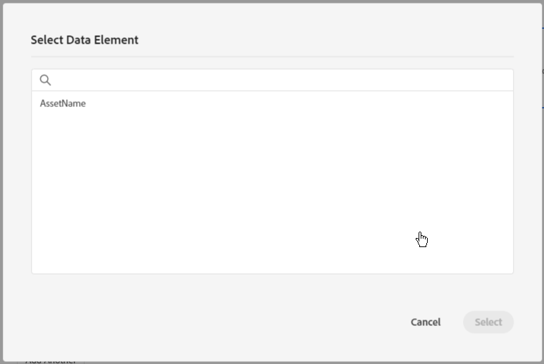
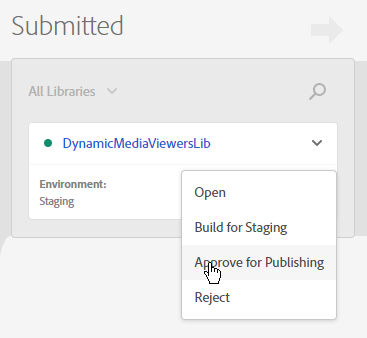

# Dynamic Media-viewers integreren met Adobe Analytics en Adobe Launch {#integrating-dynamic-media-viewers-with-adobe-analytics-and-adobe-launch}

## Wat is de integratie van Dynamic Media Viewers met Adobe Analytics en Adobe Launch? {#what-is-dynamic-media-viewers-integration-with-adobe-analytics-and-adobe-launch}

Met de nieuwe *Dynamic Media Viewers*-extensie voor het starten van de Adobe, samen met de recente release van Dynamic Media Viewers 5.13, kunnen klanten van Dynamic Media, Adobe Analytics en Adobe Launch gebeurtenissen en gegevens gebruiken die specifiek zijn voor de Dynamic Media Viewers in hun configuratie voor het starten van de Adobe.

Dankzij deze integratie kunt u het gebruik van Dynamic Media Viewers op uw website bijhouden met Adobe Analytics. Tegelijkertijd kunt u de gebeurtenissen en gegevens gebruiken die door de viewers beschikbaar worden gesteld, met elke andere extensie voor Starten die afkomstig is van Adobe of een derde.

Zie [Adobe extensions](https://experienceleague.adobe.com/docs/launch/using/extensions-ref/overview.html#adobe-extension) in de Gids van de Gebruiker van het Experience Platform Launch om meer over uitbreidingen te leren.

**Doelgroep van deze documentatie:** Sitebeheerders, ontwikkelaars op het AEM-platform en beheerders in bewerkingen.

### Beperkingen van de integratie {#limitations-of-the-integration}

* Adobe De integratie van de Lancering voor de kijkers van Dynamic Media werkt niet in de AEM auteursknoop. U kunt geen het volgen van een pagina zien WCM tot het wordt gepubliceerd.
* Adobe De-opstartintegratie voor Dynamic Media-viewers wordt niet ondersteund in de pop-upbewerkingsmodus, waarin de URL van de viewer wordt verkregen via de knop &quot;URL&quot; op de pagina Asset Details.
* De integratie van de Lancering van Adobe kan niet gelijktijdig met de integratie van de Analytics van erfeniskijkers worden gebruikt (als parameter `config2=`).
* Ondersteuning voor het bijhouden van video&#39;s is beperkt tot het bijhouden van de kern, zoals wordt beschreven in [Overzicht bijhouden](https://experienceleague.adobe.com/docs/media-analytics/using/sdk-implement/track-av-playback/track-core-overview.html#player-events). Met name QoS, Advertenties, Hoofdstuk/Segmenten, of het volgen van Fouten wordt niet gesteund.
* Configuratie opslagduur voor gegevenselementen wordt niet ondersteund voor gegevenselementen met de extensie *Dynamic Media Viewers*. Opslagduur moet worden ingesteld op **[!UICONTROL None]**.

### Gebruik scenario&#39;s voor de integratie {#use-cases-for-the-integration}

Het belangrijkste gebruiksgeval voor de integratie met Adobe Launch zijn klanten die zowel AEM Assets als AEM Sites gebruiken. In dergelijke scenario&#39;s, kunt u een standaardintegratie tussen uw AEM auteursknoop en de Lancering van de Adobe instellen, dan uw instantie van Plaatsen met het bezit van de Lancering van de Adobe associëren. Daarna volgt elke Dynamic Media WCM-component die aan een sitepagina wordt toegevoegd, de gegevens en gebeurtenissen van viewers.

Zie [Informatie over het bijhouden van Dynamic Media-viewers in AEM Sites](https://wiki.corp.adobe.com/display/~oufimtse/Dynamic+Media+Viewers+integration+with+Adobe+Launch#DynamicMediaViewersintegrationwithAdobeLaunch-TrackingDynamicMediaViewersinAEMSites).

Een tweede gebruiksgeval dat de integratie steunt zijn die klanten die slechts AEM Assets, of Dynamic Media Classic gebruiken. In dergelijke gevallen ontvangt u de insluitcode voor uw viewer en voegt u deze toe aan de websitepagina. Vervolgens haalt u de URL voor het maken van de Adobe-bibliotheek op vanuit Adobe Launch en voegt u deze handmatig toe aan de code van de webpagina.

Zie [Informatie over het bijhouden van Dynamic Media-viewers met behulp van ingesloten code](https://wiki.corp.adobe.com/display/~oufimtse/Dynamic+Media+Viewers+integration+with+Adobe+Launch#DynamicMediaViewersintegrationwithAdobeLaunch-TrackingDynamicMediaViewersusingEmbedcode).

## Hoe gegevens en gebeurtenis volgen werkt in de integratie {#how-data-and-event-tracking-works-in-the-integration}

De integratie maakt gebruik van twee aparte en onafhankelijke typen tracering voor Dynamic Media Viewers: *Adobe Analytics* en *Adobe Analytics for Audio and Video*.

### Informatie over tekstspatiëring met Adobe Analytics {#about-tracking-using-adobe-analytics}

Met Adobe Analytics kunt u handelingen bijhouden die door de eindgebruiker worden uitgevoerd wanneer deze communiceert met Dynamic Media Viewers op uw website. Met Adobe Analytics kunt u ook viewerspecifieke gegevens bijhouden. U kunt bijvoorbeeld de laadgebeurtenissen van de weergave bijhouden en opnemen, samen met de naam van het element, eventuele zoomacties die hebben plaatsgevonden, handelingen voor het afspelen van video enzovoort.

In de Lancering van Adobe werken de concepten *Data Elements* en *Rules* samen om Adobe Analytics-tracking in te schakelen.

#### Gegevenselementen in Adobe starten {#about-data-elements-in-adobe-launch}

Een gegevenselement in Adobe Launch is een benoemde eigenschap waarvan de waarde statisch is gedefinieerd of dynamisch is berekend op basis van de status van een webpagina of Dynamic Media Viewers-gegevens.

De opties die beschikbaar zijn voor een definitie van een gegevenselement, zijn afhankelijk van de lijst met extensies die zijn geïnstalleerd in de Adobe-opstarteigenschap. De &quot;Core&quot;uitbreiding is vooraf geïnstalleerd en beschikbaar uit de doos in om het even welke configuratie. Met deze extensie &quot;Core&quot; kunt u een gegevenselement definiëren dat afkomstig is van cookie, JavaScript-code, queryreeks en vele andere bronnen.

Voor het bijhouden van Adobe Analytics moeten verschillende extra extensies worden geïnstalleerd, zoals beschreven in [Installatie en installatie van extensies](#installing-and-setup-of-extensions). Met de extensie Dynamic Media Viewers kunt u een gegevenselement definiëren dat een argument is van de gebeurtenis Dynamic Viewer. Het is bijvoorbeeld mogelijk te verwijzen naar het viewertype, of de naam van het element die tijdens het laden door de viewer wordt gemeld, het zoomniveau dat wordt gemeld wanneer de eindgebruiker zoomt en nog veel meer.

De extensie Dynamic Media Viewer houdt de waarden van de Data Elements automatisch up-to-date.

Nadat u het hebt bepaald, kan een Element van Gegevens in andere plaatsen van de Adobe Lancering UI worden gebruikt, gebruikend de plukker van het Element van Gegevens widget. In het bijzonder wordt naar gegevenselementen die zijn gedefinieerd voor het bijhouden van Dynamic Media Viewers verwezen door de extensie Set Variables Action of Adobe Analytics in Rule (zie hieronder).

Zie [Gegevenselementen](https://experienceleague.adobe.com/docs/launch/using/reference/manage-resources/data-elements.html#reference) in de Gids van de Gebruiker van het Experience Platform Launch om meer te leren.

#### Informatie over regels in Adobe Launch {#about-rules-in-adobe-launch}

Een regel in het Lanceren van Adobe is een agnostische configuratie die drie gebieden bepaalt die omhoog een regel maken: *Gebeurtenissen*, *Voorwaarden* en *Acties*:

* *Gebeurtenissen*  (als) vertellen het Begin van Adobe wanneer om een Regel teweeg te brengen.
* *Voorwaarden*  (als) vertellen Adobe Launch welke extra beperkingen zijn toegestaan of niet zijn toegestaan wanneer een regel wordt geactiveerd.
* *Handelingen*  (dan) vertellen Adobe Launch wat te doen wanneer een Regel wordt teweeggebracht.

Welke opties beschikbaar zijn in de sectie Gebeurtenissen, Voorwaarden en Handelingen, is afhankelijk van de extensies die zijn geïnstalleerd in de Adobe-opstarteigenschap. De *Core* uitbreiding is vooraf geïnstalleerd en is beschikbaar uit-van-de-doos in om het even welke configuratie. De extensie biedt verschillende opties voor gebeurtenissen, zoals standaardacties op browserniveau, zoals focuswijziging, toetsdrukken, formulierverzendingen enzovoort. Het bevat ook opties voor Voorwaarden, zoals cookiewaarde, browsertype en meer. Voor Acties is alleen de optie Aangepaste code beschikbaar.

Voor het bijhouden van Adobe Analytics moeten verschillende extra extensies worden geïnstalleerd, zoals beschreven in [Installatie en installatie van extensies](#installing-and-setup-of-extensions). Specifiek:

* De extensie Dynamic Media Viewers breidt de lijst met ondersteunde gebeurtenissen uit tot gebeurtenissen die specifiek zijn voor Dynamic Media-viewers, zoals het laden van viewers, het wisselen van middelen, inzoomen en het afspelen van video.
* De extensie Adobe Analytics breidt de lijst met ondersteunde handelingen uit met twee handelingen die vereist zijn voor het verzenden van gegevens naar trackingservers: *Stel variabelen in* en *Verstuur baken*.

Als u Dynamic Media-viewers wilt bijhouden, kunt u elk type van het volgende gebruiken:

* Gebeurtenissen van de extensie Dynamic Media Viewers, Core-extensie of een andere extensie.
* Voorwaarden in de definitie van de regel. Of u kunt het gebied met voorwaarden leeg laten.

In de sectie van Acties, is het vereist dat u een *actie van Variabelen* plaatst. Deze actie vertelt Adobe Analytics hoe te om het volgen variabelen met gegevens te bevolken. Tegelijkertijd verzendt de handeling *Variabelen instellen* niets naar de trackingserver.

De *actie van de Vastgestelde Variabelen* moet door een *actie worden gevolgd verzenden Beacon*. Met de handeling *Send Beacon* worden gegevens daadwerkelijk verzonden naar de analytics tracking-server. Beide acties, *Reeks Variabelen* en *Send Beacon*, komen uit de uitbreiding van Adobe Analytics.

Zie [Regels](https://experienceleague.adobe.com/docs/launch/using/reference/manage-resources/rules.html#reference) in de Gids van de Gebruiker van het Experience Platform Launch om meer te leren.

#### Voorbeeldconfiguratie {#sample-configuration}

In de volgende voorbeeldconfiguratie in Adobe Launch ziet u hoe u een elementnaam kunt bijhouden tijdens het laden van de viewer.

1. Definieer op het tabblad **[!UICONTROL Data Elements]** een gegevenselement `AssetName` dat verwijst naar de parameter `asset` van de gebeurtenis `LOAD` van de extensie Dynamic Media Viewers.

   

1. Definieer op het tabblad **[!UICONTROL Rules]** een regel *TrackAssetOnLoad*.

   In deze regel gebruikt het veld **[!UICONTROL Event]** de gebeurtenis **[!UICONTROL LOAD]** van de extensie Dynamic Media Viewers.

   

1. De configuratie van de Actie heeft twee types van Actie van de uitbreiding van Adobe Analytics:

   *Stel Variabelen* in, die een door u gekozen analytische variabele toewijzen aan de waarde van  `AssetName` Gegevenselement.

   *Stuur Beacon*, die trackinggegevens naar Adobe Analytics verzendt.

   

1. De resulterende regelconfiguratie ziet er als volgt uit:

   

### Informatie over Adobe Analytics for Audio en Video {#about-adobe-analytics-for-audio-and-video}

Wanneer een Experience Cloud-account is geabonneerd om Adobe Analytics for Audio en Video te gebruiken, is het voldoende om het bijhouden van video&#39;s in te schakelen in de extensie-instellingen *Dynamic Media Viewers*. Videomeetgegevens zijn beschikbaar in Adobe Analytics. Het bijhouden van video&#39;s is afhankelijk van de aanwezigheid van Adobe Media Analytics voor audio- en videoextensie.

Zie [Installatie en installatie van extensies](#installing-and-setup-of-extensions).

Momenteel is de ondersteuning voor het bijhouden van video&#39;s beperkt tot alleen &#39;core playback&#39;, zoals beschreven in [Tracking Overview](https://experienceleague.adobe.com/docs/media-analytics/using/sdk-implement/track-av-playback/track-core-overview.html#player-events). Met name QoS, Advertenties, Hoofdstuk/Segmenten, of het volgen van Fouten wordt niet gesteund.

## De Dynamic Media Viewers-extensie {#using-the-dynamic-media-viewers-extension} gebruiken

Zoals vermeld in [Gebruik gevallen voor de integratie](#use-cases-for-the-integration), is het mogelijk om de kijkers van Dynamic Media met de nieuwe Adobe te volgen Lancering integratie in AEM Sites en door ingebedcode te gebruiken.

### Dynamic Media-viewers bijhouden in AEM Sites {#tracking-dynamic-media-viewers-in-aem-sites}

Als u Dynamic Media-viewers in AEM Sites wilt bijhouden, moeten alle stappen worden uitgevoerd die worden vermeld onder de sectie [Alle integratieonderdelen configureren](#configuring-all-the-integration-pieces). Specifiek, moet u de configuratie IMS en de Configuratie van de Cloud van de Adobe creëren.

Na de juiste configuratie worden gegevens automatisch bijgehouden in Dynamic Media-viewers die u aan een sitepagina toevoegt met een WCM-component die door Dynamic Media wordt ondersteund, naar Adobe Analytics, Adobe Analytics for Video of beide.

Zie [Dynamic Media-elementen toevoegen aan pagina&#39;s met behulp van Adobe-sites](/help/assets/dynamic-media/adding-dynamic-media-assets-to-pages.md).

### Dynamic Media-viewers bijhouden met de insluitcode {#tracking-dynamic-media-viewers-using-embed-code}

Klanten die geen AEM Sites gebruiken of Dynamic Media-viewers insluiten in webpagina&#39;s buiten AEM Sites, of beide, kunnen nog steeds gebruikmaken van de integratie Adobe starten.

U moet de configuratiestappen van de secties [Adobe Analytics configureren](#configuring-adobe-analytics-for-the-integration) en [Adobe Launch configureren](#configuring-adobe-launch-for-the-integration) voltooien. Aan AEM gerelateerde configuratiestappen zijn echter niet nodig.

Na de juiste configuratie kunt u ondersteuning voor het starten van Adobe toevoegen aan een webpagina met een Dynamic Media-viewer.

Zie [Code insluiten van starten toevoegen](https://experienceleague.adobe.com/docs/launch-learn/implementing-in-websites-with-launch/configure-launch/launch-add-embed.html#configure-launch) voor meer informatie over het gebruik van insluitcode van bibliotheek Adobe starten.

Zie [De video- of afbeeldingsviewer insluiten op een webpagina](/help/assets/dynamic-media/embed-code.md) voor meer informatie over het gebruik van de insluitcodefunctie van AEM Dynamic Media.

**Dynamic Media-viewers volgen met behulp van insluitcode**

1. Zorg dat een webpagina gereed is voor het insluiten van een Dynamic Media-viewer.
1. Verkrijg de insluitcode voor de bibliotheek van de Lancering van de Adobe door zich eerst aan te melden bij Adobe Launch (zie [Het Vormen de Lancering van Adobe](#configuring-adobe-launch-for-the-integration)).
1. Klik **[!UICONTROL Property]**, dan klik **[!UICONTROL Environments]** tabel.
1. Ophalen van het milieuniveau dat relevant is voor de omgeving van de webpagina. Klik vervolgens in de kolom **[!UICONTROL Install]** op het pictogram van het vak.
1. **[!UICONTROL In the Web Install Instructions]** kopieert u de volledige insluitcode van de Adobe Launch-bibliotheek, samen met de omringende  `<script/>` tags.

## Referentiegids voor de extensie Dynamic Media Viewers {#reference-guide-for-the-dynamic-media-viewers-extension}

### Informatie over de configuratie {#about-the-dynamic-media-viewers-configuration} van Dynamic Media Viewers

De extensie Dynamic Media Viewer wordt automatisch geïntegreerd met de Adobe Launch-bibliotheek als aan alle onderstaande voorwaarden wordt voldaan:

* Adobe Het globale object van de bibliotheek starten ( `_satellite`) is aanwezig op de pagina.
* De Dynamic Media Viewers extension functie `_dmviewers_v001()` wordt gedefinieerd op `_satellite`.

* `config2=` Er is geen viewerparameter opgegeven, wat betekent dat de viewer geen gebruik maakt van verouderde analytische integratie.

Bovendien is er een optie om de integratie van de Adobe Starten in de kijker uitdrukkelijk onbruikbaar te maken door `launch=0` parameter in de configuratie van de kijker te specificeren. De standaardwaarde van deze parameter is `1`.

### De Dynamic Media Viewers-extensie {#configuring-the-dynamic-media-viewers-extension} configureren

De enige configuratieoptie voor de extensie Dynamic Media Viewers is **[!UICONTROL Enable Adobe Media Analytics for Audio and Video]**.

Wanneer u deze optie inschakelt (inschakelen of inschakelen) en als Adobe Media Analytics for Audio en Video is geïnstalleerd en correct is geconfigureerd, worden meetgegevens voor het afspelen van video naar de Adobe Analytics verzonden voor audio- en videooplossing. Als u deze optie uitschakelt, wordt het bijhouden van video uitgeschakeld.

Als u deze optie *inschakelt zonder dat er Adobe Media Analytics for Audio and Video is geïnstalleerd, heeft deze optie geen effect.*

### Informatie over gegevenselementen in de extensie Dynamic Media Viewers {#about-data-elements-in-the-dynamic-media-viewers-extension}

Het enige data-elementtype dat de uitbreiding Dynamische mediaviewers biedt, is **[!UICONTROL Viewer Event]** in de vervolgkeuzelijst **[!UICONTROL Data Element Type]**.

Als deze optie is geselecteerd, maakt de Data Element-editor een formulier met twee velden:

* **[!UICONTROL DM viewers event data type]** - een vervolgkeuzelijst met alle viewergebeurtenissen die door de uitbreiding Dynamische mediaviewers worden ondersteund en die argumenten bevatten, plus een speciaal **[!UICONTROL COMMON]**-item. Een **[!UICONTROL COMMON]**-item vertegenwoordigt een lijst met gebeurtenisparameters die gemeenschappelijk zijn voor alle typen gebeurtenissen die door de viewers worden verzonden.
* **[!UICONTROL Tracking parameter]** - een argument van de geselecteerde Dynamic Media-viewergebeurtenis.

Zie de [Dynamic Media Viewers reference guide](https://experienceleague.adobe.com/docs/dynamic-media-developer-resources/library/viewers-aem-assets-dmc/c-html5-s7-aem-asset-viewers.html) voor de lijst met ondersteunde gebeurtenissen per viewertype; Ga naar de specifieke sectie van de kijker, dan klik Steun voor de sectie van het volgen van Adobe Analytics. Op dit moment worden in de naslaggids voor Dynamic Media Viewers geen gebeurtenisargumenten vastgelegd.

Laten we nu eens kijken naar de levenscyclus van de Dynamic Media Viewers *Data Element*. De waarde van een dergelijk gegevenselement wordt gevuld nadat de bijbehorende Dynamic Media-viewergebeurtenis op de pagina plaatsvindt. Als het gegevenselement bijvoorbeeld naar de gebeurtenis **[!UICONTROL LOAD]** en het argument &quot;asset&quot; verwijst, ontvangt de waarde van dat gegevenselement geldige gegevens nadat de viewer de gebeurtenis LOAD voor de eerste keer uitvoert. Als het gegevenselement naar de gebeurtenis **[!UICONTROL ZOOM]** en het bijbehorende &quot;schaal&quot;argument wijst, zal de waarde van zulk een Element van Gegevens leeg blijven tot de kijker een **[!UICONTROL ZOOM]** gebeurtenis voor het eerst verzendt.

Op dezelfde manier worden de waarden van data-elementen automatisch bijgewerkt wanneer de viewer een overeenkomstige gebeurtenis op de pagina verzendt. De waarde-update gebeurt zelfs als de specifieke gebeurtenis niet in de regelconfiguratie is opgegeven. Als bijvoorbeeld het data-element **[!UICONTROL ZoomScale]** is gedefinieerd voor de &quot;scale&quot;-parameter van de ZOOM-gebeurtenis, maar de enige regel in de regelconfiguratie door de gebeurtenis **[!UICONTROL LOAD]** wordt getriggerd, wordt de waarde van **[!UICONTROL ZoomScale]** nog steeds bijgewerkt telkens als een gebruiker zoomt in de viewer.

Elke viewer voor dynamische media heeft een unieke id op de webpagina. Het data-element houdt de waarde zelf bij en de viewer die de waarde heeft ingevuld. Dit betekent dat als er meerdere viewers op dezelfde pagina zijn en er een data-element **[!UICONTROL AssetName]** is dat naar de gebeurtenis **[!UICONTROL LOAD]** en het bijbehorende &quot;asset&quot;-argument verwijst, het data-element **[!UICONTROL AssetName]** een verzameling assetnamen bijhoudt die zijn gekoppeld aan elke viewer die op de pagina is geladen.

De exacte waarde die door het gegevenselement wordt geretourneerd, is afhankelijk van de context. Als het gegevenselement wordt gevraagd in een Regel die door een de kijkergebeurtenis van Dynamic Media werd teweeggebracht, dan is de waarde van het Element van Gegevens teruggekeerd voor de kijker die de Regel in werking stelde. En, als het Element van Gegevens in een Regel wordt gevraagd die door een Gebeurtenis van één of andere andere uitbreiding van de Lancering van Adobe werd teweeggebracht, dan is de waarde van het Element van Gegevens de waarde van de kijker die laatste was om dit Element van Gegevens bij te werken.

**Bekijk de volgende voorbeeldset-up**:

* Een webpagina met twee Dynamic Media-zoomviewers. zullen wij naar hen als *viewer1* en *viewer2* verwijzen.

* **[!UICONTROL ZoomScale]** Data Element verwijst naar de  **[!UICONTROL ZOOM]** gebeurtenis en het argument &#39;scale&#39; ervan.
* **[!UICONTROL TrackPan]** Regel met het volgende:

   * Gebruikt de Dynamic Media Viewer **[!UICONTROL PAN]**-gebeurtenis als trigger.
   * Verzendt de waarde van **[!UICONTROL ZoomScale]** het Element van Gegevens naar Adobe Analytics.

* **[!UICONTROL TrackKey]** Regel met het volgende:

   * Gebruikt de belangrijkste persgebeurtenis van de uitbreiding van de Adobe van de Kern als trekker.
   * Verzendt de waarde van **[!UICONTROL ZoomScale]** het Element van Gegevens naar Adobe Analytics.

Nu, veronderstel de eindgebruiker de Web-pagina met de twee kijkers laadt. In *viewer1*, zoom zij aan schaal 50% in; Vervolgens zoomen ze in *viewer2* in op een schaal van 25%. In *viewer1*, pannen zij beeld rond, en drukken tenslotte een sleutel op het toetsenbord.

De activiteit van de eindgebruiker resulteert in de volgende twee volgende volgende vraag die aan Adobe Analytics wordt gemaakt:

* De eerste vraag komt voor omdat **[!UICONTROL TrackPan]** de Regel wordt teweeggebracht wanneer de gebruiker in *viewer1* pant. Die vraag verzendt 50% als waarde van **[!UICONTROL ZoomScale]** het Element van Gegevens omdat het Element van Gegevens zal weten dat de Regel door *viewer1* wordt teweeggebracht en de overeenkomstige schaalwaarde haalt;
* De tweede vraag komt voor omdat **[!UICONTROL TrackKey]** de Regel wordt teweeggebracht wanneer de gebruiker op een sleutel op het toetsenbord duwde. Die vraag verzendt 25% als waarde van **[!UICONTROL ZoomScale]** het Element van Gegevens omdat de Regel niet door de kijker werd teweeggebracht. Als dusdanig, keert het Element van Gegevens de meest bijgewerkte waarde terug.

Het voorbeeld hierboven heeft ook invloed op de levensduur van de waarde voor het gegevenselement. De waarde van het gegevenselement dat door de Dynamic Media Viewer wordt beheerd, wordt opgeslagen in de bibliotheekcode van de Adobe Launch-bibliotheek, zelfs nadat de viewer zelf op de webpagina is verwijderd. Dit betekent dat als er een Regel is die door een uitbreiding van de niet-Dynamic Media Kijker en verwijzingen zoals het Element van Gegevens wordt teweeggebracht, het Element van Gegevens de laatst bekende waarde terugkeert, zelfs als de kijker niet meer aanwezig op de Web-pagina is.

De waarden van gegevenselementen die door Dynamic Media Viewers worden aangestuurd, worden in geen geval opgeslagen op de lokale opslag of op de server. in plaats daarvan worden ze alleen in de Adobe Launch-bibliotheek aan de clientzijde bewaard. Waarden van een dergelijk gegevenselement verdwijnen als de webpagina opnieuw wordt geladen.

Over het algemeen biedt de Data Element-editor ondersteuning voor de optie [opslagduur](https://experienceleague.adobe.com/docs/launch/using/reference/manage-resources/data-elements.html?lang=en#create-a-data-element). Gegevenselementen die de extensie Dynamic Media Viewers gebruiken, ondersteunen echter alleen de opslagduuroptie van **[!UICONTROL None]**. Het instellen van een andere waarde is mogelijk in de gebruikersinterface, maar het gedrag Gegevenselement is in dit geval niet gedefinieerd. De extensie beheert de waarde van het gegevenselement op zichzelf: het gegevenselement dat de waarde van het gebeurtenisargument van de viewer tijdens de volledige de levenscyclus van de kijker handhaaft.

### Informatie over Regels in de extensie Dynamic Media Viewers {#about-rules-in-the-dynamic-media-viewers-extension}

In de redacteur van de Regel, voegt de uitbreiding nieuwe configuratieopties voor de redacteur van Gebeurtenissen toe. Ook biedt de toepassing een optie om handmatig te verwijzen naar gebeurtenisparameters in de Action Editor als een kortzichtige optie in plaats van vooraf geconfigureerde gegevenselementen te gebruiken.

#### Informatie over de Events-editor {#about-the-events-editor}

In de gebeurteniseditor voegt de uitbreiding Dynamische mediaviewers een nieuw **[!UICONTROL Event Type]** genaamd **[!UICONTROL Viewer Event]** toe.

Als deze optie is geselecteerd, wordt de vervolgkeuzelijst **[!UICONTROL Dynamic Media Viewer events]** weergegeven met alle beschikbare gebeurtenissen die door Dynamic Media-viewers worden ondersteund.

#### Informatie over de bewerkingseditor {#about-the-actions-editor}

Met de extensie Dynamic Media Viewers kunt u gebeurtenisparameters van Dynamic Media-viewers gebruiken om de variabelen voor de analyse in te delen in de editor Variabelen instellen van de Adobe Analytics-extensie.

De eenvoudigste methode om dat te doen is het volgende twee-stap proces te voltooien:

* Definieer eerst een of meer gegevenselementen, waarbij elk gegevenselement een parameter van een Dynamic Media Viewer-gebeurtenis vertegenwoordigt.
* Tot slot in de Vastgestelde redacteur van Variabelen van de uitbreiding van Adobe Analytics klikt het pictogram van de plukker van het Element van Gegevens (drie gestapelde schijven) om het Uitgezochte de dialoogvakje van het Element van Gegevens te openen, dan selecteer een Element van Gegevens van het.

Het is echter mogelijk om een alternatieve manier te gebruiken en het maken van data-elementen te omzeilen. U kunt rechtstreeks naar een argument van een Dynamische mediaviewer-gebeurtenis verwijzen door de volledig gekwalificeerde naam van het gebeurtenisargument in te voeren in het invoerveld **[!UICONTROL value]** van de Analytics-variabeletoewijzing, omringd door procenttekens (%). Bijvoorbeeld,

`%event.detail.dm.LOAD.asset%`

Er is een belangrijk verschil tussen het gebruik van Data Elements en de verwijzing naar directe-gebeurtenisargumenten. Voor het Element van Gegevens, maakt het niet uit welke gebeurtenis de Vastgestelde actie van Variabelen teweegbrengt, de gebeurtenis die de Regel teweegbrengt kan niet met Dynamische Kijker (als een muisklik op de Web-pagina van de uitbreiding van de Kern) niet van belang zijn. Maar wanneer het gebruiken van een directe argumentverwijzing is het belangrijk om ervoor te zorgen dat de gebeurtenis die de regel teweegbrengt aan het gebeurtenisargument beantwoordt dat het verwijst.

Als bijvoorbeeld wordt verwezen naar `%event.detail.dm.LOAD.asset%`, wordt de juiste assetnaam geretourneerd als de regel wordt getriggerd door de gebeurtenis **[!UICONTROL LOAD]** van de uitbreiding Dynamische mediaviewer. Er wordt echter een lege waarde voor elke andere gebeurtenis geretourneerd.

De volgende tabel bevat een lijst met Dynamic Media Viewer-gebeurtenissen en de argumenten die hiervoor worden ondersteund:

<table>
 <tbody>
  <tr>
   <td>Naam van viewergebeurtenis</td>
   <td>Argument reference</td>
  </tr>
  <tr>
   <td><code>COMMON</code></td>
   <td><code>%event.detail.dm.objID%</code></td>
  </tr>
  <tr>
   <td> </td>
   <td><code>%event.detail.dm.compClass%</code></td>
  </tr>
  <tr>
   <td> </td>
   <td><code>%event.detail.dm.instName%</code></td>
  </tr>
  <tr>
   <td> </td>
   <td><code>%event.detail.dm.timeStamp%</code></td>
  </tr>
  <tr>
   <td><code>BANNER</code> </td>
   <td><code>%event.detail.dm.BANNER.asset%</code></td>
  </tr>
  <tr>
   <td> </td>
   <td><code>%event.detail.dm.BANNER.frame%</code></td>
  </tr>
  <tr>
   <td> </td>
   <td><code>%event.detail.dm.BANNER.label%</code></td>
  </tr>
  <tr>
   <td><code>HREF</code></td>
   <td><code>%event.detail.dm.HREF.rollover%</code></td>
  </tr>
  <tr>
   <td><code>ITEM</code></td>
   <td><code>%event.detail.dm.ITEM.rollover%</code></td>
  </tr>
  <tr>
   <td><code>LOAD</code></td>
   <td><code>%event.detail.dm.LOAD.applicationname%</code></td>
  </tr>
  <tr>
   <td><strong> </strong></td>
   <td><code>%event.detail.dm.LOAD.asset%</code></td>
  </tr>
  <tr>
   <td><strong> </strong></td>
   <td><code>%event.detail.dm.LOAD.company%</code></td>
  </tr>
  <tr>
   <td><strong> </strong></td>
   <td><code>%event.detail.dm.LOAD.sdkversion%</code></td>
  </tr>
  <tr>
   <td><strong> </strong></td>
   <td><code>%event.detail.dm.LOAD.viewertype%</code></td>
  </tr>
  <tr>
   <td><strong> </strong></td>
   <td><code>%event.detail.dm.LOAD.viewerversion%</code></td>
  </tr>
  <tr>
   <td><code>METADATA</code></td>
   <td><code>%event.detail.dm.METADATA.length%</code></td>
  </tr>
  <tr>
   <td> </td>
   <td><code>%event.detail.dm.METADATA.type%</code></td>
  </tr>
  <tr>
   <td><code>MILESTONE</code></td>
   <td><code>%event.detail.dm.MILESTONE.milestone%</code></td>
  </tr>
  <tr>
   <td><code>PAGE</code></td>
   <td><code>%event.detail.dm.PAGE.frame%</code></td>
  </tr>
  <tr>
   <td> </td>
   <td><code>%event.detail.dm.PAGE.label%</code></td>
  </tr>
  <tr>
   <td><code>PAUSE</code></td>
   <td><code>%event.detail.dm.PAUSE.timestamp%</code></td>
  </tr>
  <tr>
   <td><code>PLAY</code></td>
   <td><code>%event.detail.dm.PLAY.timestamp%</code></td>
  </tr>
  <tr>
   <td><code>SPIN</code></td>
   <td><code>%event.detail.dm.SPIN.framenumber%</code></td>
  </tr>
  <tr>
   <td><code>STOP</code></td>
   <td><code>%event.detail.dm.STOP.timestamp%</code></td>
  </tr>
  <tr>
   <td><code>SWAP</code></td>
   <td><code>%event.detail.dm.SWAP.asset%</code></td>
  </tr>
  <tr>
   <td><code>SWATCH</code></td>
   <td><code>%event.detail.dm.SWATCH.frame%</code></td>
  </tr>
  <tr>
   <td> </td>
   <td><code>%event.detail.dm.SWATCH.label%</code></td>
  </tr>
  <tr>
   <td><code>TARG</code></td>
   <td><code>%event.detail.dm.TARG.frame%</code></td>
  </tr>
  <tr>
   <td> </td>
   <td><code>%event.detail.dm.TARG.label%</code></td>
  </tr>
  <tr>
   <td><code>ZOOM</code></td>
   <td><code>%event.detail.dm.ZOOM.scale%</code></td>
  </tr>
 </tbody>
</table>

## Alle integratieonderdelen configureren {#configuring-all-the-integration-pieces}

**VOORDAT U BEGINT**

Als u dit nog niet hebt gedaan, raadt Adobe u aan alle documentatie voorafgaand aan deze sectie grondig te herzien zodat u de volledige integratie begrijpt.

In deze sectie worden de configuratiestappen beschreven die nodig zijn om Dynamic Media-viewers te integreren met Adobe Analytics en Adobe Analytics for Audio en Video. Hoewel het gebruik van de extensie Dynamic Media Viewers voor andere doeleinden in Adobe Launch mogelijk is, worden dergelijke scenario&#39;s niet in deze documentatie behandeld.

U zult de integratie in de volgende producten van Adobe vormen:

* Adobe Analytics - u configureert de volgende variabelen en rapporten.
* Adobe starten - U definieert een eigenschap, een of meer regels en een of meer gegevenselementen om het bijhouden van de viewer in te schakelen.

Bovendien, als deze integratieoplossing met AEM Sites wordt gebruikt, moet de volgende configuratie ook worden gedaan:

* Adobe I/O Console - integratie wordt gecreeerd voor de Lancering van Adobe.
* AEM auteurknooppunt - IMS-configuratie en Adobe-configuratie van de opstartcloud.

Als deel van de configuratie, zeker bent u toegang tot een bedrijf in Adobe Experience Cloud hebt dat Adobe Analytics en de Lancering van Adobe reeds heeft toegelaten.

## Adobe Analytics configureren voor integratie {#configuring-adobe-analytics-for-the-integration}

Nadat u Adobe Analytics hebt geconfigureerd, wordt het volgende voor integratie ingesteld:

* Er is een rapportsuite geïnstalleerd en geselecteerd.
* De Variabelen van de Analyse zijn beschikbaar om het volgen gegevens te ontvangen.
* Rapporten zijn beschikbaar voor het weergeven van verzamelde gegevens in Adobe Analytics.

Zie ook [Analytics Implementation Guide](https://experienceleague.adobe.com/docs/analytics/implementation/home.html).

**Adobe Analytics configureren voor integratie**:

1. Begin door Adobe Analytics van de Experience Cloud [homepage](https://exc-home.experiencecloud.adobe.com/exc-home/home.html#/) toegang te hebben. Klik in de menubalk op het pictogram Oplossingen (drie bij drie punten) rechtsboven op de pagina en klik vervolgens op **[!UICONTROL Analytics]**.

   

   U selecteert nu een rapportsuite.

### Een rapportsuite selecteren {#selecting-a-report-suite}

1. Selecteer in de rechterbovenhoek van de Adobe Analytics-pagina rechts van het veld **[!UICONTROL Search Reports]** de juiste rapportsuite in de vervolgkeuzelijst. Als er meerdere rapportsuites beschikbaar zijn en u niet zeker weet welke suite u moet gebruiken, neemt u contact op met uw Adobe Analytics-beheerder. Deze beheerder kan u helpen bij het selecteren van de rapportsuite die moet worden gebruikt.

   In de onderstaande afbeelding heeft een gebruiker een rapportsuite met de naam *DynamicMediaViewersExtensionDoc* gemaakt en deze geselecteerd in de vervolgkeuzelijst. De naam van de rapportsuite is alleen ter illustratie; de naam van de rapportsuite die u uiteindelijk selecteert, verschilt.

   Als er geen rapportsuite beschikbaar is, moet u of uw Adobe Analytics-beheerder er een maken voordat u verder kunt gaan met de configuratie.

   Zie [Rapporten en Rapporten ](https://experienceleague.adobe.com/docs/analytics/admin/manage-report-suites/report-suites-admin.html#manage-report-suites) en [Een rapportsuite](https://experienceleague.adobe.com/docs/analytics/admin/admin-console/create-report-suite.html#admin-console) maken.

   In Adobe Analytics worden rapportsuites beheerd onder **[!UICONTROL Admin > Report Suites]**.

   

   U gaat nu Adobe Analytics-variabelen instellen.

### Adobe Analytics-variabelen instellen {#setting-up-adobe-analytics-variables}

1. U geeft nu een of meer Adobe Analytics-variabelen aan die u wilt gebruiken om het gedrag van Dynamic Media Viewers op de webpagina bij te houden.

   U kunt elk type variabele gebruiken dat door Adobe Analytics wordt ondersteund. De beslissing over het variabeletype (zoals het Verkeer van de Douane [props], de Omzetting [eVar]) zou door specifieke behoeften van u de implementatie van Analytics moeten worden gedreven.

   Zie [Overzicht van props en eVars](https://experienceleague.adobe.com/docs/analytics/implementation/vars/page-vars/evar.html#vars).

   In het kader van deze documentatie wordt alleen een variabele Custom Traffic (props) gebruikt, omdat deze binnen een paar minuten nadat een handeling op een webpagina heeft plaatsgevonden, beschikbaar komt in een Analytics-rapport.

   Als u een nieuwe variabele Aangepast verkeer wilt inschakelen, klikt u op **[!UICONTROL Admin > Report Suites]** op de werkbalk in Adobe Analytics.

1. Selecteer op de pagina **[!UICONTROL Report Suite Manager]** het juiste rapport en klik vervolgens op de werkbalk op **[!UICONTROL Edit Settings > Traffic > Traffic Variables]**.
1. Daar, neem ongebruikte variabele op, geef het een beschrijvende naam ( **[!UICONTROL Viewer asset (prop 30)]**) en verander combodoos in &quot;Toegelaten&quot;in de Toegelaten kolom.

   De volgende schermafbeelding is een voorbeeld van een variabele van het Verkeer van de Douane ( **[!UICONTROL prop30]**) voor het volgen van een activanaam die door de kijker wordt gebruikt:

   

1. Klik onder aan de lijst met variabelen op **[!UICONTROL Save]**.

### Een rapport instellen {#setting-up-a-report}

1. Over het algemeen wordt het opstellen van een rapport in Adobe Analytics gestuurd door specifieke projectbehoeften. Als dusdanig, is de gedetailleerde rapportopstelling voorbij het werkingsgebied voor deze integratie.

   Het is echter genoeg om te weten dat de rapporten van het Verkeer van de Douane automatisch beschikbaar worden in Adobe Analytics nadat u de variabelen van het Verkeer van de Douane in **[het Plaatsen van Adobe Analytics variabelen](#setting-up-adobe-analytics-variables)** opstelt.

   Het rapport voor de variabele **[!UICONTROL Viewer asset (prop 30)]** is bijvoorbeeld beschikbaar in het menu Rapporten onder **[!UICONTROL Custom Traffic > Custom Traffic 21-30 > Viewer asset (prop 30)]**.

   Als u dit rapport meteen na het maken van **[!UICONTROL Viewer asset (prop 30)]** bezoekt, worden er geen data weergegeven. Dat wordt op dit moment in de integratie verwacht.

   

## Het vormen de Lancering van Adobe voor de integratie {#configuring-adobe-launch-for-the-integration}

Nadat u de Lancering van Adobe vormt, zal het volgende opstelling voor de integratie zijn:

* Het creëren van een nieuw Bezit om al uw configuraties samen te houden.
* De installatie en installatie van extensies. De client-side code van alle extensies die in de eigenschap zijn geïnstalleerd, wordt samen gecompileerd in een bibliotheek. Deze bibliotheek wordt later door de webpagina gebruikt.
* Configuratie van gegevenselementen en regels. Deze configuratie bepaalt welke gegevens van de kijkers van Dynamic Media moeten vangen, wanneer om de volgende logica teweeg te brengen, en waar om de gegevens van de kijker in Adobe Analytics te verzenden.
* Publiceren van de bibliotheek.

**Om de Lancering van Adobe voor de integratie** te vormen:

1. Begin door Adobe te openen van de Experience Cloud [homepage](https://exc-home.experiencecloud.adobe.com/exc-home/home.html#/). Klik in de menubalk op het pictogram Oplossingen (drie bij drie punten) rechtsboven op de pagina en klik vervolgens op **[!UICONTROL Launch]**.

   U kunt ook [Adobe direct starten openen](https://launch.adobe.com/).

   

### Een eigenschap maken in Adobe Launch {#creating-a-property-in-adobe-launch}

Een eigenschap in Adobe Launch is een benoemde configuratie die al uw instellingen bij elkaar houdt. Er wordt een bibliotheek met de configuratie-instellingen gegenereerd en gepubliceerd op verschillende milieuniveaus (ontwikkeling, staging en productie).

Zie ook [Een opstarteigenschap maken](https://experienceleague.adobe.com/docs/launch-learn/implementing-in-mobile-android-apps-with-launch/configure-launch/launch-create-a-property.html#configure-launch).

1. Klik in Adobe Launch op **[!UICONTROL New Property]**.
1. Typ in het dialoogvenster **[!UICONTROL Create Property]** in het veld **[!UICONTROL Name]** een beschrijvende naam, zoals de titel van uw website. Bijvoorbeeld, `DynamicMediaViewersProp.`
1. Voer in het veld **[!UICONTROL Domains]** het domein van uw website in.
1. Schakel in de vervolgkeuzelijst **[!UICONTROL Advanced Options]** de optie **[!UICONTROL Configure for extension development (cannot be modified later)]** in als de uitbreiding die u wilt gebruiken (in dit geval *Dynamische mediaviewers*) nog niet wordt vrijgegeven.

   

1. Klik op **[!UICONTROL Save]**.

   Klik op de nieuw gecreëerde eigenschap en ga vervolgens door naar *Installatie en installatie van extensions*.

### Installatie en installatie van extensies {#installing-and-setup-of-extensions}

Alle beschikbare extensies in Adobe Launch worden weergegeven onder **[!UICONTROL Extensions > Catalog]**.

Klik op **[!UICONTROL Install]** om een extensie te installeren. Voer zo nodig een eenmalige extensieconfiguratie uit en klik op **[!UICONTROL Save]**.

Waar nodig moeten de volgende extensies worden geïnstalleerd en geconfigureerd:

* (Vereist) *Experience Cloud ID Service* extensie

Geen extra configuratie is nodig, keur voor om het even welke voorgestelde waarden goed. Wanneer u wordt gedaan, zeker bent u **[!UICONTROL Save]** klikt.

Zie [Experience Cloud ID Service Extension](https://experienceleague.adobe.com/docs/launch/using/extensions-ref/adobe-extension/id-service-extension/overview.html#extensions-ref).

* (Vereist) *Adobe Analytics*-extensie

Als u deze uitbreiding wilt configureren, hebt u eerst de rapportsuite-id in Adobe Analytics nodig die u vindt onder **[!UICONTROL Admin > Report Suite]** onder de kolomkop **[!UICONTROL Report Suite ID]**.

(Alleen voor demonstratiedoeleinden wordt de rapportsuite-id van de **[!UICONTROL DynamicMediaViewersExtensionDoc]**-rapportsuite gebruikt in de volgende schermafbeeldingen. Deze id is eerder gemaakt en gebruikt in [Een rapportsuite selecteren](#selecting-a-report-suite).)

Voer op de pagina Uitbreiding installeren de rapportsuite-id in het veld **[!UICONTROL Development Report Suites]**, het veld **[!UICONTROL Staging Report Suites]** en het veld **[!UICONTROL Production Report Suites]** in.

*Configureer het volgende item alleen als u videotracering wilt gebruiken:*

Vouw op de pagina **[!UICONTROL Install Extension]** **[!UICONTROL General]** uit en geef vervolgens de trackingserver op. De volgende server volgt de sjabloon `<trackingNamespace>.sc.omtrdc.net`, waarbij `<trackingNamespace>` de informatie is die in de inrichtingse-mail wordt verkregen.

Klik op **[!UICONTROL Save]**.

Zie [Adobe Analytics Extension](https://experienceleague.adobe.com/docs/launch/using/extensions-ref/adobe-extension/analytics-extension/overview.html#extensions-ref).

* (Optioneel. Alleen vereist als videotracering nodig is) *Adobe Media-analyse voor audio en video*-extensie

Vul het veld Trackingserver in. De trackingserver voor de extensie *Adobe Media Analytics voor Audio en Video* is anders dan de trackingserver die voor Adobe Analytics wordt gebruikt. Hierna volgt de sjabloon `<trackingNamespace>.hb.omtrdc.net`, waarbij `<trackingNamespace>` de informatie uit de inrichtingse-mail is.

Alle andere velden zijn optioneel.

Zie [Adobe Media Analytics for Audio and Video Extension](https://experienceleague.adobe.com/docs/launch/using/extensions-ref/adobe-extension/media-analytics-extension/overview.html#extensions-ref).

* (Vereist) *Dynamic Media Viewers*-extensie

Schakel **[!UICONTROL enable Adobe Analytics for Video]** in om het bijhouden van videorecorders in te schakelen.

Merk op dat—op het ogenblik van dit schrijven—de *uitbreiding van de Kijkers van Dynamic Media* slechts beschikbaar is als het Bezit van de Lancering van de Adobe voor ontwikkeling wordt gecreeerd.

Zie [Een eigenschap maken in Adobe Launch](#creating-a-property-in-adobe-launch).

Nadat de extensies zijn geïnstalleerd en ingesteld, worden ten minste de volgende vijf extensies (vier extensies als u geen video bijhoudt) weergegeven in het gedeelte Extensies > Geïnstalleerd.

### Gegevenselementen en regels instellen {#setting-up-data-elements-and-rules}

Maak bij Adobe Launch gegevenselementen en -regels die nodig zijn voor het bijhouden van Dynamic Media-viewers.

Zie [Hoe gegevens en gebeurtenis het volgen in de integratie ](#how-data-and-event-tracking-works-in-the-integration) voor een overzicht van het volgen met de Lancering van Adobe werkt.

Zie [Sampleconfiguratie](#sample-configuration) voor een voorbeeldconfiguratie in Adobe Launch die aantoont hoe te om een activanaam bij de lading van de kijker te volgen.

Zie [De extensie Dynamic Media Viewers configureren](#configuring-the-dynamic-media-viewers-extension) voor uitgebreide informatie over de mogelijkheden van de extensie.

### Bibliotheek {#publishing-a-library} publiceren

Als u wijzigingen wilt aanbrengen in de configuratie voor het starten van de Adobe (inclusief de instelling Eigenschap, Extensies, Regels en Gegevenselementen), moet u dergelijke wijzigingen *publiceren*. Het publiceren in de Lancering van Adobe wordt uitgevoerd van het Publiceren lusje onder de configuratie van het Bezit.

De Lancering van Adobe kan veelvoudige milieu&#39;s van de Ontwikkeling, één het Opvoeren milieu, en één milieu van de Productie hebben. Door gebrek richt de Configuratie van de Wolk van de Lancering van de Adobe in AEM de AEM auteurknoop aan het milieu van het Stadium van de Lancering van Adobe, en AEM publicatieknooppunt aan het milieu van de Productie van de Lancering van Adobe. Deze regeling betekent dat met de standaard AEM montages, het noodzakelijk is om de bibliotheek van de Lancering van de Adobe aan het Staging milieu te publiceren zodat gebruik van het in AEM auteur, en dan het in het milieu van de Productie te publiceren zodat het in AEM publicatie kan worden gebruikt.

Zie [Omgevingen](https://experienceleague.adobe.com/docs/launch/using/reference/publish/environments/environments.html#environment-types) voor meer informatie over Adobe Launch-omgevingen.

Bij het publiceren van een bibliotheek worden de volgende twee stappen uitgevoerd:

* Het toevoegen van en het bouwen van een nieuwe bibliotheek door alle noodzakelijke veranderingen (nieuwe degenen en updates) in de bibliotheek te omvatten.
* De bibliotheek naar boven verplaatsen via de verschillende milieuniveaus (van ontwikkeling tot Staging en Productie)

#### Een nieuwe bibliotheek toevoegen en maken {#adding-and-building-a-new-library}

1. De eerste keer dat u het tabblad Publiceren opent in Adobe Launch, is de bibliotheeklijst leeg.

   Klik in de linkerkolom op **[!UICONTROL Add New Library]**.

   

1. Voer op de pagina Nieuwe bibliotheek maken in het veld **[!UICONTROL Name]** een beschrijvende naam in voor de nieuwe bibliotheek. Bijvoorbeeld,

   *DynamicMediaViewersLib*

   Kies in de vervolgkeuzelijst Milieu het niveau Milieu. In eerste instantie is alleen het ontwikkelingsniveau beschikbaar voor selectie. Klik **[!UICONTROL Add All Changed Resources]** linksonder op de pagina.

   

1. Klik in de rechterbovenhoek van de pagina op **[!UICONTROL Save & Build for Development]**.

   Over enkele minuten wordt de bibliotheek gemaakt en klaar voor gebruik.

   

   >[!NOTE]
   >
   >De volgende keer dat u wijzigingen aanbrengt in uw Adobe Launch-configuratie, gaat u naar het tabblad **[!UICONTROL Publishing]** onder de **[!UICONTROL Property]**-configuratie en klikt u op de eerder gemaakte bibliotheek.
   >
   >
   >Klik in het publicatiescherm van de bibliotheek op **[!UICONTROL Add All Changed Resources]** en klik vervolgens op **[!UICONTROL Save & Build for Development]**.

#### Een bibliotheek naar boven verplaatsen via milieuniveaus {#moving-a-library-up-through-environment-levels}

1. Nadat een nieuwe bibliotheek wordt toegevoegd, wordt het aanvankelijk gevestigd in het milieu van de Ontwikkeling. Klik in het vervolgkeuzemenu van de bibliotheek op **[!UICONTROL Submit for Approval]** om deze naar het niveau van de testomgeving (dat overeenkomt met de kolom Verzenden) te verplaatsen.

   

1. Klik in het bevestigingsdialoogvenster op **[!UICONTROL Submit]**.

   Klik in het vervolgkeuzemenu van de bibliotheek op **[!UICONTROL Build for Staging]** nadat de bibliotheek naar de kolom Verzonden is gegaan.

   

1. Volg een vergelijkbaar proces om de bibliotheek van de Staging-omgeving naar de productieomgeving te verplaatsen (de kolom Published).

   Klik eerst in het keuzemenu op **[!UICONTROL Approve for Publishing]**.

   

1. Klik in het keuzemenu op **[!UICONTROL Build & Publish to Production]**.

   

   Zie [Publiceren](https://experienceleague.adobe.com/docs/launch/using/reference/publish/overview.html#reference) voor meer informatie over het publicatieproces bij het starten van de Adobe.

## Adobe Experience Manager configureren voor integratie {#configuring-adobe-experience-manager-for-the-integration}

<!-- Prerequisites list below should be verified by Sasha -->

Vereisten:

* AEM voert zowel de instanties Auteur als Publish uit.
* AEM auteurknooppunt is ingesteld in Dynamic Media. <!-- Scene7 run mode (dynamicmedia_s7) -->
* Dynamic Media WCM-componenten zijn ingeschakeld in AEM Sites.

De AEM configuratie bestaat uit de volgende twee belangrijke stappen:

* Configuratie van AEM IMS.
* Configuratie van Adobe Launch Cloud.

### AEM IMS {#configuring-aem-ims} configureren

1. Klik in AEM auteur op het pictogram Gereedschappen (hamer) en klik vervolgens op **[!UICONTROL Security > Adobe IMS Configurations]**.

   

1. Voor de pagina van de Configuratie van Adobe IMC, bij de upper-left hoek, klik **[!UICONTROL Create]**.
1. Klik op de pagina **[!UICONTROL Adobe IMS Technical Account Configuration]** in de vervolgkeuzelijst **[!UICONTROL Cloud Solution]** op **[!UICONTROL Adobe Launch]**.
1. Schakel **[!UICONTROL Create new certificate]** in en voer in het tekstveld een betekenisvolle waarde voor het certificaat in. Bijvoorbeeld *AdobeLaunchIMSCert*. Klik op **[!UICONTROL Create certificate]**.

   Het volgende Info-bericht wordt weergegeven:

   *Als u een geldig toegangstoken wilt ophalen, moet de openbare sleutel van het nieuwe certificaat worden toegevoegd aan de technische account op Adobe I/O!*.

   Klik op **[!UICONTROL OK]** om het dialoogvenster Info te sluiten.

   

1. Klik **[!UICONTROL Download Public Key]** om een dossier van de openbare sleutel (`*.crt`) aan uw lokaal systeem te downloaden.

   >[!NOTE]
   >
   >Op dit punt laat u de pagina **[!UICONTROL Adobe IMS Technical Account Configuration]** ***open***. Sluit de pagina ***niet*** en klik ***niet*** op Volgende. U keert later in de stappen terug naar deze pagina.

   

1. Navigeer op een nieuw browsertabblad naar de [Adobe I/O-console](https://console.adobe.io/integrations).

1. Klik op **[!UICONTROL Adobe I/O Console Integrations]** in de rechterbovenhoek op **[!UICONTROL New integration]**.
1. Controleer in het dialoogvenster **[!UICONTROL Create a new integration]** of het keuzerondje **[!UICONTROL Access an API]** is geselecteerd en klik vervolgens op **[!UICONTROL Continue]**.

   

1. Schakel op de tweede pagina **[!UICONTROL Create a new integration]** het keuzerondje **[!UICONTROL Experience Platform Launch API]** in. Klik in de rechterbenedenhoek van de pagina op **[!UICONTROL Continue]**.

   

1. Ga als volgt te werk op de derde pagina **[!UICONTROL Create a new integration]**:

   * Voer in het veld **[!UICONTROL Name]** een beschrijvende naam in. Bijvoorbeeld *DynamicMediaViewersIO*.

   * Voer in het veld **[!UICONTROL Description]** een beschrijving in voor de integratie.

   * Upload in het gebied **[!UICONTROL Public key certificates]** het bestand met de openbare sleutel (`*.crt`) dat u eerder in deze stappen hebt gedownload.

   * Selecteer **[!UICONTROL Admin]** onder de kop **[!UICONTROL Select a role for Experience Platform Launch API]**.

   * Selecteer onder de kop **[!UICONTROL Select one or more product profiles for Experience Platform Launch API]** het productprofiel **[!UICONTROL Launch - <your_company_name>]**.

   

1. Klik op **[!UICONTROL Create integration]**.
1. Ga naar de pagina **[!UICONTROL Integration created]** en klik op **[!UICONTROL Continue to integration details]**.

   

1. Er wordt een pagina met integratiedetails weergegeven, vergelijkbaar met het volgende:

   >[!NOTE]
   >
   >***Laat deze pagina met integratiedata open***. U zult verschillende stukken informatie van de tabbladen **[!UICONTROL Overview]** en **[!UICONTROL JWT]** zo meteen nodig hebben.

   
   _Pagina met integratiedetails_

1. Ga terug naar de pagina **[!UICONTROL Adobe IMS Technical Account Configuration]** die u eerder geopend hebt gelaten. Klik in de rechterbovenhoek van de pagina op **[!UICONTROL Next]** om de pagina **[!UICONTROL Account]** in het venster **[!UICONTROL Adobe IMS Technical Account Configuration]** te openen.

   (Als u de pagina per ongeluk eerder hebt gesloten, gaat u terug naar de AEM-auteur en klikt u op **[!UICONTROL Tools > Security > Adobe IMS Configurations]**. Klik op **[!UICONTROL Create]**. Selecteer in de vervolgkeuzelijst **[!UICONTROL Cloud Solution]** de optie **[!UICONTROL Adobe Launch]**. Selecteer in de vervolgkeuzelijst **[!UICONTROL Certificate]** de naam van het eerder gemaakte certificaat.

   
   _Adobe IMS Technical Account Configuration - Certificate page_

1. De **[!UICONTROL Account]** pagina heeft vijf gebieden die u zullen vereisen om het gebruiken van informatie van de de detailpagina van de Integratie van de vorige stap te vullen.

   
   _Adobe IMS Technical Account Configuration - Account page_

1. Vul op de pagina **[!UICONTROL Account]** de volgende velden in:

   * **[!UICONTROL Title]** - Voer een beschrijvende accounttitel in.
   * **[!UICONTROL Authorization Server]** - Ga terug naar de pagina met integratiegegevens die u eerder hebt geopend. Klik op het tabblad **[!UICONTROL JWT]**. Kopieer de servernaam, zonder het pad, zoals hieronder gemarkeerd.

(De naam van de voorbeeldserver is alleen ter illustratie)   Ga terug naar de pagina **[!UICONTROL Account]** en plak de naam in het desbetreffende veld.
Bijvoorbeeld `https://ims-na1.adobelogin.com/`
(De naam van de voorbeeldserver is alleen ter illustratie)

   
   _Detailpagina voor integratie - tabblad JWT_

1. **[!UICONTROL API Key]** - Ga terug naar de pagina met integratiedetails. Klik op het tabblad **[!UICONTROL Overview]** en klik vervolgens rechts van het veld **[!UICONTROL API Key (Client ID)]** op **[!UICONTROL Copy]**.

   Ga terug naar de pagina **[!UICONTROL Account]** en plak de toets in het desbetreffende veld.

   
   _Pagina met integratiedetails_

1. **[!UICONTROL Client Secret]**- Ga terug naar de pagina met integratiedetails. Klik op het tabblad **[!UICONTROL Overview]** op **[!UICONTROL Retrieve Client Secret]**. Klik rechts van het veld **[!UICONTROL Client secret]** op **[!UICONTROL Copy]**.

   Ga terug naar de pagina **[!UICONTROL Account]** en plak de toets in het desbetreffende veld.

1. **[!UICONTROL Payload]** - Ga terug naar de pagina met integratiedetails. Kopieer op het tabblad **[!UICONTROL JWT]** in het veld JWT Payload de gehele JSON-objectcode.

   Ga terug naar de pagina **[!UICONTROL Account]** en plak de code in het desbetreffende veld.

   
   _Pagina met integratiegegevens - tabblad JWT_

   De pagina Account, met alle velden ingevuld, ziet er ongeveer als volgt uit:

   

1. Klik in de rechterbovenhoek van de pagina **[!UICONTROL Account]** op **[!UICONTROL Create]**.

   Met AEM gevormde IMS, hebt u nu een nieuwe die IMSArekening onder **[!UICONTROL Adobe IMS Configurations]** wordt vermeld.

   

## Adobe Launch Cloud configureren voor integratie {#configuring-adobe-launch-cloud-for-the-integration}

1. Klik in AEM auteur in de linkerbovenhoek op het pictogram Gereedschappen (hamer) en klik vervolgens op **[!UICONTROL Cloud Services > Adobe Launch Configurations]**.

   

1. Selecteer op de pagina **[!UICONTROL Adobe Launch Configurations]** in het linkerdeelvenster een AEM Site waarvoor u de configuratie voor het starten van de Adobe wilt toepassen.

   Alleen ter illustratie wordt de **[!UICONTROL We.Retail]**-site geselecteerd in de onderstaande schermafbeelding.

   

1. Klik in de linkerbovenhoek van de pagina op **[!UICONTROL Create]**.
1. Vul op de pagina **[!UICONTROL General]** (1/3 pagina&#39;s) van het venster **[!UICONTROL Create Adobe Launch Configuration]** de volgende velden in:

   * **[!UICONTROL Title]** - Voer een beschrijvende configuratitel in. Bijvoorbeeld, `We.Retail Launch cloud configuration`.

   * **[!UICONTROL Associated Adobe IMS Configuration]** - Selecteer de IMS-configuratie die u eerder hebt gemaakt in  [AEM IMS](#configuring-aem-ims) configureren.

   * **[!UICONTROL Company]** - Selecteer uw Experience Cloud bedrijf in de  **[!UICONTROL Company]** vervolgkeuzelijst. De lijst wordt automatisch gevuld.

   * **[!UICONTROL Property]** - Selecteer in de vervolgkeuzelijst Eigenschap de Adobe-opstarteigenschap die u eerder hebt gemaakt. De lijst wordt automatisch gevuld.
   Nadat u alle velden hebt ingevuld, ziet uw **[!UICONTROL General]**-pagina er ongeveer als volgt uit:

   

1. Klik in de linkerbovenhoek op **[!UICONTROL Next]**.
1. Vul op de pagina **[!UICONTROL Staging]** (2/3 pagina&#39;s) van het venster **[!UICONTROL Create Adobe Launch Configuration]** het volgende veld in:

   Controleer in het veld **[!UICONTROL Library URI]** de locatie van de staging versie van uw Adobe Launch-bibliotheek. Dit veld wordt automatisch ingevuld door AEM.

   Voor illustratiedoeleinden slechts, zal deze stap de bibliotheken van de Lancering van Adobe gebruiken die aan Adobe CDN worden opgesteld.

   >[!NOTE]
   >
   >Controleer of de automatisch gevulde bibliotheek-URI (Uniform Resource Identifier) niet onjuist is samengesteld. Herstel indien nodig de URL zodanig dat deze een protocol-relatieve URI vertegenwoordigt. Dat wil zeggen dat het begint met een dubbele slash.
   >
   >
   >Bijvoorbeeld: `//assets.adobetm.com/launch-xxxx`.

   Uw pagina **[!UICONTROL Staging]** moet er ongeveer als volgt uitzien. Merk op dat de opties **[!UICONTROL Archive]** en **[!UICONTROL Load Library Asynchronously]** ***niet*** zijn ingesteld:

   

1. Klik in de rechterbovenhoek op **[!UICONTROL Next]**.
1. Herstel, indien nodig, de automatisch gevulde productie-URI op de pagina **[!UICONTROL Production]** (3/3 pagina&#39;s) van het venster **[!UICONTROL Create Adobe Launch Configuration]** op ongeveer dezelfde manier als op de vorige pagina **[!UICONTROL Staging]**.
1. Klik in de rechterbovenhoek op **[!UICONTROL Create]**.

   Uw nieuwe Adobe Launch Cloud Configuration wordt nu gemaakt en weergegeven naast uw website.

1. Selecteer de nieuwe Adobe Cloud Configuration (Cloud-configuratie starten) (er verschijnt een vinkje links van de configuratietoets wanneer deze is geselecteerd). Klik op **[!UICONTROL Publish]** op de werkbalk.

   

AEM auteur biedt momenteel geen ondersteuning voor de integratie van Dynamic Media Viewers met Adobe Launch.

Deze eigenschap wordt echter ondersteund in het publicatieknooppunt AEM. Met de standaardinstellingen van Adobe Launch Cloud Configuration AEM publish wordt de productieomgeving van Adobe Launch gebruikt. Daarom is het noodzakelijk om Adobe Launch library updates van Development naar de Productomgeving te duwen telkens tijdens de test.

Het is mogelijk om deze beperking te omzeilen door de ontwikkelings- of staging-URL van de Adobe Launch-bibliotheek op te geven in de configuratie van de Adobe Launch Cloud voor AEM publicatie hierboven. Hierdoor gebruikt het AEM publicatieknooppunt de ontwikkelings- of staging-versie van de Adobe Launch-bibliotheek.

Zie [AEM integreren met Adobe starten via Adobe I/O](https://helpx.adobe.com/experience-manager/using/aem_launch_adobeio_integration.html) voor meer informatie over het instellen van Adobe Launch Cloud Configuration.