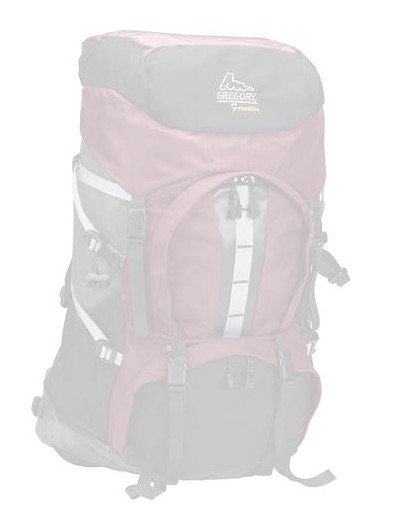

# Voorinstellingen afbeelding beheren{#managing-image-presets}

Met voorinstellingen voor afbeeldingen kunnen AEM Assets dynamisch afbeeldingen van verschillende grootten, in verschillende indelingen of met andere afbeeldingseigenschappen leveren die dynamisch worden gegenereerd. Elke voorinstelling voor afbeeldingen vertegenwoordigt een vooraf gedefinieerde verzameling opdrachten voor het vergroten of verkleinen en opmaken van afbeeldingen. Wanneer u een voorinstelling voor afbeeldingen maakt, kiest u een grootte voor het leveren van de afbeelding. U kiest ook opmaakopdrachten, zodat de weergave van de afbeelding wordt geoptimaliseerd wanneer de afbeelding wordt geleverd voor weergave.

Beheerders kunnen voorinstellingen maken voor het exporteren van elementen. Gebruikers kunnen bij het exporteren van afbeeldingen een voorinstelling kiezen. Hiermee worden de afbeeldingen ook opnieuw opgemaakt volgens de specificaties die de beheerder heeft opgegeven.

U kunt ook voorinstellingen voor afbeeldingen maken die reageren. Als u een voorinstelling voor een responsieve afbeelding toepast op uw elementen, worden deze afhankelijk van het apparaat of de schermgrootte waarop ze worden weergegeven. U kunt afbeeldingsvoorinstellingen zo configureren dat deze naast RGB of Grijs ook CMYK gebruiken in de kleurruimte.

In deze sectie wordt beschreven hoe u voorinstellingen voor afbeeldingen maakt, wijzigt en over het algemeen beheert. U kunt een voorinstelling voor afbeeldingen op elk gewenst moment op een afbeelding toepassen. Zie [Voorinstellingen](/help/assets/dynamic-media/image-presets.md)voor afbeeldingen toepassen.

>[!NOTE]
>
>Slimme beeldverwerking werkt met bestaande voorinstellingen voor afbeeldingen en maakt gebruik van intelligentie tijdens de laatste milliseconde van levering om de bestandsgrootte van de afbeelding verder te beperken op basis van de snelheid van de browser of netwerkverbinding. Zie [Slimme afbeeldingen](/help/assets/dynamic-media/imaging-faq.md) voor meer informatie.

## Voorinstellingen voor afbeeldingen {#understanding-image-presets}

Net als bij een macro is een voorinstelling voor afbeeldingen een vooraf gedefinieerde verzameling opdrachten voor het vergroten of verkleinen en opmaken van de grootte die onder een naam zijn opgeslagen. Als u wilt weten hoe Voorinstellingen afbeelding werken, kunt u instellen dat elke productafbeelding op uw website moet worden weergegeven in verschillende formaten, formaten en compressiesnelheden voor levering op het bureaublad en op mobiele apparatuur.

U kunt twee voorinstellingen voor afbeeldingen maken: één met 500 x 500 pixels voor desktopversie en 150 x 150 pixels voor de mobiele versie. U maakt twee voorinstellingen voor afbeeldingen, een voorinstelling die wordt aangeroepen `Enlarge` om afbeeldingen met 500 x 500 pixels weer te geven en een voorinstelling die wordt aangeroepen `Thumbnail` om afbeeldingen met 150 x 150 pixels weer te geven. AEM zoekt naar de definitie van de voorinstelling Afbeelding vergroten `Enlarge` en Afbeelding met miniatuur om afbeeldingen op `Thumbnail` grootte en grootte te kunnen leveren. Vervolgens genereert AEM dynamisch een afbeelding met de grootte en opmaakspecificaties van elke voorinstelling voor afbeeldingen.

Afbeeldingen die bij dynamische levering kleiner worden gemaakt, kunnen scherper en gedetailleerder worden. Daarom bevat elke voorinstelling voor afbeeldingen opmaakbesturingselementen waarmee u een afbeelding kunt optimaliseren wanneer deze met een bepaalde grootte wordt geleverd. Met deze besturingselementen zorgt u ervoor dat uw afbeeldingen scherp en duidelijk zijn wanneer ze aan uw website of toepassing worden geleverd.

Beheerders kunnen voorinstellingen voor afbeeldingen maken. Als u een voorinstelling voor een afbeelding wilt maken, begint u helemaal opnieuw of u kunt een bestaande voorinstelling beginnen en opslaan onder een andere naam.

## Voorinstellingen afbeelding beheren {#managing-image-presets-1}

U beheert uw voorinstellingen voor afbeeldingen in AEM door te tikken op of te klikken op het AEM-logo voor toegang tot de algemene navigatieconsole en vervolgens te tikken of te klikken op het pictogram Extra en naar **[!UICONTROL Assets > Image Presets]** te navigeren.


>[!NOTE]
>
>Alle afbeeldingsvoorinstellingen die u maakt, zijn ook beschikbaar als dynamische uitvoeringen wanneer u elementen voorvertoont of levert.
>
>U hoeft *geen* voorinstellingen voor afbeeldingen te publiceren omdat voorinstellingen voor afbeeldingen automatisch worden gepubliceerd.
>
>Zie Voorinstellingen afbeelding [publiceren.](#publishing-image-presets)

>[!NOTE]
>
>Het systeem toont een verscheidenheid van vertoningen wanneer u in de Mening van het Detail van activa selecteert. **[!UICONTROL Renditions]** U kunt het aantal voorinstellingen voor afbeeldingen dat wordt weergegeven, verhogen of verlagen. See [Increasing the number of image presets that display](#increasing-or-decreasing-the-number-of-image-presets-that-display).

### Adobe Illustrator (AI)-, PostScript (EPS)- en PDF-bestandsindelingen {#adobe-illustrator-ai-postscript-eps-and-pdf-file-formats}

Als u de opname van AI-, EPS- en PDF-bestanden wilt ondersteunen, zodat u dynamische uitvoeringen van deze bestandsindelingen kunt genereren, is het verstandig de volgende informatie te bekijken voordat u voorinstellingen voor afbeeldingen maakt.

De bestandsindeling van Adobe Illustrator is een variant van PDF. De belangrijkste verschillen in de context van AEM Assets zijn:

* Adobe Illustrator-documenten bestaan uit één pagina met meerdere lagen. Elke laag wordt geëxtraheerd als een PNG-subelement onder het hoofdelement van Illustrator.
* PDF-documenten bestaan uit een of meer pagina&#39;s. Elke pagina wordt uitgepakt als een PDF-subelement van één pagina onder het PDF-hoofddocument met meerdere pagina&#39;s.

De subelementen worden door de `Create Sub Asset process` component binnen de algemene `DAM Update Asset` workflow gemaakt. Tik op deze procescomponent **[!UICONTROL Tools > Workflow > Models > DAM Update Asset > Edit]** om deze binnen de workflow weer te geven.

<!-- See also [Viewing pages of a multi-page file](/help/assets/manage-linked-subassets.md#view-pages-of-a-multi-page-file). -->

U kunt de submiddelen of de pagina&#39;s weergeven wanneer u het element opent, tikt op het menu Inhoud en selecteert **[!UICONTROL Subassets]** of **[!UICONTROL Pages]**. De subactiva zijn reële activa. Dat wil zeggen dat PDF-pagina&#39;s worden geëxtraheerd door de `Create Sub Asset` workflowcomponent. Ze worden vervolgens opgeslagen als `page1.pdf`, `page2.pdf`enzovoort, onder het hoofdmiddel. Nadat ze zijn opgeslagen, worden ze door de `DAM Update Asset` workflow verwerkt.

Als u Dynamic Media wilt gebruiken om dynamische uitvoeringen voor AI-, EPS- of PDF-bestanden voor te vertonen en te genereren, moet u de volgende verwerkingsstappen uitvoeren:

1. In het `DAM Update Asset` werkschema, rasterizes de `Rasterize PDF/AI Image Preview Rendition` procescomponent de eerste pagina van origineel element-gebruikend gevormde resolutie-in een `cqdam.preview.png` vertoning.

1. De `cqdam.preview.png` uitvoering wordt vervolgens in een PTIFF-bestand geoptimaliseerd door de `Dynamic Media Process Image Assets` procescomponent in de workflow.

>[!NOTE]
>
>In de workflow Asset-updates van DAM worden miniaturen voor EPS-bestanden gegenereerd in de stap **[!UICONTROL EPS thumbnails]**.

#### Eigenschappen van PDF/AI/EPS-metagegevens {#pdf-ai-eps-asset-metadata-properties}

| **Eigenschap Metadata** | **Beschrijving** |
|---|---|
| dam:Physicalwidthinches | Documentbreedte in inches. |
| dam:Physicalheightininches | Documenthoogte in inches. |

Via de `Rasterize PDF/AI Image Preview Rendition` workflow hebt u toegang tot opties voor `DAM Update Asset` procescomponenten.

Tik op de Adobe Experience Manager linksboven en navigeer naar **[!UICONTROL Tools > Workflow > Models]**. Selecteer op de pagina Workflowmodellen de optie **[!UICONTROL DAM Update Asset]** en tik vervolgens op de werkbalk **[!UICONTROL Edit]**. Tik op de pagina met DAM-updategegevens op de `Rasterize PDF/AI Image Preview Rendition` procescomponent om het dialoogvenster Step Properties te openen.

#### Opties van PDF/AI-voorvertoning van afbeelding omzetten in pixels {#rasterize-pdf-ai-image-preview-rendition-options}


Argumenten voor het rasteren van PDF- of AI-workflow

<table>
 <tbody>
  <tr>
   <td><strong>Procesargument</strong></td>
   <td><strong>Standaardinstelling</strong></td>
   <td><strong>Beschrijving</strong></td>
  </tr>
  <tr>
   <td>MIME-typen</td>
   <td><p>application/pdf</p> <p>application/postscript</p> <p>toepassing/illustrator<br /> </p> </td>
   <td>Lijst met documenttypen die als PDF- of Illustrator-documenten worden beschouwd.<br /> </td>
  </tr>
  <tr>
   <td>Max. breedte</td>
   <td>2048</td>
   <td>Maximale breedte van de gegenereerde voorvertoning, in pixels.<br /> </td>
  </tr>
  <tr>
   <td>Max. hoogte</td>
   <td>2048</td>
   <td>Maximumhoogte van de gegenereerde voorvertoning, in pixels.<br /> </td>
  </tr>
  <tr>
   <td>Resolutie</td>
   <td>72</td>
   <td>Resolutie voor het rasteren van de eerste pagina, in ppi (pixels per inch).</td>
  </tr>
 </tbody>
</table>

Met de standaardprocesargumenten wordt de eerste pagina van een PDF/AI-document gerasterd met 72 ppi en de gegenereerde voorvertoningsafbeelding met een grootte van 2048 x 2048 pixels. Voor een gebruikelijke implementatie kunt u de resolutie verhogen tot minimaal 150 ppi of meer. Een document met een tekengrootte van 300 ppi in de VS vereist bijvoorbeeld een maximale breedte en hoogte van respectievelijk 2550 x 3300 pixels.

Met Maximale breedte en Maximumhoogte kunt u de resolutie beperken waarbij rasteren wordt beperkt. Als de maximale waarden bijvoorbeeld ongewijzigd blijven en de resolutie is ingesteld op 300 ppi, wordt een US Letter-document gerasterd naar 186 ppi. Het document is dus 1581 x 2046 pixels.

Voor de `Rasterize PDF/AI Image Preview Rendition` procescomponent is een maximum gedefinieerd, zodat er geen te grote afbeeldingen in het geheugen worden gemaakt. Dergelijke grote afbeeldingen kunnen het geheugen overlopen dat aan de JVM (Java Virtual Machine) wordt geleverd. Er moet op worden gelet dat de JVM over voldoende geheugen beschikt om het geconfigureerde aantal parallelle workflows te beheren, waarbij elk van beide de mogelijkheid heeft om een image op de maximaal geconfigureerde grootte te maken.

### InDesign-bestandsindeling (INDD) {#indesign-indd-file-format}

Als u de opname van INDD-bestanden wilt ondersteunen, zodat u dynamische uitvoering van deze bestandsindeling kunt genereren, is het verstandig de volgende informatie te bekijken voordat u voorinstellingen voor afbeeldingen maakt.

Voor InDesign-bestanden worden subelementen alleen geëxtraheerd als de Adobe InDesign-server is geïntegreerd met AEM. Elementen waarnaar wordt verwezen, zijn gekoppeld op basis van hun metagegevens. InDesign Server is niet vereist voor koppelingen. De bestanden waarnaar wordt verwezen, moeten echter aanwezig zijn in AEM voordat de InDesign-bestanden worden verwerkt, zodat de koppelingen tussen de InDesign-bestanden en de bestanden waarnaar wordt verwezen, kunnen worden gemaakt.

<!-- See [Integrating AEM Assets with InDesign Server](/help/assets/indesign.md). -->

Met de component Media Extraction Process in de `DAM Update Asset` workflow worden verschillende vooraf geconfigureerde Extend Scripts uitgevoerd voor het verwerken van InDesign-bestanden.


De ExtendScript-paden in de argumenten van Media Extraction Process-component in de DAM Update Asset-workflow.

De volgende scripts worden gebruikt door Dynamic Media-integratie:

<table>
 <tbody>
  <tr>
   <td><strong>Scriptnaam uitbreiden</strong></td>
   <td><strong>Standaard</strong></td>
   <td><strong>Beschrijving</strong></td>
  </tr>
  <tr>
   <td>ThumbnailExport.jsx</td>
   <td>Ja</td>
   <td>Genereert een 300 ppi- <code>thumbnail.jpg</code> uitvoering die is geoptimaliseerd en door <code>Dynamic Media Process Image Assets</code> procescomponent is omgezet in een PTIFF-uitvoering.<br /> </td>
  </tr>
  <tr>
   <td>JPEGPagesExport.jsx</td>
   <td>Ja</td>
   <td>Hiermee genereert u een JPEG-subelement van 300 ppi voor elke pagina. Het JPEG-subelement is een echt middel dat wordt opgeslagen onder het InDesign-element. Het wordt ook geoptimaliseerd en door de <code>DAM Update Asset</code> workflow omgezet in een PTIFF-bestand.<br /> </td>
  </tr>
  <tr>
   <td>PDFPagesExport.jsx</td>
   <td>Nee</td>
   <td>Hiermee genereert u een PDF-subelement voor elke pagina. Het PDF-subelement wordt verwerkt zoals eerder beschreven. Omdat de PDF slechts één pagina bevat, worden geen subelementen gegenereerd.<br /> </td>
  </tr>
 </tbody>
</table>

### Miniatuurgrootte van afbeelding configureren {#configuring-image-thumbnail-size}

U kunt de grootte van miniaturen configureren door deze instellingen in de **[!UICONTROL DAM Update Asset]** workflow te configureren. De workflow bevat twee stappen waarmee u de miniatuurgrootte van afbeeldingselementen kunt configureren. Hoewel het ene (**[!UICONTROL Dynamic Media Process Image Assets]**) wordt gebruikt voor dynamische afbeeldingselementen en het andere (**[!UICONTROL Process Thumbnails]**) voor het genereren van statische miniaturen of wanneer bij alle andere processen geen miniaturen worden gegenereerd, moeten *beide* dezelfde instellingen hebben.

Met de stap **[!UICONTROL Dynamic Media Process Image Assets]** worden miniaturen gegenereerd door de afbeeldingsserver en deze configuratie is onafhankelijk van de configuratie die op de stap **[!UICONTROL Process Thumbnails]** is toegepast. Het genereren van miniaturen via de stap **[!UICONTROL Process Thumbnails]** is de langzaamste en meest geheugenintensieve manier om miniaturen te maken.

Miniatuurgrootte wordt gedefinieerd in de volgende indeling: **[!UICONTROL width:height:center]**, bijvoorbeeld *80:80:false*. De breedte en hoogte bepalen de grootte in pixels van de miniatuur; de middelste waarde is onwaar of true en als de waarde true is, wordt aangegeven dat de miniatuurafbeelding exact dezelfde grootte heeft als in de configuratie. Als het formaat van de afbeelding kleiner is, wordt de afbeelding gecentreerd in de miniatuur.

>[!NOTE]
>
>* De miniatuurgrootte voor EPS-bestanden wordt in de stap **[!UICONTROL EPS thumbnails]** geconfigureerd op het tabblad **[!UICONTROL Arguments]** onder Miniaturen.
   >
   >
* Miniatuurgrootte voor video&#39;s wordt geconfigureerd in de stap **[!UICONTROL FFmpeg thumbnails]** op het tabblad **[!UICONTROL Process]** onder **[!UICONTROL Arguments]**.
>


**De grootte van afbeeldingsminiaturen configureren**

1. Tik op **[!UICONTROL Tools > Workflow > Models > DAM Update Asset > Edit]**.
1. Tap the **[!UICONTROL Dynamic Media Process Image Assets]** step and tap the **[!UICONTROL Thumbnails]** tab. Wijzig desgewenst de miniatuurgrootte en tik op **[!UICONTROL OK]**.

   

1. Tik op de stap **[!UICONTROL Process Thumbnails]** en tik vervolgens op het tabblad **[!UICONTROL Thumbnails]**. Wijzig desgewenst de miniatuurgrootte en tik op **[!UICONTROL OK]**.

   >[!NOTE]
   >
   >De waarden in het argument voor miniaturen in de stap **[!UICONTROL Process Thumbnails]** moeten overeenkomen met het argument voor miniaturen in de stap **[!UICONTROL Dynamic Media Process Image Assets]**.

1. Tik **[!UICONTROL Save]** om de wijzigingen in de workflow op te slaan.

### Het aantal voorinstellingen voor afbeeldingen dat wordt weergegeven verhogen of verlagen {#increasing-or-decreasing-the-number-of-image-presets-that-display}

Afbeeldingsvoorinstellingen die u maakt, zijn beschikbaar als dynamische uitvoeringen wanneer u een voorvertoning van elementen weergeeft. AEM toont een verscheidenheid van dynamische vertoningen wanneer het bekijken van activa van **[!UICONTROL Detail View > Renditions]**. U kunt de limiet van weergegeven uitvoeringen verhogen of verlagen.

**Het aantal weergegeven voorinstellingen voor afbeeldingen vergroten of verkleinen**

1. Navigeer naar CRXDE Lite ([https://localhost:4502/crx/de](https://localhost:4502/crx/de)).
1. Navigeer naar het knooppunt met vooraf ingestelde lijsten voor afbeeldingen op `/libs/dam/gui/coral/content/commons/sidepanels/imagepresetsdetail/imgagepresetslist`

   

1. Wijzig in de eigenschap **[!UICONTROL limit]** de **[!UICONTROL Value]**, die standaard op 15 is ingesteld, in het gewenste getal.
1. Navigeer naar de gegevensbron voor de afbeeldingsvoorinstelling op `/libs/dam/gui/coral/content/commons/sidepanels/imagepresetsdetail/imgagepresetslist/datasource`

   

1. Wijzig in de eigenschap limit het getal in het gewenste getal, bijvoorbeeld `{empty requestPathInfo.selectors[1] ? "20" : requestPathInfo.selectors[1]}`
1. Tik op **[!UICONTROL Save All]**.

### Een voorinstelling voor afbeeldingen maken {#creating-image-presets}

Als u een voorinstelling voor afbeeldingen maakt, kunt u deze instellingen op alle afbeeldingen toepassen wanneer u een voorvertoning weergeeft of publiceert.

>[!NOTE]
>
>Als u Internet Explorer 9 gebruikt, wordt het maken van een voorinstelling niet meteen na het opslaan weergegeven in de lijst met voorinstellingen. U kunt dit probleem omzeilen door de cache voor IE9 uit te schakelen.

Als u de opname van AI-, PDF- en EPS-bestanden wilt ondersteunen, zodat u een dynamische uitvoering van deze bestandsindelingen kunt genereren, is het verstandig de volgende informatie te bekijken voordat u voorinstellingen voor afbeeldingen maakt.
Zie [Adobe Illustrator (AI), PostScript (EPS) en PDF-bestandsindelingen](#adobe-illustrator-ai-postscript-eps-and-pdf-file-formats).

Als u de opname van INDD-bestanden wilt ondersteunen, zodat u dynamische uitvoering van deze bestandsindeling kunt genereren, is het verstandig de volgende informatie te bekijken voordat u voorinstellingen voor afbeeldingen maakt.
Zie [De bestandsindeling](#indesign-indd-file-format)InDesign (INDD).

**Een voorinstelling voor afbeeldingen maken**

1. Tik in AEM op het AEM-logo om toegang te krijgen tot de globale navigatieconsole en tik vervolgens op **[!UICONTROL Tools > Assets > Image Presets]**.
1. Klik op **[!UICONTROL Create]**. Het **[!UICONTROL Edit Image Preset]** venster wordt geopend.

   

   >[!NOTE]
   >
   >Als u deze voorinstelling responsief wilt maken, wist u de waarden in de velden **[!UICONTROL width]** en **[!UICONTROL height]** en laat u deze leeg.

1. Voer desgewenst waarden in op de tabbladen **[!UICONTROL Basic]** en **[!UICONTROL Advanced]**, inclusief een naam. De opties worden beschreven in [Opties voor afbeeldingsvoorinstellingen](#image-preset-options). Voorinstellingen worden weergegeven in het linkerdeelvenster en kunnen direct samen met andere assets worden gebruikt.

   

1. Klik op **[!UICONTROL opslaan**.

### Creating a responsive Image Preset {#creating-a-responsive-image-preset}

Als u een responsieve voorinstelling voor afbeeldingen wilt maken, voert u de stappen uit in Voorinstellingen [voor](#creating-image-presets)afbeeldingen maken. Wanneer u de hoogte en breedte in het **[!UICONTROL Edit Image Preset]** venster invoert, wist u de waarden en laat u deze leeg.

Als u deze leeg laat, weet AEM dat op deze voorinstelling kan worden gereageerd. U kunt de andere waarden desgewenst aanpassen.

>[!NOTE]
>
>Als u de knoppen **[!UICONTROL URL]** en **[!UICONTROL RESS]** wilt zien wanneer u een voorinstelling voor een afbeelding op een asset toepast, moet de asset worden gepubliceerd.
>
>
>
>Voorinstellingen voor afbeeldingen en afbeeldingselementen worden automatisch gepubliceerd.

### Voorinstellingsopties voor afbeelding {#image-preset-options}

Wanneer u voorinstellingen voor afbeeldingen maakt of bewerkt, worden de opties in deze sectie beschreven. Daarnaast raadt Adobe aan om de volgende opties voor beste praktijken te kiezen:

* **[!UICONTROL Indeling]** (tabblad **[!UICONTROL Basic]**) - Selecteer **[!UICONTROL JPEG]** of een andere indeling die aan uw vereisten voldoet. Alle webbrowsers ondersteunen de JPEG-afbeeldingsindeling. Deze biedt een goede balans tussen kleine bestandsgrootten en afbeeldingskwaliteit. JPEG-afbeeldingen gebruiken echter een compressieschema met dataverlies dat ongewenste afbeeldingsartefacten kan veroorzaken als de compressie-instelling te laag is. Daarom raadt Adobe aan de compressiekwaliteit in te stellen op 75. Deze instelling biedt een goede balans tussen afbeeldingskwaliteit en kleine bestandsgrootte.

* **[!UICONTROL Enable Simple Sharpening]** - Niet selecteren **[!UICONTROL Enable Simple Sharpening]** (dit verscherpingsfilter biedt minder controle dan de instellingen voor onscherpe maskering).

* **[!UICONTROL Sharpening: Resampling Mode]** - Selecteer **[!UICONTROL Bi-Cubic]**.

#### Opties op het tabblad Standaard {#basic-tab-options}

<table>
 <tbody>
  <tr>
   <td><strong>Veld</strong></td>
   <td><strong>Beschrijving</strong></td>
  </tr>
  <tr>
   <td><strong>Naam</strong></td>
   <td>Voer een beschrijvende naam in zonder spaties. Neem de specificatie voor afbeeldingsgrootte op in de naam, zodat gebruikers deze voorinstelling voor afbeeldingen gemakkelijker kunnen herkennen.</td>
  </tr>
  <tr>
   <td><strong>Breedte en Hoogte</strong></td>
   <td>Voer in pixels de grootte in waarmee de afbeelding wordt geleverd. De breedte en hoogte moeten groter zijn dan 0 pixels. Als een van deze waarden 0 is, wordt geen voorinstelling gemaakt. Als beide waarden leeg zijn, wordt een responsieve voorinstelling voor de afbeelding gemaakt.</td>
  </tr>
  <tr>
   <td><strong>Format</strong></td>
   <td><p>Kies een indeling in het menu.</p> <p>Als u <strong>JPEG</strong> kiest, hebt u de volgende aanvullende opties:</p>
    <ul>
     <li><strong>Kwaliteit</strong> - Hiermee bepaalt u het compressieniveau JPEG. Deze instelling is van invloed op zowel de bestandsgrootte als de afbeeldingskwaliteit. De JPEG-kwaliteitsschaal is 1-100. De schaal is zichtbaar wanneer u de schuifregelaar versleept.</li>
     <li><strong>Downsampling</strong> van JPG-chrominantie inschakelen - Omdat het oog minder gevoelig is voor hoogfrequente kleurinformatie dan hoogfrequente luminantie, verdelen JPEG-afbeeldingen afbeeldingsgegevens in luminantie en kleurcomponenten. Wanneer een JPEG-afbeelding wordt gecomprimeerd, blijft de luminantiecomponent op volledige resolutie staan, terwijl de kleurcomponenten worden gedownsampled door het gemiddelde te nemen van groepen pixels. Door downsampling wordt het gegevensvolume met de helft of met een derde verminderd, zonder dat dit van invloed is op de waargenomen kwaliteit. Downsampling is niet van toepassing op grijswaardenafbeeldingen. Met deze techniek vermindert u de hoeveelheid compressie die handig is voor afbeeldingen met veel contrast (bijvoorbeeld afbeeldingen met overlappende tekst).</li>
    </ul>
    <div>
      Als u <strong>GIF</strong> of <strong>GIF met alfa</strong> kiest, kunt u de volgende aanvullende opties voor de kwantiteit <strong>van</strong> GIF-kleuren kiezen:
    </div>
    <ul>
     <li><strong>Type </strong>- Selecteer <strong>Adaptief</strong> (standaard), <strong>Web</strong>of <strong>Macintosh</strong>. If you select <strong>GIF with Alpha</strong>, the Macintosh option is not available.</li>
     <li><strong>Dithering</strong> - Selecteer <strong>Diffuus</strong> of <strong>Uit</strong>.</li>
     <li><strong>Aantal kleuren </strong>- Voer een getal in tussen 2 en 256.</li>
     <li><strong>Kleurenlijst</strong> - voer een lijst in met door komma's gescheiden waarden. Voer voor wit, grijs en zwart bijvoorbeeld 000000,888888,ffffffff in.</li>
    </ul>
    <div>
      Als u <strong>PDF</strong>, <strong>TIFF</strong>of <strong>TIFF met alfa</strong> kiest, kunt u het volgende instellen:
    </div>
    <ul>
     <li><strong>Compressie</strong> - Selecteer een compressiealgoritme. Algoritmeopties voor PDF zijn <strong>Geen</strong>, <strong>Postcode</strong>en <strong>JPEG</strong>; voor TIFF zijn <strong>None</strong>, <strong>LZW</strong>, <strong>Jpeg</strong>en <strong>Zip</strong>; en voor TIFF met alfa zijn <strong>Geen</strong>, <strong>LZW</strong>en <strong>Zip</strong>.</li>
    </ul> <p>Het kiezen van <strong>PNG</strong>, <strong>PNG met Alpha,</strong> of <strong>EPS</strong> verstrekt geen extra opties.</p> </td>
  </tr>
  <tr>
   <td><strong>Verscherpen</strong></td>
   <td>Selecteer de optie <strong>Eenvoudig verscherpen</strong> inschakelen om een standaard verscherpingsfilter toe te passen op de afbeelding nadat alle schaling heeft plaatsgevonden. Verscherpen kan helpen de vervaging te compenseren die kan optreden wanneer u een afbeelding met een andere grootte weergeeft. </td>
  </tr>
 </tbody>
</table>

#### Opties op het tabblad Geavanceerd {#advanced-tab-options}

<table>
 <tbody>
  <tr>
   <td><strong>Veld</strong></td>
   <td><strong>Beschrijving</strong></td>
  </tr>
  <tr>
   <td><strong>Kleurruimte</strong></td>
   <td>Selecteer <strong>RGB,</strong> CMYK of <strong>Grijswaarden</strong> voor de kleurruimte.</td>
  </tr>
  <tr>
   <td><strong>Kleurprofiel</strong></td>
   <td>Selecteer het kleurruimteprofiel van de uitvoer waarnaar het element moet worden geconverteerd als het anders is dan het werkprofiel.</td>
  </tr>
  <tr>
   <td><strong>Render-intentie</strong></td>
   <td>U kunt de standaard rendering intent overschrijven. Render-intenties bepalen wat er gebeurt met kleuren die niet in het doelkleurprofiel kunnen worden gereproduceerd (buiten kleuromvang). De render-intentie wordt genegeerd als deze niet compatibel is met het ICC-profiel.
    <ul>
     <li>Selecteer <strong>Perceptueel</strong> om de totale kleuromvang van de ene kleurruimte naar een andere kleurruimte te comprimeren wanneer een of meer kleuren in de oorspronkelijke afbeelding buiten de kleuromvang van de doelkleurruimte vallen.</li>
     <li>Selecteer <strong>Relatief colorimetrisch</strong> wanneer een kleur in de huidige kleurruimte zich buiten de kleuromvang in de doelkleurruimte bevindt en u wilt deze kleur toewijzen aan de dichtstbijzijnde mogelijke kleur binnen de kleuromvang van de doelkleurruimte zonder dat dit van invloed is op andere kleuren. </li>
     <li>Selecteer <strong>Verzadiging</strong> om de oorspronkelijke kleurverzadiging van de afbeelding weer te geven bij de omzetting in de doelkleurruimte. </li>
     <li>Selecteer <strong>Absoluut colorimetrisch</strong> om de kleuren exact af te stemmen zonder aanpassing voor het witpunt of zwartpunt waardoor de helderheid van de afbeelding wordt gewijzigd.</li>
    </ul> </td>
  </tr>
  <tr>
   <td><strong>Compensatie zwartpunt</strong></td>
   <td>Selecteer deze optie als het uitvoerprofiel deze functie ondersteunt. Zwartpuntcompensatie wordt genegeerd als deze niet compatibel is met het opgegeven ICC-profiel.</td>
  </tr>
  <tr>
   <td><strong>Dithering</strong></td>
   <td>Selecteer deze optie als u kleurstreepvorming mogelijk wilt voorkomen of verminderen. </td>
  </tr>
  <tr>
   <td><strong>Verscherpingstype</strong></td>
   <td><p>Selecteer <strong>Geen</strong>, <strong>Verscherpen</strong>of <strong>Onscherp masker</strong>. </p>
    <ul>
     <li>Selecteer <strong>Geen</strong> om verscherpen uit te schakelen.</li>
     <li>Selecteer <strong>Verscherpen </strong>om een standaard verscherpingsfilter toe te passen op de afbeelding nadat alle schaling heeft plaatsgevonden. Verscherpen kan helpen de vervaging te compenseren die kan optreden wanneer u een afbeelding met een andere grootte weergeeft. </li>
     <li>Select<strong> Unsharp mask</strong> to fine-tune a sharpening filter effect on the final downsampled image. U kunt de intensiteit van het effect, de straal van het effect (gemeten in pixels) en een drempel voor het contrast instellen die wordt genegeerd. Voor dit effect worden dezelfde opties gebruikt als voor het filter Onscherp masker van Photoshop.</li>
    </ul> <p>In <strong>Onscherp masker</strong>hebt u de volgende opties:</p>
    <ul>
     <li><strong>Hoeveelheid</strong> - Hiermee bepaalt u de hoeveelheid contrast die wordt toegepast op de randpixels. De standaardwaarde voor het reële getal is 1,0. Voor afbeeldingen met hoge resolutie kunt u de resolutie verhogen tot 5,0. Beschouw Hoeveelheid als een maat voor de filterintensiteit.</li>
     <li><strong>Straal</strong> - Hiermee bepaalt u het aantal pixels rondom de randpixels dat invloed heeft op de verscherping. Voer voor afbeeldingen met een hoge resolutie een getal in tussen 1 en 2. Bij een lage waarde worden alleen de randpixels verscherpt. met een hoge waarde wordt een grotere reeks pixels verscherpt . De juiste waarde is afhankelijk van de grootte van de afbeelding.</li>
     <li><strong>Drempel</strong> - Hiermee bepaalt u het contrastbereik dat moet worden genegeerd wanneer het filter Onscherp masker wordt toegepast. Met andere woorden, met deze optie bepaalt u hoe verschillend de verscherpte pixels moeten zijn van het omringende gebied voordat ze als randpixels worden beschouwd en worden verscherpt. Experimenteer met gehele getallen tussen 2 en 20 om ruis te voorkomen. </li>
     <li><strong>Toepassen op</strong> - Hiermee wordt bepaald of de verscherping wordt toegepast op elke kleur of helderheid.</li>
    </ul>
    <div>
      Verscherpen wordt beschreven in <a href="https://docs.adobe.com/content/help/en/dynamic-media-classic/using/assets/s7_sharpening_images.pdf">Verscherpen van afbeeldingen</a>.
    </div> </td>
  </tr>
  <tr>
   <td><strong>Modus voor nieuwe pixels</strong></td>
   <td>Selecteer een optie voor de modus <strong></strong> Nieuwe pixels berekenen. Met deze opties verscherpt u de afbeelding wanneer deze wordt gedownsampled:
    <ul>
     <li><strong>Bi-Lineair</strong> : de snelste methode voor het berekenen van nieuwe pixels. Sommige aliasingartefacten zijn waarneembaar.</li>
     <li><strong>Bi-Cubic</strong> : verhoogt het CPU-gebruik, maar geeft scherpere beelden met minder merkbare aliasing artefacten.</li>
     <li><strong>Sharp2</strong> - kan enigszins scherpere resultaten dan bi-Cubic, maar bij een nog hogere cpu kosten veroorzaken.</li>
     <li><strong>Bi-Sharp</strong> - Hiermee selecteert u standaardresampler voor Photoshop voor het verkleinen van de afbeeldingsgrootte. Dit wordt in Adobe Photoshop <strong>bicubisch scherper</strong> genoemd.</li>
     <li><strong>Elke kleur</strong> en <strong>Helderheid</strong> - elke methode kan op kleur of helderheid worden gebaseerd. Standaard is <strong>Elke kleur</strong> geselecteerd.</li>
    </ul> </td>
  </tr>
  <tr>
   <td><strong>Afdrukresolutie</strong></td>
   <td>Selecteer een resolutie voor het afdrukken van deze afbeelding. 72 pixels is de standaardinstelling.</td>
  </tr>
  <tr>
   <td><strong>Afbeelding wijzigen</strong></td>
   <td><p>Naast de algemene afbeeldingsinstellingen die beschikbaar zijn in de gebruikersinterface, ondersteunen Dynamic Media talrijke geavanceerde afbeeldingswijzigingen die u kunt opgeven in het veld <strong>Afbeeldingswijzigingstoetsen</strong> . Deze parameters worden bepaald in de het bevelverwijzing <a href="https://docs.adobe.com/content/help/en/dynamic-media-developer-resources/image-serving-api/image-serving-api/http-protocol-reference/command-reference/c-command-reference.html">van het Protocol van de Server van het</a>Beeld.</p> <p>Belangrijk: De volgende functionaliteit in de API wordt niet ondersteund:</p>
    <ul>
     <li>Standaardopdrachten voor sjablonen en tekstrendering: <code>text= textAngle= textAttr= textFlowPath= textFlowXPath= textPath=</code> en <code>textPs=</code></li>
     <li>Localisatie-opdrachten: <code>locale=</code> en <code>req=xlate</code></li>
     <li><code>req=set</code> is niet beschikbaar voor algemeen gebruik.</li>
     <li><code>req=mbrset</code></li>
     <li><code>req=saveToFile</code></li>
     <li><code>req=targets</code></li>
     <li><code>template=</code></li>
     <li>Niet-kerndiensten voor Dynamic Media: SVG, Afbeelding renderen en Web-to-Print</li>
    </ul> </td>
  </tr>
 </tbody>
</table>

### Opties voor voorinstellingen afbeelding definiëren met afbeeldingsopties {#defining-image-preset-options-with-image-modifiers}

Naast de opties op de tabbladen Standaard en Geavanceerd kunt u ook opties voor het wijzigen van afbeeldingen definiëren voor het definiëren van voorinstellingen voor afbeeldingen. Het teruggeven van het beeld baseert zich op Scene7 beeld die API teruggeeft en in detail bepaald in de Verwijzing [van het](https://microsite.omniture.com/t2/help/en_US/s7/is_ir_api/is_api/http_ref/c_http_protocol_reference.html)HTTP- Protocol.

Hieronder volgen enkele basisvoorbeelden van wat u kunt doen met wijzigingstoetsen voor afbeeldingen.

>[!NOTE]
>
>Sommige afbeeldingsmodifiers [kunnen niet worden gebruikt in AEM](#advanced-tab-options).

* [op_invert](https://microsite.omniture.com/t2/help/en_US/s7/is_ir_api/is_api/http_ref/r_op_invert.html) - Hiermee keert u elke kleurcomponent om voor een negatief afbeeldingseffect.

   ```xml
   &op_invert=1
   ```

   

* [op_vervagen](https://microsite.omniture.com/t2/help/en_US/s7/is_ir_api/is_api/http_ref/r_op_blur.html) - Hiermee past u een vervagend filter toe op de afbeelding.

   ```xml
   &op_blur=7
   ```

   

* Gecombineerde opdrachten - op_vervagen en op-omkeren

   ```xml
   &op_invert=1&op_blur=7
   ```

   

* [op_brightness](https://microsite.omniture.com/t2/help/en_US/s7/is_ir_api/is_api/http_ref/r_op_brightness.html) - Hiermee wordt de helderheid verminderd of vermeerderd.

   ```xml
   &op_brightness=58
   ```

   

* [opac](https://microsite.omniture.com/t2/help/en_US/s7/is_ir_api/is_api/http_ref/r_opac.html) - Hiermee past u de dekking van de afbeelding aan. Hiermee kunt u de dekking van de voorgrond verlagen.

   ```xml
   opac=29
   ```

   

### Voorinstellingen voor afbeeldingen bewerken {#modifying-image-presets}

1. Tik in AEM op het AEM-logo om toegang te krijgen tot de globale navigatieconsole en tik vervolgens op **[!UICONTROL Tools > Assets > Image Presets]**.

   

1. Selecteer een voorinstelling en klik op **[!UICONTROL Edit]**. Het **[!UICONTROL Edit Image Preset]** venster wordt geopend.
1. Breng de wijzigingen aan en klik **[!UICONTROL Save]** om de wijzigingen op te slaan of **[!UICONTROL Cancel]** om de wijzigingen te annuleren.

### Voorinstellingen voor afbeeldingen publiceren {#publishing-image-presets}

Voorinstellingen voor afbeeldingen worden automatisch voor u gepubliceerd.

### Voorinstellingen voor afbeeldingen verwijderen {#deleting-image-presets}

1. Tik in AEM op het AEM-logo om toegang te krijgen tot de algemene navigatieconsole en tik op het pictogram Extra of navigeer naar **[!UICONTROL Assets > Image Presets]**.
1. Selecteer een voorinstelling en klik op **[!UICONTROL verwijderen**. Dynamic Media bevestigen dat u het wilt schrappen. Tik **[!UICONTROL Delete]** om te verwijderen of tikken **[!UICONTROL Cancel]** om af te breken.
