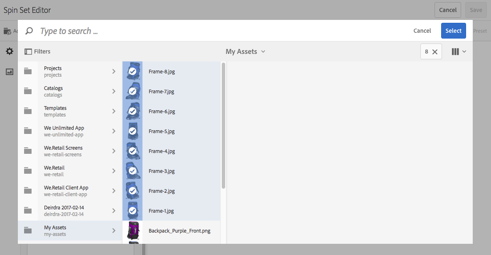

# Sets draaien{#spin-sets}

Een centrifugeerset simuleert de echte handeling waarbij een object wordt omgedraaid om het te onderzoeken. Met centrifuges kunt u items vanuit elke hoek bekijken en de belangrijkste visuele details vanuit elke hoek ophalen.

Een centrifugeerset simuleert een kijkervaring van 360°. Dynamic Media biedt centrifugesets met één as waarin gebruikers een item kunnen roteren. Bovendien kunnen gebruikers met een paar eenvoudige muisklikken in- en uitzoomen op een vrije vorm en een willekeurige weergave pannen. Op deze manier kunnen gebruikers een item vanuit een bepaald gezichtspunt nader onderzoeken.

De Reeksen van de draaien worden aangewezen door een banner met het woord **[!UICONTROL SPINSET]**. Als de Spin-set wordt gepubliceerd, wordt bovendien de publicatiedatum vermeld door de **[!UICONTROL World]** het pictogram bevindt zich op de banner samen met de laatste wijzigingsdatum die wordt aangegeven door de **[!UICONTROL Pencil]** wordt weergegeven.

>[!NOTE]
>
>Voor informatie over de gebruikersinterface van Middelen raadpleegt u [Elementen beheren met de Touch UI](/help/assets/manage-digital-assets.md) en past u deze toe op een nieuwe map waarin de elementen van de afbeeldingsset zijn geüpload.

## Snel starten: Sets draaien {#quick-start-spin-sets}

Ga als volgt te werk om snel aan de slag te gaan met centrifuges:

1. Optioneel. [Een voorinstelling voor een batchset maken](/help/assets/dynamic-media/batch-set-presets-dm.md) en past u deze toe op een nieuwe map met middelen.

   Met een voorinstelling voor een batch-set kunt u het maken van de centrifugeset automatiseren.

   >[!IMPORTANT]
   >
   >De reeksen van de partij worden gecreeerd door IPS (het Systeem van de Productie van het Beeld) als deel van activa opnemen.

1. [Uw afbeeldingen uploaden voor meerdere weergaven](#uploading-assets-for-spin-sets).

   U hebt minstens 8-12 opnamen van een item nodig voor een eendimensionale centrifugeset en 16-24 voor een tweedimensionale centrifugeset. De opnamen moeten regelmatig worden gemaakt om de indruk te wekken dat het item draait en wordt gespiegeld. Als een eendimensionale centrifugeset bijvoorbeeld 12 opnamen bevat, roteert u het item 30° (360/12) voor elke opname.

   Zie [Dynamic Media - Ondersteunde rasterafbeeldingsindelingen](/help/assets/file-format-support.md#image-support-dynamic-media) voor een lijst met indelingen die worden ondersteund door centrifuges.

1. [Spin-sets maken](#creating-spin-sets).

   Selecteer **[!UICONTROL Create]** > **[!UICONTROL Spin Set]** en geeft u de set een naam, kiest u de elementen en kiest u de volgorde waarin de afbeeldingen worden weergegeven.

   Zie [Werken met kiezers](/help/assets/dynamic-media/working-with-selectors.md).

1. Instellen [Voorinstellingen van viewer voor centrifugeren instellen](/help/assets/dynamic-media/managing-viewer-presets.md), indien nodig.

   Beheerders kunnen viewervoorinstellingen voor spinsets maken of wijzigen. Als u uw spinset wilt weergeven met een viewervoorinstelling, selecteert u de spinset en selecteert u **Viewers** in het vervolgkeuzemenu voor het linkerspoor.

   Als u viewervoorinstellingen wilt maken of bewerken, raadpleegt u **[!UICONTROL Tools]** > **[!UICONTROL Assets]** > **[!UICONTROL Viewer Presets]**.

   Zie [Voorinstellingen voor viewers toevoegen en bewerken](/help/assets/dynamic-media/managing-viewer-presets.md).

   U kunt sets die zijn gemaakt met voorinstellingen voor batchsets op drie verschillende manieren weergeven en openen. (Sets die zijn gemaakt met voorinstellingen voor batchsets, doen *niet* worden weergegeven in de gebruikersinterface.)

1. [Voorvertoning van centrifuges](/help/assets/dynamic-media/previewing-assets.md).

   Selecteer de centrifugeset en u kunt er een voorvertoning van weergeven. Roteer de centrifugeset. U kunt verschillende viewers kiezen in het menu **[!UICONTROL Viewers]** beschikbaar via het keuzemenu voor de linkertrack.

1. [Rotatiesets publiceren](/help/assets/dynamic-media/publishing-dynamicmedia-assets.md).

   Als u een centrifugeerset publiceert, worden de URL- en insluitreeks geactiveerd. Bovendien moet u [De viewervoorinstelling publiceren](/help/assets/dynamic-media/managing-viewer-presets.md).

1. [URL&#39;s koppelen aan uw webtoepassing](/help/assets/dynamic-media/linking-urls-to-yourwebapplication.md) of [De video- of afbeeldingsviewer insluiten](/help/assets/dynamic-media/embed-code.md).

   Adobe Experience Manager Assets maakt URL-aanroepen voor centrifuges en activeert deze nadat u de centrifuges hebt gepubliceerd. U kunt deze URL&#39;s kopiëren wanneer u elementen voorvertoont. U kunt ze ook insluiten op uw website.

   Selecteer eerst de spinset en selecteer vervolgens **[!UICONTROL Viewers]** in het vervolgkeuzemenu voor het linkerspoor.

   Zie [Een centrifugeerset koppelen aan een webpagina](/help/assets/dynamic-media/linking-urls-to-yourwebapplication.md) en [De video- of afbeeldingsviewer insluiten](/help/assets/dynamic-media/embed-code.md).

Indien nodig kunt u [Draaiensets bewerken](#editing-spin-sets). Bovendien kunt u bekijken en wijzigen [Eigenschappen van Spin-set](/help/assets/manage-digital-assets.md#editing-properties).

## Elementen uploaden voor centrifuges {#uploading-assets-for-spin-sets}

U hebt minstens 8-12 opnamen van een item nodig voor een eendimensionale centrifugeset. De opnamen moeten regelmatig worden gemaakt om de indruk te wekken dat het item draait en wordt gespiegeld. Als een eendimensionale centrifugeset bijvoorbeeld 12 opnamen bevat, roteert u het item 30° (360/12) voor elke opname.

Zie [Dynamic Media - Ondersteunde rasterafbeeldingsindelingen](/help/assets/file-format-support.md#image-support-dynamic-media) voor een lijst met indelingen die worden ondersteund door centrifuges.

U kunt afbeeldingen voor de centrifuges uploaden zoals u dat zou doen [andere middelen uploaden naar Experience Manager Assets](/help/assets/manage-digital-assets.md).

### Richtlijnen voor het vastleggen van afbeeldingen voor uw centrifugeset {#guidelines-for-shooting-spin-set-images}

Hieronder vindt u een aantal aanbevolen procedures voor het uitvoeren van gecentreerde afbeeldingen. Over het algemeen geldt dat hoe meer afbeeldingen u in een centrifugeset hebt, hoe beter het effect van het draaien van de afbeelding is. Als u echter veel afbeeldingen in de set opneemt, neemt de laadtijd van de afbeeldingen toe. Experience Manager raadt de volgende richtlijnen aan voor het maken van foto&#39;s voor gebruik in centrifuges:

* Gebruik minimaal 8-12 afbeeldingen in een eendimensionale centrifuge en 16-24 afbeeldingen in een tweedimensionale centrifugeset. U hebt minimaal 8 afbeeldingen nodig om 360 graden te kunnen draaien. Eendimensionale centrifuges komen vaker voor omdat het maken van tweedimensionale centrifuges arbeidsintensief is.
* Gebruik een indeling zonder verlies. TIFF en PNG worden aanbevolen.
* Masker alle afbeeldingen zodat het item op een zuiver witte of andere achtergrond met veel contrast wordt weergegeven. Voeg desgewenst schaduwen toe.
* Zorg ervoor dat de productdetails goed verlicht en in nadruk zijn.
* Neem spin beelden voor modekleding met een mannequin of een model. Vaak wordt de mannequin gemaskeerd (met behulp van een glazen mannequin) of wordt in de afbeelding een gestileerde mannequin/dressform weergegeven. U kunt een op-model spin-reeks tot stand brengen door het aantal hoeken te bepalen. Markeer elke hoek met band op de vloer zodat u het model kunt begeleiden en in de richting van elke opname kunt kijken.

## Spin-sets maken {#creating-spin-sets}

In deze sectie wordt beschreven hoe u centrifuges kunt maken.

>[!NOTE]
>
>U kunt ook automatisch spinsets maken via [voorinstellingen voor batchsets](/help/assets/dynamic-media/config-dm.md). **Belangrijk:** Batchsets worden gecreëerd door IPS (Image Production System) als onderdeel van assetopname.
>
>Zie &quot;Voorinstellingen voor batchsets maken om automatisch afbeeldingssets en centrifuges te genereren&quot; in [Dynamic Media configureren](/help/assets/dynamic-media/config-dm.md).

>[!NOTE]
>
>De volgorde waarin afbeeldingen worden weergegeven in een draaiset. Zorg ervoor dat u ze zo bestelt dat de centrifuge een vloeiende weergave van 360° heeft.

**Om centrifuges te maken:**

1. Navigeer in Elementen naar de plaats waar u een centrifugeset wilt maken en selecteer **[!UICONTROL Create]** en selecteer vervolgens **[!UICONTROL Spin Set]**. U kunt de set ook maken vanuit een map die uw assets bevat.

   

1. In de Editor voor de centrifugeset, in het dialoogvenster **[!UICONTROL Title]** voert u een naam in voor de centrifugeset. De naam wordt weergegeven in de banner over de centrifugeset. Voer eventueel een beschrijving in.

   

   >[!NOTE]
   >
   >Wanneer u de centrifugeset maakt, kunt u de miniatuur van de centrifugeset wijzigen of Experience Manager toestaan de miniatuur automatisch te selecteren op basis van de elementen in de centrifugeset. Als u een miniatuur wilt selecteren, selecteert u **[!UICONTROL Change thumbnail]** en selecteert u een willekeurige afbeelding (u kunt ook naar andere mappen navigeren om afbeeldingen te zoeken). Als u een miniatuur hebt geselecteerd en vervolgens besluit dat Experience Manager een miniatuur moet genereren op basis van de centrifugeset, selecteert u **[!UICONTROL Switch to Automatic thumbnail]**.

1. Voer een van de volgende handelingen uit:

   * Selecteer in de linkerbovenhoek van de pagina van de Editor voor centrifugeset de optie **[!UICONTROL Add Asset]**.

   * Selecteer in het midden van de pagina van de Editor voor de centrifugeset de optie **[!UICONTROL Tap to open Asset Selector]**.
   Selecteer elementen die u in de centrifugeset wilt opnemen. Geselecteerde assets hebben een vinkje. Als u klaar bent, selecteert u in de rechterbovenhoek van de pagina de optie **[!UICONTROL Select]**.

   Met de assetkiezer kunt u naar assets zoeken door een trefwoord te typen en op **[!UICONTROL Return]** te tikken. U kunt ook filters toepassen om de zoekresultaten te verfijnen. U kunt filteren op pad, verzameling, bestandstype en tag. Selecteer het filter en selecteer vervolgens het **[!UICONTROL Filter]** op de werkbalk. Wijzig de weergave door te tikken op het pictogram Weergave en **[!UICONTROL Column View]**, **[!UICONTROL Card View]** of **[!UICONTROL List View]** te selecteren.

   Zie [Werken met kiezers](/help/assets/dynamic-media/working-with-selectors.md).

   

1. Wanneer u elementen aan de set toevoegt, worden deze automatisch in alfanumerieke volgorde toegevoegd. Nadat u elementen hebt toegevoegd, kunt u deze handmatig opnieuw rangschikken of sorteren.

   Sleep indien nodig het pictogram Opnieuw ordenen van een element naar de rechterkant van de bestandsnaam van het element om de volgorde van de afbeeldingen in de lijst met sets te wijzigen.

   

   De volgorde van frame 11 in de centrifugeerset wijzigen door deze naar een nieuwe locatie te slepen.

1. (Optioneel) Voer een van de volgende handelingen uit:

   * Als u een afbeelding wilt verwijderen, selecteert u de afbeelding en selecteert u **[!UICONTROL Delete Asset]**.

   * Als u een voorinstelling wilt toepassen, selecteert u in de rechterbovenhoek van de pagina de optie **[!UICONTROL Preset]** Selecteer vervolgens een voorinstelling die u op alle elementen tegelijk wilt toepassen.

1. Selecteer **[!UICONTROL Save]**. De nieuwe centrifugeset wordt weergegeven in de map waarin u deze hebt gemaakt.

## Spin-sets weergeven {#viewing-spin-sets}

U kunt spin-sets maken in de gebruikersinterface of automatisch met [voorinstellingen voor batchsets](/help/assets/dynamic-media/config-dm.md). sets die zijn gemaakt met voorinstellingen voor batchsets, doen *niet* worden weergegeven in de gebruikersinterface. U hebt op drie verschillende manieren toegang tot sets die zijn gemaakt met voorinstellingen voor batchsets. (Deze methoden zijn ook beschikbaar als u de centrifuges in de gebruikersinterface hebt gemaakt.)

>[!NOTE]
>
>U kunt sets ook weergeven via de gebruikersinterface zoals beschreven in [Dradensets bewerken](#editing-spin-sets).

**Om de reeksen van Draaien te bekijken:**

1. Bij het openen van de eigenschappen van een afzonderlijk element. Eigenschappen geven aan wat de instelling is van het geselecteerde element (onder) **[!UICONTROL Member of Sets]**). Selecteer de naam van de set als u de volledige set wilt zien.

   

1. Van een lidafbeelding van om het even welke set. Selecteer **[!UICONTROL Sets]** om de sets weer te geven waarvan het element lid is.

   

1. Vanuit de zoekopdracht kunt u **[!UICONTROL Filters]** selecteren, **[!UICONTROL Dynamic Media]** uitvouwen en **[!UICONTROL Sets]** selecteren.

   De zoekopdracht retourneert overeenkomende sets die handmatig in de gebruikersinterface zijn gemaakt of die automatisch zijn gemaakt met voorinstellingen voor batchsets. Voor automatische sets wordt de zoekquery uitgevoerd met `Starts with` zoekcriteria die verschillen van het zoeken naar Experience Managers op basis van het gebruik van `Contains` zoekcriteria. Het filter instellen op **[!UICONTROL Sets]** is de enige manier om geautomatiseerde reeksen te zoeken.

   

## Dradensets bewerken {#editing-spin-sets}

U kunt verschillende bewerkingstaken uitvoeren op centrifuges, zoals:

* Voeg afbeeldingen toe aan de centrifugeset.
* Wijzig de volgorde van de afbeeldingen in de centrifugeset.
* Elementen in de centrifugeset verwijderen.
* Voorinstellingen voor viewers toepassen.
* Verwijder de centrifugeset.

**Om centrifuges te bewerken:**

1. Voer een van de volgende handelingen uit:

   * Houd de muisaanwijzer boven een actief in een centrifugeerset en selecteer vervolgens **[!UICONTROL Edit]** (potloodpictogram).
   * Houd de cursor boven een set-elementen met rotatie en selecteer **[!UICONTROL Select]** (vinkje pictogram), selecteer dan **[!UICONTROL Edit]** op de werkbalk.

   * Selecteer een middelset van een centrifugeerset en selecteer vervolgens **[!UICONTROL Edit]** (potloodpictogram) op de werkbalk.

1. Voer een van de volgende handelingen uit om de centrifugeset te bewerken:

   * Als u de volgorde van afbeeldingen wilt wijzigen, sleept u een afbeelding naar een nieuwe locatie (selecteer het pictogram voor herschikken om items te verplaatsen).
   * Als u items in oplopende of aflopende volgorde wilt sorteren, selecteert u de kolomkop.
   * Als u een element wilt toevoegen of een bestaand element wilt bijwerken, selecteert u **[!UICONTROL Add Asset]**. Navigeer naar een element, selecteer het en selecteer het **[!UICONTROL Select]** in de rechterbovenhoek.
Als u de afbeelding verwijdert die de Experience Manager voor de miniatuur gebruikt door deze te vervangen door een andere afbeelding, wordt het oorspronkelijke element nog steeds weergegeven.
   * Als u een element wilt verwijderen, selecteert u het en selecteert u het **[!UICONTROL Delete Asset]**.
   * Als u een voorinstelling wilt toepassen, selecteert u het pictogram Voorinstelling en selecteert u een voorinstelling.
   * Als u een volledige centrifugeset wilt verwijderen, navigeert u naar de centrifugeset, selecteert u deze en selecteert u **[!UICONTROL Delete]**

   >[!NOTE]
   >
   >U kunt de afbeeldingen in een centrifugeset bewerken door naar de set te navigeren en **[!UICONTROL Set Members]** in het linkerspoor, en selecteer dan het pictogram van het Potlood op een individueel middel om het het uitgeven venster te openen.

1. Selecteren **[!UICONTROL Save]** wanneer klaar met bewerken.

## Voorvertoning van centrifuges {#previewing-spin-sets}

Zie [Elementen voorvertonen](/help/assets/dynamic-media/previewing-assets.md).

## Rotatiesets publiceren {#publishing-spin-sets}

Zie [Elementen publiceren](/help/assets/dynamic-media/publishing-dynamicmedia-assets.md).
