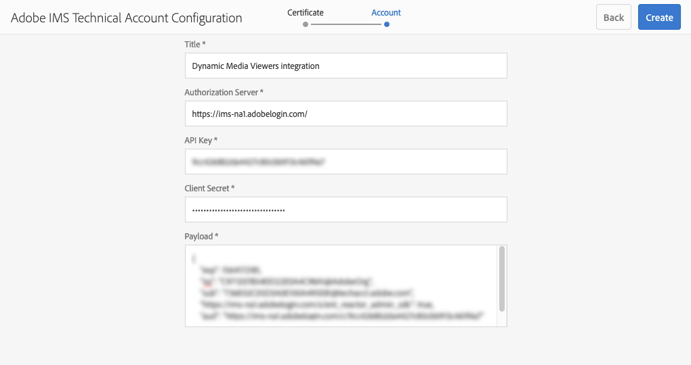

# Dynamic Media Viewers integreren met Adobe Analytics- en Experience Platform-tags {#integrating-dynamic-media-viewers-with-adobe-analytics-and-adobe-launch}

## Wat is de integratie van Dynamic Media Viewers met Adobe Analytics- en Experience Platform-tags? {#what-is-dynamic-media-viewers-integration-with-adobe-analytics-and-adobe-launch}

<!-- Leave this hidden path here; it points to the topic source from Sasha https://wiki.corp.adobe.com/pages/viewpage.action?spaceKey=~oufimtse&title=Dynamic+Media+Viewers+integration+with+Adobe+Launch 

name used to be Experience Platform Launch. Changed to Experience Platform Data Collection-->

De *Dynamische 1&rbrace; uitbreiding van de Kijkers van Media voor de Markeringen van Experience Platform werkt met Dynamische Kijkers van Media 5.13. Zo kunnen klanten van Adobe Analytics- en Experience Platform-tags de gebeurtenissen en gegevens van Dynamic Media Viewers gebruiken in hun tagconfiguraties.*

Dankzij deze integratie kunt u het gebruik van Dynamic Media Viewers op uw website bijhouden met Adobe Analytics. Tegelijkertijd kunt u de gebeurtenissen en gegevens gebruiken die door de viewers worden weergegeven, met een andere extensie Experience Platform Tags die afkomstig is van Adobe of een derde.

Meer over de uitbreidingen van Adobe of derdeuitbreidingen leren, zie {de uitbreidingen van Adobe van 0} [&#128279;](https://experienceleague.adobe.com/nl/docs/experience-platform/tags/extensions/overview) in de Gids van de Gebruiker van de Markeringen van Experience Platform.

**Dit onderwerp is voorgenomen voor het volgende:** de beheerders van de Plaats, Ontwikkelaars op het programma van Adobe Experience Manager, en mensen in Verrichtingen.

### Beperkingen van de integratie {#limitations-of-the-integration}

* De integratie van Experience Platform-tags voor Dynamic Media-viewers werkt niet in het auteurknooppunt van Experience Manager. U kunt geen het volgen van een pagina zien WCM tot het wordt gepubliceerd.
* De integratie van Experience Platform-tags voor dynamische mediasviewers wordt niet ondersteund in de pop-upbewerkingsmodus, waarin de URL van de viewer wordt verkregen via de knop &quot;URL&quot; op de pagina Asset Details.
* Integratie van Experience Platform-tags kan niet gelijktijdig worden gebruikt met de integratie van verouderde viewers Analytics (via de parameter `config2=` ).
* De steun voor video het volgen is beperkt tot kern playback die slechts, zoals die in [ wordt beschreven het Volgen Overzicht ](https://experienceleague.adobe.com/nl/docs/media-analytics/using/tracking/track-core-overview#player-events) volgt. Met name QoS, Advertenties, Hoofdstuk/Segmenten, of het volgen van Fouten worden niet gesteund.
* De configuratie van de Duur van de opslag voor de Elementen van Gegevens wordt niet gesteund voor Elementen van Gegevens gebruikend de *uitbreiding van de Kijkers van de Media 0&rbrace; Dynamische.* Opslagduur moet zijn ingesteld op **[!UICONTROL None]** .

### Gebruik de integratiegevallen {#use-cases-for-the-integration}

Het belangrijkste gebruiksgeval voor de integratie met Experience Platform-tags zijn klanten die zowel Experience Manager Assets als Experience Manager Sites gebruiken. In dergelijke scenario&#39;s, kunt u opstelling een standaardintegratie tussen uw de auteurknoop van Experience Manager en de Markeringen van Experience Platform, dan uw instantie van Plaatsen met het bezit van de Markeringen van Experience Platform associëren. Daarna, zal om het even welke Dynamische component van Media WCM die aan een pagina van Plaatsen wordt toegevoegd gegevens en gebeurtenissen van kijkers volgen.

Zie [ de Dynamische kijkers van Media van het Spoor in Experience Manager Sites ](#tracking-dynamic-media-viewers-in-aem-sites).

Een tweede gebruiksgeval dat de integratie steunt zijn die klanten die slechts Experience Manager Assets, of Dynamic Media Classic gebruiken. In dergelijke gevallen ontvangt u de insluitcode voor uw viewer en voegt u deze toe aan de websitepagina. Vervolgens haalt u de productie-URL van de Experience Platform-tagbibliotheek op uit Experience Platform-tags en voegt u deze handmatig toe aan de webpaginacode.

Zie [ de Dynamische kijkers van Media van het Spoor gebruikend ingebedde code ](#tracking-dynamic-media-viewers-using-embed-code).

## Hoe gegevens en gebeurtenis volgen werkt in de integratie {#how-data-and-event-tracking-works-in-the-integration}

De integratie haalt voordeel uit twee afzonderlijke en onafhankelijke types van Dynamische Kijkers die van Media: *Adobe Analytics* en *Adobe Analytics voor Audio en Video* volgen.

### Over reeksspatiëring in Adobe Analytics {#about-tracking-using-adobe-analytics}

Met Adobe Analytics kunt u handelingen bijhouden die een gebruiker uitvoert wanneer deze communiceren met Dynamic Media Viewers op uw website. Met Adobe Analytics kunt u ook viewerspecifieke gegevens bijhouden. U kunt bijvoorbeeld de laadgebeurtenissen van de weergave bijhouden en opnemen, samen met de naam van het element, eventuele zoomacties die hebben plaatsgevonden en handelingen voor het afspelen van video.

In de Markeringen van Experience Platform, werken de concepten *Elementen van Gegevens* en *Regels* samen om het volgen van Adobe Analytics toe te laten.

#### Over gegevenselementen in Experience Platform-tags {#about-data-elements-in-adobe-launch}

Een gegevenselement in Experience Platform-tags is een benoemde eigenschap waarvan de waarde statisch wordt gedefinieerd of dynamisch wordt berekend op basis van de status van een webpagina of gegevens van Dynamic Media Viewers.

Welke opties beschikbaar zijn voor een definitie van een gegevenselement, is afhankelijk van de lijst met extensies die zijn geïnstalleerd in de eigenschap Experience Platform-tags. De &quot;Core&quot;uitbreiding is vooraf geïnstalleerd en beschikbaar uit de doos in om het even welke configuratie. Met deze extensie &quot;Core&quot; kunt u een gegevenselement definiëren dat afkomstig is van cookie, JavaScript-code, queryreeks en vele andere bronnen.

Voor Adobe Analytics die verscheidene andere uitbreidingen volgen moet, zoals die in [ wordt beschreven Installatie en opstelling van uitbreidingen ](#installing-and-setup-of-extensions) worden geïnstalleerd. Met de extensie Dynamic Media Viewers kunt u een gegevenselement definiëren dat een argument is van de gebeurtenis Dynamic Viewer. Het is bijvoorbeeld mogelijk te verwijzen naar het viewertype, of de naam van het element die tijdens het laden door de viewer wordt gemeld, het zoomniveau dat wordt gemeld wanneer de eindgebruiker zoomt en nog veel meer.

Met de extensie Dynamic Media Viewer worden de waarden van de Data Elements automatisch bijgewerkt.

Nadat u het hebt bepaald, kan een Element van Gegevens in andere plaatsen van de UI van de Markeringen van Experience Platform worden gebruikt, gebruikend de plukker van het Element van Gegevens widget. De **Vastgestelde Actie van Variabelen** van de uitbreiding van Adobe Analytics in de Elementen van regelverwijzingen die voor Dynamische Kijkers van Media worden bepaald (zie hieronder).

Zie [ elementen van Gegevens ](https://experienceleague.adobe.com/nl/docs/experience-platform/tags/ui/data-elements) in de Gids van de Gebruiker van de Markeringen van Experience Platform.

#### Over Regels in Experience Platform-tags {#about-rules-in-adobe-launch}

Een regel in de Markeringen van Experience Platform is een agnostische configuratie die drie gebieden bepaalt die omhoog een regel maken: *Gebeurtenissen*, *Voorwaarden*, en *Acties*:

* *Gebeurtenissen* (als) vertellen de Markeringen van Experience Platform wanneer om een Regel teweeg te brengen.
* *Voorwaarden* (als) vertelt de Markeringen van Experience Platform welke andere beperkingen toe te staan of te ontkennen wanneer het teweegbrengen van een Regel.
* *de Acties* (toen) vertellen de Markeringen van Experience Platform wat te doen wanneer een Regel wordt teweeggebracht.

Welke opties beschikbaar zijn in de sectie Gebeurtenissen, Voorwaarden en Handelingen, is afhankelijk van de extensies die zijn geïnstalleerd in de Experience Platform-eigenschap Codes. De *uitbreiding van de Kern* is vooraf geïnstalleerd en beschikbaar uit-van-de-doos in om het even welke configuratie. De extensie biedt verschillende opties voor gebeurtenissen, zoals standaardacties op browserniveau, zoals focuswijziging, toetsdrukken en het verzenden van formulieren. Het bevat ook opties voor Voorwaarden, zoals cookiewaarde, browsertype en meer. Voor Acties is alleen de optie Aangepaste code beschikbaar.

Voor het volgen van Adobe Analytics, moeten verscheidene andere uitbreidingen worden geïnstalleerd, zoals die in [ Installatie en opstelling van uitbreidingen ](#installing-and-setup-of-extensions) worden beschreven. Specifiek:

* De extensie Dynamic Media Viewers breidt de lijst met ondersteunde gebeurtenissen uit tot gebeurtenissen die specifiek zijn voor dynamische mediasviewers, zoals het laden van de viewer, het wisselen van elementen, inzoomen en het afspelen van video.
* De uitbreiding van Adobe Analytics breidt de lijst van gesteunde Acties met twee acties uit die voor het verzenden van gegevens naar het volgen servers worden vereist: *Reeks Variabelen* en *verzendt Baken*.

Als u dynamische mediasviewers wilt bijhouden, kunt u een van de volgende typen gebruiken:

* Gebeurtenissen van de extensie Dynamic Media Viewers, Core-extensie of een andere extensie.
* Voorwaarden in de definitie van de regel. Of u kunt het gebied met voorwaarden leeg laten.

In de sectie van Acties, wordt het vereist dat u a *Vastgestelde Variabelen* actie hebt. Deze actie vertelt Adobe Analytics hoe te om het volgen variabelen met gegevens te bevolken. Tezelfdertijd, verzendt de *Vastgestelde Variabelen* actie niets naar de volgende server.

**verzendt baken** actie moet de **Vastgestelde Variabelen** actie volgen. De *verzendt baken* actie verzendt eigenlijk gegevens naar de analytische volgende server. Beide acties, *Reeks Variabelen* en *verzenden Bandbeeld*, komen uit de uitbreiding van Adobe Analytics.

Zie de [ Regels ](https://experienceleague.adobe.com/nl/docs/experience-platform/tags/ui/rules) in de Gids van de Gebruiker van de Markeringen van Experience Platform.

#### Voorbeeldconfiguratie {#sample-configuration}

In de volgende voorbeeldconfiguratie in Experience Platform-tags ziet u hoe u een elementnaam kunt bijhouden tijdens het laden van de viewer.

1. Definieer op het tabblad **[!UICONTROL Data Elements]** een gegevenselement `AssetName` dat verwijst naar de parameter `asset` van de gebeurtenis `LOAD` vanuit de extensie Dynamische mediaverviewers.

   

1. Van het **[!UICONTROL Rules]** lusje, bepaal een regel *TrackAssetOnLoad*.

   In deze regel gebruikt het veld **[!UICONTROL Event]** de gebeurtenis **[!UICONTROL LOAD]** uit de extensie Dynamische mediaquery&#39;s.

   

1. De configuratie van de Actie heeft twee types van Actie van de uitbreiding van Adobe Analytics:

   *plaats Variabelen*, die een analytische variabele van uw keus aan de waarde van `AssetName` Element van Gegevens in kaart brengen.

   *verzend Baken*, die het volgen informatie naar Adobe Analytics verzendt.

   

1. De resulterende regelconfiguratie ziet er als volgt uit:

   

### Informatie over Adobe Analytics for Audio en Video {#about-adobe-analytics-for-audio-and-video}

Wanneer een rekening van Experience Cloud wordt ingetekend om Adobe Analytics voor Audio en Video te gebruiken, is het genoeg om video het volgen in de *Dynamische de uitbreidingsmontages van de Kijkers van Media* toe te laten. Videomeetgegevens zijn beschikbaar in Adobe Analytics. De videotracering is afhankelijk van de aanwezigheid van Adobe Media Analytics voor de extensie Audio en Video.

Zie [ Installatie en opstelling van uitbreidingen ](#installing-and-setup-of-extensions).

Momenteel, is de steun voor video het volgen beperkt tot &quot;kern playback&quot;het volgen slechts, zoals die in [ het Volgen Overzicht ](https://experienceleague.adobe.com/nl/docs/media-analytics/using/tracking/track-core-overview#player-events) wordt beschreven. Met name QoS, Advertenties, Hoofdstuk/Segmenten, of het volgen van Fouten worden niet gesteund.

## De extensie Dynamische mediumviewers gebruiken {#using-the-dynamic-media-viewers-extension}

Zoals vermeld in [ gevallen van het Gebruik voor de integratie ](#use-cases-for-the-integration), is het mogelijk om Dynamische kijkers van Media met de nieuwe integratie van de Markeringen van Experience Platform in Experience Manager Sites te volgen en door ingebedde code te gebruiken.

### Dynamische mediaviewers bijhouden in Experience Manager Sites {#tracking-dynamic-media-viewers-in-aem-sites}

Om de Dynamische kijkers van Media in Experience Manager Sites te volgen, moeten alle stappen die onder [ worden vermeld alle integratiestukken ](#configuring-all-the-integration-pieces) sectie worden uitgevoerd. Meer bepaald moet u de IMS-configuratie en de Experience Platform Tags Cloud Configuration maken.

Na de juiste configuratie worden gegevens automatisch bijgehouden in Adobe Analytics, Adobe Analytics for Video of beide, voor elke Dynamic Media-viewer die u toevoegt aan een sitepagina met een WCM-component die wordt ondersteund door Dynamic Media.

Zie [ Dynamische Media Assets aan Pagina&#39;s toevoegen gebruikend de Plaatsen van Adobe ](/help/assets/dynamic-media/adding-dynamic-media-assets-to-pages.md).

### Dynamische mediaviewers bijhouden met behulp van insluitcode {#tracking-dynamic-media-viewers-using-embed-code}

Klanten die geen Experience Manager Sites gebruiken of geen Dynamic Media-viewers insluiten in webpagina&#39;s buiten Experience Manager Sites, of beide, kunnen de integratie met Experience Platform-tags nog steeds gebruiken.

Voltooi de configuratiestappen van [ vormen Adobe Analytics ](#configuring-adobe-analytics-for-the-integration) en [ vormen de Markeringen van Experience Platform ](#configuring-adobe-launch-for-the-integration) secties. Experience Manager-gerelateerde configuratiestappen zijn echter niet nodig.

Na de juiste configuratie kunt u ondersteuning voor Experience Platform-tags toevoegen aan een webpagina met een Dynamic Media-viewer.

Zie [ de Markeringen van Experience Platform toevoegen bed Code ](https://experienceleague.adobe.com/nl/docs/platform-learn/implement-in-websites/configure-tags/add-embed-code) in om meer over te leren hoe te om de bibliotheek van de Markeringen van Experience Platform te gebruiken bed code in.

Meer over leren hoe te om de ingebedde codeeigenschap van de Dynamische Media van Experience Manager te gebruiken, zie [ Inbeddend de Video of Kijker van het Beeld op een Web-pagina ](/help/assets/dynamic-media/embed-code.md).

**Spoor Dynamische kijkers van Media die ingebedde code gebruiken:**

1. Een webpagina klaar hebben voor het insluiten van een Dynamic Media-viewer.
1. Verkrijg de ingebedde code voor de bibliotheek van de Markeringen van Experience Platform door zich eerst aan de Markeringen van Experience Platform aan te melden (zie [ de Markeringen van Experience Platform ](#configuring-adobe-launch-for-the-integration) vormen).
1. Selecteer **[!UICONTROL Property]** en klik op de tab **[!UICONTROL Environments]** .
1. Ophalen van het milieuniveau dat relevant is voor de omgeving van de webpagina. Klik vervolgens in de kolom **[!UICONTROL Install]** op het pictogram van het vak.
1. Kopieer in **[!UICONTROL In the Web Install Instructions]** de volledige insluitcode van de Experience Platform-tagbibliotheek, samen met de omringende `<script/>` -tags.

## Referentiegids voor de extensie Dynamic Media Viewers {#reference-guide-for-the-dynamic-media-viewers-extension}

### Over de configuratie van Dynamic Media Viewers {#about-the-dynamic-media-viewers-configuration}

De extensie Dynamic Media Viewer wordt automatisch geïntegreerd met de Experience Platform-tagbibliotheek als aan de volgende voorwaarden wordt voldaan:

* Globaal object ( `_satellite`) van de Experience Platform-tagbibliotheek is aanwezig op de pagina.
* De extensiefunctie Dynamic Media Viewers `_dmviewers_v001()` wordt gedefinieerd voor `_satellite` .

* `config2=` viewerparameter is niet opgegeven. Dit betekent dat de viewer geen gebruik maakt van verouderde analytische integratie.

Bovendien is er een optie om de integratie van Experience Platform-tags expliciet in de viewer uit te schakelen door de parameter `launch=0` op te geven in de configuratie van de viewer. De standaardwaarde van deze parameter is `1` .

### De extensie Dynamische mediaverviewers configureren {#configuring-the-dynamic-media-viewers-extension}

De enige configuratieoptie voor de extensie Dynamic Media Viewers is **[!UICONTROL Enable Adobe Media Analytics for Audio and Video]** .

Wanneer u deze optie inschakelt en de extensie Adobe Media Analytics for Audio and Video wordt geïnstalleerd en geconfigureerd, worden meetgegevens voor het afspelen van video naar de oplossing Adobe Analytics for Audio en Video verzonden. Als u deze optie uitschakelt, wordt het bijhouden van video uitgeschakeld.

Als u deze optie *toelaat zonder* hebbend de Analytics van de Media van Adobe voor Audio en Video geïnstalleerde uitbreiding, heeft de optie geen effect.

### Informatie over gegevenselementen in de extensie Dynamische media-viewers {#about-data-elements-in-the-dynamic-media-viewers-extension}

Het enige data-elementtype dat de uitbreiding Dynamische mediaviewers biedt, is **[!UICONTROL Viewer Event]** in de vervolgkeuzelijst **[!UICONTROL Data Element Type]**.

Als deze optie is geselecteerd, maakt de Data Element-editor een formulier met twee velden:

* **[!UICONTROL DM viewers event data type]** - in een vervolgkeuzelijst worden alle viewergebeurtenissen weergegeven met argumenten die worden ondersteund door de extensie Dynamic Media Viewers, samen met een speciaal **[!UICONTROL COMMON]** -item. Een **[!UICONTROL COMMON]**-item vertegenwoordigt een lijst met gebeurtenisparameters die gemeenschappelijk zijn voor alle typen gebeurtenissen die door de viewers worden verzonden.
* **[!UICONTROL Tracking parameter]** - een argument van de geselecteerde Dynamic Media-viewer-gebeurtenis.

Zie de [ Dynamische de verwijzingsgids van de Kijkers van Media ](https://experienceleague.adobe.com/nl/docs/dynamic-media-developer-resources/library/viewers-aem-assets-dmc/c-html5-s7-aem-asset-viewers) voor de lijst van gesteunde gebeurtenissen door elk kijkerstype; ga naar de specifieke kijkerssectie, dan de Steun voor het volgen van Adobe Analytics subsection selecteren. Op dit moment worden in de naslaggids voor dynamische media-viewers geen gebeurtenisargumenten vastgelegd.

Laten wij nu de levenscyclus van het Dynamische Element van Gegevens van Media van de Kijkers **&#x200B; overwegen. De waarde van een dergelijk gegevenselement wordt gevuld nadat de bijbehorende dynamische mediaviewer-gebeurtenis op de pagina plaatsvindt. Stel dat het gegevenselement verwijst naar de gebeurtenis &#x200B;** [!UICONTROL LOAD] **&#x200B; en het argument &#39;asset&#39; ervan. De waarde van een dergelijk gegevenselement ontvangt geldige gegevens nadat de viewer de gebeurtenis LOAD voor de eerste keer uitvoert. Als het gegevenselement naar de gebeurtenis &#x200B;** [!UICONTROL ZOOM] **&#x200B; en het bijbehorende argument &quot;scale&quot; verwijst, blijft de waarde van een dergelijk gegevenselement leeg totdat de viewer een &#x200B;** [!UICONTROL ZOOM]** -gebeurtenis voor het eerst verzendt.

Op dezelfde manier worden de waarden van data-elementen automatisch bijgewerkt wanneer de viewer een overeenkomstige gebeurtenis op de pagina verzendt. De waarde-update gebeurt zelfs als de specifieke gebeurtenis niet in de regelconfiguratie is opgegeven. Stel dat het gegevenselement **[!UICONTROL ZoomScale]** is gedefinieerd voor de parameter &quot;scale&quot; van de ZOOM-gebeurtenis. De gebeurtenis **[!UICONTROL LOAD]** is echter de enige trigger in de regelconfiguratie. De waarde van **[!UICONTROL ZoomScale]** wordt nog steeds bijgewerkt wanneer een gebruiker inzoomt in de viewer.

Elke viewer voor dynamische media heeft een unieke id op de webpagina. Het gegevenselement houdt de waarde zelf bij en de viewer die de waarde heeft gevuld. Stel dat er bijvoorbeeld verschillende viewers op dezelfde pagina staan en een gegevenselement **[!UICONTROL AssetName]** dat naar de gebeurtenis **[!UICONTROL LOAD]** en het argument &#39;asset&#39; ervan wijst. Het gegevenselement **[!UICONTROL AssetName]** onderhoudt een verzameling elementnamen die zijn gekoppeld aan elke viewer die op de pagina wordt geladen.

De exacte waarde die door het gegevenselement wordt geretourneerd, is afhankelijk van de context. Als een Regel die door een Dynamische gebeurtenis van de Media wordt teweeggebracht om het Element van Gegevens verzoekt, is de waarde teruggekeerd voor de kijker die de Regel in werking stelde. Als een Regel die door een gebeurtenis van een andere uitbreiding van de Markeringen van Experience Platform wordt teweeggebracht om het Element van Gegevens verzoekt, volgt het de overeenkomstige context van de gebeurtenis. Op dat punt, komt de waarde van het Element van Gegevens uit de kijker die het laatst dit Element van Gegevens bijwerkte.

**overweeg de volgende steekproefopstelling:**

* Een Web-pagina die twee Dynamische het gezoemkijkers van Media heeft: *viewer1* en *viewer2*.

* **[!UICONTROL ZoomScale]** Het gegevenselement verwijst naar de gebeurtenis **[!UICONTROL ZOOM]** en het argument &quot;scale&quot; ervan.
* **[!UICONTROL TrackPan]** Lijn met het volgende:

   * Gebruikt de Dynamic Media Viewer **[!UICONTROL PAN]** -gebeurtenis als een trigger.
   * Verzendt de waarde van **[!UICONTROL ZoomScale]** Data Element naar Adobe Analytics.

* **[!UICONTROL TrackKey]** Lijn met het volgende:

   * Gebruikt de toetsdrukgebeurtenis van de extensie Core Experience Platform Tags als een trigger.
   * Verzendt de waarde van **[!UICONTROL ZoomScale]** Data Element naar Adobe Analytics.

Nu, veronderstel de gebruiker de Web-pagina met de twee kijkers laadt. In *viewer1*, zoom binnen aan schaal 50%; dan, in *viewer2*, zoom binnen aan schaal 25%. In *viewer1*, pannen zij het beeld rond, en drukken tenslotte een sleutel op het toetsenbord.

De activiteit van de gebruiker resulteert in de volgende twee het volgen vraag die aan Adobe Analytics wordt gemaakt:

* De eerste vraag komt voor omdat de **[!UICONTROL TrackPan]** Regel wordt teweeggebracht wanneer de gebruiker in *viewer1* pant. Die vraag verzendt **50%** als waarde van het **[!UICONTROL ZoomScale]** Element van Gegevens omdat het erkent dat *viewer1* de Regel teweegbracht en de overeenkomstige schaalwaarde terugwint;
* De tweede aanroep doet zich voor omdat de **[!UICONTROL TrackKey]** -regel wordt geactiveerd wanneer de gebruiker op een toets op het toetsenbord drukt. Die aanroep verzendt 25% als de waarde van het gegevenselement **[!UICONTROL ZoomScale]** omdat de viewer de regel niet heeft geactiveerd. Als dusdanig, keert het Element van Gegevens de meest bijgewerkte waarde terug.

Het voorbeeld hierboven heeft ook invloed op de levensduur van de waarde voor het gegevenselement. De waarde van het gegevenselement dat door de Dynamic Media Viewer wordt beheerd, wordt opgeslagen in de bibliotheekcode van Experience Platform-tags, zelfs nadat de viewer zelf op de webpagina is verwijderd. Deze functionaliteit houdt in dat als een regel die door een niet-dynamische uitbreiding van de Media Viewer wordt geactiveerd, naar het gegevenselement verwijst, de laatst bekende waarde wordt geretourneerd. Zelfs als de viewer niet meer aanwezig is op de webpagina.

In elk geval worden waarden van gegevenselementen die door Dynamic Media Viewers worden aangestuurd, niet opgeslagen op de lokale opslag of op de server. In plaats daarvan worden ze alleen bewaard in de Experience Platform-tagbibliotheek aan de clientzijde. Waarden van een dergelijk gegevenselement verdwijnen als de webpagina opnieuw wordt geladen.

Over het algemeen, steunt de redacteur van het Element van Gegevens {de selectie van de 0} opslagduur [&#128279;](https://experienceleague.adobe.com/nl/docs/experience-platform/tags/ui/data-elements#create-a-data-element).  Gegevenselementen die de extensie Dynamische mediumviewers gebruiken, ondersteunen echter alleen de optie voor de opslagduur van **[!UICONTROL None]** . Het instellen van een andere waarde is mogelijk in de gebruikersinterface, maar het gedrag Gegevenselement is in dit geval niet gedefinieerd. De extensie beheert de waarde van het gegevenselement op zichzelf: het gegevenselement dat de waarde van het gebeurtenisargument van de viewer behoudt tijdens de volledige levenscyclus van de viewer.

### Over Regels in de extensie Dynamische mediasviewers {#about-rules-in-the-dynamic-media-viewers-extension}

In de redacteur van de Regel, voegt de uitbreiding nieuwe configuratieopties voor de redacteur van Gebeurtenissen toe. Bovendien biedt de editor een optie waarmee u handmatig in de Action Editor naar gebeurtenisparameters kunt verwijzen als een kortzichtige optie in plaats van vooraf geconfigureerde gegevenselementen te gebruiken.

#### Informatie over de Events-editor {#about-the-events-editor}

In de Event-editor voegt de extensie Dynamic Media Viewers een **[!UICONTROL Event Type]** genaamd **[!UICONTROL Viewer Event]** toe.

Als deze optie is geselecteerd, wordt in de gebeurteniseditor het vervolgkeuzemenu **[!UICONTROL Dynamic Media Viewer events]** weergegeven met alle gebeurtenissen die worden ondersteund door Dynamic Media-viewers.

#### De Editor voor handelingen {#about-the-actions-editor}

Met de extensie Dynamische media-viewers kunt u gebeurtenisparameters van Dynamic Media-viewers gebruiken voor het toewijzen van variabelen aan analytische variabelen in de editor Variabelen instellen van de Adobe Analytics-extensie.

De eenvoudigste methode om dat te doen is het volgende twee-stap proces te voltooien:

* Definieer eerst een of meer gegevenselementen, waarbij elk gegevenselement een parameter van een dynamische Media Viewer-gebeurtenis vertegenwoordigt.
* Tot slot in de Vastgestelde redacteur van Variabelen van de uitbreiding van Adobe Analytics klik  **Gegevens** plukker om de Uitgezochte de dialoogdoos van het Element van Gegevens te openen, dan een Element van Gegevens van het te klikken.

Het is echter mogelijk om een alternatieve manier te gebruiken en het maken van data-elementen te omzeilen. U kunt rechtstreeks naar een argument verwijzen vanuit een Dynamic Media Viewer-gebeurtenis. Voer de volledig gekwalificeerde naam van het gebeurtenisargument in het invoerveld **[!UICONTROL value]** van de variabele Analytics-toewijzing in. Zorg ervoor dat procentuele (%) tekens zijn omringd. Bijvoorbeeld:

`%event.detail.dm.LOAD.asset%`

Er is een belangrijk verschil tussen het gebruik van Data Elements en de verwijzing naar directe-gebeurtenisargumenten. Voor het Element van Gegevens, maakt het niet uit welke gebeurtenis de Vastgestelde actie van Variabelen teweegbrengt. De gebeurtenis die de regel activeert, kan geen verband houden met Dynamic Viewer (zoals het selecteren van de webpagina in de Core-extensie). Maar wanneer het gebruiken van een directe argumentverwijzing is het belangrijk om ervoor te zorgen dat de gebeurtenis die de regel teweegbrengt aan het gebeurtenisargument beantwoordt dat het verwijst.

Als de gebeurtenis **[!UICONTROL LOAD]** van de extensie Dynamic Media Viewer bijvoorbeeld de regel activeert en naar `%event.detail.dm.LOAD.asset%` verwijst, wordt de juiste elementnaam geretourneerd.

Er wordt echter een lege waarde voor elke andere gebeurtenis geretourneerd.

In de volgende tabel worden de gebeurtenissen van de Dynamic Media Viewer en de ondersteunde argumenten weergegeven:

<table>
 <tbody>
  <tr>
   <td>Naam van viewergebeurtenis</td>
   <td>Argument reference</td>
  </tr>
  <tr>
   <td><code>COMMON</code></td>
   <td><code>%event.detail.dm.objID%</code></td>
  </tr>
  <tr>
   <td> </td>
   <td><code>%event.detail.dm.compClass%</code></td>
  </tr>
  <tr>
   <td> </td>
   <td><code>%event.detail.dm.instName%</code></td>
  </tr>
  <tr>
   <td> </td>
   <td><code>%event.detail.dm.timeStamp%</code></td>
  </tr>
  <tr>
   <td><code>BANNER</code>  </td>
   <td><code>%event.detail.dm.BANNER.asset%</code></td>
  </tr>
  <tr>
   <td> </td>
   <td><code>%event.detail.dm.BANNER.frame%</code></td>
  </tr>
  <tr>
   <td> </td>
   <td><code>%event.detail.dm.BANNER.label%</code></td>
  </tr>
  <tr>
   <td><code>HREF</code></td>
   <td><code>%event.detail.dm.HREF.rollover%</code></td>
  </tr>
  <tr>
   <td><code>ITEM</code></td>
   <td><code>%event.detail.dm.ITEM.rollover%</code></td>
  </tr>
  <tr>
   <td><code>LOAD</code></td>
   <td><code>%event.detail.dm.LOAD.applicationname%</code></td>
  </tr>
  <tr>
   <td><strong> </strong></td>
   <td><code>%event.detail.dm.LOAD.asset%</code></td>
  </tr>
  <tr>
   <td><strong> </strong></td>
   <td><code>%event.detail.dm.LOAD.company%</code></td>
  </tr>
  <tr>
   <td><strong> </strong></td>
   <td><code>%event.detail.dm.LOAD.sdkversion%</code></td>
  </tr>
  <tr>
   <td><strong> </strong></td>
   <td><code>%event.detail.dm.LOAD.viewertype%</code></td>
  </tr>
  <tr>
   <td><strong> </strong></td>
   <td><code>%event.detail.dm.LOAD.viewerversion%</code></td>
  </tr>
  <tr>
   <td><code>METADATA</code></td>
   <td><code>%event.detail.dm.METADATA.length%</code></td>
  </tr>
  <tr>
   <td> </td>
   <td><code>%event.detail.dm.METADATA.type%</code></td>
  </tr>
  <tr>
   <td><code>MILESTONE</code></td>
   <td><code>%event.detail.dm.MILESTONE.milestone%</code></td>
  </tr>
  <tr>
   <td><code>PAGE</code></td>
   <td><code>%event.detail.dm.PAGE.frame%</code></td>
  </tr>
  <tr>
   <td> </td>
   <td><code>%event.detail.dm.PAGE.label%</code></td>
  </tr>
  <tr>
   <td><code>PAUSE</code></td>
   <td><code>%event.detail.dm.PAUSE.timestamp%</code></td>
  </tr>
  <tr>
   <td><code>PLAY</code></td>
   <td><code>%event.detail.dm.PLAY.timestamp%</code></td>
  </tr>
  <tr>
   <td><code>SPIN</code></td>
   <td><code>%event.detail.dm.SPIN.framenumber%</code></td>
  </tr>
  <tr>
   <td><code>STOP</code></td>
   <td><code>%event.detail.dm.STOP.timestamp%</code></td>
  </tr>
  <tr>
   <td><code>SWAP</code></td>
   <td><code>%event.detail.dm.SWAP.asset%</code></td>
  </tr>
  <tr>
   <td><code>SWATCH</code></td>
   <td><code>%event.detail.dm.SWATCH.frame%</code></td>
  </tr>
  <tr>
   <td> </td>
   <td><code>%event.detail.dm.SWATCH.label%</code></td>
  </tr>
  <tr>
   <td><code>TARG</code></td>
   <td><code>%event.detail.dm.TARG.frame%</code></td>
  </tr>
  <tr>
   <td> </td>
   <td><code>%event.detail.dm.TARG.label%</code></td>
  </tr>
  <tr>
   <td><code>ZOOM</code></td>
   <td><code>%event.detail.dm.ZOOM.scale%</code></td>
  </tr>
 </tbody>
</table>

## Alle integratieonderdelen configureren {#configuring-all-the-integration-pieces}

**VOORDAT U** BEGINT

Adobe raadt u aan alle documentatie vóór deze sectie grondig te controleren, zodat u de volledige integratie begrijpt.

In deze sectie worden de configuratiestappen beschreven die nodig zijn om Dynamic Media-viewers te integreren met Adobe Analytics en Adobe Analytics for Audio en Video. Hoewel het gebruik van de extensie Dynamic Media Viewers voor andere doeleinden in Experience Platform-tags mogelijk is, worden dergelijke scenario&#39;s niet behandeld in deze documentatie.

U gaat de volgende Adobe-producten gebruiken om uw integratie te configureren:

* Adobe Analytics - gebruikt om het volgen variabelen en rapporten te vormen.
* Experience Platform-tags - gebruikt om een eigenschap, een of meer regels en een of meer gegevenselementen te definiëren om het bijhouden van viewers in te schakelen.

Als deze integratieoplossing wordt gebruikt met Experience Manager Sites, moet ook de volgende configuratie worden uitgevoerd:

* [ Adobe Developer Console ](https://developer.adobe.com/console/home) - de integratie wordt gecreeerd voor de Markeringen van Experience Platform.
* Experience Manager-auteurknooppunt - IMS-configuratie en Experience Platform Tags Cloud Configuration.

Als onderdeel van de configuratie, zeker bent u toegang tot een bedrijf in Adobe Experience Cloud hebt dat Adobe Analytics en de Markeringen van Experience Platform reeds heeft toegelaten.

## Adobe Analytics configureren voor integratie {#configuring-adobe-analytics-for-the-integration}

Nadat u Adobe Analytics hebt geconfigureerd, wordt de integratie ingesteld voor:

* Er is een rapportsuite aanwezig en deze is geselecteerd.
* De Variabelen van de Analyse zijn beschikbaar om het volgen gegevens te ontvangen.
* Er zijn rapporten beschikbaar om gegevens te bekijken die zijn verzameld in Adobe Analytics.

Zie ook {de Gids van de Implementatie van 0} Analytics [&#128279;](https://experienceleague.adobe.com/nl/docs/analytics/implementation/home).

**om Adobe Analytics voor de integratie te vormen:**

1. Begin door tot Adobe Analytics van de Experience Cloud [ homepage ](https://experience.adobe.com/#/home) toegang te hebben. Voor de menubar, klik  **Oplossingen** dichtbij de hoger-juiste hoek van de pagina, dan het selecteren **[!UICONTROL Analytics]**.

   

   Selecteer nu een rapportsuite.

### Selecteer een rapportsuite {#selecting-a-report-suite}

1. Selecteer in de rechterbovenhoek van de Adobe Analytics-pagina rechts van het veld **[!UICONTROL Search Reports]** de juiste rapportsuite in de vervolgkeuzelijst. Als de veelvoudige rapportreeksen beschikbaar zijn en u onzeker bent welke te gebruiken, vraag om hulp. Uw Adobe Analytics-beheerder kan u helpen bij het selecteren van de juiste rapportsuite.

   In het voorbeeld hieronder, creeerde een gebruiker een rapportreeks genoemd *DynamicMediaViewersExtensionDoc* en selecteerde het van de drop-down lijst. De naam van de rapportsuite is slechts een voorbeeld. De naam van de rapportsuite die u uiteindelijk selecteert, is aan u.

   Als er geen rapportsuite beschikbaar is, moet u of uw Adobe Analytics-beheerder er een maken voordat u verder kunt gaan met de configuratie.

   Zie [ Rapporten en de Reeksen van het Rapport ](https://experienceleague.adobe.com/nl/docs/analytics/admin/admin-tools/manage-report-suites/report-suites-admin) en [ leiden tot een rapportreeks ](https://experienceleague.adobe.com/nl/docs/analytics/admin/admin-tools/manage-report-suites/c-new-report-suite/t-create-a-report-suite).

   In Adobe Analytics worden rapportsuites beheerd onder **[!UICONTROL Admin]** > **[!UICONTROL Report Suites]** .

   

   Stel nu Adobe Analytics-variabelen in.

### Adobe Analytics-variabelen instellen {#setting-up-adobe-analytics-variables}

1. Wijs een of meer Adobe Analytics-variabelen aan die u wilt gebruiken om het gedrag van Dynamic Media Viewers op de webpagina bij te houden.

   U kunt elk variabeletype gebruiken dat door Adobe Analytics wordt ondersteund. Uw de implementatiebehoeften van de Analyse bepalen het aangewezen veranderlijke type, zoals het Verkeer van de Douane (`props`) of Omzetting (`eVar`).

   Zie [ Overzicht van steunen en eVars ](https://experienceleague.adobe.com/nl/docs/analytics/implementation/vars/page-vars/evar#vars).

   In het kader van deze documentatie wordt alleen een variabele Custom Traffic (props) gebruikt, omdat deze binnen een paar minuten nadat een handeling op een webpagina heeft plaatsgevonden, beschikbaar komt in een Analytics-rapport.

   Als u een nieuwe variabele Aangepast verkeer wilt inschakelen, gaat u in Adobe Analytics op de werkbalk naar **[!UICONTROL Admin]** > **[!UICONTROL Report Suites]** .

1. Selecteer op de pagina **[!UICONTROL Report Suite Manager]** het juiste rapport.
1. Klik op de werkbalk op **[!UICONTROL Edit Settings]** > **[!UICONTROL Traffic]** > **[!UICONTROL Traffic Variables]** .
1. Kies een ongebruikte variabele, geef deze een beschrijvende naam (**[!UICONTROL Viewer asset (prop 30)]**) en wijzig de keuzelijst met invoervak in &quot;Ingeschakeld&quot; in de kolom Ingeschakeld.

   De volgende schermafbeelding is een voorbeeld van een variabele van het Verkeer van de Douane (**[!UICONTROL prop30]**) voor het volgen van een activanaam die door de kijker wordt gebruikt:

   

1. Klik onder aan de lijst met variabelen op **[!UICONTROL Save]** .

### Een rapport instellen {#setting-up-a-report}

Over het algemeen, drijven de specifieke projectbehoeften hoe u opstelling een rapport in Adobe Analytics. Daarom is een gedetailleerde rapportopstelling voorbij het werkingsgebied voor deze integratie.

Het is, echter, genoeg om te weten dat de rapporten van het Verkeer van de Douane automatisch beschikbaar worden in Adobe Analytics nadat u de variabelen van het Verkeer van de opstelling in **[de variabelen van Adobe Analytics van de Opstelling](#setting-up-adobe-analytics-variables)**.

Het rapport voor de variabele **[!UICONTROL Viewer asset (prop 30)]** is bijvoorbeeld beschikbaar in het menu Rapporten onder **[!UICONTROL Custom Traffic]** > **[!UICONTROL Custom Traffic 21-30]** > **[!UICONTROL Viewer asset (prop 30)]** .

Als u dit rapport meteen na het maken van **[!UICONTROL Viewer asset (prop 30)]** bezoekt, worden er geen data weergegeven. Dat wordt op dit moment in de integratie verwacht.

## Experience Platform-tags configureren voor integratie {#configuring-adobe-launch-for-the-integration}

Nadat u Experience Platform-tags hebt geconfigureerd, worden de volgende items ingesteld voor de integratie:

* Het creëren van een nieuw Bezit om al uw configuraties samen te houden.
* De installatie en installatie van extensies. De client-side code van alle extensies die in de eigenschap zijn geïnstalleerd, wordt samen gecompileerd in een bibliotheek. Deze bibliotheek wordt later door de webpagina gebruikt.
* Configuratie van gegevenselementen en regels. Deze configuratie bepaalt welke gegevens van de Dynamische kijkers van Media moeten verkrijgen, wanneer om de volgende logica teweeg te brengen, en waar om de gegevens van de kijker in Adobe Analytics te verzenden.
* Publiceren van de bibliotheek.

**om de Markeringen van Experience Platform voor de integratie te vormen:**

1. Begin door tot de Markeringen van Experience Platform van de Experience Cloud [ homepage ](https://experience.adobe.com/#/home) toegang te hebben. Voor de menubar, klik  **Oplossingen** dichtbij de hoger-juiste hoek van de pagina, dan klik **[!UICONTROL Tags]**.

   

### Een eigenschap maken in Experience Platform-tags {#creating-a-property-in-adobe-launch}

Een eigenschap in Experience Platform-tags is een benoemde configuratie die al uw instellingen bij elkaar houdt. Er wordt een bibliotheek met de configuratie-instellingen gegenereerd en gepubliceerd op verschillende milieuniveaus (ontwikkeling, staging en productie).

Zie ook [ een uitgezocht bezit ](https://experienceleague.adobe.com/nl/docs/platform-learn/implement-mobile-sdk/initial-configuration/configure-tags) vormen.

**om een bezit in de Markeringen van Experience Platform tot stand te brengen:**

1. Klik op **[!UICONTROL New Property]** in Experience Platform-tags.
1. Typ in het dialoogvenster **[!UICONTROL Create Property]** in het veld **[!UICONTROL Name]** een beschrijvende naam, zoals de titel van uw website. Bijvoorbeeld: `DynamicMediaViewersProp.`
1. Voer in het veld **[!UICONTROL Domains]** het domein van uw website in.
1. In **[!UICONTROL Advanced Options]** drop-down, laat **[!UICONTROL Configure for extension development (cannot be modified later)]** toe voor het geval dat de uitbreiding u - in dit geval, *Dynamische Kijkers van Media* wilt gebruiken - nog niet wordt vrijgegeven.

   

1. Selecteer **[!UICONTROL Save]** .

   Selecteer het gecreeerde bezit, dan ga aan *Installatie en opstelling van uitbreidingen* te werk.

### Extensies installeren en instellen {#installing-and-setup-of-extensions}

Alle beschikbare extensies in Experience Platform-tags worden weergegeven onder **[!UICONTROL Extensions]** > **[!UICONTROL Catalog]** .

Klik op **[!UICONTROL Install]** om een extensie te installeren. Voer zo nodig een eenmalige extensieconfiguratie uit en klik op **[!UICONTROL Save]** .

Waar nodig moeten de volgende extensies worden geïnstalleerd en geconfigureerd:

* (Vereist) *uitbreiding van de Dienst van 0&rbrace; identiteitskaart van Experience Cloud*

Er is geen aanvullende configuratie nodig, behalve voor voorgestelde waarden. Als u klaar bent, klikt u op **[!UICONTROL Save]** .

Zie [ de uitbreiding van de Dienst van de Identiteit van Experience Cloud ](https://experienceleague.adobe.com/nl/docs/experience-platform/tags/extensions/client/id-service/overview).

* (Vereist) *Adobe Analytics* uitbreiding

Als u deze extensie wilt configureren, hebt u de rapportsuite-id in Adobe Analytics nodig onder **[!UICONTROL Admin]** > **[!UICONTROL Report Suite]** onder de kolomkop **[!UICONTROL Report Suite ID]** .

(Alleen voor demonstratiedoeleinden wordt de rapportsuite-id van de rapportsuite van **[!UICONTROL DynamicMediaViewersExtensionDoc]** gebruikt in de volgende schermafbeeldingen. Deze id is eerder gemaakt en gebruikt in [Een rapportsuite selecteren](#selecting-a-report-suite).)

Voer op de pagina Uitbreiding installeren de rapportsuite-id in het veld **[!UICONTROL Development Report Suites]**, het veld **[!UICONTROL Staging Report Suites]** en het veld **[!UICONTROL Production Report Suites]** in.

*vorm het volgende punt slechts als u van plan bent video het volgen te gebruiken:*

Vouw op de pagina **[!UICONTROL Install Extension]** **[!UICONTROL General]** uit en geef vervolgens de trackingserver op. De volgende server volgt de sjabloon `<trackingNamespace>.sc.omtrdc.net` , waarbij `<trackingNamespace>` de informatie is die in de e-mail met de provisioning wordt verkregen.

Selecteer **[!UICONTROL Save]** .

Zie {de Uitbreiding van 0} Adobe Analytics [&#128279;](https://experienceleague.adobe.com/nl/docs/experience-platform/tags/extensions/client/analytics/overview).

* (Optioneel. Vereist slechts als het video volgen nodig is) *Analytics van de Media van Adobe voor Audio en Video* uitbreiding

Vul het veld Trackingserver in. De volgende server voor *Analytics van de Media van Adobe voor Audio en Video* uitbreiding is verschillend van de volgende server die voor Adobe Analytics wordt gebruikt. De sjabloon volgt `<trackingNamespace>.hb.omtrdc.net` , waarbij `<trackingNamespace>` de informatie is uit de e-mail met provisioning.

Alle andere velden zijn optioneel.

Zie [ Analytics van de Media van Adobe voor Audio en Video uitbreiding ](https://experienceleague.adobe.com/nl/docs/experience-platform/tags/extensions/client/media-analytics/overview).

* (Vereist) *Dynamische de Kijkers van Media* uitbreiding

Schakel **[!UICONTROL enable Adobe Analytics for Video]** in om het bijhouden van videorecorders in te schakelen.

Vanaf dit het schrijven, is de *uitbreiding van de Kijkers van de Media 0&rbrace; Dynamische slechts beschikbaar als het Bezit van de Markeringen van Experience Platform voor ontwikkeling wordt gecreeerd.*

Zie [ een bezit in de Markeringen van Experience Platform ](#creating-a-property-in-adobe-launch) creëren.

Nadat de extensies zijn geïnstalleerd en ingesteld, worden ten minste de volgende vijf extensies (vier extensies als u geen video bijhoudt) weergegeven in het gedeelte Extensies > Geïnstalleerd.

### Gegevenselementen en regels instellen {#setting-up-data-elements-and-rules}

Maak in Experience Platform-tags gegevenselementen en -regels die nodig zijn voor het bijhouden van dynamische mediaviewers.

Zie [ hoe gegevens en gebeurtenis het volgen in de integratie ](#how-data-and-event-tracking-works-in-the-integration) voor een overzicht van het volgen met de Markeringen van Experience Platform werkt.

Zie [ configuratie van de Steekproef ](#sample-configuration) voor een steekproefconfiguratie in de Markeringen van Experience Platform die aantoont hoe te om een activanaam op kijkerslading te volgen.

Zie [ de Dynamische uitbreiding van de Kijkers van Media ](#configuring-the-dynamic-media-viewers-extension) voor diepgaande informatie over de mogelijkheden van de uitbreiding vormen.

### Bibliotheek publiceren {#publishing-a-library}

Om in de configuratie van de Markeringen van Experience Platform (met inbegrip van Bezit, Uitbreidingen, Regels, en de reeks van Elementen van Gegevens) te veranderen, moet u *publiceren* dergelijke veranderingen. Publiceren in Experience Platform-labels wordt uitgevoerd via het tabblad Publiceren onder de configuratie Eigenschappen.

Experience Platform-tags kunnen meerdere ontwikkelomgevingen, één testomgeving en één productieomgeving hebben. Standaard wijst de Experience Platform Tags Cloud Configuration in Experience Manager het Experience Manager-auteurknooppunt naar de Stage-omgeving van Platform Tags. Het Experience Manager-publicatieknooppunt verwijst naar de productieomgeving van Experience Platform-tags. Dit betekent dat met de standaard Experience Manager-instellingen de Experience Platform Tags-bibliotheek naar de Staging-omgeving moet worden gepubliceerd. Hiermee kunt u het bestand in de auteurmodus van Experience Manager gebruiken. Vervolgens kunt u het bestand publiceren in de productieomgeving, zodat het kan worden gebruikt in Experience Manager-publicaties.

Zie [ Milieu&#39;s ](https://experienceleague.adobe.com/nl/docs/experience-platform/tags/publish/environments/environments) voor meer informatie over de milieu&#39;s van de Markeringen van Experience Platform.

Bij het publiceren van een bibliotheek worden de volgende twee stappen uitgevoerd:

* Het toevoegen van en het bouwen van een nieuwe bibliotheek door alle noodzakelijke veranderingen (nieuwe degenen en updates) in de bibliotheek te omvatten.
* De bibliotheek door de verschillende milieuniveaus verplaatsen (van Ontwikkeling tot Staging en Productie).

#### Een nieuwe bibliotheek toevoegen en maken {#adding-and-building-a-new-library}

1. De eerste keer dat u het tabblad Publiceren opent in Experience Platform-tags, is de bibliotheeklijst leeg.

   Klik in de linkerkolom op **[!UICONTROL Add New Library]** .

   

1. Voer op de pagina Nieuwe bibliotheek maken in het veld **[!UICONTROL Name]** de beschrijvende naam voor de nieuwe bibliotheek in. Bijvoorbeeld:

   *DynamicMediaViewersLib*

   Kies in de vervolgkeuzelijst Milieu het niveau Milieu. In eerste instantie is alleen het ontwikkelingsniveau beschikbaar voor selectie. Klik linksonder op de pagina op **[!UICONTROL Add All Changed Resources]** .

   

1. Klik in de rechterbovenhoek van de pagina op **[!UICONTROL Save & Build for Development]**.

   Over een paar minuten wordt de bibliotheek gemaakt en klaar voor gebruik.

   

   >[!NOTE]
   >
   >De volgende keer dat u de configuratie van Experience Platform-tags wijzigt, gaat u naar het tabblad **[!UICONTROL Publishing]** onder de **[!UICONTROL Property]** -configuratie en selecteert u de eerder gemaakte bibliotheek.
   >
   >
   >Klik in het publicatiescherm van de bibliotheek op **[!UICONTROL Add All Changed Resources]** en klik vervolgens op **[!UICONTROL Save & Build for Development]** .

#### Een bibliotheek omhoog verplaatsen via omgevingsniveaus {#moving-a-library-up-through-environment-levels}

1. Nadat er een nieuwe bibliotheek is toegevoegd, bevindt deze zich in de ontwikkelomgeving. Klik op **[!UICONTROL Submit for Approval]** om het bestand vanuit het vervolgkeuzemenu van de bibliotheek te verplaatsen naar het niveau van de testomgeving (dat overeenkomt met de kolom Verzenden).

   

1. Klik in het bevestigingsdialoogvenster op **[!UICONTROL Submit]** .

   Klik op **[!UICONTROL Build for Staging]** nadat de bibliotheek naar de kolom Verzenden is verplaatst vanuit het vervolgkeuzemenu van de bibliotheek.

   

1. Als u de bibliotheek wilt verplaatsen van de testomgeving naar de productieomgeving (de kolom Published), voert u een vergelijkbaar proces uit.

   Klik eerst in de vervolgkeuzelijst op **[!UICONTROL Approve for Publishing]** .

   

1. Klik in de vervolgkeuzelijst op **[!UICONTROL Build & Publish to Production]** .

   

   Zie [ het Publiceren ](https://experienceleague.adobe.com/nl/docs/experience-platform/tags/publish/overview) voor meer informatie over het het publiceren proces in de Markeringen van Experience Platform.

## Adobe Experience Manager configureren voor integratie {#configuring-adobe-experience-manager-for-the-integration}

<!-- Prerequisites list below should be verified by Sasha -->

Vereisten:

* Experience Manager voert zowel de modus Schrijver als de instantie van de publicatiemodus uit.
* Experience Manager-auteurknooppunt wordt ingesteld in Dynamic Media. <!-- Scene7 run mode (dynamicmedia_s7) -->
* Dynamische media WCM-componenten zijn ingeschakeld in Experience Manager Sites.

De configuratie van Experience Manager bestaat uit de volgende twee belangrijke stappen:

* Configuratie van Experience Manager IMS.
* Configuratie van Experience Platform Tags Cloud.

### Experience Manager IMS configureren {#configuring-aem-ims}

1. In de auteur van Experience Manager, klik  **Hulpmiddelen**, dan ga **[!UICONTROL Security]** > **[!UICONTROL Adobe IMS Configurations]**.

   

1. Klik in de linkerbovenhoek van de Adobe IMC-configuratiepagina op **[!UICONTROL Create]** .
1. Klik op de pagina **[!UICONTROL Adobe IMS Technical Account Configuration]** in de vervolgkeuzelijst **[!UICONTROL Cloud Solution]** op **[!UICONTROL Experience Platform Data Collection]**.
1. Schakel **[!UICONTROL Create new certificate]** in en voer in het tekstveld een betekenisvolle waarde voor het certificaat in. Bijvoorbeeld, *AdobeLaunchIMSCert*. Klik op **[!UICONTROL Create certificate]**.

   Het volgende Info-bericht wordt weergegeven:

   *om een geldig toegangstoken terug te winnen, moet de openbare sleutel van het nieuwe certificaat aan de technische rekening op Adobe Developer worden toegevoegd!*

   Klik op **[!UICONTROL OK]** om het dialoogvenster Info te sluiten.

   

1. Selecteer **[!UICONTROL Download Public Key]** om een bestand met een openbare sleutel (`*.crt` ) naar uw lokale systeem te downloaden.

   >[!NOTE]
   >
   >Op dit punt, ***verlaat open*** de **[!UICONTROL Adobe IMS Technical Account Configuration]** pagina; ***sluit*** niet de pagina en ***klikt*** niet **[!UICONTROL Next]**. U gaat later in de stappen terug naar deze pagina.

   

1. In een nieuw browser lusje, navigeer aan [ Adobe Developer Console ](https://developer.adobe.com/console/integrations).

1. Klik op de pagina **[!UICONTROL Adobe Developer Console Integrations]** rechtsboven in het scherm op **[!UICONTROL New integration]** .
1. Controleer in het dialoogvenster **[!UICONTROL Create a new integration]** of het keuzerondje **[!UICONTROL Access an API]** is geselecteerd en klik vervolgens op **[!UICONTROL Continue]**.

   

1. Schakel op de tweede pagina **[!UICONTROL Create a new integration]** het keuzerondje **[!UICONTROL Experience Platform Tags API]** in. Klik in de rechterbenedenhoek van de pagina op **[!UICONTROL Continue]**.

   

1. Ga als volgt te werk op de derde **[!UICONTROL Create a new integration]** -pagina:

   * Voer in het veld **[!UICONTROL Name]** een beschrijvende naam in. Bijvoorbeeld, *DynamicMediaViewersIO*.

   * Voer in het veld **[!UICONTROL Description]** een beschrijving in voor de integratie.

   * Upload in het gebied **[!UICONTROL Public key certificates]** het bestand met de openbare sleutel ( `*.crt` ) dat u eerder in deze stappen hebt gedownload.

   * Klik onder de kop **[!UICONTROL Select a role for Experience Platform Tags API]** op **[!UICONTROL Admin]** .

   * Selecteer onder de kop **[!UICONTROL Select one or more product profiles for Experience Platform Tags API]** het productprofiel met de naam **[!UICONTROL Tags - <your_company_name>]** .

   

1. Selecteer **[!UICONTROL Create integration]** .
1. Klik op de pagina **[!UICONTROL Integration created]** op **[!UICONTROL Continue to integration details]** .

   

1. Er wordt een pagina met integratiedetails weergegeven, vergelijkbaar met het volgende:

   >[!NOTE]
   >
   >***Laat deze pagina met integratiedata open***. U hebt over een paar minuten verschillende informatie nodig van de tabbladen **[!UICONTROL Overview]** en **[!UICONTROL JWT]** .

   
   *pagina van de Details van de Integratie*

1. Ga terug naar de pagina **[!UICONTROL Adobe IMS Technical Account Configuration]** die u eerder geopend hebt gelaten. Klik in de rechterbovenhoek van de pagina op **[!UICONTROL Next]** om de pagina **[!UICONTROL Account]** in het venster **[!UICONTROL Adobe IMS Technical Account Configuration]** te openen.

   (Als u de pagina eerder hebt gesloten, gaat u terug naar de auteur van Experience Manager en gaat u naar **[!UICONTROL Tools]** > **[!UICONTROL Security]** > **[!UICONTROL Adobe IMS Configurations]** . Selecteer **[!UICONTROL Create]**. Klik in de vervolgkeuzelijst **[!UICONTROL Cloud Solution]** op **[!UICONTROL Experience Platform Tags]** . Klik in de vervolgkeuzelijst **[!UICONTROL Certificate]** op de naam van het eerder gemaakte certificaat.

   
   *de Configuratie van de Rekening van Adobe IMS Technische - de pagina van het Certificaat*

1. De pagina **[!UICONTROL Account]** heeft vijf gebieden die u vereisen om te vullen gebruikend informatie van de de detailpagina van de Integratie van de vorige stap.

   
   *de Configuratie van de Rekening van Adobe IMS Technische - de pagina van de Rekening*

1. Vul op de pagina **[!UICONTROL Account]** de volgende velden in:

   * **[!UICONTROL Title]** - Voer een beschrijvende accounttitel in.
   * **[!UICONTROL Authorization Server]** - Ga terug naar de pagina met integratiegegevens die u eerder hebt geopend. Selecteer de tab **[!UICONTROL JWT]** . Kopieer de servernaam - zonder het pad - zoals hieronder gemarkeerd.

   Keer terug naar de **[!UICONTROL Account]** pagina, dan kleef de naam in het respectieve gebied.
Bijvoorbeeld: `https://ims-na1.adobelogin.com/`
(De naam van de voorbeeldserver is alleen bedoeld voor uitleg)

   
   *de detailpagina van de Integratie - JWT lusje*

1. **[!UICONTROL API Key]** - Ga terug naar de pagina met integratiedetails. Selecteer de tab **[!UICONTROL Overview]** en klik vervolgens rechts van het veld **[!UICONTROL API Key (Client ID)]** op **[!UICONTROL Copy]** .

   Ga terug naar de pagina **[!UICONTROL Account]** en plak de toets in het desbetreffende veld.

   
   *pagina van de Details van de Integratie*

1. **[!UICONTROL Client Secret]**- Ga terug naar de pagina met integratiedetails. Klik op het tabblad **[!UICONTROL Overview]** op **[!UICONTROL Retrieve Client Secret]**. Klik rechts van het veld **[!UICONTROL Client secret]** op **[!UICONTROL Copy]**.

   Ga terug naar de pagina **[!UICONTROL Account]** en plak de toets in het desbetreffende veld.

1. **[!UICONTROL Payload]** - Ga terug naar de pagina met integratiedetails. Kopieer op het tabblad **[!UICONTROL JWT]** in het veld JWT Payload de gehele JSON-objectcode.

   Ga terug naar de pagina **[!UICONTROL Account]** en plak de code in het desbetreffende veld.

   
   *pagina van de Details van de Integratie - JWT lusje*

   De pagina Account, met alle velden ingevuld, ziet er ongeveer als volgt uit:

   

1. Klik in de rechterbovenhoek van de pagina **[!UICONTROL Account]** op **[!UICONTROL Create]** .

   Als Experience Manager IMS is geconfigureerd, wordt er een nieuwe IMSAcount weergegeven onder **[!UICONTROL Adobe IMS Configurations]** .

   

## Experience Platform Tags Cloud configureren voor integratie {#configuring-adobe-launch-cloud-for-the-integration}

1. Op de auteurswijze van Experience Manager, dichtbij de upper-left hoek, klik  **Hulpmiddelen**, dan gaan **[!UICONTROL Cloud Services]** > **[!UICONTROL Experience Platform Tags Configurations]**.

   

1. Selecteer op de pagina **[!UICONTROL Experience Platform Tags Configurations]** in het linkerdeelvenster een Experience Manager-site waarop u de configuratie van Experience Platform-tags wilt toepassen.

   Alleen voor voorbeelddoeleinden wordt de site van **`We.Retail`** geselecteerd in de onderstaande schermafbeelding.

   

1. Klik in de linkerbovenhoek van de pagina op **[!UICONTROL Create]**.
1. Vul op de pagina **[!UICONTROL General]** (1/3 pagina&#39;s) van het venster **[!UICONTROL Create Experience Platform Tags Configuration]** de volgende velden in:

   * **[!UICONTROL Title]** - Voer een beschrijvende configuratitel in. Bijvoorbeeld `We.Retail Tags cloud configuration` .

   * **[!UICONTROL Associated Adobe IMS Configuration]** - selecteer de configuratie IMS die u vroeger in [ creeerde vormen Experience Manager IMS ](#configuring-aem-ims).

   * **[!UICONTROL Company]** - Selecteer uw Experience Cloud-bedrijf in de vervolgkeuzelijst **[!UICONTROL Company]** . De lijst wordt automatisch gevuld.

   * **[!UICONTROL Property]** - Selecteer in de vervolgkeuzelijst Eigenschappen de Experience Platform-eigenschap Tags die u eerder hebt gemaakt. De lijst wordt automatisch gevuld.

   Nadat u alle velden hebt ingevuld, ziet uw **[!UICONTROL General]** -pagina er ongeveer als volgt uit:

   

1. Klik in de linkerbovenhoek op **[!UICONTROL Next]** .
1. Vul op de pagina **[!UICONTROL Staging]** (2/3 pagina&#39;s) van het venster **[!UICONTROL Create Experience Platform Tags Configuration]** het volgende veld in:

   Controleer in het veld **[!UICONTROL Library URI]** (Uniform Resource Identifier) de locatie van de testversie van de Experience Platform-tagbibliotheek. Experience Manager vult dit veld automatisch in.

   Alleen voor uitleg gebruikt deze stap Experience Platform-tagbibliotheken die worden geïmplementeerd op Adobe CDN.

   >[!NOTE]
   >
   >Controleer of de automatisch gevulde bibliotheek-URI (Uniform Resource Identifier) correct is samengesteld. Herstel indien nodig de URL zodanig dat deze een protocol-relatieve URI vertegenwoordigt. Dat wil zeggen dat het begint met een dubbele slash.
   >
   >
   >Bijvoorbeeld: `//assets.adobetm.com/launch-xxxx` .

   De pagina **[!UICONTROL Staging]** wordt waarschijnlijk als volgt weergegeven. De **[!UICONTROL Archive]** en **[!UICONTROL Load Library Asynchronously]** opties zijn ***niet*** plaats:

   

1. Klik in de rechterbovenhoek op **[!UICONTROL Next]** .
1. Herstel, indien nodig, de automatisch gevulde productie-URI op de pagina **[!UICONTROL Production]** (3/3 pagina&#39;s) van het venster **[!UICONTROL Create Experience Platform Tags Configuration]** op ongeveer dezelfde manier als op de vorige pagina **[!UICONTROL Staging]**.
1. Klik in de rechterbovenhoek op **[!UICONTROL Create]** .

   Uw nieuwe Experience Platform Tags Cloud Configuration wordt nu gemaakt en wordt naast uw website vermeld.

1. Selecteer de nieuwe Experience Platform Tags Cloud Configuration (er verschijnt een vinkje links van de configuratitel wanneer deze is geselecteerd). Klik op **[!UICONTROL Publish]** op de werkbalk.

   

De Experience Manager-auteur biedt momenteel geen ondersteuning voor de integratie van Dynamic Media Viewers met Experience Platform-tags.

Deze wordt echter wel ondersteund in het Experience Manager-publicatieknooppunt. Met de standaardinstellingen van Experience Platform Tags Cloud Configuration gebruikt Experience Manager de productieomgeving van Experience Platform Tags. Daarom is het noodzakelijk om de bibliotheekupdates van Experience Platform-tags van Development naar de productieomgeving te duwen tijdens de test.

Het is mogelijk om deze beperking te omzeilen. Geef de ontwikkelings- of staging-URL van de Experience Platform-tagbibliotheek op in de bovenstaande publicatie Configuratie van Experience Platform Tags Cloud voor Experience Manager. Als u dit doet, gebruikt het Experience Manager-publicatieknooppunt de ontwikkelings- of staging-versie van de Experience Platform-tagbibliotheek.

Zie [ de Markeringen van Experience Platform en Experience Manager ](https://experienceleague.adobe.com/nl/docs/experience-manager-learn/sites/integrations/experience-platform-data-collection-tags/overview#integrations) voor meer informatie over vestiging de Configuratie van de Wolk van de Markeringen van Experience Platform integreren.
