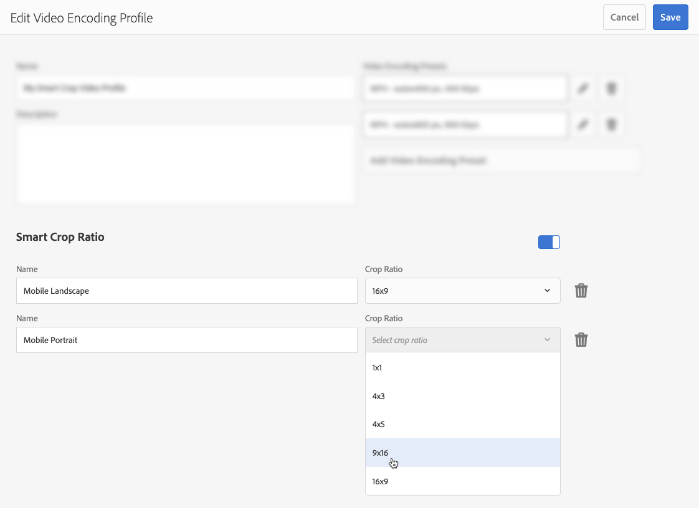

# Dynamic Media-videoprofielen{#video-profiles}

Dynamic Media wordt al geleverd met een vooraf gedefinieerd adaptief videocoderingsprofiel. De instellingen in dit out-of-the-box profiel zijn geoptimaliseerd om uw klanten de beste kijkervaring mogelijk te maken. Wanneer u uw primaire bronvideo&#39;s codeert met behulp van het profiel Adaptieve videocodering, past de videospeler tijdens het afspelen automatisch de kwaliteit van de videostream aan op basis van de snelheid van de internetverbinding van uw klanten. Dit wordt adaptieve streaming genoemd.

Hier volgen nog andere factoren die de kwaliteit van uw video&#39;s bepalen:

* **Resolutie van de geüploade primaire bronvideo**

   Als de MP4-video met een lagere resolutie, zoals 240p of 360p, is opgenomen, kan deze niet in HD worden gestreamd.

* **Grootte videospeler**

   Standaard is de breedte in het profiel Adaptieve videocodering ingesteld op Automatisch. Ook tijdens het afspelen wordt de beste kwaliteit gebruikt op basis van de grootte van de speler.

Zie [Aanbevolen werkwijzen voor videocodering](/help/assets/dynamic-media/video.md#best-practices-for-encoding-videos).

Zie ook [Aanbevolen procedures voor het ordenen van uw digitale middelen voor het gebruik van verwerkingsprofielen](/help/assets/dynamic-media/best-practices-for-file-management.md).

>[!NOTE]
>
>Als u de metadata van een video en de bijbehorende miniaturen van videoafbeeldingen wilt genereren, moet de video zelf het coderingsproces doorlopen in Dynamische media. In AEM codeert de workflow **[!UICONTROL Dynamic Media Encode Video]** video als u dynamische media hebt ingeschakeld en videocloudservices hebt ingesteld. In deze workflow worden de historie en informatie over fouten van het workflowproces vastgelegd. Zie [De voortgang van videocodering en YouTube-publicatie controleren](/help/assets/dynamic-media/video.md#monitoring-video-encoding-and-youtube-publishing-progress). Als u dynamische media hebt ingeschakeld en videocloudservices hebt ingesteld, wordt de workflow **[!UICONTROL Dynamic Media Encode Video]** automatisch geactiveerd wanneer u een video uploadt. (Als u geen dynamische media gebruikt, wordt de workflow **[!UICONTROL DAM Update Asset]** van kracht.)
>
>Metagegevens zijn handig wanneer u naar elementen zoekt. De miniaturen zijn statische videobeelden die tijdens het coderen worden gegenereerd. Deze worden door het AEM vereist en in de gebruikersinterface gebruikt om u te helpen video&#39;s visueel identificeren in de weergave Kaarten, de weergave Zoekresultaten en de weergave Lijst met middelen. De gegenereerde miniaturen worden weergegeven wanneer u op het pictogram Uitvoeringen (het palet van een schilder) van een gecodeerde video tikt.

Wanneer u klaar bent met het maken van het videoprofiel, past u het toe op een map of meerdere mappen. Zie [Een videoprofiel toepassen op mappen.](#applying-a-video-profile-to-folders)

Zie [Elementverwerking configureren](/help/assets/dynamic-media/config-dm.md#configuring-asset-processing) om geavanceerde verwerkingsparameters voor andere elementtypen te definiëren.

Zie ook [Profielen voor het verwerken van metagegevens, afbeeldingen en video&#39;s](/help/assets/dynamic-media/about-image-video-profiles.md).

## Voorinstellingen voor adaptieve videocodering {#adaptive-video-encoding-presets}

In de volgende tabel vindt u de beste praktijken voor het coderen van profielen voor adaptieve videostreaming naar mobiele apparaten en tabletapparaten en bureaubladcomputers. U kunt deze voorinstellingen gebruiken voor elke video met de hoogte-breedteverhouding.

<table>
 <tbody>
  <tr>
   <td><strong>Video-indelingscodec</strong></td>
   <td><strong>Videogrootte - Breedte (px)</strong></td>
   <td><strong>Videogrootte - Hoogte (px)</strong></td>
   <td><strong>Hoogte-breedteverhouding behouden?</strong></td>
   <td><strong>Videobitsnelheid (Kbps)</strong></td>
   <td><strong>Videoframesnelheid (FPS)</strong></td>
   <td><strong>Audiocodec</strong></td>
   <td><strong>Audiobitsnelheid (Kbps)</strong></td>
  </tr>
  <tr>
   <td>
MP4 H.264 (mp4)
 </td>
   <td>auto</td>
   <td>360</td>
   <td>Ja</td>
   <td>730</td>
   <td>30</td>
   <td>Dolby HE-AAC</td>
   <td>128</td>
  </tr>
  <tr>
   <td>
MP4 H.264 (mp4)
 </td>
   <td>auto</td>
   <td>540</td>
   <td>Ja</td>
   <td>2000  </td>
   <td>30</td>
   <td>Dolby HE-AAC</td>
   <td>128</td>
  </tr>
  <tr>
   <td>
MP4 H.264 (mp4)
 </td>
   <td>auto</td>
   <td>720  </td>
   <td>Ja</td>
   <td>3000  </td>
   <td>30</td>
   <td>Dolby HE-AAC</td>
   <td>128</td>
  </tr>
 </tbody>
</table>

## Informatie over slim uitsnijden in videoprofielen {#about-smart-crop-video}

Slim uitsnijden voor video-een optionele functie die beschikbaar is in videoprofielen - is een gereedschap dat de kracht van kunstmatige intelligentie in Adobe Sensei gebruikt om het brandpunt automatisch te detecteren en uit te snijden in adaptieve video of progressieve video die u hebt geüpload, ongeacht de grootte.

Ondersteunde video-indelingen voor slim uitsnijden zijn MP4, MKV, MOV, AVI, FLV en WMV.

De maximaal ondersteunde videobestandsgrootte voor slim uitsnijden is aan de volgende criteria:

* Duur van vijf minuten.
* 30 frames per seconde (FPS).
* Bestandsgrootte van 300 MB.

Adobe Sensei is momenteel beperkt tot 9000 frames. Dat wil zeggen, vijf minuten bij 30 FPS. Als uw video een hogere FPS heeft, neemt de maximaal ondersteunde videoduur af. Een video van 60 FPS moet bijvoorbeeld tweeënhalve minuut duren voordat deze wordt ondersteund door Adobe Sensai en SmartCrop.

>[!IMPORTANT]
>
>Als u slimme videoclips alleen wilt gebruiken, moet u een of meer voorinstellingen voor videocodering opnemen in uw videoprofiel.

Als u SmartCrop voor video wilt gebruiken, maakt u een adaptief of progressief videocoderingsprofiel. Als onderdeel van uw profiel gebruikt u het gereedschap **[!UICONTROL Smart Crop Ratio]** om vooraf gedefinieerde hoogte-breedteverhoudingen te selecteren. Nadat u bijvoorbeeld de videocoderingsvoorinstellingen hebt gedefinieerd, kunt u een definitie &quot;Mobiel liggend&quot; toevoegen met een hoogte-breedteverhouding van 16 x 9 en een definitie &quot;Mobiel staand&quot; met een hoogte-breedteverhouding van 9 x 16. Andere hoogte-breedteverhoudingen of uitsnijdverhoudingen waaruit u kunt kiezen, zijn onder andere 1x1, 4x3 en 4x5.

Let op: u kunt slimme uitsnijding van video in het videoprofiel in- of uitschakelen met de schuifregelaar helemaal rechts van **[!UICONTROL Smart Crop Ratio]** in de gebruikersinterface.

Nadat u het videoprofiel hebt gemaakt en opgeslagen, kunt u het toepassen op de gewenste mappen.

Zie [Videoprofielen toepassen op specifieke mappen](#applying-video-profiles-to-specific-folders) of [Een videoprofiel globaal toepassen](#applying-a-video-profile-globally).

Zie ook [Slim uitsnijden voor afbeeldingen](image-profiles.md).

## Een videoprofiel maken voor adaptieve streaming {#creating-a-video-encoding-profile-for-adaptive-streaming}

Dynamic Media wordt al geleverd met een vooraf gedefinieerd adaptief videocoderingsprofiel - een groep video-uploadinstellingen voor MP4 H.264-systeem dat is geoptimaliseerd voor de beste kijkervaring. U kunt dit profiel gebruiken wanneer u uw video&#39;s uploadt.

Als dit vooraf gedefinieerde profiel echter niet aan uw behoeften voldoet, kunt u zelf een adaptief videocoderingsprofiel maken. Als u de instelling **[!UICONTROL Encode for adaptive streaming]**-als aanbevolen gebruikt, worden alle coderingsvoorinstellingen die u aan het profiel toevoegt, gevalideerd om ervoor te zorgen dat alle video&#39;s dezelfde hoogte-breedteverhouding hebben. Bovendien worden de gecodeerde video&#39;s beschouwd als een set met multibitsnelheden voor streaming.

Wanneer u het videocoderingsprofiel maakt, ziet u dat de meeste coderingsopties vooraf zijn gevuld met de aanbevolen standaardinstellingen. Als u echter een andere waarde dan de aanbevolen standaardwaarde selecteert, moet u er rekening mee houden dat dit kan leiden tot een slechte videokwaliteit tijdens het afspelen en andere prestatieproblemen.

Voor alle MP4 H.264-videocoderingsvoorinstellingen in het profiel worden dus de volgende waarden gevalideerd om ervoor te zorgen dat deze voor afzonderlijke coderingsvoorinstellingen in het profiel hetzelfde zijn, zodat adaptief streamen mogelijk wordt:

* Video-indelingscodec - MP4 H.264 (.mp4)
* Audiocodec
* Audiobitsnelheid
* Hoogte-breedteverhouding behouden
* Codering met twee controles
* Constante bitsnelheid
* H264-profiel
* Samplingfrequentie audio

Als de waarden niet gelijk zijn, kunt u doorgaan met het maken van het profiel. Let er echter op dat adaptieve streaming niet mogelijk is. In plaats daarvan krijgen gebruikers last van streaming met één bitsnelheid. Het wordt aanbevolen de coderingsinstellingen te bewerken om dezelfde waarden te gebruiken voor afzonderlijke coderingsvoorinstellingen in het profiel. (Let op: de editor Video Profiel/Voorinstelling moet de pariteit van de aangepaste instellingen voor videocodering afdwingen als &quot;Coderen voor adaptief streamen&quot; is ingeschakeld.)

Zie ook [Een videocoderingsprofiel maken voor progressieve streaming](#creating-a-video-encoding-profile-for-progressive-streaming).

Zie ook [Aanbevolen werkwijzen voor videocodering](/help/assets/dynamic-media/video.md#best-practices-for-encoding-videos).

Zie [Elementverwerking configureren](/help/assets/dynamic-media/config-dm.md#configuring-asset-processing) om geavanceerde verwerkingsparameters voor andere elementtypen te definiëren.

**Een videoprofiel maken voor adaptieve streaming**,

1. Tik op het AEM-logo en ga naar **[!UICONTROL Tools]** > **[!UICONTROL Assets]** > **[!UICONTROL Video Profiles]**.
1. Klik of tik **[!UICONTROL Create]** om een nieuw videoprofiel toe te voegen.

1. Voer een naam en beschrijving in voor het profiel.
1. Tik op **[!UICONTROL Add Video Encoding Preset]** op de pagina Voorinstellingen voor videocodering maken/bewerken.
1. Stel op het tabblad **[!UICONTROL Basic]** de video- en audio-opties in.
Tik op het informatiepictogram naast elke optie voor extra beschrijvingen of aanbevolen instellingen op basis van de geselecteerde video-indelingscodec.
1. Controleer of **[!UICONTROL Keep aspect ratio]** is ingeschakeld onder de kop Videogrootte.
1. Stel de resolutie van de videoframegrootte in pixels in. Gebruik de waarde **[!UICONTROL Auto]** om automatisch te schalen zodat deze overeenkomt met de hoogte-breedteverhouding van de bron (breedte-hoogteverhouding). Bijvoorbeeld Auto x 480 of 640 x Auto.

1. Voer een van de volgende handelingen uit:

   * Typ **[!UICONTROL auto]** in het veld **[!UICONTROL Width]**. Voer in het veld **[!UICONTROL Height]** een waarde in pixels in.

   * Tik op het informatiepictogram (i) rechts van **[!UICONTROL Height]** om de pagina voor de berekening van grootte te openen, zodat u de grootte van de video kunt visualiseren. Gebruik **[!UICONTROL Size Calculator]** om de gewenste videoafmetingen in te stellen (weergegeven door het blauwe vak). Tik **[!UICONTROL X]** in de rechterbovenhoek als u klaar bent.

1. (Optioneel) Tik op de tab **[!UICONTROL Advanced]** en controleer of het selectievakje **[!UICONTROL Use Default Values]** is ingeschakeld (aanbevolen). U kunt ook geavanceerde video- en audio-instellingen wijzigen.
1. Tik in de rechterbovenhoek van de pagina op **[!UICONTROL Save]** om de voorinstelling op te slaan.
1. Voer een van de volgende handelingen uit:
   * Herhaal stap 4-10 om aanvullende coderingsvoorinstellingen te maken. (Voor adaptieve videostreaming zijn meerdere videovoorinstellingen vereist.)
   * Ga door met de volgende stap.

1. (Optioneel) Ga als volgt te werk om een slimme videoclip toe te voegen aan de video&#39;s waarop dit profiel wordt toegepast:
   * Tik op de pagina Videoprofiel bewerken rechts van de kop Slimme uitsnijdverhouding op **[!UICONTROL Add New]**.
   * Typ in het veld Naam een naam voor de uitsnijdverhouding, zodat u deze gemakkelijk kunt herkennen.
   * Selecteer in de vervolgkeuzelijst **[!UICONTROL Crop Ratio]** de verhouding die u wilt gebruiken.

1. Voer een van de volgende handelingen uit:

   * Voeg desgewenst nieuwe uitsnijdverhoudingen toe.
   * Ga door met de volgende stap.

1. Tik in de rechterbovenhoek van de pagina nogmaals op **[!UICONTROL Save]** om het profiel op te slaan.

U kunt het profiel nu toepassen op mappen die video&#39;s bevatten. Zie [Een videoprofiel toepassen op mappen](#applying-a-video-profile-to-folders) of [Een videoprofiel globaal toepassen](#applying-a-video-profile-globally).

## Een videoprofiel maken voor progressieve streaming {#creating-a-video-encoding-profile-for-progressive-streaming}

Als u de optie **[!UICONTROL Encode for adaptive streaming]** niet wilt gebruiken, moet u er rekening mee houden dat alle coderingsvoorinstellingen die u aan het profiel toevoegt, worden behandeld als afzonderlijke videoweergaven voor streaming met één bitsnelheid of progressieve videobezorging. Er is ook geen validatie om ervoor te zorgen dat alle video-uitvoeringen dezelfde hoogte-breedteverhouding hebben.

De ondersteunde video-indelingscodecs zijn H.264 (.mp4) en WebM.

Zie ook [Een videocoderingsprofiel maken voor adaptieve streaming](#creating-a-video-encoding-profile-for-adaptive-streaming).

Zie ook [Aanbevolen werkwijzen voor videocodering](/help/assets/dynamic-media/video.md#best-practices-for-encoding-videos).

Zie [Elementverwerking configureren](/help/assets/dynamic-media/config-dm.md#configuring-asset-processing) om geavanceerde verwerkingsparameters voor andere elementtypen te definiëren.

**Een videoprofiel maken voor progressief streamen:**

1. Tik op het AEM-logo en ga naar **[!UICONTROL Tools]** > **[!UICONTROL Assets]** > **[!UICONTROL Video Profiles]**.
1. Tik **[!UICONTROL Create]** om een nieuw videoprofiel toe te voegen.
1. Voer een naam en beschrijving in voor het profiel.
1. Tik op **[!UICONTROL Add Video Encoding Preset]** op de pagina Voorinstellingen voor videocodering maken/bewerken.
1. Stel op het tabblad **[!UICONTROL Basic]** de video- en audio-opties in.
Tik op het informatiepictogram naast elke optie voor extra beschrijvingen of aanbevolen instellingen op basis van de geselecteerde video-indelingscodec.
1. (Optioneel) Schakel **[!UICONTROL Keep aspect ratio]** uit onder de kop Videogrootte.
1. Ga als volgt te werk:
   * Typ **[!UICONTROL auto]** in het veld **[!UICONTROL Width]**.
   * Voer in het veld **[!UICONTROL Height]** een waarde in pixels in.
Tik op het informatiepictogram Hoogte om de pagina **[!UICONTROL Size Calculator]** te openen, zodat u de grootte van de video kunt visualiseren. Gebruik de pagina **[!UICONTROL Size Calculator]** om de videodimensie (blauwe doos) verder te plaatsen hoe u wilt. Tik op **[!UICONTROL X]** in de rechterbovenhoek van het dialoogvenster als u klaar bent.
1. (Optioneel) Voer een van de volgende handelingen uit:

   * Tik op de tab **[!UICONTROL Advanced]** en controleer of het selectievakje **[!UICONTROL Use Default Values]** is ingeschakeld (aanbevolen).

   * Schakel het selectievakje **[!UICONTROL Use Default Values]** uit en geef de gewenste video-instellingen en audio-instellingen op.
Tik op het informatiepictogram naast elke optie voor extra beschrijvingen of aanbevolen instellingen op basis van de geselecteerde video-indelingscodec.

1. Tik in de rechterbovenhoek van de pagina op **[!UICONTROL Save]** om de voorinstelling op te slaan.
1. Voer een van de volgende handelingen uit:

   * Herhaal stap 4-9 om aanvullende coderingsvoorinstellingen te maken.
   * Ga door met de volgende stap.

1. (Optioneel) Ga als volgt te werk om een slimme videoclip toe te voegen aan de video&#39;s waarop dit profiel wordt toegepast:

   * Tik op de pagina Videoprofiel bewerken rechts van de kop Slimme uitsnijdverhouding op **[!UICONTROL Add New]**.
   * Typ in het veld Naam een naam voor de uitsnijdverhouding, zodat u deze gemakkelijk kunt herkennen.
   * Selecteer in de vervolgkeuzelijst **[!UICONTROL Crop Ratio]** de verhouding die u wilt gebruiken.

1. Voer een van de volgende handelingen uit:

   * Voeg desgewenst nieuwe uitsnijdverhoudingen toe.
   * Ga door met de volgende stap.

1. Tik in de rechterbovenhoek van de pagina op **[!UICONTROL Save]** om het profiel op te slaan.

U kunt het profiel nu toepassen op mappen die video&#39;s bevatten. Zie [Een videoprofiel toepassen op mappen](#applying-a-video-profile-to-folders) of [Een videoprofiel globaal toepassen](#applying-a-video-profile-globally).

## Parameters {#using-custom-added-video-encoding-parameters} voor videocodering met aangepaste toevoeging gebruiken

U kunt een bestaand videocoderingsprofiel bewerken om te profiteren van de geavanceerde parameters voor videocodering die niet in de gebruikersinterface worden gevonden wanneer u een videoprofiel maakt of bewerkt in AEM. Aangepast voegt u een of meer geavanceerde parameters, zoals minBitrate en maxBitrate, toe aan uw bestaande profiel.

**U kunt als volgt parameters** voor videocodering met aangepaste toevoeging gebruiken:

1. Tik op het AEM-logo en ga naar **[!UICONTROL Tools]** > **[!UICONTROL General]** > **[!UICONTROL CRXDE Lite]**.
1. Navigeer op de pagina CRXDE Lite naar het volgende in het deelvenster Verkenner aan de linkerkant:

   `/conf/global/settings/dam/dm/presets/video/*name_of_video_encoding_profile_to_edit`

1. In het deelvenster in de rechterbenedenhoek van de pagina op het tabblad Eigenschappen geeft u de **[!UICONTROL Name]**, **[!UICONTROL Type]** en **[!UICONTROL Value]** van de parameter op u wilt gebruiken.

   U kunt de volgende geavanceerde parameters gebruiken:

<table>
 <tbody>
  <tr>
   <td><strong>Naam</strong></td>
   <td><strong>Beschrijving</strong>  </td>
   <td><strong>Type</strong>  </td>
   <td><strong>Waarde</strong></td>
  </tr>
  <tr>
   <td><code>h264Level</code></td>
   <td>H.264-niveau voor codering. Normaal gesproken wordt dit automatisch bepaald op basis van de coderingsinstellingen die u gebruikt.</td>
   <td><code>String</code></td>
   <td>
10 * h264 niveau
 
3,0 = 30, 1,3 = 13)
 
Geen standaardwaarde.
 </td>
  </tr>
  <tr>
   <td><code>keyframe</code></td>
   <td>Het doelaantal frames tussen hoofdframes. Bereken deze waarde om een hoofdframe te genereren na elke 2-10 seconden. Bijvoorbeeld, bij 30 kaders per seconde, zou het keyframe interval 60-300 moeten zijn.    De lagere keyframe intervallen verbeteren stroom het zoeken en stroom omschakelingsgedrag voor adaptieve videocoderingen en kunnen de kwaliteit voor video's ook verbeteren die veel motie hebben. Omdat hoofdframes de grootte van een bestand echter vergroten, resulteert een lager hoofdframe-interval meestal in een lagere algemene videokwaliteit bij een bepaalde bitsnelheid.</td>
   <td><code>String</code></td>
   <td>
Positief getal.
 
De standaardwaarde is 300.
 
De aanbevolen waarde voor HLS (Live HTTP-streaming) is 60-90.
 </td>
  </tr>
  <tr>
   <td><code>minBitrate</code></td>
   <td>
Minimale bitsnelheid voor coderingen met variabele bitsnelheid, in Kbps (kilobits per seconde).
 
Deze parameter is alleen van toepassing wanneer op het tabblad Geavanceerd de optie Constante bitsnelheid gebruiken<strong> is uitgeschakeld wanneer u een videocoderingsprofiel maakt of bewerkt.</strong>
 
Zie ook <a href="/help/assets/dynamic-media/video.md#bitrate">Bitsnelheid</a>.
 </td>
   <td><code>String</code></td>
   <td>
Positief getal, in Kbps.
 
Geen standaardwaarde.
 </td>
  </tr>
  <tr>
   <td><code>maxBitrate</code></td>
   <td>
Maximale bitsnelheid voor codering van variabele bitsnelheid, in Kbps.
 
Deze parameter is alleen van toepassing wanneer op het tabblad Geavanceerd de optie Constante bitsnelheid gebruiken<strong> is uitgeschakeld wanneer u een videocoderingsprofiel maakt of bewerkt.</strong>
 
Zie ook <a href="/help/assets/dynamic-media/video.md#bitrate">Bitsnelheid</a>.
 </td>
   <td><code>String</code></td>
   <td>
Positief getal, in Kbps.
 
Geen standaardwaarde. De aanbevolen waarde bedraagt echter maximaal twee keer de coderingsbitsnelheid.
 </td>
  </tr>
  <tr>
   <td><code>audioBitrateCustom</code></td>
   <td>Stel waarde in op <code>true</code> om een constante bitsnelheid voor de audiostream te forceren, indien ondersteund door audiocodec.</td>
   <td><code>String</code></td>
   <td>
<code>true</code>/<code>false</code>
 
De standaardwaarde is <code>false</code>.
 
De aanbevolen waarde voor HLS (Live HTTP-streaming) is <code>false</code>.
 
 
 </td>
  </tr>
 </tbody>
</table>

1. Tik in de rechterbenedenhoek van de pagina op **[!UICONTROL Add]**.
1. Voer een van de volgende handelingen uit:

   * Herhaal stap 3 en 4 om een andere parameter toe te voegen aan uw videocoderingsprofiel.
   * Tik in de linkerbovenhoek van de pagina op **[!UICONTROL Save All]**.

1. Tik in de linkerbovenhoek van de pagina CRXDE Lite op het pictogram **[!UICONTROL Back Home]** om terug te keren naar AEM.

### Een videoprofiel {#editing-a-video-encoding-profile} bewerken

U kunt elk videoprofiel bewerken dat u hebt gemaakt om videovoorinstellingen in dat profiel toe te voegen, te bewerken of te verwijderen.

Standaard kunt u het vooraf gedefinieerde **[!UICONTROL Adaptive Video Encoding]**-profiel dat bij Dynamic Media is geleverd, niet bewerken. In plaats daarvan kunt u het profiel gemakkelijk kopiëren en opslaan met een nieuwe naam. Vervolgens kunt u de gewenste voorinstellingen bewerken in het gekopieerde profiel.

Zie ook [Aanbevolen werkwijzen voor videocodering](/help/assets/dynamic-media/video.md#best-practices-for-encoding-videos).

Zie [Elementverwerking configureren](/help/assets/dynamic-media/config-dm.md#configuring-asset-processing) om geavanceerde verwerkingsparameters voor andere elementtypen te definiëren.

**Een videoprofiel** bewerken:

1. Tik op het AEM-logo en ga naar **[!UICONTROL Tools]** > **[!UICONTROL Assets]** > **[!UICONTROL Video Profiles]**.
1. Controleer op de pagina Videoprofielen de naam van één videoprofiel.
1. Tik op **[!UICONTROL Edit]** op de werkbalk.
1. Bewerk de naam en beschrijving op de pagina Profiel videocodering.
1. U kunt het beste het selectievakje **[!UICONTROL Encode for adaptive streaming]** inschakelen.
Tik op het informatiepictogram voor een beschrijving van adaptieve streaming. (Schakel dit selectievakje niet in als u een progressief videoprofiel bewerkt.)
1. Onder de kop Voorinstellingen videocodering kunt u voorinstellingen voor videocodering die het profiel vormen, toevoegen, bewerken of verwijderen.

   Tik op het informatiepictogram naast elke optie op de tabbladen **[!UICONTROL Basic]** en **[!UICONTROL Advanced]** voor extra beschrijvingen of aanbevolen instellingen op basis van de codec voor de geselecteerde video-indeling.

1. Tik in de rechterbovenhoek van de pagina op **[!UICONTROL Save]**.

### Een videoprofiel {#copying-a-video-encoding-profile} kopiëren

1. Tik op het AEM-logo en ga naar **[!UICONTROL Tools]** > **[!UICONTROL Assets]** > **[!UICONTROL Video Profiles]**.
1. Controleer op de pagina Videoprofielen de naam van één videoprofiel.
1. Tik op **[!UICONTROL Copy]** op de werkbalk.
1. Voer op de pagina Profiel videocodering een nieuwe naam in voor het profiel.
1. U kunt het beste het selectievakje **[!UICONTROL Encode for adaptive streaming]** inschakelen. Tik op het informatiepictogram voor een beschrijving van adaptieve streaming. (Schakel het selectievakje niet in als u een progressief videoprofiel kopieert.)

   In Dynamic Media - hybride modus is **[!UICONTROL Encode for adaptive streaming]** niet mogelijk als een WebM-videovoorinstelling deel uitmaakt van het videoprofiel. Alle voorinstellingen moeten namelijk MP4 zijn.
1. Onder de kop Voorinstellingen videocodering kunt u voorinstellingen voor videocodering die het profiel vormen, toevoegen, bewerken of verwijderen.

   Tik op het informatiepictogram naast elke optie op de tabbladen Standaard en Geavanceerd voor aanbevolen instellingen en beschrijvingen.

1. Tik in de rechterbovenhoek van de pagina op **[!UICONTROL Save]**.

### Een videoprofiel {#deleting-a-video-encoding-profile} verwijderen

1. Tik op het AEM-logo en ga naar **[!UICONTROL Tools]** > **[!UICONTROL Assets]** > **[!UICONTROL Video Profiles]**.
1. Controleer een of meer namen van videoprofielen op de pagina Videoprofielen.
1. Tik op **[!UICONTROL Delete]** op de werkbalk.
1. Tik op **[!UICONTROL OK]**.

## Een videoprofiel toepassen op mappen {#applying-a-video-profile-to-folders}

Wanneer u een videoprofiel toewijst aan een map, nemen eventuele submappen het profiel automatisch over van de bovenliggende map. Dit betekent dat u slechts één videoprofiel kunt toewijzen aan een map. Denk daarom zorgvuldig na over de mapstructuur van de locatie waar u middelen uploadt, opslaat, gebruikt en archiveert.

Als u een ander videoprofiel aan een omslag toewees, treedt het nieuwe profiel het vorige profiel met voeten. De vorige bestaande mapelementen blijven ongewijzigd. Het nieuwe profiel wordt toegepast op de elementen die later aan de map worden toegevoegd.

Mappen waaraan een profiel is toegewezen, worden in de gebruikersinterface aangeduid met de naam van het profiel dat in de kaartnaam wordt weergegeven.

U kunt videoprofielen toepassen op specifieke mappen of op alle elementen.

U kunt elementen opnieuw verwerken in een map die al een bestaand videoprofiel heeft dat u later wijzigt. Zie [Elementen opnieuw verwerken in een map](/help/assets/dynamic-media/about-image-video-profiles.md#reprocessing-assets).

### Een videoprofiel toepassen op specifieke mappen {#applying-video-profiles-to-specific-folders}

U kunt een videoprofiel toepassen op een map vanuit het menu **[!UICONTROL Tools]** of **[!UICONTROL Properties]** als u zich in de map bevindt. In deze sectie wordt beschreven hoe u videoprofielen op beide manieren op mappen kunt toepassen.

Mappen waaraan al een profiel is toegewezen, worden aangegeven door de naam van het profiel direct onder de mapnaam weer te geven.

Zie ook [Elementen in een map opnieuw verwerken nadat u het verwerkingsprofiel ervan hebt bewerkt](/help/assets/dynamic-media/about-image-video-profiles.md#reprocessing-assets).

#### Een videoprofiel toepassen op mappen via de gebruikersinterface Profielen {#applying-video-profiles-to-folders-by-way-of-the-profiles-user-interface}

1. Tik op het AEM-logo en ga naar **[!UICONTROL Tools]** > **[!UICONTROL Assets]** > **[!UICONTROL Video Profiles]**.
1. Selecteer het videoprofiel dat u wilt toepassen op een of meerdere mappen.
1. Tik op **[!UICONTROL Apply Profile to Folder(s)]** en selecteer de map of meerdere mappen die u wilt gebruiken om de nieuw geüploade assets te ontvangen en tik op **[!UICONTROL Apply]**. Mappen waaraan al een profiel is toegewezen, worden aangegeven door de naam van het profiel direct onder de mapnaam weer te geven wanneer u zich in **[!UICONTROL Card View]** bevindt.
U kunt [de vooruitgang van een de verwerkingsbaan van het Profiel van de Video ](#monitoring-the-progress-of-an-encoding-job) controleren.

#### Een videoprofiel toepassen op mappen vanuit Eigenschappen {#applying-video-profiles-to-folders-from-properties}

1. Tik of klik op het AEM en navigeer naar **[!UICONTROL Assets]** en vervolgens naar de map waarop u een videoprofiel wilt toepassen.
1. Tik in de map op het vinkje om het te selecteren en tik op **[!UICONTROL Properties]**.
1. Selecteer het tabblad **[!UICONTROL Video Profiles]**, selecteer het profiel in het vervolgkeuzemenu en klik op **[!UICONTROL Save & Close]**. Mappen waaraan al een profiel is toegewezen, worden aangegeven door de naam van het profiel direct onder de mapnaam weer te geven.

   
U kunt de vooruitgang van een de verwerkingsbaan  van het Profiel van de Video controleren.

### Een videoprofiel globaal toepassen {#applying-a-video-profile-globally}

Naast het toepassen van een profiel op een map, kunt u er ook een globaal toepassen, zodat het geselecteerde profiel wordt toegepast op inhoud die is geüpload naar AEM elementen in een map.

Zie ook [Elementen opnieuw verwerken in een map](/help/assets/dynamic-media/about-image-video-profiles.md#reprocessing-assets).

**Een videoprofiel algemeen** toepassen,

* Navigeer naar CRXDE Lite naar het volgende knooppunt: `/content/dam/jcr:content`. Voeg de eigenschap `videoProfile:/libs/settings/dam/video/dynamicmedia/<name of video encoding profile>` toe en tik **[!UICONTROL Save All]**.

   
* U kunt [de vooruitgang van een de verwerkingsbaan van het Profiel van de Video ](#monitoring-the-progress-of-an-encoding-job) controleren.

## De voortgang van een verwerkingstaak van een videoprofiel {#monitoring-the-progress-of-an-encoding-job} controleren

Er wordt een verwerkingsindicator (of voortgangsbalk) weergegeven waarmee u de voortgang van een verwerkingstaak van een videoprofiel visueel kunt controleren.

U kunt het `error.log` dossier ook bekijken om de vooruitgang van een het coderen baan te controleren, om te zien of wordt het coderen gebeëindigd, of om het even welke baanfouten te zien. De `error.log` wordt gevonden in `logs` omslag waar uw geval van AEM geïnstalleerd is.

## Een videoprofiel verwijderen uit mappen {#removing-a-video-profile-from-folders}

Wanneer u een videoprofiel uit een map verwijdert, wordt het verwijderen van het profiel uit de bovenliggende map automatisch overgenomen in alle submappen. Alle verwerking van bestanden die in de mappen zijn opgetreden, blijft echter intact.

U kunt een videoprofiel verwijderen uit een map in het menu **[!UICONTROL Tools]** of uit **[!UICONTROL Folder Settings]** als u zich in de map bevindt. In deze sectie wordt beschreven hoe u videoprofielen op beide manieren uit mappen kunt verwijderen.

### Een videoprofiel uit mappen verwijderen via de gebruikersinterface Profielen {#removing-video-profiles-from-folders-by-way-of-the-profiles-user-interface}

1. Tik op het AEM-logo en ga naar **[!UICONTROL Tools]** > **[!UICONTROL Assets]** > **[!UICONTROL Video Profiles]**.
1. Selecteer het videoprofiel dat u uit een of meerdere mappen wilt verwijderen.
1. Tik op **[!UICONTROL Remove Profile from Folders]** en selecteer de map of meerdere mappen die u wilt gebruiken om het profiel te verwijderen en tik op **[!UICONTROL Remove]**.

   U kunt bevestigen dat het videoprofiel niet meer wordt toegepast op een map omdat de naam niet langer onder de mapnaam wordt weergegeven.

### Een videoprofiel uit mappen verwijderen met eigenschappen {#removing-video-profiles-from-folders-by-way-of-properties}

1. Tik of klik op het AEM en navigeer naar **[!UICONTROL Assets]** en vervolgens naar de map waaruit u een videoprofiel wilt verwijderen.
1. Tik op het vinkje of klik op het vinkje in de map om het te selecteren en tik op **[!UICONTROL Properties]**.
1. Selecteer het tabblad **[!UICONTROL Video Profiles]**, selecteer **[!UICONTROL None]** in het vervolgkeuzemenu en klik op **[!UICONTROL Save & Close]**. Mappen waaraan al een profiel is toegewezen, worden aangegeven door de naam van het profiel direct onder de mapnaam weer te geven.

