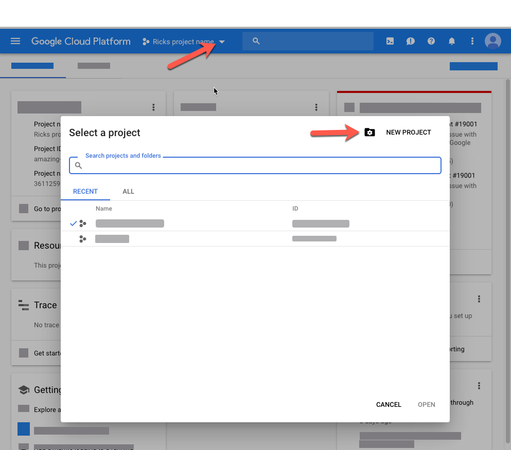

# Video{#video}

In deze sectie wordt het werken met video in Dynamic Media beschreven.

## Snel starten: Video&#39;s {#quick-start-videos}

De volgende stapsgewijze workflowbeschrijving is ontworpen om u te helpen snel aan de slag te gaan met adaptieve videosets in Dynamic Media. Nadat elke stap verwijzingen naar onderwerprubrieken zijn waar u meer informatie kunt vinden.

>[!NOTE]
>
>Alvorens u met video in Dynamic Media werkt, zorg ervoor dat uw beheerder AEM reeds Dynamic Media Cloud Servicen heeft toegelaten en gevormd.
>
>* Zie het [Vormen Cloud Servicen](/help/assets/dynamic-media/config-dm.md#configuring-dynamic-media-cloud-services) van Dynamic Media in het Vormen van Dynamic Media en de Dynamic Media [van het](/help/assets/dynamic-media/troubleshoot-dm.md)Oplossen van problemen.
>


1. **Upload uw video** &#39;s van Dynamic Media door het volgende te doen:

   * Maak uw eigen videocoderingsprofiel. U kunt ook gewoon het vooraf gedefinieerde _adaptieve videocoderingsprofiel_ gebruiken dat bij Dynamic Media wordt geleverd.

      * [Een videocoderingsprofiel](/help/assets/dynamic-media/video-profiles.md#creating-a-video-encoding-profile-for-adaptive-streaming)maken.
      * Meer informatie over de [aanbevolen procedures voor videocodering](#best-practices-for-encoding-videos).
   * Koppel het videoverwerkingsprofiel aan een of meer mappen waar u de primaire bronvideo&#39;s gaat uploaden.

      * [Een videoprofiel toepassen op mappen](/help/assets/dynamic-media/video-profiles.md#applying-a-video-profile-to-folders).
      * Meer informatie over de [aanbevolen procedures voor het ordenen van uw digitale middelen voor het gebruik van verwerkingsprofielen](/help/assets/dynamic-media/best-practices-for-file-management.md).
      * Meer informatie over het [ordenen van digitale middelen](/help/assets/organize-assets.md).
   * Upload uw primaire bronvideo&#39;s naar de mappen. U kunt videobestanden uploaden van maximaal 15 GB elk. Wanneer u video&#39;s aan de map toevoegt, worden deze gecodeerd volgens het videoverwerkingsprofiel dat u aan de map hebt toegewezen.

      * [Upload uw video](/help/assets/manage-video-assets.md#upload-and-preview-video-assets)&#39;s.
      * Meer informatie over [ondersteunde invoerbestandsindelingen](/help/assets/file-format-support.md).
   * Controleer hoe de [videocodering vordert](#monitoring-video-encoding-and-youtube-publishing-progress) vanuit de asset- of workflowweergave.


1. **Voer een van de volgende handelingen uit om uw video** &#39;s over Dynamic Media te beheren:

   * Video-elementen organiseren, doorbladeren en zoeken

      * [Digitale middelen](/help/assets/organize-assets.md)ordenen Meer informatie over [Aanbevolen procedures voor het ordenen van uw digitale middelen voor het gebruik van verwerkingsprofielen](/help/assets/dynamic-media/best-practices-for-file-management.md)

      * [Video-elementen](/help/assets/search-assets.md#custompredicates) zoeken of elementen [zoeken](/help/assets/manage-digital-assets.md#search-assets)
   * Video-elementen voorvertonen en publiceren

      * Bekijk de bronvideo en de gecodeerde vertoningen van de video samen met de bijbehorende miniaturen:
         [Een voorvertoning weergeven van video](/help/assets/manage-video-assets.md#upload-and-preview-video-assets) &#39;s of elementen [voorvertonen](/help/assets/dynamic-media/previewing-assets.md)
         [Video-uitvoeringen beheren](/help/assets/manage-digital-assets.md#managing-renditions)


<!-- Commented video-renditions.md as the file is not published yet and will lead to broken link.
        * View the source video and encoded renditions of the video along with its associated thumbnails:
          [Previewing videos](/help/assets/manage-video-assets.md#upload-and-preview-video-assets) or [Previewing assets](/help/assets/dynamic-media/previewing-assets.md)
          [Viewing video renditions](/help/assets/video-renditions.md)
          [Managing video renditions](/help/assets/manage-digital-assets.md#managing-renditions) -->

    * [Viewervoorinstellingen beheren](/help/assets/dynamic-media/managing-viewer-presets.md)
    * [Elementen publiceren](/help/assets/dynamic-media/publishing-dynamicmedia-assets.md)
    
    * Werken met videometagegevens

<!--      * View the properties of an encoded video rendition such as frame rate, audio and video bitrate, and codec:
          [Viewing video rendition properties](/help/assets/video-renditions.md) -->

    * Bewerk de eigenschappen van video, zoals de titel, beschrijving en tags, aangepaste metagegevensvelden:
    [Video-eigenschappen bewerken](/help/assets/manage-digital-assets.md#editing-properties)
    
    * [Metagegevens voor digitale elementen beheren](/help/assets/manage-metadata.md)
    * [Metagegevensschema&#39;s](/help/assets/metadata-schemas.md)
    
    * Video&#39;s bekijken, goedkeuren en notities aanbrengen en het versiebeheer
    
    * [Annoteren van video&#39;s](/help/assets/manage-video-assets.md#annotate-video-assets) of [Annoteren assets](/help/assets/manage-digital-assets.md#annoating)
    
    * [Een versie maken](/help/assets/manage-digital-assets.md#asset-versioning)
    * [Een workflow op een element starten](/help/assets/manage-digital-assets.md#start-a-workflow-on-an-asset)

<!-- Removing assets-workflow.md file link as it is not applicable anymore. Workflows are replaced by processing profiles.
        * [Creating a version](/help/assets/manage-digital-assets.md#asset-versioning)
        * [Applying workflows to assets](/help/assets/assets-workflow.md) or see [Starting a workflow on an asset](/help/assets/manage-digital-assets.md#starting-a-workflow-on-an-asset)
-->

    * [Mapmiddelen voor revisie](/help/assets/bulk-approval.md)
    * [Projecten](/help/sites-cloud/authoring/projects/overview.md)

1. **Publiceer uw video** &#39;s van Dynamic Media door één van het volgende te doen:

   * Als u Adobe Experience Manager gebruikt als uw WCM-systeem (Web Content Management), kunt u video&#39;s rechtstreeks toevoegen aan uw webpagina&#39;s.

      * [Video&#39;s toevoegen aan uw webpagina](/help/assets/dynamic-media/adding-dynamic-media-assets-to-pages.md)&#39;s.
   * Als u een systeem voor webcontentbeheer van derden gebruikt, kunt u video&#39;s koppelen aan of insluiten in uw webpagina&#39;s.

      * Video integreren met URL:
         [URL&#39;s koppelen aan uw webapplicatie](/help/assets/dynamic-media/linking-urls-to-yourwebapplication.md).

      * Video integreren met gebruik van ingesloten code op webpagina:
         [De videoviewer insluiten op een webpagina](/help/assets/dynamic-media/embed-code.md).
   * [Video&#39;s publiceren naar YouTube](#publishing-videos-to-youtube).
   * [Videorapporten](#viewing-video-reports)genereren.

   * [Bijschriften toevoegen aan video](#adding-captions-to-video).


## Werken met video in Dynamic Media {#working-with-video-in-dynamic-media}

Video in Dynamic Media is een end-to-end oplossing waarmee u eenvoudig Adaptieve video van hoge kwaliteit kunt publiceren voor streaming op meerdere schermen, zoals desktopcomputers, iOS, Android, Blackberry en mobiele Windows-apparaten. Een adaptieve videoreeks groepeert versies van de zelfde video die bij verschillende beetjetarieven en formaten zoals 400 kbps, 800 kbps, en 1000 kbps worden gecodeerd. De desktopcomputer of het mobiele apparaat detecteert de beschikbare bandbreedte.

Op een mobiel iOS-apparaat detecteert het bijvoorbeeld een bandbreedte zoals 3G, 4G of Wi-Fi. Vervolgens wordt automatisch de naar rechts gecodeerde video geselecteerd bij de verschillende bitsnelheden van de video in de adaptieve videoset. De video wordt gestreamd naar desktops, mobiele apparaten of tablets.

Bovendien wordt de videokwaliteit automatisch dynamisch geschakeld als de netwerkomstandigheden veranderen op het bureaublad of op het mobiele apparaat. Ook, als een klant volledig-schermwijze op een Desktop ingaat, antwoordt de Adaptieve VideoReeks door een betere resolutie te gebruiken, daardoor verbeterend de het bekijken van de klant ervaring. Het gebruik van Adaptieve videosets biedt u de best mogelijke weergave voor klanten die Dynamic Media-video op meerdere schermen en apparaten afspelen.

De logica die een videospeler gebruikt om te bepalen welke gecodeerde video moet worden afgespeeld of tijdens het afspelen moet worden geselecteerd, is gebaseerd op het volgende algoritme:

1. Videospeler laadt het eerste videofragment op basis van de bitsnelheid die het dichtst bij de waarde ligt die is ingesteld voor de beginbitsnelheid in de speler zelf.
1. De videospelerschakelaars die op veranderingen in de bandbreedtesnelheid worden gebaseerd die de volgende criteria gebruiken:

   1. De speler kiest de hoogste bandbreedtestroom onder of gelijk aan de geschatte bandbreedte.
   1. De speler overweegt slechts 80% van de beschikbare bandbreedte. Als er echter een overstap wordt gemaakt, is het conservatiever bij slechts 70% om overschatting te voorkomen en onmiddellijk terug te keren.

Voor gedetailleerde technische informatie over het algoritme, zie [https://android.googlesource.com/platform/frameworks/av/+/master/media/libstagefright/httplive/LiveSession.cpp](https://android.googlesource.com/platform/frameworks/av/+/master/media/libstagefright/httplive/LiveSession.cpp)

Voor het beheren van afzonderlijke video- en adaptieve videosets wordt het volgende ondersteund:

* Video uploaden van diverse ondersteunde video-indelingen en audio-indelingen en video coderen naar MP4 H.264-indeling, zodat deze op meerdere schermen kan worden afgespeeld. U kunt vooraf gedefinieerde adaptieve videovoorinstellingen gebruiken, voorinstellingen voor één videocodering gebruiken of uw eigen codering aanpassen om de kwaliteit en de grootte van de video te bepalen.

   * Wanneer een adaptieve videoset wordt gegenereerd, bevat deze MP4-video&#39;s.
   * **Opmerking**: Primaire video&#39;s en bronvideo&#39;s worden niet toegevoegd aan een adaptieve videoset.

* ondertiteling in alle HTML5-videoviewers.
* Video organiseren, doorbladeren en doorzoeken met volledige metagegevensondersteuning voor een efficiënt beheer van video-elementen.
* Lever Adaptieve videosets naar het web, naar desktops en mobiele apparaten, waaronder de iPhone, iPad, Android, Blackberry en Windows-telefoon.

Adaptieve videostreaming wordt ondersteund op verschillende iOS-platforms. Zie de Gids [van de Verwijzing van](https://marketing.adobe.com/resources/help/en_US/s7/viewers_ref/c_html5_video_reference.html)Kijkers Scene7.

Dynamic Media ondersteunen het afspelen van mobiele video voor MP4 H.264-video. U vindt Blackberry-apparaten die deze video-indeling ondersteunen op de volgende locatie: [Ondersteunde video-indelingen op Blackberry](https://support.blackberry.com/kb/articleDetail?ArticleNumber=000005482).

U kunt de apparaten van Vensters vinden die dit videoformaat bij het volgende steunen: [Ondersteunde video-indelingen op Windows Phone](https://msdn.microsoft.com/library/windows/apps/ff462087%28v=vs.105%29.aspx)

* Speel de video terug gebruikend Dynamic Media VideoKijker vooraf instelt, met inbegrip van het volgende:

   * Afzonderlijke videoviewers.
   * Gemengde Media-viewers die zowel video- als afbeeldingsinhoud combineren.

* Configureer videospelers om aan uw brandingbehoeften te voldoen.
* Video met een eenvoudige URL of insluitcode integreren in uw website, mobiele site of mobiele toepassing.

Zie [Dynamisch voorbeeld van afspelen](https://s7d9.scene7.com/s7/uvideo.jsp?asset=GeoRetail/Mop_AVS&amp;config=GeoRetail/Universal_Video1&amp;stageSize=640,480) van video.

Zie ook [Viewers voor AEM en Scene7](https://marketing.adobe.com/resources/help/en_US/s7/viewers_ref/c_html5_s7_aem_asset_viewers.html) en [Viewers voor activa AEM slechts](https://marketing.adobe.com/resources/help/en_US/s7/viewers_ref/c_html5_aem_asset_viewers.html) in de Gids van de Verwijzing van de Kijkers van Adobe Scene7.

## Beste praktijken: De HTML5-videoviewer gebruiken {#best-practice-using-the-html-video-viewer}

De voorinstellingen van de Dynamic Media HTML5 Video-viewer zijn robuuste videospelers. U kunt ze gebruiken om veel voorkomende problemen te voorkomen die samenhangen met het afspelen van HTML5-video en met problemen die samenhangen met mobiele apparaten, zoals een gebrek aan adaptieve streaminglevering en een beperkt bereik voor de desktopbrowser.

Aan de ontwerpkant van de speler, kunt u alle functionaliteit van de videospeler ontwerpen gebruikend standaardhulpmiddelen van de Webontwikkeling. U kunt bijvoorbeeld de knoppen, besturingselementen en de achtergrond van een aangepaste posterafbeelding ontwerpen met HTML5 en CSS, zodat u uw klanten kunt bereiken met een aangepaste weergave.

Aan de afspeelzijde van de viewer wordt automatisch de videocapaciteit van de browser gedetecteerd. Vervolgens wordt de video afgespeeld met behulp van HLS (HTTP Live Streaming), ook wel adaptieve videostreaming genoemd. Als deze leveringsmethoden niet aanwezig zijn, wordt in plaats daarvan HTML5 progressief gebruikt.

Door de combinatie in één speler van de capaciteit om de playbackcomponenten te ontwerpen gebruikend HTML5 en CSS, ingebedde playback te hebben, en adaptieve en progressieve het stromen te gebruiken afhankelijk van het vermogen van browser, breidt u het bereik van uw rijke media inhoud tot zowel Desktop als mobiele gebruikers uit en verzekert een gestroomlijnde videoervaring.

Zie ook [Informatie over HTML5 Viewers](https://marketing.adobe.com/resources/help/en_US/s7/viewers_ref/c_html5_viewers_about.html) in de Adobe Scene7 Viewer Reference Guide.

### Video afspelen op bureaubladcomputers en mobiele apparaten met de HTML5-videoviewer {#playback-of-video-on-desktop-computers-and-mobile-devices-using-the-html-video-viewer}

Voor adaptieve videostreaming op het bureaublad en mobiele apparaten zijn de video&#39;s die worden gebruikt voor het schakelen naar een andere bitsnelheid, gebaseerd op alle MP4-video&#39;s in de adaptieve videoset.

Het afspelen van video vindt plaats met behulp van HLS of progressieve videodownload. In eerdere versies van AEM, zoals 6.0, 6.1 en 6.2, werden video&#39;s gestreamd via HTTP.

In AEM 6.3 en hoger worden video&#39;s nu gestreamd via HTTPS (dat wil zeggen, HLS) omdat de URL van de DM-gatewayservice altijd HTTPS gebruikt. Merk op dat er geen klanteninvloed in dit standaardgedrag is. Videostreaming vindt altijd plaats via HTTPS, tenzij dit niet door de browser wordt ondersteund. (zie de volgende tabel). Op grond daarvan wordt met

* Als u een HTTPS-website met HTTPS-videostreaming hebt, is streaming prima.
* Als u een HTTP-website met HTTPS-videostreaming hebt, is streaming prima en zijn er geen problemen met gemengde inhoud in de webbrowser.

HLS is een Apple-standaard voor adaptieve videostreaming die het afspelen automatisch aanpast op basis van de capaciteit van de netwerkbandbreedte. Het laat de klant ook &quot;zoeken&quot;aan om het even welk punt in de video zonder de behoefte om op de rest van de video te wachten te downloaden.

Progressieve video wordt geleverd door de video lokaal te downloaden en op het desktopsysteem of mobiele apparaat van de gebruiker op te slaan.

De volgende lijst beschrijft het apparaat, browser, en playbackmethode van video&#39;s op Desktopcomputers en mobiele apparaten gebruikend de VideoKijker Scene7.

<table>
 <tbody>
  <tr>
   <td><strong>Apparaat</strong></td>
   <td><strong>Browser</strong></td>
   <td><strong>Video-afspeelmodus</strong></td>
  </tr>
  <tr>
   <td>Desktop</td>
   <td>Internet Explorer 9 en 10</td>
   <td>Progressieve download.</td>
  </tr>
  <tr>
   <td>Desktop</td>
   <td>Internet Explorer 11+</td>
   <td>In Windows 8 en Windows 10 - Gebruik van HTTPS forceren wanneer om HLS wordt gevraagd. Bekende beperking: HTTP op HLS werkt niet in deze browser/werkend systeemcombinatie<br /> <br /> op Vensters 7 - Progressieve download. Gebruikt de standaardlogica voor het selecteren van het protocol HTTP versus HTTPS.</td>
  </tr>
  <tr>
   <td>Desktop</td>
   <td>Firefox 23-44</td>
   <td>Progressieve download.</td>
  </tr>
  <tr>
   <td>Desktop</td>
   <td>Firefox 45 of hoger</td>
   <td>HLS</td>
  </tr>
  <tr>
   <td>Desktop</td>
   <td>Chroom</td>
   <td>HLS</td>
  </tr>
  <tr>
   <td>Desktop</td>
   <td>Safari (Mac)</td>
   <td>HLS</td>
  </tr>
  <tr>
   <td>Mobiel</td>
   <td>Chrome (Android 6 of eerder)</td>
   <td>Progressieve download.</td>
  </tr>
  <tr>
   <td>Mobiel</td>
   <td>Chrome (Android 7 of hoger)</td>
   <td>HLS</td>
  </tr>
  <tr>
   <td>Mobiel</td>
   <td>Android (standaardbrowser)</td>
   <td>Progressieve download.</td>
  </tr>
  <tr>
   <td>Mobiel</td>
   <td>Safari (iOS)</td>
   <td>HLS</td>
  </tr>
  <tr>
   <td>Mobiel</td>
   <td>Chrome (iOS)</td>
   <td>HLS</td>
  </tr>
  <tr>
   <td>Mobiel</td>
   <td>Blackberry</td>
   <td>HLS</td>
  </tr>
 </tbody>
</table>

## Architectuur van Dynamic Media-videooplossing {#architecture-of-dynamic-media-video-solution}

In de volgende afbeelding ziet u de algemene ontwerpworkflow voor video&#39;s die via DMGateway (in de Hybride modus Dynamic Media) worden geüpload en gecodeerd en die voor openbare consumptie beschikbaar worden gesteld.


## Hybride publicatiearchitectuur voor video&#39;s {#hybrid-publishing-architecture-for-videos}


## Aanbevolen werkwijzen voor het coderen van video&#39;s {#best-practices-for-encoding-videos}

De workflow **Video coderen met Dynamische media** codeert video als u dynamische media hebt ingeschakeld en videocloudservices hebt ingesteld. In deze workflow worden de historie en informatie over fouten van het workflowproces vastgelegd. Zie [De voortgang van videocodering en YouTube-publicatie controleren](#monitoring-video-encoding-and-youtube-publishing-progress). Als u dynamische media hebt ingeschakeld en videocloudservices hebt ingesteld, wordt de workflow **[!UICONTROL Dynamic Media Encode Video]** automatisch geactiveerd wanneer u een video uploadt. (Als u geen dynamische media gebruikt, wordt de workflow **[!UICONTROL DAM Update Asset]** van kracht.)

Hier volgt een overzicht van tips voor het coderen van bronvideobestanden.

Raadpleeg het volgende voor advies over videocodering:

* [Streaming 101: De basisbeginselen: codecs, bandbreedte, gegevenssnelheid en resolutie](https://www.adobe.com/go/learn_s7_streaming101_en).
* [Basisbeginselen](https://www.adobe.com/go/learn_s7_encoding_en)van videocodering.

### Bronvideobestanden {#source-video-files}

Wanneer u een videobestand codeert, gebruikt u een videobronbestand van de hoogst mogelijke kwaliteit. Gebruik geen eerder gecodeerde videobestanden omdat deze bestanden al zijn gecomprimeerd en als u verder codeert, wordt een video van subparkwaliteit gemaakt.

In de volgende tabel worden de aanbevolen grootte, de hoogte-breedteverhouding en de minimale bitsnelheid beschreven die uw bronvideobestanden moeten hebben voordat u ze codeert:

| Grootte | Hoogte-breedteverhouding | Minimale bitsnelheid |
|--- |--- |--- |
| 1024 x 768 | 4:3 | 4500 kbps voor de meeste video&#39;s. |
| 1280 x 720 | 16:9 | 3000 - 6000 kbps, afhankelijk van de hoeveelheid beweging in de video. |
| 1920 x 1080 | 16:9 | 6000 - 8000 kbps, afhankelijk van de mate van beweging in de video. |

### De metagegevens van een bestand ophalen {#obtaining-a-file-s-metadata}

U kunt de metagegevens van een bestand verkrijgen door de metagegevens van het bestand te bekijken met een gereedschap voor videobewerking of met een toepassing die is ontworpen voor het verkrijgen van metagegevens. Hieronder vindt u instructies voor het gebruik van MediaInfo, een toepassing van derden, voor het verkrijgen van de metagegevens van een videobestand:

1. Ga naar deze webpagina: [https://mediainfo.sourceforge.net/en/Download](https://mediainfo.sourceforge.net/en/Download).
1. Selecteer en download het installatieprogramma voor de GUI-versie en volg de installatie-instructies.
1. Klik na de installatie met de rechtermuisknop op het videobestand (alleen Windows) en selecteer MediaInfo, of open MediaInfo en sleep het videobestand naar de toepassing. U ziet alle metagegevens die aan het videobestand zijn gekoppeld, inclusief de breedte, hoogte en fps.

### Hoogte-breedteverhouding {#aspect-ratio}

Wanneer u een voorinstelling voor videocodering kiest of maakt voor uw primaire bronvideobestand, moet u ervoor zorgen dat de voorinstelling dezelfde hoogte-breedteverhouding heeft als het primaire bronvideobestand. De hoogte-breedteverhouding is de verhouding tussen de breedte en de hoogte van de video.

Als u de hoogte-breedteverhouding van een videobestand wilt bepalen, vraagt u de metagegevens van het bestand op en noteert u de breedte en hoogte van het bestand (zie De metagegevens van het bestand hierboven verkrijgen). Gebruik vervolgens deze formule om de hoogte-breedteverhouding te bepalen:

width/height = hoogte-breedteverhouding

In de volgende tabel wordt beschreven hoe de resultaten van de formule worden omgezet in algemene opties voor de hoogte-breedteverhouding:

| Resultaat van formule | Hoogte-breedteverhouding |
|--- |--- |
| 1.33 | 4:3 |
| 0.75 | 3:4 |
| 1.78 | 16:9 |
| 0.56 | 9:16 |

Een video van 1440 x 1080 hoogte heeft bijvoorbeeld een hoogte-breedteverhouding van 1440/1080 of 1,33. In dit geval kiest u een voorinstelling voor videocodering met een hoogte-breedteverhouding van 4:3 om het videobestand te coderen.

### Bitsnelheid {#bitrate}

Bitsnelheid is de hoeveelheid gegevens die wordt gecodeerd om één seconde video af te spelen. De bitsnelheid wordt gemeten in kilobits per seconde (Kbps).

>[!NOTE]
>
>Omdat in alle codecs compressie met verlies wordt gebruikt, is bitsnelheid de belangrijkste factor voor de videokwaliteit. Bij compressie met verlies neemt de kwaliteit af naarmate u een videobestand comprimeert. Daarom zijn alle andere eigenschappen gelijk (de resolutie, framesnelheid en codec), hoe lager de bitsnelheid, hoe lager de kwaliteit van het gecomprimeerde bestand.

Wanneer u een codering voor bitsnelheden selecteert, kunt u kiezen uit twee typen:

* **[!UICONTROL Constant Bitrate Encoding]** (CBR) - Tijdens CBR-codering blijft de bitsnelheid of het aantal bits per seconde tijdens het coderingsproces ongewijzigd. Bij CBR-codering blijft de gegevenssnelheid van de set behouden voor de instelling van de gehele video. Bij CBR-codering worden mediabestanden niet geoptimaliseerd voor kwaliteit, maar wordt opslagruimte bespaard.
Gebruik CBR als uw video een vergelijkbaar bewegingsniveau in de gehele video bevat. CBR wordt meestal gebruikt voor het streamen van video-inhoud. Zie ook Video-coderingsparameters [op aangepaste basis](/help/assets/dynamic-media/video-profiles.md#using-custom-added-video-encoding-parameters)gebruiken.

* **[!UICONTROL Variable Bitrate Encoding]** (VBR) - VBR-codering past de gegevenssnelheid naar beneden en naar de bovenste limiet die u instelt, aan op basis van de gegevens die de compressor nodig heeft. Dit betekent dat de bitsnelheid van het mediabestand tijdens een VBR-coderingsproces dynamisch wordt verhoogd of verlaagd, afhankelijk van de bitsnelheidbehoeften van mediabestanden.
VBR duurt langer om te coderen maar produceert de gunstigste resultaten; de kwaliteit van het mediabestand is superieur. VBR wordt het meest meestal gebruikt voor http progressieve levering van video-inhoud.

Wanneer moet u VBR versus CRB gebruiken?
Als het gaat om het selecteren van VBR tegenover CBR, wordt het bijna altijd geadviseerd dat u VBR voor uw media dossiers gebruikt. VBR biedt bestanden van hogere kwaliteit tegen concurrerende bitsnelheden. Wanneer u VBR gebruikt, moet u ervoor zorgen dat u met codering met twee controles gebruikt en de maximale bitsnelheid instellen op 1,5x de bitsnelheid van de doelvideo.

Wanneer u een voorinstelling voor videocodering kiest, moet u rekening houden met de verbindingssnelheid van de eindgebruiker. Kies een voorinstelling met een gegevenssnelheid van 80 procent van die snelheid. Als de verbindingssnelheid van de eindgebruiker van het doel bijvoorbeeld 1000 Kbps is, is de beste voorinstelling een snelheid met een videogegevenssnelheid van 800 Kbps.

In deze tabel wordt de gegevenssnelheid beschreven van standaardverbindingssnelheden.

| Snelheid (Kbps) | Verbindingstype |
|--- |--- |
| 256 | Inbelverbinding. |
| 800 | Normale mobiele verbinding. Kies hiervoor een gegevenssnelheid tussen 400 en maximaal 800 voor 3G-ervaringen. |
| 2000 | Standaardbreedbandverbinding voor desktops. Voor deze verbinding, richt een gegevenstarief in de waaier 800-2000 Kbps, met de meeste doelstellingen gemiddeld 1200-1500 Kbps. |
| 5000 | Typische breedbandverbinding. Codering in dit bovenste bereik wordt niet aanbevolen, omdat de video bij deze snelheid niet beschikbaar is voor de meeste consumenten. |

### Resolutie {#resolution}

**Resolutie **beschrijft de hoogte en breedte van een videobestand in pixels. De meeste bronvideo wordt opgeslagen met een hoge resolutie (bijvoorbeeld 1920 x 1080). Voor streamingdoeleinden wordt bronvideo gecomprimeerd tot een lagere resolutie (640 x 480 of lager).

Resolutie en gegevenssnelheid zijn twee geïntegreerde gekoppelde factoren die de videokwaliteit bepalen. Als u dezelfde videokwaliteit wilt behouden, geldt dat hoe hoger het aantal pixels in een videobestand (hoe hoger de resolutie), hoe hoger de gegevenssnelheid. Neem bijvoorbeeld het aantal pixels per frame in een videobestand met een resolutie van 320 x 240 en een resolutie van 640 x 480:

| Resolutie | Pixels per frame |
|--- |--- |
| 320 x 240 | 76,800 |
| 640 x 480 | 307,200 |

Het bestand van 640 x 480 heeft vier keer zoveel pixels per frame. Als u voor deze twee voorbeeldresoluties dezelfde gegevenssnelheid wilt bereiken, past u viermaal de compressie toe op het bestand van 640 x 480, waardoor de kwaliteit van de video kan afnemen. Daarom levert een videogegevenssnelheid van 250 Kbps beelden van hoge kwaliteit bij een resolutie van 320 x 240, maar niet bij een resolutie van 640 x 480.

Over het algemeen geldt dat hoe hoger de gegevenssnelheid, hoe beter uw video er uitziet en hoe hoger de resolutie die u gebruikt, hoe hoger de gegevenssnelheid die u nodig hebt om de weergavekwaliteit te behouden (in vergelijking met lagere resoluties).

Omdat de resolutie en de gegevenssnelheid zijn gekoppeld, hebt u twee opties bij het coderen van video:

* Kies een gegevenssnelheid en codeer vervolgens met de hoogste resolutie die er goed uitziet in de gekozen gegevenssnelheid.
* Kies een resolutie en codeer met de gegevenssnelheid die nodig is voor video van hoge kwaliteit bij de gekozen resolutie.

Wanneer u een voorinstelling voor videocodering kiest (of maakt) voor uw primaire bronvideobestand, gebruikt u deze tabel om de juiste resolutie in te stellen:

| Resolutie | Hoogte (pixels) | Schermgrootte |
|--- |--- |--- |
| 240p | 240 | Glanzend scherm |
| 300p | 300 | Klein scherm, meestal voor mobiele apparaten |
| 360p | 360 | Klein scherm |
| 480p | 480 | Standaardscherm |
| 720p | 720 | Groot scherm |
| 1080p | 1080 | High-definition groot scherm |

### FPS (frames per seconde) {#fps-frames-per-second}

In de Verenigde Staten en Japan wordt de meeste video opgenomen met een snelheid van 29,97 frames per seconde (fps); in Europa wordt de meeste video opgenomen met 25 fps. Film wordt opgenomen bij 24 fps.

Kies een voorinstelling voor videocodering die overeenkomt met de fps-snelheid van het primaire bronvideobestand. Als uw primaire bronvideo bijvoorbeeld 25 fps is, kiest u een coderingsvoorinstelling met 25 fps. Standaard wordt bij alle aangepaste codering de fps van het primaire bronvideobestand gebruikt. Daarom hoeft u de fps-instelling niet expliciet op te geven wanneer u een voorinstelling voor videocodering maakt.

### Afmetingen videocodering {#video-encoding-dimensions}

Voor optimale resultaten selecteert u de coderingsafmetingen, zodat de bronvideo een volledig veelvoud van alle gecodeerde video&#39;s is.

Als u deze verhouding wilt berekenen, deelt u de bronbreedte door de gecodeerde breedte om de breedteverhouding op te halen. Vervolgens deelt u de bronhoogte door de gecodeerde hoogte om de hoogte-breedteverhouding te bepalen.

Als de resulterende verhouding een geheel geheel getal is, betekent dit dat de video optimaal wordt geschaald. Als de resulterende verhouding geen geheel geheel getal is, is dit van invloed op de videokwaliteit doordat pixelartefacten overblijven op het scherm. Dit effect is vooral opvallend wanneer de video tekst heeft.

Stel dat uw bronvideo bijvoorbeeld 1920 x 1080 is. In de volgende tabel bieden de drie gecodeerde video&#39;s de optimale coderingsinstellingen.

| Videotype | Breedte x hoogte | Breedteverhouding | Hoogteverhouding |
|--- |--- |--- |--- |
| Bron | 1920 x 1080 | 1 | 1 |
| Gecodeerd | 960 x 540 | 2 | 2 |
| Gecodeerd | 640 x 360 | 3 | 3 |
| Gecodeerd | 480 x 270 | 4 | 4 |

### Gecodeerde videobestandsindeling {#encoded-video-file-format}

Dynamic Media raden u aan voorinstellingen voor MP4 H.264-videocodering te gebruiken. Omdat MP4-bestanden de H.264-videocodec gebruiken, biedt deze video van hoge kwaliteit, maar met een gecomprimeerde bestandsgrootte.

## Video&#39;s publiceren naar YouTube {#publishing-videos-to-youtube}

U kunt AEM-video-elementen op locatie rechtstreeks publiceren naar een YouTube-kanaal dat u eerder hebt gemaakt.

Als u video-elementen naar YouTube wilt publiceren, stelt u AEM Assets in met tags. U koppelt deze tags aan een YouTube-kanaal. Als de tag van een video-element overeenkomt met de tag van een YouTube-kanaal, wordt de video gepubliceerd naar YouTube. Publiceren naar YouTube vindt plaats samen met een normale publicatie van de video zolang een bijbehorende tag wordt gebruikt.

YouTube voert zijn eigen codering uit. Als zodanig wordt het originele videobestand dat naar AEM is geüpload, gepubliceerd naar YouTube in plaats van elke video-uitvoering die door de codering van Dynamic Media is gemaakt. Hoewel het niet nodig is om video&#39;s te verwerken met Dynamic Media, wordt verwacht dat dit zal gebeuren als een viewer-voorinstelling nodig is voor het afspelen.

Wanneer u het videoverwerkingsprofiel overslaat en rechtstreeks naar YouTube publiceert, betekent dit gewoon dat uw video-element in AEM Asset mogelijk geen zichtbare miniatuur krijgt. Het betekent ook dat video&#39;s die niet zijn gecodeerd, niet werken met de elementtypen Dynamic Media.

Wanneer u video-elementen publiceert naar YouTube-servers, voert u de volgende taken uit om een veilige en beveiligde server-naar-server verificatie met YouTube te garanderen:

1. [Google Cloud-instellingen configureren](#configuring-google-cloud-settings)
1. [Een YouTube-kanaal maken](#creating-a-youtube-channel)
1. [Codes toevoegen voor publicatie](#adding-tags-for-publishing)
1. [De YouTube-agent voor publicatiereplicatie inschakelen](#enabling-the-youtube-publish-replication-agent)
1. [YouTube instellen in AEM](#setting-up-youtube-in-aem)
1. [(Optioneel) De standaardeigenschappen van YouTube voor uw geüploade video&#39;s automatisch instellen](#optional-automating-the-setting-of-default-youtube-properties-for-your-uploaded-videos)
1. [Video&#39;s publiceren naar uw YouTube-kanaal](#publishing-videos-to-your-youtube-channel)
1. [(Optioneel) De gepubliceerde video op YouTube controleren](/help/assets/dynamic-media/video.md#optional-verifying-the-published-video-on-youtube)
1. [YouTube-URL&#39;s koppelen aan uw webtoepassing](#linking-youtube-urls-to-your-web-application)

U kunt de publicatie van video&#39;s ook [ongedaan maken om deze van YouTube](#unpublishing-videos-to-remove-them-from-youtube)te verwijderen.

### Google Cloud-instellingen configureren {#configuring-google-cloud-settings}

Als u op YouTube wilt publiceren, hebt u een Google-account nodig. Als u een GMAIL-account hebt, hebt u al een Google-account; als u geen Google-account hebt, kunt u er eenvoudig een maken. U hebt het account nodig omdat u referenties nodig hebt om video-elementen naar YouTube te publiceren. Als u al een account hebt gemaakt, slaat u deze taak over en gaat u rechtstreeks door naar [Een YouTube-kanaal](#creating-a-youtube-channel)maken.

Het account dat wordt gebruikt met Google Cloud en het Google-account dat wordt gebruikt voor YouTube, hoeft niet hetzelfde te zijn.

Houd er rekening mee dat Google regelmatig wijzigingen aanbrengt in de gebruikersinterface. Daarom kunnen de stappen voor het publiceren van video&#39;s naar YouTube enigszins afwijken van wat hieronder wordt beschreven. Dit voorbehoud geldt ook voor YouTube wanneer u probeert te controleren of er video&#39;s naar zijn geüpload.

>[!NOTE]
>
>De volgende stappen waren correct op het moment van schrijven. Google werkt zijn websites echter regelmatig en zonder kennisgeving bij. Daarom kunnen deze stappen iets anders zijn.

Google Cloud-instellingen configureren:

1. Maak een nieuw Google-account.
   [https://accounts.google.com/SignUp?service=mail](https://accounts.google.com/SignUp?service=mail)

   Als u al een Google-account hebt, gaat u verder met de volgende stap.

1. Ga naar [https://cloud.google.com/](https://cloud.google.com/).
1. Klik in de rechterbovenhoek op de Google Cloud-pagina op **[!UICONTROL Console]**.

   Indien nodig moet u mogelijk de referenties van uw Google-account **[!UICONTROL Sign in]** gebruiken om de **[!UICONTROL Console]** optie te zien.

1. Klik op de pagina Dashboard rechts van **[!UICONTROL Google Cloud Platform]** de vervolgkeuzelijst Project om het dialoogvenster Een project selecteren te openen.
1. Tik in het dialoogvenster Een project selecteren op **[!UICONTROL New Project]**.

   

1. In het Nieuwe de dialoogvakje van het Project, op het gebied van de Naam van het Project, typ de naam van uw nieuw project.

   Merk op dat uw identiteitskaart van het Project op uw projectnaam wordt gebaseerd. Kies daarom de projectnaam zorgvuldig; het kan na het creëren niet worden veranderd. Bovendien moet u dezelfde project-id opnieuw invoeren wanneer u YouTube later in AEM instelt. misschien wilt u het wegschrijven.

1. Klik op **[!UICONTROL Create]**.

1. Voer een van de volgende handelingen uit:

   * Tik op het dashboard van uw project op de Aan de slag-kaart **[!UICONTROL Explore and enable APIs]**.
   * Tik op het dashboard van uw project op de API&#39;s-kaart **[!UICONTROL Go to APIs overview]**.
   

1. Tik boven aan de pagina met API&#39;s en services op **[!UICONTROL Enable APIs and Services]**.
1. Tik op de API-bibliotheekpagina links onder **[!UICONTROL Category]** en onder op **[!UICONTROL YouTube]**. Tik op de rechterzijde van de pagina **[!UICONTROL YouTube Data API]**.
1. Tik op de v3-pagina YouTube Data API **[!UICONTROL Enable]**.

   

1. Mogelijk hebt u referenties nodig om de API te gebruiken. Klik zo nodig op **[!UICONTROL Create Credentials]**.

   

1. Ga als volgt te werk op de **[!UICONTROL Add credentials to your project]** pagina, stap 1:

   * Selecteer in de vervolgkeuzelijst **[!UICONTROL Which API are you using?]** de optie **[!UICONTROL YouTube Data API v3]**.

   * Selecteer in de vervolgkeuzelijst **[!UICONTROL Where will you be calling the API from?]** de optie **[!UICONTROL Web Server (e.g. node.js, Tomcat)]**

   * From the **[!UICONTROL What data will you be accessing?]** drop-down list, tap **[!UICONTROL User data]**.
   

1. Tik op **[!UICONTROL What credentials do I need?]**
1. Voer op de pagina **[!UICONTROL Add credentials to your project]** in stap 2 onder de kop **[!UICONTROL Create an OAuth 2.0 client ID]** in het veld Naam desgewenst een unieke naam in. U kunt ook de standaardnaam gebruiken die door Google is opgegeven.
1. Voer in het tekstveld onder de **[!UICONTROL Authorized Javascript origins]** kop het volgende pad in, waarbij u uw eigen domein- en poortnummer in het pad vervangt, en druk vervolgens op **[!UICONTROL Enter]** om het pad aan de lijst toe te voegen:

   `https://<servername.domain>:<port_number>`

   Bijvoorbeeld, `https://1a2b3c.mycompany.com:4321`

   **Opmerking**: De bovenstaande padvoorbeelden zijn alleen bedoeld ter illustratie.

   

1. Voer in het tekstveld onder de **[!UICONTROL Authorized redirect URIs]** kop het volgende pad in, waarbij u uw eigen domein- en poortnummer in het pad vervangt, en druk vervolgens op **[!UICONTROL Enter]** om het pad aan de lijst toe te voegen:

   `https://<servername.domain>:<port_number>/etc/cloudservices/youtube.youtubecredentialcallback.json`

   Bijvoorbeeld, `https://1a2b3c.mycompany.com:4321/etc/cloudservices/youtube.youtubecredentialcallback.json`

   **Opmerking**: Het bovenstaande padvoorbeeld is alleen bedoeld ter illustratie.

1. Klik op **[!UICONTROL Create OAuth client ID]**.
1. Selecteer op de pagina **[!UICONTROL Add credentials to your project]** in stap 3 onder de kop **[!UICONTROL Set up the OAuth 2.0 consent screen]** het e-mailadres van Gmail dat u momenteel gebruikt.

   

1. Voer onder de **[!UICONTROL Product name shown to users]** kop in het tekstveld in wat u wilt weergeven op het instemmingsscherm.

   Het toestemmingsscherm wordt getoond aan de beheerder AEM wanneer zij voor YouTube voor authentiek verklaren; AEM neemt contact op met YouTube voor toestemming.

1. Klik op **[!UICONTROL Continue]**.
1. Tik op de pagina Referenties aan uw project toevoegen in stap 4 onder de kop **[!UICONTROL Download credentials]** op **[!UICONTROL Download]**.

   

1. Sla het `client_id.json` bestand op.

   U hebt dit gedownloade json-bestand nodig wanneer u YouTube later in Adobe Experience Manager instelt.

1. Klik op **[!UICONTROL Done]**.

   Log uit op je Google account. U maakt nu een YouTube-kanaal.

### Een YouTube-kanaal maken {#creating-a-youtube-channel}

Als u video&#39;s naar YouTube wilt publiceren, hebt u een of meer kanalen nodig. Als u al een YouTube-kanaal hebt gemaakt, kunt u deze taak overslaan en naar Codes [toevoegen voor publicatie](/help/assets/dynamic-media/video.md#adding-tags-for-publishing)gaan.

>[!CAUTION]
>
>Zorg ervoor dat u al een of meer kanalen hebt ingesteld in YouTube *voordat* u kanalen toevoegt onder YouTube-instellingen in AEM (zie YouTube [instellen in AEM](#setting-up-youtube-in-aem) hieronder). Als u dit niet doet, krijgt u geen enkele waarschuwing voor bestaande kanalen. Google-verificatie vindt echter nog steeds plaats wanneer u een kanaal toevoegt, maar er is geen optie om te kiezen welk kanaal de video wordt verzonden.

Een YouTube-kanaal maken:

1. Ga naar [https://www.youtube.com](https://www.youtube.com/) en meld u aan met de referenties van uw Google-account.
1. Klik in de rechterbovenhoek van de YouTube-pagina op de profielfoto (deze kan ook als een letter binnen een cirkel met effen kleuren worden weergegeven) en klik vervolgens op **[!UICONTROL YouTube settings]** (het pictogram met ronde versnelling).
1. Klik op de pagina Overzicht onder de kop Extra functies op **[!UICONTROL See all my channels or create a new channel]**.
1. Klik op de pagina Kanalen **[!UICONTROL Create a new channel]**.
1. Voer op de pagina Merkaccount in het veld Merknaam een bedrijfsnaam of een andere kanaalnaam in die u kiest waar u de video-elementen wilt publiceren en klik vervolgens op **[!UICONTROL Create]**.

   Onthoud de naam die u hier invoert, omdat u deze opnieuw moet invoeren wanneer u YouTube instelt in AEM.

1. (Optioneel) Voeg desgewenst meer kanalen toe.

   Nu gaat u labels toevoegen voor publicatie.

### Codes toevoegen voor publicatie {#adding-tags-for-publishing}

Als u video&#39;s naar YouTube wilt publiceren, koppelt AEM tags aan een of meer YouTube-kanalen. Zie [Codes](/help/sites-cloud/authoring/features/tags.md)beheren als u codes voor publicatie wilt toevoegen.

Of als u de standaardlabels wilt gebruiken in AEM, kunt u deze taak overslaan en naar de [Enable YouTube Publish Replication-agent](#enabling-the-youtube-publish-replication-agent)gaan.

### De YouTube-publicatiereplicatieagent inschakelen {#enabling-the-youtube-publish-replication-agent}

Tik nadat u de YouTube Publish-replicatieagent hebt ingeschakeld op **[!UICONTROL Test Connection]** als u de verbinding met het Google Cloud-account wilt testen. Op het tabblad Browser worden de verbindingsresultaten weergegeven. Als u YouTube-kanalen hebt toegevoegd, wordt een lijst met deze kanalen weergegeven als onderdeel van de test.

1. Klik in de linkerbovenhoek van AEM op het AEM-logo en klik vervolgens in het linkerspoor op **[!UICONTROL Tools]** > **[!UICONTROL Deployment]** > **[!UICONTROL Replication]** > **[!UICONTROL Agents on Author]**.
1. Klik op de pagina Agents van auteur **[!UICONTROL YouTube Publish (youtube)]**.
1. Klik rechts van Instellingen op de werkbalk **[!UICONTROL Edit]**.
1. Schakel het **[!UICONTROL Enabled]** selectievakje in om de replicatieagent in te schakelen.
1. Klik op **[!UICONTROL OK]**.

   U gaat nu YouTube instellen in AEM.

### YouTube instellen in AEM {#setting-up-youtube-in-aem}

Vanaf AEM 6.4 is een nieuwe aanraakgebruikersinterfacemethode geïntroduceerd waarmee u YouTube-publicaties kunt instellen in AEM. Voer een van de volgende handelingen uit op basis van het geïnstalleerde exemplaar van AEM dat u gebruikt:

* Zie [YouTube instellen in AEM vóór 6.4](/help/assets/dynamic-media/video.md#setting-up-youtube-in-aem-before) om YouTube in AEM vóór 6.4 te configureren.
* Zie YouTube [instellen in AEM 6.4 en hoger als u YouTube wilt configureren in AEM 6.4 en hoger](#setting-up-youtube-in-aem-and-later).

#### YouTube instellen in AEM 6.4 en hoger {#setting-up-youtube-in-aem-and-later}

1. Ben zeker u login aan uw geval van Dynamic Media als Beheerder.
1. Tik in de linkerbovenhoek van AEM op het AEM-logo en tik vervolgens in het linkerspoor op **[!UICONTROL Tools]**(hamerpictogram) > **[!UICONTROL Cloud Services]** > **[!UICONTROL YouTube Publishing Configuration]**.
1. Tik **[!UICONTROL global]** (niet selecteren).

1. Near the upper-right corner of the global page, tap **[!UICONTROL Create]**.
1. Voer op de pagina YouTube-configuratie maken onder Google Cloud-platforminstellingen in het veld **[!UICONTROL Application Name]** de Google-project-id in.

   U hebt de project-id opgegeven toen u aanvankelijk eerder Google Cloud-instellingen had geconfigureerd.
Laat de pagina Create YouTube Configuration open. daar kom je zo op terug .

   

1. Open met een teksteditor zonder opmaak het JSON-bestand dat u eerder hebt gedownload en opgeslagen in de taak [Google Cloud-instellingen](/help/assets/dynamic-media/video.md#configuring-google-cloud-settings)configureren.
1. Selecteer en kopieer de volledige JSON-tekst.
1. Ga terug naar het dialoogvenster YouTube-accountinstellingen. Plak de JSON-tekst in het veld **[!UICONTROL JSON Config]**.
1. Near the upper-right corner of the page, tap **[!UICONTROL Save]**.

   U stelt nu YouTube-kanalen in AEM in.

1. Tik op **[!UICONTROL Add Channel]**.
1. Voer in het veld Kanaalnaam de naam in van het kanaal dat u in de taak **[!UICONTROL Adding one or more channels to YouTube]** eerder hebt gemaakt.

   U kunt desgewenst een beschrijving toevoegen.

1. Tik op **[!UICONTROL Add]**.
1. YouTube/Google-verificatie wordt weergegeven. Als u zich nog niet hebt aangemeld bij het Google Cloud-account, slaat u deze stap over.

   * Voer de Google-gebruikersnaam en het wachtwoord in die aan de Google Project-id en de JSON-tekst hierboven zijn gekoppeld.
   * Afhankelijk van hoeveel kanalen uw account twee of meer items bevat. Selecteer een kanaal. Selecteer het e-mailadres niet. het is geen kanaal .
   * Tik op de volgende pagina **[!UICONTROL Accept]** om toegang tot dit kanaal toe te staan.

1. Tik op **[!UICONTROL Allow]**.

   U stelt nu labels in voor publiceren.

1. **[!UICONTROL Setting up tags for publishing]** - Tik op de pagina Cloud Servicen > YouTube op het potloodpictogram om de lijst met tags die u wilt gebruiken te bewerken.
1. Tik op het pictogram van de vervolgkeuzelijst (ondersteboven) om de lijst met beschikbare labels in AEM weer te geven.
1. Tik op een of meer tags om deze toe te voegen.

   Als u een toegevoegde tag wilt verwijderen, selecteert u de tag en tikt u op **[!UICONTROL X]**.

1. Tik op Tik wanneer u alle gewenste tags hebt toegevoegd. **[!UICONTROL Save]**

   Nu publiceert u video&#39;s naar uw YouTube-kanaal.

#### YouTube instellen in AEM vóór 6.4 {#setting-up-youtube-in-aem-before}

1. Ben zeker u login aan uw geval van Dynamic Media als Beheerder.

1. Tik in de linkerbovenhoek van AEM op het AEM-logo en tik vervolgens in het linkerspoor op **[!UICONTROL Tools]** (hamerpictogram) > **[!UICONTROL Deployment]** > **[!UICONTROL Cloud Services]**.
1. Onder de rubriek Services van derden tikt u onder YouTube op **[!UICONTROL Configure now]**.
1. Voer in het dialoogvenster Configuratie maken een titel (verplicht) en een naam (optioneel) in de desbetreffende velden in.
1. Tik op **[!UICONTROL Create]**.
1. Voer in het veld **[!UICONTROL Application Name]** in het dialoogvenster YouTube-accountinstellingen de Google-project-id in.

   U hebt de project-id opgegeven toen u aanvankelijk eerder Google Cloud-instellingen [](/help/assets/dynamic-media/video.md#configuring-google-cloud-settings) had geconfigureerd.
Laat het dialoogvenster YouTube-accountinstellingen geopend. daar kom je zo op terug .

1. Open met een teksteditor zonder opmaak het JSON-bestand dat u eerder hebt gedownload en opgeslagen in de taak Google Cloud-instellingen configureren.
1. Selecteer en kopieer de volledige JSON-tekst.
1. Ga terug naar het dialoogvenster YouTube-accountinstellingen. Plak de JSON-tekst in het veld **[!UICONTROL JSON Config]**.
1. Tik op **[!UICONTROL OK]**.

   U stelt nu YouTube-kanalen in AEM in.

1. Tik rechts van **[!UICONTROL Available Channels]** op **+** (plusteken).
1. Voer in het veld Titel in het dialoogvenster YouTube-kanaalinstellingen de naam in van het kanaal dat u eerder in de taak **[!UICONTROL Adding one or more channels to YouTube]** hebt gemaakt.

   U kunt desgewenst een beschrijving toevoegen.

1. Tik op **[!UICONTROL OK]**.
1. YouTube/Google-verificatie wordt weergegeven. Als u zich nog niet hebt aangemeld bij het Google Cloud-account, slaat u deze stap over.

   * Voer de Google-gebruikersnaam en het wachtwoord in die aan de Google Project-id en de JSON-tekst hierboven zijn gekoppeld.
   * Afhankelijk van hoeveel kanalen uw account twee of meer items bevat. Selecteer een kanaal. Selecteer het e-mailadres niet. het is geen kanaal .
   * Tik op de volgende pagina **[!UICONTROL Accept]** om toegang tot dit kanaal toe te staan.

1. Tik op **[!UICONTROL Allow]**.

   U stelt nu labels in voor publiceren.

1. **[!UICONTROL Setting up tags for publishing]** - Tik op de pagina Cloud Servicen > YouTube op het potloodpictogram om de lijst met tags die u wilt gebruiken te bewerken.
1. Tik op het pictogram van de vervolgkeuzelijst (ondersteboven) om de lijst met beschikbare labels in AEM weer te geven.
1. Tik op een of meer tags om deze toe te voegen.

   Als u een toegevoegde tag wilt verwijderen, selecteert u de tag en tikt u op **X**.

1. Tik op Tik wanneer u alle gewenste tags hebt toegevoegd. **[!UICONTROL OK]**

   Nu publiceert u video&#39;s naar uw YouTube-kanaal.

### (Optioneel) De standaardeigenschappen van YouTube voor uw geüploade video&#39;s automatisch instellen {#optional-automating-the-setting-of-default-youtube-properties-for-your-uploaded-videos}

U kunt desgewenst de instelling van YouTube-eigenschappen automatiseren bij het uploaden van uw video&#39;s. U doet dit door een verwerkingsprofiel voor metagegevens te maken in AEM.

Als u het verwerkingsprofiel voor metadata wilt maken, kopieert u eerst waarden uit de velden **[!UICONTROL Field Label]**, **[!UICONTROL Map to property]** en **[!UICONTROL Choices]** die te vinden zijn in de metadataschema&#39;s voor video. Vervolgens kunt u het verwerkingsprofiel voor YouTube-videometadata opbouwen door die waarden eraan toe te voegen.

U kunt als volgt de standaardeigenschappen van YouTube voor uw geüploade video&#39;s automatiseren:

1. Klik in de linkerbovenhoek van AEM op het AEM-logo en klik vervolgens in het linkerspoor op **[!UICONTROL Tools]** (hamerpictogram) > **[!UICONTROL Assets]** > **[!UICONTROL Metadata Schemas]**.
1. Klik op **[!UICONTROL default]**. (Voeg geen vinkje toe aan het selectievak links van &quot;standaard&quot;.)
1. Schakel op de pagina **[!UICONTROL default]** het vakje links van **[!UICONTROL video]** in en klik op **[Bewerken]**.
1. Klik op het **[!UICONTROL Advanced]** tabblad van de pagina Editor van het metagegevensschema.
1. Klik onder de kop YouTube-publicatie op **[!UICONTROL YouTube Category]**.
1. Ga als volgt te werk aan de rechterkant van de pagina, onder het **[!UICONTROL Settings]** tabblad:

   * Selecteer en kopieer de waarde in het **[!UICONTROL Map to property]** tekstveld.
Plak de gekopieerde waarde in de geopende teksteditor. Deze waarde hebt u later nodig wanneer u uw verwerkingsprofiel voor metagegevens maakt. Laat de teksteditor geopend.

   * Selecteer onder **[!UICONTROL Choices]**, en kopieer de standaardwaarde die u wilt gebruiken (zoals Personen &amp; Blogs of Wetenschap &amp; Technologie).
Plak de gekopieerde waarde in de geopende teksteditor. Deze waarde hebt u later nodig wanneer u uw verwerkingsprofiel voor metagegevens maakt. Laat de teksteditor geopend.

1. Klik onder de kop YouTube-publicatie op **[!UICONTROL YouTube Privacy]**.
1. Ga als volgt te werk aan de rechterkant van de pagina, onder het **[!UICONTROL Settings]** tabblad:

   * Selecteer en kopieer de waarde in het **[!UICONTROL Map to property]** tekstveld.
Plak de gekopieerde waarde in de geopende teksteditor. Deze waarde hebt u later nodig wanneer u uw verwerkingsprofiel voor metagegevens maakt. Laat de teksteditor geopend.

   * Selecteer onder **[!UICONTROL Choices]**de standaardwaarde die u wilt gebruiken en kopieer deze. De keuzen zijn gegroepeerd in twee. Het onderste veld in het paar is de standaardwaarde die u wilt kopiëren, bijvoorbeeld public, unlist of private.
Plak de gekopieerde waarde in de geopende teksteditor. Deze waarde hebt u later nodig wanneer u uw verwerkingsprofiel voor metagegevens maakt. Laat de teksteditor geopend.

1. Klik in de rechterbovenhoek van de pagina Metadata Schema Editor op **[!UICONTROL Cancel]**.
1. Tik in de linkerbovenhoek van AEM op het AEM-logo en klik vervolgens in het linkerspoor op **[!UICONTROL Tools]** (hamerpictogram) > **[!UICONTROL Assets]** > **[!UICONTROL Metadata Profiles]**.

1. Klik in de rechterbovenhoek van de pagina Metagegevensprofielen op **[!UICONTROL Create]**.
1. Voer in het tekstveld **[!UICONTROL Profile title]** in het dialoogvenster Metadataprofiel toevoegen de naam `YouTube Video` in en klik vervolgens op **[!UICONTROL Create]**.
1. Klik op het **[!UICONTROL Advance]** tabblad van de pagina Metagegevensprofieleditor.
1. Voeg de gekopieerde Publishing-waarden voor YouTube als volgt toe aan het profiel:

   * Klik rechts van de pagina op de **[!UICONTROL Build Form]** tab.
   * (Optioneel) Sleep de component met het label **[!UICONTROL Section Header]** naar links en zet deze neer in het formuliergebied.
   * (Optioneel) Klik **[!UICONTROL Field Label]** om de component te selecteren.
   * (Optioneel) Typ rechts van de pagina onder het tabblad Instellingen in het tekstveld Veld Label de tekst Veld `YouTube Publishing`.
   * Klik op het **[!UICONTROL Build Form]** tabblad en sleep de component met het label **[!UICONTROL Multi Value Text]** en zet deze onder de **[!UICONTROL YouTube Publishing]** kop die u net hebt gemaakt.

   * Click **[!UICONTROL Field Label** to select the component.
   * Plak rechts van de pagina, onder het tabblad Instellingen, de Publishing-waarden (Field Label value en Map to property value) die u eerder hebt gekopieerd, in de respectievelijke velden op het formulier. Plak de waarde Keuzen in het veld Standaardwaarde.

1. Voeg de gekopieerde YouTube-privacywaarden als volgt toe aan het profiel:

   * Klik rechts van de pagina op de **[!UICONTROL Build Form]** tab.
   * (Optioneel) Sleep de component met het label **[!UICONTROL Section Header]** naar links en zet deze neer in het formuliergebied.
   * (Optioneel) Klik **[!UICONTROL Field Label]** om de component te selecteren.
   * (Optioneel) Typ rechts van de pagina onder het tabblad Instellingen in het tekstveld Veld Label de tekst Veld `YouTube Privacy`.
   * Klik op het **[!UICONTROL Build Form]** tabblad en sleep de component met het label **[!UICONTROL Multi Value Text]** en zet deze onder de **[!UICONTROL YouTube Privacy]** kop die u net hebt gemaakt.

   * Klik **[!UICONTROL Field Label]** om de component te selecteren.
   * Plak rechts van de pagina, onder het tabblad Instellingen, de Publishing-waarden (Field Label value en Map to property value) die u eerder hebt gekopieerd, in de respectievelijke velden op het formulier. Plak de waarde Keuzen in het veld Standaardwaarde.

1. Klik in de rechterbovenhoek van de pagina op **[!UICONTROL Save]**.
1. Pas het metagegevensprofiel voor YouTube Publishing toe op de mappen waarin u video&#39;s gaat uploaden. U moet zowel het metagegevensprofiel als het videoprofiel hebben ingesteld.

   Zie [Metadataprofielen](/help/assets/metadata-profiles.md) en [Videoprofielen](/help/assets/dynamic-media/video-profiles.md).

### Video&#39;s publiceren naar uw YouTube-kanaal {#publishing-videos-to-your-youtube-channel}

Nu associeert u de markeringen die u eerder aan videoactiva toevoegde. Dit proces laat AEM weten welke middelen naar uw YouTube-kanaal moeten worden gepubliceerd.

>[!NOTE]
>
>Houd er rekening mee dat bij direct publiceren er niet automatisch naar YouTube wordt gepubliceerd. Wanneer Dynamische media is ingesteld, zijn er twee publicatieopties waaruit u kunt kiezen: **[!UICONTROL Immediately]** of **[!UICONTROL Upon Activation]**.
>
>**[!UICONTROL Publish Immediately]** betekent dat het geüploade element-nadat het met IPS wordt gesynchroniseerd-automatisch aan het leveringssysteem wordt gepubliceerd. Dat geldt voor Dynamic Media, maar niet voor YouTube. Als u naar YouTube wilt publiceren, moet u publiceren met de AEM Author.

>[!NOTE]
>
>Om inhoud van YouTube te publiceren, gebruikt AEM het **[!UICONTROL Publish to YouTube]** werkschema, dat u vooruitgang laat controleren en om het even welke mislukkingsinformatie bekijken.
>
>Zie [De voortgang van videocodering en YouTube-publicatie controleren](#monitoring-video-encoding-and-youtube-publishing-progress).
>
>Voor meer gedetailleerde voortgangsinformatie kunt u het YouTube-logboek onder replicatie controleren. Houd er echter rekening mee dat voor dergelijke bewaking beheerderstoegang vereist is.

Video&#39;s publiceren naar uw YouTube-kanaal:

1. Navigeer in AEM naar een video-element dat u naar uw YouTube-kanaal wilt publiceren.
1. Selecteer het video-element (de adaptieve videoset).
1. On the toolbar, click **[!UICONTROL Properties]**.
1. Klik rechts van het veld Codes onder de kop Metagegevens **[!UICONTROL Open Selection Dialog]** op het tabblad Standaard.
1. Navigeer op de pagina Codes selecteren naar de gewenste codes en selecteer een of meer codes.

   Vergeet niet dat de tags moeten worden gekoppeld aan het YouTube-kanaal.

1. In the upper-right corner of the page, click **[!UICONTROL Select]**.
1. Klik in de rechterbovenhoek van de eigenschappenpagina van de video op **[!UICONTROL Save and Close]**.
1. On the toolbar, click **[!UICONTROL Quick Publish]**.

   Zie ook Publicatiebeheer [gebruiken met AEM Sites](https://helpx.adobe.com/experience-manager/kt/sites/using/publication-management-feature-video-use.html).

   U kunt desgewenst de gepubliceerde video op uw YouTube-kanaal verifiëren.

### (Optioneel) De gepubliceerde video op YouTube controleren {#optional-verifying-the-published-video-on-youtube}

U kunt optioneel de voortgang van uw publicatie op YouTube (of het ongedaan maken van de publicatie) volgen.

Zie [De voortgang van videocodering en YouTube-publicatie controleren](#monitoring-video-encoding-and-youtube-publishing-progress).

De het publiceren tijden kunnen zeer afhankelijk van talrijke factoren variëren die het formaat van uw primaire bronvideo, dossiergrootte, en uploadverkeer omvatten. Het publicatieproces kan een paar minuten tot enkele uren duren. Houd er ook rekening mee dat opmaak met een hogere resolutie veel langzamer wordt gerenderd. Het duurt bijvoorbeeld aanzienlijk langer om 720p en 1080p weer te geven dan 480p.

Als u na acht uur nog steeds een statusbericht ziet met de volgende tekst, verwijdert u de video van onze site en uploadt u deze opnieuw. **[!UICONTROL Uploaded (processing, please wait)]**

### Linking YouTube URLs to your Web Application {#linking-youtube-urls-to-your-web-application}

U kunt een URL-tekenreeks verkrijgen die door Dynamic Media wordt gegenereerd nadat u de video hebt gepubliceerd. Wanneer u de URL van YouTube kopieert, wordt deze op het Klembord gedownload, zodat u deze indien nodig kunt plakken naar pagina&#39;s in uw website of toepassing.

>[!NOTE]
>
>De URL van YouTube kan pas worden gekopieerd nadat u het video-element naar YouTube hebt gepubliceerd.

U kunt als volgt YouTube-URL&#39;s koppelen aan uw webtoepassing:

1. Navigeer naar het *op YouTube gepubliceerde* video-element waarvan u de URL wilt kopiëren en selecteer het vervolgens.

   Remember that YouTube URLs are only available to copy *after* you have first *published* the video assets to YouTube.

1. On the toolbar, click **[!UICONTROL Properties]**.
1. Click the **[!UICONTROL Advanced]** tab.
1. Selecteer onder de kop YouTube Publishing in de URL-lijst YouTube de URL-tekst en kopieer deze naar uw webbrowser om een voorvertoning van het element weer te geven of om deze toe te voegen aan uw pagina met webinhoud.

### Publiceren van video&#39;s ongedaan maken om deze van YouTube te verwijderen {#unpublishing-videos-to-remove-them-from-youtube}

Wanneer u de publicatie van een video-element in AEM ongedaan maakt, wordt de video verwijderd van YouTube.

>[!CAUTION]
>
>Als u een video rechtstreeks van YouTube verwijdert, is AEM zich hiervan niet bewust en gedraagt het zich alsof de video nog steeds op YouTube wordt gepubliceerd. Publiceer altijd een video-element van YouTube via AEM.

>[!NOTE]
>
>Om inhoud uit YouTube te verwijderen, gebruikt AEM het **[!UICONTROL Unpublish from YouTube]** werkschema, dat u vooruitgang laat controleren en om het even welke mislukkingsinformatie bekijken.
>
>Zie [De voortgang van videocodering en YouTube-publicatie controleren](#monitoring-video-encoding-and-youtube-publishing-progress).

U kunt als volgt de publicatie van video&#39;s ongedaan maken om deze van YouTube te verwijderen:

1. Navigeer naar de video-elementen waarvan u de publicatie ongedaan wilt maken via uw YouTube-kanaal.
1. Selecteer in de modus voor middelenselectie een of meer gepubliceerde video-elementen.
1. On the toolbar, click **[!UICONTROL Manage Publication]**. Mogelijk moet u op het pictogram met drie stippen (. . .) op de werkbalk om te zien **[!UICONTROL Manage Publication]**.
1. Tik op de pagina Publicatie beheren op **[!UICONTROL Unpublish]**.
1. In the upper-right corner of the page, tap **[!UICONTROL Next]**.
1. In the upper-right corner of the page, tap **[!UICONTROL Unpublish]**.

## Monitoring video encoding and YouTube publishing progress {#monitoring-video-encoding-and-youtube-publishing-progress}

Wanneer u een nieuwe video uploadt naar een map waarop videocodering is toegepast, of wanneer u uw video publiceert naar YouTube, kunt u op verschillende manieren controleren hoe de videocodering/YouTube-publicatie vordert (of mislukt). De daadwerkelijke vooruitgang bij het publiceren op YouTube is alleen beschikbaar via de logboeken, maar of het programma mislukt of slaagt, wordt vermeld op extra manieren die in de volgende procedure worden beschreven. Bovendien kunt u e-mailmeldingen ontvangen wanneer een publicatieworkflow of videocodering op YouTube is voltooid of onderbroken.

### Voortgang van toezicht {#monitoring-progress}

De voortgang controleren (inclusief mislukte codering/YouTube-publicatie):

1. Voortgang videocodering weergeven in map met elementen:

   * In de kaartweergave wordt de voortgang van de videocodering met een percentage weergegeven op het element. Als er een fout optreedt, wordt deze informatie ook weergegeven op het element.
   

   * In list view, video encoding progress displays in the **[!UICONTROL Processing Status]** column. Als er een fout is, wordt dit bericht in dezelfde kolom weergegeven.
   

   Deze kolom wordt niet standaard weergegeven. Als u de kolom wilt inschakelen, selecteert u **[!UICONTROL View Settings]** in het vervolgkeuzemenu Weergaven en voegt u de kolom **[!UICONTROL Processing Status]** toe en tikt of klikt u op **[!UICONTROL Update]**.

   

1. De voortgang van de elementen weergeven. Als u op een element tikt of erop klikt, opent u het vervolgkeuzemenu en selecteert u **[!UICONTROL Timeline]**. Selecteer **[!UICONTROL Workflows]**.

   

   Workflowinformatie, zoals codering, wordt weergegeven in de tijdlijn. Voor YouTube-publicaties bevat de tijdlijn van de workflow ook de naam van het YouTube-kanaal en de URL van de YouTube-video. Bovendien ziet u eventuele foutmeldingen in de tijdlijn van de workflow nadat het publiceren is voltooid.

   >[!NOTE]
   >
   >Het kan lang duren voordat foutberichten definitief worden opgenomen vanwege meerdere workflowconfiguraties op **[!UICONTROL retries]**, **[!UICONTROL retry delay]** en **[!UICONTROL timeout]** vanaf [https://localhost:4502/system/console/configMgr](https://localhost:4502/system/console/configMgr), bijvoorbeeld:
   >
   >    * Configuratie Apache Sling-taakwachtrij
   >    * Adobe Granite Workflow External Process Job Handler
   >    * Tijdelijke wachtrij voor Granite Workflow
   >
   >U kunt de eigenschappen **[!UICONTROL retries]**, **[!UICONTROL retry delay]** en **[!UICONTROL timeout]** in deze configuraties aanpassen.

1. Zie Workflowinstanties beschikbaar via **[!UICONTROL Tools]** > **[!UICONTROL Workflow]** > **[!UICONTROL Instances]** voor actieve workflows.

   >[!NOTE]
   >
   >Mogelijk hebt u beheerdersrechten nodig om het **[!UICONTROL Tools]** menu te openen.

   

   Selecteer de instantie en tik of klik op **[!UICONTROL Open History]**.

   

   Vanuit het gebied Workflowinstanties kunt u workflows ook opschorten, beëindigen of hernoemen. Zie [Workflows](/help/sites-cloud/authoring/workflows/overview.md) beheren voor meer informatie.

1. Voor mislukte taken raadpleegt u de beschikbare workflowfouten in **[!UICONTROL Tools]** > **[!UICONTROL Workflow]** > **[!UICONTROL Failures]**. De lijst **[!UICONTROL Workflow Failure]** bevat alle mislukte workflowactiviteiten.

   >[!NOTE]
   >
   >Mogelijk hebt u beheerdersrechten nodig om het **[!UICONTROL Tools]** menu te openen.

   

   >[!NOTE]
   >
   >Het kan lang duren voordat het foutbericht eindelijk wordt opgenomen vanwege meerdere workflowconfiguraties op **[!UICONTROL retries]**, **[!UICONTROL retry delay]** en **[!UICONTROL timeout]** vanaf [https://localhost:4502/system/console/configMgr](https://localhost:4502/system/console/configMgr), bijvoorbeeld:
   >
   >
   >
   >    * Configuratie Apache Sling-taakwachtrij
   >    * Adobe Granite Workflow External Process Job Handler
   >    * Tijdelijke wachtrij voor Granite Workflow
   >
   >
   >U kunt de eigenschappen **[!UICONTROL retries]**, **[!UICONTROL retry delay]** en **[!UICONTROL timeout]** in deze configuraties aanpassen.

1. Zie Workflowarchief in **[!UICONTROL Tools]** > **[!UICONTROL Workflow]** > **[!UICONTROL Archive]** voor voltooide workflows. In **[!UICONTROL Workflow Archive]** vindt u een lijst met alle voltooide workflowactiviteiten.

   >[!NOTE]
   >
   >Mogelijk hebt u beheerdersrechten nodig om het **[!UICONTROL Tools]** menu te openen.

   

1. U kunt e-mailmeldingen ontvangen over afgebroken of mislukte workflowtaken. Deze e-mailberichten kunnen door een beheerder worden geconfigureerd. Zie E-mailmeldingen [](#configuring-e-mail-notifications)configureren.

<!-- EMAIL NOT AVAILABLE IN SKYLINE

#### Configuring e-mail notifications {#configuring-e-mail-notifications}

>[!NOTE]
>
>You may need administrative rights to access the **[!UICONTROL Tools]** menu.

How you configure notification depends on whether you want notifications for YouTube publishing jobs.

* For encoding jobs, you can access the configuration page for all AEM workflow email notifications at **[!UICONTROL Tools]** &gt; **[!UICONTROL Operations]** &gt; **[!UICONTROL Web Console]** and by searching for **[!UICONTROL Day CQ Workflow Email Notification Service]**. You can select or clear the check boxes for **[!UICONTROL Notify on Abort]** or **[!UICONTROL Notify on Complete]** accordingly.

For YouTube publishing jobs, do the following:

1. In AEM, tap **[!UICONTROL Tools]** &gt; **[!UICONTROL Workflow]** &gt; **[!UICONTROL Models]**.
1. On the Workflow Models page, select **[!UICONTROL Publish to YouTube]**, then tap **[!UICONTROL Edit]** on the toolbar.
1. Near the upper-right corner of the Publish to YouTube workflow page, tap **[!UICONTROL Edit]**.
1. Hover the mouse pointer on the YouTube Upload component, then tap once to display the inline toolbar.

   

1. On the inline toolbar, tap the Configuration icon (wrench). Click the **[!UICONTROL Arguments]** tab.

   

1. In the YouTube Upload Process - Step Properties dialog box, tap the **[!UICONTROL Arguments]** tab.

   

1. You can select or clear the following check boxes:

    * Publish Start
    * Publish Failure
    * Publish Completion - includes information on channels and URLs

   Clearing a check box means that you will not receive the specified email notification from the YouTube Publish workflow.

   >[!NOTE]
   >
   >These emails are specific to YouTube and are in addition to the generic workflow email notifications. As a result, you may receive two sets of email notification - the generic notification available in the **[!UICONTROL Day CQ Workflow Email Notification Service]** and one specific to YouTube depending on your configuration settings.

1. When you are finished, near the upper-right corner of the dialog box, tap the **[!UICONTROL Done]** icon (check mark).
1. On the Publish to YouTube workflow page, near the upper-right corner, tap **[!UICONTROL Sync]**.

-->

## Video-rapporten weergeven {#viewing-video-reports}

>[!NOTE]
>
>Videorapporten zijn alleen beschikbaar wanneer u Dynamic Media - hybride modus uitvoert.

De videoRapporten tonen verscheidene gezamenlijke metriek over een gespecificeerde periode om u te helpen controleren dat *published *individual en gezamenlijke video&#39;s zoals verwacht presteren. De volgende statistische gegevens worden geaggregeerd voor alle gepubliceerde video&#39;s op uw gehele website:

* Video start
* Voltooiingssnelheid
* Gemiddelde tijd op video
* Totale tijd op video
* Video&#39;s per bezoek

Er wordt ook een tabel met alle *gepubliceerde* video&#39;s weergegeven, zodat u de bovenste weergegeven video&#39;s op uw website kunt bijhouden op basis van het totale aantal video&#39;s dat wordt gestart.

Wanneer u een videonaam in de lijst tikt, ziet u het rapport voor het behoud van het publiek van de video (drop-off) in de vorm van een lijndiagram. Het diagram toont het aantal weergaven voor een bepaald tijdstip tijdens het afspelen van video. Wanneer u de video afspeelt, wordt de verticale balk gesynchroniseerd met de tijdindicator in de speler. De vallen in de gegevens van het lijndiagram wijzen op waar uw publiek van oninteresse wegvalt.

Als de video buiten de Dynamic Media van de Adobe Experience Manager werd gecodeerd, zijn de grafiek van het publieksbehoud (drop-off) en de gegevens van het Percentage van het Spel in de lijst niet beschikbaar.

>[!NOTE]
>
>Het bijhouden en rapporteren van gegevens is uitsluitend gebaseerd op het gebruik van de eigen videospeler van Dynamic Media en de bijbehorende voorinstelling van de videospeler. U kunt dus geen video&#39;s bijhouden en rapporteren die door andere videospelers worden afgespeeld.

Door gebrek, de eerste keer u VideoRapporten ingaat, toont het rapport videogegevens die bij de eerste van de huidige maand beginnen en met de datum van de huidige maand beëindigen. U kunt het standaarddatumbereik echter overschrijven door uw eigen datumbereik op te geven. De volgende keer dat u Video-rapporten invoert, wordt het opgegeven datumbereik gebruikt.

Voor videoverslagen om correct te werken, wordt identiteitskaart van de Reeks van het Rapport automatisch gecreeerd wanneer de Cloud Servicen van Dynamic Media wordt gevormd. Tegelijkertijd wordt de rapportsuite-id doorgegeven aan de publicatieserver, zodat deze beschikbaar is voor de functie URL kopiëren wanneer u een voorvertoning van elementen weergeeft. Hiervoor moet de publicatieserver echter al zijn ingesteld. Als de publicatieserver niet is ingesteld, kunt u nog steeds publiceren om het videoverslag te bekijken. U moet echter wel terugkeren naar de Dynamic Media Cloud Configuration en tikken **[!UICONTROL OK]**.

Videorapporten weergeven:

1. Tik in de linkerbovenhoek van AEM op het AEM-logo en tik vervolgens in het linkerspoor op **[!UICONTROL Tools]** (hamerpictogram) > **[!UICONTROL Assets]** > **[!UICONTROL Video Reports]**.
1. Voer een van de volgende handelingen uit op de pagina Videorapporten:

   * Tik in de rechterbovenhoek op het pictogram **[UICONTROL vernieuwen videoverslag]** .
U hoeft alleen Vernieuwen te gebruiken als de einddatum van het rapport de huidige dag is. Dit zorgt ervoor dat u video het volgen ziet die sinds de laatste tijd is voorgekomen u het rapport in werking stelde.

   * Tik in de rechterbovenhoek op het pictogram **[UICONTROL-datumkiezer]** .
Geef het begin- en einddatumbereik op waarvoor u videogegevens wilt en tik op **[!UICONTROL Run Report]**.
   In het groepsvak Metriek bovenaan ziet u verschillende statistische metingen voor alle *gepubliceerde *video&#39;s op uw site.

1. Tik in de tabel met de bovenste gepubliceerde video&#39;s op een videonaam om de video af te spelen en zie ook het rapport voor het vasthouden van het publiek van de video (drop-off).

### Het bekijken van videorapporten die op een videokijker worden gebaseerd die u gebruikend Scene7 HMTL5 Kijker SDK creeerde {#viewing-video-reports-based-on-a-video-viewer-that-you-created-using-the-scene-hmtl-viewer-sdk}

Als u een uit-van-doos videoviewer gebruikt die door Dynamic Media wordt verstrekt, of als u een vooraf ingestelde douaneviewer creeerde die van een uit-van-doos videokijker wordt gebaseerd, dan worden geen extra stappen vereist om videorapporten te bekijken. Als u echter uw eigen videoviewer hebt gemaakt die is gebaseerd op de SDK van de Scene7 HTML5 Viewer, voert u de volgende stappen uit om ervoor te zorgen dat de videoviewer traceergebeurtenissen naar Video-rapporten van Dynamic Media verzendt.

Gebruik de Verwijzing van Kijkers Scene7 en Scene7 HTML5 Viewers SDK om uw eigen videokijkers tot stand te brengen.

Zie de Gids [van de Verwijzing van](https://marketing.adobe.com/resources/help/en_US/s7/viewers_ref/index.html)Kijkers Scene7.

<!-- 

SDK ONLY AVAILABLE INTERNALLY NOW

Download the Scene7 HTML Viewer SDK from Adobe Developer Connection.

See [Adobe Developer Connection](https://help.adobe.com/en_US/scene7/using/WSef8d5860223939e2-43dedf7012b792fc1d5-8000.html).

-->

Om VideoRapporten te bekijken die op een videokijker worden gebaseerd die u gebruikend Scene7 HTML5 Viewer SDK creeerde:

1. Navigeer naar een gepubliceerd video-element.
1. Selecteer in de vervolgkeuzelijst in de linkerbovenhoek van de assetpagina de optie **[!UICONTROL Viewers]**.
1. Selecteer een voorinstelling voor een videoviewer en kopieer de insluitcode.
1. Zoek in de insluitcode de regel met het volgende:

   `videoViewer.setParam("config2", "<value>");`

   De `config2` parameter schakelt tracering in HTML5 Viewers in. Het is ook een bedrijfsspecifieke voorinstelling die de configuratiegegevens bevat voor Video Reporting en voor klantspecifieke Adobe Analytics-configuraties.

   De correcte waarde voor de config2-parameter vindt u in zowel de functie **[!UICONTROL Embed Code]** als in de functie voor het kopiëren van de **[UICONTROL URL]**. In de URL van de opdracht voor het kopiëren van de **[UICONTROL URL]**, zoekt u naar de parameter `&config2=<value>`. De waarde is bijna altijd `companypreset`, maar in sommige gevallen ook `companypreset-1`, `companypreset-2`, enz.

1. Voeg in uw aangepaste videoviewercode AppMeasurementBridge .jsp als volgt toe aan de viewerpagina:

   * Bepaal eerst of u de `&preset` parameter nodig hebt.
Als de `config2` parameter is `companypreset`, hebt u *not *need `&preset=parameter`.
Als er iets anders `config2` is, stelt u de parameter preset op dezelfde manier in als de `config2` parameter. Voeg bijvoorbeeld, als `config2=companypreset-2`, `&param2=companypreset-2` aan AppMeturmentBridge.jsp URL toe.

   * Voeg vervolgens het script AppMeasurementBridge.jsp toe:
      `<script language="javascript" type="text/javascript" src="https://s7d1.scene7.com/s7viewers/AppMeasurementBridge.jsp?company=robindallas&preset=companypreset-2"></script>`

1. Maak als volgt de component TrackingManager:

   * Na het roepen `s7sdk.Utils.init();` creeer een instantie TrackingManager om gebeurtenissen te volgen door het volgende toe te voegen:
      `var trackingManager = new s7sdk.TrackingManager();`

   * Verbind componenten met TrackingManager door het volgende te doen:
Verbind in de `s7sdk.Event.SDK_READY` gebeurtenismanager, de component u aan TrackingManager wilt volgen.
Als de component bijvoorbeeld `videoPlayer`is, voegt u
      `trackingManager.attach(videoPlayer);`
om de component aan trackingManager vast te maken. Als u meerdere viewers op een pagina wilt bijhouden, gebruikt u meerdere beheercomponenten voor tekstspatiëring.

   * Maak het object AppMeasurementBridge door het volgende toe te voegen:

      ```
      var appMeasurementBridge = new AppMeasurementBridge(); appMeasurementBridge.setVideoPlayer(videoPlayer);
      ```

   * Voeg de functie voor bijhouden toe door het volgende toe te voegen:

      ```
      trackingManager.setCallback(appMeasurementBridge.track,
       appMeasurementBridge);
      ```
   Het object appMeturementBridge heeft een ingebouwde trackfunctie. U kunt echter uw eigen systeem beschikbaar stellen voor de ondersteuning van meerdere trackingsystemen of andere functies.

   Voor meer informatie, zie het *Gebruiken van de Component* TrackingManager in *Scene7 HTML5 Viewer SDK Handboek* beschikbaar voor download van de Verbinding [van de Ontwikkelaar van](https://help.adobe.com/en_US/scene7/using/WSef8d5860223939e2-43dedf7012b792fc1d5-8000.html)Adobe.

## Bijschriften toevoegen aan video {#adding-captions-to-video}

U kunt het bereik van uw video&#39;s uitbreiden naar wereldwijde markten door ondertiteling toe te voegen aan enkele video&#39;s of aan Adaptive Video Sets. Door ondertiteling toe te voegen vermijdt u de noodzaak om de audio te dupliceren, of de behoefte om inheemse sprekers te gebruiken om de audio voor elke verschillende taal opnieuw op te nemen. De video wordt afgespeeld in de taal waarin deze is opgenomen. Er verschijnen ondertitels in vreemde talen, zodat mensen in verschillende talen het audiogedeelte nog steeds kunnen begrijpen.

Ondertiteling maakt ook een betere toegankelijkheid mogelijk door ondertiteling te gebruiken voor doven of slechthorenden.

>[!NOTE]
>
>De videospeler die u gebruikt moet de vertoning van titels steunen.

Dynamic Media kunnen bijschriftbestanden omzetten in de indeling JSON (JavaScript Object Notation). Met deze conversie kunt u de JSON-tekst insluiten in een webpagina als een verborgen, maar volledige transcriptie van de video. Zoekprogramma&#39;s kunnen de inhoud vervolgens verkennen en indexeren, zodat de video&#39;s gemakkelijker te vinden zijn en klanten meer informatie krijgen over de video-inhoud.

Zie [Het dienen van statische (niet-beeld) inhoud](https://marketing.adobe.com/resources/help/en_US/s7/is_ir_api/is_api/c_serving_static_nonimage_contents.html) in het Beeld *Scene7 die API Hulp* voor meer informatie over het gebruiken van de functie JSON in een URL dienen.

**Bijschriften of ondertitels toevoegen aan video**

1. U kunt een toepassing of service van derden gebruiken om een ondertitelingsbestand of ondertitelingsbestand voor video te maken.

   Zorg ervoor dat het bestand dat u maakt, voldoet aan de WebVTT-standaard (Web Video Text Tracks). De bestandsnaamextensie voor ondertiteling is .vtt. U kunt meer informatie over de WebVTT ondertitelingsnorm leren.

   Zie [WebVTT: De indeling](https://dev.w3.org/html5/webvtt/)Webvideoteksttracks.

   Er zijn zowel gratis als premiumtools en -services die u kunt gebruiken voor het schrijven van bijschriften en ondertitelingsbestanden buiten Dynamic Media. Als u bijvoorbeeld een eenvoudig videobijschriftbestand zonder opmaak wilt maken, kunt u de volgende gratis gereedschappen voor het maken en bewerken van bijschriften gebruiken:

   [WebVTT Caption Maker](https://testdrive-archive.azurewebsites.net/Graphics/CaptionMaker/Default.html)

   U bereikt het beste resultaat met de tool in Internet Explorer 9 of hoger, Google Chrome of Safari.

   Plak in het veld **[!UICONTROL Enter URL of video file]** van het gereedschap de gekopieerde URL van het videobestand en klik vervolgens op **[!UICONTROL Laden]**. Zie [Een URL verkrijgen voor een asset](/help/assets/dynamic-media/linking-urls-to-yourwebapplication.md#obtaining-a-url-for-an-asset) om de URL naar het videobestand zelf op te halen, die u vervolgens in het **[!UICONTROL Enter URL of video file field]** kunt plakken. Internet Explorer, Chrome of Safari kunnen de video vervolgens op een native manier afspelen.

   Volg nu de aanwijzingen op het scherm van de site om het WebVTT-bestand te ontwerpen en op te slaan. Wanneer u klaar bent, kopieert u de inhoud van het bijschriftbestand en plakt u deze in een teksteditor zonder opmaak en slaat u het bestand op met de bestandsnaamextensie .vtt.

   >[!NOTE]
   >
   >Houd er rekening mee dat de WebVTT-standaard vereist dat u afzonderlijke .vtt-bestanden maakt en dat u elke taal die u wilt ondersteunen, aanroept voor algemene ondersteuning van videoondertitels in meerdere talen.

   Over het algemeen wilt u het VTT-bestand van het bijschrift dezelfde naam geven als het videobestand en dit bestand toevoegen met de landinstelling van de taal, zoals -EN, of -FR of -DE, enzovoort. Hierdoor kunt u het genereren van video-URL&#39;s automatiseren met behulp van uw bestaande systeem voor webcontentbeheer.

1. Upload in AEM uw WebVTT-bijschriftbestand naar DAM.
1. Navigeer naar het *gepubliceerde* video-element dat u wilt koppelen aan het bijschriftbestand dat u hebt geüpload.

   Houd er rekening mee dat URL&#39;s alleen beschikbaar zijn om te kopiëren *nadat* u de assets eerst hebt *gepubliceerd*.

   Zie Elementen [publiceren.](/help/assets/dynamic-media/publishing-dynamicmedia-assets.md)

1. Voer een van de volgende handelingen uit:

   * Tik op **[!UICONTROL URL]** voor een pop-upviewerbeleving. Selecteer in het dialoogvenster URL de URL en kopieer deze naar het Klembord en passeer de URL naar een eenvoudige teksteditor. Voeg de gekopieerde URL van de video toe met de volgende syntaxis:

      `&caption=<server_path>/is/content/<path_to_caption.vtt_file,1>`

      Noteer de tekst aan het `,1` einde van het bijschriftpad. Direct na de bestandsnaamextensie .vtt in het pad kunt u de knop voor een gesloten bijschrift op de videospelerbalk in- of uitschakelen (uitschakelen) door deze in te stellen op respectievelijk `,1` of `,0`.

   * Tik op **[!UICONTROL Embed Code]** voor een ingesloten videoviewerbeleving. Selecteer in het dialoogvenster Code insluiten de insluitcode en kopieer deze naar het klembord en plak de code in een eenvoudige teksteditor. Voeg de gekopieerde insluitcode toe met de volgende syntaxis:

      `videoViewer.setParam("caption","<path_to_caption.vtt_file,1>");`

      Noteer de tekst aan het `,1` einde van het bijschriftpad. Direct na de bestandsnaamextensie .vtt in het pad kunt u de knop voor een gesloten bijschrift op de videospelerbalk in- of uitschakelen (uitschakelen) door deze in te stellen op respectievelijk `,1` of `,0`.

## Hoofdstukmarkeringen aan video toevoegen {#adding-chapter-markers-to-video}

U kunt uw lange formuliervideo&#39;s beter weergeven en navigeren door hoofdstukmarkeringen toe te voegen aan enkele video&#39;s of aan Adaptieve videosets. Wanneer een gebruiker de video afspeelt, kunnen zij de hoofdstuktellers op de videochronologie (die ook als videoscrubber wordt bekend) klikken om aan hun aandachtspunt gemakkelijk te navigeren, of onmiddellijk aan nieuwe inhoud, demonstraties, leerprogramma&#39;s, etc. springen.

>[!NOTE]
>
>De videospeler die wordt gebruikt moet het gebruik van hoofdstukmarkeringen steunen. Dynamic Media-videospelers ondersteunen hoofdstukmarkeringen, maar het gebruik van videospelers van derden wordt mogelijk niet ondersteund.

Desgewenst kunt u uw eigen aangepaste videoviewer maken en markeren met hoofdstukken in plaats van een voorinstelling voor de videoviewer te gebruiken. Voor instructies voor het maken van uw eigen HTML5-viewer met hoofdstuknavigatie verwijst u in de Adobe Scene7 Viewer SDK voor HTML5-handleiding naar de kop &quot;Gedrag aanpassen met behulp van wijzigingstoetsen&quot; onder de klassen `s7sdk.video.VideoPlayer` en `s7sdk.video.VideoScrubber`. De SDK van de Adobe Scene7 Viewer is beschikbaar als download via [Adobe Developer Connection](https://help.adobe.com/en_US/scene7/using/WSef8d5860223939e2-43dedf7012b792fc1d5-8000.html).

U maakt een hoofdstuklijst voor uw video op ongeveer dezelfde manier als u bijschriften maakt. U maakt dus een WebVTT-bestand. Merk op, echter, dat dit dossier van om het even welk WebVTT titeldossier moet gescheiden zijn dat u ook kunt gebruiken; u kunt geen titels en hoofdstukken in één dossier combineren WebVTT.

U kunt het volgende voorbeeld als voorbeeld van het formaat gebruiken u gebruikt om een dossier WebVTT met hoofdstuknavigatie tot stand te brengen:

### WebVTT-bestand met navigatie in videohoofdstukken {#webvtt-file-with-video-chapter-navigation}

```xml
WEBVTT
Chapter 1
00:00.000 --> 01:04.364
The bicycle store behind it all.
Chapter 2
01:04.364 --> 02:00.944
Creative Cloud.
Chapter 3
02:00.944 --> 03:02.937
Ease of management for a working solution.
Chapter 4
03:02.937 --> 03:35.000
Cost-efficient access to rapidly evolving technology.
```

In het bovenstaande voorbeeld `Chapter 1` is dit de actidentificator en is deze optioneel. De actieduur van `00:00:000 --> 01:04:364` geeft de begin- en eindtijd van het hoofdstuk op in `00:00:000` indeling. Deze laatste drie cijfers zijn milliseconden en kunnen desgewenst worden gelaten. `000` De hoofdstuktitel van `The bicycle store behind it all` is de daadwerkelijke beschrijving van de inhoud van het hoofdstuk. De actidentificator, de begintijd en de hoofdstuktitel worden allemaal weergegeven in een pop-up in de videospeler wanneer een gebruiker de muisaanwijzer boven een visueel actiepunt in de tijdlijn van de video houdt.

Omdat u een HTML5-videoviewer gebruikt, moet u ervoor zorgen dat het hoofdstukbestand dat u maakt, voldoet aan de WebVTT-standaard (Web Video Text Tracks). De bestandsextensie van het hoofdstuk is .vtt. U kunt meer informatie over de WebVTT ondertitelingsnorm leren.

Zie [WebVTT: De indeling Webvideoteksttracks](https://dev.w3.org/html5/webvtt/)

**Hoofdstukmarkeringen aan video toevoegen:**

1. Sla het .vtt-bestand op in UTF8-codering om problemen met tekenuitvoering in de hoofdstuktiteltekst te voorkomen.

   Over het algemeen wilt u het hoofdstuk VTT-bestand dezelfde naam geven als het videobestand en het toevoegen met hoofdstukken. Hierdoor kunt u het genereren van video-URL&#39;s automatiseren met behulp van uw bestaande systeem voor webcontentbeheer.
1. Upload uw WebVTT-hoofdstukbestand in AEM.

   Zie Elementen [uploaden](/help/assets/manage-digital-assets.md#uploading-assets).

1. Voer een van de volgende handelingen uit:

   <table>
     <tbody>
      <tr>
       <td>Voor een ervaring met een pop-upvideoviewer</td>
       <td>
       <ol>
       <li>Navigeer naar de <i>gepubliceerde </i>video-elementen die u wilt koppelen aan het hoofdstukbestand dat u hebt geüpload. Houd er rekening mee dat URL's alleen beschikbaar zijn om te kopiëren <i>nadat</i> u de assets eerst hebt <i>gepubliceerd</i>. Zie Elementen <a href="/help/assets/dynamic-media/publishing-dynamicmedia-assets.md">publiceren.</a></li>
       <li>Klik of tik op <strong>Viewers</strong>in het keuzemenu.</li>
       <li>Tik of klik in de linkertrack op de naam van de voorinstelling voor de videoviewer. Er wordt een voorvertoning van de video geopend op een aparte pagina.</li>
       <li>Klik op <strong>URL</strong>in het linkerspoor onderaan.</li>
       <li>Selecteer in het dialoogvenster URL de URL en kopieer deze naar het Klembord. Plak vervolgens de URL in een eenvoudige teksteditor.</li>
       <li>Voeg de gekopieerde URL van de video toe aan de volgende syntaxis om deze te koppelen aan de gekopieerde URL naar het hoofdstukbestand:<br /> <br /> <code>&navigation=<<i>full_copied_URL_path_to_chapter_file</i>.vtt></code><br /> </li>
       </ol> </td>
      </tr>
      <tr>
       <td>Voor een ingesloten videoviewerervaring<br /> </td>
       <td>
       <ol>
       <li>Navigeer naar de <i>gepubliceerde </i>video-elementen die u wilt koppelen aan het hoofdstukbestand dat u hebt geüpload. Houd er rekening mee dat URL's alleen beschikbaar zijn om te kopiëren <i>nadat</i> u de assets eerst hebt <i>gepubliceerd</i>. Zie Elementen <a href="/help/assets/dynamic-media/publishing-dynamicmedia-assets.md">publiceren.</a></li>
       <li>Klik of tik op <strong>Viewers</strong>in het keuzemenu.</li>
       <li>Tik of klik in de linkertrack op de naam van de voorinstelling voor de videoviewer. Er wordt een voorvertoning van de video geopend op een aparte pagina.</li>
       <li>Klik in het linkerspoor onderaan op <strong>Insluiten</strong>.</li>
       <li>Selecteer in het dialoogvenster Code insluiten de gehele code en kopieer deze naar het klembord. Plak de code vervolgens in een eenvoudige teksteditor.</li>
       <li>Voeg de insluitcode van de video toe aan de volgende syntaxis om deze te koppelen aan de gekopieerde URL naar het hoofdstukbestand:<br /> <br /> <code>videoViewer.setParam("navigation","&lt;<i>full_copied_URL_path_to_chapter_file</i>.vtt&gt;"</code></li>
       </ol> </td>
      </tr>
     </tbody>
   </table>

<!--

## About video thumbnails {#about-video-thumbnails}

A video thumbnail is a reduced-size version of a video frame or an image asset representing the video to the customer. The thumbnail should serve to encourage a customer to click on the video.

All videos in AEM must have an associated thumbnail; you cannot delete a thumbnail without replacing it. By default, when you upload a video to AEM, the first frame is used as the thumbnail. However, you can customize the thumbnail for branding purposes or visual search, for example. When you customize a video thumbnail, you can either play the video and pause on the frame you want to use, or you can select an image asset that you have already uploaded and *published* in your digital asset manager.

Note that a custom video thumbnail image that you select from a video is not extracted and saved in the DAM as a separate and distinct asset. However, a custom video thumbnail that you select from an existing image asset is saved to the JCR. The path of the selected asset gets stored under the video asset's node as in the following example path:

`/content/dam/*<folder_name*>/<*video_name*>/jcr:content/manualThumbnail`

The ability to customize a video thumbnail is only available after you have applied a video profile to the folder where the video is located.

### Adding a custom video thumbnail {#adding-a-custom-video-thumbnail}

1. Be sure you have already done the following:

    * Created a folder for your video assets.
    * [Applied a video profile to the folder](/help/assets/dynamic-media/video-profiles.md#applying-a-video-profile-to-folders).

    * [Uploaded your videos to the folder](/help/assets/manage-video-assets.md#upload-and-preview-video-assets).

1. Navigate to an uploaded video asset whose thumbnail image you want to change.
1. In asset selection mode either from **[!UICONTROL List View]** or **[!UICONTROL Card View]**, tap the video asset.
1. On the toolbar, tap the **[!UICONTROL Properties** icon (a circle with an "i" in it).
1. On the video's Properties page, tap **[!UICONTROL Change Thumbnail]**.
1. On the Change Thumbnail page, do one of the following:

    * To use a frame from the video as the new thumbnail:

        * On the toolbar, tap **[!UICONTROL Select Frame from video]**.
        * Tap the Play button, then tap the Pause button on the frame you want to capture as the video's new thumbnail.

    * To use an image asset as the new thumbnail:

        * On the toolbar, tap **[!UICONTROL Select Thumbnail from Assets]**.
        * Tap **[!UICONTROL Select Thumbnail]**.
        * Navigate to a previously uploaded and published image asset you want to use. Note that the asset will automatically be resized to serve as a thumbnail image for the video.
        * Select the image asset, then tap **[!UICONTROL Select]**.

1. On the Change Thumbnail page, tap **[!UICONTROL Save Change]**.
1. On the video's Properties page, in the upper-right corner, tap **[!UICONTROL Save & Close]**.

-->

<!--

## About video thumbnails in Dynamic Media Hybrid mode{#about-video-thumbnails-in-dynamic-media-hybrid-mode}

You can choose from one of ten thumbnail images automatically generated by Dynamic Media to add to your video. The video player displays your selected thumbnail when a video asset is used with the Dynamic Media component in the authoring environment of AEM Sites, AEM Mobile, or AEM Screens. The thumbnail serves as a static picture that best represents the contents of your entire video and further encourages users to click the Play button.

Based on the total time of the video, Dynamic Media captures ten (default) thumbnail images at 1%, 11%, 21%, 31%, 41%, 51%, 61%, 71%, 81%, and 91% into the video. The ten thumbnails persist meaning that if you decide to choose a different thumbnail later on, you do not need to regenerate the series. You preview the ten thumbnail images and then select the one you want to use with your video. If you want to change to default you can use CRXDE Lite to configure the time interval that thumbnail images are generated. For example, if you only wanted to generate a series of four evenly spaced thumbnail images from your video, you can configure the interval time at 24%, 49%, 74%, and 99%.

Ideally, you can add a video thumbnail anytime after you upload your video but before you publish the video on your website.

If you prefer, you can choose to upload a custom thumbnail to represent your video instead of using a thumbnail generated by Dynamic Media. For example, you could create a custom thumbnail image that has the title of your video, an eye-catching opening image, or a very specific image captured from your video. The custom video thumbnail image that you upload should have a maximum resolution of 1280 x 720 pixels (minimum width of 640 pixels) and be no larger than 2MB.

See also [About video thumbnails](/help/assets/dynamic-media/video.md#about-video-thumbnails-in-dynamic-media-scene-mode).

-->

<!--

### Adding a video thumbnail {#adding-a-video-thumbnail}

1. Navigate to an uploaded video asset that you want to add a video thumbnail.
1. In asset selection mode either from the List View or the Card View, tap the video asset.
1. On the toolbar, tap the **[!UICONTROL View Properties]** icon (a circle with an "i" in it).
1. On the video's Properties page, tap **[!UICONTROL Change Thumbnail]**.
1. On the Change Thumbnail page, on the toolbar, tap **[!UICONTROL Select Frame]**.

   Dynamic Media generates a series thumbnail images from your video, based on the default time interval or time interval you customized.

1. Preview the generated thumbnail images, then select the one you want to add to your video.
1. Tap **[!UICONTROL Save Change]**.

   The video's thumbnail image is updated to use the thumbnail you selected. If you later decide to change the thumbnail image, you can return to the **[!UICONTROL Change Thumbnail]** page and select a new one.

   If you configured new default time intervals, or you uploaded a new video to replace the existing video, you will need to have Dynamic Media regenerate the thumbnails.

   See [Configuring the default time interval that video thumbnails are generated](#configuring-the-default-time-interval-that-video-thumbnails-are-generated).

-->

<!--

#### Configuring the default time interval that video thumbnails are generated {#configuring-the-default-time-interval-that-video-thumbnails-are-generated}

When you configure and save the new default time interval, your change automatically applies only to videos that you upload in the future. It does not automatically apply the new default to videos that you previously uploaded. For existing videos, you must regenerate the thumbnails.

See [Adding a video thumbnail](#adding-a-video-thumbnail).

**To configure the default time interval that video thumbnails are generated,**

1. In AEM, tap **[!UICONTROL Tools]** &gt; **[!UICONTROL General]** &gt; **[!UICONTROL CRXDE Lite]**.

1. In the CRXDE Lite page, in the directory panel on the left, navigate t `o etc/dam/imageserver/configuration/jcr:content/settings.`

   if the directory panel is not visible, you may need to tap the &gt;&gt; icon to the left of the Home tab.

1. On the lower-right panel, in the Properties tab, double-tap `thumbnailtime`.
1. In the Edit thumbnailtime dialog box, use the text fields to enter interval values as percentages.

    * Tap the plus sign (+) icon to add one or more interval value fields. You may need to scroll to the bottom of the dialog box to see the icon.
    * Tap the minus sign (-) icon to the right of an interval value field to delete it from the list.
    * Tap the up arrow icon and the down arrow icon to reorder the interval values.

1. Tap **[!UICONTROL OK]** to return to the Properties tab.
1. Near the upper-left corner of the CRXDE Lite page, tap **[!UICONTROL Save All]**, then tap the Back Home icon in the upper-left corner to return to AEM.

   See [Adding a video thumbnail.](#adding-a-video-thumbnail)

-->

<!--

### Adding a custom video thumbnail {#adding-a-custom-video-thumbnail-1}

These steps apply only to Dynamic Media running in Hybrid mode.

T**o add a custom video thumbnail**,

1. Navigate to an uploaded video asset that you want to add a custom video thumbnail.
1. In asset selection mode either from the List View or the Card View, tap the video asset.
1. On the toolbar, tap the **[!UICONTROL View Properties]** icon (a circle with an "i" in it).
1. On the video's Properties page, tap **[!UICONTROL Change Thumbnail]**.
1. On the Change Thumbnail page, on the toolbar, tap **[!UICONTROL Upload New Thumbnail]**.
1. Navigate to a thumbnail image you want to use, select it, then tap **[!UICONTROL Open]** to begin uploading the image into AEM. Following the upload, be sure you publish the image.
1. After you have successfully uploaded and published the image, in the Change Thumbnail page, tap **[!UICONTROL Save Changes]**.

   The custom thumbnail is added to your video.

-->
