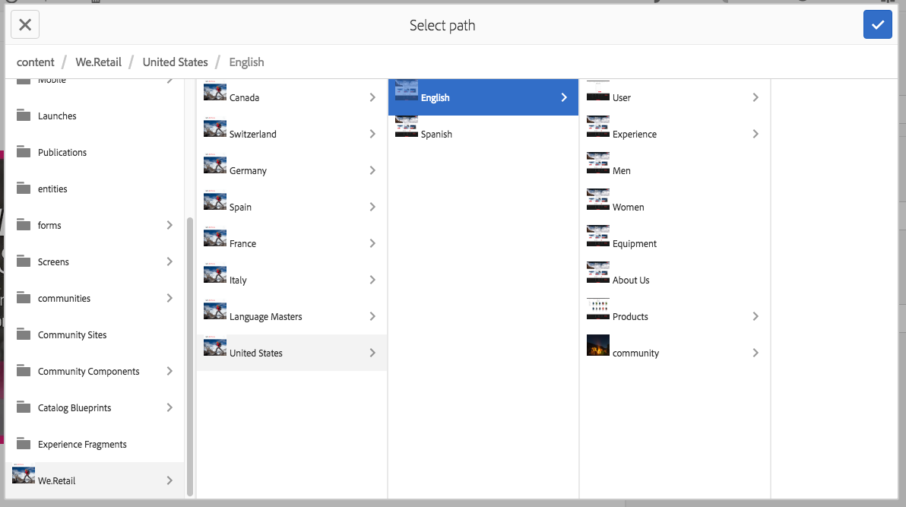
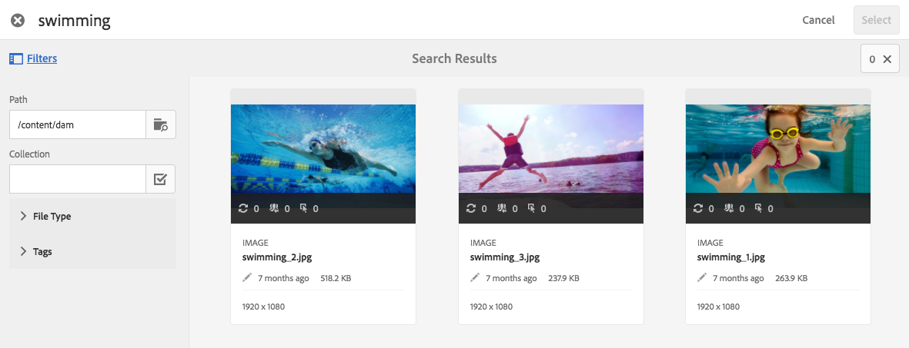

# Werken met kiezers in dynamische media {#working-with-selectors}

Wanneer u werkt met een interactieve afbeelding, interactieve video of carrouselbanner, selecteert u elementen en selecteert u sites en producten voor hotspots en afbeeldingen met hyperlinks waarnaar u wilt koppelen. Wanneer u werkt met Afbeeldingssets, Draaisets en Multimediasets, selecteert u ook elementen met de Asset Selector.

In dit onderwerp wordt beschreven hoe u de kiezers Product, Site en Asset kunt gebruiken, inclusief de mogelijkheid om te bladeren, te filteren en te sorteren binnen de kiezers.

U opent de kiezers door carrouselsets te maken, hotspots en afbeeldingen met hyperlinks toe te voegen en interactieve video&#39;s en afbeeldingen te maken.

In deze Carousel Banner gebruikt u bijvoorbeeld de productkiezer als u een hotspot of afbeelding met hyperlinks koppelt aan een Quickview-pagina. gebruik de sitekiezer als u een hotspot of afbeelding met hyperlink koppelt; Gebruik de kiezer voor middelen wanneer u een nieuwe dia maakt.

Wanneer u selecteert (in plaats van handmatig in te voeren) waar hotspots of afbeeldingen met hyperlinks naartoe gaan, gebruikt u de kiezer. De sitekiezer werkt alleen als u een klant van AEM-sites bent. Voor de productkiezer is ook AEM Commerce vereist.

## Producten selecteren in dynamische media {#selecting-products}

Gebruik de productkiezer om een product te kiezen wanneer u een hotspot of afbeelding met hyperlinks wilt gebruiken om een snelle weergave van een specifiek product in uw productcatalogus te maken.

1. Navigeer naar de carrouselset, de interactieve afbeelding of de interactieve video en tik op het tabblad **[!UICONTROL Handelingen]** (alleen beschikbaar als u een hotspot of afbeelding met hyperlinks hebt gedefinieerd).

   De productkiezer bevindt zich in het gebied **[!UICONTROL-handelingstype** .

   

1. Tik op het pictogram **[!UICONTROL Productkiezer]** (vergrootglas) en navigeer naar een product in de catalogus.

   

   U kunt ook filteren op trefwoorden of tags door op **[!UICONTROL Filter]** te tikken en trefwoorden in te voeren of door tags of beide te selecteren.

   

   U kunt wijzigen waar AEM naar productgegevens bladert door op **[!UICONTROL Bladeren]** te tikken en naar een andere map te navigeren.

   

   Tik op **[!UICONTROL Sorteren]** op om te wijzigen of AEM op Nieuwste naar Oudste of op Nieuwste sorteert.

   

   Tik op **[!UICONTROL Weergave als]** u wilt wijzigen hoe u producten bekijkt - **[!UICONTROL Lijstweergave]** of **[!UICONTROL Kaartweergave]**.

   

1. Nadat het product is geselecteerd, worden in het veld de miniatuur en de naam van het product weergegeven.

   

1. In de modus **[!UICONTROL Voorvertoning]** kunt u op de hotspot of de afbeelding met hyperlinks tikken en zien hoe de Snelle weergave eruitziet.

   

## Sites selecteren in dynamische media {#selecting-sites}

Gebruik de sitekiezer om een webpagina te kiezen als u een hotspot of afbeeldingskaart wilt koppelen aan een webpagina die wordt beheerd binnen AEM-sites.

1. Navigeer naar de carrouselset, de interactieve afbeelding of de interactieve video en tik op het tabblad **[!UICONTROL Handelingen]** (alleen beschikbaar als u een hotspot of afbeelding met hyperlinks hebt gedefinieerd).

   De Sitekiezer bevindt zich in het gebied **[!UICONTROL Type]** handeling.

   

1. Tik op het pictogram **[!UICONTROL Sitekiezer]** (map met vergrootglas) en navigeer naar een pagina in uw AEM-sites waarnaar u de hotspot of afbeelding met hyperlinks wilt koppelen.

   

1. Nadat de site is geselecteerd, wordt het pad in het veld weergegeven.

   

1. Als u in de modus **[!UICONTROL Voorvertoning]** op de hotspot of de afbeelding met hyperlinks tikt, navigeert u naar de door u opgegeven AEM-sitepagina.

## Elementen selecteren in dynamische media {#selecting-assets}

Gebruik deze kiezer om afbeeldingen te kiezen voor gebruik in een carrouselbanner, een interactieve video, afbeeldingssets, gemengde mediasets en centrifugesets. In interactieve video is de elementenkiezer beschikbaar wanneer u op Elementen **[!UICONTROL selecteren op het tabblad]** Inhoud **** tikt. In Carousel-sets is de elementenkiezer beschikbaar wanneer u een nieuwe dia maakt. In de Reeksen van het Beeld, Gemengde Plaatsen van Media, en de Reeksen van de Draaien, is de activa selecteur beschikbaar wanneer u een nieuwe Reeks van het Beeld, GemengdeReeks, of Reeks van de Draai creeert.

Zie ook [Asset Picker](/help/assets/search-assets.md#assetselector) voor meer informatie.

1. Navigeer naar de Carousel-set en maak een nieuwe dia. Of navigeer naar Interactieve video, ga naar het tabblad **[!UICONTROL Inhoud]** en selecteer elementen. U kunt ook een gemengde mediaset, Afbeeldingsset of Spin-set maken.
1. Tik op het pictogram **[!UICONTROL Asset Selector]** (map met vergrootglas) en navigeer naar een element.

   

   U kunt ook filteren op trefwoorden of tags door op **[!UICONTROL Filter]** te tikken en trefwoorden in te voeren of criteria toe te voegen, of door beide in te voeren.

   

   U kunt wijzigen waar AEM naar elementen bladert door naar een andere map in het veld **[!UICONTROL Pad]** te navigeren.

   Tik op **[!UICONTROL Verzameling]** om alleen te zoeken naar elementen in verzamelingen.

   

   Tik op **[!UICONTROL Weergave als]** u wilt wijzigen hoe producten worden weergegeven - **[!UICONTROL Lijstweergave]**, **[!UICONTROL Kolomweergave]** of **[!UICONTROL Kaartweergave]**.

   

1. Tik op het vinkje om het element te selecteren. Het element wordt weergegeven.

   —>
