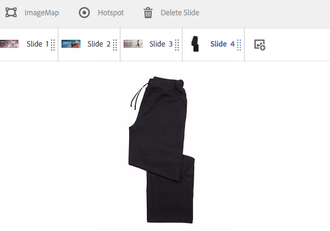

# Werken met kiezers in Dynamic Media {#working-with-selectors}

Wanneer u werkt met een interactieve afbeelding, interactieve video of carrouselbanner, selecteert u elementen en selecteert u sites en producten voor hotspots en afbeeldingen met hyperlinks waarnaar u wilt koppelen. Wanneer u werkt met Afbeeldingssets, Draaisets en Multimediasets, selecteert u ook elementen met de Asset Selector.

In dit onderwerp wordt beschreven hoe u de kiezers Product, Site en Asset kunt gebruiken, inclusief de mogelijkheid om te bladeren, te filteren en te sorteren binnen de kiezers.

U opent de kiezers door carrouselsets te maken, hotspots en afbeeldingen met hyperlinks toe te voegen en interactieve video's en afbeeldingen te maken.

In deze Carousel Banner gebruikt u bijvoorbeeld de productkiezer als u een hotspot of afbeelding met hyperlinks koppelt aan een Quickview-pagina. Gebruik de sitekiezer als u een hotspot of afbeelding met hyperlink koppelt. Gebruik de functie Asset Selector wanneer u een dia maakt.

Wanneer u selecteert (in plaats van handmatig in te voeren) waar hotspots of afbeeldingen met hyperlinks naartoe gaan, gebruikt u de kiezer. De site-kiezer werkt alleen als u een [!DNL Adobe Experience Manager Sites] klant. De productkiezer heeft ook [!DNL Experience Manager Commerce].

## Producten selecteren in Dynamic Media {#selecting-products}

Gebruik de productkiezer om een product te kiezen wanneer u een hotspot of afbeelding met hyperlinks wilt gebruiken om een snelle weergave van een specifiek product in uw productcatalogus te maken.

1. Navigeer naar de Carousel-set, de interactieve afbeelding of de interactieve video en selecteer de optie **[!UICONTROL Actions]** (alleen beschikbaar als u een hotspot of afbeelding met hyperlinks hebt gedefinieerd).

   De productkiezer bevindt zich in de **[!UICONTROL Action Type]** gebied.

   

1. Selecteer de **[!UICONTROL Product Selector]** (vergrootglas) en navigeer naar een product in de catalogus.

   

   U kunt filteren op trefwoord of tag door te tikken **[!UICONTROL Filter]** en het invoeren van trefwoorden, of het selecteren van tags, of beide.

   

   U kunt wijzigen waar [!DNL Experience Manager] bladeren naar productgegevens door te tikken **[!UICONTROL Browse]** en naar een andere map te navigeren.

   

   Selecteren **[!UICONTROL Sort by]** om te wijzigen of [!DNL Experience Manager] sorteert op nieuwste naar oudste of oudste naar nieuwste.

   

   Selecteren **[!UICONTROL View as]** om te wijzigen hoe producten worden weergegeven - ofwel **[!UICONTROL List View]** of **[!UICONTROL Card View]**.

   

1. Nadat het product is geselecteerd, worden in het veld de miniatuur en de naam van het product weergegeven.

   

1. Wanneer in **[!UICONTROL Preview]** kunt u de hotspot of de afbeelding met hyperlinks selecteren en zien hoe de Snelle weergave eruitziet.

   

## Sites selecteren in Dynamic Media {#selecting-sites}

Met de sitekiezer kunt u een webpagina kiezen als u een hotspot of afbeeldingskaart wilt koppelen aan een webpagina die wordt beheerd binnen [!DNL Experience Manager] sites.

1. Navigeer naar de Carousel-set, de interactieve afbeelding of de interactieve video en selecteer de optie **[!UICONTROL Actions]** (alleen beschikbaar als u een hotspot of afbeelding met hyperlinks hebt gedefinieerd).

   De sitekiezer bevindt zich in het gebied **[!UICONTROL Action Type]**.

   

1. Selecteer de **[!UICONTROL Site Selector]** pictogram (map met vergrootglas) en navigeer naar een pagina in uw [!DNL Experience Manager] sites waaraan u de hotspot of afbeelding met hyperlinks wilt koppelen.

   

1. Nadat de site is geselecteerd, wordt het pad in het veld weergegeven.

   

1. Wanneer in **[!UICONTROL Preview]** als u de hotspot of afbeelding met hyperlinks selecteert, navigeert u naar de [!DNL Experience Manager] door u opgegeven sitepagina.

## Elementen selecteren in Dynamic Media {#selecting-assets}

Gebruik deze kiezer om afbeeldingen te kiezen voor gebruik in een carrouselbanner, een interactieve video, afbeeldingssets, gemengde mediasets en centrifugesets. In interactieve video is de elementenkiezer beschikbaar wanneer u **[!UICONTROL Select Assets]** in de **[!UICONTROL Content]** tab. In Carousel-sets is de elementenkiezer beschikbaar wanneer u een dia maakt. In de Reeksen van het Beeld, Gemengde Plaatsen van Media, en de Reeksen van de Rotatie, is de activaselecteur beschikbaar wanneer u een Reeks van het Beeld, Gemengde Geplaatste Media, of Reeks van de Rotatie creeert.

Zie ook [Asset Picker](/help/assets/search-assets.md#asset-selector) voor meer informatie .

1. Navigeer naar de Carousel-set en maak een dia. Of navigeer naar de interactieve video en ga naar de **[!UICONTROL Content]** selecteert u vervolgens elementen. U kunt ook een gemengde mediaset, Afbeeldingsset of Spin-set maken.
1. Selecteer de **[!UICONTROL Asset Selector]** (map met vergrootglas) en navigeer naar een element.

   

   Filteren op trefwoord of tag door erop te tikken **[!UICONTROL Filter]** en het invoeren van trefwoorden, of het toevoegen van criteria, of beide.

   

   U kunt wijzigen waar [!DNL Experience Manager] bladert naar elementen door naar een andere map in het dialoogvenster **[!UICONTROL Path]** veld.

   Selecteren **[!UICONTROL Collection]** alleen naar elementen in verzamelingen zoeken.

   

   Selecteren **[!UICONTROL View as]** om te wijzigen hoe producten worden weergegeven - ofwel **[!UICONTROL List View]**, **[!UICONTROL Column View]**, of **[!UICONTROL Card View]**.

   

1. Selecteer het vinkje om het element te selecteren. Het element wordt weergegeven.

   
—>
