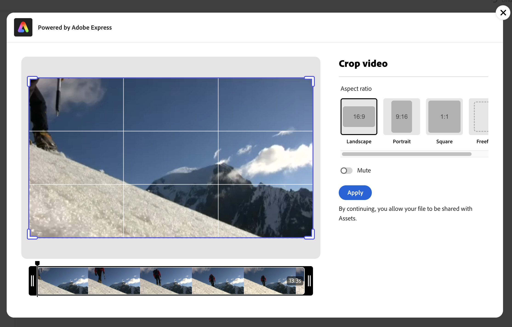
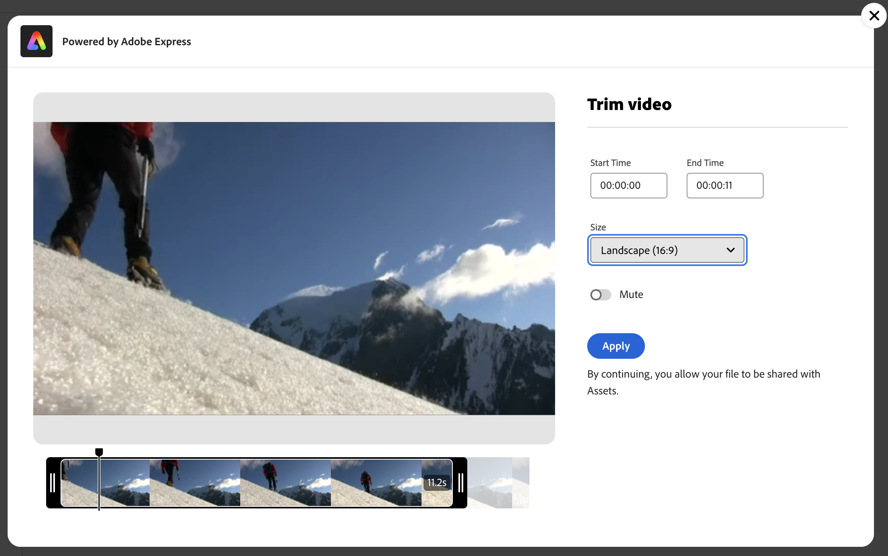

# Video&#39;s bewerken in [!DNL Assets view] {#edit-videos}

Assets-gebruikers kunnen gemakkelijk variaties in video-inhoud maken met de ingesloten snelle handelingen voor video in [!DNL Adobe Express] . Snelle acties in [!DNL Assets view] , aangedreven door [!DNL Adobe Express] , bieden gebruikersvriendelijke opties voor het bewerken van video&#39;s, zoals het uitsnijden van video&#39;s, het vergroten of verkleinen van video&#39;s, het bijsnijden van video en het omzetten van video&#39;s naar GIF.

Als u een video wilt bewerken, gaat u naar de details van de video en klikt u op [!UICONTROL Edit Video] . Alternatief, selecteer de activa en klik details dan klik  pictogram beschikbaar in de juiste ruit. Nadat u een video hebt bewerkt, kunt u de nieuwe video opslaan als een nieuwe versie of als een nieuw element.

## Vereisten {#prerequisites}

Geeft toegang tot [!DNL Adobe Express] en ten minste één omgeving in AEM Assets. De omgeving kan een van de opslagruimten binnen [!DNL Assets as a Cloud Service] of [!DNL Assets view] zijn.

## Video&#39;s bewerken met Adobe Express {#edit-video-using-express}

U kunt een video eenvoudig transformeren tot een perfecte grootte en richting met ingesloten snelle handelingen van [!DNL Adobe Express] .

### Video over uitsnijden {#crop-video-using-express}

U kunt ongewenste onderdelen uit de video verwijderen met ingesloten snelle handelingen van het type [!DNL Adobe Express] . Voer hiertoe de onderstaande stappen uit:

1. Selecteer een video en klik op **[!UICONTROL Edit]** .
2. Klik op **[!UICONTROL Crop Video]** in de snelhandelingen die beschikbaar zijn in het linkerdeelvenster.
3. Sleep de grepen op de hoeken van de video om het gewenste uitsnijden te maken of kies naar wens een van de bestaande schermformaten.
4. U kunt ervoor kiezen de video te dempen of het dempen ongedaan te maken.
5. Klik op **[!UICONTROL Apply]**.
   

   De bijgesneden video kan worden gedownload. U kunt het bewerkte element opslaan als een nieuwe versie van hetzelfde element of het opslaan als een nieuw element. 

### Formaat video wijzigen {#resize-video-using-express}

De uiteindelijke video-inhoud in de DAM moet vaak worden vergroot of verkleind voor distributie naar specifieke kanalen. Met [!DNL Assets view] kunt u de grootte van video eenvoudig aanpassen aan de afmetingen die worden vereist door algemene sociale kanalen. U kunt de grootte ook aanpassen aan aangepaste resoluties. Voer de onderstaande stappen uit om het formaat van de video te wijzigen met [!DNL Assets view] :

1. Selecteer een video en klik op **[!UICONTROL Edit]** .
2. Klik op **[!UICONTROL Resize Video]** in de snelhandelingen die beschikbaar zijn in het linkerdeelvenster.
3. Selecteer de juiste afmetingen in de vervolgkeuzelijst voor sociale media onder **[!UICONTROL Resize for the]** . U kunt ook de grepen op de hoeken van de video slepen om de gewenste uitsnijding te maken.
4. Schaal de video, indien nodig, gebruikend het **[!UICONTROL Video Scale]** gebied.
5. U kunt ervoor kiezen de video te dempen of het dempen ongedaan te maken.
6. Klik op **[!UICONTROL Apply]** om de wijzigingen toe te passen.
   

Uw vergroot/verkleind video kan worden gedownload. U kunt het bewerkte element opslaan als een nieuwe versie van hetzelfde element of het opslaan als een nieuw element.

### Video bijsnijden {#trim-video-using-express}

Als u een clip van een grotere video moet gebruiken, kunt u de functie **[!UICONTROL Trim Video]** gebruiken om een sectie van de video te selecteren en bij te snijden. Voer de onderstaande stappen uit:

1. Selecteer een video en klik op **[!UICONTROL Edit]** .
2. Klik op **[!UICONTROL Trim Video]** in de snelhandelingen die beschikbaar zijn in het linkerdeelvenster.
3. Geef de begin- en eindtijd van de video op om een bepaald gedeelte ervan bij te snijden. U kunt ook de grepen op de hoeken van de video slepen om de gewenste bijsnijding te maken.
4. Selecteer de juiste afmetingen in de vervolgkeuzelijst **[!UICONTROL Size]** .
5. U kunt ervoor kiezen de video te dempen of het dempen ongedaan te maken.
6. Klik op **[!UICONTROL Apply]** om de wijzigingen toe te passen.
   

Uw bijgesneden video kan worden gedownload. U kunt het bewerkte element opslaan als een nieuwe versie van hetzelfde element of het opslaan als een nieuw element.

### Video converteren naar GIF {#convert-mp4-to-gif-using-express}

Met Adobe Express kunt u een MP4-video snel omzetten in een GIF-indeling. Voer de volgende stappen uit:

1. Selecteer een video en klik op **[!UICONTROL Edit]** .
2. Klik op **[!UICONTROL Convert to GIF]** in de snelhandelingen die beschikbaar zijn in het linkerdeelvenster.
3. Selecteer de juiste bestandsgrootte op basis van de gewenste kwaliteit. Kies bovendien de richting Liggend, Staand of Vierkant.
4. Sleep de grepen op de hoeken van de video om de gewenste uitsnijding te maken.
5. Klik op **[!UICONTROL Apply]**.

   

Uw video is beschikbaar in GIF-indeling en kan worden gedownload. U kunt het bewerkte element opslaan als een nieuwe versie van hetzelfde element of het opslaan als een nieuw element.

## Beperkingen {#limitations-video-adobe-express}

* Alleen video&#39;s in de MP4-indeling worden ondersteund voor bewerking.

* De maximale ondersteunde grootte van het bronbestand is 1 GB.

* Ondersteunde video&#39;s zijn groter dan 46 pixels en kleiner dan 3840 pixels aan elke zijde.

* De ondersteunde webbrowsers zijn Google Chrome, Firefox, Safari en Edge.

* De functionaliteit kan niet worden geopend in een incognitomodus van een webbrowser.

### Volgende stappen {#next-steps}

* Feedback geven op het product met de optie [!UICONTROL Feedback] die beschikbaar is in de gebruikersinterface van de Assets-weergave.

* Verstrek documentatie terugkoppelt gebruikend [!UICONTROL Edit this page]  of [!UICONTROL Log an issue]  beschikbaar op juiste sidebar.

* De Zorg van de Klant van het contact [&#128279;](https://experienceleague.adobe.com/?support-solution=General#support).

>[!MORELIKETHIS]
>
>* [ geeft beelden in de mening van Assets uit ](edit-images-assets-view.md)
>* [ Voorproef van activa ](navigate-assets-view.md)
