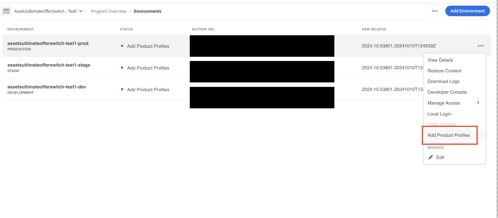

# [!DNL Assets] as a Cloud Service Ultimate inschakelen {#enable-assets-cloud-service-ultimate}

| [ Beste praktijken van het Onderzoek ](/help/assets/search-best-practices.md) | [ Beste praktijken van Meta-gegevens ](/help/assets/metadata-best-practices.md) | [ Content Hub ](/help/assets/product-overview.md) | [ Dynamic Media met mogelijkheden OpenAPI ](/help/assets/dynamic-media-open-apis-overview.md) | [ de ontwikkelaarsdocumentatie van AEM Assets ](https://developer.adobe.com/experience-cloud/experience-manager-apis/) |
| ------------- | --------------------------- |---------|----|-----|

Assets as a Cloud Service Ultimate stelt u in staat verschillende belangrijke DAM-mogelijkheden uit te voeren, zoals assetbeheer en bibliotheekservices, beveiliging en rechtenbeheer, Creative- en Experience Cloud-verbindingen, uitbreidbaarheid van de gebruikersinterface, API-gestuurde automatisering, integraties met Adobe- en niet-Adobe-toepassingen, aangepaste code-implementatie en nog veel meer. Zie [ as a Cloud Service Ultimate Overzicht van Activa ](/help/assets/assets-ultimate-overview.md) voor de volledige lijst.

## Assets Ultimate inschakelen {#enable-assets-ultimate}

Nieuwe Assets as a Cloud Service klanten moeten Assets Ultimate eerst inschakelen door een nieuw programma te maken met Cloud Manager.

Voer de volgende stappen uit:

1. Meld u aan bij Cloud Manager als systeembeheerder. Zorg ervoor dat u de juiste organisatie selecteert terwijl u zich aanmeldt.

   >[!NOTE]
   >
   >Zorg ervoor dat u aan het juiste Cloud Manager-productprofiel wordt toegevoegd om een nieuw programma toe te voegen. Voor meer informatie, zie [ Rol Gebaseerde Toestemmingen in de Manager van de Wolk ](/help/onboarding/cloud-manager-introduction.md#role-based-permissions).

1. [ creeer een nieuw programma ](/help/journey-onboarding/create-program.md) en [ voeg milieu&#39;s ](/help/journey-onboarding//create-environments.md) aan het toe.

   Selecteer **[!UICONTROL Assets Ultimate]** op het tabblad **[!UICONTROL Solutions & Add-ons]** tijdens het maken van het nieuwe programma. U kunt **[!UICONTROL Assets Ultimate]** ook uitbreiden en selecteren **[!UICONTROL Content Hub]** om [ de Hub van de Inhoud ](/help/assets/product-overview.md) voor activadistributie toe te laten.

   

1. Klik op **[!UICONTROL Create]** om het programma te maken. Assets Ultimate is nu ingeschakeld voor Experience Manager Assets as a Cloud Service.

De systeembeheerder is automatisch gemachtigd als AEM beheerder op Assets Ultimate en ontvangt een e-mail om naar de Admin Console te navigeren om de beschikbare productprofielen te beheren.

Uw AEM as a Cloud Service-exemplaar op Admin Console bestaat uit de volgende productprofielen:

* AEM

* AEM

* [AEM Assets Collaborator-gebruikers](#onboard-collaborator-users)

* [AEM Assets Power Users](#onboard-power-users)

  

Als u Content Hub for Assets as a Cloud Service hebt ingeschakeld, wordt een nieuwe instantie gemaakt in AEM Assets as a Cloud Service on Admin Console met `delivery` als achtervoegsel:

>[!NOTE]
>
>Als u Content Hub vóór 14 augustus 2024 hebt ingericht, wordt de nieuwe instantie gemaakt met `contenthub` als achtervoegsel.

De instantienaam voor Content Hub bevat geen `author` of `publish` .

Klik op de instantienaam om het `AEM Assets Limited Users` Content Hub-productprofiel te bekijken.

U kunt gebruikers of gebruikersgroepen aan dit productprofiel toevoegen om hen toegang tot Content Hub te verlenen.

>[!NOTE]
>
>Als u Content Hub vóór 14 augustus 2024 hebt ingericht, wordt het Content Hub-productprofiel `contenthub` vermeld na `Limited Users` in plaats van `delivery` .

## Assets Ultimate inschakelen voor bestaande klanten {#enable-assets-ultimate-existing-customers}

Bestaande Assets as a Cloud Service klanten kunnen een upgrade uitvoeren naar Assets Ultimate door twee eenvoudige stappen uit te voeren. U kunt naar het as a Cloud Service programma van Assets in Cloud Manager navigeren en verbeteringsstatus op de kaart zien van het Programma die op de beschikbaarheid van Assets Ultimate credits wordt gebaseerd. Als er voldoende credits beschikbaar zijn voor upgrade naar Assets Ultimate, kunt u de status `Assets license upgrade required` zien, zoals weergegeven in de volgende afbeelding:

Als een bestaande klant een nieuwe licentie aanschaft voor Assets Ultimate, wordt de upgrademoestand weergegeven als `Assets license upgrade available` .

### Vereisten voor upgrade {#prerequisites-assets-upgrade}

Alle omgevingen moeten worden geüpgraded naar de nieuwste AEM as a Cloud Service-releaseversie of minimaal een `2024.10.18175` releaseversie. Als u niet aan de minimumvereisten voldoet, neemt u contact op met uw Adobe-vertegenwoordiger om over te schakelen naar de vereiste versie AEM.

### Upgrade naar Assets Ultimate {#upgrade-assets-ultimate}

Voer de volgende stappen uit:

1. Klik op de naam van het programma nadat u bent overgeschakeld naar de minimale vereisten voor de AEM versie. Een upgradekaart wordt net boven **[!UICONTROL Environments]** weergegeven, zoals in de volgende afbeelding wordt getoond:

   

1. Klik op **[!UICONTROL Add Product Profiles]**. Cloud Manager geeft opties weer om nieuwe productprofielen toe te voegen aan alle omgevingen die beschikbaar zijn in het programma of de afzonderlijke omgevingen.

   

1. Klik op **[!UICONTROL All Environments]** om de nieuwe productprofielen toe te voegen aan alle omgevingen in het programma of op **[!UICONTROL Individual Environments]** om de nieuwe productprofielen toe te voegen aan geselecteerde omgevingen.

   Als u op **[!UICONTROL Individual Environments]** klikt, wordt de lijst met alle omgevingen weergegeven die in het programma beschikbaar zijn.

1. Klik op het pictogram Meer opties voor een omgeving en selecteer **[!UICONTROL Add Product Profiles]** om de nieuwe productprofielen aan de geselecteerde omgeving toe te voegen.

   

   U kunt productprofielen ook aan geselecteerde omgevingen toevoegen door naar de sectie **[!UICONTROL Environments]** te navigeren, op het pictogram Meer opties voor een omgeving te klikken en **[!UICONTROL Add Product Profiles]** te selecteren.

   De status van de omgeving wordt weergegeven `Adding Product Profiles` terwijl de nieuwe productprofielen worden toegevoegd en vervolgens `Running` weergegeven wanneer het proces is voltooid.

   U moet productprofielen toevoegen aan alle omgevingen die in het programma beschikbaar zijn, afzonderlijk of in alle omgevingen tegelijk, voordat u de volgende stap uitvoert.

1. Klik op **[!UICONTROL Upgrade]**. De optie **[!UICONTROL Upgrade]** wordt alleen weergegeven wanneer u productprofielen toevoegt aan alle beschikbare omgevingen.

   

   Het upgradeproces is voltooid en u hebt uw Assets as a Cloud Service geüpgraded naar Assets Ultimate. De status van het programma wordt weergegeven `Assets Ultimate` .

   

Uw AEM als Cloud Service-instantie op Admin Console omvat nu de volgende productprofielen:

* AEM

* AEM

* [AEM Assets Collaborator-gebruikers](#onboard-collaborator-users)

* [AEM Assets Power Users](#onboard-power-users)

Als Content Hub ingeschakeld moet zijn, klikt u op het pictogram Meer opties (...) op de naam van het programma in Cloud Manager en selecteert u **[!UICONTROL Edit Program]** . Vouw **[!UICONTROL Assets Ultimate]** uit en klik op **[!UICONTROL Content Hub]** . Deze stap laat de Hub van de Inhoud voor Elementen Ultimate toe. Er wordt een nieuwe instantie gemaakt in AEM Assets as a Cloud Service Admin Console met `delivery` als achtervoegsel:

>[!NOTE]
>
>Als u Content Hub vóór 14 augustus 2024 hebt ingericht, wordt de nieuwe instantie gemaakt met `contenthub` als achtervoegsel.

De instantienaam voor Content Hub bevat geen `author` of `publish` .

Klik op de instantienaam om het `AEM Assets Limited Users` Content Hub-productprofiel te bekijken.

U kunt beginnen gebruikers of gebruikersgroepen aan dit productprofiel toe te voegen om hen toegang tot de Hub van de Inhoud te verlenen.

>[!NOTE]
>
>Als u vóór 14 augustus 2024 de Content Hub hebt ingericht, heeft het profiel van de Content Hub product `contenthub` vermeld na `Limited Users` in plaats van `delivery` .

## Onboargebruikers van AEM Assets Collaborator {#onboard-collaborator-users}

AEM Assets Collaborator-gebruikers kunnen werken met assets van Experience Manager via integraties van assets die beschikbaar zijn voor je organisatie in andere producten van de Adobe en applicaties die geen Adobe zijn, assets maken en bewerken met ingebouwde Adobe Express en Firefly die gebruik maken van professioneel ontworpen sjablonen, merkpakketten, Adobe Stock-assets, enzovoort, en goedgekeurde assets van je organisatie benaderen en benutten via AEM Assets Content Hub Portal.

Aan boord van Collaborator-gebruikers:

1. Open Experience Manager Assets-productprofielen door op de AEM as a Cloud Service-productnaam in de lijst met producten op de Admin Console te klikken.

1. Klik op de productieauteur-instantie voor AEM as a Cloud Service:
   

1. Klik op het gebruikersprofiel Deelnemers en klik op **[!UICONTROL Add users]** om gebruikers of gebruikersgroepen toe te voegen aan het productprofiel.
   

1. Klik op **[!UICONTROL Save]** om de wijzigingen op te slaan.

U kunt ook toegang krijgen tot de services die zijn toegewezen aan gebruikers van Medewerkers, zoals wordt weergegeven in de volgende afbeelding:

`Adobe Express` - en `AEM Assets Collaborator Users` -services zijn standaard ingeschakeld.

>[!NOTE]
>
>U kunt de schakeloptie in- en uitschakelen om de beschikbare services in of uit te schakelen. Hiervoor wordt echter aangeraden de standaardservices te gebruiken die zijn ingeschakeld voor de productprofielen.

## Ingebouwde AEM Assets Power-gebruikers {#onboard-power-users}

AEM Assets Power-gebruikers hebben toegang tot alle AEM Assets-mogelijkheden, waaronder het beheer van middelen, machtigingen, metagegevens en het algemene beheer en de automatisering rond digitale middelen, werken met middelen van Experience Manager via de integratie van Assets die beschikbaar is voor uw organisatie in andere toepassingen voor Adobe en niet-Adobe, maken en bewerken van middelen met behulp van ingebouwde Adobe Express en Firefly die gebruikmaken van professioneel ontworpen sjablonen, merkkits, Adobe Stock-middelen, enzovoort, en maken en gebruiken goedgekeurde middelen van uw organisatie via AEM Assets Portal via de Content Hub-portal.

Aan boord van stroomgebruikers:

1. Open Experience Manager Assets-productprofielen door op de AEM as a Cloud Service-productnaam in de lijst met producten op de Admin Console te klikken.

1. Klik op de productieauteur-instantie voor AEM as a Cloud Service:
   

1. Klik op het productprofiel voor Power-gebruikers en klik op **[!UICONTROL Add users]** om gebruikers of gebruikersgroepen toe te voegen aan het productprofiel.
   

1. Klik op **[!UICONTROL Save]** om de wijzigingen op te slaan.

U kunt ook toegang krijgen tot de services die zijn toegewezen aan Power-gebruikers en deze weergeven, zoals in de volgende afbeelding wordt getoond:

`Adobe Express` - en `AEM Assets Power Users` -services zijn standaard ingeschakeld.

>[!NOTE]
>
>U kunt de schakeloptie in- en uitschakelen om de beschikbare services in of uit te schakelen. Hiervoor wordt echter aangeraden de standaardservices te gebruiken die zijn ingeschakeld voor de productprofielen.
