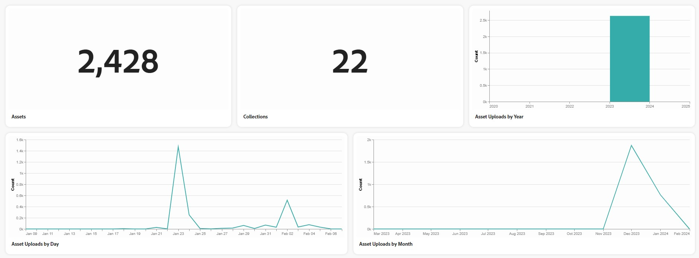

# Assets Insights in [!DNL Content Hub] {#assets-insights}

[!DNL Content Hub] biedt waardevolle inzichten in middelen, waarmee een veelvoorkomende uitdaging wordt aangepakt die marketingbelanghebbenden vaak ondervinden - statistieken over het gebruik van bedrijfsmiddelen die worden gebruikt in marketingcampagnes, kanalen en verschillende regio&#39;s. Door een duidelijk inzicht te krijgen in de prestaties en populariteit van de middelen, biedt het actioneerbare inzichten die essentieel zijn voor het verbeteren van de gebruikerservaring.

## Vereisten {#prerequisites}

[&#x200B; de gebruikers van Content Hub &#x200B;](deploy-content-hub.md#onboard-content-hub-users) kunnen acties uitvoeren die in dit artikel worden vermeld.

## Statistieken voor geüploade elementen weergeven{#view-statistics-for-uploaded-assets}

U kunt statistieken van de geüploade elementen en verzamelingen weergeven door naar het tabblad **[!UICONTROL Insights]** te navigeren. Volg de uploadgeschiedenis van uw activa met de jaarlijkse, maandelijkse, en dagelijkse activa uploadt mening.

<!-- You can track the upload history of your assets over the past 30 days or gain a more comprehensive view with data spanning the last 12 months. This feature enables you to evaluate the upload count of assets.  -->

<!-- Go to the **[!UICONTROL [!DNL Insights]]** tab.

2. Select the desired time frame to view the statistics; you can opt for either last 30 days or last 12 months.

Data for the selected time frame is displayed, including the upload count for the specified duration. -->

## Gedetailleerde statistische analyse weergeven{#view-detailed-statistical-analysis}

In Content Hub kunt u statistieken van het aantal elementen weergeven op basis van de bestandsindeling, campagnes, kanalen en regio&#39;s. U kunt waardevolle inzichten in activaverdeling verkrijgen die geïnformeerde besluitvorming en strategische planning vergemakkelijken.

De tabel bevat een gedetailleerd overzicht van de verschillende activa, met inbegrip van het aantal activa en het respectieve percentage binnen de repository. U kunt kolomgrootten aanpassen en elementen sorteren op naam, aantal en percentage van het element.

Het cirkeldiagram geeft visueel de totale telling van activa door dossierformaat weer, die een duidelijke illustratie van individuele activa en hun overeenkomstige percentages verstrekken.

U kunt ook het volgende weergeven:

* **Actieve Gebruikers door Dag en Maand**: Aantal actieve gebruikers door dag of door maand die gebruikend een lijngrafiek wordt vertegenwoordigd.
* **[!UICONTROL Assets by Campaigns]**: Aantal elementen en respectieve percentage op basis van campagnes.
* **[!UICONTROL Assets by Channels]**: Aantal activa en respectieve percentage op basis van gebruikte kanalen.
* **[!UICONTROL Assets by Regions]**: Aantal activa en respectieve percentage gebaseerd op gebieden van middelengebruik.

## Veelgestelde vragen {#faqs-assets-insights-content-hub}

### Wat hebben we Assets Insights nodig in AEM Assets Content Hub?

Assets Insights in AEM Assets Content Hub biedt waardevolle gegevens over statistieken over het gebruik van bedrijfsmiddelen in verschillende campagnes, kanalen en regio&#39;s, zodat marketingbelanghebbenden de prestaties en populariteit van bedrijfsmiddelen beter kunnen begrijpen voor een betere gebruikerservaring.

### Wie heeft toegang tot de functies die worden beschreven in Assets Insights?

Content Hub-gebruikers kunnen de handelingen uitvoeren en toegang krijgen tot de functies die worden vermeld in de sectie Assets Insights.

### Welke elementinzichten zijn beschikbaar op het tabblad Inzichten?

U kunt het aantal middelen in de bewaarplaats, het aantal inzamelingen bekijken, uploadt Assets door jaar, maand, of dag, actieve gebruikers door dag of maand, en activa classificatie gebaseerd op dossierformaten.

### Hoe kan ik statistieken bekijken voor geüploade activa in AEM Assets Content Hub?

U kunt statistieken voor geüploade activa en inzamelingen bekijken door aan het lusje van Inzichten te navigeren, waar u de uploadgeschiedenis door jaar, maand, of dag kunt volgen.

### Welke metriek kan ik met betrekking tot gebruikersactiviteit in Content Hub analyseren?

U kunt het aantal actieve gebruikers per dag of per maand analyseren, die visueel wordt vertegenwoordigd door een lijngrafiek te gebruiken.
