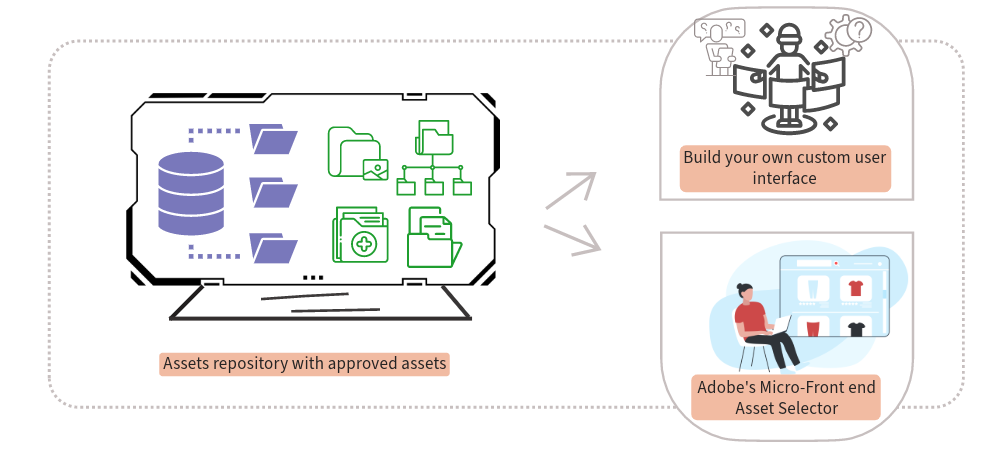

# AEM Assets integreren met downstreamtoepassingen {#integrate-dynamic-media-open-apis}

Alle [ goedgekeurde activa ](/help/assets/approve-assets.md) beschikbaar in de activa van Experience Manager bewaarplaats zijn beschikbaar voor levering aan stroomafwaartse toepassingen.

U kunt ofwel uw eigen aangepaste gebruikersinterface integreren met de Experience Manager Assets-opslagplaats met de zoek- en leverings-API&#39;s, ofwel Adobe Micro-Frontend Asset Selector gebruiken.

Met de API&#39;s kunt u de goedgekeurde middelen zoeken in de AEM Assets-opslagplaats en de middelen vervolgens via een bezorgings-URL leveren aan downstreamtoepassingen. Voor meer informatie, zie [ Onderzoek ](/help/assets/search-assets-api.md) en [ Levering ](/help/assets/deliver-assets-apis.md) APIs.

De Adobe Micro-Frontend Asset Selector biedt een gebruikersinterface die eenvoudig kan worden geïntegreerd met de [!DNL Experience Manager Assets as a Cloud Service] -opslagplaats, zodat u door goedgekeurde digitale middelen in de opslagplaats kunt bladeren of deze kunt zoeken en deze kunt gebruiken in uw ontwerpervaring. Voor meer informatie, zie [ Micro-Frontend de Selecteur van Activa ](/help/assets/overview-asset-selector.md).

>[!MORELIKETHIS]
>
>* [ integreer de Selector van Activa met diverse toepassingen ](/help/assets/integrate-asset-selector.md)
>* [ Eigenschappen van de Selecteur van Activa ](/help/assets/asset-selector-properties.md)
>* [ de aanpassing van de Selecteur van Activa ](/help/assets/asset-selector-customization.md)
