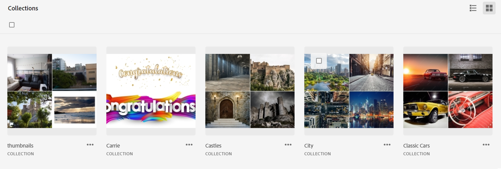

# Verzamelingen beheren {#manage-collections}

<table>
    <tr>
        <td>
            <i> Nieuwe </i> <a href="/help/assets/dynamic-media/dm-prime-ultimate.md"><b> Dynamische Media Prime en Ultimate </b></a>
        </td>
        <td>
            <i> Nieuwe </i> <a href="/help/assets/assets-ultimate-overview.md"><b> AEM Assets Ultimate </b></a>
        </td>
        <td>
            <i> Nieuwe </i> <a href="/help/assets/integrate-aem-assets-edge-delivery-services.md"><b> integratie van AEM Assets met Edge Delivery Services </b></a>
        </td>
        <td>
            <i> Nieuwe </i> <a href="/help/assets/aem-assets-view-ui-extensibility.md"><b> Uitbreidbaarheid UI </b></a>
        </td>
          <td>
            <i> Nieuw </i> <a href="/help/assets/dynamic-media/enable-dynamic-media-prime-and-ultimate.md"><b> laat Dynamische Media Prime en Ultimate </b></a> toe
        </td>
    </tr>
    <tr>
        <td>
            <a href="/help/assets/search-best-practices.md"><b> Beste praktijken van het Onderzoek </b></a>
        </td>
        <td>
            <a href="/help/assets/metadata-best-practices.md"><b> Beste praktijken van Meta-gegevens </b></a>
        </td>
        <td>
            <a href="/help/assets/product-overview.md"><b> Content Hub </b></a>
        </td>
        <td>
            <a href="/help/assets/dynamic-media-open-apis-overview.md"><b> Dynamische Media met mogelijkheden OpenAPI </b></a>
        </td>
        <td>
            <a href="https://developer.adobe.com/experience-cloud/experience-manager-apis/"><b> de ontwikkelaarsdocumentatie van AEM Assets </b></a>
        </td>
    </tr>
</table>

>[!CONTEXTUALHELP]
>id="assets_collections"
>title="Verzamelingen beheren"
>abstract="Een verzameling is een set elementen, mappen of andere verzamelingen in de weergave Assets. Gebruik verzamelingen om elementen tussen gebruikers te delen. In tegenstelling tot mappen kan een verzameling elementen van verschillende locaties bevatten. U kunt meerdere verzamelingen delen met een gebruiker. Elke verzameling bevat verwijzingen naar elementen. De referentiële integriteit van activa wordt gehandhaafd over inzamelingen."

Een verzameling is een set elementen, mappen of andere verzamelingen in de weergave Adobe Experience Manager Assets. Gebruik verzamelingen om elementen tussen gebruikers te delen.

In tegenstelling tot mappen kan een verzameling elementen van verschillende locaties bevatten.

<!--
You can share collections with various users that are assigned different levels of privileges, including viewing, editing, and so on.
-->

U kunt meerdere verzamelingen delen met een gebruiker. Elke verzameling bevat verwijzingen naar elementen. De referentiële integriteit van activa wordt gehandhaafd over inzamelingen.

U kunt de volgende taken uitvoeren om inzamelingen te beheren en te gebruiken:

* [Een verzameling maken](#create-collection)

* [Elementen toevoegen aan een verzameling](#add-assets-to-collection)

* [Elementen uit een verzameling verwijderen](#remove-assets-from-collection)

* [Een slimme verzameling maken](#create-smart-collection)

* [Een slimme verzameling bewerken](#edit-smart-collection)

* [Metagegevens van verzamelingen weergeven en bewerken](#view-edit-collection-metadata)

* [Koppelingen voor verzamelingen delen](#share-collection-links)

* [Een verzameling downloaden](#download-collection)

* [Een verzameling verwijderen](#delete-collection)

* [Rechten beheren voor een privéverzameling](#manage-permissions-to-a-private-collection)

## Een verzameling maken {#create-collection}

Een verzameling maken:

1. Klik op **[!UICONTROL Collections]** in de linkertrack en klik vervolgens op **[!UICONTROL Create Collection]** .

1. Geef een titel en een optionele beschrijving voor de verzameling op.

1. Selecteer als u een Privé inzameling of een Openbare inzameling moet tot stand brengen. Een openbare inzameling is beschikbaar voor het bekijken en het uitgeven aan alle gebruikers. Nochtans, is een Privéinzameling beschikbaar aan de schepper en de gebruikers met beheerdervoorrechten.

1. Klik op **[!UICONTROL Create]** om de verzameling te maken.

<!--
   
   for viewing and editing only to users with the appropriate [permissions](#manage-collection-access).

-->

## Elementen toevoegen aan een verzameling {#add-assets-to-collection}

Elementen toevoegen aan een verzameling:

1. Klik op **[!UICONTROL Assets]** in de linkertrack en selecteer de elementen die u aan een verzameling wilt toevoegen.

1. Klik op **[!UICONTROL Add to Collection]**.

1. Selecteer in het dialoogvenster [!UICONTROL Collections] de verzamelingen waaraan u de geselecteerde elementen wilt toevoegen.

1. Klik op **[!UICONTROL Add]** om het element aan de geselecteerde verzamelingen toe te voegen.

## Elementen uit een verzameling verwijderen {#remove-assets-from-collection}

Elementen uit een verzameling verwijderen:

1. Klik op **[!UICONTROL Collections]** in de linkertrack om de lijst met verzamelingen weer te geven.

1. Klik op de verzameling en selecteer de items die u uit de verzameling wilt verwijderen.

1. Klik op **[!UICONTROL Remove]**.

## Een slimme verzameling beheren {#manage-smart-collection}

Sla de zoekresultaten op als een slimme verzameling om de inhoud van de verzameling dynamisch bij te werken. Als er elementen zijn toegevoegd aan de Assets-weergaveopslagplaats die voldoen aan de zoekcriteria die zijn gedefinieerd tijdens het maken van de slimme verzameling, wordt de inhoud van de slimme verzameling automatisch bijgewerkt wanneer u een slimme verzameling opent.

### Een slimme verzameling maken {#create-smart-collection}

Een slimme verzameling maken:

1. Klik **[!UICONTROL Filter]** en [ bepalen de onderzoekscriteria ](search-assets-view.md#refine-search-results).

1. Klik op **[!UICONTROL Save as]** en selecteer vervolgens **[!UICONTROL Smart Collection]** .

   

1. Geef in het dialoogvenster [!UICONTROL Create Smart Collection] een titel en een beschrijving op voor de slimme verzameling.

1. Selecteer **[!UICONTROL Public Collection]** als u alle gebruikers toegang tot de verzameling wilt geven. Selecteer **[!UICONTROL Private Collection]** als u een beperkte groep gebruikers nodig hebt om toegang te krijgen tot de verzameling.

1. Klik op **[!UICONTROL Create]** om de slimme verzameling te maken.

### Een slimme verzameling bewerken {#edit-smart-collection}

Een slimme verzameling bewerken:

1. Klik op **[!UICONTROL Collections]** in de linkertrack en dubbelklik op de naam van de verzameling die u wilt bewerken.

1. Klik op **[!UICONTROL Edit Smart Collection]**.

1. Voor het [!UICONTROL Edit Smart Collection Filters] dialoogvakje, [ werk de onderzoekscriteria ](search-assets-view.md#refine-search-results) voor de Slimme Inzameling bij.

1. Klik op **[!UICONTROL Save]**.

<!--

## Manage access to a Private collection {#manage-collection-access}

The permission management for collections function in the same manner as folders in [!DNL Assets view]. Administrators can manage the access levels for collections available in the repository. As an administrator, you can create user groups and assign permissions to those groups to manage access levels. You can also delegate the permission management privileges to user groups at the collection-level.

For more information, see [Manage permissions for folders and collections](manage-permissions.md).

-->

<!--

## Search a collection {#search-collections}

Click **[!UICONTROL Collections]** in the left rail and use the Search box to specify a text as the criteria to search for a collection. [!DNL Assets view] uses the specified text to search collection names, metadata including tags defined for a collection and returns appropriate results.

>[!NOTE]
>
>Assets view performs search in collections available at the root level. It does not perform search in assets and folders available in collections.

-->

## Metagegevens van verzamelingen weergeven en bewerken {#view-edit-collection-metadata}

Metagegevens over verzamelingen bevatten gegevens over de verzameling, zoals titel en beschrijving.

Metagegevens van verzamelingen weergeven en bewerken:

1. Klik op **[!UICONTROL Collections]** in de linkertrack, selecteer een verzameling en klik op **[!UICONTROL Details]** .
1. De metagegevens van de verzameling weergeven met het tabblad **[!UICONTROL Basic]** .
1. Wijzig desgewenst de metagegevensvelden. U kunt de velden [!UICONTROL Title] en [!UICONTROL Description] wijzigen.

## Koppelingen voor verzamelingen delen {#share-collection-links}

Met [!DNL Assets view] kunt u een koppeling genereren en verzamelingen en elementen in verzamelingen delen met externe belanghebbenden die geen toegang hebben tot de [!DNL Assets view] -toepassing. U kunt een vervaldatum voor de verbinding bepalen en dan het delen met anderen gebruikend uw aangewezen communicatie methode zoals e-mail of overseinendiensten. Ontvangers van de koppeling kunnen een voorbeeld van de elementen bekijken en deze downloaden.

Voor meer informatie over hoe te om inzamelingsverbindingen met externe belanghebbenden te delen, zie [ verbindingen voor activa ](/help/assets/share-links-for-assets-view.md) delen.

## Een verzameling downloaden {#download-collection}

Een verzameling downloaden:

1. Klik op **[!UICONTROL Collections]** in de linkertrack.

1. Selecteer de verzameling die u wilt downloaden en klik op **[!UICONTROL Download]** .

1. Klik in het dialoogvenster [!UICONTROL Downloading Asset] op **[!UICONTROL OK]** .

De verzameling wordt als een ZIP-bestand gedownload op uw lokale computer.

## Een verzameling verwijderen {#delete-collection}

Een verzameling verwijderen:

1. Klik op **[!UICONTROL Collections]** in de linkertrack.

1. Selecteer de verzameling die u wilt verwijderen.

1. Klik op **[!UICONTROL Delete]**.

## Rechten voor een privéverzameling beheren{#manage-permissions-private-collection}

U kunt beheerders toestaan om [ toegangsniveaus ](https://experienceleague.adobe.com/en/docs/experience-manager-assets-essentials/help/get-started-admins/folder-access/manage-permissions) voor privé inzamelingen te beheren beschikbaar in de bewaarplaats. U kunt machtigingen zoals `Can View` en `Can Edit` toewijzen aan gebruikersgroepen of gebruikers. U kunt toestemmingsbeheervoorrechten aan gebruikersgroepen ook delegeren. De gebruikers die privé inzamelingen tot stand brengen zijn de eigenaars van die inzamelingen. Ze kunnen de handeling [!UICONTROL Manage Permissions] gebruiken om toegang te verlenen aan andere gebruikers. Bovendien kunnen beheerders machtigingen van de privéverzamelingen in de [!DNL Experience Manager] -opslagplaats weergeven en beheren.
<!--
>[!NOTE]
>
>Adobe does not recommend to assign permissions to users.
-->
Voor informatie over hoe te om de beschikbare toestemmingen aan gebruikersgroepen toe te wijzen, zie [ toestemmingen aan gebruikersgroepen ](https://experienceleague.adobe.com/en/docs/experience-manager-assets-essentials/help/get-started-admins/folder-access/manage-permissions) toevoegen.

Voor meer informatie over het werkschema van begin tot eind, zie [ toestemmingen ](https://experienceleague.adobe.com/en/docs/experience-manager-assets-essentials/help/get-started-admins/folder-access/manage-permissions) beheren.

## Volgende stappen {#next-steps}

* Feedback geven op het product met de optie [!UICONTROL Feedback] die beschikbaar is in de gebruikersinterface van de Assets-weergave

* Verstrek documentatie terugkoppelt gebruikend [!UICONTROL Edit this page]  of [!UICONTROL Log an issue]  beschikbaar op juiste sidebar

* De Zorg van de Klant van het contact [&#128279;](https://experienceleague.adobe.com/?support-solution=General#support)
