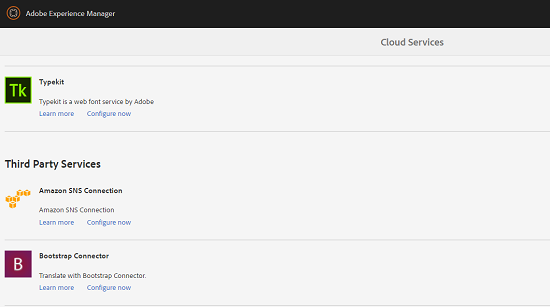
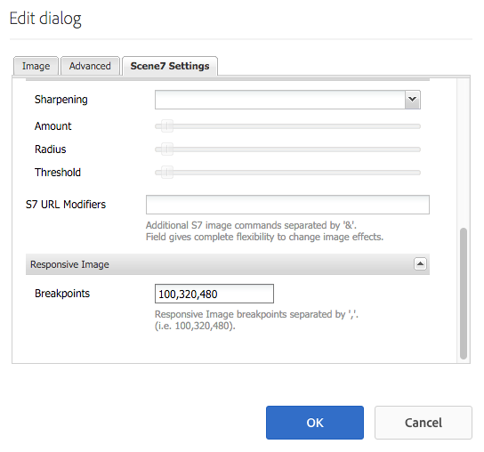
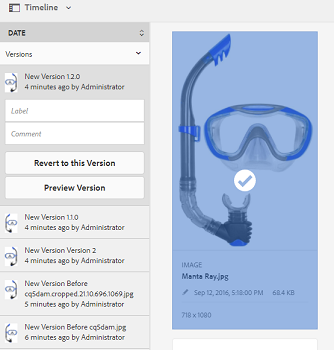
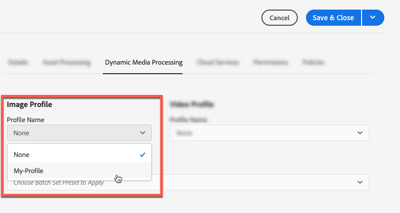

# Elementen beheren {#manage-assets}

In dit artikel wordt beschreven hoe u elementen beheert en bewerkt in Adobe Experience Manager (AEM)-middelen. Zie Elementen van [inhoudsfragmenten](content-fragments/content-fragments.md) voor het beheren van Content Fragments.

## Mappen maken {#creating-folders}

Wanneer u een verzameling elementen indeelt, bijvoorbeeld alle `Nature` afbeeldingen, kunt u mappen maken om ze bij elkaar te houden. U kunt mappen gebruiken om uw elementen te categoriseren en in te delen. Voor AEM-elementen hoeft u elementen niet in mappen te ordenen om beter te werken.

>[!NOTE]
>
>Het delen van een map met middelen van dit type `sling:OrderedFolder`wordt niet ondersteund bij het delen naar de marketingcloud. Als u een map wilt delen, selecteert u niet [!UICONTROL Besteld] wanneer u een map maakt.

1. Navigeer naar de plaats in de map met digitale elementen waar u een nieuwe map wilt maken. Klik in het menu op **[!UICONTROL Maken]**. Selecteer **[!UICONTROL Nieuwe map]**.
1. Geef in het veld **[!UICONTROL Titel]** een mapnaam op. Standaard gebruikt DAM de titel die u als mapnaam hebt opgegeven. Nadat de map is gemaakt, kunt u de standaardinstelling overschrijven en een andere mapnaam opgeven.
1. Klik op **[!UICONTROL Maken]**. De map wordt weergegeven in de map met digitale middelen.

De volgende tekens (lijst met door spaties gescheiden tekens) worden niet ondersteund:

* De naam van een elementbestand mag geen van de volgende tekens bevatten: `* / : [ \\ ] | # % { } ? &`
* De naam van een elementmap mag geen van de volgende tekens bevatten: `* / : [ \\ ] | # % { } ? \" . ^ ; + & \t`

## Elementen uploaden {#uploading-assets}

Zie Digitale elementen [toevoegen aan Experience Manager](add-assets.md)voor meer informatie.

## Elementen voorvertonen {#previewing-assets}

Voer de volgende stappen uit om een voorvertoning van een element weer te geven.

1. Navigeer in de gebruikersinterface Elementen naar de locatie van het element waarvan u een voorvertoning wilt weergeven.
1. Tik op het gewenste element om het te openen.

1. In de voorvertoningsmodus zijn zoomopties beschikbaar voor [ondersteunde afbeeldingstypen](/help/assets/file-format-support.md) (met interactieve bewerking).

   Tik/klik op een vergrootglas `+` (of tik/klik op het vergrootglas van het element) om in te zoomen op een element. Tik/klik om uit te zoomen. `-` Wanneer u inzoomt, kunt u elk gebied van de afbeelding nauwkeurig bekijken door te pannen. Met de zoompijl opnieuw instellen keert u terug naar de oorspronkelijke weergave.

   Tik op **[!UICONTROL Herstellen]** om de weergave te herstellen naar de oorspronkelijke grootte.

## Eigenschappen bewerken {#editing-properties}

1. Navigeer naar de locatie van het element waarvan u de metagegevens wilt bewerken.

1. Selecteer het element en tik op **[!UICONTROL Eigenschappen]** /klik op de werkbalk om de eigenschappen van het element weer te geven. U kunt ook de snelle actie **[!UICONTROL Eigenschappen]** kiezen op de elementenkaart.

   

1. Bewerk op de pagina [!UICONTROL Eigenschappen] de eigenschappen van de metagegevens onder verschillende tabbladen. Bewerk bijvoorbeeld onder het tabblad **[!UICONTROL Standaard]** de titel, beschrijving, enzovoort.

   >[!NOTE]
   >
   >De indeling van de pagina [!UICONTROL Eigenschappen] en de beschikbare metagegevenseigenschappen zijn afhankelijk van het onderliggende metagegevensschema. Zie [!UICONTROL Metagegevensschema&#39;s voor meer informatie over het wijzigen van de indeling van de pagina] Eigenschappen .

1. Als u een bepaalde datum/tijd voor activering van het element wilt plannen, gebruikt u de datumkiezer naast het veld **[!UICONTROL Op tijd]** .

   

1. Als u het element na een bepaalde duur wilt deactiveren, kiest u de datum/tijd van deactivering in de datumkiezer naast het veld **[!UICONTROL Uit-tijd]** . De deactiveringsdatum moet later zijn dan de activeringsdatum voor een element. Na de [!UICONTROL Off Time]zijn een middel en zijn vertoningen niet beschikbaar of via de Webinterface van Middelen of door HTTP API.

   

1. Selecteer een of meer tags in het veld **[!UICONTROL Codes]** . Als u een aangepaste tag wilt toevoegen, typt u de naam van de tag in het vak en drukt u op Enter. De nieuwe tag wordt opgeslagen in AEM.

   Op YouTube moeten labels publiceren en een koppeling naar YouTube hebben (als er een geschikte koppeling is gevonden).

   >[!NOTE]
   >
   >Als u tags wilt maken, moet u schrijfmachtigingen hebben op het `/content/cq:tags/default` pad in de CRX-opslagruimte.

1. Als u gebruiksstatistieken voor het element wilt weergeven, klikt of tikt u op het tabblad **[!UICONTROL Inzichten]** .

   De statistieken van het gebruik omvatten het volgende:

   * Aantal keer dat het element is weergegeven of gedownload
   * Kanalen/apparaten waardoor het middel werd gebruikt
   * Creatieve oplossingen waarbij het middel onlangs is gebruikt
   Zie [Asset Insights](assets-insights.md)voor meer informatie.

1. Tik/klik op **[!UICONTROL Opslaan en sluiten]**.

1. Navigeer naar de gebruikersinterface Elementen. De bewerkte eigenschappen van metagegevens, zoals titel, beschrijving en tags, worden weergegeven op de elementenkaart in de Kaart-weergave en onder de desbetreffende kolommen in de lijstweergave.

## Elementen kopiëren {#copying-assets}

Wanneer u een middel of een omslag kopieert, wordt het volledige middel of de omslag gekopieerd, samen met zijn inhoudsstructuur. Een gekopieerd middel of een omslag wordt gedupliceerd bij de doelplaats. Het element op de bronlocatie wordt niet gewijzigd.

Enkele kenmerken die uniek zijn voor een bepaalde kopie van een element, worden niet overgedragen. Enkele voorbeelden zijn:

* Relatief pad, bron-id, aanmaakdatum en -tijd en versies en versiegeschiedenis. Sommige van deze eigenschappen worden aangegeven door de eigenschappen `dam:relativePath`, `jcr:uuid`, `jcr:created`en `cq:name`.

* De aanmaaktijd en de paden waarnaar wordt verwezen, zijn uniek voor elk element en elke uitvoering ervan.

De andere eigenschappen en metagegevens blijven behouden. Er wordt geen gedeeltelijke kopie gemaakt wanneer een element wordt gekopieerd.

1. Selecteer een of meer elementen in de interface Elementen en tik op het pictogram **[!UICONTROL Kopiëren]** op de werkbalk. U kunt ook de snelle actie **[!UICONTROL Copy]**  selecteren via de elementenkaart.

   >[!NOTE]
   >
   >Als u de snelle handeling [!UICONTROL Kopiëren] gebruikt, kunt u slechts één element tegelijk kopiëren.

1. Navigeer naar de locatie waar u de elementen wilt kopiëren.

   >[!NOTE]
   >
   >Als u een element op dezelfde locatie kopieert, genereert AEM automatisch een variatie in de naam. Als u bijvoorbeeld een element met de naam kopieert `Square`, genereert AEM automatisch de titel voor de kopie als `Square1`titel.

1. Klik op het pictogram Middelen **[!UICONTROL plakken]** op de werkbalk. Elementen worden naar deze locatie gekopieerd.

   

   >[!NOTE]
   >
   >Het pictogram **[!UICONTROL Plakken]** is beschikbaar op de werkbalk totdat de plakbewerking is voltooid.

### Elementen verplaatsen of hernoemen {#moving-or-renaming-assets}

1. Navigeer naar de locatie van het element dat u wilt verplaatsen.

1. Selecteer het element en tik/klik op het pictogram **[!UICONTROL Move]**  op de werkbalk.

1. Voer een van de volgende handelingen uit in de wizard Elementen verplaatsen:

   * Geef de naam voor het element op nadat het is verplaatst. Tik vervolgens op **[!UICONTROL Volgende]** of klik op Volgende om door te gaan.

   * Tik/klik op **[!UICONTROL Annuleren]** om het proces te stoppen.
   >[!NOTE]
   >
   >* U kunt dezelfde naam opgeven voor het element als er geen element met die naam is op de nieuwe locatie. U moet echter een andere naam gebruiken als u het element verplaatst naar een locatie waar zich een element met dezelfde naam bevindt. Als u dezelfde naam gebruikt, genereert het systeem automatisch een variatie in de naam. Als uw element bijvoorbeeld de naam Vierkant heeft, genereert het systeem de naam Vierkant1 voor de kopie.
   >* Bij het wijzigen van de naam is witruimte niet toegestaan in de bestandsnaam.

1. Voer een van de volgende handelingen uit in het dialoogvenster Doel **** selecteren:

   * Navigeer naar de nieuwe locatie voor de elementen en tik op **[!UICONTROL Volgende]** of klik op Volgende om door te gaan.

   * Tik/klik op **[!UICONTROL Vorige]** om terug te keren naar het scherm **[!UICONTROL Naam wijzigen]** .

1. Als de elementen die worden verplaatst, verwijzen naar pagina&#39;s, elementen of verzamelingen, wordt het tabblad Verwijzingen **** aanpassen weergegeven naast het tabblad **[!UICONTROL Doel]** selecteren.

   Voer een van de volgende handelingen uit in het scherm **[!UICONTROL Verwijzingen]** aanpassen:

   * Geef op welke referenties u wilt aanpassen op basis van de nieuwe details en tik op **[!UICONTROL Verplaatsen]** of klik op Verplaatsen om door te gaan.

   * In de kolom **[!UICONTROL Aanpassen]** selecteert of deselecteert u verwijzingen naar de elementen.
   * Tik/klik op **[!UICONTROL Vorige]** om terug te keren naar het scherm **[!UICONTROL Doel]** selecteren.

   * Tik/klik op **[!UICONTROL Annuleren]** om de verplaatsingsbewerking te stoppen.
   Als u verwijzingen niet bijwerkt, blijven ze naar het vorige pad van het element wijzen. Als u de referenties aanpast, worden deze bijgewerkt naar het nieuwe middelenpad.

### Uitvoeringen beheren {#managing-renditions}

1. U kunt uitvoeringen voor een element toevoegen of verwijderen, behalve voor het origineel. Navigeer naar de locatie van het element waaraan u uitvoeringen wilt toevoegen of verwijderen.

1. Tik/klik op het element om de elementpagina te openen.

   

1. Tik/klik op het pictogram GlobalNav en selecteer **[!UICONTROL Uitvoeringen]** in de lijst.

   

1. Geef in het deelvenster **[!UICONTROL Uitvoeringen]** de lijst weer met uitvoeringen die voor het element zijn gegenereerd.

   

   >[!NOTE]
   >
   >In AEM Assets wordt standaard de oorspronkelijke uitvoering van het element niet weergegeven in de voorvertoningsmodus. Als beheerder kunt u overlays gebruiken om AEM-elementen te configureren voor de weergave van originele uitvoeringen in de voorvertoningsmodus.

1. Selecteer een vertoning om de vertoning weer te geven of te verwijderen.

   **Een vertoning verwijderen**

   Selecteer een vertoning in het deelvenster **[!UICONTROL Uitvoeringen]** en tik op het pictogram Vertoning **** verwijderen of klik op de werkbalk.

   

   **Een nieuwe uitvoering uploaden**

   Navigeer naar de pagina met elementdetails voor het element en tik op het pictogram Vertoning **** toevoegen op de werkbalk om een nieuwe uitvoering voor het element te uploaden.

   

   >[!NOTE]
   >
   >Als u een vertoning selecteert in het deelvenster **[!UICONTROL Uitvoeringen]** , verandert de werkbalk de context en worden alleen die acties weergegeven die relevant zijn voor de uitvoering. Er worden geen opties weergegeven, zoals het pictogram Vertoning uploaden. Navigeer naar de detailspagina voor het element om deze opties in de werkbalk weer te geven.

   U kunt de afmetingen configureren voor de vertoning die u wilt weergeven op de detailpagina van een afbeelding of video-element. Op basis van de afmetingen die u opgeeft, wordt de vertoning in AEM-elementen weergegeven met de exacte of dichtstbijzijnde afmetingen.

   Als u vertoningsafmetingen van een afbeelding op het detailniveau van de elementen wilt configureren, bedekt u het `renditionpicker` knooppunt (`libs/dam/gui/content/assets/assetpage/jcr:content/body/content/content/items/assetdetail/items/col1/items/assetview/renditionpicker`) en configureert u de waarde van de eigenschap width. Configureer de **[!UICONTROL grootte van de eigenschap (lang) in kB]** in plaats van de breedte om de uitvoering op de pagina met de details van de elementen aan te passen op basis van de afbeeldingsgrootte. Voor aanpassing op basis van grootte `preferOriginal` wijst de eigenschap de voorkeur toe aan het origineel als de grootte van de overeenkomende vertoning groter is dan het origineel.

   Op dezelfde manier kunt u de afbeelding van de pagina Annotatie aanpassen door deze te bedekken `libs/dam/gui/content/assets/annotate/jcr:content/body/content/content/items/content/renditionpicker`.

   

   Als u vertoningsdimensies voor een video-element wilt configureren, navigeert u naar het `videopicker` knooppunt in de CRX-opslagruimte op de locatie `/libs/dam/gui/content/assets/assetpage/jcr:content/body/content/content/items/assetdetail/items/col1/items/assetview/videopicker`, bedekt u het knooppunt en bewerkt u de juiste eigenschap.

   >[!NOTE]
   >
   >Videoannotaties worden alleen ondersteund in browsers met HTML5-compatibele video-indelingen. Afhankelijk van de browser worden bovendien verschillende video-indelingen ondersteund.

## Elementen verwijderen {#delete-assets}

Als u de inkomende verwijzingen van andere pagina&#39;s wilt oplossen of verwijderen, werkt u de relevante verwijzingen bij voordat u een element verwijdert.

Schakel ook de knop forceren verwijderen uit met behulp van een overlay, zodat gebruikers geen bestanden waarnaar wordt verwezen kunnen verwijderen en verbroken koppelingen behouden blijven.

1. Navigeer naar de locatie van de elementen die u wilt verwijderen.

1. Selecteer het element en tik/klik op het pictogram **[!UICONTROL Verwijderen]** op de werkbalk.

   

1. Klik in het bevestigingsdialoogvenster op:

   * **[!UICONTROL Annuleren]** om de handeling te stoppen
   * **[!UICONTROL Verwijder]** om de handeling te bevestigen:

      * Als het element geen verwijzingen bevat, wordt het element verwijderd.
      * Als het element verwijzingen bevat, wordt u via een foutbericht geïnformeerd dat naar **een of meer elementen wordt verwezen.** U kunt Verwijderen **[!UICONTROL forceren]** of **[!UICONTROL Annuleren]** selecteren.
   >[!NOTE]
   >
   >U hebt verwijdermachtigingen voor dam/asset nodig om een element te kunnen verwijderen. Als u alleen over wijzigingsmachtigingen beschikt, kunt u alleen de metagegevens van de elementen bewerken en annotaties toevoegen aan het element. U kunt het element of de metagegevens echter niet verwijderen.

   >[!NOTE]
   >
   >Als u de inkomende verwijzingen van andere pagina&#39;s wilt oplossen of verwijderen, werkt u de relevante verwijzingen bij voordat u een element verwijdert.
   >
   >
   >Schakel ook de knop forceren verwijderen uit met behulp van een overlay, zodat gebruikers geen bestanden waarnaar wordt verwezen kunnen verwijderen en verbroken koppelingen behouden blijven.

## Elementen downloaden {#download-assets}

See [Download assets from AEM](/help/assets/download-assets-from-aem.md).

## Elementen publiceren {#publish-assets}

<!--
>[!NOTE]
>
>For more information specific to Dynamic Media, see [Publishing Dynamic Media Assets.](/help/assets/dynamic-media/publishing-dynamicmedia-assets.md)
-->

1. Navigeer naar de locatie van de elementen/map die u wilt publiceren.

1. Selecteer de handeling Snel **[!UICONTROL publiceren]** op de elementenkaart of selecteer het element en tik/klik op het pictogram **[!UICONTROL Snel publiceren]** op de werkbalk.
1. Als het element verwijst naar andere elementen, worden de verwijzingen ervan weergegeven in de wizard. Alleen verwijzingen die niet-gepubliceerd of gewijzigd zijn sinds ze voor het laatst zijn gepubliceerd/niet gepubliceerd, worden weergegeven. Kies de referenties die u wilt publiceren.

   

   >[!NOTE]
   >
   >Als de map die u wilt publiceren een lege map bevat, wordt de lege map niet gepubliceerd.

1. Tik/klik op **[!UICONTROL Publiceren]** om de activering van de elementen te bevestigen.

>[!CAUTION]
>
>Als u elementen publiceert die worden verwerkt, wordt alleen de oorspronkelijke inhoud gepubliceerd. De uitvoeringen ontbreken. Wacht tot de verwerking is voltooid en publiceer het element of publiceer het opnieuw nadat de verwerking is voltooid.

## Elementen verwijderen {#unpublishing-assets}

1. Navigeer naar de locatie van de map met middelen die u uit de publicatieomgeving wilt verwijderen (publicatie ongedaan maken).

1. Selecteer het element of de map waarvan u de publicatie wilt ongedaan maken, en tik op het pictogram Publicatie **** beheren of klik op de werkbalk.

   

1. Selecteer de actie **[!UICONTROL Unpublish]** in de lijst.

   

1. Als u de publicatie van het element later ongedaan wilt maken, selecteert u Later **** publiceren ongedaan maken en selecteert u een datum voor het ongedaan maken van de publicatie van het element.
1. Plan een datum waarop het element niet beschikbaar is in de publicatieomgeving.
1. Als het element verwijst naar andere elementen, kiest u de verwijzingen die u ongedaan wilt maken. Tik/klik op **[!UICONTROL Publiceren]** ongedaan maken.
1. Tik/klik in het bevestigingsvenster op:

   * **[!UICONTROL Annuleren]** om de handeling te stoppen
   * **[!UICONTROL Publiceren]** ongedaan maken om te bevestigen dat de elementen op de opgegeven datum niet gepubliceerd zijn (niet meer beschikbaar in de publicatieomgeving).
   >[!NOTE]
   >
   >Wanneer u de publicatie van een complex element ongedaan maakt, maakt u alleen het element bekend. Maak de publicatie van de referenties niet ongedaan omdat mogelijk naar deze verwijzingen wordt verwezen door andere gepubliceerde elementen.

## Gesloten gebruikersgroep {#closed-user-group}

Een gesloten gebruikersgroep (CUG) wordt gebruikt om toegang tot specifieke activaomslagen te beperken die van AEM worden gepubliceerd. Als u een CUG maakt voor een map, is de toegang tot de map (inclusief mapelementen en submappen) beperkt tot alleen toegewezen leden of groepen. Om tot de omslag toegang te hebben, moeten zij login gebruikend hun veiligheidsgeloofsbrieven.

CUG&#39;s zijn een extra manier om de toegang tot uw elementen te beperken. U kunt ook een aanmeldingspagina voor de map configureren.

1. Selecteer een map in de interface Middelen en tik op het pictogram Eigenschappen op de werkbalk of klik erop om de pagina met eigenschappen weer te geven.
1. Voeg op het tabblad **[!UICONTROL Machtigingen]** leden of groepen toe onder **[!UICONTROL Gesloten gebruikersgroep]**.

   

1. Als u een aanmeldingsscherm wilt weergeven wanneer gebruikers de map openen, selecteert u de optie **[!UICONTROL Inschakelen]** . Selecteer vervolgens het pad naar een aanmeldingspagina in AEM en sla de wijzigingen op.

   

   >[!NOTE]
   >
   >Als u het pad naar een aanmeldingspagina niet opgeeft, geeft AEM de standaardaanmeldingspagina weer in de publicatie-instantie.

1. Publiceer de map en probeer deze vervolgens te openen vanuit de publicatie-instantie. Er wordt een aanmeldingsscherm weergegeven.
1. Als u lid van de GECG bent, ga uw veiligheidsgeloofsbrieven in. De map wordt weergegeven nadat AEM u heeft geverifieerd.

## Assets doorzoeken {#search-assets}

Het zoeken naar middelen is van cruciaal belang voor het gebruik van een systeem voor het beheer van digitale activa — of het nu gaat om verder gebruik door creatieve ondernemingen, voor een robuust beheer van activa door zakelijke gebruikers en marketeers, of voor beheer door DAM-beheerders.

Voor eenvoudige, geavanceerde, en douaneonderzoeken om de meest aangewezen activa te ontdekken en te gebruiken, zie [onderzoeksactiva in AEM](/help/assets/search-assets.md).

## Snelle acties {#quick-actions}

De snelle actiepictogrammen zijn beschikbaar voor één middel tegelijkertijd. Voer afhankelijk van het apparaat de volgende handelingen uit om de snelactiepictogrammen weer te geven:

* Aanraakapparaten: Raak aan en houd de muisknop ingedrukt. Op een iPad kunt u bijvoorbeeld tikken en een element ingedrukt houden, zodat de snelle acties worden weergegeven.
* Niet-aanraakapparaten: Aanwijzer aanwijzen. Op een bureaubladapparaat wordt bijvoorbeeld de snelle actiebalk weergegeven als u de aanwijzer boven de elementminiatuur houdt.

## Afbeeldingen bewerken {#editing-images}

Met de bewerkingsgereedschappen in de interface AEM Assets kunt u kleine bewerkingstaken uitvoeren op afbeeldingselementen. U kunt afbeeldingen uitsnijden, roteren, spiegelen en andere bewerkingstaken uitvoeren. U kunt ook afbeeldingen met hyperlinks toevoegen aan elementen.

>[!NOTE]
>
>Voor sommige componenten zijn er extra opties beschikbaar voor de modus Volledig scherm.

1. Voer een van de volgende handelingen uit om een element te openen in de bewerkingsmodus:

   * Selecteer het element en klik/tik op het pictogram **[!UICONTROL Bewerken]** op de werkbalk.
   * Tik op het pictogram **[!UICONTROL Bewerken]** of klik op het pictogram dat op een element in de kaartweergave wordt weergegeven.
   * Tik op of klik op het pictogram **[!UICONTROL Bewerken]** op de werkbalk op de elementpagina.
   

1. Tik of klik op het pictogram **Uitsnijden** om de afbeelding uit te snijden.

   

1. Selecteer de gewenste optie in de lijst. Het uitsnijdgebied wordt op basis van de gekozen optie weergegeven in de afbeelding. Met de optie **Free Hand** kunt u de afbeelding uitsnijden zonder beperkingen voor de hoogte-breedteverhouding.

   

1. Selecteer het gebied dat u wilt bijsnijden en wijzig de grootte of de positie van het gebied in de afbeelding.
1. Gebruik het pictogram **Voltooien** (rechterbovenhoek) om de afbeelding uit te snijden. Als u op het pictogram **Voltooien** klikt, wordt de rendering ook opnieuw gegenereerd.

   

1. Gebruik de pictogrammen **Ongedaan maken** en **Opnieuw** rechtsboven om terug te keren naar de niet-uitgesneden afbeelding of om respectievelijk de uitgesneden afbeelding te behouden.

   

1. Tik/klik op het betreffende rotatiepictogram om de afbeelding rechtsom of linksom te roteren.

   

1. Tik/klik op het betreffende pictogram Omdraaien om de afbeelding horizontaal of verticaal om te draaien.

   

1. Tik/klik op het pictogram **Voltooien** om de wijzigingen op te slaan.

   

>[!NOTE]
>
>Beeldbewerking wordt ondersteund voor de bestandsindelingen BMP, GIF, PNG en JPEG.

<!-- You can also add image maps using the image editor. For details, see [Adding Image Maps](/help/assets/image-maps.md). -->

>[!NOTE]
>
>Om een TXT- dossier uit te geven, plaats **Dag CQ Verbinding Externalzer** van de Manager van de Configuratie.

## Tijdlijn {#timeline}

In de tijdlijn kunt u verschillende gebeurtenissen voor een geselecteerd item weergeven, zoals actieve workflows voor een element, opmerkingen/annotaties, activiteitenlogbestanden en versies.

*Afbeelding sorteren: Tijdlijnitems voor een element sorteren*

>[!NOTE]
>
>In de [Collections-console](/help/assets/manage-collections.md#navigate-the-collections-console)biedt de lijst **[!UICONTROL Alles]** tonen opties voor alleen het weergeven van opmerkingen en workflows. Bovendien wordt de chronologie getoond slechts voor top-level inzamelingen die in de console vermeld zijn. Deze wordt niet weergegeven als u in een van de verzamelingen navigeert.

>[!NOTE]
>
>De tijdlijn bevat verschillende [opties die specifiek zijn voor inhoudsfragmenten](content-fragments/content-fragments.md).

## Annotatie {#annotating}

Annotaties zijn opmerkingen of toelichtingen die aan afbeeldingen of video&#39;s worden toegevoegd. Annotaties bieden marketers de mogelijkheid samen te werken en feedback over middelen te geven.

Videoannotaties worden alleen ondersteund in browsers met HTML5-compatibele video-indelingen. De video-indelingen die door AEM Assets worden ondersteund, zijn afhankelijk van de browser.

>[!NOTE]
>
>Voor inhoudsfragmenten worden [annotaties gemaakt in de fragmenteditor](content-fragments/content-fragments.md).

1. Navigeer naar de locatie van het element waaraan u annotaties wilt toevoegen.
1. Tik op het pictogram **[!UICONTROL Annoteren]** of klik op een van de volgende opties:

   * [Snelle acties](#quick-actions)
   * Vanuit de werkbalk nadat u het element hebt geselecteerd of naar de elementpagina bent genavigeerd
   

1. Voeg een opmerking toe in het vak **[!UICONTROL Opmerking]** onder aan de tijdlijn. U kunt ook een gebied in de afbeelding markeren en een annotatie toevoegen in het dialoogvenster **[!UICONTROL Annotatie]** toevoegen.

   

1. Als u een gebruiker op de hoogte wilt stellen van een aantekening, geeft u het e-mailadres van de gebruiker op en voegt u de opmerking toe. Als u Aaron MacDonald bijvoorbeeld wilt informeren over een annotatie, voert u @aa in. Tips voor alle overeenkomende gebruikers worden weergegeven in een lijst. Selecteer het e-mailadres van Aaron in de lijst om de opmerking aan haar toe te voegen. Op dezelfde manier kunt u meer gebruikers overal in de annotatie of ervoor of erna een tag toewijzen.

   >[!NOTE]
   >
   >Voor een niet-beheerdersgebruiker, verschijnen de suggesties slechts als de gebruiker Gelezen toestemmingen bij */huis* in Crx-de heeft.

   

1. Nadat u de annotatie hebt toegevoegd, klikt u op **[!UICONTROL Toevoegen]** om deze op te slaan. Een kennisgeving voor de aantekening wordt verzonden naar Aaron.

   

   >[!NOTE]
   >
   >U kunt meerdere annotaties toevoegen voordat u ze opslaat.

1. Tik/klik op **[!UICONTROL Sluiten]** om de annotatiemodus te verlaten.
1. Meld u aan bij AEM Assets met de gegevens van Aaron MacDonald en klik op het pictogram **[!UICONTROL Meldingen]** om de melding weer te geven.

   >[!NOTE]
   >
   >U kunt ook annotaties toevoegen aan video-elementen. Tijdens het annoteren van video&#39;s pauzeert de speler zodat u notities kunt aanbrengen in een frame. Zie Video-elementen [beheren voor meer informatie](manage-video-assets.md).

1. Als u een andere kleur wilt kiezen zodat u onderscheid kunt maken tussen gebruikers, klikt of tikt u op het pictogram Profiel en klikt of tikt u op **[!UICONTROL Mijn voorkeuren]**.

   

   Geef in het vak **[!UICONTROL Annotatiekleur]** de gewenste kleur op en klik op **[!UICONTROL Accepteren]**.

   

>[!NOTE]
>
>U kunt ook annotaties toevoegen aan een verzameling. Als een verzameling onderliggende verzamelingen bevat, kunt u echter alleen annotaties/opmerkingen aan de bovenliggende verzameling toevoegen. De optie Annoteren is niet beschikbaar voor onderliggende verzamelingen.

### Opgeslagen notities weergeven {#viewing-saved-annotations}

1. Als u opgeslagen annotaties voor een element wilt weergeven, navigeert u naar de locatie van het element en opent u de elementpagina voor het element.

1. Tik/klik op het pictogram GlobalNav en kies **[!UICONTROL Tijdlijn]** in de lijst.

   

1. Selecteer in de lijst Alles **[!UICONTROL tonen in de tijdlijn de optie]** Opmerkingen **** om de resultaten te filteren op basis van annotaties.

   

   Tik op een opmerking of klik op een opmerking in het deelvenster **[!UICONTROL Tijdlijn]** om de bijbehorende annotatie in de afbeelding weer te geven.

   

   Tik/klik op **[!UICONTROL Verwijderen]** om een bepaalde opmerking te verwijderen.

### Annotaties afdrukken {#printing-annotations}

Als een element annotaties heeft of een revisiewerkstroom heeft ondergaan, kunt u het element samen met annotaties en de revisiestatus als PDF-bestand afdrukken voor offline revisie.

U kunt ook alleen de annotaties of de revisiestatus afdrukken.

Tik op het pictogram **[!UICONTROL Afdrukken]** en volg de instructies in de wizard om de annotaties en de revisiestatus af te drukken. Het pictogram **[!UICONTROL Afdrukken]** wordt alleen op de werkbalk weergegeven als aan het element ten minste één aantekening of revisiestatus is toegewezen.

1. Open vanuit de interface Middelen de voorvertoningspagina voor een element.
1. Voer een van de volgende handelingen uit:

   * Als u alle annotaties en de revisiestatus wilt afdrukken, slaat u stap 3 over en gaat u rechtstreeks naar stap 4.
   * Als u specifieke annotaties en de revisiestatus wilt afdrukken, opent u de [tijdlijn](/help/assets/manage-digital-assets.md#timeline) en gaat u naar stap 3.

1. Als u specifieke annotaties wilt afdrukken, selecteert u de annotaties in de tijdlijn.

   

   Als u alleen de revisiestatus wilt afdrukken, selecteert u deze in de tijdlijn.

   

1. Tik/klik op het pictogram **[!UICONTROL Afdrukken]** op de werkbalk.

   

1. Kies in het dialoogvenster Afdrukken de positie waar u de annotaties/revisiestatus wilt weergeven in de PDF. Als u bijvoorbeeld wilt dat de annotaties/status rechtsboven op de pagina met de afgedrukte afbeelding worden afgedrukt, gebruikt u de instelling **Linksboven** . Deze optie is standaard geselecteerd.

   

   U kunt andere instellingen kiezen, afhankelijk van de positie waar u de annotaties/status wilt weergeven in de afgedrukte PDF. Kies **[!UICONTROL Volgende pagina]** als u de notities/status wilt weergeven op een pagina die los staat van het afgedrukte element.

   >[!NOTE]
   >
   >Lengte annotaties worden mogelijk niet correct weergegeven in het PDF-bestand. Voor een optimale rendering raadt Adobe aan om annotaties te beperken tot 50 woorden.

1. Tik/klik op **[!UICONTROL Afdrukken]**. Afhankelijk van de optie die u kiest in stap 2, geeft de gegenereerde PDF de annotaties/status op de opgegeven positie weer. Als u bijvoorbeeld zowel annotaties als de revisiestatus wilt afdrukken met de instelling **Linksboven** , lijkt de gegenereerde uitvoer op het PDF-bestand dat hier wordt weergegeven.

   

1. Download of druk de PDF af met de opties rechtsboven.

   

   Als u de weergave van het gerenderde PDF-bestand wilt wijzigen, bijvoorbeeld de lettertypekleur, -grootte en -stijl, de achtergrondkleur van de opmerkingen en status, opent u de PDF-configuratie **[!UICONTROL voor]** annotaties in Configuratiebeheer en wijzigt u de gewenste opties. Als u bijvoorbeeld de weergavekleur van de goedgekeurde status wilt wijzigen, wijzigt u de kleurcode in het desbetreffende veld. Zie [Annoteren](/help/assets/manage-digital-assets.md#annotating)voor informatie over het wijzigen van de lettertypekleur van annotaties.

   

   Ga terug naar het gerenderde PDF-bestand en vernieuw het. De vernieuwde PDF weerspiegelt de wijzigingen die u hebt aangebracht.

## Asset versioning {#asset-versioning}

Met Versioning maakt u een momentopname van digitale elementen op een bepaald tijdstip. Versioning helpt bij het terugzetten van elementen naar een vorige status op een later tijdstip. Als u bijvoorbeeld een wijziging in een element ongedaan wilt maken, herstelt u de onbewerkte versie van het element.

Hieronder vindt u scenario&#39;s waarin u versies maakt:

* U wijzigt een afbeelding in een andere toepassing en uploadt deze naar AEM Assets. Er wordt een versie van de afbeelding gemaakt, zodat de oorspronkelijke afbeelding niet wordt overschreven.
* U bewerkt de metagegevens van een element.
* Met de AEM-bureaubladtoepassing kunt u een bestaand middel uitchecken en uw wijzigingen opslaan. Elke keer dat het element wordt opgeslagen, wordt een nieuwe versie gemaakt.

U kunt automatische versioning ook inschakelen via een workflow. Wanneer u een versie voor een element maakt, worden de metagegevens en de uitvoeringen samen met de versie opgeslagen. Uitvoeringen zijn alternatieven voor dezelfde afbeeldingen, bijvoorbeeld een PNG-uitvoering van een geüpload JPEG-bestand.

Met de versiefunctionaliteit kunt u het volgende doen:

* Maak een versie van een element.
* De huidige revisie voor een element weergeven.
* Herstel het element naar een vorige versie.

1. Navigeer naar de locatie van het element waarvoor u een versie wilt maken en tik op het element of klik erop om de elementpagina te openen.

1. Tik/klik op het pictogram GlobalNav en kies **[!UICONTROL Tijdlijn]** in het menu.

   

1. Tik/klik op het pictogram **[!UICONTROL Handelingen]** (pijl) onderaan om de beschikbare handelingen weer te geven die u op het element kunt uitvoeren.

   

1. Tik/klik op **[!UICONTROL Opslaan als versie]** om een versie voor het element te maken.

   

1. Voeg een label en opmerking toe en klik op **[!UICONTROL Maken]** om een versie te maken. Of tik op **Annuleren** of klik op Annuleren om de bewerking af te sluiten.

   

1. Als u de nieuwe versie wilt weergeven, opent u de lijst **[!UICONTROL Alles]** tonen in de tijdlijn op de pagina met elementdetails of de interface Elementen en kiest u **[!UICONTROL Versies]**. Alle versies die voor een element zijn gemaakt, worden weergegeven onder het tabblad Tijdlijn. U kunt de lijst filteren om Versies weer te geven door op de pijl-omlaag te klikken en **[!UICONTROL Versies]** in de lijst te selecteren.

   

1. Selecteer een specifieke versie voor het element om er een voorvertoning van weer te geven of schakel de optie in voor weergave in de interface Middelen.

   

1. Voeg een label en een opmerking voor de versie toe om terug te keren naar de specifieke versie in de interface Middelen.

   

1. Tik/klik op **[!UICONTROL Voorvertoningsversie]** om een voorvertoning voor de versie te genereren.
1. Selecteer **[!UICONTROL Terugkeren naar deze versie]** om deze versie weer te geven in de interface Elementen.
1. Als u twee versies wilt vergelijken, gaat u naar de elementpagina van het element en tikt u op de versie die u met de huidige versie wilt vergelijken.

   

1. Selecteer in de tijdlijn de versie die u wilt vergelijken en sleep de schuifregelaar naar links om deze versie over de huidige versie heen te plaatsen en te vergelijken.

   

### Een workflow op een middel starten {#starting-a-workflow-on-an-asset}

1. Navigeer naar de locatie van het element waarvoor u een workflow wilt starten en tik op het element of klik erop om de elementpagina te openen.
1. Tik/klik op het pictogram GlobalNav en kies **[!UICONTROL Tijdlijn]** in het menu om de tijdlijn weer te geven.

   

1. Tik op het pictogram **[!UICONTROL Handelingen]** (pijl) onderaan of klik op dit pictogram om de lijst met beschikbare handelingen voor het element te openen.

   

1. Tik/klik in de lijst op Workflow **** starten.

   

1. Selecteer in het dialoogvenster Workflow **** starten een workflowmodel in de lijst.

   

1. (Optioneel) Geef een titel voor de workflow op, die kan worden gebruikt om naar de instantie van de workflow te verwijzen.

   

1. Tik/klik op **[!UICONTROL Start]** en tik/klik op **[!UICONTROL Doorgaan]** in het dialoogvenster om te bevestigen. Elke stap van de workflow wordt als een gebeurtenis in de tijdlijn weergegeven.

   

## Verzamelingen {#collections}

Een verzameling is een geordende set elementen. Gebruik verzamelingen om elementen tussen gebruikers te delen.

* Een verzameling kan elementen van verschillende locaties bevatten, omdat deze alleen verwijzingen naar deze elementen bevatten. Bij elke verzameling blijft de referentiële integriteit van de elementen behouden.
* U kunt verzamelingen delen met meerdere gebruikers met verschillende machtigingsniveaus, zoals bewerken, weergeven, enzovoort.

Zie [Verzamelingen](/help/assets/manage-collections.md) beheren voor meer informatie over verzamelingsbeheer.
