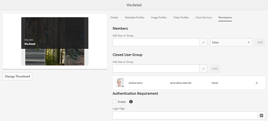

# Elementen beheren {#manage-assets}

| Versie | Artikelkoppeling |
| -------- | ---------------------------- |
| AEM 6.5 | [ klik hier ](https://experienceleague.adobe.com/docs/experience-manager-65/assets/managing/manage-assets.html?lang=en) |
| AEM as a Cloud Service | Dit artikel |

In dit artikel wordt beschreven hoe u elementen in [!DNL Adobe Experience Manager Assets] kunt beheren en bewerken. Zie [!DNL Content Fragments] elementen voor informatie over het beheren van [[!DNL Content Fragments]](content-fragments/content-fragments.md) .

## Mappen maken {#creating-folders}

Wanneer u een verzameling elementen ordent, bijvoorbeeld alle `Nature` -afbeeldingen, kunt u mappen maken om ze bij elkaar te houden. U kunt mappen gebruiken om uw elementen te categoriseren en in te delen. U hoeft in [!DNL Experience Manager Assets] geen elementen in mappen te ordenen om beter te werken.

>[!NOTE]
>
>* Het delen van een Assets-map van het type `sling:OrderedFolder` wordt niet ondersteund bij het delen naar Experience Cloud. Als u een map wilt delen, selecteert u [!UICONTROL Ordered] niet wanneer u een map maakt.
>* Experience Manager staat het gebruik van `subassets` word als naam voor een map niet toe. Het is een trefwoord dat is gereserveerd voor knooppunten die subassets voor samengestelde elementen bevatten

1. Navigeer naar de plaats in de map met digitale elementen waar u een map wilt maken. Klik in het menu op **[!UICONTROL Create]** . Selecteer **[!UICONTROL New Folder]** .
1. Geef in het veld **[!UICONTROL Title]** een mapnaam op. Standaard gebruikt DAM de titel die u als mapnaam hebt opgegeven. Nadat de map is gemaakt, kunt u de standaardinstelling overschrijven en een andere mapnaam opgeven.
1. Klik op **[!UICONTROL Create]**. De map wordt weergegeven in de map met digitale middelen.

De volgende tekens (lijst met door spaties gescheiden tekens) worden niet ondersteund:

* De naam van een elementbestand mag geen van de volgende tekens bevatten: `* / : [ \\ ] | # % { } ? &`
* De naam van een elementmap mag geen van deze tekens bevatten: `* / : [ \\ ] | # % { } ? \" . ^ ; + & \t`

## Elementen uploaden {#uploading-assets}

Zie [ digitale activa aan Experience Manager ](add-assets.md) toevoegen.

## ZIP-archieven extraheren {#extract-zip-archives}

Selecteer ZIP-archieven die in Experience Manager worden beheerd en extraheer de bestanden rechtstreeks naar Experience Manager zonder ze te downloaden.

Voer de volgende stappen uit om de ZIP-bestanden te extraheren:

1. Selecteer het bestandstype ZIP.
1. Klik op de optie **[!UICONTROL Extract Archive]** op de actiebalk.
1. Selecteer de map waarin u de geëxtraheerde elementen wilt opslaan die beschikbaar zijn in de gecomprimeerde map.
1. Klik op **[!UICONTROL Next]**.
1. Selecteer het juiste gedrag om conflicten met bestandsnamen tijdens het uitpakken te verwerken. U kunt selecteren om een versie van een bestaand element te maken, het element te vervangen, beide elementen in de doelmap te houden of de extractie van het nieuwe element over te slaan.
1. Klik op **[!UICONTROL Extract]**. Het Zip-extractieproces wordt gestart. Nadat het proces is voltooid, kunt u de geëxtraheerde elementen weergeven in de doelmap.

   

   >[!NOTE]
   >
   >* De maximale ondersteunde ZIP-bestandsgrootte is 15 GB.
   >* U kunt maximaal drie ZIP-bestanden tegelijk extraheren.

## Elementen voorvertonen {#previewing-assets}

Voer de volgende stappen uit om een voorvertoning van een element weer te geven.

1. Navigeer in de Assets-gebruikersinterface naar de locatie van het element waarvan u een voorvertoning wilt weergeven.
1. Selecteer het gewenste element om het te openen.
1. Op de voorproefwijze, zijn de gezoemopties beschikbaar voor [ gesteunde types van Beeld ](/help/assets/file-format-support.md) (met interactieve het uitgeven).

   Als u wilt inzoomen op een element, selecteert u `+` (of selecteert u het vergrootglas op het element). Selecteer `-` als u wilt uitzoomen. Wanneer u inzoomt, kunt u elk gebied van de afbeelding nauwkeurig bekijken door te pannen. Met de zoompijl opnieuw instellen keert u terug naar de oorspronkelijke weergave.

   Selecteer **[!UICONTROL Reset]** om de weergave weer in te stellen op de oorspronkelijke grootte.

## Eigenschappen bewerken {#editing-properties}

1. Navigeer naar de locatie van het element waarvan u de metagegevens wilt bewerken.
1. Selecteer het element en selecteer **[!UICONTROL Properties]** op de werkbalk om de eigenschappen van het element weer te geven. U kunt ook de handeling **[!UICONTROL Properties]** Snel op de elementenkaart kiezen.

   

1. Bewerk op de pagina [!UICONTROL Properties] de eigenschappen van de metagegevens onder verschillende tabbladen. Bewerk bijvoorbeeld onder het tabblad **[!UICONTROL Basic]** de titel, beschrijving, enzovoort.

   >[!NOTE]
   >
   >De indeling van de pagina [!UICONTROL Properties] en de beschikbare metagegevenseigenschappen zijn afhankelijk van het onderliggende metagegevensschema. Leren hoe te om de lay-out van de [!UICONTROL Properties] pagina te wijzigen, zie [ Schema&#39;s van Meta-gegevens ](/help/assets/metadata-schemas.md).

1. Gebruik de datumkiezer naast het veld **[!UICONTROL On Time]** om een bepaalde datum/tijd voor de activering van de asset te plannen.

   

1. Als u het element na een bepaalde duur wilt deactiveren, kiest u de datum/tijd van deactivering in de datumkiezer naast het veld **[!UICONTROL Off Time]** . De deactiveringsdatum moet later zijn dan de activeringsdatum voor een element. Na [!UICONTROL Off Time] zijn een element en de bijbehorende uitvoeringen niet beschikbaar via de Assets-webinterface of via de HTTP-API.

   <!---->

1. Selecteer een of meer tags in het veld **[!UICONTROL Tags]** . Als u een aangepaste tag wilt toevoegen, typt u de naam van de tag in het vak en selecteert u de `Enter` -toets. De nieuwe tag wordt opgeslagen in [!DNL Experience Manager] .

   YouTube vereist dat tags worden gepubliceerd en een koppeling naar YouTube hebben (als er een geschikte koppeling is gevonden).

   >[!NOTE]
   >
   >Als u tags wilt maken, moet u schrijfmachtigingen hebben op het pad `/content/cq:tags/default` in de CRX-opslagplaats.

1. Selecteer **[!UICONTROL Save & Close]** .
1. Navigeer naar de Assets-gebruikersinterface. De bewerkte eigenschappen van metagegevens, zoals titel, beschrijving en tags, worden weergegeven op de elementenkaart in de Kaart-weergave en onder de desbetreffende kolommen in de lijstweergave.

<!-- TBD: Uncomment after verification for Dec release.

## View asset usage and references {#usage-and-references}

[!DNL Experience Manager] lets you track statistics about usage of a digital asset. The usage statistics include the following:

    * Number of times the asset was viewed or downloaded
    * Channels/devices through which the asset was used
    * Creative solutions where the asset was recently used

To view usage statistics for an asset, in the [!UICONTROL Properties] page, click the **[!UICONTROL Insights]** tab. For more details, see [Assets Insights](assets-insights.md).

[!DNL Experience Manager] also lets you check all the incoming references to an asset, that is, the usage of an asset in remote [!DNL Sites] and in compound assets. Authors of webpages on [!DNL Experience Manager Sites] deployment can use an asset on a remote [!DNL Assets] deployment using the Connected Assets functionality. The [!UICONTROL References] tab in an asset's [!UICONTROL Properties] page lists the local and remote references of the asset. That is, the use of assets in compound assets in [!DNL Assets] and its use in remote [!DNL Sites] pages.

-->

## Elementen kopiëren {#copying-assets}

Wanneer u een middel of een omslag kopieert, wordt het volledige middel of de omslag gekopieerd, samen met zijn inhoudsstructuur. Een gekopieerd middel of een omslag wordt gedupliceerd bij de doelplaats. Het element op de bronlocatie wordt niet gewijzigd.

Enkele kenmerken die uniek zijn voor een bepaalde kopie van een element, worden niet overgedragen. Enkele voorbeelden zijn:

* Element-id, aanmaakdatum en -tijd en versies en versiehistorie. Sommige van deze eigenschappen worden aangegeven door de eigenschappen `jcr:uuid` , `jcr:created` en `cq:name` .

* De aanmaaktijd en de paden waarnaar wordt verwezen, zijn uniek voor elk element en elke uitvoering ervan.

De andere eigenschappen en metagegevens blijven behouden. Er wordt geen gedeeltelijke kopie gemaakt wanneer een element wordt gekopieerd.

1. Selecteer in de gebruikersinterface van Assets een of meer elementen en selecteer vervolgens het pictogram **[!UICONTROL Copy]** op de werkbalk. Alternatief, selecteer de **[!UICONTROL Copy]**  snelle actie van de activakaart.

   >[!NOTE]
   >
   >Als u de snelle handeling van [!UICONTROL Copy] gebruikt, kunt u slechts één element tegelijk kopiëren.

1. Navigeer naar de locatie waar u de elementen wilt kopiëren.

   >[!NOTE]
   >
   >Als u een element op dezelfde locatie kopieert, genereert [!DNL Experience Manager] automatisch een variatie in de naam. Als u bijvoorbeeld een element met de naam `Square` kopieert, genereert [!DNL Experience Manager] automatisch de titel voor de kopie als `Square1` .

1. Klik op het middelenpictogram **[!UICONTROL Paste]** op de werkbalk. Assets wordt naar deze locatie gekopieerd.

   <!---->

   >[!NOTE]
   >
   >Het pictogram **[!UICONTROL Paste]** is beschikbaar op de werkbalk totdat de plakbewerking is voltooid.

### Elementen verplaatsen of hernoemen {#moving-or-renaming-assets}

1. Navigeer naar de locatie van het element dat u wilt verplaatsen.

1. Selecteer de activa, en selecteer het **[!UICONTROL Move]** pictogram  van de toolbar.

1. Voer een van de volgende handelingen uit in de wizard Assets verplaatsen:

   * Geef de naam voor het element op nadat het is verplaatst. Selecteer vervolgens **[!UICONTROL Next]** om door te gaan.

   * Selecteer **[!UICONTROL Cancel]** om het proces te stoppen.

   >[!NOTE]
   >
   >* U kunt dezelfde naam opgeven voor het element als er geen element met die naam is op de nieuwe locatie. U moet echter een andere naam gebruiken als u het element verplaatst naar een locatie waar zich een element met dezelfde naam bevindt. Als u dezelfde naam gebruikt, genereert het systeem automatisch een variatie in de naam. Als uw element bijvoorbeeld de naam Vierkant heeft, genereert het systeem de naam Vierkant1 voor de kopie.
   >* Bij het wijzigen van de naam is witruimte niet toegestaan in de bestandsnaam.

1. Voer in het dialoogvenster **[!UICONTROL Select Destination]** een van de volgende handelingen uit:

   * Navigeer naar de nieuwe locatie voor de elementen en selecteer vervolgens **[!UICONTROL Next]** om door te gaan.

   * Selecteer **[!UICONTROL Back]** om terug te keren naar het **[!UICONTROL Rename]** -scherm.

1. Als de elementen die worden verplaatst, verwijzen naar pagina&#39;s, elementen of verzamelingen, wordt het tabblad **[!UICONTROL Adjust References]** weergegeven naast het tabblad **[!UICONTROL Select Destination]** .

   Voer een van de volgende handelingen uit op het scherm **[!UICONTROL Adjust References]** :

   * Geef de referenties op die u wilt aanpassen op basis van de nieuwe details en selecteer vervolgens **[!UICONTROL Move]** om door te gaan.

   * In de kolom **[!UICONTROL Adjust]** selecteert of deselecteert u verwijzingen naar de elementen.
   * Selecteer **[!UICONTROL Back]** om terug te keren naar het **[!UICONTROL Select Destination]** -scherm.

   * Selecteer **[!UICONTROL Cancel]** om de verplaatsingsbewerking te stoppen.

   Als u verwijzingen niet bijwerkt, blijven ze naar het vorige pad van het element wijzen. Als u de referenties aanpast, worden deze bijgewerkt naar het nieuwe middelenpad.

### Uitvoeringen beheren {#managing-renditions}

1. U kunt uitvoeringen voor een element toevoegen of verwijderen, behalve voor het origineel. Navigeer naar de locatie van het element waaraan u uitvoeringen wilt toevoegen of verwijderen.

1. Selecteer het element om de elementpagina te openen.

   <!---->

1. Selecteer het GlobalNav-pictogram en selecteer **[!UICONTROL Renditions]** in de lijst.

   

1. Geef in het deelvenster **[!UICONTROL Renditions]** de lijst weer met uitvoeringen die voor het element zijn gegenereerd.

   

   >[!NOTE]
   >
   >Standaard geeft [!DNL Experience Manager Assets] de oorspronkelijke uitvoering van het element niet weer in de voorvertoningsmodus. Beheerders kunnen met overlays [!DNL Assets] originele uitvoeringen weergeven in de voorvertoningsmodus.

1. Selecteer een vertoning om de vertoning weer te geven of te verwijderen.

   **het Schrappen van een vertoning**

   Selecteer een vertoning in het deelvenster **[!UICONTROL Renditions]** en selecteer vervolgens het pictogram **[!UICONTROL Delete Rendition]** op de werkbalk. Uitvoeringen kunnen niet bulksgewijs worden verwijderd nadat de verwerking van het element is voltooid. Voor afzonderlijke elementen kunt u uitvoeringen handmatig uit de gebruikersinterface verwijderen. Voor meerdere elementen kunt u [!DNL Experience Manager] aanpassen om specifieke vertoningen te verwijderen of de elementen te verwijderen en de verwijderde elementen opnieuw te uploaden.

   

   **Uploading a new rendition**

   Navigeer naar de pagina met elementdetails voor het element en selecteer het pictogram **[!UICONTROL Add Rendition]** op de werkbalk om een nieuwe uitvoering voor het element te uploaden.

   <!---->

   >[!NOTE]
   >
   >Als u een uitvoering selecteert in het deelvenster **[!UICONTROL Renditions]**, verandert de context van de werkbalk en worden alleen die acties weergegeven die relevant zijn voor de uitvoering. Opties zoals het pictogram Uitvoering uploaden worden niet weergegeven. Ga naar de pagina met details voor de asset om deze opties in de werkbalk weer te geven.

   U kunt de afmetingen configureren voor de vertoning die u wilt weergeven op de detailpagina van een afbeelding of video-element. Op basis van de afmetingen die u opgeeft, geeft Assets de vertoning weer met de exacte of dichtstbijzijnde afmetingen.

   U kunt geen uitvoeringen maken met de volgende voorvoegsels, omdat deze intern zijn in Adobe:

   * cq5

   * cqdam

   * cq5dam

   Als u weergaveafmetingen van een afbeelding op het niveau van de assetdetails wilt configureren, overlapt u het knooppunt `renditionpicker` (`libs/dam/gui/content/assets/assetpage/jcr:content/body/content/content/items/assetdetail/items/col1/items/assetview/renditionpicker`) en configureert u de waarde van de breedte-eigenschap. Configureer de eigenschap **[!UICONTROL size (Long) in KB]** in plaats van de breedte om de weergave op de pagina met assetdetails aan te passen op basis van de afbeeldingsgrootte. Voor aanpassing op basis van grootte wijst de eigenschap `preferOriginal` de voorkeur toe aan het origineel als de grootte van de overeenkomstige weergave groter is dan het origineel.

   Op dezelfde manier kunt u de afbeelding van de annotatiepagina aanpassen door `libs/dam/gui/content/assets/annotate/jcr:content/body/content/content/items/content/renditionpicker` te bedekken.

   <!---->

   Als u vertoningsafmetingen voor een video-element wilt configureren, navigeert u naar het knooppunt `videopicker` in de CRX-opslagplaats op de locatie `/libs/dam/gui/content/assets/assetpage/jcr:content/body/content/content/items/assetdetail/items/col1/items/assetview/videopicker` , bedekt u het knooppunt en bewerkt u de juiste eigenschap.

   >[!NOTE]
   >
   >Videoaantekeningen worden alleen ondersteund in browsers met video-indelingen die compatibel zijn met HTML5. Afhankelijk van de browser worden bovendien verschillende video-indelingen ondersteund. De MXF-video-indeling wordt echter nog niet ondersteund met video-annotaties.

## Elementen verwijderen {#delete-assets}

Als u de inkomende verwijzingen van andere pagina&#39;s wilt oplossen of verwijderen, werkt u de relevante verwijzingen bij voordat u een element verwijdert.

Schakel ook de knop forceren verwijderen uit met behulp van een overlay, zodat gebruikers geen bestanden waarnaar wordt verwezen kunnen verwijderen en verbroken koppelingen behouden blijven.

1. Navigeer naar de locatie van de elementen die u wilt verwijderen.

1. Selecteer de activa, en klik **[!UICONTROL Delete]**  van de toolbar.

1. Klik in het bevestigingsdialoogvenster op:

   * **[!UICONTROL Cancel]** om de handeling te stoppen
   * **[!UICONTROL Delete]** ter bevestiging van de handeling:

      * Als het element geen verwijzingen bevat, wordt het element verwijderd.
      * Als het element verwijzingen bevat, wordt u via een foutbericht geïnformeerd dat **[!UICONTROL One or more assets are referenced]** . U kunt **[!UICONTROL Force Delete]** of **[!UICONTROL Cancel]** selecteren.

   >[!NOTE]
   >
   >U hebt verwijdermachtigingen voor dam/asset nodig om een element te kunnen verwijderen. Als u alleen over wijzigingsmachtigingen beschikt, kunt u alleen de metagegevens van de elementen bewerken en annotaties toevoegen aan het element. U kunt het element of de metagegevens echter niet verwijderen.

   >[!NOTE]
   >
   >Als u de inkomende verwijzingen van andere pagina&#39;s wilt oplossen of verwijderen, werkt u de relevante verwijzingen bij voordat u een element verwijdert. U kunt het verwijderen van middelen waarnaar wordt verwezen, uitschakelen omdat verbroken koppelingen hierdoor worden veroorzaakt. Schakel de knop Kracht verwijderen uit met behulp van een bedekking.

## Elementen downloaden {#download-assets}

Zie [ downloadactiva van  [!DNL Experience Manager]](/help/assets/download-assets-from-aem.md).

## Elementen publiceren of publiceren ongedaan maken {#publish-assets}

1. Navigeer naar de locatie van het element of de map met middelen die u wilt publiceren of die u uit de publicatieomgeving wilt verwijderen (publicatie ongedaan maken).

1. Selecteer de activa of de omslag om te publiceren of unpublish en te selecteren **[!UICONTROL Manage Publication]**  van de toolbar beheren. Als u snel wilt publiceren, selecteert u de optie **[!UICONTROL Quick Publish]** op de werkbalk. Als de map die u wilt publiceren een lege map bevat, wordt de lege map niet gepubliceerd.

1. Selecteer de optie **[!UICONTROL Publish]** of **[!UICONTROL Unpublish]** naar wens.

   
   *Cijfer: Publiceer en unpublish opties en de het plannen optie.*

1. Selecteer **[!UICONTROL Now]** om direct op het element te reageren of selecteer **[!UICONTROL Later]** om de actie te plannen. Selecteer een datum en tijd als u de optie **[!UICONTROL Later]** kiest. Klik op **[!UICONTROL Next]**.

1. Als een element bij het publiceren naar andere elementen verwijst, worden de bijbehorende verwijzingen in de wizard weergegeven. Alleen die verwijzingen worden weergegeven die niet zijn gepubliceerd of zijn gewijzigd sinds de laatste publicatie. Kies de referenties die u wilt publiceren.

1. Wanneer u de publicatie ongedaan maakt, kiest u de referenties die u ongedaan wilt maken wanneer een element naar andere elementen verwijst. Klik op **[!UICONTROL Unpublish]**. Klik in het bevestigingsdialoogvenster op **[!UICONTROL Cancel]** om de handeling te stoppen of klik op **[!UICONTROL Unpublish]** om te bevestigen dat de elementen op de opgegeven datum niet gepubliceerd moeten worden.

De volgende beperkingen en tips voor het publiceren of verwijderen van middelen of mappen zijn beschikbaar:

* De optie voor [!UICONTROL Manage Publication] is alleen beschikbaar voor gebruikersaccounts die replicatiemachtigingen hebben.
* Verwijder tijdens het verwijderen van de publicatie van een complex element alleen de publicatie van het element. Verwijder de publicatie van de verwijzingen niet omdat er mogelijk naar wordt verwezen door andere gepubliceerde elementen.
* Lege mappen worden niet gepubliceerd.
* Als u elementen publiceert die worden verwerkt, wordt alleen de oorspronkelijke inhoud gepubliceerd. De uitvoeringen ontbreken. Wacht tot de verwerking is voltooid en publiceer het element of publiceer het opnieuw nadat de verwerking is voltooid.

## Gesloten gebruikersgroep {#closed-user-group}

Een gesloten gebruikersgroep (CUG) wordt gebruikt om de toegang te beperken tot specifieke elementmappen die vanuit [!DNL Experience Manager] worden gepubliceerd. Als u een CUG maakt voor een map, is de toegang tot de map (inclusief mapelementen en submappen) beperkt tot alleen toegewezen leden of groepen. Om tot de omslag toegang te hebben, moeten zij login gebruikend hun veiligheidsgeloofsbrieven.

CUG&#39;s zijn een extra manier om de toegang tot uw elementen te beperken. U kunt ook een aanmeldingspagina voor de map configureren.

1. Selecteer een map in de gebruikersinterface van Assets en selecteer het pictogram Eigenschappen op de werkbalk om de pagina met eigenschappen weer te geven.
1. Voeg leden of groepen toe onder **[!UICONTROL Permissions]** op het tabblad **[!UICONTROL Closed User Group]** .

   

1. Als u een aanmeldingsscherm wilt weergeven wanneer gebruikers de map openen, selecteert u de optie **[!UICONTROL Enable]** . Selecteer vervolgens het pad naar een aanmeldingspagina in [!DNL Experience Manager] en sla de wijzigingen op.

   

   >[!NOTE]
   >
   >Als u het pad naar een aanmeldingspagina niet opgeeft, geeft [!DNL Experience Manager] de standaardaanmeldingspagina weer in de publicatie-instantie.

1. Publiceer de map en probeer deze vervolgens te openen vanuit de publicatie-instantie. Er wordt een aanmeldingsscherm weergegeven.
1. Als u lid van de GECG bent, ga uw veiligheidsgeloofsbrieven in. De map wordt weergegeven nadat [!DNL Experience Manager] u heeft geverifieerd.

## Zoeken in middelen {#search-assets}

Het zoeken naar middelen is van cruciaal belang voor het gebruik van een systeem voor het beheer van digitale activa — of het nu gaat om verder gebruik door creatieve ondernemingen, voor een robuust beheer van activa door zakelijke gebruikers en marketeers, of voor beheer door DAM-beheerders.

Voor eenvoudige, geavanceerde, en douaneonderzoeken om de meest aangewezen activa te ontdekken en te gebruiken, zie [ onderzoeksactiva in  [!DNL Experience Manager]](/help/assets/search-assets.md).

## Snelle acties {#quick-actions}

De snelle actiepictogrammen zijn beschikbaar voor één middel tegelijkertijd. Voer afhankelijk van het apparaat de volgende handelingen uit om de snelactiepictogrammen weer te geven:

* Aanraakapparaten: aanraken en vasthouden. Op een iPad kunt u bijvoorbeeld een element selecteren en ingedrukt houden, zodat de snelle acties worden weergegeven.
* Niet-aanraakapparaten: Aanwijzer aanwijzen. Op een bureaubladapparaat wordt bijvoorbeeld de snelle actiebalk weergegeven als u de aanwijzer boven de elementminiatuur houdt.

<!-- Hiding this topic via cqdoc-18707

## Edit images {#editing-images}

The editing tools in the [!DNL Experience Manager Assets] interface let you perform small editing jobs on image assets. You can crop, rotate, flip, and perform other editing jobs on images. You can also add image maps to assets.

>[!NOTE]
>
>For some components, the Full Screen mode has additional options available.

1. Do one of the following to open an asset in edit mode:

    * Select the asset and then select the **[!UICONTROL Edit]** icon in the toolbar.
    * Select the **[!UICONTROL Edit]** icon that appears on an asset in the Card view.
    * In the asset page, select the **[!UICONTROL Edit]** icon in the toolbar.

   

1. To crop the image, select the **Crop** icon.

   

1. Select the desired option from the list. The crop area appears on the image based on the option you choose. The **Free Hand** option lets you crop the image without any aspect ratio restrictions.

   

1. Select the area to be cropped, and resize or reposition it on the image.
1. Use the **Finish** icon (top right corner) to crop the image. Clicking the **Finish** icon also triggers the regeneration of renditions.

   

1. Use the **Undo** and **Redo** icons on the top right to revert to the uncropped image or retain the cropped image, respectively.

   

1. Select the appropriate Rotate icon to rotate the image clockwise or anti-clockwise.

   

1. Select the appropriate Flip icon to flip the image horizontally or vertically.

   

1. Select the **Finish** icon to save the changes.

   

>[!NOTE]
>
>Image editing is supported for BMP, GIF, PNG, and JPEG files formats.

>[!NOTE]
>
>To edit a TXT file, set **Day CQ Link Externalizer** from Configuration Manager.
-->

## Tijdlijn {#timeline}

In de tijdlijn kunt u verschillende gebeurtenissen voor een geselecteerd item weergeven, zoals actieve workflows voor een element, opmerkingen/annotaties, activiteitenlogbestanden en versies.


*Cijfer: De chronologieingangen van de soort voor een activa*

>[!NOTE]
>
>In de [ console van Inzamelingen ](/help/assets/manage-collections.md#navigate-the-collections-console), verstrekt de **[!UICONTROL Show All]** lijst opties om commentaren en werkschema&#39;s slechts te bekijken. Bovendien wordt de chronologie getoond slechts voor top-level inzamelingen die in de console vermeld zijn. Deze wordt niet weergegeven als u in een van de verzamelingen navigeert.

>[!NOTE]
>
>De Chronologie bevat verscheidene [ opties specifiek voor inhoudsfragmenten ](content-fragments/content-fragments.md).

## Elementen notities aanbrengen {#annotating}

Annotaties zijn opmerkingen of toelichtingen die aan afbeeldingen of video&#39;s worden toegevoegd. Annotaties bieden marketers de mogelijkheid samen te werken en feedback over middelen te geven.

Videoannotaties worden alleen ondersteund in browsers met video-indelingen die compatibel zijn met HTML5. De video-indelingen die door Assets worden ondersteund, zijn afhankelijk van de browser. De MXF-video-indeling wordt echter nog niet ondersteund met video-annotaties.

>[!NOTE]
>
>Voor de Fragmenten van de Inhoud, [ worden de annotaties gecreeerd in de fragmentredacteur ](content-fragments/content-fragments.md).

1. Navigeer naar de locatie van het element waaraan u annotaties wilt toevoegen.
1. Selecteer het pictogram **[!UICONTROL Annotate]** op een van de volgende manieren:

   * [Snelle acties](#quick-actions)
   * Vanuit de werkbalk nadat u het element hebt geselecteerd of naar de elementpagina bent gegaan

   <!---->

1. Voeg een opmerking toe in het vak **[!UICONTROL Comment]** onder aan de tijdlijn. U kunt ook een gebied in de afbeelding markeren en een annotatie toevoegen in het dialoogvenster **[!UICONTROL Add Annotation]**.

<!-- -->

<!--
1. To notify a user about an annotation, specify the email address of the user and add the comment. For example, to notify Aaron MacDonald about an annotation, enter @aa. Hints for all matching users is displayed in a list. Select Aaron's email address from the list to tag her with the comment. Similarly, you can tag more users anywhere within the annotation or before or after it.
-->

>[!NOTE]
>
>Voor een gebruiker zonder beheerder worden suggesties alleen weergegeven als de gebruiker Leesmachtigingen heeft bij `/home` in CRXDE.

<!---->

1. Nadat u de annotatie hebt toegevoegd, klikt u op **[!UICONTROL Add]** om deze op te slaan. Een kennisgeving voor de aantekening wordt verzonden naar Aaron.

   <!---->

   >[!NOTE]
   >
   >U kunt meerdere annotaties toevoegen voordat u ze opslaat.

1. Selecteer **[!UICONTROL Close]** om de annotatiemodus te verlaten.
1. Meld u aan bij Assets met de gegevens van Aaron MacDonald en klik op het pictogram **[!UICONTROL Notifications]** om het bericht weer te geven.

   >[!NOTE]
   >
   >U kunt ook annotaties toevoegen aan video-elementen. Tijdens het annoteren van video&#39;s pauzeert de speler zodat u notities kunt aanbrengen in een frame. Voor details, zie [ het leiden videoactiva ](manage-video-assets.md). De MXF-video-indeling wordt echter nog niet ondersteund met video-annotaties.

1. Als u een andere kleur wilt kiezen, zodat u onderscheid kunt maken tussen gebruikers, selecteert u het pictogram Profiel en selecteert u **[!UICONTROL My Preferences]** .

   <!---->

   Geef de gewenste kleur op in het vak **[!UICONTROL Annotation Color]** en selecteer vervolgens **[!UICONTROL Accept]** .

<!-- -->

>[!NOTE]
>
>U kunt ook annotaties toevoegen aan een verzameling. Als een verzameling onderliggende verzamelingen bevat, kunt u echter alleen annotaties/opmerkingen aan de bovenliggende verzameling toevoegen. De optie Annoteren is niet beschikbaar voor onderliggende verzamelingen.

### Opgeslagen annotaties weergeven {#viewing-saved-annotations}

U kunt slechts één annotatie tegelijk weergeven.

>[!NOTE]
>
>Als u meerdere annotaties selecteert, wordt de laatste annotatie weergegeven in de gebruikersinterface.
>
>Multi-select wordt alleen ondersteund voor het afdrukken van het geannoteerde element als PDF.

1. Als u opgeslagen annotaties voor een element wilt weergeven, navigeert u naar de locatie van het element en opent u de elementpagina voor het element.

1. Selecteer het GlobalNav-pictogram en kies **[!UICONTROL Timeline]** in de lijst.

   <!---->

1. Selecteer in de lijst **[!UICONTROL Show All]** in de tijdlijn de optie **[!UICONTROL Comments]** om de resultaten te filteren op basis van annotaties.

   <!---->

   Selecteer een opmerking in het deelvenster **[!UICONTROL Timeline]** om de bijbehorende annotatie in de afbeelding weer te geven.

   <!---->

   Selecteer **[!UICONTROL Delete]** om een bepaalde opmerking te verwijderen.

### Annotaties afdrukken {#printing-annotations}

Als een element annotaties heeft of een revisiewerkstroom heeft ondergaan, kunt u het element samen met annotaties afdrukken en de status controleren als een PDF-bestand voor offline revisie.

U kunt ook alleen de annotaties of de revisiestatus afdrukken.

>[!NOTE]
>
>U kunt meerdere annotaties selecteren wanneer u het geannoteerde element afdrukt als PDF.

Als u de annotaties en de revisiestatus wilt afdrukken, selecteert u het pictogram **[!UICONTROL Print]** en volgt u de instructies in de wizard. Het pictogram **[!UICONTROL Print]** wordt alleen op de werkbalk weergegeven als aan het element ten minste één aantekening of revisiestatus is toegewezen.

1. Open vanuit de gebruikersinterface van Assets de voorvertoningspagina voor een element.
1. Voer een van de volgende handelingen uit:

   * Als u alle annotaties en de revisiestatus wilt afdrukken, slaat u stap 3 over en gaat u rechtstreeks naar stap 4.
   * Om specifieke annotaties en overzichtsstatus te drukken, open de [ chronologie ](/help/assets/manage-digital-assets.md#timeline) en ga dan naar stap 3.

1. Als u specifieke annotaties wilt afdrukken, selecteert u de annotaties in de tijdlijn.

   <!---->

   Als u alleen de revisiestatus wilt afdrukken, selecteert u deze in de tijdlijn.

   <!---->

1. Selecteer het pictogram **[!UICONTROL Print]** op de werkbalk.

   <!---->

1. Kies in het dialoogvenster Afdrukken de positie waarop u de annotaties/revisiestatus wilt weergeven op de PDF. Bijvoorbeeld, als u de annotaties/status bij het hoogste recht van de pagina wilt worden gedrukt die het gedrukte beeld bevat, gebruik **Top-Left** het plaatsen. Deze optie is standaard geselecteerd.

   <!---->

   U kunt andere instellingen kiezen, afhankelijk van de positie waar u de annotaties/status wilt weergeven in de afgedrukte PDF. Kies **[!UICONTROL Next Page]** als u de annotaties/status wilt weergeven op een pagina die gescheiden is van de afgedrukte asset.

1. Klik op **[!UICONTROL Print]**. Afhankelijk van de optie die u kiest in stap 2, geeft de gegenereerde PDF de annotaties/status op de opgegeven positie weer. Als u bijvoorbeeld zowel annotaties als de revisiestatus wilt afdrukken met de instelling **Linksboven**, lijkt de gegenereerde uitvoer op het PDF-bestand dat hier wordt weergegeven.

   <!---->

1. Download of druk de PDF af met de opties rechtsboven.

   <!---->

   Als u de weergave van het gerenderde PDF-bestand wilt wijzigen, bijvoorbeeld de lettertypekleur, -grootte en -stijl, achtergrondkleur van de opmerkingen en status, opent u **[!UICONTROL Annotation PDF configuration]** in Configuration Manager en wijzigt u de gewenste opties. Als u bijvoorbeeld de weergavekleur van de goedgekeurde status wilt wijzigen, wijzigt u de kleurcode in het desbetreffende veld. Voor informatie rond het veranderen van de doopvontkleur van annotaties, zie [ het Annoteren ](/help/assets/manage-digital-assets.md#annotating).

   Ga terug naar het gerenderde PDF-bestand en vernieuw het. De vernieuwde PDF weerspiegelt de wijzigingen die u hebt aangebracht.

## Asset versioning {#asset-versioning}

Met Versioning maakt u een momentopname van digitale elementen op een bepaald tijdstip. Versioning helpt bij het terugzetten van elementen naar een vorige status op een later tijdstip. Als u bijvoorbeeld een wijziging in een element ongedaan wilt maken, herstelt u de onbewerkte versie van het element.

Hieronder vindt u scenario&#39;s waarin u versies maakt:

* U wijzigt een afbeelding in een andere toepassing en uploadt deze naar Assets. Er wordt een versie van de afbeelding gemaakt, zodat de oorspronkelijke afbeelding niet wordt overschreven.
* U bewerkt de metagegevens van een element.
* Met de [!DNL Experience Manager] -bureaubladtoepassing kunt u een bestaand middel uitchecken en uw wijzigingen opslaan. Telkens wanneer het element wordt opgeslagen, wordt een nieuwe versie gemaakt.

U kunt automatische versioning ook inschakelen via een workflow. Wanneer u een versie voor een element maakt, worden de metagegevens en de uitvoeringen samen met de versie opgeslagen. Uitvoeringen zijn alternatieven voor dezelfde afbeeldingen, bijvoorbeeld een PNG-uitvoering van een geüpload JPEG-bestand.

Met de versiefunctionaliteit kunt u het volgende doen:

* Maak een versie van een element.
* De huidige revisie voor een element weergeven.
* Herstel het element naar een vorige versie.

1. Navigeer naar de locatie van het element waarvoor u een versie wilt maken en selecteer het element om de elementpagina te openen.

1. Selecteer het GlobalNav-pictogram en kies **[!UICONTROL Timeline]** in het menu.

   

1. Selecteer het pictogram **[!UICONTROL Actions]** (pijl) onderaan om de beschikbare handelingen weer te geven die u op het element kunt uitvoeren.

   <!---->

1. Selecteer **[!UICONTROL Save as Version]** om een versie voor het element te maken.

<!---->

1. Voeg een label en opmerking toe en klik op **[!UICONTROL Create]** om een versie te maken. Alternatief, uitgezochte **annuleert** om de verrichting weg te gaan.

   <!---->

1. Als u de nieuwe versie wilt weergeven, opent u de lijst **[!UICONTROL Show All]** in de tijdlijn op de pagina met assetdetails of op de gebruikersinterface Assets en kiest u **[!UICONTROL Versions]**. Alle versies die voor een asset zijn gemaakt, worden weergegeven onder het tabblad Tijdlijn. U kunt de lijst filteren om Versies weer te geven door op de pijl-omlaag te klikken en **[!UICONTROL Versions]** in de lijst te selecteren.

   

1. Selecteer een specifieke versie voor het element om er een voorvertoning van weer te geven of schakel de optie in voor weergave in de gebruikersinterface van Assets.

   

1. Voeg een label en een opmerking voor de versie toe om terug te keren naar de specifieke versie in de gebruikersinterface van Assets.

   

1. Selecteer **[!UICONTROL Preview Version]** als u een voorvertoning voor de versie wilt genereren.
1. Selecteer **[!UICONTROL Revert to this Version]** als u deze versie wilt weergeven in de gebruikersinterface van Assets.
1. Als u twee versies wilt vergelijken, gaat u naar de elementenpagina van het element en selecteert u de versie die u met de huidige versie wilt vergelijken.

   

1. Selecteer in de tijdlijn de versie die u wilt vergelijken en sleep de schuifregelaar naar links om deze versie over de huidige versie heen te plaatsen en te vergelijken.

   

### Een workflow op een element starten {#starting-a-workflow-on-an-asset}

1. Navigeer naar de locatie van het element waarvoor u een workflow wilt starten en selecteer het element om de elementpagina te openen.
1. Selecteer het GlobalNav-pictogram en kies **[!UICONTROL Timeline]** in het menu om de tijdlijn weer te geven.

   

1. Selecteer het pictogram **[!UICONTROL Actions]** (pijl) onderaan om de lijst met acties te openen die beschikbaar zijn voor het element.

   <!---->

1. Selecteer **[!UICONTROL Start Workflow]** in de lijst.

   <!---->

1. Selecteer in het dialoogvenster **[!UICONTROL Start Workflow]** een workflowmodel in de lijst.

   <!---->

1. (Optioneel) Geef een titel voor de workflow op, die kan worden gebruikt om naar de instantie van de workflow te verwijzen.

   <!---->

1. Selecteer **[!UICONTROL Start]** en selecteer vervolgens **[!UICONTROL Proceed]** in het dialoogvenster ter bevestiging. Elke stap van de workflow wordt als een gebeurtenis in de tijdlijn weergegeven.

   <!---->

## Verzamelingen {#collections}

Een verzameling is een geordende set elementen. Gebruik verzamelingen om elementen tussen gebruikers te delen.

* Een verzameling kan elementen van verschillende locaties bevatten, omdat deze alleen verwijzingen naar deze elementen bevatten. Bij elke verzameling blijft de referentiële integriteit van de elementen behouden.
* U kunt verzamelingen delen met meerdere gebruikers met verschillende machtigingsniveaus, zoals bewerken, weergeven, enzovoort.

Om details van het beheer van de Inzameling te kennen, zie [ Inzamelingen ](/help/assets/manage-collections.md) beheren.

## Verlopen middelen verbergen bij weergave van middelen in bureaubladtoepassing of Adobe Asset Link {#hide-expired-assets-via-acp-api}

Met de bureaubladtoepassing [!DNL Experience Manager] hebt u toegang tot de DAM-opslagruimte vanaf een desktopcomputer van Windows of Mac. Met Adobe Asset Link hebt u toegang tot middelen vanuit de ondersteunde [!DNL Creative Cloud] -bureaubladtoepassingen.

Wanneer u elementen bladert vanuit de gebruikersinterface van [!DNL Experience Manager] , worden de verlopen elementen niet weergegeven. Beheerders kunnen de volgende configuratie uitvoeren om te voorkomen dat verlopen middelen worden weergegeven, gezocht en opgehaald wanneer ze middelen zoeken vanuit de bureaubladtoepassing en de Asset Link. De configuratie werkt voor alle gebruikers, ongeacht beheerderrechten.

Voer het volgende bevel CURL uit. Zorg ervoor dat gebruikers die toegang hebben tot elementen, via `/conf/global/settings/dam/acpapi/` toegang hebben tot het bestand. Gebruikers die deel uitmaken van een `dam-user` -groep hebben standaard de juiste machtigingen.

```curl
curl -v -u admin:admin --location --request POST 'http://localhost:4502/conf/global/settings/dam/acpapi/configuration/_jcr_content' \
--header 'Content-Type: application/x-www-form-urlencoded' \
--data-urlencode 'jcr:title=acpapiconfig' \
--data-urlencode 'hideExpiredAssets=true' \
--data-urlencode 'hideExpiredAssets@TypeHint=Boolean' \
--data-urlencode 'jcr:primaryType=nt:unstructured' \
--data-urlencode '../../jcr:primaryType=sling:Folder'
```

Om meer te weten, zie hoe te [ activa doorbladeren DAM gebruikend Desktop app ](https://experienceleague.adobe.com/docs/experience-manager-desktop-app/using/using.html#browse-search-preview-assets) en [ hoe te om de Verbinding van Activa van Adobe te gebruiken ](https://helpx.adobe.com/enterprise/admin-guide.html/enterprise/using/manage-assets-using-adobe-asset-link.ug.html).

**zie ook**

* [Assets vertalen](translate-assets.md)
* [ASSETS HTTP API](mac-api-assets.md)
* [Door Assets ondersteunde bestandsindelingen](file-format-support.md)
* [Zoeken in middelen](search-assets.md)
* [Verbonden elementen](use-assets-across-connected-assets-instances.md)
* [Elementen rapporteren](asset-reports.md)
* [Metagegevensschema&#39;s](metadata-schemas.md)
* [Elementen downloaden](download-assets-from-aem.md)
* [Metagegevens beheren](manage-metadata.md)
* [Zoeken in facetten](search-facets.md)
* [Verzamelingen beheren](manage-collections.md)
* [Bulkmetagegevens importeren](metadata-import-export.md)
* [Assets publiceren naar AEM en Dynamic Media](/help/assets/publish-assets-to-aem-and-dm.md)
