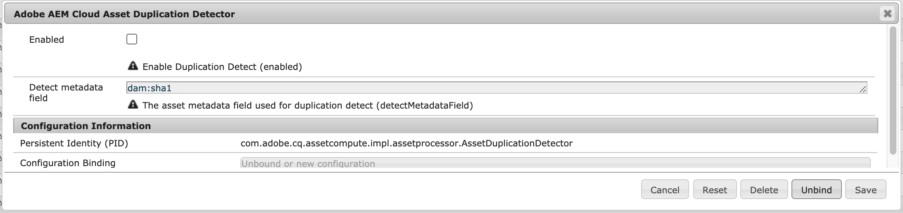
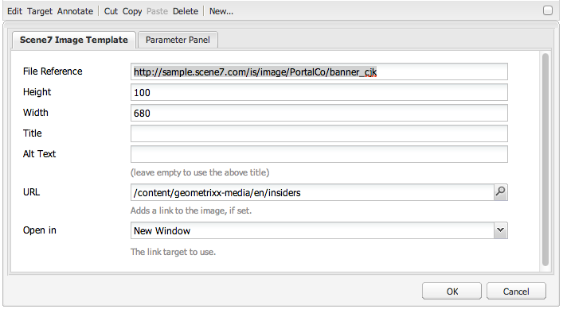

# Elementen beheren {#manage-assets}

In dit artikel wordt beschreven hoe u elementen in Adobe Experience Manager Assets kunt beheren en bewerken. Zie [Content Fragments](content-fragments/content-fragments.md) assets voor het beheer van inhoudsfragmenten.

## Mappen {#creating-folders} maken

Wanneer u een verzameling elementen ordent, bijvoorbeeld alle `Nature`-afbeeldingen, kunt u mappen maken om deze bij elkaar te houden. U kunt mappen gebruiken om uw elementen te categoriseren en in te delen. [!DNL Experience Manager Assets] vereist niet dat u elementen in mappen ordent om beter te werken.

>[!NOTE]
>
>* Het delen van een map Middelen van het type `sling:OrderedFolder` wordt niet ondersteund bij het delen naar Marketing Cloud. Als u een map wilt delen, selecteert u [!UICONTROL Ordered] niet bij het maken van een map.
>* Experience Manager staat het gebruik van `subassets` woord als naam van een omslag niet toe. Het is een trefwoord dat is gereserveerd voor knooppunten die subassets voor samengestelde elementen bevatten


1. Navigeer naar de plaats in de map met digitale elementen waar u een nieuwe map wilt maken. Klik in het menu op **[!UICONTROL Create]**. Selecteer **[!UICONTROL New Folder]**.
1. Geef in het veld **[!UICONTROL Title]** een mapnaam op. Standaard gebruikt DAM de titel die u als mapnaam hebt opgegeven. Nadat de map is gemaakt, kunt u de standaardinstelling overschrijven en een andere mapnaam opgeven.
1. Klik op **[!UICONTROL Create]**. De map wordt weergegeven in de map met digitale middelen.

De volgende tekens (lijst met door spaties gescheiden tekens) worden niet ondersteund:

* De naam van een elementbestand mag geen van de volgende tekens bevatten: `* / : [ \\ ] | # % { } ? &`
* De naam van een elementmap mag geen van de volgende tekens bevatten: `* / : [ \\ ] | # % { } ? \" . ^ ; + & \t`

## Elementen uploaden {#uploading-assets}

Zie [digitale elementen toevoegen aan Experience Manager](add-assets.md).

## Gedupliceerde elementen detecteren {#detect-duplicate-assets}

<!-- TBD: This feature may not work as documented. See CQ-4283718. Get PM review done. -->

Als een DAM-gebruiker een of meer middelen uploadt die al in de opslagplaats aanwezig zijn, detecteert [!DNL Experience Manager] de duplicatie en wordt de gebruiker hiervan op de hoogte gebracht. Dubbele detectie is standaard uitgeschakeld, omdat deze invloed kan hebben op de prestaties, afhankelijk van de grootte van de opslagplaats en het aantal geüploade middelen. Om de eigenschap toe te laten, vorm [!UICONTROL Adobe AEM Cloud Asset Duplication Detector]. Zie [hoe te om configuraties OSGi](https://experienceleague.adobe.com/docs/experience-manager-cloud-service/implementing/deploying/configuring-osgi.html) te doen. De duplicatiedetectie is gebaseerd op de unieke `dam:sha1`-waarde die is opgeslagen op `jcr:content/metadata/dam:sha1`. Dit betekent dat dubbele elementen worden gedetecteerd, zelfs als de bestandsnamen verschillend zijn.



U kunt het configuratiebestand `/apps/example/config.author/com.adobe.cq.assetcompute.impl.assetprocessor.AssetDuplicationDetector.cfg.json` toevoegen in aangepaste code en het bestand kan het volgende bevatten:

```json
{
  "enabled":true,
  "detectMetadataField":"dam:sha1"
}
```

Zodra toegelaten, verzendt de Experience Manager berichten van dubbele activa naar inbox. Het is een geaggregeerd resultaat voor meerdere duplicaten. Gebruikers kunnen de elementen op basis van de resultaten verwijderen.


## Elementen voorvertonen {#previewing-assets}

Voer de volgende stappen uit om een voorvertoning van een element weer te geven.

1. Navigeer in de gebruikersinterface Elementen naar de locatie van het element waarvan u een voorvertoning wilt weergeven.
1. Tik op het gewenste element om het te openen.

1. In de voorvertoningsmodus zijn zoomopties beschikbaar voor [ondersteunde afbeeldingstypen](/help/assets/file-format-support.md) (met interactieve bewerking).

   Tik/klik op `+` (of tik/klik op het vergrootglas op het element) om in te zoomen op een element. Tik op `-` om uit te zoomen. Wanneer u inzoomt, kunt u elk gebied van de afbeelding nauwkeurig bekijken door te pannen. Met de zoompijl opnieuw instellen keert u terug naar de oorspronkelijke weergave.

   Tik **[!UICONTROL Reset]** om de weergave te herstellen naar de oorspronkelijke grootte.

## Eigenschappen bewerken {#editing-properties}

1. Navigeer naar de locatie van het element waarvan u de metagegevens wilt bewerken.

1. Selecteer het element en tik op **[!UICONTROL Properties]** op de werkbalk om de eigenschappen van het element weer te geven. U kunt ook de snelle handeling **[!UICONTROL Properties]** op de elementenkaart kiezen.

   

1. Bewerk op de pagina [!UICONTROL Properties] de eigenschappen van de metagegevens onder verschillende tabbladen. Bewerk bijvoorbeeld onder het tabblad **[!UICONTROL Basic]** de titel, beschrijving, enzovoort.

   >[!NOTE]
   >
   >De indeling van de pagina [!UICONTROL Properties] en de beschikbare metagegevenseigenschappen zijn afhankelijk van het onderliggende metagegevensschema. Zie [Metagegevensschema&#39;s](/help/assets/metadata-schemas.md) voor meer informatie over het wijzigen van de indeling van de pagina [!UICONTROL Properties].

1. Gebruik de datumkiezer naast het veld **[!UICONTROL On Time]** om een bepaalde datum/tijd voor de activering van de asset te plannen.

   

1. Als u het element na een bepaalde duur wilt deactiveren, kiest u de datum/tijd van deactivering in de datumkiezer naast het veld **[!UICONTROL Off Time]**. De deactiveringsdatum moet later zijn dan de activeringsdatum voor een element. Na [!UICONTROL Off Time] zijn een middel en zijn vertoningen niet beschikbaar of via de het Webinterface van Middelen of door HTTP API.

   

1. Selecteer een of meer tags in het veld **[!UICONTROL Tags]**. Als u een aangepaste tag wilt toevoegen, typt u de naam van de tag in het vak en selecteert u `Enter`. De nieuwe tag wordt opgeslagen in [!DNL Experience Manager].

   Op YouTube moeten labels publiceren en een koppeling naar YouTube hebben (als er een geschikte koppeling is gevonden).

   >[!NOTE]
   >
   >Als u tags wilt maken, moet u schrijfmachtigingen hebben op het pad `/content/cq:tags/default` in de CRX-opslagruimte.

1. Tik of klik op **[!UICONTROL Save & Close]**.

1. Navigeer naar de gebruikersinterface Elementen. De bewerkte eigenschappen van metagegevens, zoals titel, beschrijving en tags, worden weergegeven op de elementenkaart in de Kaart-weergave en onder de desbetreffende kolommen in de lijstweergave.

<!-- TBD: Uncomment after verification for Dec release.

## View asset usage and references {#usage-and-references}

[!DNL Experience Manager] lets you track statistics about usage of a digital asset. The usage statistics include the following:

    * Number of times the asset was viewed or downloaded
    * Channels/devices through which the asset was used
    * Creative solutions where the asset was recently used

To view usage statistics for an asset, in the [!UICONTROL Properties] page, click the **[!UICONTROL Insights]** tab. For more details, see [Asset Insights](assets-insights.md).

[!DNL Experience Manager] also lets you check all the incoming references to an asset, that is, the usage of an asset in remote [!DNL Sites] and in compound assets. Authors of webpages on [!DNL Experience Manager Sites] deployment can use an asset on a remote [!DNL Assets] deployment using the Connected Assets functionality. The [!UICONTROL References] tab in an asset's [!UICONTROL Properties] page lists the local and remote references of the asset. That is, the use of assets in compound assets in [!DNL Assets] and its use in remote [!DNL Sites] pages.

-->

## Elementen {#copying-assets} kopiëren

Wanneer u een middel of een omslag kopieert, wordt het volledige middel of de omslag gekopieerd, samen met zijn inhoudsstructuur. Een gekopieerd middel of een omslag wordt gedupliceerd bij de doelplaats. Het element op de bronlocatie wordt niet gewijzigd.

Enkele kenmerken die uniek zijn voor een bepaalde kopie van een element, worden niet overgedragen. Enkele voorbeelden zijn:

* Element-id, aanmaakdatum en -tijd en versies en versiegeschiedenis. Sommige van deze eigenschappen worden aangegeven door de eigenschappen `jcr:uuid`, `jcr:created` en `cq:name`.

* De aanmaaktijd en de paden waarnaar wordt verwezen, zijn uniek voor elk element en elke uitvoering ervan.

De andere eigenschappen en metagegevens blijven behouden. Er wordt geen gedeeltelijke kopie gemaakt wanneer een element wordt gekopieerd.

1. Selecteer een of meer elementen in de interface Middelen en tik op het pictogram **[!UICONTROL Copy]** op de werkbalk. U kunt ook de snelle handeling **[!UICONTROL Copy]**  van de elementenkaart selecteren.

   >[!NOTE]
   >
   >Als u de snelle handeling [!UICONTROL Copy] gebruikt, kunt u slechts één element tegelijk kopiëren.

1. Navigeer naar de locatie waar u de elementen wilt kopiëren.

   >[!NOTE]
   >
   >Als u een element op dezelfde locatie kopieert, wordt automatisch een variatie in de naam gegenereerd. [!DNL Experience Manager] Als u bijvoorbeeld een element met de naam `Square` kopieert, genereert [!DNL Experience Manager] automatisch de titel voor de kopie als `Square1`.

1. Klik op het middelenpictogram **[!UICONTROL Paste]** op de werkbalk. Elementen worden naar deze locatie gekopieerd.

   

   >[!NOTE]
   >
   >Het pictogram **[!UICONTROL Paste]** is beschikbaar op de werkbalk totdat de plakbewerking is voltooid.

### Elementen verplaatsen of hernoemen {#moving-or-renaming-assets}

1. Navigeer naar de locatie van het element dat u wilt verplaatsen.

1. Selecteer het element en tik/klik op het **[!UICONTROL Move]**-pictogram  op de werkbalk.

1. Voer een van de volgende handelingen uit in de wizard Elementen verplaatsen:

   * Geef de naam voor het element op nadat het is verplaatst. Tik vervolgens op **[!UICONTROL Next]** om door te gaan.

   * Tik/klik op **[!UICONTROL Cancel]** om het proces te stoppen.
   >[!NOTE]
   >
   >* U kunt dezelfde naam opgeven voor het element als er geen element met die naam is op de nieuwe locatie. U moet echter een andere naam gebruiken als u het element verplaatst naar een locatie waar zich een element met dezelfde naam bevindt. Als u dezelfde naam gebruikt, genereert het systeem automatisch een variatie in de naam. Als uw element bijvoorbeeld de naam Vierkant heeft, genereert het systeem de naam Vierkant1 voor de kopie.
   >* Bij het wijzigen van de naam is witruimte niet toegestaan in de bestandsnaam.


1. Voer in het dialoogvenster **[!UICONTROL Select Destination]** een van de volgende handelingen uit:

   * Navigeer naar de nieuwe locatie voor de elementen en tik op **[!UICONTROL Next]** om door te gaan.

   * Tik/klik op **[!UICONTROL Back]** om terug te keren naar het **[!UICONTROL Rename]**-scherm.

1. Als de elementen die worden verplaatst, verwijzen naar pagina&#39;s, elementen of verzamelingen, wordt het tabblad **[!UICONTROL Adjust References]** naast het tabblad **[!UICONTROL Select Destination]** weergegeven.

   Voer een van de volgende handelingen uit in het scherm **[!UICONTROL Adjust References]**:

   * Geef op welke referenties u wilt aanpassen op basis van de nieuwe details en tik op **[!UICONTROL Move]** om door te gaan.

   * Selecteer/maak in de kolom **[!UICONTROL Adjust]** verwijzingen naar de elementen ongedaan.
   * Tik/klik op **[!UICONTROL Back]** om terug te keren naar het **[!UICONTROL Select Destination]**-scherm.

   * Tik/klik **[!UICONTROL Cancel]** om de verplaatsingsbewerking te stoppen.

   Als u verwijzingen niet bijwerkt, blijven ze naar het vorige pad van het element wijzen. Als u de referenties aanpast, worden deze bijgewerkt naar het nieuwe middelenpad.

### Uitvoeringen beheren {#managing-renditions}

1. U kunt uitvoeringen voor een element toevoegen of verwijderen, behalve voor het origineel. Navigeer naar de locatie van het element waaraan u uitvoeringen wilt toevoegen of verwijderen.

1. Tik/klik op het element om de elementpagina te openen.

   

1. Tik/klik op het pictogram GlobalNav en selecteer **[!UICONTROL Renditions]** in de lijst.

   

1. In het **[!UICONTROL Renditions]** paneel, bekijk de lijst van vertoningen die voor het element worden geproduceerd.

   

   >[!NOTE]
   >
   >[!DNL Experience Manager Assets] geeft standaard niet de oorspronkelijke uitvoering van het element weer in de voorvertoningsmodus. Als beheerder kunt u overlays gebruiken om [!DNL Assets] te configureren voor het weergeven van originele uitvoeringen in de voorvertoningsmodus.

1. Selecteer een vertoning om de vertoning weer te geven of te verwijderen.

   **Een vertoning verwijderen**

   Selecteer een vertoning in het deelvenster **[!UICONTROL Renditions]** en tik op het pictogram **[!UICONTROL Delete Rendition]** op de werkbalk. Uitvoeringen kunnen niet bulksgewijs worden verwijderd nadat de verwerking van het element is voltooid. Voor afzonderlijke elementen kunt u uitvoeringen handmatig uit de gebruikersinterface verwijderen. Voor meerdere elementen kunt u [!DNL Experience Manager] aanpassen om specifieke uitvoeringen te verwijderen of de elementen te verwijderen en de verwijderde elementen opnieuw te uploaden.

   

   **Een nieuwe uitvoering uploaden**

   Ga naar de pagina met assetdetails voor de asset en tik of klik op het pictogram **[!UICONTROL Add Rendition]** op de werkbalk om een nieuwe uitvoering voor de asset te uploaden.

   

   >[!NOTE]
   >
   >Als u een uitvoering selecteert in het deelvenster **[!UICONTROL Renditions]**, verandert de context van de werkbalk en worden alleen die acties weergegeven die relevant zijn voor de uitvoering. Opties zoals het pictogram Uitvoering uploaden worden niet weergegeven. Ga naar de pagina met details voor de asset om deze opties in de werkbalk weer te geven.

   U kunt de afmetingen configureren voor de vertoning die u wilt weergeven op de detailpagina van een afbeelding of video-element. Op basis van de afmetingen die u opgeeft, wordt de vertoning in Elementen weergegeven met de exacte of dichtstbijzijnde afmetingen.

   Als u weergaveafmetingen van een afbeelding op het niveau van de assetdetails wilt configureren, overlapt u het knooppunt `renditionpicker` (`libs/dam/gui/content/assets/assetpage/jcr:content/body/content/content/items/assetdetail/items/col1/items/assetview/renditionpicker`) en configureert u de waarde van de breedte-eigenschap. Configureer de eigenschap **[!UICONTROL size (Long) in KB]** in plaats van de breedte om de weergave op de pagina met assetdetails aan te passen op basis van de afbeeldingsgrootte. Voor aanpassing op basis van grootte wijst de eigenschap `preferOriginal` de voorkeur toe aan het origineel als de grootte van de overeenkomstige weergave groter is dan het origineel.

   Op dezelfde manier kunt u de afbeelding van de pagina Annotatie aanpassen door `libs/dam/gui/content/assets/annotate/jcr:content/body/content/content/items/content/renditionpicker` te bedekken.

   

   Als u renditiedimensies voor een video-element wilt configureren, navigeert u naar het `videopicker`-knooppunt in de CRX-opslagruimte op de locatie `/libs/dam/gui/content/assets/assetpage/jcr:content/body/content/content/items/assetdetail/items/col1/items/assetview/videopicker`, bedekt u het knooppunt en bewerkt u de juiste eigenschap.

   >[!NOTE]
   >
   >Videoannotaties worden alleen ondersteund in browsers met HTML5-compatibele video-indelingen. Afhankelijk van de browser worden bovendien verschillende video-indelingen ondersteund.

## Elementen {#delete-assets} verwijderen

Als u de inkomende verwijzingen van andere pagina&#39;s wilt oplossen of verwijderen, werkt u de relevante verwijzingen bij voordat u een element verwijdert.

Schakel ook de knop forceren verwijderen uit met behulp van een overlay, zodat gebruikers geen bestanden waarnaar wordt verwezen kunnen verwijderen en verbroken koppelingen behouden blijven.

1. Navigeer naar de locatie van de elementen die u wilt verwijderen.

1. Selecteer het element en tik op het pictogram **[!UICONTROL Delete]** op de werkbalk.

   

1. Klik in het bevestigingsdialoogvenster op:

   * **[!UICONTROL Cancel]** om de handeling te stoppen
   * **[!UICONTROL Delete]** ter bevestiging van de actie :

      * Als het element geen verwijzingen bevat, wordt het element verwijderd.
      * Als het element verwijzingen bevat, wordt u via een foutbericht meegedeeld dat naar een of meer elementen wordt verwezen.**** U kunt selecteren  **[!UICONTROL Force Delete]** of  **[!UICONTROL Cancel]**.

   >[!NOTE]
   >
   >U hebt verwijdermachtigingen voor dam/asset nodig om een element te kunnen verwijderen. Als u alleen over wijzigingsmachtigingen beschikt, kunt u alleen de metagegevens van de elementen bewerken en annotaties toevoegen aan het element. U kunt het element of de metagegevens echter niet verwijderen.

   >[!NOTE]
   >
   >Als u de inkomende verwijzingen van andere pagina&#39;s wilt oplossen of verwijderen, werkt u de relevante verwijzingen bij voordat u een element verwijdert.
   >
   >
   >Schakel ook de knop forceren verwijderen uit met behulp van een overlay, zodat gebruikers geen bestanden waarnaar wordt verwezen kunnen verwijderen en verbroken koppelingen behouden blijven.

## Elementen {#download-assets} downloaden

Zie [Elementen downloaden van [!DNL Experience Manager]](/help/assets/download-assets-from-aem.md).

## Elementen publiceren of verwijderen {#publish-assets}

1. Navigeer naar de locatie van het element of de map met middelen die u wilt publiceren of die u uit de publicatieomgeving wilt verwijderen (publicatie ongedaan maken).

1. Selecteer het middel of de omslag om te publiceren of unpublish en uitgezocht **[!UICONTROL Manage Publication]**  optie van de toolbar. Als u snel wilt publiceren, selecteert u de optie **[!UICONTROL Quick Publish]** in de werkbalk. Als de map die u wilt publiceren een lege map bevat, wordt de lege map niet gepubliceerd.

1. Selecteer de optie **[!UICONTROL Publish]** of **[!UICONTROL Unpublish]** naar wens.

   
   *Afbeelding: Publiceer- en publicatieopties en de planningsoptie.*

1. Selecteer **[!UICONTROL Now]** om direct op het element te handelen of **[!UICONTROL Later]** te selecteren om de actie te plannen. Selecteer een datum en tijd als u de optie **[!UICONTROL Later]** kiest. Klik op **[!UICONTROL Next]**.

1. Als een element bij het publiceren naar andere elementen verwijst, worden de bijbehorende verwijzingen in de wizard weergegeven. Alleen die verwijzingen worden weergegeven die niet zijn gepubliceerd of zijn gewijzigd sinds de laatste publicatie. Kies de referenties die u wilt publiceren.

1. Wanneer u de publicatie ongedaan maakt, kiest u de referenties die u ongedaan wilt maken wanneer een element naar andere elementen verwijst. Klik op **[!UICONTROL Unpublish]**. Klik in het bevestigingsdialoogvenster op **[!UICONTROL Cancel]** om de handeling te stoppen of klik op **[!UICONTROL Unpublish]** om te bevestigen dat de elementen op de opgegeven datum niet gepubliceerd moeten worden.

De volgende beperkingen en tips voor het publiceren of verwijderen van middelen of mappen zijn beschikbaar:

* De optie voor [!UICONTROL Manage Publication] is alleen beschikbaar voor gebruikersaccounts die replicatiemachtigingen hebben.
* Verwijder tijdens het verwijderen van de publicatie van een complex element alleen de publicatie van het element. Verwijder de publicatie van de verwijzingen niet omdat er mogelijk naar wordt verwezen door andere gepubliceerde elementen.
* Lege mappen worden niet gepubliceerd.
* Als u elementen publiceert die worden verwerkt, wordt alleen de oorspronkelijke inhoud gepubliceerd. De uitvoeringen ontbreken. Wacht tot de verwerking is voltooid en publiceer het element of publiceer het opnieuw nadat de verwerking is voltooid.

## Gesloten gebruikersgroep {#closed-user-group}

Een gesloten gebruikersgroep (CUG) wordt gebruikt om toegang tot specifieke middelomslagen te beperken die van [!DNL Experience Manager] worden gepubliceerd. Als u een CUG maakt voor een map, is de toegang tot de map (inclusief mapelementen en submappen) beperkt tot alleen toegewezen leden of groepen. Om tot de omslag toegang te hebben, moeten zij login gebruikend hun veiligheidsgeloofsbrieven.

CUG&#39;s zijn een extra manier om de toegang tot uw elementen te beperken. U kunt ook een aanmeldingspagina voor de map configureren.

1. Selecteer een map in de interface Middelen en tik op het pictogram Eigenschappen op de werkbalk of klik erop om de pagina met eigenschappen weer te geven.
1. Voeg leden of groepen toe onder **[!UICONTROL Closed User Group]** op het tabblad **[!UICONTROL Permissions]**.

   

1. Als u een aanmeldingsscherm wilt weergeven wanneer gebruikers de map openen, selecteert u de optie **[!UICONTROL Enable]**. Selecteer vervolgens het pad naar een aanmeldingspagina in [!DNL Experience Manager] en sla de wijzigingen op.

   

   >[!NOTE]
   >
   >Als u het pad naar een aanmeldingspagina niet opgeeft, wordt de standaardaanmeldingspagina weergegeven in de publicatie-instantie.[!DNL Experience Manager]

1. Publiceer de map en probeer deze vervolgens te openen vanuit de publicatie-instantie. Er wordt een aanmeldingsscherm weergegeven.
1. Als u lid van de GECG bent, ga uw veiligheidsgeloofsbrieven in. De map wordt weergegeven nadat [!DNL Experience Manager] u heeft geverifieerd.

## Assets doorzoeken {#search-assets}

Het zoeken naar middelen is van cruciaal belang voor het gebruik van een systeem voor het beheer van digitale activa — of het nu gaat om verder gebruik door creatieve ondernemingen, voor een robuust beheer van activa door zakelijke gebruikers en marketeers, of voor beheer door DAM-beheerders.

Voor eenvoudige, geavanceerde, en douaneonderzoeken om de meest aangewezen activa te ontdekken en te gebruiken, zie [onderzoeksactiva in [!DNL Experience Manager]](/help/assets/search-assets.md).

## Snelle handelingen {#quick-actions}

De snelle actiepictogrammen zijn beschikbaar voor één middel tegelijkertijd. Voer afhankelijk van het apparaat de volgende handelingen uit om de snelactiepictogrammen weer te geven:

* Aanraakapparaten: Raak aan en houd de muisknop ingedrukt. Op een iPad kunt u bijvoorbeeld tikken en een element ingedrukt houden, zodat de snelle acties worden weergegeven.
* Niet-aanraakapparaten: Aanwijzer aanwijzen. Op een bureaubladapparaat wordt bijvoorbeeld de snelle actiebalk weergegeven als u de aanwijzer boven de elementminiatuur houdt.

## Afbeeldingen bewerken {#editing-images}

Met de bewerkingsgereedschappen in de [!DNL Experience Manager Assets]-interface kunt u kleine bewerkingstaken uitvoeren op afbeeldingselementen. U kunt afbeeldingen uitsnijden, roteren, spiegelen en andere bewerkingstaken uitvoeren. U kunt ook afbeeldingen met hyperlinks toevoegen aan elementen.

>[!NOTE]
>
>Voor sommige componenten zijn er extra opties beschikbaar voor de modus Volledig scherm.

1. Voer een van de volgende handelingen uit om een element te openen in de bewerkingsmodus:

   * Selecteer het element en klik/tik op het pictogram **[!UICONTROL Edit]** op de werkbalk.
   * Tik/klik op het pictogram **[!UICONTROL Edit]** dat op een element in de kaartweergave wordt weergegeven.
   * Tik op of klik op het pictogram **[!UICONTROL Edit]** op de werkbalk op de elementpagina.

   

1. Tik op het pictogram **Uitsnijden** om de afbeelding uit te snijden.

   

1. Selecteer de gewenste optie in de lijst. Het bijsnijdgebied wordt op basis van de gekozen optie weergegeven in de afbeelding. Met de optie **Vrije hand** kunt u de afbeelding bijsnijden zonder beperkingen voor de hoogte-breedteverhouding.

   

1. Selecteer het gebied dat u wilt bijsnijden en wijzig de grootte of de positie van het gebied in de afbeelding.
1. Gebruik het pictogram **Voltooien** (rechterbovenhoek) om de afbeelding uit te snijden. Als u op het pictogram **Voltooien** klikt, wordt de rendering ook opnieuw gegenereerd.

   

1. Gebruik de pictogrammen **Ongedaan maken** en **Opnieuw uitvoeren** rechtsboven om respectievelijk terug te keren naar de niet-bijgesneden afbeelding of de bijgesneden afbeelding te behouden.

   

1. Tik/klik op het betreffende rotatiepictogram om de afbeelding rechtsom of linksom te roteren.

   

1. Tik/klik op het betreffende pictogram Omdraaien om de afbeelding horizontaal of verticaal om te draaien.

   

1. Tik/klik op het pictogram **Voltooien** om de wijzigingen op te slaan.

   

>[!NOTE]
>
>Beeldbewerking wordt ondersteund voor de bestandsindelingen BMP, GIF, PNG en JPEG.

<!-- You can also add image maps using the image editor. For details, see [Adding Image Maps](/help/assets/image-maps.md). -->

>[!NOTE]
>
>Om een TXT- dossier uit te geven, plaats **Dag CQ Verbinding Externalzer** van de Manager van de Configuratie.

## Tijdlijn {#timeline}

In de tijdlijn kunt u verschillende gebeurtenissen voor een geselecteerd item weergeven, zoals actieve workflows voor een element, opmerkingen/annotaties, activiteitenlogbestanden en versies.


*assetFigure: Tijdlijnitems voor een element sorteren*

>[!NOTE]
>
>In de [Collections console](/help/assets/manage-collections.md#navigate-the-collections-console) biedt de lijst **[!UICONTROL Show All]** opties om alleen opmerkingen en workflows weer te geven. Bovendien wordt de chronologie getoond slechts voor top-level inzamelingen die in de console vermeld zijn. Deze wordt niet weergegeven als u in een van de verzamelingen navigeert.

>[!NOTE]
>
>De tijdlijn bevat verschillende [opties die specifiek zijn voor inhoudsfragmenten](content-fragments/content-fragments.md).

## {#annotating} annoteren

Annotaties zijn opmerkingen of toelichtingen die aan afbeeldingen of video&#39;s worden toegevoegd. Annotaties bieden marketers de mogelijkheid samen te werken en feedback over middelen te geven.

Videoannotaties worden alleen ondersteund in browsers met HTML5-compatibele video-indelingen. De video-indelingen die door Middelen worden ondersteund, zijn afhankelijk van de browser.

>[!NOTE]
>
>Voor inhoudsfragmenten worden [annotaties gemaakt in de fragmenteditor](content-fragments/content-fragments.md).

1. Navigeer naar de locatie van het element waaraan u annotaties wilt toevoegen.
1. Tik/klik op het pictogram **[!UICONTROL Annotate]** vanuit een van de volgende opties:

   * [Snelle acties](#quick-actions)
   * Vanuit de werkbalk nadat u het element hebt geselecteerd of naar de elementpagina bent genavigeerd

   

1. Voeg een opmerking toe in het vak **[!UICONTROL Comment]** onder aan de tijdlijn. U kunt ook een gebied in de afbeelding markeren en een annotatie toevoegen in het dialoogvenster **[!UICONTROL Add Annotation]**.

   

<!--
1. To notify a user about an annotation, specify the email address of the user and add the comment. For example, to notify Aaron MacDonald about an annotation, enter @aa. Hints for all matching users is displayed in a list. Select Aaron's email address from the list to tag her with the comment. Similarly, you can tag more users anywhere within the annotation or before or after it.
-->

>[!NOTE]
>
>Voor een niet-beheerdersgebruiker, verschijnen de suggesties slechts als de gebruiker Gelezen toestemmingen bij `/home` in CRXDE heeft.


1. Nadat u de annotatie hebt toegevoegd, klikt u op **[!UICONTROL Add]** om deze op te slaan. Een kennisgeving voor de aantekening wordt verzonden naar Aaron.

   

   >[!NOTE]
   >
   >U kunt meerdere annotaties toevoegen voordat u ze opslaat.

1. Tik/klik op **[!UICONTROL Close]** om de annotatiemodus te verlaten.
1. Meld u aan bij Middelen met de gegevens van Aaron MacDonald en klik op het pictogram **[!UICONTROL Notifications]** om het bericht weer te geven.

   >[!NOTE]
   >
   >U kunt ook annotaties toevoegen aan video-elementen. Tijdens het annoteren van video&#39;s pauzeert de speler zodat u notities kunt aanbrengen in een frame. Zie [Video-elementen beheren](manage-video-assets.md) voor meer informatie.

1. Als u een andere kleur wilt kiezen, zodat u onderscheid kunt maken tussen gebruikers, klikt of tikt u op het pictogram Profiel en klikt/tikt u op **[!UICONTROL My Preferences]**.

   

   Geef de gewenste kleur op in het vak **[!UICONTROL Annotation Color]** en klik of tik op **[!UICONTROL Accept]**.

   

>[!NOTE]
>
>U kunt ook annotaties toevoegen aan een verzameling. Als een verzameling onderliggende verzamelingen bevat, kunt u echter alleen annotaties/opmerkingen aan de bovenliggende verzameling toevoegen. De optie Annoteren is niet beschikbaar voor onderliggende verzamelingen.

### Opgeslagen annotaties weergeven {#viewing-saved-annotations}

1. Als u opgeslagen annotaties voor een element wilt weergeven, navigeert u naar de locatie van het element en opent u de elementpagina voor het element.

1. Tik/klik op het pictogram GlobalNav en kies **[!UICONTROL Timeline]** in de lijst.

   

1. Selecteer in de lijst **[!UICONTROL Show All]** in de tijdlijn de optie **[!UICONTROL Comments]** om de resultaten te filteren op basis van annotaties.

   

   Tik/klik op een opmerking in het deelvenster **[!UICONTROL Timeline]** om de bijbehorende annotatie in de afbeelding weer te geven.

   

   Tik/klik op **[!UICONTROL Delete]** om een bepaalde opmerking te verwijderen.

### Annotaties {#printing-annotations} afdrukken

Als een element annotaties heeft of aan een revisiewerkstroom is onderworpen, kunt u het element samen met annotaties en revisiestatus als PDF-bestand afdrukken voor offline revisie.

U kunt ook alleen de annotaties of de revisiestatus afdrukken.

Tik op het pictogram **[!UICONTROL Print]** en volg de instructies in de wizard om de annotaties en de revisiestatus af te drukken. Het pictogram **[!UICONTROL Print]** wordt alleen op de werkbalk weergegeven wanneer aan het element ten minste één aantekening of revisiestatus is toegewezen.

1. Open vanuit de interface Middelen de voorvertoningspagina voor een element.
1. Voer een van de volgende handelingen uit:

   * Als u alle annotaties en de revisiestatus wilt afdrukken, slaat u stap 3 over en gaat u rechtstreeks naar stap 4.
   * Als u specifieke annotaties en revisiestatus wilt afdrukken, opent u de [tijdlijn](/help/assets/manage-digital-assets.md#timeline) en gaat u naar stap 3.

1. Als u specifieke annotaties wilt afdrukken, selecteert u de annotaties in de tijdlijn.

   

   Als u alleen de revisiestatus wilt afdrukken, selecteert u deze in de tijdlijn.

   

1. Tik of klik op het pictogram **[!UICONTROL Print]** op de werkbalk.

   

1. Kies in het dialoogvenster Afdrukken de positie waar u de annotaties/revisiestatus wilt weergeven in de PDF. Als u bijvoorbeeld wilt dat de annotaties/status rechtsboven op de pagina met de afgedrukte afbeelding worden afgedrukt, gebruikt u de instelling **Linksboven**. Deze optie is standaard geselecteerd.

   

   U kunt andere instellingen kiezen, afhankelijk van de positie waar u de annotaties/status wilt weergeven in de afgedrukte PDF. Kies **[!UICONTROL Next Page]** als u de annotaties/status wilt weergeven op een pagina die gescheiden is van de afgedrukte asset.

1. Klik op **[!UICONTROL Print]**. Afhankelijk van de optie die u kiest in stap 2, geeft de gegenereerde PDF de annotaties/status op de opgegeven positie weer. Als u bijvoorbeeld zowel annotaties als de revisiestatus wilt afdrukken met de instelling **Linksboven**, lijkt de gegenereerde uitvoer op het PDF-bestand dat hier wordt weergegeven.

   

1. Download of druk de PDF af met de opties rechtsboven.

   

   Als u de weergave van het gerenderde PDF-bestand wilt wijzigen, bijvoorbeeld de lettertypekleur, -grootte en -stijl, de achtergrondkleur van de opmerkingen en status, opent u **[!UICONTROL Annotation PDF configuration]** in Configuration Manager en wijzigt u de gewenste opties. Als u bijvoorbeeld de weergavekleur van de goedgekeurde status wilt wijzigen, wijzigt u de kleurcode in het desbetreffende veld. Zie [Annoteren](/help/assets/manage-digital-assets.md#annotating) voor informatie over het wijzigen van de fontkleur van annotaties.

   

   Ga terug naar het gerenderde PDF-bestand en vernieuw het. De vernieuwde PDF weerspiegelt de wijzigingen die u hebt aangebracht.

## Versiering van bedrijfsmiddelen {#asset-versioning}

Met Versioning maakt u een momentopname van digitale elementen op een bepaald tijdstip. Versioning helpt bij het terugzetten van elementen naar een vorige status op een later tijdstip. Als u bijvoorbeeld een wijziging in een element ongedaan wilt maken, herstelt u de onbewerkte versie van het element.

Hieronder vindt u scenario&#39;s waarin u versies maakt:

* U wijzigt een afbeelding in een andere toepassing en uploadt deze naar Elementen. Er wordt een versie van de afbeelding gemaakt, zodat de oorspronkelijke afbeelding niet wordt overschreven.
* U bewerkt de metagegevens van een element.
* Met de [!DNL Experience Manager]-bureaubladtoepassing kunt u een bestaand middel uitchecken en uw wijzigingen opslaan. Telkens wanneer het element wordt opgeslagen, wordt een nieuwe versie gemaakt.

U kunt automatische versioning ook inschakelen via een workflow. Wanneer u een versie voor een element maakt, worden de metagegevens en de uitvoeringen samen met de versie opgeslagen. Uitvoeringen zijn alternatieven voor dezelfde afbeeldingen, bijvoorbeeld een PNG-uitvoering van een geüpload JPEG-bestand.

Met de versiefunctionaliteit kunt u het volgende doen:

* Maak een versie van een element.
* De huidige revisie voor een element weergeven.
* Herstel het element naar een vorige versie.

1. Navigeer naar de locatie van het element waarvoor u een versie wilt maken en tik op het element of klik erop om de elementpagina te openen.

1. Tik/klik op het pictogram GlobalNav en kies **[!UICONTROL Timeline]** in het menu.

   

1. Tik/klik op het pictogram **[!UICONTROL Actions]** (pijl) onderaan om de beschikbare handelingen weer te geven die u op het element kunt uitvoeren.

   

1. Tik/klik op **[!UICONTROL Save as Version]** om een versie voor het element te maken.

   

1. Voeg een label en opmerking toe en klik op **[!UICONTROL Create]** om een versie te maken. Of tik op **Annuleren** om de bewerking af te sluiten.

   

1. Als u de nieuwe versie wilt weergeven, opent u de lijst **[!UICONTROL Show All]** in de tijdlijn op de pagina met assetdetails of op de gebruikersinterface Assets en kiest u **[!UICONTROL Versions]**. Alle versies die voor een asset zijn gemaakt, worden weergegeven onder het tabblad Tijdlijn. U kunt de lijst filteren om Versies weer te geven door op de pijl-omlaag te klikken en **[!UICONTROL Versions]** in de lijst te selecteren.

   

1. Selecteer een specifieke versie voor het element om er een voorvertoning van weer te geven of schakel de optie in voor weergave in de interface Middelen.

   

1. Voeg een label en een opmerking voor de versie toe om terug te keren naar de specifieke versie in de interface Middelen.

   

1. Om een voorvertoning voor de versie te genereren tikt of klikt u op **[!UICONTROL Preview Version]**
1. Selecteer **[!UICONTROL Revert to this Version]** om deze versie weer te geven in de interface Elementen.
1. Als u twee versies wilt vergelijken, gaat u naar de elementpagina van het element en tikt u op de versie die u met de huidige versie wilt vergelijken.

   

1. Selecteer in de tijdlijn de versie die u wilt vergelijken en sleep de schuifregelaar naar links om deze versie over de huidige versie heen te plaatsen en te vergelijken.

   

### Een workflow op een element starten {#starting-a-workflow-on-an-asset}

1. Navigeer naar de locatie van het element waarvoor u een workflow wilt starten en tik op het element of klik erop om de elementpagina te openen.
1. Tik/klik op het pictogram GlobalNav en kies **[!UICONTROL Timeline]** in het menu om de tijdlijn weer te geven.

   

1. Tik/klik op het pictogram **[!UICONTROL Actions]** (pijl) onderaan om de lijst met acties te openen die beschikbaar zijn voor het element.

   

1. Tik/klik op **[!UICONTROL Start Workflow]** in de lijst.

   

1. Selecteer in het dialoogvenster **[!UICONTROL Start Workflow]** een workflowmodel in de lijst.

   

1. (Optioneel) Geef een titel voor de workflow op, die kan worden gebruikt om naar de instantie van de workflow te verwijzen.

   

1. Tik of klik op **[!UICONTROL Start]** en tik of klik vervolgens op **[!UICONTROL Proceed]** in het dialoogvenster om te bevestigen. Elke stap van de workflow wordt als een gebeurtenis in de tijdlijn weergegeven.

   

## Verzamelingen {#collections}

Een verzameling is een geordende set elementen. Gebruik verzamelingen om elementen tussen gebruikers te delen.

* Een verzameling kan elementen van verschillende locaties bevatten, omdat deze alleen verwijzingen naar deze elementen bevatten. Bij elke verzameling blijft de referentiële integriteit van de elementen behouden.
* U kunt verzamelingen delen met meerdere gebruikers met verschillende machtigingsniveaus, zoals bewerken, weergeven, enzovoort.

Zie [Verzamelingen beheren](/help/assets/manage-collections.md) voor meer informatie over Verzamelingsbeheer.

## Verlopen elementen verbergen bij weergave van elementen in desktop-app of Adobe Asset Link {#hide-expired-assets-via-acp-api}

[!DNL Experience Manager] bureaubladtoepassing biedt toegang tot de DAM-opslagruimte vanaf Windows- of Mac-desktopcomputers. Met Adobe Asset Link hebt u toegang tot elementen vanuit de ondersteunde [!DNL Creative Cloud]-bureaubladtoepassingen.

Wanneer u elementen bladert vanuit de gebruikersinterface [!DNL Experience Manager], worden de verlopen elementen niet weergegeven. Beheerders kunnen de volgende configuratie uitvoeren om te voorkomen dat verlopen middelen worden weergegeven, gezocht en opgehaald wanneer ze middelen zoeken vanuit de bureaubladtoepassing en de Asset Link. De configuratie werkt voor alle gebruikers, ongeacht beheerderrechten.

Voer het volgende bevel CURL uit. Zorg voor leestoegang op `/conf/global/settings/dam/acpapi/` voor gebruikers die toegang hebben tot elementen. De gebruikers die deel van `dam-user` groep uitmaken hebben de toestemming door gebrek.

```curl
curl -v -u admin:admin --location --request POST 'http://localhost:4502/conf/global/settings/dam/acpapi/configuration/_jcr_content' \
--header 'Content-Type: application/x-www-form-urlencoded' \
--data-urlencode 'jcr:title=acpapiconfig' \
--data-urlencode 'hideExpiredAssets=true' \
--data-urlencode 'hideExpiredAssets@TypeHint=Boolean' \
--data-urlencode 'jcr:primaryType=nt:unstructured' \
--data-urlencode '../../jcr:primaryType=sling:Folder'
```

Zie voor meer informatie hoe u door DAM-middelen kunt bladeren met bureaubladtoepassing](https://experienceleague.adobe.com/docs/experience-manager-desktop-app/using/using.html#browse-search-preview-assets) en [hoe u Adobe Asset Link](https://helpx.adobe.com/enterprise/admin-guide.html/enterprise/using/manage-assets-using-adobe-asset-link.ug.html) kunt gebruiken.[
