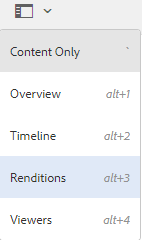
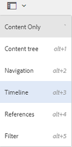

# Elementen beheren {#manage-assets}

In dit artikel wordt beschreven hoe u elementen beheert en bewerkt in Adobe Experience Manager (AEM)-middelen. Zie Elementen van [inhoudsfragmenten](content-fragments/content-fragments.md) voor het beheren van Content Fragments.

## Mappen maken {#creating-folders}

Wanneer u een verzameling elementen indeelt, bijvoorbeeld alle `Nature` afbeeldingen, kunt u mappen maken om ze bij elkaar te houden. U kunt mappen gebruiken om uw elementen te categoriseren en in te delen. Voor AEM-elementen hoeft u elementen niet in mappen te ordenen om beter te werken.

>[!NOTE]
>
>* Het delen van een map met middelen van dit type `sling:OrderedFolder`wordt niet ondersteund bij het delen naar de marketingcloud. Als u een map wilt delen, selecteert u niet [!UICONTROL Besteld] wanneer u een map maakt.
>* Met Experience Manager kunt u geen `subassets` woord als naam voor een map gebruiken. Het is een trefwoord dat is gereserveerd voor knooppunten die subassets voor samengestelde elementen bevatten

1. Navigeer naar de plaats in de map met digitale elementen waar u een nieuwe map wilt maken. Klik in het menu op **[!UICONTROL Maken]**. Selecteer **[!UICONTROL Nieuwe map]**.
1. Geef in het veld **[!UICONTROL Titel]** een mapnaam op. Standaard gebruikt DAM de titel die u als mapnaam hebt opgegeven. Nadat de map is gemaakt, kunt u de standaardinstelling overschrijven en een andere mapnaam opgeven.
1. Klik op **[!UICONTROL Maken]**. De map wordt weergegeven in de map met digitale middelen.

De volgende tekens (lijst met door spaties gescheiden tekens) worden niet ondersteund:

* De naam van een elementbestand mag geen van de volgende tekens bevatten: `* / : [ \\ ] | # % { } ? &`
* De naam van een elementmap mag geen van de volgende tekens bevatten: `* / : [ \\ ] | # % { } ? \" . ^ ; + & \t`

## Elementen uploaden {#uploading-assets}

Zie Digitale elementen [toevoegen aan Experience Manager](add-assets.md)voor meer informatie.

## Elementen voorvertonen {#previewing-assets}

Voer de volgende stappen uit om een voorvertoning van een element weer te geven.

1. Navigeer in de gebruikersinterface Elementen naar de locatie van het element waarvan u een voorvertoning wilt weergeven.
1. Tik op het gewenste element om het te openen.

1. In de voorvertoningsmodus zijn zoomopties beschikbaar voor [ondersteunde afbeeldingstypen](/help/assets/file-format-support.md) (met interactieve bewerking).

   Tik/klik op een vergrootglas `+` (of tik/klik op het vergrootglas van het element) om in te zoomen op een element. Tik/klik om uit te zoomen. `-` Wanneer u inzoomt, kunt u elk gebied van de afbeelding nauwkeurig bekijken door te pannen. Met de zoompijl opnieuw instellen keert u terug naar de oorspronkelijke weergave.

   Tik op **[!UICONTROL Herstellen]** om de weergave te herstellen naar de oorspronkelijke grootte.

## Eigenschappen bewerken {#editing-properties}

1. Navigeer naar de locatie van het element waarvan u de metagegevens wilt bewerken.

1. Selecteer het element en tik op **[!UICONTROL Eigenschappen]** /klik op de werkbalk om de eigenschappen van het element weer te geven. U kunt ook de snelle actie **[!UICONTROL Eigenschappen]** kiezen op de elementenkaart.

   

1. Bewerk op de pagina [!UICONTROL Eigenschappen] de eigenschappen van de metagegevens onder verschillende tabbladen. Bewerk bijvoorbeeld onder het tabblad **[!UICONTROL Standaard]** de titel, beschrijving, enzovoort.

   >[!NOTE]
   >
   >De indeling van de pagina [!UICONTROL Eigenschappen] en de beschikbare metagegevenseigenschappen zijn afhankelijk van het onderliggende metagegevensschema. Zie [!UICONTROL Metagegevensschema&#39;s voor meer informatie over het wijzigen van de indeling van de pagina] Eigenschappen .

1. To schedule a particular date/time for the activation of the asset, use the date picker beside the **[!UICONTROL On Time]** field.

   

1. Als u het element na een bepaalde duur wilt deactiveren, kiest u de datum/tijd van deactivering in de datumkiezer naast het veld **[!UICONTROL Uit-tijd]** . De deactiveringsdatum moet later zijn dan de activeringsdatum voor een element. Na de [!UICONTROL Off Time]zijn een middel en zijn vertoningen niet beschikbaar of via de Webinterface van Middelen of door HTTP API.

   

1. Selecteer een of meer tags in het veld **[!UICONTROL Codes]** . Als u een aangepaste tag wilt toevoegen, typt u de naam van de tag in het vak en drukt u op Enter. De nieuwe tag wordt opgeslagen in AEM.

   Op YouTube moeten labels publiceren en een koppeling naar YouTube hebben (als er een geschikte koppeling is gevonden).

   >[!NOTE]
   >
   >Als u tags wilt maken, moet u schrijfmachtigingen hebben op het `/content/cq:tags/default` pad in de CRX-opslagruimte.

1. Als u gebruiksstatistieken voor het element wilt weergeven, klikt of tikt u op het tabblad **[!UICONTROL Inzichten]** .

   De statistieken van het gebruik omvatten het volgende:

   * Aantal keer dat het element is weergegeven of gedownload
   * Kanalen/apparaten waardoor het middel werd gebruikt
   * Creatieve oplossingen waarbij het middel onlangs is gebruikt
   Zie [Asset Insights](assets-insights.md)voor meer informatie.

1. Tik/klik op **[!UICONTROL Opslaan en sluiten]**.

1. Navigeer naar de gebruikersinterface Elementen. De bewerkte eigenschappen van metagegevens, zoals titel, beschrijving en tags, worden weergegeven op de elementenkaart in de Kaart-weergave en onder de desbetreffende kolommen in de lijstweergave.

## Elementen kopiëren {#copying-assets}

Wanneer u een middel of een omslag kopieert, wordt het volledige middel of de omslag gekopieerd, samen met zijn inhoudsstructuur. Een gekopieerd middel of een omslag wordt gedupliceerd bij de doelplaats. Het element op de bronlocatie wordt niet gewijzigd.

Enkele kenmerken die uniek zijn voor een bepaalde kopie van een element, worden niet overgedragen. Enkele voorbeelden zijn:

* Element-id, aanmaakdatum en -tijd en versies en versiegeschiedenis. Sommige van deze eigenschappen worden aangegeven door de eigenschappen `jcr:uuid`, `jcr:created`en `cq:name`.

* De aanmaaktijd en de paden waarnaar wordt verwezen, zijn uniek voor elk element en elke uitvoering ervan.

De andere eigenschappen en metagegevens blijven behouden. Er wordt geen gedeeltelijke kopie gemaakt wanneer een element wordt gekopieerd.

1. Selecteer een of meer elementen in de interface Elementen en tik op het pictogram **[!UICONTROL Kopiëren]** op de werkbalk. U kunt ook de snelle actie **[!UICONTROL Copy]**  selecteren via de elementenkaart.

   >[!NOTE]
   >
   >Als u de snelle handeling [!UICONTROL Kopiëren] gebruikt, kunt u slechts één element tegelijk kopiëren.

1. Navigeer naar de locatie waar u de elementen wilt kopiëren.

   >[!NOTE]
   >
   >Als u een element op dezelfde locatie kopieert, genereert AEM automatisch een variatie in de naam. Als u bijvoorbeeld een element met de naam kopieert `Square`, genereert AEM automatisch de titel voor de kopie als `Square1`titel.

1. Klik op het pictogram Middelen **[!UICONTROL plakken]** op de werkbalk. Elementen worden naar deze locatie gekopieerd.

   

   >[!NOTE]
   >
   >Het pictogram **[!UICONTROL Plakken]** is beschikbaar op de werkbalk totdat de plakbewerking is voltooid.

### Elementen verplaatsen of hernoemen {#moving-or-renaming-assets}

1. Navigeer naar de locatie van het element dat u wilt verplaatsen.

1. Selecteer het element en tik/klik op het pictogram **[!UICONTROL Move]**  op de werkbalk.

1. Voer een van de volgende handelingen uit in de wizard Elementen verplaatsen:

   * Geef de naam voor het element op nadat het is verplaatst. Tik vervolgens op **[!UICONTROL Volgende]** of klik op Volgende om door te gaan.

   * Tik/klik op **[!UICONTROL Annuleren]** om het proces te stoppen.
   >[!NOTE]
   >
   >* U kunt dezelfde naam opgeven voor het element als er geen element met die naam is op de nieuwe locatie. U moet echter een andere naam gebruiken als u het element verplaatst naar een locatie waar zich een element met dezelfde naam bevindt. Als u dezelfde naam gebruikt, genereert het systeem automatisch een variatie in de naam. Als uw element bijvoorbeeld de naam Vierkant heeft, genereert het systeem de naam Vierkant1 voor de kopie.
   >* Bij het wijzigen van de naam is witruimte niet toegestaan in de bestandsnaam.

1. Voer een van de volgende handelingen uit in het dialoogvenster Doel **** selecteren:

   * Navigeer naar de nieuwe locatie voor de elementen en tik op **[!UICONTROL Volgende]** of klik op Volgende om door te gaan.

   * Tik/klik op **[!UICONTROL Vorige]** om terug te keren naar het scherm **[!UICONTROL Naam wijzigen]** .

1. Als de elementen die worden verplaatst, verwijzen naar pagina&#39;s, elementen of verzamelingen, wordt het tabblad Verwijzingen **** aanpassen weergegeven naast het tabblad **[!UICONTROL Doel]** selecteren.

   Voer een van de volgende handelingen uit in het scherm **[!UICONTROL Verwijzingen]** aanpassen:

   * Geef op welke referenties u wilt aanpassen op basis van de nieuwe details en tik op **[!UICONTROL Verplaatsen]** of klik op Verplaatsen om door te gaan.

   * In de kolom **[!UICONTROL Aanpassen]** selecteert of deselecteert u verwijzingen naar de elementen.
   * Tik/klik op **[!UICONTROL Vorige]** om terug te keren naar het scherm **[!UICONTROL Doel]** selecteren.

   * Tik/klik op **[!UICONTROL Annuleren]** om de verplaatsingsbewerking te stoppen.
   Als u verwijzingen niet bijwerkt, blijven ze naar het vorige pad van het element wijzen. Als u de referenties aanpast, worden deze bijgewerkt naar het nieuwe middelenpad.

### Uitvoeringen beheren {#managing-renditions}

1. U kunt uitvoeringen voor een element toevoegen of verwijderen, behalve voor het origineel. Navigeer naar de locatie van het element waaraan u uitvoeringen wilt toevoegen of verwijderen.

1. Tik/klik op het element om de elementpagina te openen.

   

1. Tik/klik op het pictogram GlobalNav en selecteer **[!UICONTROL Uitvoeringen]** in de lijst.

   

1. Geef in het deelvenster **[!UICONTROL Uitvoeringen]** de lijst weer met uitvoeringen die voor het element zijn gegenereerd.

   

   >[!NOTE]
   >
   >In AEM Assets wordt standaard de oorspronkelijke uitvoering van het element niet weergegeven in de voorvertoningsmodus. Als beheerder kunt u overlays gebruiken om AEM-elementen te configureren voor de weergave van originele uitvoeringen in de voorvertoningsmodus.

1. Selecteer een vertoning om de vertoning weer te geven of te verwijderen.

   **Een vertoning verwijderen**

   Selecteer een vertoning in het deelvenster **[!UICONTROL Uitvoeringen]** en tik op het pictogram Vertoning **** verwijderen of klik op de werkbalk.

   

   **Een nieuwe uitvoering uploaden**

   Navigate to the asset details page for the asset, and tap/click the **[!UICONTROL Add Rendition]** icon in the toolbar to upload a new rendition for the asset.

   

   >[!NOTE]
   >
   >If you select a rendition from the **[!UICONTROL Renditions]** panel, the toolbar changes context and displays only those actions that are relevant to the rendition. Opties zoals het pictogram Uitvoering uploaden worden niet weergegeven. Ga naar de pagina met details voor de asset om deze opties in de werkbalk weer te geven.

   U kunt de afmetingen configureren voor de vertoning die u wilt weergeven op de detailpagina van een afbeelding of video-element. Op basis van de afmetingen die u opgeeft, wordt de vertoning in AEM-elementen weergegeven met de exacte of dichtstbijzijnde afmetingen.

   Als u weergaveafmetingen van een afbeelding op het niveau van de assetdetails wilt configureren, overlapt u het knooppunt `renditionpicker` (`libs/dam/gui/content/assets/assetpage/jcr:content/body/content/content/items/assetdetail/items/col1/items/assetview/renditionpicker`) en configureert u de waarde van de breedte-eigenschap. Configure the property **[!UICONTROL size (Long) in KB]** in place of width to customize rendition on asset detail page based on image size. Voor aanpassing op basis van grootte wijst de eigenschap `preferOriginal` de voorkeur toe aan het origineel als de grootte van de overeenkomstige weergave groter is dan het origineel.

   Op dezelfde manier kunt u de afbeelding van de pagina Annotatie aanpassen door deze te bedekken `libs/dam/gui/content/assets/annotate/jcr:content/body/content/content/items/content/renditionpicker`.

   

   Als u vertoningsdimensies voor een video-element wilt configureren, navigeert u naar het `videopicker` knooppunt in de CRX-opslagruimte op de locatie `/libs/dam/gui/content/assets/assetpage/jcr:content/body/content/content/items/assetdetail/items/col1/items/assetview/videopicker`, bedekt u het knooppunt en bewerkt u de juiste eigenschap.

   >[!NOTE]
   >
   >Videoannotaties worden alleen ondersteund in browsers met HTML5-compatibele video-indelingen. Afhankelijk van de browser worden bovendien verschillende video-indelingen ondersteund.

## Elementen verwijderen {#delete-assets}

Als u de inkomende verwijzingen van andere pagina&#39;s wilt oplossen of verwijderen, werkt u de relevante verwijzingen bij voordat u een element verwijdert.

Schakel ook de knop forceren verwijderen uit met behulp van een overlay, zodat gebruikers geen bestanden waarnaar wordt verwezen kunnen verwijderen en verbroken koppelingen behouden blijven.

1. Navigeer naar de locatie van de elementen die u wilt verwijderen.

1. Selecteer het element en tik/klik op het pictogram **[!UICONTROL Verwijderen]** op de werkbalk.

   

1. Klik in het bevestigingsdialoogvenster op:

   * **[!UICONTROL Annuleren]** om de handeling te stoppen
   * **[!UICONTROL Verwijder]** om de handeling te bevestigen:

      * Als het element geen verwijzingen bevat, wordt het element verwijderd.
      * Als het element verwijzingen bevat, wordt u via een foutbericht geïnformeerd dat naar **een of meer elementen wordt verwezen.** U kunt Verwijderen **[!UICONTROL forceren]** of **[!UICONTROL Annuleren]** selecteren.
   >[!NOTE]
   >
   >U hebt verwijdermachtigingen voor dam/asset nodig om een element te kunnen verwijderen. Als u alleen over wijzigingsmachtigingen beschikt, kunt u alleen de metagegevens van de elementen bewerken en annotaties toevoegen aan het element. U kunt het element of de metagegevens echter niet verwijderen.

   >[!NOTE]
   >
   >Als u de inkomende verwijzingen van andere pagina&#39;s wilt oplossen of verwijderen, werkt u de relevante verwijzingen bij voordat u een element verwijdert.
   >
   >
   >Schakel ook de knop forceren verwijderen uit met behulp van een overlay, zodat gebruikers geen bestanden waarnaar wordt verwezen kunnen verwijderen en verbroken koppelingen behouden blijven.

## Elementen downloaden {#download-assets}

See [Download assets from AEM](/help/assets/download-assets-from-aem.md).

## Elementen publiceren {#publish-assets}

<!--
>[!NOTE]
>
>For more information specific to Dynamic Media, see [Publishing Dynamic Media Assets.](/help/assets/dynamic-media/publishing-dynamicmedia-assets.md)
-->

1. Navigeer naar de locatie van de elementen/map die u wilt publiceren.

1. Either select the **[!UICONTROL Publish]** quick action from the asset card, or select the asset and tap/click the **[!UICONTROL Quick Publish]** icon from the toolbar.
1. Als het element verwijst naar andere elementen, worden de verwijzingen ervan weergegeven in de wizard. Alleen verwijzingen die niet-gepubliceerd of gewijzigd zijn sinds ze voor het laatst zijn gepubliceerd/niet gepubliceerd, worden weergegeven. Kies de referenties die u wilt publiceren.

   

   >[!NOTE]
   >
   >Als de map die u wilt publiceren een lege map bevat, wordt de lege map niet gepubliceerd.

1. Tik/klik op **[!UICONTROL Publiceren]** om de activering van de elementen te bevestigen.

>[!CAUTION]
>
>Als u elementen publiceert die worden verwerkt, wordt alleen de oorspronkelijke inhoud gepubliceerd. De uitvoeringen ontbreken. Wacht tot de verwerking is voltooid en publiceer het element of publiceer het opnieuw nadat de verwerking is voltooid.

## Elementen verwijderen {#unpublishing-assets}

1. Navigeer naar de locatie van de map met middelen die u uit de publicatieomgeving wilt verwijderen (publicatie ongedaan maken).

1. Selecteer het element of de map waarvan u de publicatie wilt ongedaan maken, en tik op het pictogram Publicatie **** beheren of klik op de werkbalk.

   

1. Selecteer de actie **[!UICONTROL Unpublish]** in de lijst.

   

1. Als u de publicatie van het element later ongedaan wilt maken, selecteert u Later **** publiceren ongedaan maken en selecteert u een datum voor het ongedaan maken van de publicatie van het element.
1. Plan een datum waarop het element niet beschikbaar is in de publicatieomgeving.
1. Als het element verwijst naar andere elementen, kiest u de verwijzingen die u ongedaan wilt maken. Tik/klik op **[!UICONTROL Publiceren]** ongedaan maken.
1. Tik/klik in het bevestigingsvenster op:

   * **[!UICONTROL Annuleren]** om de handeling te stoppen
   * **[!UICONTROL Publiceren]** ongedaan maken om te bevestigen dat de elementen op de opgegeven datum niet gepubliceerd zijn (niet meer beschikbaar in de publicatieomgeving).
   >[!NOTE]
   >
   >Wanneer u de publicatie van een complex element ongedaan maakt, maakt u alleen het element bekend. Maak de publicatie van de referenties niet ongedaan omdat mogelijk naar deze verwijzingen wordt verwezen door andere gepubliceerde elementen.

## Gesloten gebruikersgroep {#closed-user-group}

Een gesloten gebruikersgroep (CUG) wordt gebruikt om toegang tot specifieke activaomslagen te beperken die van AEM worden gepubliceerd. Als u een CUG maakt voor een map, is de toegang tot de map (inclusief mapelementen en submappen) beperkt tot alleen toegewezen leden of groepen. Om tot de omslag toegang te hebben, moeten zij login gebruikend hun veiligheidsgeloofsbrieven.

CUG&#39;s zijn een extra manier om de toegang tot uw elementen te beperken. U kunt ook een aanmeldingspagina voor de map configureren.

1. Selecteer een map in de interface Middelen en tik op het pictogram Eigenschappen op de werkbalk of klik erop om de pagina met eigenschappen weer te geven.
1. Voeg op het tabblad **[!UICONTROL Machtigingen]** leden of groepen toe onder **[!UICONTROL Gesloten gebruikersgroep]**.

   

1. Als u een aanmeldingsscherm wilt weergeven wanneer gebruikers de map openen, selecteert u de optie **[!UICONTROL Inschakelen]** . Selecteer vervolgens het pad naar een aanmeldingspagina in AEM en sla de wijzigingen op.

   

   >[!NOTE]
   >
   >Als u het pad naar een aanmeldingspagina niet opgeeft, geeft AEM de standaardaanmeldingspagina weer in de publicatie-instantie.

1. Publiceer de map en probeer deze vervolgens te openen vanuit de publicatie-instantie. Er wordt een aanmeldingsscherm weergegeven.
1. Als u lid van de GECG bent, ga uw veiligheidsgeloofsbrieven in. De map wordt weergegeven nadat AEM u heeft geverifieerd.

## Assets doorzoeken {#search-assets}

Het zoeken naar middelen is van cruciaal belang voor het gebruik van een systeem voor het beheer van digitale activa — of het nu gaat om verder gebruik door creatieve ondernemingen, voor een robuust beheer van activa door zakelijke gebruikers en marketeers, of voor beheer door DAM-beheerders.

Voor eenvoudige, geavanceerde, en douaneonderzoeken om de meest aangewezen activa te ontdekken en te gebruiken, zie [onderzoeksactiva in AEM](/help/assets/search-assets.md).

## Snelle acties {#quick-actions}

De snelle actiepictogrammen zijn beschikbaar voor één middel tegelijkertijd. Voer afhankelijk van het apparaat de volgende handelingen uit om de snelactiepictogrammen weer te geven:

* Aanraakapparaten: Raak aan en houd de muisknop ingedrukt. Op een iPad kunt u bijvoorbeeld tikken en een element ingedrukt houden, zodat de snelle acties worden weergegeven.
* Niet-aanraakapparaten: Aanwijzer aanwijzen. Op een bureaubladapparaat wordt bijvoorbeeld de snelle actiebalk weergegeven als u de aanwijzer boven de elementminiatuur houdt.

## Afbeeldingen bewerken {#editing-images}

Met de bewerkingsgereedschappen in de interface AEM Assets kunt u kleine bewerkingstaken uitvoeren op afbeeldingselementen. U kunt afbeeldingen uitsnijden, roteren, spiegelen en andere bewerkingstaken uitvoeren. U kunt ook afbeeldingen met hyperlinks toevoegen aan elementen.

>[!NOTE]
>
>Voor sommige componenten zijn er extra opties beschikbaar voor de modus Volledig scherm.

1. Voer een van de volgende handelingen uit om een element te openen in de bewerkingsmodus:

   * Selecteer het element en klik/tik op het pictogram **[!UICONTROL Bewerken]** op de werkbalk.
   * Tik op het pictogram **[!UICONTROL Bewerken]** of klik op het pictogram dat op een element in de kaartweergave wordt weergegeven.
   * Tik op of klik op het pictogram **[!UICONTROL Bewerken]** op de werkbalk op de elementpagina.
   

1. Tik of klik op het pictogram **Uitsnijden** om de afbeelding uit te snijden.

   

1. Selecteer de gewenste optie in de lijst. Het bijsnijdgebied wordt op basis van de gekozen optie weergegeven in de afbeelding. Met de optie **Vrije hand** kunt u de afbeelding bijsnijden zonder beperkingen voor de hoogte-breedteverhouding.

   

1. Selecteer het gebied dat u wilt bijsnijden en wijzig de grootte of de positie van het gebied in de afbeelding.
1. Gebruik het pictogram **Voltooien** (rechterbovenhoek) om de afbeelding uit te snijden. Als u op het pictogram **Voltooien** klikt, wordt de rendering ook opnieuw gegenereerd.

   

1. Gebruik de pictogrammen **Ongedaan maken** en **Opnieuw uitvoeren** rechtsboven om respectievelijk terug te keren naar de niet-bijgesneden afbeelding of de bijgesneden afbeelding te behouden.

   

1. Tik/klik op het betreffende rotatiepictogram om de afbeelding rechtsom of linksom te roteren.

   

1. Tik/klik op het betreffende pictogram Omdraaien om de afbeelding horizontaal of verticaal om te draaien.

   

1. Tik/klik op het pictogram **Voltooien** om de wijzigingen op te slaan.

   

>[!NOTE]
>
>Beeldbewerking wordt ondersteund voor de bestandsindelingen BMP, GIF, PNG en JPEG.

<!-- You can also add image maps using the image editor. For details, see [Adding Image Maps](/help/assets/image-maps.md). -->

>[!NOTE]
>
>Om een TXT- dossier uit te geven, plaats **Dag CQ Verbinding Externalzer** van de Manager van de Configuratie.

## Tijdlijn {#timeline}

In de tijdlijn kunt u verschillende gebeurtenissen voor een geselecteerd item weergeven, zoals actieve workflows voor een element, opmerkingen/annotaties, activiteitenlogbestanden en versies.

*Afbeelding sorteren: Tijdlijnitems voor een element sorteren*

>[!NOTE]
>
>In de [Collections-console](/help/assets/manage-collections.md#navigate-the-collections-console)biedt de lijst **[!UICONTROL Alles]** tonen opties voor alleen het weergeven van opmerkingen en workflows. Bovendien wordt de chronologie getoond slechts voor top-level inzamelingen die in de console vermeld zijn. Deze wordt niet weergegeven als u in een van de verzamelingen navigeert.

>[!NOTE]
>
>De tijdlijn bevat verschillende [opties die specifiek zijn voor inhoudsfragmenten](content-fragments/content-fragments.md).

## Annotatie {#annotating}

Annotaties zijn opmerkingen of toelichtingen die aan afbeeldingen of video&#39;s worden toegevoegd. Annotaties bieden marketers de mogelijkheid samen te werken en feedback over middelen te geven.

Videoannotaties worden alleen ondersteund in browsers met HTML5-compatibele video-indelingen. De video-indelingen die door AEM Assets worden ondersteund, zijn afhankelijk van de browser.

>[!NOTE]
>
>Voor inhoudsfragmenten worden [annotaties gemaakt in de fragmenteditor](content-fragments/content-fragments.md).

1. Navigeer naar de locatie van het element waaraan u annotaties wilt toevoegen.
1. Tik op het pictogram **[!UICONTROL Annoteren]** of klik op een van de volgende opties:

   * [Snelle acties](#quick-actions)
   * Vanuit de werkbalk nadat u het element hebt geselecteerd of naar de elementpagina bent genavigeerd
   

1. Add a comment in the **[!UICONTROL Comment]** box at the bottom of the timeline. Alternatively, mark up an area on the image and add an annotation in the **[!UICONTROL Add Annotation]** dialog.

   

<!--
1. To notify a user about an annotation, specify the email address of the user and add the comment. For example, to notify Aaron MacDonald about an annotation, enter @aa. Hints for all matching users is displayed in a list. Select Aaron's email address from the list to tag her with the comment. Similarly, you can tag more users anywhere within the annotation or before or after it.

   >[!NOTE]
   >
   >For a non-administrator user, suggestions appear only if the user has Read permissions at `/home` in CRXDE.

   

1. After adding the annotation, click **[!UICONTROL Add]** to save it. A notification for the annotation is sent to Aaron.

   

   >[!NOTE]
   >
   >You can add multiple annotations, before you save them.

1. Tap/click **[!UICONTROL Close]** to exit from the Annotation mode.
1. To view the notification, log in to AEM Assets with Aaron MacDonald's credentials and click the **[!UICONTROL Notifications]** icon to view the notification.

   >[!NOTE]
   >
   >Annotations can also be added to video assets. While annotating videos, the player pauses to let you annotate on a frame. For details, see [managing video assets](manage-video-assets.md).

1. To choose a different color so you can differentiate between users, click/tap the Profile icon and click/tap **[!UICONTROL My Preferences]**.

   

   Specify the desired color in the **[!UICONTROL Annotation Color]** box and then click/tap **[!UICONTROL Accept]**.

   

>[!NOTE]
>
>You can also add annotations to a collection. However, if a collection contains child collections, you can add annotations/comments to the parent collection only. The Annotate option is not available for child collections.

### View saved annotations {#viewing-saved-annotations}

1. To view saved annotations for an asset, navigate to the location of the asset and open the asset page for the asset.

1. Tap/click the GlobalNav icon, and choose **[!UICONTROL Timeline]** from the list.

   

1. From the **[!UICONTROL Show All]** list in the timeline, select **[!UICONTROL Comments]** to filter the results based on annotations.

   

   Tap/click a comment in the **[!UICONTROL Timeline]** panel to view the corresponding annotation on the image.

   

   Tap/click **[!UICONTROL Delete]**, to delete a particular comment.

### Print annotations {#printing-annotations}

If an asset has annotations or it has been subjected to a review workflow, you can print the asset along with annotations and review status as a PDF file for offline review.

You can also choose to print only the annotations or review status.

To print the annotations and review status, tap/click the **[!UICONTROL Print]** icon and follow the instructions in the wizard. The **[!UICONTROL Print]** icon appears in the toolbar only when the asset has at least one annotation or review status assigned to it.

1. From the Assets UI, open the preview page for an asset.
1. Do one of the following:

    * To print all the annotations and the review status, skip step 3 and directly go to step 4.
    * To print specific annotations and review status, open the [timeline](/help/assets/manage-digital-assets.md#timeline) and then go to step 3.

1. To print specific annotations, select the annotations from the timeline.

   

   To print the review status only, select it from the timeline.

   

1. Tap/click the **[!UICONTROL Print]** icon from the toolbar.

   

1. From the Print dialog, choose the position you want the annotations/review status to be displayed on the PDF. For example, if you want the annotations/status to be printed at the top-right of the page that contains the printed image, use the **Top-Left** setting. It is selected by default.

   

   You can choose other settings depending on the position where you want the annotations/status to appear in the printed PDF. If you want the annotations/status to appear in a page that is separate from the printed asset, choose **[!UICONTROL Next Page]**.

   >[!NOTE]
   >
   >Lengthy annotations may not render properly in the PDF file. For optimal rendering, Adobe recommends that you limit annotations to 50 words.

1. Tap/click **[!UICONTROL Print]**. Depending upon the option you choose in step 2, the generated PDF displays the annotations/status at the specified position. For example, if you choose to print both annotations and the review status using the **Top-Left** setting, the generated output resembles the PDF file depicted here.

   

1. Download or print the PDF using the options at the top-right.

   

   To modify the appearance of the rendered PDF file, for example the font color, size, and style, background color of the comments and statuses, open the **[!UICONTROL Annotation PDF configuration]** from Configuration Manager, and modify the desired options. For example, to change the display color of the approved status, modify the color code in the corresponding field. For information around changing the font color of annotations, see [Annotating](/help/assets/manage-digital-assets.md#annotating).

   

   Return to the rendered PDF file and refresh it. The refreshed PDF reflects the changes you made.

## Asset versioning {#asset-versioning}

Versioning creates a snapshot of digital assets at a specific point in time. Versioning helps restore assets to a previous state at a later time. For example, if you want to undo a change that you made to an asset, restore the unedited version of the asset.

The following are scenarios where you create versions:

* You modify an image in a different application and upload to AEM Assets. A version of the image is created so your original image is not overwritten.
* You edit the metadata of an asset.
* You use AEM desktop app to checkout an existing asset and save your changes. A new version is created everytime the asset is saved.

You can also enable automatic versioning through a workflow. When you create a version for an asset, the metadata and renditions are saved along with the version. Renditions are rendered alternatives of the same images, for example, a PNG rendition of an uploaded JPEG file.

The versioning functionality lets you do the following:

* Create a version of an asset.
* View the current revision for an asset.
* Restore the asset to a previous version.

1. Navigate to the location of the asset for which you want to create a version, and tap/click it to open its asset page.

1. Tap/click the GlobalNav icon, and the choose **[!UICONTROL Timeline]** from the menu.

   

1. Tap/click the **[!UICONTROL Actions]** (arrow) icon at the bottom to view the available actions you can perform on the asset.

   

1. Tap/click **[!UICONTROL Save as Version]** to create a version for the asset.

   

1. Add a label and comment, and then click **[!UICONTROL Create]** to create a version. Alternatively, tap/click **Cancel** to exit the operation.

   

1. To view the new version, open the **[!UICONTROL Show All]** list in the timeline from the asset details page or the Assets UI, and choose **[!UICONTROL Versions]**. All versions created for an asset are listed under the timeline tab. You can filter the list to show Versions, by clicking the drop arrow and selecting **[!UICONTROL Versions]** from the list.

   

1. Select a specific version for the asset to preview it or enable it to appear in the Assets UI.

   

1. Add a label and comment for the version to revert to the particular version in the Assets UI.

   

1. To generate a preview for the version, tap/click **[!UICONTROL Preview Version]**.
1. To display this version in the Assets UI, select **[!UICONTROL Revert to this Version]**.
1. To compare between two versions, go to asset page of the asset and tap/click the version to be compared with the current version.

   

1. From the timeline, select the version you want to compare and drag the slider to the left to superimpose this version over the current version and compare.

   

### Starte a workflow on an asset {#starting-a-workflow-on-an-asset}

1. Navigate to the location of the asset for which you want to start a workflow, and tap/click the asset to open the asset page.
1. Tap/click the GlobalNav icon, and the choose **[!UICONTROL Timeline]** from the menu to display the timeline.

   

1. Tap/click the **[!UICONTROL Actions]** (arrow) icon at the bottom to open the list of actions available for the asset.

   

1. Tap/click **[!UICONTROL Start Workflow]** from the list.

   

1. In the **[!UICONTROL Start Workflow]** dialog, select a workflow model from the list.

   

1. (Optional) Specify a title for the workflow, which can be used to reference the workflow instance.

   

1. Tap/click **[!UICONTROL Start]** and then tap/click **[!UICONTROL Proceed]** in the dialog to confirm. Each step of workflow is displayed in the timeline as an event.

   

## Collections {#collections}

A collection is an ordered set of assets. Use collections to share assets between users.

* A collection can include assets from different locations because they only contain references to these assets. Each collection maintains the referential integrity of assets.
* You can share collections with multiple users with different privilege levels, including editing, viewing, and so on.

See [Managing Collections](/help/assets/manage-collections.md) for details on collection management.
