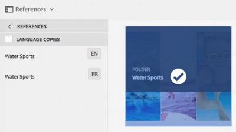

# Samengestelde elementen beheren {#managing-compound-assets}

Met Adobe Experience Manager (AEM) kunt u nagaan of een geüpload bestand verwijzingen bevat naar elementen die al in de opslagplaats bestaan. Deze functie is alleen beschikbaar voor ondersteunde bestandsindelingen. Als het geüploade element verwijzingen naar AEM-elementen bevat, wordt een bidirectionele koppeling gemaakt tussen de geüploade en de gerefereerde elementen.

Naast redundantie elimineert u door te verwijzen naar AEM-middelen in Adobe Creative Cloud-toepassingen de samenwerking en verhoogt u de efficiëntie en productiviteit van gebruikers.

AEM-elementen ondersteunen **bidirectionele verwijzingen**. U vindt de middelen waarnaar wordt verwezen op de elementdetailpagina van het geüploade bestand. Daarnaast kunt u de bestanden waarnaar wordt verwezen voor AEM-elementen bekijken op de pagina met elementdetails van het element waarnaar wordt verwezen.

Verwijzingen worden opgelost op basis van pad, document-id en instantie-id van de middelen waarnaar wordt verwezen.

## AEM-elementen toevoegen als verwijzingen in Adobe Illustrator {#refai}

U kunt vanuit een Adobe Illustrator-bestand verwijzen naar bestaande AEM-elementen.

1. Plaats met de [AEM-bureaubladtoepassing](https://docs.adobe.com/content/help/en/experience-manager-desktop-app/using/using.html)de opslagplaats voor AEM-middelen als een station op uw lokale computer. Navigeer in het gekoppelde station naar de locatie van het element waarnaar u wilt verwijzen.
1. Sleep het element van het gekoppelde station naar het Illustrator-bestand.
1. Sla het Illustrator-bestand op het gekoppelde station op of [upload het bestand naar](/help/assets/manage-digital-assets.md#uploading-assets) de AEM-opslagplaats.
1. Nadat de workflow is voltooid, gaat u naar de pagina met elementdetails voor het element. De verwijzingen naar bestaande activa AEM zijn vermeld onder **Afhankelijkheden** in de **kolom van Verwijzingen** .

   

1. De middelen waarnaar wordt verwezen die onder **Afhankelijkheden** verschijnen kunnen ook door dossiers buiten huidige worden van verwijzingen voorzien. Als u een lijst met referentiebestanden voor een element wilt weergeven, klikt u op het element onder **Afhankelijkheden**.

   

1. Klik op het pictogram **Weergave-eigenschappen** op de werkbalk. De lijst met bestanden die verwijzen naar het huidige element op de pagina met eigenschappen wordt weergegeven onder de kolom **Verwijzingen** op het tabblad **Standaard** .

   

## AEM-elementen toevoegen als verwijzingen in Adobe InDesign {#add-aem-assets-as-references-in-adobe-indesign}

Als u vanuit een InDesign-bestand wilt verwijzen naar AEM-elementen, sleept u AEM-elementen naar het InDesign-bestand of exporteert u het InDesign-bestand als een ZIP-bestand.

De activa waarnaar wordt verwezen bestaan reeds in activa AEM. <!-- You can extract subassets by [configuring InDesign server](/help/assets/indesign.md). Embedded assets in an InDesign file are extracted as subassets. -->

>[!NOTE]
>
>Als de InDesign-server is proxy, is de voorvertoning van InDesign-bestanden ingesloten in de XMP-metagegevens. In dit geval is het niet expliciet vereist miniatuurextractie uit te voeren. Als de InDesign-server echter geen proxy is, moeten miniaturen expliciet worden geëxtraheerd voor InDesign-bestanden.

### Verwijzingen maken door AEM-elementen te slepen {#create-references-by-dragging-aem-assets}

Deze procedure is vergelijkbaar met het [toevoegen van AEM-elementen als verwijzingen in Adobe Illustrator](#refai).

### Verwijzingen naar AEM-elementen maken door een ZIP-bestand te exporteren {#create-references-to-aem-assets-by-exporting-a-zip-file}

1. Maak een nieuw workflowmodel.
1. Met de functie Pakket van Adobe InDesign kunt u het document exporteren.
Adobe InDesign kan een document en de gekoppelde elementen als een pakket exporteren. In dit geval bevat de geëxporteerde map een map Koppelingen met subelementen in het InDesign-bestand.
1. Maak een ZIP-bestand en upload het naar de AEM-opslagplaats.
1. Start de Unarchiver-workflow.
1. Wanneer de werkstroom is voltooid, wordt er automatisch naar de verwijzingen in de map Koppelingen verwezen als subelementen. Als u een lijst met de desbetreffende elementen wilt weergeven, navigeert u naar de pagina met elementdetails in het InDesign-element en sluit u de [Rail](/help/sites-cloud/authoring/getting-started/basic-handling.md#rail-selector).

## AEM-elementen toevoegen als verwijzingen in Adobe Photoshop {#refps}

1. Met een WebDav-client kunt u AEM-middelen monteren als een station.
1. Als u verwijzingen naar AEM-elementen in een Photoshop-bestand wilt maken, navigeert u met de functie Gekoppelde plaatsen in Photoshop naar de overeenkomstige elementen in het gekoppelde station.

   

1. Opslaan in Photoshop-bestand op het gekoppelde station of [uploaden](/help/assets/manage-digital-assets.md#uploading-assets) naar de AEM-opslagplaats.
1. Nadat de werkstroom is voltooid, worden de verwijzingen naar bestaande AEM-elementen weergegeven op de pagina met elementdetails.

   Als u de middelen waarnaar wordt verwezen wilt weergeven, sluit u de [Rail](/help/sites-cloud/authoring/getting-started/basic-handling.md#rail-selector) op de pagina met elementdetails.

1. De middelen waarnaar wordt verwezen, bevatten ook de lijst met elementen waarnaar wordt verwezen. Als u een lijst met middelen waarnaar wordt verwezen wilt weergeven, navigeert u naar de pagina met elementdetails en sluit u de [Rail](/help/sites-cloud/authoring/getting-started/basic-handling.md#rail-selector).

>[!NOTE]
>
>Er kan ook worden verwezen naar de elementen in samengestelde elementen op basis van hun document-id en instantie-id. Deze functionaliteit is alleen beschikbaar in Adobe Illustrator- en Adobe Photoshop-versies. Voor andere toepassingen vindt de verwijzing plaats op basis van het relatieve pad van gekoppelde elementen in het belangrijkste samengestelde element, zoals dat in eerdere versies van AEM is gebeurd.

## Pagina&#39;s van een bestand met meerdere pagina&#39;s weergeven {#view-pages-of-a-multi-page-file}

Met de functie Paginaviewer van AEM Assets kunt u afzonderlijke pagina&#39;s van bestanden met meerdere pagina&#39;s weergeven, zoals PDF-, INDD-, PPT-, PPTX- en AI-bestanden. Voor InDesign kunt u pagina&#39;s uitnemen met InDesign-server. Als de voorvertoningen van pagina&#39;s worden opgeslagen tijdens het maken van InDesign-bestanden, is InDesign Server niet vereist voor het uitnemen van pagina&#39;s.

U kunt door individuele pagina&#39;s van een dossier van de elementenpagina doorbladeren. Met de opties op de werkbalk kunt u afzonderlijke pagina&#39;s van het bestand van notities voorzien. U kunt ook de optie **Paginaoverzicht** gebruiken om alle pagina&#39;s tegelijk weer te geven.

1. Navigeer naar de map in AEM Assets die het bestand met meerdere pagina&#39;s bevat.
1. Klik op het element om de elementpagina weer te geven.

   

1. Klik op het pictogram Global Nav en kies vervolgens **Pagina&#39;s** in het menu.

   

1. Klik op de pijlen links of rechts onder de afbeelding om naar afzonderlijke pagina&#39;s van het bestand te navigeren.

   

1. Als u een pagina wilt annoteren, klikt u op het pictogram **Notitie** op de werkbalk en voegt u een opmerking toe.

   

1. Klik op het pictogram **Downloaden** om het bestand te downloaden.

   

1. Als u alle pagina&#39;s van het bestand tegelijk wilt weergeven, klikt u op het pictogram **Paginaoverzicht** .

   

1. Als u de activiteitsstroom voor het bestand wilt weergeven, inclusief annotaties en downloads, klikt u op het algemene navigatiepictogram en kiest u vervolgens **Tijdlijn** in het menu.

   

1. Als u de eigenschappen van de metagegevens van de pagina wilt weergeven en bewerken, klikt u op het pictogram Eigenschappen **van** weergave op de werkbalk.

   
