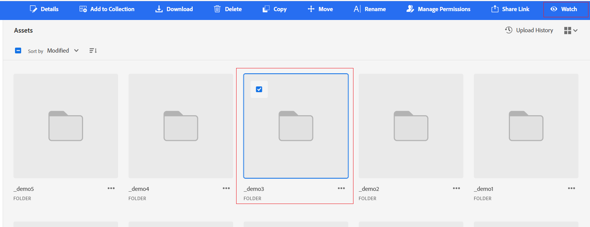

# Middelen, mappen en verzamelingen controleren {#watch-assets-folders}

Met de middelenweergavemeldingen kunt u de bewerkingen controleren die worden uitgevoerd op de middelen, mappen of verzamelingen in de opslagplaats. U moet de inhoud selecteren en zich erop abonneren waarvoor de meldingen naar u worden verzonden. U kunt ook de categorieën configureren waarvoor de meldingen naar u worden verzonden.

## Abonneren op berichtcategorieën {#subscribe-to-notification-categories}

U kunt een keuze maken in een lijst met categorieën en u kunt zich hierop abonneren. In de weergave Middelen worden de meldingen alleen naar u verzonden voor de categorieën die u selecteert uit de beschikbare opties:

<table>
    <tbody>
     <tr>
      <th><strong>Berichtcategorie</strong></th>
      <th><strong>Beschrijving</strong></th>
     </tr>
     <tr>
      <td>Verzoeken</td>
      <td>Wanneer u een taak toewijst aan een gebruiker, ontvangt u meldingen wanneer die gebruiker op die taak acties uitvoert.</td>
     </tr>
     <tr>
      <td>Toegewezen aan mij</td>
      <td>U ontvangt een bericht wanneer er een taak aan u van een andere gebruiker is toegewezen.</td>
     </tr>
     <tr>
      <td>Opmerkingen over geabonneerde inhoud</td>
      <td>U ontvangt een bericht wanneer een gebruiker opmerkingen maakt over uw geabonneerde element.</td>
     </tr>
     <tr>
      <td>Verwijderen van geabonneerde inhoud</td>
      <td>U ontvangt een melding wanneer een gebruiker uw geabonneerde element, map of verzameling verwijdert.</td>
     </tr>
     <tr>
      <td>Extern aandeel van geabonneerde inhoud</td>
      <td>U ontvangt een bericht wanneer een gebruiker een openbare verbinding voor uw ingetekende activa, omslag, of inzameling produceert.</td>
     </tr>
     <tr>
      <td>Wijziging van geabonneerde inhoud</td>
      <td>U ontvangt een melding wanneer een gebruiker een nieuwe versie voor uw geabonneerde element maakt.</td>
     </tr>
     <tr>
      <td>Naam van geabonneerde inhoud verplaatsen/wijzigen</td>
      <td>U ontvangt een melding wanneer een gebruiker uw geabonneerde element of map verplaatst of hernoemt.</td>
     </tr>
     <tr>
      <td>Updates voor geabonneerde mappen en verzamelingen</td>
      <td>U ontvangt een melding wanneer een gebruiker middelen toevoegt of verwijdert uit een geabonneerde map of verzameling.</td>
     </tr>    
    </tbody>
   </table>

Abonneer u op de berichtcategorieën:

1. Klikken  rechts van de menubalk in de gebruikersinterface van de middelenweergave.

1. Klikken  om de [!UICONTROL Experience Cloud preferences] pagina.

1. Klik op de knop **[!UICONTROL Notifications]** beschikbaar in het linkerdeelvenster.

1. In de **[!UICONTROL Notifications]** , naar de sectie [!UICONTROL Assets view] en zorgt u ervoor dat de schakeloptie wordt overgeschakeld naar de status ON.

   

1. Klikken **[!UICONTROL Customize]** om de berichtcategorieën te bekijken.
   

1. Selecteer de berichtcategorieën waarvoor u op de hoogte moet worden gesteld.

## Mappen, elementen of verzamelingen controleren en de controle ervan opheffen {#watch-unwatch-assets}

Na [abonneren op de berichtcategorieën](#subscribe-to-notification-categories), moet u zich op de inhoud abonneren om meldingen te ontvangen.

>[!NOTE]
>
>* Voor **[!UICONTROL Requests]** en **[!UICONTROL Assigned to me]** berichtcategorieën. U hoeft zich niet op de inhoud te abonneren nadat u zich hebt geabonneerd op de berichtcategorieën. Meldingen worden automatisch naar u verzonden voor aanvragen die u hebt gemaakt en wanneer een taak aan u is toegewezen.
>* In de weergave Elementen worden alleen meldingen verzonden wanneer andere gebruikers handelingen op de geabonneerde inhoud uitvoeren. U ontvangt geen meldingen voor de acties die u uitvoert op de geabonneerde inhoud.

Als u zich wilt abonneren op de inhoud, selecteert u de map, het middel of de verzameling waarop u zich wilt abonneren en klikt u **[!UICONTROL Watch]**.

In de weergave Elementen wordt een succesbericht weergegeven. U kunt op **[!UICONTROL Go to notification preferences]** beschikbaar op het succesbericht om uw [abonnement op berichtcategorieën](#subscribe-to-notification-categories).

In de weergave Elementen worden nu meldingen verzonden voor de geabonneerde categorieën. U kunt ook meerdere elementen, mappen of verzamelingen selecteren en op **[!UICONTROL Watch]** tijd besparen. Als u echter meerdere entiteiten selecteert waarop een aantal van deze al is geabonneerd, **[!UICONTROL Watch]** wordt niet weergegeven.

Als u uw abonnement wilt opzeggen, selecteert u het element, de map of de verzameling waarvoor u een abonnement hebt genomen en klikt u op **[!UICONTROL Unwatch]**.

## Meldingen weergeven {#view-notifications}

De meldingen worden rechts op de menubalk in de gebruikersinterface van de weergave Elementen weergegeven.

Wanneer u op een melding klikt, navigeert de middelenweergave u naar het juiste middel of de juiste map waarnaar in het bericht wordt verwezen.
