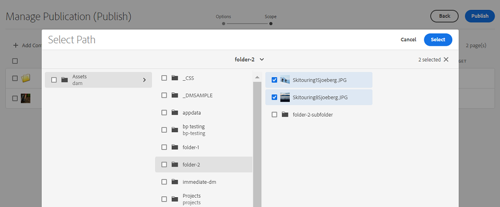
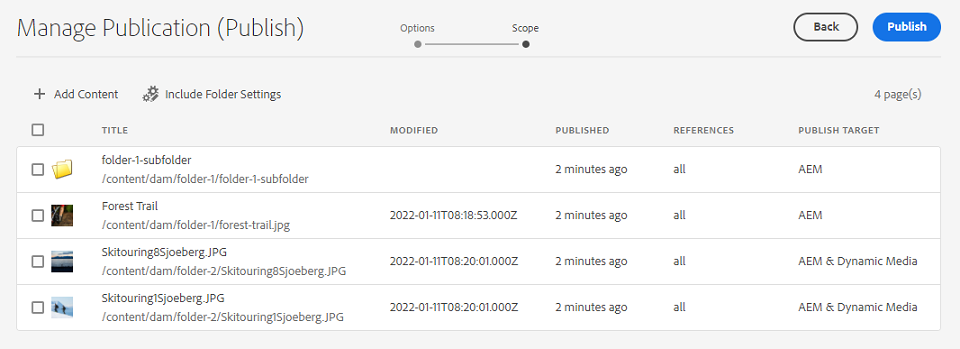

# Publicaties beheren in Experience Manager Assets {#manage-publication-in-aem}

Als [!DNL Adobe Experience Manager Assets] beheerder, kunt u activa en omslagen publiceren die activa van uw auteursinstantie aan bevatten [!DNL Experience Manager Assets], [!DNL Dynamic Media], en [!DNL Brand Portal]. Bovendien kunt u de publicatieworkflow van een asset of map op een latere datum of tijd plannen. Na publicatie kunnen de gebruikers de elementen openen en verder verspreiden onder andere gebruikers. Standaard kunt u elementen en mappen publiceren naar [!DNL Experience Manager Assets]. Nochtans, kunt u vormen [!DNL Experience Manager Assets] publiceren inschakelen in [[!DNL Dynamic Media]](https://experienceleague.adobe.com/docs/experience-manager-cloud-service/content/assets/dynamicmedia/config-dm.html) en [[!DNL Brand Portal]](https://experienceleague.adobe.com/docs/experience-manager-cloud-service/content/assets/brand-portal/configure-aem-assets-with-brand-portal.html).

U kunt elementen op het niveau van middelen of mappen publiceren of de publicatie ervan ongedaan maken met behulp van **[!UICONTROL Quick Publish]** of **[!UICONTROL Manage Publication]** beschikbaar in het dialoogvenster [!DNL Experience Manager Assets] interface. Als u volgende wijzigingen aanbrengt in het oorspronkelijke middel of de oorspronkelijke map in [!DNL Experience Manager Assets], worden de wijzigingen pas in het publicatieexemplaar doorgevoerd als u het document opnieuw publiceert vanaf [!DNL Experience Manager Assets]. Hiermee zorgt u ervoor dat wijzigingen die in uitvoering zijn, niet beschikbaar zijn in het publicatieexemplaar. Alleen goedgekeurde wijzigingen die door een beheerder zijn gepubliceerd, zijn beschikbaar in de publicatie-instantie.

* [Elementen publiceren met Snel publiceren](#quick-publish)
* [Elementen publiceren met Publicatie beheren](#manage-publication)
* [Assets later publiceren](#publish-assets-later)
* [Elementen publiceren naar Dynamic Media](#publish-assets-to-dynamic-media)
* [Assets publiceren naar Brand Portal](#publish-assets-to-brand-portal)
* [Beperkingen en tips](#limitations-and-tips)

## Elementen publiceren met Snel publiceren {#quick-publish}

Met Snel publiceren kunt u inhoud direct naar het geselecteerde doel publiceren. Van de [!DNL Experience Manager Assets] navigeer naar de bovenliggende map en selecteer alle elementen of mappen die u wilt publiceren. Klikken **[!UICONTROL Quick Publish]** in de werkbalk en selecteert u in de vervolgkeuzelijst de bestemming waar u de elementen wilt publiceren.

## Elementen publiceren met Publicatie beheren {#manage-publication}

Met Publicatie beheren kunt u inhoud publiceren naar of verwijderen uit de geselecteerde bestemming. [inhoud toevoegen](#add-content) naar de publicatielijst vanuit de DAM-opslagplaats, [inclusief mapinstellingen](#include-folder-settings) de inhoud van de geselecteerde mappen publiceren en filters toepassen, en [publiceren plannen](#publish-assets-later) naar een latere datum of tijd.

Van de [!DNL Experience Manager Assets] navigeer naar de bovenliggende map en selecteer alle elementen of mappen die u wilt publiceren. Klikken **[!UICONTROL Manage Publication]** van de werkbalk. Als u [!DNL Dynamic Media] en [!DNL Brand Portal] geconfigureerd in uw [!DNL Experience Manager Assets] kunt u elementen en mappen alleen publiceren naar [!DNL Experience Manager Assets].

De volgende opties zijn beschikbaar in het dialoogvenster [!UICONTROL Manage Publication] interface:

* [!UICONTROL Actions]
   * `Publish`: Elementen en mappen naar het geselecteerde doel publiceren
   * `Unpublish`: De publicatie van elementen en mappen vanaf het doel ongedaan maken

* [!UICONTROL Destination]
   * `Publish`: Elementen en mappen publiceren naar [!DNL Experience Manager Assets] (`AEM`)
   * `Dynamic Media`: Elementen publiceren naar [!DNL Dynamic Media]
   * `Brand Portal`: Elementen en mappen publiceren naar [!DNL Brand Portal]

* [!UICONTROL Scheduling]
   * `Now`: Elementen direct publiceren
   * `Later`: Elementen publiceren op basis van de `Activation` datum of tijd

Klik op **[!UICONTROL Next]**. Op basis van de selectie **[!UICONTROL Scope]** bevat verschillende opties. De opties voor **[!UICONTROL Add Content]** en **[!UICONTROL Include Folder Settings]** zijn alleen beschikbaar voor het publiceren van elementen en mappen naar [!DNL Experience Manager Assets] (`Destination: Publish`).

### Inhoud toevoegen {#add-content}

Publiceren naar [!DNL Experience Manager Assets] kunt u meer inhoud (elementen en mappen) toevoegen aan de publicatielijst. U kunt meer elementen of mappen aan de lijst toevoegen via de opslagplaatsen voor dam. Klikken op **[!UICONTROL Add Content]** om meer inhoud toe te voegen.

U kunt meerdere elementen uit een map toevoegen of meerdere mappen tegelijk toevoegen. U kunt echter geen elementen uit meerdere mappen tegelijk toevoegen.

### Inclusief mapinstellingen {#include-folder-settings}

Standaard wordt een map gepubliceerd naar [!DNL Experience Manager Assets] publiceert alle elementen, submappen en de bijbehorende referenties.

Klik op **[!UICONTROL Include Folder Settings]**:

* `Include folder contents`

   * Ingeschakeld: Alle elementen van de geselecteerde map, submappen (inclusief alle elementen van de submappen) en verwijzingen worden gepubliceerd.
   * Uitgeschakeld: Alleen de geselecteerde map (leeg) en verwijzingen worden gepubliceerd. De elementen van de geselecteerde map worden niet gepubliceerd.

* `Include folder contents` en `Include only immediate folder contents`

   Als beide opties zijn geselecteerd, worden alle elementen van de geselecteerde map, submappen (leeg) en verwijzingen gepubliceerd. De elementen van de submappen worden niet gepubliceerd.

<!--
* [!UICONTROL Include only immediate folder contents]: Only the subfolders content and references are published. 

Only the selected folder content and references are published.
-->

Nadat u de filters hebt toegepast, klikt u op **[!UICONTROL OK]** en klik vervolgens op **[!UICONTROL Publish]**. Als u op de knop Publiceren klikt, verschijnt er een bevestigingsbericht `Resource(s) have been scheduled for publication` wordt weergegeven. En de geselecteerde activa en (of) omslagen worden gepubliceerd aan de bepaalde bestemming die op de planner (`Now` of `Later`). Meld u aan bij uw publicatieexemplaar om te controleren of de middelen en (of) mappen zijn gepubliceerd.

In de bovenstaande afbeelding kunt u verschillende waarden voor de **[!UICONTROL Publish Target]** kenmerk. Laten we niet vergeten dat u ervoor hebt gekozen om te publiceren naar [!DNL Experience Manager Assets] (`Destination: Publish`). Waarom toont het dan aan dat alleen een map en een middel worden gepubliceerd naar `AEM`en de andere twee activa voor beide worden gepubliceerd `AEM` en `Dynamic Media`?

Hier moet u de rol van mapeigenschappen begrijpen. Een map **[!UICONTROL Dynamic Media Publishing mode]** eigendom speelt een belangrijke rol bij de publicatie . Als u de eigenschappen van een map wilt weergeven, selecteert u een map en klikt u op **[!UICONTROL Properties]** op de werkbalk. Zie de eigenschappen van de bovenliggende map voor een element.

In de volgende tabel wordt uitgelegd hoe de publicatie plaatsvindt afhankelijk van de definitie **[!UICONTROL Destination]** en **[!UICONTROL Dynamic Media Publish mode]**:

| [!UICONTROL Destination] | [!UICONTROL Dynamic Media Publish mode] | [!UICONTROL Publish Target] | Toegestane inhoud |
| --- | --- | --- | --- |
| Publicatie | Selectieve publicatie | `AEM` | Middelen en mappen |
| Publicatie | Meteen | `AEM` en `Dynamic Media` | Middelen en mappen |
| Publicatie | Bij activering | `AEM` en `Dynamic Media` | Middelen en mappen |
|  Dynamic Media  | Selectieve publicatie | `Dynamic Media` | Assets |
|  Dynamic Media  | Meteen | `None` | Kan de elementen niet publiceren |
|  Dynamic Media  | Bij activering | `None` | Kan de elementen niet publiceren |

>[!NOTE]
>
>Alleen elementen worden gepubliceerd naar [!DNL Dynamic Media].
>
>Een map publiceren naar [!DNL Dynamic Media] wordt niet ondersteund.
>
>Als u een map selecteert (`Selective Publish`) en kiest u de [!DNL Dynamic Media] doel, de [!UICONTROL Publish Target] kenmerk spiegelt `None`.

Laten we nu de **[!UICONTROL Destination]** in het bovenstaande geval **[!UICONTROL Dynamic Media]** en verifieert u de resultaten. Op die manier wordt alleen de `Selective Publish` map is gepubliceerd naar [!DNL Dynamic Media]. De activa van `Immediate` en `Upon Activation` mappen worden niet gepubliceerd en weerspiegelen `None`.

>[!NOTE]
>
>Indien [!DNL Dynamic Media] is niet geconfigureerd op uw [!DNL Experience Manager Assets] en de **[!UICONTROL Destination]** is **[!UICONTROL Publish]**, worden de elementen en mappen altijd gepubliceerd naar `AEM`.
>
>Publiceren naar [!DNL Brand Portal] is onafhankelijk van de mapeigenschappen. Alle elementen, mappen en verzamelingen kunnen naar Brand Portal worden gepubliceerd. Zie [middelen publiceren naar Brand Portal](#publish-assets-to-brand-portal).

>[!NOTE]
>
>Als u de [!DNL Manage Publication] kunt u de bestaande functies blijven gebruiken.
>
>U kunt de bestaande aanpassing echter verwijderen om de nieuwe [!DNL Manager Publication] functies.

## Assets later publiceren {#publish-assets-later}

De publicatieworkflow van elementen op een latere datum of tijd plannen:

1. Van de [!UICONTROL Experience Manager Assets] navigeer naar de bovenliggende map en selecteer alle elementen of mappen die u voor publicatie wilt plannen.
1. Klikken **[!UICONTROL Manage Publication]** van de werkbalk.
1. Klikken **[!UICONTROL Publish]** van **[!UICONTROL Action]** en selecteert u vervolgens de **[!UICONTROL Destination]** waar u de inhoud wilt publiceren.
1. Selecteer **[!UICONTROL Later]** vanuit **[!UICONTROL Scheduling]**.
1. Selecteer een **[!UICONTROL Activation date]** en de datum en tijd specificeren. Klik op **[!UICONTROL Next]**.

   

1. In de **[!UICONTROL Scope]** tab, **[!UICONTROL Add Content]** (indien nodig). Klik op **[!UICONTROL Next]**.
1. In de **[!UICONTROL Workflows]** , geeft u een titel voor de workflow op. Klik op **[!UICONTROL Publish Later]**.

   

   Meld u aan bij de doelinstantie om de gepubliceerde elementen te controleren (afhankelijk van de geplande datum of tijd).

## Elementen publiceren naar Dynamic Media {#publish-assets-to-dynamic-media}

Alleen elementen worden gepubliceerd naar [!DNL Dynamic Media]. Het publicatiegedrag verschilt echter op basis van de mapeigenschappen. Een map kan **[!UICONTROL Dynamic Media Publish mode]** geconfigureerd voor selectieve publicatie die een van de volgende mogelijkheden kan hebben:

* `Selective Publish`
* `Immediate`
* `Upon Activation`

Het publicatieproces voor **[!UICONTROL Immediate]** en **[!UICONTROL Upon Activation]** De modus is echter consistent, maar anders voor **[!UICONTROL Selective Publish]**. Zie [selectief publiceren op mapniveau in Dynamic Media configureren](https://experienceleague.adobe.com/docs/experience-manager-cloud-service/content/assets/dynamicmedia/selective-publishing.html). Nadat u selectief publiceren in een omslag vormt, kunt u om het even welke volgend doen:

* [Elementen selectief publiceren naar Dynamic Media of Experience Manager met Publicatie beheren](https://experienceleague.adobe.com/docs/experience-manager-cloud-service/content/assets/dynamicmedia/selective-publishing.html?lang=en#selective-publish-manage-publication)
* [Publicatie van middelen van Dynamic Media of Experience Manager selectief ongedaan maken met Publicatie beheren](https://experienceleague.adobe.com/docs/experience-manager-cloud-service/content/assets/dynamicmedia/selective-publishing.html?lang=en#selective-unpublish-manage-publication)
* [Elementen publiceren naar Dynamic Media of Experience Manager met Snel publiceren](https://experienceleague.adobe.com/docs/experience-manager-cloud-service/content/assets/dynamicmedia/selective-publishing.html?lang=en#quick-publish-aem-dm)
* [Elementen selectief publiceren of de publicatie ervan ongedaan maken door middel van zoekresultaten](https://experienceleague.adobe.com/docs/experience-manager-cloud-service/content/assets/dynamicmedia/selective-publishing.html?lang=en#selective-publish-unpublish-search-results)

## Assets publiceren naar Brand Portal {#publish-assets-to-brand-portal}

U kunt elementen, mappen en verzamelingen publiceren naar de [!DNL Experience Manager Assets Brand Portal] -instantie.

* [Assets publiceren naar Brand Portal](https://experienceleague.adobe.com/docs/experience-manager-cloud-service/content/assets/brand-portal/publish-to-brand-portal.html?lang=en#publish-assets-to-bp)
* [Mappen publiceren naar Brand Portal](https://experienceleague.adobe.com/docs/experience-manager-cloud-service/content/assets/brand-portal/publish-to-brand-portal.html?lang=en#publish-folders-to-brand-portal)
* [Verzamelingen publiceren naar Brand Portal](https://experienceleague.adobe.com/docs/experience-manager-cloud-service/content/assets/brand-portal/publish-to-brand-portal.html?lang=en#publish-collections-to-brand-portal)

## Beperkingen en tips {#limitations-and-tips}

* De optie [!UICONTROL Manage Publication] is beschikbaar slechts aan de gebruikersrekeningen die replicatiemachtigingen hebben.
* Lege mappen worden niet gepubliceerd.
* Als u een element publiceert dat wordt verwerkt, wordt alleen de oorspronkelijke inhoud gepubliceerd. De uitvoeringen ontbreken. Wacht tot de verwerking is voltooid en publiceer het element of publiceer het opnieuw nadat de verwerking is voltooid.
* Verwijder tijdens het verwijderen van de publicatie van een complex element alleen de publicatie van het element. Maak de publicatie van de referenties niet ongedaan, omdat ze door andere gepubliceerde elementen kunnen worden doorverwezen.

**Zie ook**

* [Elementen vertalen](translate-assets.md)
* [HTTP-API voor assets](mac-api-assets.md)
* [Ondersteunde bestandsindelingen](file-format-support.md)
* [Assets doorzoeken](search-assets.md)
* [Verbonden elementen](use-assets-across-connected-assets-instances.md)
* [Rapporten over assets](asset-reports.md)
* [Metagegevensschema&#39;s](metadata-schemas.md)
* [Elementen downloaden](download-assets-from-aem.md)
* [Metagegevens beheren](manage-metadata.md)
* [Facetten doorzoeken](search-facets.md)
* [Verzamelingen beheren](manage-collections.md)
* [Bulkmetagegevens importeren](metadata-import-export.md)
