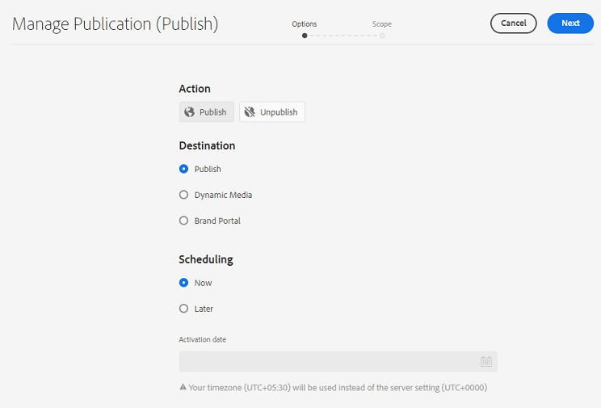

# Publicaties beheren in Experience Manager Assets {#manage-publication-in-aem}

Als [!DNL Adobe Experience Manager Assets] -beheerder kunt u elementen en mappen publiceren die elementen bevatten van de auteurinstantie naar [!DNL Experience Manager Assets] , [!DNL Dynamic Media] en [!DNL Brand Portal] . Ook kunt u plannen om een middel of een omslag op een recentere datum of een tijd te publiceren. Na publicatie kunnen de gebruikers de elementen openen en verder verspreiden onder andere gebruikers. Standaard kunt u elementen en mappen publiceren naar [!DNL Experience Manager Assets] . Nochtans, kunt u [!DNL Experience Manager Assets] vormen om het publiceren toe te laten aan [[!DNL Dynamic Media] ](https://experienceleague.adobe.com/docs/experience-manager-cloud-service/content/assets/dynamicmedia/config-dm.html) en [[!DNL Brand Portal] ](https://experienceleague.adobe.com/docs/experience-manager-cloud-service/content/assets/brand-portal/configure-aem-assets-with-brand-portal.html).

U kunt elementen publiceren of de publicatie ervan ongedaan maken op het niveau van elementen of mappen met de optie **[!UICONTROL Quick Publish]** of **[!UICONTROL Manage Publication]** die beschikbaar is in de interface [!DNL Experience Manager Assets] . Als u in [!DNL Experience Manager Assets] de wijzigingen die u in het oorspronkelijke element of de oorspronkelijke map hebt aangebracht, daarna aanbrengt, worden deze wijzigingen pas in het publicatieexemplaar doorgevoerd als u het bestand of de oorspronkelijke map opnieuw publiceert. [!DNL Experience Manager Assets] Hiermee zorgt u ervoor dat wijzigingen die in uitvoering zijn, niet beschikbaar zijn in het publicatieexemplaar. Alleen goedgekeurde wijzigingen die door een beheerder zijn gepubliceerd, zijn beschikbaar in de publicatie-instantie.

* [Elementen publiceren met Snel publiceren](#quick-publish)
* [ publiceer activa gebruikend Manage Publicatie ](#manage-publication)
* [Elementen later publiceren](#publish-assets-later)
* [Elementen publiceren naar dynamische media](#publish-assets-to-dynamic-media)
* [Elementen publiceren naar Brand Portal](#publish-assets-to-brand-portal)
* [Aanvraag voor publicatie](#request-publication)
* [Beperkingen en tips](#limitations-and-tips)

## Elementen publiceren met Snel publiceren {#quick-publish}

Met Snel publiceren kunt u inhoud direct naar het geselecteerde doel publiceren. Navigeer in de [!DNL Experience Manager Assets] -console naar de bovenliggende map en selecteer alle elementen of mappen die u wilt publiceren. Klik op de optie **[!UICONTROL Quick Publish]** op de werkbalk en selecteer het doel in de vervolgkeuzelijst waar u de elementen wilt publiceren.

## Elementen publiceren met Publicatie beheren {#manage-publication}

Beheer publicatie laat u publiceren of unpublish inhoud aan en van de geselecteerde bestemming, [ toevoegen inhoud ](#add-content) aan de het publiceren lijst van over de bewaarplaats DAM, [ omvatten omslagmontages ](#include-folder-settings) om inhoud van de geselecteerde omslagen te publiceren en filters toe te passen, en [ planning het publiceren ](#publish-assets-later) aan een recentere datum of een tijd.

Navigeer in de [!DNL Experience Manager Assets] -console naar de bovenliggende map en selecteer alle elementen of mappen die u wilt publiceren. Klik op de optie **[!UICONTROL Manage Publication]** op de werkbalk. Als u [!DNL Dynamic Media] en [!DNL Brand Portal] niet hebt geconfigureerd in uw [!DNL Experience Manager Assets] -instantie, kunt u elementen en mappen alleen publiceren naar [!DNL Experience Manager Assets] .

De volgende opties zijn beschikbaar in de interface [!UICONTROL Manage Publication] :

* [!UICONTROL Actions]
   * `Publish`: elementen en mappen naar het geselecteerde doel publiceren
   * `Unpublish`: Verwijder de publicatie van elementen en mappen vanaf het doel

* [!UICONTROL Destination]
   * `Publish`: elementen en mappen publiceren naar [!DNL Experience Manager Assets] (`AEM`)
   * `Dynamic Media`: elementen publiceren naar [!DNL Dynamic Media]
   * `Brand Portal`: elementen en mappen publiceren naar [!DNL Brand Portal]

* [!UICONTROL Scheduling]
   * `Now`: elementen direct publiceren
   * `Later`: Elementen publiceren op basis van de `Activation` datum of tijd

Klik op **[!UICONTROL Next]** om door te gaan. Op basis van de selectie weerspiegelt de tab **[!UICONTROL Scope]** verschillende opties. De opties **[!UICONTROL Add Content]** en **[!UICONTROL Include Folder Settings]** zijn alleen beschikbaar voor het publiceren van de elementen en mappen naar [!DNL Experience Manager Assets] (`Destination: Publish`).

### Inhoud toevoegen {#add-content}

Als u publiceert naar [!DNL Experience Manager Assets] , kunt u meer inhoud (elementen en mappen) toevoegen aan de publicatielijst. U kunt meer elementen of mappen aan de lijst toevoegen via de opslagplaatsen voor dam. Klik op **[!UICONTROL Add Content]** om meer inhoud toe te voegen.

U kunt meerdere elementen uit een map toevoegen of meerdere mappen tegelijk toevoegen. U kunt echter geen elementen uit meerdere mappen tegelijk toevoegen.

 toe

### Inclusief mapinstellingen {#include-folder-settings}

Als u een map naar [!DNL Experience Manager Assets] publiceert, worden standaard alle elementen, submappen en de bijbehorende referenties gepubliceerd.

Klik op **[!UICONTROL Include Folder Settings]** om de mapinhoud te filteren die u wilt publiceren:

* `Include folder contents`

   * Ingeschakeld: alle elementen van de geselecteerde map, submappen (inclusief alle elementen van de submappen) en verwijzingen worden gepubliceerd.
   * Uitgeschakeld: alleen de geselecteerde map (leeg) en verwijzingen worden gepubliceerd. De elementen van de geselecteerde map worden niet gepubliceerd.

* `Include folder contents` en `Include only immediate folder contents`

  Als beide opties zijn geselecteerd, worden alle elementen van de geselecteerde map, submappen (leeg) en verwijzingen gepubliceerd. De elementen van de submappen worden niet gepubliceerd.

<!--
* [!UICONTROL Include only immediate folder contents]: Only the subfolders content and references are published. 

Only the selected folder content and references are published.
-->

Nadat u de filters hebt toegepast, klikt u op **[!UICONTROL OK]** en vervolgens op **[!UICONTROL Publish]** . Als u op de knop Publiceren klikt, verschijnt er een bevestigingsbericht `Resource(s) have been scheduled for publication` . En de geselecteerde activa en (of) omslagen worden gepubliceerd aan de bepaalde bestemming die op de planner (`Now` of `Later` wordt gebaseerd). Meld u aan bij uw publicatieexemplaar om te controleren of de middelen en (of) mappen zijn gepubliceerd.

In de bovenstaande afbeelding kunt u verschillende waarden voor het kenmerk **[!UICONTROL Publish Target]** zien. Laten we niet vergeten dat u ervoor hebt gekozen om te publiceren naar [!DNL Experience Manager Assets] (`Destination: Publish`). Waarom geeft het dan aan dat alleen een map en een middel worden gepubliceerd naar `AEM` en de andere twee elementen worden gepubliceerd naar zowel `AEM` als `Dynamic Media` ?

Hier moet u de rol van mapeigenschappen begrijpen. De eigenschap **[!UICONTROL Dynamic Media Publishing mode]** van een map speelt een belangrijke rol bij de publicatie. Als u de eigenschappen van een map wilt weergeven, selecteert u een map en klikt u op **[!UICONTROL Properties]** op de werkbalk. Zie de eigenschappen van de bovenliggende map voor een element.

In de volgende tabel wordt uitgelegd hoe de publicatie plaatsvindt afhankelijk van de gedefinieerde **[!UICONTROL Destination]** en **[!UICONTROL Dynamic Media Publish mode]** :

| [!UICONTROL Destination] | [!UICONTROL Dynamic Media Publish mode] | [!UICONTROL Publish Target] | Toegestane inhoud |
| --- | --- | --- | --- |
| Publiceren | Selectieve publicatie | `AEM` | Assets en (of) mappen |
| Publiceren | Meteen | `AEM` en `Dynamic Media` | Assets en (of) mappen |
| Publiceren | Bij activering | `AEM` en `Dynamic Media` | Assets en (of) mappen |
| Dynamische media | Selectieve publicatie | `Dynamic Media` | Assets |
| Dynamische media | Meteen | `None` | Kan de elementen niet publiceren |
| Dynamische media | Bij activering | `None` | Kan de elementen niet publiceren |

>[!NOTE]
>
>Alleen elementen worden gepubliceerd naar [!DNL Dynamic Media] .
>
>Het publiceren van een map naar [!DNL Dynamic Media] wordt niet ondersteund.
>
>Als u een map (`Selective Publish`) selecteert en de bestemming [!DNL Dynamic Media] kiest, weerspiegelt het kenmerk [!UICONTROL Publish Target] `None` .

Laten we nu het gebruik van **[!UICONTROL Destination]** in het bovenstaande hoofdlettergebruik wijzigen in **[!UICONTROL Dynamic Media]** en de resultaten controleren. Op deze manier wordt alleen het element van de map `Selective Publish` gepubliceerd naar [!DNL Dynamic Media] . De elementen van de mappen `Immediate` en `Upon Activation` worden niet gepubliceerd en weerspiegelen `None` .

>[!NOTE]
>
>Als [!DNL Dynamic Media] niet is geconfigureerd voor uw [!DNL Experience Manager Assets] -instantie en **[!UICONTROL Destination]** wel **[!UICONTROL Publish]** is, worden de elementen en mappen altijd gepubliceerd naar `AEM` .
>
>Publiceren naar [!DNL Brand Portal] is onafhankelijk van de mapeigenschappen. Alle elementen, mappen en verzamelingen kunnen naar Brand Portal worden gepubliceerd. Zie [ activa aan Brand Portal ](#publish-assets-to-brand-portal) publiceren.

>[!NOTE]
>
>Als u de wizard [!DNL Manage Publication] hebt aangepast, blijft uw aanpassing werken met de bestaande functies.
>
>U kunt de bestaande aanpassing echter verwijderen om de nieuwe [!DNL Manager Publication] -functies te gebruiken.

## Elementen later publiceren {#publish-assets-later}

De publicatieworkflow van elementen op een latere datum of tijd plannen:

1. Navigeer in de [!UICONTROL Experience Manager Assets] -console naar de bovenliggende map en selecteer alle elementen of mappen die u wilt plannen voor publicatie.
1. Klik op de optie **[!UICONTROL Manage Publication]** op de werkbalk.
1. Klik **[!UICONTROL Publish]** van **[!UICONTROL Action]**, en selecteer dan **[!UICONTROL Destination]** waar u de inhoud wilt publiceren.
1. Selecteer **[!UICONTROL Later]** vanuit **[!UICONTROL Scheduling]**.
1. Selecteer een **[!UICONTROL Activation date]** en geef de datum en tijd op. Klik op **[!UICONTROL Next]**.

   

1. Op de tab **[!UICONTROL Scope]** , **[!UICONTROL Add Content]** (indien nodig). Klik op **[!UICONTROL Next]**.
1. Geef op het tabblad **[!UICONTROL Workflows]** een titel voor de workflow op. Klik op **[!UICONTROL Publish Later]**.

   

   Meld u aan bij de doelinstantie om de gepubliceerde elementen te controleren (afhankelijk van de geplande datum of tijd).

## Elementen publiceren naar dynamische media {#publish-assets-to-dynamic-media}

Alleen elementen worden gepubliceerd naar [!DNL Dynamic Media] . Het publicatiegedrag verschilt echter op basis van de mapeigenschappen. In een map kan **[!UICONTROL Dynamic Media Publish mode]** zijn geconfigureerd voor selectief publiceren. Dit kan een van de volgende zijn:

* `Selective Publish`
* `Immediate`
* `Upon Activation`

Het publicatieproces voor de modi **[!UICONTROL Immediate]** en **[!UICONTROL Upon Activation]** is echter consistent, anders voor **[!UICONTROL Selective Publish]** . Zie [ selectieve vormen publiceren op omslagniveau in Dynamische Media ](https://experienceleague.adobe.com/docs/experience-manager-cloud-service/content/assets/dynamicmedia/selective-publishing.html). Nadat u selectief publiceren in een omslag vormt, kunt u om het even welke volgend doen:

* [ publiceer selectief activa aan Dynamische Media of Experience Manager gebruikend leidt Publicatie ](https://experienceleague.adobe.com/docs/experience-manager-cloud-service/content/assets/dynamicmedia/selective-publishing.html?lang=en#selective-publish-manage-publication)
* [ unpublish selectief activa van Dynamische Media of Experience Manager gebruikend leidt Publicatie ](https://experienceleague.adobe.com/docs/experience-manager-cloud-service/content/assets/dynamicmedia/selective-publishing.html?lang=en#selective-unpublish-manage-publication)
* [ publiceer activa aan Dynamische Media of Experience Manager gebruikend Snel publiceren ](https://experienceleague.adobe.com/docs/experience-manager-cloud-service/content/assets/dynamicmedia/selective-publishing.html?lang=en#quick-publish-aem-dm)
* [ publiceert of maakt selectief activa als onderzoeksresultaten ](https://experienceleague.adobe.com/docs/experience-manager-cloud-service/content/assets/dynamicmedia/selective-publishing.html?lang=en#selective-publish-unpublish-search-results) ongedaan

## Elementen publiceren naar Brand Portal {#publish-assets-to-brand-portal}

U kunt elementen, mappen en verzamelingen naar de instantie [!DNL Experience Manager Assets Brand Portal] publiceren.

* [Assets publiceren naar Brand Portal](https://experienceleague.adobe.com/docs/experience-manager-cloud-service/content/assets/brand-portal/publish-to-brand-portal.html?lang=en#publish-assets-to-bp)
* [Mappen publiceren naar Brand Portal](https://experienceleague.adobe.com/docs/experience-manager-cloud-service/content/assets/brand-portal/publish-to-brand-portal.html?lang=en#publish-folders-to-brand-portal)
* [Verzamelingen publiceren naar Brand Portal](https://experienceleague.adobe.com/docs/experience-manager-cloud-service/content/assets/brand-portal/publish-to-brand-portal.html?lang=en#publish-collections-to-brand-portal)

## Aanvraag voor publicatie {#request-publication}

De optie `Request Publication` helpt bij het verifiëren van de workflow van Assets voordat deze wordt gepubliceerd in de [!DNL AEM] Assets-omgeving. [!DNL AEM] biedt verschillende machtigingsniveaus voor verschillende gebruikers. U kunt a *medewerker* zijn die activa uploadt maar niet hen kan publiceren tot de uploads worden geverifieerd. Ook, die *Admin* zijn kunt u beheren om werkschema&#39;s van Assets te lezen en te schrijven.

De optie Publicatie aanvragen is beschikbaar voor de volgende gebruikers:

* **Medewerker:** als u een gebruiker bent die aan [!DNL AEM] Assets kan bijdragen, dan hebt u beperkte toegang tot het [!DNL AEM] werkschema van Assets. `Manage publication` verborgen. Als medewerker kunt u alleen een bijdrage leveren door Assets toe te voegen, maar u kunt de bijdrage niet publiceren en u hebt geen leestoegang tot de workflow.

* **Gebruiker van het Werkschema:** Deze gebruiker kan geen activa publiceren maar heeft gelezen toegang tot het werkschema. Als workflowgebruiker kunt u het volgende doen:
   * verzoek om publicatie
   * view `Manage publication` knop
   * de workflow plannen en de opties weergeven `schedule now` en `schedule later`

* **Admin:** als admin type van gebruiker, kunt u algemene werkschemastappen voor Assets beheren. `Manage publication` is zichtbaar voor u. Als het doel `publish` is geselecteerd, kunt u later een element voor de workflowstap plannen.

>[!NOTE]
>
>Als [!DNL Dynamic Media] als bestemming wordt geselecteerd, dan is de werkschemastap gehandicapt voor **werkschemagebruiker** en **admin** gebruikers.
>

## Beperkingen en tips {#limitations-and-tips}

* `Manage publication` is beschikbaar voor gebruikers die beschikken over ten minste Leesmachtigingen voor de workflow.
* Lege mappen worden niet gepubliceerd.
* Als u een element publiceert dat wordt verwerkt, wordt alleen de oorspronkelijke inhoud gepubliceerd. De uitvoeringen ontbreken. Wacht tot de verwerking is voltooid en publiceer het element of publiceer het opnieuw nadat de verwerking is voltooid.
* Verwijder tijdens het verwijderen van de publicatie van een complex element alleen de publicatie van het element. Maak de publicatie van de referenties niet ongedaan, omdat ze door andere gepubliceerde elementen kunnen worden doorverwezen.
