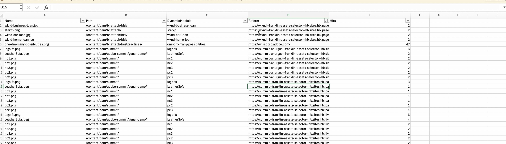

# Rapporten beheren {#manage-reports}

Asset Reporting geeft beheerders inzicht in de activiteiten van de Adobe Experience Manager Assets View-omgeving. Deze gegevens bevatten nuttige informatie over de manier waarop gebruikers met inhoud en het product werken. Alle gebruikers kunnen tot het dashboard van Inzichten toegang hebben en degenen die aan het het productprofiel van Beheerders worden toegewezen kunnen user-defined rapporten tot stand brengen.

## Toegangsrapporten {#access-reports}

Alle gebruikers die zijn toegewezen aan het productprofiel van AEM-beheerders hebben toegang tot het dashboard Inzichten of kunnen door gebruikers gedefinieerde rapporten maken in de Assets-weergave.

Navigeer naar **[!UICONTROL Reports]** onder **[!UICONTROL Settings]** om rapporten te openen.

<!--
In the **[!UICONTROL Reports]** screen, various components are shown in the tabular format which includes the following:

* **Title**: Title of the report
* **Type**: Determines whether the report is uploaded or downloaded to the repository
* **Description**: Provide details of the report that was given during uploading/downloading the report
* **Status**: Determines whether the report is completed, under progress, or deleted.
* **Author**: Provides email of the author who has uploaded/downloaded the report.
* **Created**: Gives information of the date when the report was generated.
-->

## Een rapport maken {#create-report}

De AEM Assets-weergaveomgeving biedt uitgebreide rapportagemogelijkheden via het dashboard Rapporten. Met deze mogelijkheid kunnen gebruikers CSV-rapporten genereren en downloaden waarin de uploads en downloads van bedrijfsmiddelen binnen een opgegeven tijdsspanne worden beschreven, variërend van een eenmalig tot een dagelijks, wekelijks, maandelijks of jaarlijks interval.

**om een rapport tot stand te brengen:**

1. Navigeer aan **Rapporten** en klik **creëren rapport** (van het hoogste recht). **creeer rapport** dialoogdoos toont de hieronder gebieden:
   

   **In het lusje van de Configuratie:**

   1. **type van Rapport:** Uitgezocht onder [!UICONTROL upload], [!UICONTROL download], of [ Dynamische het Rapport van de Levering van Media ](#dynamic-media-delivery-reports) type.
   1. **Titel:** voeg een titel aan het rapport toe.
   1. **Beschrijving:** voeg een facultatieve beschrijving aan het rapport toe.
   1. **Uitgezochte omslagweg:** selecteer een omslagweg om het rapport van geupload en gedownloade activa binnen die specifieke omslag te produceren. Als u bijvoorbeeld het rapport met middelen nodig hebt die naar een map zijn geüpload, geeft u het pad naar die map op.
   1. **Uitgezochte datuminterval:** selecteer de datumwaaier om te bekijken uploadt of downloadactiviteit binnen de omslag.

    

   >[!NOTE]
   >
   > In de Assets-weergave worden alle lokale tijdzones omgezet in UTC (Coordinated Universal Time).

   **in het Lusje van Kolommen:** selecteer de kolomnamen in het rapport te tonen. In de volgende tabel wordt het gebruik van alle kolommen uitgelegd:

   <table>
    <tbody>
     <tr>
      <th><strong>Kolomnaam</strong></th>
      <th><strong>Beschrijving</strong></th>
      <th><strong>Rapporttype</strong></th>
     </tr>
     <tr>
      <td>Titel</td>
      <td>De titel van het element.</td>
      <td>Uploaden en downloaden</td>
     </tr>
     <tr>
      <td>Pad</td>
      <td>Het mappad waar het element beschikbaar is in de Assets-weergave.</td>
      <td>Upload, download en Dynamic Media Delivery</td>
     </tr>
     <tr>
      <td>MIME-type</td>
      <td>Het MIME-type voor het element.</td>
      <td>Uploaden en downloaden</td>
     </tr>
     <tr>
      <td>Grootte</td>
      <td>De grootte van het element in bytes.</td>
      <td>Uploaden en downloaden</td>
     </tr>
     <tr>
      <td>Gedownload door</td>
      <td>De e-mailid van de gebruiker die het element heeft gedownload.</td>
      <td>Downloaden</td>
     </tr>
     <tr>
      <td>Downloaddatum</td>
      <td>De datum waarop de handeling voor het downloaden van middelen wordt uitgevoerd.</td>
      <td>Downloaden</td>
     </tr>
     <tr>
      <td>Auteur</td>
      <td>De auteur voor het element.</td>
      <td>Uploaden en downloaden</td>
     </tr>
     <tr>
      <td>Aanmaakdatum</td>
      <td>De datum waarop het element is geüpload naar de weergave Assets.</td>
      <td>Uploaden en downloaden</td>
     </tr>
     <tr>
      <td>Wijzigingsdatum</td>
      <td>De datum waarop het element voor het laatst is gewijzigd.</td>
      <td>Uploaden en downloaden</td>
     </tr>
     <tr>
      <td>Verlopen</td>
      <td>De vervalstatus van het actief.</td>
      <td>Uploaden en downloaden</td>
     </tr>
     <tr>
      <td>Gedownload op gebruikersnaam</td>
      <td>De naam van de gebruiker die het element heeft gedownload.</td>
      <td>Downloaden</td>
     </tr> 
     <tr>
      <td>Referenter</td>
      <td>De URL waar het element wordt geleverd of opgenomen</td>
      <td>Dynamische levering van media</td>
     </tr>  
     <tr>
      <td>Hits</td>
      <td>Het aantal keren dat het element wordt geleverd (aantal leveringen)</td>
      <td>Dynamische levering van media</td>
     </tr>          
    </tbody>
   </table>

## Dynamische rapporten voor mediafunctie {#dynamic-media-delivery-reports}

Krijg leveringsinzichten voor activa die met Dynamische Media worden geleverd, met de telling van de levering op activaniveau, verwijzende informatie, activaweg in AEM Assets en unieke activa ID. Er kunnen rapporten worden gegenereerd voor alle elementen die via de gegevensopslagruimte Dynamic Media voor AEM Assets worden geleverd of voor een specifieke maphiërarchie in AEM Assets. Bovendien helpen de Dynamic Media Delivery-rapporten het rendement van de geleverde middelen te meten, de kanaalprestaties te meten en met kennis van zaken taken voor middelenbeheer voor elementen te vervullen.

<!--
>[!NOTE]
> 
>To get early access to the Dynamic Media Delivery Report on your Dynamic Media account, [create and submit an Adobe Customer Support case](https://helpx.adobe.com/nl/enterprise/using/support-for-experience-cloud.html).
-->

### Vereisten {#prereqs-dynamic-media-delivery-reports}

U moet een Dynamic Media-licentie hebben om dit rapport te maken en te gebruiken.

>[!IMPORTANT]
> 
>* Er worden rapporten geleverd voor elementen die via Dynamic Media worden geleverd.
>* Er worden rapporten gegenereerd voor de eerste 1 miljoen rijen. Als u alle bestanden binnen deze limiet wilt vastleggen, kunt u overwegen de verwijzingskolom voor kleinere mappen op te nemen.
>* Rapporten kunnen alleen gedurende de afgelopen drie maanden worden gegenereerd.

### Een dynamisch rapport voor mediaweergave maken{#create-dynamic-media-delivery-report}

1. Creeer een Dynamisch Rapport van de Levering van Media, gebruikend de stappen in [ worden vermeld creeer een rapport ](#create-report).

1. Selecteer **[!UICONTROL Dynamic Media Delivery]** in de vervolgkeuzelijst **[!UICONTROL Report type]** .

   

1. Op het tabblad **[!UICONTROL Columns]** kunt u de kolom **[!UICONTROL Referrer]** selecteren en opnemen in uw rapport.

   

   Alle kolommen van het gedownloade rapport zijn read-only, behalve de **kolom van de Referateur**, die u kunt wijzigen om van het rapport te omvatten of uit te sluiten. <!--Choosing a referrer displays the number of visitors received from each referred report that directs traffic to the site. It offers insights into the sources of traffic and the origin of the visitors. Such insights help measure ROI of delivered assets, measure channel performance, and help take informed asset management tasks for assets.-->

### Handelingen die zijn uitgevoerd op het rapport Dynamische media-levering {#actions-performed-dynamic-media-delivery-reports}

Nadat u het rapport hebt gemaakt, kunt u de volgende handelingen uitvoeren:

* **[!UICONTROL Delete]**: U kunt het geselecteerde rapport verwijderen.
* **[!UICONTROL Download CSV]**: U kunt het geselecteerde rapport in een CSV-indeling downloaden. Het gedownloade rapport bestaat uit de kolommen Naam, Pad, DynamicMediaID, Referrer en Hits.
   * **de kolom van de Verwijzer** maakt een lijst van URL waar het element wordt geleverd of inbegrepen.

   * **Hits** maakt een lijst van het aantal tijden de activa (leveringstelling) wordt geleverd.

Om het Dynamische Rapport van de Levering van Media als CSV te schrappen of te downloaden, zie [ Mening en download bestaand rapport ](#View-and-download-existing-report).

## Bestaand rapport weergeven en downloaden {#View-and-download-existing-report}

De bestaande rapporten tonen onder **Uitvoerde Rapporten** tabel. Klik **Rapporten** en selecteer **Uitvoerde Rapporten** om alle gecreeerde rapporten met de status te bekijken zoals **voltooide**, erop wijzend zij klaar zijn te downloaden. Om het rapport in formaat te downloaden CSV of het rapport te schrappen, selecteer de rapportrij. Dan selecteer **CSV van de Download** of **Schrapping**.

## Een rapport plannen {#schedule-report}

In de mening UI van AEM Assets, **het Rapport van het Programma** plaatst - omhoog een automatische generatie rapporten met gespecificeerde toekomstige intervallen zoals dagelijks, wekelijks, maandelijks, of jaarlijks. Met deze functie kunt u terugkerende rapportagebehoeften stroomlijnen en actuele gegevensupdates garanderen. Terwijl **Rapport** leidt produceert rapporten voor vroegere data. De voltooide rapporten worden vermeld onder **Uitvoerde Rapporten** en de komende rapporten worden gevonden onder **Geplande Rapporten**.

Volg onderstaande stappen om een rapport te plannen:

1. Klik op Rapporten in het linkervenster en klik vervolgens op Rapport maken (van rechtsboven).
1. In het dialoogvenster Rapport wordt de volgende informatie weergegeven:
   1. **type van Rapport:** Uitgezocht tussen uploadt en downloadtype.
   1. **Titel:** voeg een titel aan het rapport toe.
   1. **Beschrijving**: Voeg een facultatieve beschrijving aan het rapport toe.
   1. **Uitgezochte omslagweg:** selecteer een omslagweg om een rapport voor activa te produceren die aan of van die specifieke omslag in de toekomst zullen worden geupload.
   1. Wissel **rapport van het Programma:** Wissel om het rapport voor een recentere tijd of voor zijn herhaalde voorkomen te plannen.

      

   1. **kies frequentie:** specificeer het interval voor het produceren van het rapport (bijvoorbeeld, dagelijks, wekelijks, maandelijks, jaarlijks, of eens) en plaats de datum en de tijd om het rapport samen met de einddatum voor herhaling in werking te stellen. Voor een eenmalig rapport selecteert u het datumbereik voor het rapport over het geselecteerde type activiteit in de AEM-omgeving. Bijvoorbeeld, als u een rapport over gedownloade activa van de tiende tot 29e (toekomstige data) van een specifieke maand nodig hebt, selecteer deze data in het **Uitgezochte 1&rbrace; gebied van het datuminterval &lbrace;.**

   >[!NOTE]
   >
   > In de Assets-weergave worden alle lokale tijdzones omgezet in UTC (Coordinated Universal Time).

## Geplande rapporten weergeven {#view-scheduled-reports}

De geplande rapporten tonen onder **Geplande Rapporten** lusje op een systematisch georganiseerde manier. Alle voltooide rapporten voor elk gepland rapport worden opgeslagen binnen één enkele rapportomslag. Klik  om de voltooide rapporten te bekijken. Als u bijvoorbeeld een dagelijks rapport hebt gepland, worden alle voltooide rapporten gegroepeerd in één map. Deze organisatie vereenvoudigt zowel de navigatie als de ontdekkingsbaarheid van rapporten. Om geplande rapporten te bekijken, klik **Rapporten** en klik dan **Geplande Rapporten**. Alle geplande rapporten worden weergegeven met hun status als lopend of voltooid. Voltooide rapporten kunnen worden gedownload.\

## Geplande rapporten bewerken en annuleren {#edit-cancel-scheduled-reports}

1. Navigeer aan de **Geplande Rapporten** tabel.
1. Selecteer de rapportrij.
1. Klik **uitgeven**.
1. Klik **annuleer Programma** en klik dan **bevestigen**, om het geplande rapport te annuleren. Voor geannuleerde rapporten, wordt de volgende runtime leeg en toont de status geannuleerd.
   

### Plan hervatten {#resume-schedule}

Om het geannuleerde programma te hervatten, selecteer de rapportrij en klik **Programma van de Hervatting**. Wanneer deze wordt hervat, worden de volgende runtimegegevens opnieuw weergegeven en wordt de status weergegeven als zijnde actief.

>[!NOTE]
>
> Als u een geannuleerd rapport hervat vóór de geplande einddatum, de rapporten van de annuleringsdatum aan de hervattingsdatum automatisch produceren.

## Inzichten weergeven {#view-live-statistics}

Met de Assets-weergave kunt u realtime gegevens voor uw Assets-weergaveomgeving bekijken met het dashboard Insights. U kunt real-time gebeurtenismetriek tijdens de laatste 30 dagen of voor de laatste 12 maanden bekijken.

<!---->

Klik op **[!UICONTROL Insights]** beschikbaar in het linkernavigatievenster om de volgende automatisch gegenereerde grafieken weer te geven:

* **Downloads**: Het aantal activa die van het de meningsmilieu van Assets in de laatste 30 dagen of 12 maanden worden gedownload vertegenwoordigden gebruikend een lijngrafiek.
  

* **uploadt**: Het aantal activa die aan het de meningsmilieu van Assets in de laatste 30 dagen of 12 maanden worden geupload vertegenwoordigden gebruikend een lijngrafiek.
  
<!--* **Asset Count by Size**: The division of count of assets based on their range of various sizes from 0 MB to 100 GB.

* **Storage usage**: The storage usage, in bytes, for the Assets view environment represented using a bar chart.

<!--* **Delivery**: The graph depicts the count of assets as the delivery dates.-->

<!--* **Asset Count by Asset Type**: Represents count of various MIME types of the available assets. For example, application/zip, image/png, video/mp4, application/postscripte.-->

* **Hoogste Zoekopdrachten**: De hoogste gezochte termijnen van de mening samen met het aantal tijden die termijnen binnen uw het meningsmilieu van Assets in de laatste 30 dagen of 12 maanden worden gezocht die maanden in een tabelformaat worden vertegenwoordigd.
  
  <!--
   
   
   -->
* **Telling van Activa door grootte:** segmenteert de totale activa tellen in uw milieu van de Mening van Assets in verschillende groottewaaiers, die de telling en het percentage activa in elke groottewaaier benadrukken, door een donutgrafiek wordt vertegenwoordigd.
  
* **Telling van Activa door het Type van Activa:** segmenteert het totale assetentelling in uw milieu van de Mening van Assets, die de telling en het percentage van activa benadrukken die op hun dossiertypes worden gebaseerd, door een donutgrafiek wordt vertegenwoordigd.
  