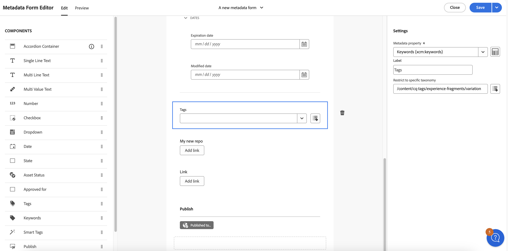

# Metagegevens in Assets View {#metadata}

Metagegevens zijn gegevens of een beschrijving van de gegevens. Uw afbeeldingen als een element kunnen bijvoorbeeld informatie bevatten over de camera waarop u hebt geklikt of over copyrightgegevens. Deze informatie is metagegevens van de afbeelding. Metagegevens zijn essentieel voor efficiënt middelenbeheer. Metagegevens zijn de verzameling van alle gegevens die voor een element beschikbaar zijn, maar hoeven niet noodzakelijkerwijs in dat element te zijn opgenomen.

Met metagegevens kunt u elementen verder indelen. Dit is handig wanneer de hoeveelheid digitale informatie toeneemt. U kunt een paar honderd bestanden beheren op basis van alleen de bestandsnamen, miniaturen en het geheugen. Deze aanpak is echter niet schaalbaar. Het is te kort wanneer het aantal betrokken personen en het aantal beheerde activa toenemen.

Met de toevoeging van metagegevens neemt de waarde van een digitaal element toe, omdat het element:

* Toegankelijker - systemen en gebruikers kunnen het gemakkelijk vinden.
* Gemakkelijker te beheren - u kunt gemakkelijker middelen met de zelfde reeks eigenschappen vinden en veranderingen op hen toepassen.
* Volledig - asset bevat meer informatie en context met meer metagegevens.

Om deze redenen biedt Assets u de juiste middelen om metagegevens voor uw digitale middelen te maken, beheren en uit te wisselen.

## De metagegevens weergeven {#view-metadata}

Als u de metagegevens van een element wilt weergeven, bladert u naar het element of doorzoekt u het element, selecteert u het element en klikt u op **[!UICONTROL Details]** op de werkbalk.

*Cijfer: Om activa en zijn meta-gegevens te bekijken, klik **[!UICONTROL Details]**&#x200B;van toolbar of klik de activa tweemaal.*

De basismetagegevens, zoals titel, beschrijving en uploaddatum, zijn beschikbaar op het tabblad [!UICONTROL Basic] . Het tabblad [!UICONTROL Advanced] bevat meer geavanceerde metagegevens, zoals cameramodel, lensdetails en geotags. Het tabblad [!UICONTROL Tags] bevat automatisch toegepaste tags op basis van de inhoud van de afbeelding.

## Metagegevens bijwerken {#update-metadata}

Nadat het metagegevensformulier door Admin is geconfigureerd, kunnen andere velden handmatig worden bijgewerkt. U kunt dit wijzigen omdat het alleen leest op basis van het metagegevensformulier in het vak.

## Slimme tags {#smart-tags}

[!DNL Experience Manager Assets] gebruikt kunstmatige intelligentie die door [ wordt verstrekt Adobe Sensei ](https://www.adobe.com/sensei.html) om relevante markeringen op al uw geüploade activa automatisch toe te passen. Deze labels, met de juiste naam Slimme tags, verhogen de snelheid van de inhoud van uw projecten door u te helpen snel relevante elementen te vinden. De slimme tags zijn een voorbeeld van metagegevens die niet in de afbeelding voorkomen.

De slimme tags worden toegepast in de buurt van realtime en worden gegenereerd op basis van de inhoud van de afbeelding. Wanneer u een element uploadt, wordt de gebruikersinterface gedurende enige tijd [!UICONTROL Processing] weergegeven op de elementminiatuur. Zodra de verwerking volledig is, kunt u [ de meta-gegevens ](#view-metadata) en de slimme markeringen bekijken.

*Cijfer: Om de Slimme Markeringen van een activa te bekijken, klik **[!UICONTROL Details]**&#x200B;van toolbar of klik de activa tweemaal.*

Slimme tags bevatten ook een betrouwbaarheidsscore als percentage. Het geeft het vertrouwen aan dat aan de toegepaste tag is gekoppeld. U kunt de automatisch toegepaste slimme tags verkleinen.

## Trefwoorden toevoegen of bijwerken {#manually-tag}

U kunt meer tags toevoegen aan uw elementen, naast de slimme tags die automatisch worden toegevoegd met de slimme service van [!DNL Adobe Sensei] . Open een element voor voorvertoning, klik op [!UICONTROL Tags] en typ de gewenste trefwoorden in het veld [!UICONTROL Keywords] . Druk op Return om de tag toe te voegen. [!DNL Assets view] indexeert het sleutelwoord in dichtbij echt - tijd en uw team kan de bijgewerkte activa spoedig zoeken gebruikend de nieuwe sleutelwoorden.

U kunt ook tags uit de sectie [!UICONTROL Smart Tags] verwijderen die automatisch door [!DNL Assets view] worden toegevoegd aan alle geüploade elementen.

## Taxonomiebeheer {#taxonomy-management}

Tags kunnen ook in een hiërarchie worden genest ter ondersteuning van relaties zoals categorie en subcategorie. Als u hiërarchische tags wilt invoegen, worden deze eenvoudig beheerd door de beheerder in de sectie [!UICONTROL Taxonomy Management] van [!UICONTROL Settings] . U kunt een beheerde set naamruimten en tags maken die alle gebruikers kunnen gebruiken tijdens het beschrijven van inhoud. Alleen de beheerders kunnen taghiërarchieën instellen in [!UICONTROL Taxonomy Manager] om ervoor te zorgen dat de waarden worden beheerd en consistent worden gebruikt.

## Metagegevens Forms instellen {#metadata-forms}

>[!CONTEXTUALHELP]
>id="assets_metadata_forms"
>title="Metagegevens Forms"
>abstract="[!DNL Experience Manager Assets] biedt standaard vele standaardmetagegevensvelden. Organisaties hebben extra behoeften aan metagegevens en hebben meer metagegevensvelden nodig om bedrijfsspecifieke metagegevens toe te voegen. Met metagegevensformulieren kunnen bedrijven aangepaste metagegevensvelden toevoegen aan de pagina Details van een element. De bedrijfsspecifieke metagegevens verbeteren het beheer en de ontdekking van de bedrijfsmiddelen."

De Assets-weergave biedt standaard vele standaardmetagegevensvelden. Organisaties hebben extra behoeften aan metagegevens en hebben meer metagegevensvelden nodig om bedrijfsspecifieke metagegevens toe te voegen. Met metagegevensformulieren kunnen bedrijven aangepaste metagegevensvelden toevoegen aan de pagina [!UICONTROL Details] van een element. De bedrijfsspecifieke metagegevens verbeteren het beheer en de ontdekking van de bedrijfsmiddelen. U kunt geheel nieuwe formulieren maken of een bestaand formulier opnieuw gebruiken.

U kunt metagegevensformulieren configureren voor verschillende typen elementen (verschillende MIME-typen). Gebruik dezelfde formuliernaam als het MIME-type van het bestand. In de Assets-weergave wordt het MIME-type voor geüploade elementen automatisch afgestemd op de naam van het formulier en worden de metagegevens voor de geüploade elementen bijgewerkt op basis van de formuliervelden.
<!--
For example, if a metadata form by the name `PDF` or `pdf` exists, then the uploaded PDF documents contain metadata fields as defined in the form.
-->
In de Assets-weergave wordt de volgende volgorde gebruikt om te zoeken naar bestaande formuliernamen voor metagegevens om de metagegevensvelden toe te passen op de geüploade elementen van een bepaald type:

MIME-subtype > MIME-type > `default` -formulier > Formulier buiten de doos

Als bijvoorbeeld een metagegevensformulier met de naam `PDF` of `pdf` bestaat, bevatten de geüploade PDF-documenten metagegevensvelden zoals gedefinieerd in het formulier. Als een metagegevensformulier met de naam `PDF` of `pdf` niet bestaat, komt de Assets-weergave overeen als er een metagegevensformulier met de naam `application` is. Als er een metagegevensformulier met de naam `application` is, bevatten de geüploade PDF-documenten metagegevensvelden zoals gedefinieerd in het formulier. Als in de Assets-weergave nog steeds geen overeenkomend metagegevensformulier wordt gevonden, wordt gezocht naar het metagegevensformulier `default` om de metagegevensvelden die in het formulier zijn gedefinieerd, toe te passen op de geüploade PDF-documenten. Als geen van deze stappen werkt, worden in de Assets-weergave metagegevensvelden die in het formulier buiten het vak zijn gedefinieerd, toegepast op alle geüploade PDF-documenten.
Alhoewel als u een meta-gegevensvorm aan een omslag [ wilt toewijzen zie ](#assign-metadata-form-folder).

>[!IMPORTANT]
>
>Het nieuwe metagegevensformulier voor een specifiek bestandstype vervangt volledig het standaardmetagegevensformulier dat [!DNL Assets view] biedt. Als u een metagegevensformulier verwijdert of de naam ervan wijzigt, zijn de standaardmetagegevensvelden weer beschikbaar voor nieuwe elementen.

Ga als volgt te werk om een metagegevensformulier te maken:

1. Klik in de linkertrack op **[!UICONTROL Settings]** > **[!UICONTROL Metadata Forms]** .

   

1. Klik op **[!UICONTROL Create]** rechtsboven in de gebruikersinterface.
1. Geef een naam op voor het formulier en klik op **[!UICONTROL Create]** .
1. Geef een naam op voor de tab in **[!UICONTROL Settings]** in de rechtertrack.
1. Sleep de vereiste componenten op een tabblad in het formulier vanuit de **[!UICONTROL Components]** -code die beschikbaar is in de linkertrack. Sleep de componenten in de gewenste volgorde.

   

   *Cijfer: De interface van de de vormverwezenlijking van meta-gegevens met opties om componenten en optie toe te voegen om de vorm voor te vertonen.*

1. Geef voor elke component een naam in de **[!UICONTROL Settings]** in de rechtertrack op en geef een toewijzing van de ondersteunde eigenschappen op.
1. Selecteer voor een component desgewenst **[!UICONTROL Required]** om het metagegevensveld verplicht te maken en selecteer **[!UICONTROL Read-Only]** om het veld onbewerkbaar te maken op de elementpagina [!UICONTROL Details] .
1. Klik indien nodig op **[!UICONTROL Preview]** om een voorbeeld te bekijken van het formulier dat u maakt.
1. Voeg desgewenst meer tabbladen en de vereiste componenten toe aan elk tabblad.
1. Klik op **[!UICONTROL Save]** wanneer het formulier is voltooid.

Bekijk deze video om de reeks stappen weer te geven:

>[!VIDEO](https://video.tv.adobe.com/v/341275)

Nadat een formulier is gemaakt, wordt het automatisch toegepast wanneer gebruikers een element van het overeenkomende MIME-type uploaden.

Als u een bestaand formulier opnieuw wilt gebruiken om een nieuw formulier te maken, selecteert u een metagegevensformulier, klikt u op **[!UICONTROL Copy]** op de werkbalk, geeft u een naam op en klikt u op **[!UICONTROL Confirm]** . U kunt een metagegevensformulier bewerken om het te wijzigen. Wanneer u een formulier wijzigt, wordt dit gebruikt voor elementen die na de wijziging worden geüpload. De bestaande activa blijven ongewijzigd.

### Eigenschapcomponenten {#property-components}

U kunt het metagegevensformulier aanpassen met een van de volgende eigenschapcomponenten. U sleept het componenttype gewoon naar het formulier op de gewenste locatie en wijzigt de componentinstellingen.
Hieronder ziet u een overzicht van elk type eigenschap en de manier waarop deze worden opgeslagen.

| Componentnaam | Beschrijving |
|---|---|
| Accordeoncontainer | Voeg een inklapbare rubriek voor een lijst van gemeenschappelijke componenten en eigenschappen toe. Deze kan standaard worden uitgevouwen of samengevouwen. |
| Tekst met één regel | Voeg een teksteigenschap voor één regel toe. |
| Tekst met meerdere regels | Voeg meerdere tekstregels of een alinea toe. Het wordt uitgebreid als gebruikerstypes om alle inhoud te bevatten. |
| Tekst met meerdere waarden | Voeg een teksteigenschap voor meerdere waarden toe. |
| Getal | Voeg een getalcomponent toe. |
| Selectievakje | Voeg een Booleaanse waarde toe. Opgeslagen als TRUE of FALSE zodra een waarde is opgeslagen. |
| Datum | Voeg een datumcomponent toe. |
| Vervolgkeuzelijst | Voeg een vervolgkeuzelijst toe. |
| Staat | De statuseigenschap voor de repository toevoegen (toegewezen aan repo:state) |
| Status van element | De standaardeigenschap Asset Status toevoegen (toegewezen aan dam:assetStatus) |
| Tags | Voeg een tag toe uit waarden die zijn opgeslagen in Taxonomy Management (toegewezen aan xcm:tags). |
| Trefwoorden | Vrije-vormtrefwoorden toevoegen (toegewezen aan dc:subject). |
| Slimme tags | U kunt zoekmogelijkheden uitbreiden door automatisch metagegevenstags toe te voegen. |

### Metagegevensformulier toewijzen aan een map {#assign-metadata-form-folder}

U kunt ook een metagegevensformulier toewijzen aan een map in de Assets-weergavemplementatie. Het metagegevensformulier dat volgens het MIME-type aan een map is toegewezen, wordt overschreven wanneer u handmatig een metagegevensformulier op een map toepast. Alle elementen in de map, inclusief de elementen in de submappen, geven vervolgens de eigenschappen weer die in het metagegevensformulier zijn gedefinieerd.

Een metagegevensformulier toewijzen aan een map:

1. Navigeer naar **[!UICONTROL Settings]** > **[!UICONTROL Metadata Forms]** en selecteer een metagegevensformulier.

2. Klik op **[!UICONTROL Assign to Folder]**.

3. Selecteer de map en klik op **[!UICONTROL Assign]** . U kunt de mappen selecteren door op de mapnamen te klikken.

    toe

   U kunt ook naar de pagina met mapdetails navigeren en een metagegevensformulier selecteren uit de makeigenschappen in het rechterdeelvenster om het metagegevensformulier aan de map toe te wijzen.

   

### Metagegevens uit mappen verwijderen {#remove-metadata-form-folder}

Nadat u een metagegevensformulier aan een of meerdere mappen hebt toegewezen, kunt u met Experience Manager Assets ook het metagegevensformulier uit de geselecteerde mappen verwijderen.

Een metagegevensformulier verwijderen uit een map:

1. Navigeer naar **[!UICONTROL Settings]** > **[!UICONTROL Metadata Forms]** en selecteer een metagegevensformulier.

1. Klik op **[!UICONTROL Remove from Folder(s)]**. De lijst met toegewezen mappen voor de weergave van het metagegevensformulier.

1. Selecteer de map en klik op **[!UICONTROL Remove]** . U kunt ook meerdere mappen in de lijst selecteren.

U kunt ook naar de pagina met mapdetails navigeren en **[!UICONTROL System mapped Metadata Form]** in het veld **[!UICONTROL Metadata Forms]** selecteren om het toegewezen metagegevensformulier uit een map te verwijderen.

### Werken met de component Koppeling in een metagegevensformulier {#link-component-metadata-form}

De koppelingscomponent wordt gebruikt om externe URL&#39;s in te schakelen, zoals opslagkoppelingen, copyrightinformatie, contactformulieren enzovoort. Om verbindingscomponent op meta-gegevensvorm te gebruiken, moet u meta-gegevensvorm [ vormen ](#metadata-forms).

Voer de onderstaande stappen uit om de koppelingscomponent te gebruiken in het metagegevensformulier:

1. Ga naar de pagina met elementdetails en navigeer naar **[!UICONTROL Link URL]** .
1. Voeg een URL toe die u wilt gebruiken om te leiden voor het geselecteerde element.
1. Klik op **[!UICONTROL Add link]**. Voer een van de volgende handelingen uit:
   * Klik  om URL te kopiëren.
   * Klik  om URL uit te geven.
1. Klik op **[!UICONTROL Save]** om de wijzigingen op te slaan.

### Werken met de component Tags in het metagegevensformulier {#tag-component-metadata-form}

Het hoofdelement vertegenwoordigt de boomstructuur van de markeringen die u met de activa kunt associëren, die helpen om activa te identificeren die op de markering worden gebaseerd die aan het wordt toegewezen. Bovendien kunt u de toegang tot een specifieke taxonomie beperken terwijl het vormen van de meta-gegevensvorm in meta-gegevensredacteur.

#### Configuratie van de component Tags {#tags-component-configuration}

Configureer de tagcomponent door de volgende stappen uit te voeren:

1. Ga naar de metagegevenseditor en navigeer naar **[!UICONTROL Tags]** en plaats deze op het canvas.
1. Wijzig de naam van de component op het canvas. Hiervoor gaat u naar **[!UICONTROL Label]** onder [!UICONTROL Metadata property] in het deelvenster Instellingen en voegt u de tekst toe ter identificatie.
1. Zoek onder [!UICONTROL Metadata property] in het deelvenster Instellingen naar de eigenschap metadata die u aan de component wilt toewijzen.
1. Klik op **[!UICONTROL Restrict to specific taxonomy]** om het hoofdpad van de taxonomie te beperken. Blader hiertoe door de labels en kies de taxonomie naar het desbetreffende pad.
1. Klik op **[!UICONTROL Save]** om de wijzigingen op te slaan.

   

1. [ wijs meta-gegevensvorm aan omslagen ](#assign-metadata-form-folder) toe.

<!--
#### Mapping between assets and taxonomy {#asset-taxonomy-mapping}

See [Assign metadata form to folders](#assign-metadata-form-folder). Follow the steps below to perform mapping between folder and taxonomy:

1. Go back to the Settings and click **[!UICONTROL Metadata forms]** 
1. Select a Metadata form that needs mapping. 
1. Click **[!UICONTROL Assign to folder(s)]**. **[!UICONTROL Select Folder(s)]** screen appears. 
1. Navigate to the folder that you want to assign to the metadata form. You can select multiple folders.
1. Click **[!UICONTROL Assign]**.
-->

Als u de geconfigureerde hoofdcodes wilt weergeven, gaat u naar de detailpagina van het element waar de koppeling tussen het metagegevensformulier en de basiscodes wordt uitgevoerd.

## Detectie van inhoud verbeteren met door AI gegenereerde metagegevens {#ai-smart-tags}

In plaats van handmatig in te voeren, wijst AI automatisch beschrijvende tags toe aan digitale elementen. Deze door AI gegenereerde tags verbeteren de kwaliteit van de metagegevens, waardoor de elementen gemakkelijker kunnen worden doorzocht, gecategoriseerd en aanbevolen. Deze aanpak verbetert niet alleen de efficiëntie door handmatige codering te elimineren, maar zorgt ook voor consistentie en schaalbaarheid op grote volumes digitale inhoud. Als het element bijvoorbeeld een afbeelding is, kan AI objecten, scènes, emoties of zelfs merklogo&#39;s in het element herkennen en relevante tags genereren, zoals &quot;zonsondergang&quot;, &quot;strand&quot;, &quot;vakantie&quot; of &quot;glimlachen&quot;. Door AI gegenereerde inhoud kan het zoeken naar elementen verbeteren door gebruik te maken van zowel semantische als lexicale zoektechnieken. Zie meer [ Onderzoek Assets ](search-assets-view.md). <!--If the asset is a document, AI reads and interprets the text to assign meaningful keywords that summarize its content—such as "climate change," "policy," or "renewable energy.-->

### Hoe kan ik door AI gegenereerde metagegevens inschakelen? {#enable-ai-generated-metadata}

Door AI gegenereerde metagegevens inschakelen:

* Minimaal vereiste AEM-releaseversie is `20626` .

* U moet een GenAI Rider-overeenkomst ondertekenen. Neem voor meer informatie contact op met uw Adobe-vertegenwoordiger.

  >[!IMPORTANT]
  >
  > De door AI gegenereerde titel van een element wordt alleen op de Asset-kaart weergegeven wanneer u de titel van het element niet hebt gedefinieerd. De titel van het element die u hebt opgegeven, wordt niet overschreven.

### Door AI gegenereerde metagegevens gebruiken {#using-ai-generated-smart-tags}

<!--[!NOTE]
>
>The enhanced smart tags capability is available only for the newly uploaded assets.
-->

Voer de volgende stappen uit om de verbeterde functie Slimme tags te gebruiken:

1. Ga in de interface [!DNL Experience Manager] naar de gewenste map en klik op **[!UICONTROL Add Assets]** . <!--Alternatively, to update enhanced smart tags in an existing content, click **[!UICONTROL reprocess]**.--> De compatibele indelingen voor afbeeldingsbestanden zijn `png` , `jpg` , `jpeg` , `psd` , `tiff` , `gif` , `webp` , `crw` , `cr2` , `3fr` , `nef` , `arw` en `bmp` .

1. Wacht tot het net geüploade element is verwerkt. Als u klaar bent, gaat u naar de elementdetails.

1. Ga naar tabblad **[!UICONTROL AI-Generated]** . Als de [!DNL Experience Manager] -versie incompatibel is of niet wordt bijgewerkt, is dit tabblad niet zichtbaar.  De volgende velden zijn beschikbaar:

   * **[!UICONTROL Generated title]:** de titel verstrekt een duidelijke en beknopte titel die het kernidee van een geüploade activa vangt, die het gemakkelijk maken in een blik te begrijpen. Als u een element toevoegt en u een titel opgeeft (in `dc:title` ), wordt deze weergegeven in de bladerweergave met elementen. Als deze optie leeg blijft, wordt automatisch een door AI gegenereerde titel toegewezen.
   * **[!UICONTROL Generated description]:** De beschrijving geeft een korte maar informatieve samenvatting van wat de activa over is, die gebruikers en onderzoeksmodule helpen om zijn relevantie snel te begrijpen.
   * **[!UICONTROL Generated keywords]:** De trefwoorden zijn doeltermen die de hoofdthema&#39;s van een element vertegenwoordigen en die u helpen bij het labelen en filteren van inhoud.

1. [ Facultatief ] u kunt extra markeringen toevoegen of uw creëren als u om het even welke relevante markeringen voelt ontbreken. U doet dit door uw tags in het veld **[!UICONTROL Generated keywords]** te schrijven en op **[!UICONTROL Save]** te klikken.

## Volgende stappen {#next-steps}

* [ bekijk een video om meta-gegevensvormen in de mening van Assets te beheren ](https://experienceleague.adobe.com/docs/experience-manager-learn/assets-essentials/configuring/metadata-forms.html)

* Feedback geven op het product met de optie [!UICONTROL Feedback] die beschikbaar is in de gebruikersinterface van de Assets-weergave

* Verstrek documentatie terugkoppelt gebruikend [!UICONTROL Edit this page]  of [!UICONTROL Log an issue]  beschikbaar op juiste sidebar

* De Zorg van de Klant van het contact [&#128279;](https://experienceleague.adobe.com/?support-solution=General#support)

<!-- TBD: Cannot create a form using the second option. Documenting only the first option for now.
To reuse an existing form to create a form, do one of these:

* Select a metadata form and click **[!UICONTROL Copy]** from the toolbar, provide a name, and click **[!UICONTROL Confirm]**.

* Click **[!UICONTROL Create]**, select **[!UICONTROL Use existing form structure as template]** option, and select an existing form. 
-->

<!-- TBD: Queries for PM and engg.

Can we edit the existing metadata in any form?

How to moderate smart tags?

Allow or deny list for smart tags?

What about Tags displayed just above Smart Tags in the UI?

Is there a detailed metadata tab. Where do the other details of an asset go?

How can one search based strictly on the metadata. Similar to AEM Assets GQL queries.
-->

<!-- TBD: Link to related articles if any.

>[!MORELIKETHIS]
>
>* [Search assets](search.md).
-->

