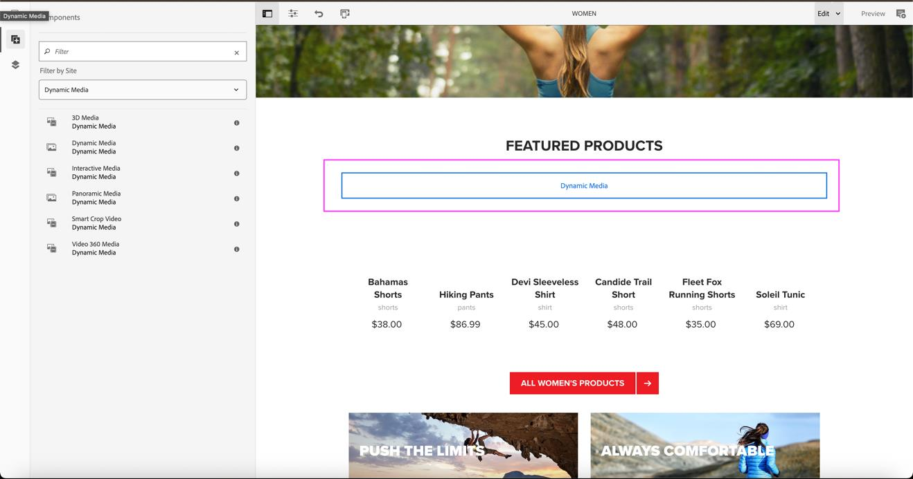

# Nieuwe video-viewer in dynamische media {#new-video-viewer-dynamic-media}

De nieuwe VideoKijker voor Dynamische Media verstrekt een gemoderniseerde videoplayback in Adobe Experience Manager (AEM). Het biedt een consistente en uitbreidbare kijkervaring in verschillende ontwerp-, voorproef- en Sites-omgevingen en werkt tegelijk met bestaande workflows voor dynamische media.

De bestaande videokijkers in Dynamische Media steunen kernplaybackvereisten maar verstrekken beperkte rekbaarheid en gebeurtenisvlakke integratie voor moderne analytische en integratiescenario&#39;s

De nieuwe Video Viewer verhelpt deze beperkingen door:

* Een consistentere afspeelervaring
* Selectie van expliciete viewers toestaan
* Structuurgebeurtenissen voor programmatisch afspelen uitzenden
* Ondersteuning van integratie met externe analytics en externe systemen

De viewer is beschikbaar als een extra optie en vereist expliciete selectie indien ondersteund. Bestaande videoviewers worden niet automatisch vervangen.

De Nieuwe Video Viewer is bedoeld voor organisaties die een verbeterde en uitbreidbare videobeleving nodig hebben zonder bestaande implementaties te onderbreken.

> **NOTA**
>
> De nieuwe video-viewer is een beperkte beschikbaarheidsfunctie. U kunt het krijgen toegelaten door a [&#x200B; steunkaartje &#x200B;](https://helpx.adobe.com/nl/enterprise/using/support-for-experience-cloud.html) te creëren.

## De werking van de nieuwe video-viewer {#how-it-works}

De nieuwe video-viewer werkt als volgt:

1. Een video-element wordt opgenomen in een map die is gesynchroniseerd met Dynamic Media.
2. De video kan van de pagina van elementdetails worden voorvertoond gebruikend **Video (nieuw)**.
3. De nieuwe VideoKijker kan in de **component van Dynamic Media** worden geselecteerd wanneer het ontwerpen van de pagina&#39;s van Plaatsen.
4. Tijdens het afspelen verzendt de viewer gestructureerde gebeurtenissen naar het bovenliggende venster.
5. U kunt optionele viewermodifiers gebruiken om het afspeelgedrag te besturen.

## Belangrijkste verschillen met de bestaande Video Viewer {#key-differences}

| Gebied | Beschrijving |
|------|-------------|
| Beschikbaarheid van viewer | Verschijnt als nieuwe genoemde optie **Video (nieuw)** |
| Viewer-selectie | Moet expliciet worden geselecteerd |
| Uitbreidbaarheid | Biedt gestructureerde afspeelgebeurtenissen |
| Integratie | Blijft werken met bestaande workflows voor dynamische media |

## Vereisten {#prerequisites}

Controleer voordat u de nieuwe video-viewer gebruikt of aan de volgende voorwaarden is voldaan:

| Vereiste | Beschrijving |
|------------|-------------|
| Dynamische media-synchronisatie | De elementmap moet worden gesynchroniseerd met Dynamic Media. |
| Videoprofiel | Er moet een videoprofiel worden toegepast op de map. |
| Video-element | Er moet een video in de map worden opgenomen. |

De Nieuwe VideoKijker is beschikbaar beginnend met **versie 2025.7.0 van AEM as a Cloud Service**.

Neem contact op met de klantenservice van Adobe om de New Video Viewer in of uit te schakelen.

## Voorvertoning van de nieuwe video-viewer {#preview}

Voer de volgende stappen uit om een voorvertoning van de nieuwe video-viewer weer te geven vanaf de pagina met elementdetails:

1. Navigeer aan **Assets** > **Dossiers**, en open de omslag die de videoactiva bevatten.
2. Klik op het video-element om de pagina met elementdetails te openen.
3. In het linkerpaneel, klik **Kijkers**.
4. In het **paneel van Kijkers**, uitgezochte **Video (nieuw)**.
5. Klik **URL** om de voorproefverbinding te kopiëren.
   

## De nieuwe video-viewer op sites gebruiken {#use-in-sites}

De Nieuwe VideoKijker is beschikbaar door de bestaande **Dynamische component van Media** in AEM Sites.

### De component Dynamische media toevoegen

Voer de volgende stappen uit om een video toe te voegen met behulp van de Dynamic Media-component:

1. Open de pagina in de **redacteur van Plaatsen**.
2. Sleep de **Dynamische component van Media** aan de vereiste plaats op de pagina.
3. Selecteer de **Dynamische component van Media** op de pagina.
4. Klik op de component om de elementenkiezer te openen.
5. Selecteer een video-element.

### De viewer configureren

Voer de volgende stappen uit om de viewer-voorinstelling te configureren:

1. Selecteer de **Dynamische component van Media** op de pagina.
2. Klik **vormen** in de componententoolbar.
   

3. In de **de montagesdialoog van Dynamic Media**, uitgezochte **Video (nieuw)** van de **Vooraf ingestelde Kijker** drop-down lijst.
   

4. Ga om het even welke vereiste bepalingen op het **Gewijzigde 1&rbrace; gebied van de Kijker in (bijvoorbeeld,**).`autoplay=true&muted=true`
   

5. Sla de wijzigingen op.

De video wordt op de pagina geladen met de nieuwe videoviewer.

> **Nota:** de Nieuwe VideoKijker vervangt automatisch geen bestaande video&#39;s. De gebruikers moeten manueel **Video (nieuw) selecteren** in de **Vooraf ingestelde Kijker** wanneer het gebruiken van de Dynamische component van Media, of directe URLs bijwerken om aan de Nieuwe VideoKijker te richten waar nodig.

### Video&#39;s migreren met behulp van directe URL&#39;s

Als uw video&#39;s worden geopend via directe URL&#39;s in plaats van via de Dynamic Media-component, kunt u deze overschakelen naar de nieuwe video-viewer door de URL bij te werken. Bijvoorbeeld: `https://s7d1.scene7.com/dmviewers/html5/VideoViewer.html?asset=<video-asset>`

## Viewer-opties {#viewer-modifiers}

Met Viewer-opties kunt u het laden van elementen, het afspeelgedrag, de selectie van streaming-indelingen en de viewerpresentatie beheren.

| Modifier | Beschrijving |
|--------|-------------|
| `asset` | Hiermee geeft u de element-id op van de video- of adaptieve videoset. |
| `posterimage` | Hiermee geeft u de afbeelding op die wordt weergegeven voordat het afspelen wordt gestart. |
| `serverurl` | Hiermee geeft u het hoofdpad van de afbeeldingsserver op. |
| `contenturl` | Hiermee wordt het hoofdpad van de inhoud opgegeven. |
| `videoserverurl` | Geeft het hoofdpad van de videoserver op. |
| `sources.dash` | Hiermee wordt de URL van het DASH-manifest voor het afspelen opgegeven. |
| `sources.hls` | Hiermee wordt de URL van het HLS-manifest voor het afspelen opgegeven. |
| `autoplay=true` | Hiermee wordt het afspelen automatisch gestart wanneer de video wordt geladen. |
| `controls=true/false` | Hiermee toont of verbergt u de besturingselementen voor het afspelen van video. |
| `loop=true` | Hiermee wordt het afspelen automatisch hervat nadat de video is beëindigd. |
| `muted=true` | Hiermee wordt het afspelen gestart in een gedempte toestand. |
| `playbackrates` | Hiermee geeft u de beschikbare afspeelsnelheidopties op. |
| `playback` | Hiermee geeft u de streamingindeling op (automatisch, hls, streepje of progressief). |
| `progressivebitrate` | Geeft de bitsnelheid aan voor progressief afspelen. |
| `initialbitrate` | Geeft de aanvankelijke bitsnelheid voor adaptieve streaming aan. |
| `isletterboxed=true/false` | Hiermee bepaalt u of de video wordt voorzien van zwarte balken of uitgerekt. |
| `customcss` | Hiermee geeft u een aangepast CSS-bestand voor vieweropmaak op. |
| `transition` | Hiermee geeft u het gedrag voor het tonen of verbergen van de overgang voor besturingselementen in de viewer op. |

De bepalingen worden gespecificeerd als vraagparameters op het **gebied van de Kijker Modifiers**.

## Ondersteunde gebeurtenissen {#supported-events}

De nieuwe video-viewer verzendt de volgende gebeurtenissen tijdens het afspelen:

| Het type Event | Beschrijving |
|-----------|-------------|
| afspelen | Video wordt afgespeeld |
| pauzeren | Video is gepauzeerd |
| seek | Gebruiker zoekt in de video |
| load | Video is geladen |
| close | Speler is gesloten |
| metagegevens | Metagegevens zoals duur |
| mijlpaal | Afspeelmijlpaal bereikt |
| current_time | Periodieke afspeelpositie |
| volledig scherm | Volledig scherm openen |
| un_fullscreen | Volledig scherm afsluiten |

## Gebeurtenissen afhandelen in het bovenliggende venster {#handling-events}

De nieuwe VideoKijker verzendt playbackgerelateerde berichten naar de ouderpagina tijdens videointeractie.

Om deze gebeurtenissen te kunnen verwerken, moet de bovenliggende toepassing luisteren naar browserberichtgebeurtenissen en de oorsprong van het bericht valideren voordat de gegevens worden verwerkt.

De gebeurtenislading omvat informatie zoals het gebeurtenistype, playbackstaat, huidige playbacktijd, en extra meta-gegevens. Deze gebeurtenissen kunnen worden gebruikt ter ondersteuning van analytics tracking, aangepaste interacties of integratie met externe systemen

Adobe raadt aan de oorsprong van het bericht te valideren om ervoor te zorgen dat gebeurtenissen alleen worden verwerkt vanuit vertrouwde Dynamic Media-domeinen.

## Video Engagement Report for the New Video Viewer {#video-engagement-report}

Het rapport Videobetrokkenheid bevat analysemetriek voor video&#39;s die worden afgespeeld met de nieuwe video-viewer in dynamische media. Het rapport levert geaggregeerde prestatiegegevens voor de opgegeven maand en ondersteunt maandelijkse rapportage.

Rapporten worden op verzoek gegenereerd. Om een rapport te verzoeken, creeer a [&#x200B; steunkaartje &#x200B;](https://helpx.adobe.com/nl/enterprise/using/support-for-experience-cloud.html) en verstrek de volgende details:

* Maand van rapport - Geef de maand op waarvoor het rapport vereist is (bijvoorbeeld januari 2026).
* E-mailadres van levering - E-mailadres van de groep (aanbevolen) of persoon om het rapport te verzenden

Het rapport biedt betrokkenheidsmetrics per video, inclusief weergaven, impressies, horlogetijd, voltooiingspercentage en betrokkenheidsscore.

### Rapportindeling

* Rapporten worden geleverd in CSV-indeling.
* Elke rij vertegenwoordigt één video.
* De statistieken worden voor de geselecteerde rapportageperiode samengevoegd.
* Verwijderde elementen worden niet opgenomen in het rapport.
* Ondersteuning voor filteren door `tenant_name` .

### Rapportvelden

Het rapport Videobetrokkenheid bevat de volgende velden:

| Veld | Beschrijving | Berekening |
|-------|------------|-------------|
| `video_id` | Unieke video-id. | NA |
| `video_name` | Naam van het video-element. | NA |
| `video_created_date` | De datum waarop de video is gemaakt. | NA |
| `duration_in_seconds` | Duur van de video in seconden. | NA |
| `video_views` | Het totale aantal videoafspeelgebeurtenissen tijdens de geselecteerde rapportageperiode. | NA |
| `video_impressions` | Het totale aantal keren dat de video is geladen. | NA |
| `video_watched_seconds` | Het totaal aantal seconden dat wordt gecontroleerd tijdens alle afspeelgebeurtenissen. | Het aantal seconden dat wordt gecontroleerd tijdens alle afspeelgebeurtenissen |
| `play_rate` | Percentage videoafspelen ten opzichte van videolading. | (`video_views`:t `video_impressions`) × 100 |
| `avg_time_watched_in_seconds` | Gemiddeld aantal seconden dat wordt gecontroleerd per weergave. | `video_watched_seconds`:t `video_views` |
| `avg_completion_rate` | Percentage weergaven dat volledige videovoltooiing heeft bereikt. | (Voltooide weergaven:`video_views`) × 100 |
| `engagement_score` | Gemiddeld controlepercentage voor alle afspeelgebeurtenissen. | (Totale percentage van videotijdlijn dat in alle sessies wordt weergegeven:1 `video_views`) |
| `tenant_name` | Identifier van het bedrijf of de huurder die aan de gegevens is gekoppeld. | NA |

## Veelgestelde vragen {#faq-video-engagement}

+++Als een video is ingesteld op automatisch afspelen, wordt deze dan automatisch geteld als weergave of alleen nadat de gebruiker gedurende een minimale periode heeft gecontroleerd?

Automatisch afspelen wordt geteld als een videoweergave. Het automatisch afspelen wordt opgenomen als een weergave.

+++

+++Wordt een gebruiker die slechts een deel van een video bekijkt (bijvoorbeeld de eerste 2 seconden en de laatste 2 seconden van een video van 10 seconden), geteld als een voltooide weergave?

Een weergave wordt geteld als voltooid wanneer het afspelen het einde van de videotijdlijn bereikt, zelfs als delen van de video zijn overgeslagen.

+++

+++Als een gebruiker gedeelten van de video achterwaarts scrubt en opnieuw bekijkt, verhoogt het dan het aantal video_views, de betrokkenheidsscore of beide?

Door gedeelten van de video opnieuw te bekijken, wordt het aantal video_views niet verhoogd. Extra playback draagt aan betrokkenheidsscore bij.

+++

+++Als dezelfde gebruiker dezelfde video meerdere keren bekijkt zonder de pagina opnieuw te laden, hoe worden video_views en betrokkenheidsscore berekend?

Het aantal video_views neemt niet toe wanneer u de pagina opnieuw afspeelt zonder de pagina opnieuw te laden. Extra playback draagt aan betrokkenheidsscore bij.

+++

+++Heeft het pauzeren en hervatten van een video invloed op het bijhouden van betrokkenheid of het berekenen van de voltooiingssnelheid?

Het pauzeren en hervatten van het afspelen heeft geen invloed op het bijhouden van betrokkenheid of het berekenen van de voltooiingsfrequentie.

+++
