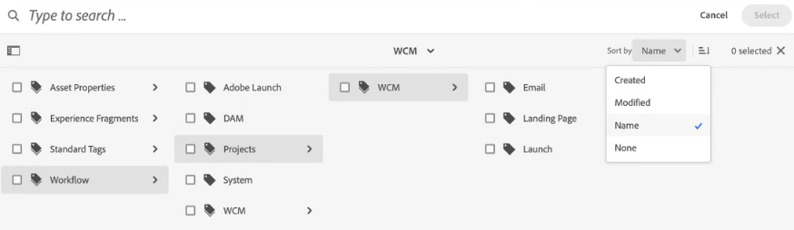

# Uw digitale middelen organiseren {#organize-digital-assets}

| Versie | Artikelkoppeling |
| -------- | ---------------------------- |
| AEM 6.5 | [&#x200B; klik hier &#x200B;](https://experienceleague.adobe.com/docs/experience-manager-65/assets/managing/organize-assets.html?lang=nl-NL) |
| AEM as a Cloud Service | Dit artikel |

Alle digitale elementen, metagegevens en inhoud van Microsoft® Office- en PDF-documenten worden uitgepakt en doorzoekbaar gemaakt. Het onderzoek staat verfijnd het filtreren op activa toe en eerbiedigt volledig de juiste toestemmingen. Metagegevens worden in detail besproken in Metagegevens in Digital Asset Management.

[!DNL Experience Manager Assets] ondersteunt meerdere manieren om inhoud te ordenen. U kunt de mappen hiërarchisch ordenen met behulp van mappen, maar u kunt ze ook ordenen op een ongeordende, ad-hocmanier, bijvoorbeeld met tags. Gebruikers kunnen labels bewerken in de DAM Asset Editor, waar submiddelen, uitvoeringen en metagegevens worden weergegeven.

<!-- Commenting to pull down the existing content before applying changes wrt CQDOC-15930
## Create folders {#create-folders}

When organizing a collection of assets, for example, all *Nature* images, you can create folders to keep them together. You can use folders to categorize and organize your assets. [!DNL Assets] does not require you to organize assets in folders to work better.

>[!NOTE]
>
>Sharing an Assets folder (in Marketing Cloud) of the type `sling:OrderedFolder`, is not supported. If you want to share a folder, do not select Ordered when creating a folder.

1. Navigate to the place in your digital assets folder where you want to create a folder.
1. In the menu, click **[!UICONTROL Create]**. Select **[!UICONTROL New Folder]**.
1. In the **[!UICONTROL Title]** field, provide a folder name. By default, DAM uses the title that you provided as the folder name. Once the folder is created, you can override the default and specify another folder name.
1. Click **[!UICONTROL Create]**. Your folder is displayed in the digital assets folder.

## Add CUG properties to folders {#add-cug-properties-to-folders}

You can limit who can access certain folders in Assets by making the folder part of a closed user group (CUG). To make a folder part of a CUG:

1. In Assets, right-click the folder you want to add closed user group properties for and select **Properties**.  
1. Click the **CUG** tab.
1. Select the **Enabled** check box to make the folder and its assets available only to a closed user group.  
1. Browse to the login page, if there is one, to add that information. Add admitted groups by clicking **Add item**. If necessary, add the realm. Click **OK** to save your changes.

## Use tags to organize assets {#use-tags-to-organize-assets}

You can use folders or tags or both to organize assets. Adding tags to assets makes them easier to retrieve during a search. To add tags to an asset, follow these steps:

1. In the Digital Asset Manager, double-click the asset to open it.
1. In the **Tags** area, open the menu to reveal the available tags. Select tags as appropriate. To delete a tag, hover the pointer over the tag and click `X` to delete it.
1. Click **Save** to save any tags you added.

Date24/08/2021
-->

## Elementen in mappen ordenen {#organize-using-folders}

De eenvoudigste manier om elementen te ordenen is het opslaan van de elementen in mappen. Dit is hetzelfde als het ordenen van bestanden in mappen in uw lokale bestandssysteem. Voor meer informatie over om omslagen tot stand te brengen en te beheren, zie [&#x200B; activa &#x200B;](manage-digital-assets.md) beheren. Hoe u bestanden en mappen benoemt, hoe u submappen ordent en hoe u de bestanden in deze mappen verwerkt, kan een grote invloed hebben op de manier waarop deze elementen worden verwerkt. Door consistente en geschikte naamgevingsstrategieën voor bestanden en mappen te gebruiken, samen met goede praktijken voor metagegevens, kunt u optimaal gebruikmaken van de opslagplaats voor digitale elementen.

* Gewoonlijk groeit de opslagplaats voor digitale middelen altijd. Daarom is het belangrijk om het gebruik van metagegevens, de mapstructuur en de naamgeving van bestanden vroegtijdig te formaliseren in de cyclus waarin de inhoud wordt gemaakt.
* Gebruik mappen alleen om een consistente opslagstructuur voor uw digitale elementen op te leggen. Deze consistentie helpt uw proces en beheert uw activa beter. Met middelen die bijvoorbeeld in de volgende typen mappen worden geplaatst, kunt u uw elementen segregeren:

   * **de omslagen van de Ontwikkeling**: bevat digitale activa die u momenteel werkt aan.
   * **omslagen van de Cliënt**: bevat digitale activa die op cliënten of projectnamen worden gebaseerd.
   * **Primaire omslagen**: bevat originele, bron digitale activa.
   * **omslagen van de Vertoning**: bevat vertoningen en exemplaren van de originele, bron digitale activa.
   * **omslagen van de Grootte van het Dossier**: bevat digitale activa die op kleine, middelgrote, of grote dossiergrootte worden gebaseerd.
   * **het Opvoeren omslagen**: bevat digitale activa die bereid zijn om live op uw website te publiceren.
   * **MIME typemappen**: bevat digitale activa die voor types MIME zoals beelden, documenten, en multimedia specifiek zijn.
   * **omslagen van het Archief**: bevat gepensioneerde digitale activa.
   * **op datum-gebaseerde omslagen**: bevat digitale activa die op een aanmaakdatum of een laatste gewijzigde datum worden gebaseerd.

* Maak een map met mappen die waarschijnlijk niet worden gewijzigd, zodat aanpassingen of automatisering gewoon kunnen doorgaan. De toegewezen verwerkingsprofielen werken bijvoorbeeld nog steeds.
* Als een element al is gepubliceerd, gebruikt u [!DNL Experience Manager] om het element naar een andere map te verplaatsen en opnieuw te publiceren vanaf de nieuwe locatie. De oorspronkelijke locatie van het gepubliceerde element is nog steeds beschikbaar samen met het nieuw gepubliceerde element. De originele gepubliceerde activa, echter, worden *verloren* aan [!DNL Experience Manager] en kunnen niet unpublished. Daarom, als beste praktijken, eerst unpublish een middel en dan verplaats het naar een verschillende omslag.

## Elementen ordenen met tags {#use-tags-to-organize-assets}

Als u tags aan elementen toevoegt, kunt u deze tijdens een zoekopdracht gemakkelijker terugvinden, verzamelingen maken met behulp van de zoekresultaten, de zoekpositie voor bepaalde elementen verhogen en AI-algoritmen van Adobe Sensei toepassen voor het detecteren van elementen.

[!DNL Adobe Experience Manager Assets] gebruikt een zelfstudie-algoritme om zeer beschrijvende tags te maken waarmee u het juiste element met een paar klikken kunt vinden. Slimme tags maken gebruik van Adobe Sensei, artificiële intelligentie en het leerframework voor machines, die kunnen worden opgeleid om zowel standaard- als bedrijfsspecifieke tags te herkennen en toe te passen op afbeeldingen. Met slimme tags kunt u ook inhoud, afzonderlijke woorden of zinsdelen identificeren en automatisch beschrijvende tags toepassen op elementen.

Hieronder vindt u de stappen voor het toevoegen van codes aan een element:

1. Meld u aan bij [!DNL Experience Manager Assets] .
1. Klik op **[!UICONTROL Assets]** > **[!UICONTROL Files]** , selecteer het element en klik op **[!UICONTROL Properties]** om de eigenschappen van het element te openen.
1. Klik op het tabblad **[!UICONTROL Basic]** op het mappictogram in de metagegevens van **[!UICONTROL Tags]** . Er wordt een pop-upvenster geopend.
1. Zoek of selecteer de juiste tags van de bestaande tags in `cq-tags` . U kunt meerdere tags toewijzen aan het element.

   U kunt de codestructuur in oplopende of aflopende volgorde sorteren op basis van de datum **[!UICONTROL Name]** (alfabetische volgorde), **[!UICONTROL Created]** date of **[!UICONTROL Modified]** . In de volgende afbeelding wordt de codestructuur alfabetisch gesorteerd op basis van de **[!UICONTROL Name]** .

   

1. Klik **sparen** om de veranderingen van activa meta-gegevens bij te werken.

Raadpleeg de volgende artikelen voor meer informatie:

* [Metagegevens van elementen bewerken](meta-edit.md)
* [Slimme tags in Assets](smart-tags.md)
* [Voorspelende tags toevoegen aan het zoekvenster](/help/assets/search-facets.md#adding-a-tags-predicate)

## Indelen als verzamelingen {#organize-as-collections}

Met de functie voor het verzamelen van middelen in [!DNL Experience Manager Assets] kunt u de mogelijkheid om elementen te maken, te bewerken en te delen, stroomlijnen tussen gebruikers. Maak verschillende soorten verzamelingen op basis van de manier waarop u ze gebruikt, waaronder verzamelingen die een statische referentielijst met elementen, mappen en verzamelingen bevatten, en verzamelingen die op basis van zoekcriteria elementen in elementen trekken. U kunt verzamelingen maken met elementen van verschillende locaties en deze delen met meerdere gebruikers met verschillende toegangsniveaus, weergavebevoegdheden en bewerkingsbevoegdheden.

Voor meer informatie, zie [&#x200B; inzamelingen &#x200B;](manage-collections.md) beheren

## Profielen gebruiken om uw elementen te ordenen {#organize-to-use-profiles}

Een verwerkingsprofiel bevat [!DNL Assets] -verwerkingsopdrachten die van toepassing zijn op elementen die worden geüpload naar vooraf gedefinieerde mappen. Profielen worden gebruikt om de verwerking van inhoud van een map of nieuw geüploade elementen te automatiseren. U kunt profielen gebruiken om uw elementen beter te ordenen.

Als u het gebruik van metagegevens, de naamgeving van bestanden en de mapstructuur gestandaardiseerd, bent u er zeker van dat u verwerkingsprofielen met grotere nauwkeurigheid en consistentie kunt toepassen op mappen wanneer de pool met digitale elementen toeneemt.

**zie ook**

* [Assets vertalen](translate-assets.md)
* [ASSETS HTTP API](mac-api-assets.md)
* [Door Assets ondersteunde bestandsindelingen](file-format-support.md)
* [Zoeken in middelen](search-assets.md)
* [Verbonden elementen](use-assets-across-connected-assets-instances.md)
* [Elementen rapporteren](asset-reports.md)
* [Metagegevensschema&#39;s](metadata-schemas.md)
* [Elementen downloaden](download-assets-from-aem.md)
* [Metagegevens beheren](manage-metadata.md)
* [Zoeken in facetten](search-facets.md)
* [Verzamelingen beheren](manage-collections.md)
* [Bulkmetagegevens importeren](metadata-import-export.md)
* [Assets publiceren naar AEM en Dynamic Media](/help/assets/publish-assets-to-aem-and-dm.md)

>[!MORELIKETHIS]
>
>* [&#x200B; de activa microservices en verwerkingsprofielen van het Gebruik &#x200B;](asset-microservices-configure-and-use.md)
>* [Metadataprofielen](metadata-profiles.md)
>* [&#x200B; Videoprofielen &#x200B;](/help/assets/dynamic-media/video-profiles.md)
>* [&#x200B; Dynamische het beeldprofielen van Media &#x200B;](/help/assets/dynamic-media/image-profiles.md)

