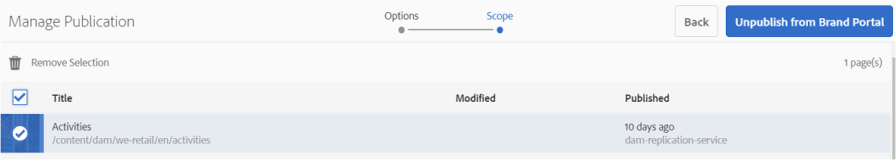

# Assets publiceren naar Brand Portal {#publish-assets-to-brand-portal}

Als beheerder van AEM Assets (Adobe Experience Manager) kunt u assets, mappen en verzamelingen publiceren naar de AEM Assets Brand Portal-instantie. Bovendien kunt u de publicatieworkflow van een asset of map op een latere datum of tijd plannen. Na publicatie krijgen de Brand Portal-gebruikers toegang tot de assets, mappen en verzamelingen en kunnen ze deze naar andere gebruikers distribueren.

U moet echter eerst AEM Assets configureren met Brand Portal. Zie [AEM Assets configureren met Brand Portal](configure-aem-assets-with-brand-portal.md) voor meer informatie.

Als u volgende wijzigingen aanbrengt in de oorspronkelijke asset, map of verzameling in AEM Assets, worden de wijzigingen pas doorgevoerd in Brand Portal als u opnieuw publiceert vanaf AEM Assets. Met deze functie zorgt u ervoor dat wijzigingen die momenteel worden uitgevoerd, niet beschikbaar zijn in Brand Portal. Alleen goedgekeurde wijzigingen die door een beheerder zijn gepubliceerd, zijn beschikbaar in Brand Portal.

* [Assets publiceren naar Brand Portal](#publish-assets-to-bp)
* [Mappen publiceren naar Brand Portal](#publish-folders-to-brand-portal)
* [Verzamelingen publiceren naar Brand Portal](#publish-collections-to-brand-portal)

>[!NOTE]
>
>Adobe raadt gefaseerde publicatie aan, bij voorkeur niet tijdens piekuren, zodat de AEM-auteur niet te veel bronnen in beslag neemt.

## Assets publiceren naar Brand Portal {#publish-assets-to-bp}

Hier volgen de stappen voor het publiceren van assets van AEM Assets naar Brand Portal:

1. Open vanuit de Assets-console de bovenliggende map, selecteer alle assets die u wilt publiceren en klik op de optie **[!UICONTROL Quick Publish]** op de werkbalk.

   

1. Hier volgen de twee manieren waarop u assets kunt publiceren:
   * [Nu publiceren](#publish-to-bp-now) (assets onmiddellijk publiceren)
   * [Later publiceren](#publish-to-bp-later) (het publiceren van assets plannen)

### Assets nu publiceren {#publish-to-bp-now}

Voer een van de volgende handelingen uit om de geselecteerde assets naar Brand Portal te publiceren:

* Selecteer **[!UICONTROL Quick Publish]** in de werkbalk. Klik vervolgens in het menu op **[!UICONTROL Publish to Brand Portal]**.

* Selecteer **[!UICONTROL Manage Publication]** in de werkbalk.

   1. Selecteer vanaf **[!UICONTROL Action]** de optie **[!UICONTROL Publish to Brand Portal]**.

      Selecteer vanaf **[!UICONTROL Scheduling]** de optie **[!UICONTROL Now]**.

      Klik op **[!UICONTROL Next]**.

   2. Bevestig uw selectie in **[!UICONTROL Scope]** en klik op **[!UICONTROL Publish to Brand Portal]**.

Er verschijnt een bericht waarin wordt aangegeven dat de assets in de wachtrij zijn geplaatst voor publicatie naar Brand Portal. Meld u aan bij de Brand Portal-interface om de gepubliceerde assets te bekijken.

### Assets later publiceren {#publish-to-bp-later}

Voer de volgende handelingen uit om het publiceren van de assets naar Brand Portal op een latere datum of tijd te plannen:

1. Selecteer de assets die u wilt plannen voor publicatie en klik op **[!UICONTROL Manage Publication]** in de werkbalk bovenaan.

1. Selecteer op de pagina **[!UICONTROL Manage Publication]** de optie **[!UICONTROL Publish to Brand Portal]** vanuit **[!UICONTROL Action]**.

   Selecteer **[!UICONTROL Later]** vanuit **[!UICONTROL Scheduling]**.

   

1. Selecteer een **[!UICONTROL Activation date]** en geef de tijd op. Klik op **[!UICONTROL Next]**.

1. Selecteer een **activeringsdatum** en geef de tijd op. Klik op **Next**.

1. Geef een **[!UICONTROL Workflow title]** op in **[!UICONTROL Workflows]**. Klik op **[!UICONTROL Publish Later]**.

   

Meld u aan bij de Brand Portal-interface om de gepubliceerde assets te bekijken (afhankelijk van uw geplande datum of tijd).

## Mappen publiceren naar Brand Portal {#publish-folders-to-brand-portal}

U kunt mappen met assets direct publiceren of verwijderen of op een latere datum of tijd plannen.

### Mappen publiceren naar Brand Portal {#publish-folders-to-bp}

1. Selecteer in de Assets-console de mappen die u wilt publiceren en klik op de optie **[!UICONTROL Quick Publish]** op de werkbalk.

   

1. **Mappen nu publiceren**

   Voer een van de volgende handelingen uit om de geselecteerde mappen naar Brand Portal te publiceren:

   * Selecteer **[!UICONTROL Quick Publish]** in de werkbalk.

      Selecteer **[!UICONTROL Publish to Brand Portal]** in het menu.

   * Selecteer **[!UICONTROL Manage Publication]** in de werkbalk.

      1. Selecteer vanaf **[!UICONTROL Action]** de optie **[!UICONTROL Publish to Brand Portal]**.

         Selecteer vanaf **[!UICONTROL Scheduling]** de optie **[!UICONTROL Now]**.

         Klik op **Next.**

      1. Bevestig uw selectie in **[!UICONTROL Scope]** en klik op **[!UICONTROL Publish to Brand Portal]**.
   Er verschijnt een bericht waarin wordt aangegeven dat de map in de wachtrij is geplaatst voor publicatie naar Brand Portal. Meld u aan bij de Brand Portal-interface om de gepubliceerde map te bekijken.

1. **Mappen later publiceren**

   U kunt als volgt het publiceren van de mappen met assets op een latere datum of tijd plannen:

   1. Selecteer de mappen die u wilt plannen voor publicatie en selecteer **[!UICONTROL Manage Publication]** in de werkbalk bovenaan.
   1. Selecteer vanaf **[!UICONTROL Action]** de optie **[!UICONTROL Publish to Brand Portal]**.

      Selecteer vanaf **[!UICONTROL Scheduling]** de optie **[!UICONTROL Later]**.

   1. Selecteer een **[!UICONTROL Activation date]** en geef de tijd op. Klik op **[!UICONTROL Next]**.

      

   1. Bevestig uw selectie in **[!UICONTROL Scope]**. Klik op **[!UICONTROL Next]**.

   1. Geef een titel voor de workflow op onder **[!UICONTROL Workflows]**. Klik op **[!UICONTROL Publish Later]**.

      

### De publicatie van mappen op Brand Portal ongedaan maken {#unpublish-folders-from-brand-portal}

U kunt elke map met assets die op Brand Portal is gepubliceerd, verwijderen door de publicatie ongedaan te maken van de AEM Assets-instantie. Nadat u de publicatie van de oorspronkelijke map ongedaan hebt gemaakt, is de kopie ervan niet meer beschikbaar voor Brand Portal-gebruikers.

U kunt de publicatie van mappen met assets onmiddellijk ongedaan maken vanaf Brand Portal of u kunt dit op een latere datum en tijd plannen.

De publicatie van mappen met assets op Brand Portal ongedaan maken:

1. Selecteer in de Assets-console de mappen met assets waarvan u de publicatie ongedaan wilt maken en klik op de optie **[!UICONTROL Manage Publication]** op de werkbalk.

   

1. **De publicatie van mappen met assets nu ongedaan maken**

   U kunt als volgt de publicatie van de geselecteerde map met assets op Brand Portal ongedaan maken:

   1. Selecteer **[!UICONTROL Manage Publication]** in de werkbalk.

   1. Selecteer vanaf **[!UICONTROL Action]** de optie **[!UICONTROL Unpublish from Brand Portal]**.

      Selecteer vanaf **[!UICONTROL Scheduling]** de optie **[!UICONTROL Now]**.

      Klik op **[!UICONTROL Next]**.

   1. Bevestig uw selectie in **[!UICONTROL Scope]** en klik op **[!UICONTROL Unpublish from Brand Portal]**.

      

1. **De publicatie van mappen met assets later ongedaan maken**

   U kunt als volgt het ongedaan maken van de publicatie van een map met assets op een latere datum en tijd plannen:

   1. Selecteer **[!UICONTROL Manage Publication]** in de werkbalk.

   1. Selecteer vanaf **[!UICONTROL Action]** de optie **[!UICONTROL Unpublish from Brand Portal]**.

      Selecteer vanaf **[!UICONTROL Scheduling]** de optie **[!UICONTROL Later]**.

   1. Selecteer een **[!UICONTROL Activation date]** en geef de tijd op. Klik op **[!UICONTROL Next]**.

   1. Bevestig uw selectie in **[!UICONTROL Scope]** en klik op **[!UICONTROL Next]**.

   1. Geef een **[!UICONTROL Workflow title]** op in **[!UICONTROL Workflows]**. Klik op **[!UICONTROL Unpublish Later]**.

      

## Verzamelingen publiceren naar Brand Portal {#publish-collections-to-brand-portal}

U kunt verzamelingen publiceren of de publicatie ervan ongedaan maken vanuit uw AEM Assets-cloudinstantie.

>[!NOTE]
>
>Contentfragmenten kunnen niet naar Brand Portal worden gepubliceerd. Als u dus een of meerdere contentfragmenten selecteert in AEM Assets, is de actie **[!UICONTROL Publish to Brand Portal]** niet beschikbaar.
>
>Als verzamelingen met contentfragmenten van AEM Assets naar Brand Portal worden gepubliceerd, wordt alle content van de map behalve contentfragmenten gerepliceerd naar de Brand Portal-interface.

### Verzamelingen publiceren {#publish-collections}

Hier volgen de stappen voor het publiceren van verzamelingen van AEM Assets naar Brand Portal:

1. Klik in de AEM Assets-gebruikersinterface op het AEM-logo.

1. Ga vanaf de pagina **Navigation** naar **[!UICONTROL Assets]** > **[!UICONTROL Collections]**.

1. Selecteer vanaf de **Collections**-console de verzamelingen die u naar Brand Portal wilt publiceren.

   

1. Klik **[!UICONTROL Publish to Brand Portal]** op de werkbalk.

1. Klik in het bevestigingsdialoogvenster op **[!UICONTROL Publish]**.

1. Sluit het bevestigingsbericht.

   Meld u aan bij Brand Portal als beheerder. De gepubliceerde verzameling is beschikbaar in de Collections-console.

   

### De publicatie van verzamelingen ongedaan maken {#unpublish-collections}

U kunt elke verzameling die op Brand Portal is gepubliceerd, verwijderen door de publicatie ervan ongedaan te maken vanaf uw AEM Assets-instantie. Nadat u de publicatie van de oorspronkelijke verzameling ongedaan hebt gemaakt, is de kopie ervan niet meer beschikbaar voor Brand Portal-gebruikers.

Hier volgen de stappen voor het ongedaan maken van de publicatie van een verzameling:

1. Selecteer in de **Collections**-console van uw AEM Assets-instantie de verzameling waarvan u de publicatie ongedaan wilt maken.

   

1. Klik op het pictogram **[!UICONTROL Remove from Brand Portal]** op de werkbalk.
1. Klik in het dialoogvenster op **[!UICONTROL Unpublish]**.
1. Sluit het bevestigingsbericht. De verzameling wordt verwijderd uit de Brand Portal-interface.

Naast het bovenstaande kunt u ook schema&#39;s voor metadata, voorinstellingen voor afbeeldingen, zoekfacetten en tags van AEM Assets naar Brand Portal publiceren.

* [Voorinstellingen, schema&#39;s en facetten publiceren naar Brand Portal](https://docs.adobe.com/content/help/en/experience-manager-brand-portal/using/publish/publish-schema-search-facets-presets.html)
* [Tags publiceren naar Brand Portal](https://docs.adobe.com/content/help/en/experience-manager-brand-portal/using/publish/brand-portal-publish-tags.html)

Raadpleeg de [Brand Portal-documentatie](https://docs.adobe.com/content/help/en/experience-manager-brand-portal/using/home.html) voor meer informatie.

<!--
   Comment Type: draft

   <li> </li>
   -->

<!--
   Comment Type: draft

   <li>Step text</li>
   -->
