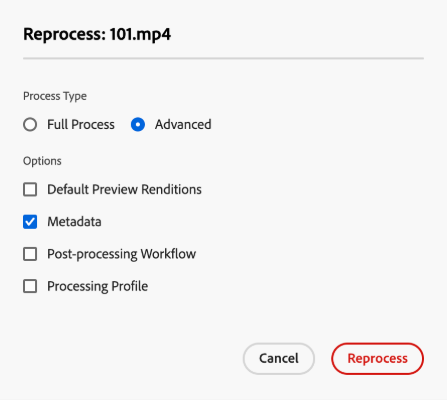

# Digitale middelen opnieuw verwerken {#reprocessing-digital-assets}

U kunt elementen opnieuw verwerken in een map die al een bestaand metagegevensprofiel heeft dat u later hebt gewijzigd. Als u de zojuist bewerkte voorinstelling opnieuw wilt toepassen op de bestaande elementen in de map, moet u de map opnieuw verwerken. U kunt zoveel elementen opnieuw verwerken als u nodig hebt.

Elementen in een map opnieuw verwerken als u een van de volgende twee situaties ervaart:

* U wilt een voorinstelling voor een batchset uitvoeren op een bestaande elementenmap waarin al elementen zijn geüpload.
* U bewerkt later een bestaande voorinstelling voor een batch-set die eerder is toegepast op een map met elementen.

## Elementen opnieuw verwerken {#reprocessing-steps}

Elementen in een map opnieuw verwerken:

1. Selecteer op de Assets-pagina in [!DNL Assets view] de nieuw toegevoegde elementen of de elementen die u opnieuw wilt verwerken.
Als u een map selecteert:

   * In de workflow worden alle bestanden in de geselecteerde map recursief bekeken.
   * Als er een of meer submappen met elementen in de geselecteerde hoofdmap staan, worden alle elementen in de maphiërarchie opnieuw verwerkt.
   * U kunt deze workflow het beste niet uitvoeren in een mappenhiërarchie met meer dan 1000 elementen.

1. Selecteer **[!UICONTROL Reprocess Assets]**. U kunt kiezen uit de volgende twee opties:

   

   * **[!UICONTROL Full Process]:** selecteer deze optie wanneer u het algemene proces met inbegrip van standaardprofiel, douaneprofiel, dynamische verwerking (als gevormd), en postverwerkingswerkschema&#39;s wilt uitvoeren.
   * **[!UICONTROL Advanced]:** selecteer deze optie om geavanceerde opwerking te kiezen.

     

     Kies een van de volgende geavanceerde opties:

      * **[!UICONTROL Default Preview Renditions]:** kies deze optie wanneer u de vertoningen wilt opnieuw verwerken die door gebrek worden voorvertoond.

      * **[!UICONTROL Metadata]:** Kies deze optie als u metagegevens en slimme tags voor de geselecteerde elementen wilt extraheren.

      * **[!UICONTROL Processing Profiles]:** kies deze optie wanneer u een geselecteerd profiel wilt opnieuw verwerken. U kunt de optie **[!UICONTROL Full Process]** kiezen om de standaardverwerking en het aangepaste profiel op te nemen dat op mapniveau is toegewezen.
        <!--When assets are uploaded to a folder, [!DNL Assets ~~view~~] checks the containing folder's properties for a processing profile. If none is applied, a parent folder in the hierarchy is checked for a processing profile to apply.-->

      * **[!UICONTROL Post-processing Workflow]:** Kies deze optie als aanvullende verwerking van elementen vereist is die niet met de verwerkingsprofielen kan worden bereikt. Er kunnen extra nabewerkingsworkflows worden toegevoegd aan de configuratie. Na de verwerking kunt u volledig aangepaste verwerking toevoegen bovenop de configureerbare verwerking met behulp van asset microservices.

Zie [ gebruik activa microservices en verwerkingsprofielen ](https://experienceleague.adobe.com/docs/experience-manager-cloud-service/content/assets/manage/asset-microservices-configure-and-use.html?lang=en) om meer over verwerkingsprofielen en naverwerkingswerkschema te leren.

Klik op **[!UICONTROL Reprocess]** nadat u de juiste opties hebt geselecteerd. De succesboodschap wordt weergegeven.

## Scenario&#39;s voor de opwerking van digitale elementen {#scenarios-reprocessing}

In [!DNL Experience Manager] kunnen digitale elementen worden opgevraagd voor de volgende componenten.

### Slimme tags {#reprocessing-smart-tags}

Organisaties die met digitale middelen te maken hebben, maken steeds vaker gebruik van een door taxonomie gecontroleerde woordenlijst in metagegevens van bedrijfsmiddelen. In wezen, omvat het een lijst van sleutelwoorden die de werknemers, de partners, en de klanten algemeen gebruiken om naar digitale activa van een bepaalde klasse te verwijzen en te zoeken. Door elementen te labelen met een woordenschat die door de taxonomie wordt gecontroleerd, worden de elementen gemakkelijk geïdentificeerd en opgehaald.

Vergeleken met natuurlijke taalwoordenboeken, helpt het etiketteren van digitale activa die op bedrijfstaxonomie worden gebaseerd hen op de zaken van een bedrijf te richten en zorgt ervoor dat de meest relevante activa in onderzoeken verschijnen.

Lees meer over [ Slimme markeringen voor videoactiva ](https://experienceleague.adobe.com/docs/experience-manager-cloud-service/content/assets/manage/smart-tags-video-assets.html?lang=en).

Lees meer over [ opnieuw verwerkings kleurenmarkeringen voor bestaande beelden in DAM ](https://experienceleague.adobe.com/docs/experience-manager-cloud-service/content/assets/manage/color-tag-images.html?lang=en#color-tags-existing-images).

### Slim uitsnijden {#reprocessing-smart-crop}

Lees meer over [ het slimme gewas van Dynamic Media ](https://experienceleague.adobe.com/docs/experience-manager-cloud-service/content/assets/dynamicmedia/image-profiles.html?lang=en) dat u specifieke het bebouwen (**[!UICONTROL Smart Cropping]** en pixel het bebouwen) en het scherpen configuratie op de geuploade activa laat toepassen.

### Metagegevens {#reprocessing-metadata}

[!DNL Adobe Experience Manager Assets] houdt metagegevens bij voor elk element. Het maakt het gemakkelijker om activa te categoriseren en te organiseren en het helpt mensen die naar een specifiek bezit zoeken. Dankzij de mogelijkheid om metagegevens te extraheren uit bestanden die naar Experience Manager Assets zijn geüpload, kan het beheer van metagegevens worden geïntegreerd in de creatieve workflow. Met de mogelijkheid om metagegevens bij uw elementen te houden en te beheren, kunt u elementen automatisch ordenen en verwerken op basis van hun metagegevens.

Lees meer over [ het Opverwerken van meta-gegevensprofielen ](https://experienceleague.adobe.com/docs/experience-manager-cloud-service/content/assets/manage/metadata-profiles.html?lang=en).

### Dynamic Media-elementen in een map opnieuw verwerken {#reprocessing-dynamic-media}

U kunt elementen opnieuw verwerken in een map die al een bestaand Dynamic Media-afbeeldingsprofiel heeft of een Dynamic Media-videoprofiel dat u later hebt gewijzigd. Voor meer informatie, bezoek [ opnieuw verwerken de activa van Dynamic Media in een omslag ](https://experienceleague.adobe.com/docs/experience-manager-cloud-service/content/assets/admin/about-image-video-profiles.html?lang=en).

>[!NOTE]
>
>U moet [!DNL Dynamic Media] in de omgeving configureren om het dialoogvenster Dynamic Media in te schakelen.
>

### Workflows

Lees meer over [ verwerkingsprofielen en post-verwerkende werkschema&#39;s ](https://experienceleague.adobe.com/docs/experience-manager-cloud-service/content/assets/manage/asset-microservices-configure-and-use.html?lang=en).
