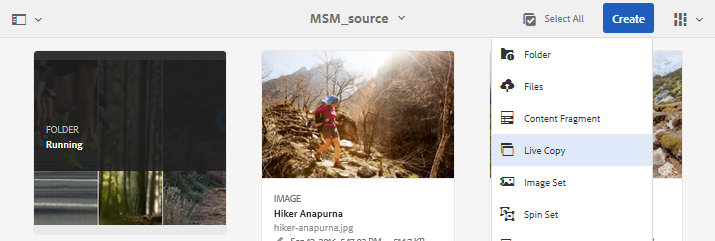

# Elementen hergebruiken met MSM voor middelen{#reuse-assets-using-msm-for-assets}

Met de MSM-functie (Multi Site Manager) in Adobe Experience Manager (AEM) kunnen gebruikers inhoud die eenmaal is ontworpen en opnieuw wordt gebruikt op meerdere weblocaties, hergebruiken. Hetzelfde geldt voor digitale elementen als MSM voor middelenfunctionaliteit. Met MSM voor elementen kunt u:

* Maak een keer elementen en maak vervolgens kopieën van deze elementen die u opnieuw kunt gebruiken in andere gebieden van de site.
* Houd meerdere kopieën gesynchroniseerd en werk de originele hoofdkopie één keer bij om de wijzigingen in de onderliggende kopieën door te voeren.
* Breng lokale wijzigingen aan door de koppeling tussen bovenliggende en onderliggende elementen tijdelijk of permanent op te schorten.

## Begrijp de voordelen en de concepten {#concepts}

### Hoe het werkt en de voordelen {#how-it-works-and-the-benefits}

AEM onderhoudt een koppeling tussen het oorspronkelijke middel en de bijbehorende kopieën, ook wel &quot;live kopieën&quot; genoemd. Door de behouden koppeling kunnen gecentraliseerde wijzigingen worden doorgevoerd in veel live kopieën. Hierdoor kunnen updates sneller worden uitgevoerd, maar hoeven er geen dubbele kopieën te worden beheerd. De verspreiding van veranderingen is fout-vrij en gecentraliseerd. Dankzij deze functionaliteit is er ruimte voor updates die beperkt zijn tot geselecteerde live kopieën. Gebruikers kunnen de koppeling loskoppelen, dat wil zeggen, de overerving verbreken, en lokale bewerkingen aanbrengen die niet worden overschreven wanneer de hoofdkopie de volgende keer wordt bijgewerkt en de wijzigingen worden doorgevoerd. U kunt de koppeling tot stand brengen voor een paar geselecteerde metagegevensvelden of voor een geheel element. Het biedt flexibiliteit om elementen die oorspronkelijk zijn overgeërfd van een hoofdkopie lokaal bij te werken.

MSM onderhoudt een live relatie tussen het bronelement en zijn live kopieën, zodat:

* Wijzigingen in de bronelementen worden ook toegepast (geïmplementeerd) op live kopieën, dat wil zeggen dat de live kopieën worden gesynchroniseerd met de bron.
* U kunt de live kopieën bijwerken door de live relatie op te schorten of de overerving voor een paar beperkte velden te verwijderen. De wijzigingen aan de bron worden niet meer toegepast op de live kopie.

### Verklarende woordenlijst van MSM&#39;s voor activa {#glossary}

**Bron** De oorspronkelijke middelen of omslagen. Stramienkopie waarvan levende kopieën zijn afgeleid.

**Live kopie** De kopie van de bronelementen/mappen die met de bron ervan gesynchroniseerd zijn. Actieve kopieën kunnen een bron zijn van verdere live kopieën. LC&#39;s maken.

**Overerving** Een koppeling/verwijzing tussen een live kopie van een bron/map en de bron van die bron die het systeem gebruikt om te onthouden waar de updates moeten worden verzonden. Overerving bestaat op granulair niveau voor metagegevensvelden. Overerving kan worden verwijderd voor selectieve metagegevensvelden, terwijl de live relatie tussen bron en live kopie behouden blijft.

**Uitvoeren** Een actie die de wijzigingen aan de bron stroomafwaarts aan zijn levende exemplaren brengt. Het is mogelijk om één of meerdere levende exemplaren in één keer bij te werken gebruikend rollout actie. Zie rollout.

**De configuratieregels van de uitrol** die bepalen welke eigenschappen, hoe en wanneer worden gesynchroniseerd. Deze configuraties worden toegepast wanneer het creëren van levende exemplaren; kan later worden bewerkt; en een kind kan rollout configuratie van zijn ouderactiva erven. Voor MSM voor Activa, gebruik slechts de Standaard rollout config. De andere rollout configuraties zijn niet beschikbaar voor MSM voor Activa.

**Synchroniseer** een andere actie, naast rollout, die pariteit tussen bron en zijn levende exemplaar door de updates van bron naar levende exemplaren te verzenden brengt. Een synchronisatie wordt in werking gesteld voor een bepaalde levende kopie en de actie trekt de veranderingen van de bron. Met deze handeling is het mogelijk slechts een van de live kopieën bij te werken. Zie actie synchroniseren.

**Onderbreek** tijdelijk de live relatie tussen een live kopie en de bronbron van de kopie of map. U kunt de relatie hervatten. Zie Handeling opschorten.

**Hiermee gaat u de live relatie hervatten** , zodat opnieuw een live kopie de updates van de bron ontvangt. Zie Handeling hervatten.

**Met de handeling Herstellen** maakt u de actieve kopie opnieuw een kopie van de bron door lokale wijzigingen te overschrijven. Ook worden annuleringen door overerving verwijderd en wordt de overerving voor alle metagegevensvelden opnieuw ingesteld. Als u in de toekomst lokale wijzigingen wilt aanbrengen, moet u de overname van specifieke velden opnieuw annuleren. Zie lokale wijzigingen in LC.

**De live relatie van een live kopie van een bron/map op onherroepelijke wijze verwijderen** . Nadat u de bewerking hebt losgekoppeld, kunnen de live kopieën nooit updates van de bron ontvangen en is het niet langer een live kopie meer. Zie relatie verwijderen.

## Live kopie van een element maken {#createlc}

Voer een van de volgende twee handelingen uit om een live kopie van een of meer bronelementen of -mappen te maken:

* Methode 1: Selecteer de bronelementen en klik boven aan de werkbalk op **[!UICONTROL Maken > Live kopie]** .

* Methode 2: Klik in de AEM-gebruikersinterface op **[!UICONTROL Maken > Live kopie]** in de rechterbovenhoek van de interface.

U kunt live kopieën van een middel of map één voor één maken. U kunt live kopieën maken die zijn afgeleid van een middel of een map die zelf een live kopie is.  Inhoudsfragmenten (CF&#39;s) worden niet ondersteund voor de gebruikszaak. Wanneer het proberen om hun levende exemplaren tot stand te brengen, worden CFs gekopieerd over zoals is zonder enige verhouding. De gekopieerde CF&#39;s zijn een momentopname in de tijd en worden niet bijgewerkt wanneer oorspronkelijke CF&#39;s worden bijgewerkt.

Ga als volgt te werk om live kopieën te maken met de eerste methode:

1. Selecteer bronelementen of -mappen. Klik op **[!UICONTROL Maken > Live kopie]** op de werkbalk.

   

   Live kopie maken van AEM-interface

1. Selecteer een doelmap. Click **[!UICONTROL Next]**.
1. Geef een titel en naam op. Elementen hebben geen onderliggende elementen. Wanneer u een live kopie van mappen maakt, kunt u ervoor kiezen onderliggende items op te nemen of uit te sluiten.
1. Selecteer een rollout-configuratie. Klik op **[!UICONTROL Maken]**.

Ga als volgt te werk om live kopieën te maken met de tweede methode:

1. Klik in de AEM-interface in de rechterbovenhoek op **[!UICONTROL Maken > Live kopie]**.

   

   Live kopie maken van AEM-interface

1. Selecteer bronelement of -map. Click **[!UICONTROL Next]**.
1. Doelmap selecteren. Click **[!UICONTROL Next]**.
1. Geef een titel en naam op. Elementen hebben geen onderliggende elementen. Wanneer u een live kopie van mappen maakt, kunt u ervoor kiezen onderliggende items op te nemen of uit te sluiten.
1. Selecteer een rollout-configuratie. Klik op **[!UICONTROL Maken]**.

>[!NOTE]
>
>Wanneer een bron of een levende kopie wordt verplaatst, blijven de relaties behouden. Wanneer een live kopie wordt verwijderd, worden de relaties verwijderd.

## Verschillende eigenschappen en statussen van bron- en actieve kopie weergeven {#properties}

U kunt de informatie en MSM-verwante status van levende exemplaar zoals verhouding, synchronisatie, rollouts, en meer van de diverse gebieden van het gebruikersinterface bekijken AEM.

De volgende twee methoden werken voor elementen en mappen:

* Selecteer actief kopiëren en zoek de informatie op de eigenschappenpagina.
* Selecteer een bronmap en zoek in de Live Copy-console gedetailleerde informatie over elke live kopie.

**Tip**: Als u de status van enkele afzonderlijke live kopieën wilt controleren, gebruikt u de eerste methode die u ziet op de pagina Eigenschappen. Om statussen van vele levende exemplaren te controleren, gebruik de tweede methode, namelijk, zie de pagina van de Status **[!UICONTROL van de]** Verhouding.

### Informatie en status van een levende kopie {#statuslcasset}

Voer de volgende stappen uit om de informatie en status van een live kopie van een element of een map te controleren.

1. Selecteer een actief exemplaar of een map voor live kopiëren. Klik op **[!UICONTROL Eigenschappen]** op de werkbalk. U kunt ook de sneltoets gebruiken `p`.
1. Klik op **[!UICONTROL Live kopie]**. U kunt het pad van de bron, de status van de schorsing, de synchronisatiestatus, de laatste uitroldatum en de gebruiker die de laatste uitrol heeft uitgevoerd, controleren.

   

   Informatie en status van live kopieën

1. U kunt in- of uitschakelen als onderliggende elementen de configuratie van de live kopie lenen.

1. U kunt de optie voor het levende exemplaar kiezen om of de rollout configuratie van de ouder over te nemen of de configuratie te veranderen.

### Informatie en status van alle live kopieën van een map {#statuslcfolder}

AEM verstrekt een console om de beelden van alle levende exemplaren van een bronomslag te controleren. Deze console geeft de status van alle onderliggende elementen weer.

1. Selecteer een bronmap. Klik op **[!UICONTROL Eigenschappen]** op de werkbalk. U kunt ook de sneltoets gebruiken `p`.
1. Klik op Bron **[!UICONTROL van]** Live kopie. Als u de console wilt openen, klikt u op Overzicht **[!UICONTROL van]** Live kopie. Dit dashboard biedt een status op hoofdniveau van alle onderliggende elementen.

   

   Statussen van live kopieën weergeven in Live Copy Console van bron

1. Als u de gedetailleerde informatie over elk element in de map met live kopieën wilt weergeven, selecteert u een element en klikt u op **[!UICONTROL Relationship Status]** op de werkbalk.

   

   Gedetailleerde informatie over en status van onderliggende elementen van een live kopie in een map

**Tip**: U kunt snel de status van live kopieën van andere mappen zien zonder dat u te veel hoeft te bladeren. Wijzig gewoon de map in de pop-uplijst in het bovenste middelste gedeelte van de interface Overzicht **[!UICONTROL van]** Live kopie.

### Snelle acties van References rail voor bron {#refrailsource}

Voor een bronmiddel of een omslag, kunt u de volgende informatie zien en de volgende acties direct van de spoorstaaf van Verwijzingen voeren:

* Zie de paden van live kopieën.
* Open of maak een specifieke live kopie in de AEM-gebruikersinterface.
* Synchroniseer de updates van een specifieke live kopie.
* De verhouding van de onderbreking of veranderingsuitrolconfiguratie voor een specifieke levende kopie.
* Open de overzichtsconsole van de live kopie.

Selecteer het bronelement of de bronmap, open het linkerspoor en klik op **[!UICONTROL References]**. U kunt ook een element of map selecteren en de sneltoets gebruiken `Alt + 4`.  

Handelingen en informatie die beschikbaar zijn in de referentiespoor voor de geselecteerde bron

Klik voor een specifieke live kopie op Live kopie **[!UICONTROL bewerken]** om de relatie op te schorten of de rollout-configuratie te wijzigen.

Relatie onderbreken of rollout-configuratie wijzigen van een specifieke live kopie

### Snelle acties van References rail voor levende kopie {#refraillc}

Voor een actief exemplaar of een omslag van het levende exemplaar, kunt u de volgende informatie zien en de volgende acties direct van de spoorstaaf van Verwijzingen voeren:

* Zie het pad van de bron.
* Open of maak een specifieke live kopie in de AEM-gebruikersinterface.
* De updates uitvoeren.

Selecteer een actief exemplaar of een omslag van de levende kopie, open het linkerspoor, en klik **[!UICONTROL Verwijzingen]**. U kunt ook een element of map selecteren en de sneltoets gebruiken `Alt + 4`.  

Handelingen beschikbaar in de References-rail voor de geselecteerde live kopie

## Wijzigingen doorgeven van bron naar live kopieën {#rolloutsync}

Nadat een bron wordt gewijzigd, kunnen de veranderingen aan de levende exemplaren worden verspreid gebruikend of synchroniseren actie of een rollout actie. Zie de [verklarende woordenlijst](#glossary)voor meer informatie over het verschil tussen beide handelingen.

### Uitvoeren, actie {#rollout}

U kunt een rollout-actie starten vanuit het bronelement en alle of enkele geselecteerde live kopieën bijwerken.

1. Selecteer een actief exemplaar of een map voor live kopiëren. Klik op **[!UICONTROL Eigenschappen]** op de werkbalk. U kunt ook de sneltoets gebruiken `p`.
1. Klik op Bron **[!UICONTROL van]** Live kopie. Klik op **[!UICONTROL Uitvoeren]** op de werkbalk boven in het scherm.

1. Selecteer de live kopieën die u wilt bijwerken. Klik op **[!UICONTROL Uitvoeren]**.

   Om de updates uit te voeren die aan de kindactiva worden gemaakt, selecteer Bron **[!UICONTROL Rollout en alle Kinderen]**.

   

   De wijzigingen van de bron doorvoeren in enkele of alle live kopieën

>[!NOTE]
>
>Wijzigingen die in een bronelement worden aangebracht, worden alleen doorgevoerd in direct verwante live kopieën. Als een levende kopie van een andere levende kopie wordt afgeleid, worden de wijzigingen niet doorgevoerd in de afgeleide live kopie.

U kunt ook een rollout-actie starten vanuit de References-rail nadat u een specifieke live kopie hebt geselecteerd. Zie [Snelle acties van References rail voor live kopie](#refraillc)voor meer informatie. Bij deze methode van rollout worden alleen de geselecteerde live kopie en eventueel de onderliggende elementen bijgewerkt.

De wijzigingen van de bron doorvoeren in de geselecteerde live kopie

### Actie voor synchroniseren {#aboutsync}

Met een synchronisatiehandeling worden de wijzigingen alleen van een bron naar de geselecteerde live kopie doorgevoerd. Met de handeling Sync worden de lokale wijzigingen die na het annuleren van overerving zijn aangebracht, gerespecteerd en gehandhaafd. De lokale wijzigingen worden niet overschreven en de geannuleerde overerving wordt niet opnieuw tot stand gebracht. U kunt op drie manieren een synchronisatiehandeling starten.

<table>
 <tbody>
  <tr>
   <th><strong>Waar in AEM-interface</strong>  </th>
   <th><strong>Wanneer en waarom gebruiken</strong>  </th>
   <th><strong>Hoe wordt het gebruikt</strong>  </th>
  </tr>
  <tr>
   <td>Referentie spoor</td>
   <td>Snel synchroniseren wanneer de bron al is geselecteerd.  </td>
   <td>Zie <a href="#refrailsource">Snelle acties van References rail voor bron</a></td>
  </tr>
  <tr>
   <td>Werkbalk op de pagina Eigenschappen  </td>
   <td>Een synchronisatie starten wanneer u de live kopieereigenschappen al hebt geopend.  </td>
   <td>Zie Een live kopie <a href="#synclc">synchroniseren</a></td>
  </tr>
  <tr>
   <td>De overzichtsconsole van Live Copy</td>
   <td>Synchroniseer snel meerdere elementen (niet noodzakelijkerwijs alle) wanneer de bronmap is geselecteerd of de Live Copy-overzichtsconsole al is geopend. De synchronisatiehandeling wordt gestart voor één element tegelijk, maar is een snellere manier om te synchroniseren voor meerdere middelen in één keer.  </td>
   <td>Zie <a href="#bulkactions">Handelingen voor veel elementen in een live-kopieermap</a></td>
  </tr>
 </tbody>
</table>

### Een live kopie synchroniseren {#synclc}

Als u een synchronisatiehandeling wilt starten, opent u de pagina **[!UICONTROL Eigenschappen]** van een live kopie, klikt u op **[!UICONTROL Live kopie]** en klikt u op de gewenste actie op de werkbalk.

Zie [Informatie en status van een live kopie](#statuslcasset) en [Informatie en status van alle live kopieën van een map](#statuslcfolder)voor informatie over de statussen en informatie over een synchronisatiehandeling.

Synchroniseer actie trekt de veranderingen aan de bron aan

>[!NOTE]
>
>Als de relatie wordt onderbroken, is de synchronisatiehandeling niet beschikbaar op de werkbalk. Terwijl de synchronisatieactie in de spoorwegen van Verwijzingen beschikbaar is, worden de wijzigingen niet verspreid zelfs op een succesvolle implementatie.

## Onderbreek en hervat de relatie {#suspendresume}

U kunt de relatie tijdelijk onderbreken om te voorkomen dat een live kopie wijzigingen ontvangt die zijn aangebracht in het bronelement of de bronmap. De relatie kan ook worden hervat voor live kopiëren om de wijzigingen van de bron te ontvangen.

Als u de pagina **[!UICONTROL Eigenschappen]** van een live kopie wilt onderbreken of hervatten, klikt u op **[!UICONTROL Live kopie]** en klikt u op de gewenste actie op de werkbalk.

U kunt ook snel relaties van meerdere elementen in een live-kopieermap opschorten of hervatten vanuit de **[!UICONTROL Live Copy-overzichtsconsole]** . Zie Handelingen [maken voor vele elementen in mappen](#bulkactions)met live kopieën.

## Lokale wijzigingen aanbrengen in een live kopie {#localmods}

Een live kopie is een kopie van de oorspronkelijke bron wanneer deze wordt gemaakt. De metagegevenswaarden van een live kopie worden overgenomen van de bron. De metagegevensvelden behouden afzonderlijk overerving met de respectieve velden van het bronelement.

U hebt echter de flexibiliteit om lokale wijzigingen aan te brengen in een live kopie om een paar select-eigenschappen te wijzigen. Als u lokale wijzigingen wilt aanbrengen, annuleert u de overerving van de gewenste eigenschap. Wanneer de overerving van een of meer metagegevensvelden wordt geannuleerd, blijven de live relatie van het element en de overerving van de andere metagegevensvelden behouden. Bij elke synchronisatie of uitrol worden de lokale wijzigingen niet overschreven. Open hiertoe de pagina **[!UICONTROL Eigenschappen]** van een actief kopiëren en klik op het pictogram Overerving **** annuleren naast een metagegevensveld.

U kunt alle lokale wijzigingen ongedaan maken en de status van het element herstellen. Handeling herstellen wordt onherroepelijk en onmiddellijk genegeerd bij alle lokale wijzigingen en herstelt overerving op alle metagegevensvelden. U keert terug vanaf de pagina **[!UICONTROL Eigenschappen]** van een actief exemplaar door te klikken op **[!UICONTROL Herstellen]** op de werkbalk.

Met Handeling herstellen worden lokale bewerkingen overschreven en wordt de live kopie gedeeltelijk overschreven door de bron.

## Live relatie verwijderen {#detach}

U kunt de relatie tussen een bron en een live kopie volledig verwijderen met de actie Loskoppelen. De live kopie wordt een zelfstandig middel of een zelfstandige map nadat deze is losgekoppeld. Het wordt getoond als nieuw middel in interface AEM, onmiddellijk na het losmaken. Voer de volgende stappen uit om een live kopie van de bron los te koppelen.

1. Selecteer een actief of map voor live kopiëren. Klik op **[!UICONTROL Eigenschappen]** op de werkbalk. U kunt ook de sneltoets gebruiken `p`.

1. Klik op **[!UICONTROL Live kopie]**. Klik op **[!UICONTROL Loskoppelen]** op de werkbalk. Klik op **[!UICONTROL Loskoppelen]** in het dialoogvenster dat wordt weergegeven.

   

   Handeling ontkoppelen verwijdert de relatie tussen bron en live kopie volledig

   >[!CAUTION]
   >
   >De relatie wordt onmiddellijk verwijderd wanneer u op **[!UICONTROL Loskoppelen]** in het dialoogvenster klikt. U kunt dit niet ongedaan maken door op **[!UICONTROL Annuleren]** op de pagina Eigenschappen te klikken.

U kunt ook snel meerdere elementen in een live-kopieermap loskoppelen van de **[!UICONTROL Live Copy-overzichtsconsole]** . Zie Handelingen [maken voor vele elementen in mappen](#bulkactions)met live kopieën.

## Handelingen uitvoeren op vele elementen in een live-kopieermap {#bulkactions}

Als een live-kopieermap meerdere elementen bevat, kan het lastig zijn acties op elk element te starten. U kunt de basishandelingen voor veel elementen snel initiëren met Live Copy Console. De bovenstaande methoden werken nog steeds voor afzonderlijke elementen.

1. Selecteer een bronmap. Klik op **[!UICONTROL Eigenschappen]** op de werkbalk. U kunt ook de sneltoets gebruiken `p`.
1. Klik op Bron **[!UICONTROL van]** Live kopie. Als u de console wilt openen, klikt u op Overzicht **[!UICONTROL van]** Live kopie.

1. Selecteer in dit dashboard een live-kopie van een map met livekopieën. Klik op de gewenste handelingen op de werkbalk. De beschikbare acties zijn **[!UICONTROL Synchroniseren]**, **[!UICONTROL Herstellen]**, **[!UICONTROL Onderbreken]**, en **[!UICONTROL Loskoppelen]**.

   U kunt deze handelingen snel uitvoeren op elk element in een willekeurig aantal mappen met live kopieën dat een live relatie heeft met de geselecteerde bronmap.

   

   U kunt gemakkelijk veel elementen in mappen met live kopieën bijwerken vanuit de overzichtsconsole van Live Copy

<!--
## Extend MSM for Assets {#extendapi}

AEM allows you to extend the functionality using the MSM Java APIs. For Assets, the extending works just the same as it works with MSM for Site. For details, see [Extending the MSM](/help/sites-developing/extending-msm.md) and the following for information about specific tasks:

* [Overview of APIs](/help/sites-developing/extending-msm.md#overview-of-the-java-api)

* [Create a new synchronization action](/help/sites-developing/extending-msm.md#creating-a-new-synchronization-action)
* [Create a new rollout configuration](/help/sites-developing/extending-msm.md#creating-a-new-rollout-configuration)

* [Create and use a simple LiveActionFactory class](/help/sites-developing/extending-msm.md#creating-and-using-a-simple-liveactionfactory-class)

>[!NOTE]
>
>* Blueprint in MSM for Site is called Live Copy source in MSM for Assets.
>* Removing the chapters step in the create site wizard is not supported in MSM for Assets.
>* Configuring MSM locks on page properties (Touch-enabled UI) is not supported in MSM for Assets.

-->

## Effect van taken inzake middelenbeheer op levende kopieën {#manageassets}

Live kopieën en bronnen zijn elementen of mappen die tot op zekere hoogte als digitale elementen kunnen worden beheerd. Sommige taken voor middelenbeheer in AEM hebben een specifieke invloed op de live kopieën.

* Wanneer u een live kopie kopieert, wordt een live kopie van het element gemaakt met dezelfde bron als de eerste live kopie.
* Wanneer u een bron of de live kopie ervan verplaatst, blijft de live relatie behouden.
* Handeling bewerken werkt niet voor live-kopieerelementen. Als de bron van een live kopie een live kopie op zich is, werkt de bewerking niet voor de kopie.
* Uitchecken is niet beschikbaar voor live kopieerelementen.
* Voor de bronmap is de optie voor het maken van revisietaken beschikbaar.
* Wanneer u de elementenlijst weergeeft in de lijstweergave en de kolomweergave, wordt er een live kopie van het element of de map &#39;live kopie&#39; weergegeven. Zo kunt u gemakkelijk actieve kopieën in een map herkennen.

## MSM vergelijken voor Elementen en Plaatsen {#comparison}

In meer scenario&#39;s, past MSM voor Activa het gedrag van MSM voor de functionaliteit van Plaatsen aan. Enkele belangrijke verschillen die moeten worden vermeld zijn:

* Vervagen in MSM voor site wordt de Live Copy-bron in MSM voor middelen genoemd.
* In Sites kunt u een blauwdruk en de bijbehorende live kopie vergelijken, maar het is in Elementen niet mogelijk om een bron te vergelijken met de live kopie.
* U kunt een live kopie niet bewerken in Middelen.
* Sites hebben doorgaans onderliggende items, maar elementen niet. De optie om kinderen op te nemen of uit te sluiten is niet aanwezig wanneer het creëren van levende exemplaren van individuele activa.
* Het verwijderen van de hoofdstukstap in de wizard Site maken wordt niet ondersteund in MSM for Assets.
* Het configureren van MSM-vergrendelingen op pagina-eigenschappen (interface met aanraakbediening) wordt niet ondersteund in MSM for Assets.
* Voor MSM voor Activa, gebruik slechts de **[!UICONTROL Standaard rollout config]**. De andere rollout configuraties zijn niet beschikbaar voor MSM voor Activa.

## Aanbevolen procedures {#bestpractices}

Sommige beste praktijken voor MSM zijn:

* Plan de relatie tussen bovenliggende en onderliggende elementen van de elementen en de inhoud voordat u de implementatie start.
* 

## Beperkingen en bekende problemen met MSM voor activa {#limitations}

Hieronder volgt een beperking van MSM voor activa.

* Inhoudsfragmenten (CF&#39;s) worden niet ondersteund voor de gebruikszaak. Wanneer het proberen om hun levende exemplaren tot stand te brengen, worden CFs gekopieerd over zoals is zonder enige verhouding. De gekopieerde CF&#39;s zijn een momentopname in de tijd en worden niet bijgewerkt wanneer oorspronkelijke CF&#39;s worden bijgewerkt.

