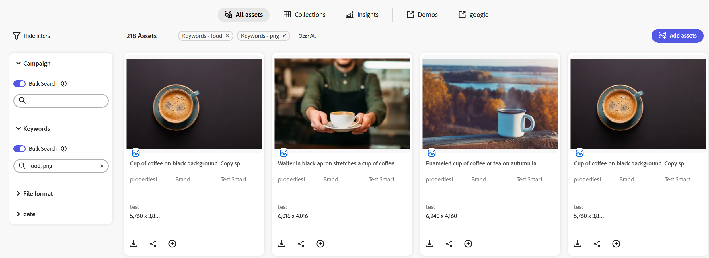

# Assets zoeken in [!DNL Content Hub] {#search-assets}

Als u een groot aantal middelen in uw opslagplaats hebt, is het tijdrovend om naar het juiste middel te zoeken. Met de zoekfunctie van [!DNL The Content Hub] kunt u zoeken naar de goedgekeurde elementen, zodat u er aanvullende handelingen op kunt uitvoeren, zoals downloaden, delen of verzamelingen maken. U kunt verschillende mogelijkheden gebruiken om uw zoekresultaten te beperken, zoals het uitvoeren van op tekst gebaseerde zoekopdrachten, het gebruik van filters, het uitvoeren van tags of een specifieke zoekopdracht met slimme tags, het zoeken naar een bepaalde bestandsindeling, enzovoort.

## Vereisten {#prerequisites}

[&#x200B; de gebruikers van Content Hub &#x200B;](deploy-content-hub.md#onboard-content-hub-users) kunnen acties uitvoeren die in dit artikel worden vermeld.

## Wat u kunt zoeken  {#what-you-can-search}

De zoekopdracht [!DNL Content Hub] biedt resultaten op basis van:

* **Vergelijkende tekst:** het [!DNL Content Hub] onderzoek staat u toe om naar activa te zoeken gebruikend zijn naam of beschrijving. U kunt op trefwoorden gebaseerde zoekopdrachten uitvoeren waarbij het trefwoord wordt vergeleken met de tekst die beschikbaar is in de eigenschappen van een element.

* **het Aanpassen context:** [!DNL Content Hub] de lijst van onderzoeksresultaten bevat geschatte resultaten van activa die u op de passende context wordt gebaseerd. Als u bijvoorbeeld `cool` typt in de zoekbalk, worden de elementen die verwant zijn aan `winter` , `snow` en `cold surroundings` weergegeven in de zoeklijst.

* **informatie van Activa (titel, markeringen, of slimme markeringen):** [!DNL Content Hub] gebruikt slim onderzoeksalgoritme om onderzoeksresultaten nauwkeurig en als relevant te rangschikken als mogelijk. [&#x200B; Meta-gegevens &#x200B;](#asset-properties.md) is de inzameling van alle gegevens beschikbaar voor activa, maar het kan niet noodzakelijk in dat activa worden bevat. [&#x200B; het helpt u verder categoriseren activa en is nuttig aangezien de hoeveelheid digitale informatie &#x200B;](/help/assets/configure-content-hub-ui-options.md##configure-metadata-search-content-hub) groeit.

* **Laatste gewijzigde datum:** De activa die onlangs werden gewijzigd verschijnen op de bovenkant van de lijst van onderzoeksresultaten. U kunt het datumbereik naar wens filteren.

* **Gebruik:** de algemeen gebruikte activa verschijnen op de bovenkant van de onderzoekslijst.

* **geschiedenis van het Onderzoek:** klik binnen het onderzoeksvakje zonder een karakter te typen om uw onderzoeksgeschiedenis te krijgen. U kunt ook een bepaald trefwoord uit de geschiedenis verwijderen. De zoekgeschiedenis wordt opgeslagen in het cachegeheugen van een webbrowser. Dit betekent dat u de zoekgeschiedenis niet meer kunt weergeven als u de zoekopdracht in [!DNL Content Hub] opent in een andere browser of als u het cachegeheugen van de browser wist.

* **Onderzoek terwijl u typt:** het [!DNL Content Hub] onderzoek verbetert uw onderzoekservaring door autocomplete suggesties te verstrekken aangezien u begint te typen.

## Basiszoekopdracht {#basic-search}

Als u een standaardzoekopdracht wilt uitvoeren op [!DNL the Content Hub] , navigeert u naar de zoekbalk en geeft u het trefwoord op dat u wilt zoeken. Navigeer naar de filters die beschikbaar zijn in het linkervenster en pas deze toe om de zoekresultaten te beperken.

Zoek bijvoorbeeld naar alle **[!UICONTROL JPEG]** -afbeeldingen met trefwoord `architect` in de afbeelding, die in het laatste jaar zijn gewijzigd. Voer de volgende stappen uit om dit scenario uit te voeren:

1. Geef `architect` op als zoektrefwoord.

1. Navigeer naar het deelvenster Filters > **[!UICONTROL Format]** > selecteer **[!UICONTROL JPEG]** .

1. Navigeer naar **[!UICONTROL Modified]** > geef het datumbereik op.

   

## De zoekresultaten verfijnen met filters {#narrow-down-search-results}

Gebruik het deelvenster Filters om te zoeken naar elementen op basis van metagegevens. U kunt zoekresultaten filteren op basis van verschillende zoekvoorspelling. U kunt alle geschikte voorspelling selecteren om uw zoekresultaten te minimaliseren of te verkleinen. U kunt meer dan 10 voorspelden kiezen terwijl het filtreren van uw onderzoeksresultaten. Wanneer u meerdere opties in een filter selecteert, geeft Content Hub de elementen weer die overeenkomen met een van de opties die in een filter zijn geselecteerd. Wanneer u echter meerdere opties voor meerdere filters selecteert, geeft Content Hub alleen de elementen weer die overeenkomen met alle opties die voor de verschillende filters zijn geselecteerd om de zoekresultaten te beperken.

De standaardfilters bevatten bestandsindeling, goedgekeurd op, datum van goedkeuring, verlopen en niet verlopen elementen en vervaldatum. Beheerders kunnen ook de filters configureren die in de lijst met filters worden weergegeven. Voor meer informatie, zie [&#x200B; Content Hub gebruikersinterface &#x200B;](configure-content-hub-ui-options.md#configure-filters-content-hub) vormen.

<!--

<table>
    <tbody>
     <tr>
      <th><strong>Search Predicate</strong></th>
      <th><strong>Description</strong></th>
      <th><strong>Properties</strong></th>
     </tr>
     <tr>
      <td> Campaigns </td>
      <td> Allows you to search using planned activity performed to take any particular action. For example, advertisement campaign run on Ferrari to know the understand the interests of people using number of clicks people perform.</td>
      <td>NA</td>
     </tr>
     <tr>
      <td> Channels </td>
      <td> Helps you to understand the path from where the asset is coming from. For example, web, social media, books, catalog, etc.</td>
      <td>NA</td>
     </tr>
     <tr>
      <td> Region </td>
      <td> Helps you to understand the location where the asset is created. For example, Japan, EMEA, Worldwide, etc.</td>
      <td>NA</td>
     </tr>
     <tr>
      <td> Keywords </td>
      <td> Keyword helps you search using terms or the words that you enter based on the topic. For example, images, low-resolution, etc.</td>
      <td>NA</td>
     </tr>
     <tr>
      <td> Timeframe </td>
      <td> Helps you search assets using timeline. For example, search by year 2024, Q3 2023, etc.</td>
      <td>NA</td>
     </tr>
     <tr>
      <td>File format</td>
      <td>Composition of an asset. The supported assets include image, document, video, printable media, and so on.</td>
      <td>
        <ul>
            <li>[!UICONTROL JPEG]</li> 
            <li>[!UICONTROL Quicktime]</li> 
            <li>[!UICONTROL PNG]</li> 
            <li>[!UICONTROL WebP]</li> 
            <li>[!UICONTROL MP4]</li> 
            <li>[!UICONTROL Plain]</li> 
            <li>[!UICONTROL PDF]</li>
            <li>[!UICONTROL SVG + XML]</li>
        </ul>
      </td>
     </tr>
     <tr>
      <td>Tags</td>
      <td>Tags help you categorize assets that can be browsed and searched more efficiently based on hierarchical taxonomies.</td>
      <td>
        <ul>
            <li>Field label</li>
            <li>Property name</li>
            <li>Path</li>
            <li>Description</li>
        </ul>
      </td>
     </tr>
     <!--<tr>
      <td>Subject</td>
      <td>Classification of assets based on their theme. For example, colorful, hiking, outdoors.</td>
      <td>NA</td>
     </tr>
          <tr>
      <td>Last modified</td>
      <td>Search assets based on their last modification. Specify the date range using the Start date and End date fields.</td>
      <td>
        <ul>
            <li>Range text (From)</li> 
            <li>Range text (To) </li>
        </ul>
      </td>
     </tr>    
     <!--<tr>
      <td>Asset ID</td>
      <td>Unique number that identifies the asset.</td>
      <td>NA</td>
     </tr>
     <tr>
      <td> Colors </td>
      <td> Helps you search assets using colors that are automatically identified in an asset using Adobe's AI capabilities.</td>
      <td>NA</td>
     </tr>  
    </tbody>
   </table>

-->

## Bulkzoekopdracht {#bulk-search}

Met Bulk zoeken op elementen kunt u meerdere elementen tegelijk opzoeken door een lijst met id&#39;s (zoals namen, bestandsindelingen, kleuren, tags en meer) in te voeren. In plaats van elementen één voor één te zoeken, maakt [!DNL Content Hub] Bulk Search het sneller om de middelen te ontdekken u wenst. Met dit vermogen, kunt u veelvoudige waarden voor om het even welk filterbezit-door een scheidingsteken (bijvoorbeeld, veelvoudige SKU IDs)-en onmiddellijk terugwinnen alle passende activa met één enkel onderzoek.

Als u naar meerdere elementen tegelijk wilt zoeken, voert u meerdere waarden in één query in door deze te scheiden met scheidingstekens ` [ , | \t | \r | \n | \r\n ]` . U kunt ook meer scheidingstekens toevoegen, afhankelijk van uw gebruiksscenario. Zie [&#x200B; BulkOnderzoek &#x200B;](configure-content-hub-ui-options.md#bulk-search-configuration) vormen.

Voer de volgende stappen uit om Bulk zoeken uit te voeren in de [!DNL Content Hub] :

1. Zodra het BulkOnderzoek [&#x200B; wordt gevormd &#x200B;](configure-content-hub-ui-options.md#bulk-search-configuration), kunt u de knevel van het Onderzoek van het Bulk op de [!DNL Content Hub] filtereigenschappen zien die u vormde. U kunt deze naar wens in- of uitschakelen.

1. Voeg een onderzoeksvraag toe die afbakeningen bevat die in de configuratie worden gespecificeerd. De zoekquery moet een tekenreeks bevatten die vergezeld gaat van meerdere door komma&#39;s gescheiden waarden.

## Doe meer met zoeken {#do-more-with-search}

[!DNL The Content Hub] is niet beperkt tot onderzoek, in plaats daarvan staat het u toe om extra acties uit te voeren, zoals [&#x200B; download &#x200B;](download-assets-content-hub.md), [&#x200B; aandeel &#x200B;](share-assets-content-hub.md), en [&#x200B; voegt activa aan inzameling &#x200B;](collections-content-hub.md), recht van het onderzoek of voorproefinterface toe. Selecteer de elementen op de pagina met zoekresultaten om deze opties weer te geven.

Leer meer over [&#x200B; het vormen activa in  [!DNL Content Hub]](configure-content-hub-ui-options.md).

