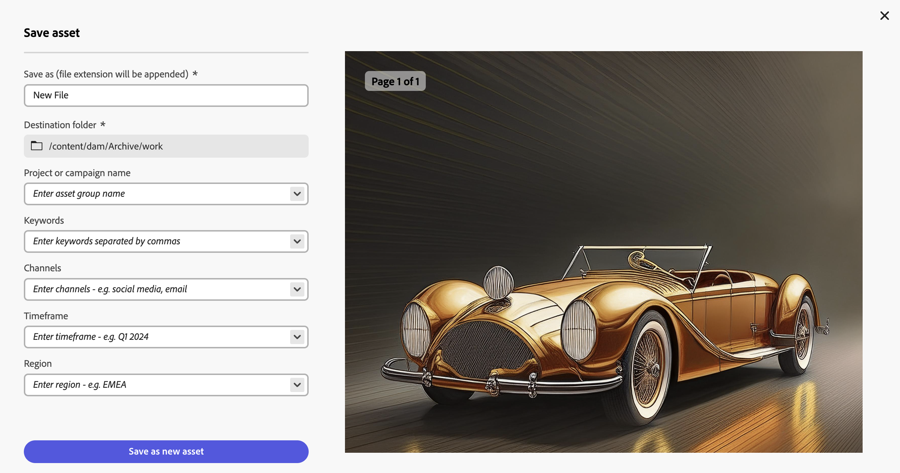

# Middelen zoeken in [!DNL Assets view] {#search-assets}

>[!CONTEXTUALHELP]
>id="assets_search"
>title="Zoeken in Assets"
>abstract="Zoek naar activa door een sleutelwoord in de bar van het Onderzoek te specificeren of door activa te filtreren die op hun status, dossiertype, MIME type, grootte, verwezenlijking, wijziging, en vervaldata worden gebaseerd. Naast de standaardfilters kunt u ook aangepaste filters toepassen. U kunt de gefilterde resultaten opslaan als een opgeslagen zoekopdracht of als een slimme verzameling."
>additional-url="https://experienceleague.adobe.com/docs/experience-manager-assets-essentials/help/manage-collections.html?lang=nl-NL#manage-smart-collection" text="Slimme verzamelingen maken"

[!DNL Assets view] biedt een effectieve zoekfunctie die standaard werkt. De zoekopdracht is uitgebreid omdat het een zoekopdracht in volledige tekst betreft. Met de krachtige zoekfunctionaliteit kunt u snel de juiste middelen vinden en de snelheid van de inhoud verbeteren. [!DNL Assets view] biedt zoekopdrachten in volledige tekst en zoekopdrachten via metagegevens, zoals slimme tags, titel, gemaakte datum en copyright.

Elementen zoeken:

* Klik in het zoekvak boven aan de pagina. Standaard wordt gezocht in de map waarin u momenteel bladert. Voer een van de volgende handelingen uit:

  

   * Zoeken met een trefwoord en desgewenst de map wijzigen. Druk op Return.

   * Begin met het werken met een onlangs weergegeven element door er direct naar te zoeken. Klik in het zoekvak en selecteer een element dat onlangs is weergegeven in de suggesties.

## De zoekresultaten filteren {#refine-search-results}

U kunt de zoekresultaten filteren op basis van de volgende parameters.

*Cijfer: De gezochte activa van de filter die op diverse parameters worden gebaseerd.*

* De Status van het element: Filter de onderzoeksresultaten gebruikend een `Approved`, `Rejected`, of `No Status` activa status.

* Bestandstype: filter de zoekresultaten op de ondersteunde bestandstypen: `Images`, `Documents` en `Videos` .
* MIME-type: filter voor een of meer ondersteunde bestandsindelingen. <!-- TBD:  [supported file formats](/help/using/supported-file-formats.md). -->
* Afbeeldingsgrootte: geef een van de minimale en maximale afmetingen op voor het filteren van afbeeldingen. De grootte wordt opgegeven in pixelafmetingen en is niet de bestandsgrootte van de afbeeldingen.
* Aanmaakdatum: de aanmaakdatum van het element zoals vermeld in de metagegevens. De standaarddatumnotatie die wordt gebruikt, is `yyyy-mm-dd` .
* Gewijzigde datum: de datum waarop de elementen als laatste zijn gewijzigd. De standaarddatumnotatie die wordt gebruikt, is `yyyy-mm-dd` .

* Vervaldatum: filter de zoekresultaten op basis van de status van een `Expired` -element. Daarnaast kunt u een datumbereik voor de vervaldatum voor elementen opgeven om de zoekresultaten verder te filteren.

* Aangepaste Filters: [ voeg douanefilters ](#custom-filters) aan het de meningsgebruikersinterface van Assets toe. Pas de aangepaste filters toe naast de standaardfilters om de zoekresultaten te verfijnen.

U kunt de gezochte elementen in toenemende of afnemende volgorde van `Name`, `Relevance`, `Size`, `Modified` en `Created` sorteren. De gezochte elementen worden standaard gesorteerd op basis van `Relevance` .

## Aangepaste filters beheren {#custom-filters}

**vereiste Toestemmingen:** `Can Edit`, `Owner`, of Beheerder.

In de Assets-weergave kunt u ook aangepaste filters toevoegen aan de gebruikersinterface. U kunt die douanefilters dan toepassen naast de [ standaardfilters ](#refine-search-results) om uw onderzoeksresultaten te verfijnen.

De Assets-weergave biedt de volgende aangepaste filters:

<table>
    <tbody>
     <tr>
      <th><strong>Aangepaste filternaam</strong></th>
      <th><strong>Beschrijving</strong></th>
     </tr>
     <tr>
      <td>Titel</td>
      <td>Filter elementen met de titel van het element. De titel die u opgeeft in de hoofdlettergevoelige zoekcriteria moet overeenkomen met de exacte titel van het element om in de resultaten te worden weergegeven.</td>
     </tr>
     <tr>
      <td>Naam</td>
      <td>Filter elementen met de naam van het elementbestand. De naam die u opgeeft in de hoofdlettergevoelige zoekcriteria moet overeenkomen met de exacte bestandsnaam van het element om in de resultaten te worden weergegeven.</td>
     </tr>
     <tr>
      <td>Elementgrootte</td>
      <td>Filter elementen door een formaatbereik in bytes te definiëren in de zoekcriteria voor een element dat in de resultaten moet worden weergegeven.</td>
     </tr>
     <tr>
      <td>Vooraf gedefinieerde labels</td>
      <td>Filter elementen met de slimme tag voor elementen. De naam van de slimme tag die u opgeeft in de hoofdlettergevoelige zoekcriteria, moet overeenkomen met de exacte naam van de slimme tag van het element om in de resultaten te worden weergegeven. U kunt niet meerdere slimme tags opgeven in zoekcriteria.</td>
     </tr>    
    </tbody>
   </table>

<!--
   You can use a wildcard operator (*) to enable Assets view to display assets in the results that partially match the search criteria. For example, if you define <b>ma*</b> as the search criteria, Assets view displays assets with title, such as, market, marketing, man, manchester, and so on in the results.

   You can use a wildcard operator (*) to enable Assets view to display assets in the results that partially match the search criteria.

   You can use a wildcard operator (*) to enable Assets view to display assets in the results that partially match the search criteria. You can specify multiple smart tags separated by a comma in the search criteria.

   -->

### Aangepaste filters toevoegen {#add-custom-filters}

Aangepaste filters toevoegen:

1. Klik op **[!UICONTROL Filters]**.

1. Klik in de sectie **[!UICONTROL Custom Filters]** op **[!UICONTROL Edit]** of **[!UICONTROL Add Filters]** .

    toe

1. Selecteer in het dialoogvenster **[!UICONTROL Custom filters management]** de filters die u aan de bestaande lijst met filters wilt toevoegen. Selecteer **[!UICONTROL Custom Filters]** om alle filters te selecteren.

1. Klik op **[!UICONTROL Confirm]** om de filters toe te voegen aan de gebruikersinterface.

### Aangepaste filters verwijderen {#remove-custom-filters}

Aangepaste filters verwijderen:

1. Klik op **[!UICONTROL Filters]**.

1. Klik in de sectie **[!UICONTROL Custom Filters]** op **[!UICONTROL Edit]** .

1. Schakel in het dialoogvenster **[!UICONTROL Custom filters management]** de filters uit die u uit de bestaande lijst met filters wilt verwijderen.

1. Klik op **[!UICONTROL Confirm]** om de filters uit de gebruikersinterface te verwijderen.

## Semantische zoekopdracht {#semantic-search}

Semantische Onderzoek is een geavanceerd onderzoeksvermogen dat de betekenis en de intentie achter de vraag van een gebruiker eerder dan het baseren op nauwkeurige sleutelwoordgelijken begrijpt. Het gebruikt artificiële intelligentie (AI), de verwerking van de natuurlijke taal (NLP), en machine het leren om nauwkeurigere en context-bewuste resultaten te leveren.

In tegenstelling tot traditionele op sleutelwoord-gebaseerde onderzoek, die nauwkeurige termijnen zoekt, interpreteert het Semantische Onderzoek relaties tussen woorden, concepten, en gebruikersintentie. Dit zorgt ervoor dat de gebruikers vinden wat zij-zelfs als hun vraag verschillend wordt gephrased, typos bevat, of in een andere taal is.

Sommige hiervan zijn de belangrijkste voordelen:

* **Meertalige steun**: Onderzoek over veelvoudige talen zonder nauwkeurige vertalingen te vereisen. Gebruikers kunnen relevante inhoud vinden, ongeacht hun querytaal.

* **handvatten spelfouten**: Corrigeert of interpreteert automatisch typos en spelfouten, die nauwkeurige resultaten zelfs met imperfecte input verzekeren.

* **begrijpt synoniemen**: Levert resultaten voor verwante termijnen en uitdrukkingen, zodat te hoeven de gebruikers niet om het juiste sleutelwoord te raden.

* **context-Aware onderzoek**: Erkent de bedoeling achter een vraag, niet alleen de woorden.

* **Onderzoek dat op op tekst-gebaseerde herinneringen** wordt gebaseerd: Experience Manager Assets past filters op inhoud toe en toont aangewezen resultaten automatisch gebaseerd op eenvoudige op tekst-gebaseerde herinneringen.

>[!IMPORTANT]
>
> Geef drie of meer dan drie woorden op voor de semantische zoekopdracht om de juiste resultaten weer te geven.

### Voorbeelden voor semantische zoekopdracht {#examples-semantic-search}

**Vraag van het Voorbeeld**: *Vrouw die koffie* drinkt

Bij de traditionele zoekopdracht op basis van trefwoorden wordt gezocht naar exacte overeenkomsten met metagegevens over elementen, zoals Vrouw, Koffie, enzovoort, en worden elementen geretourneerd die deze trefwoorden bevatten.

Semantic Search zoekt echter naar vergelijkbare woorden, zoals `Girl` , `Lady` in het geval van `Woman` en koffieopties, zoals `Cappuccino` en `Latte` in het geval van `Coffee` .

Op dezelfde manier kunt u deze vraag in het Spaans of de spelfout `Woman` als `Wman` specificeren en nog steeds dezelfde resultaten krijgen.

## Middelen zoeken met [!DNL Adobe Firefly] {#search-firefly}

U kunt zoeken naar elementen die niet beschikbaar zijn in een van de mappen met elementen door de functie [!DNL Adobe Firefly] voor het zoeken naar elementen in [!DNL Experience Manager Assets] te gebruiken. Op deze manier kunt u op efficiënte wijze elementen in real-time genereren die niet in de mappen met elementen zijn opgeslagen.

### Voordat u begint {#search-assets-firefly-prereqs}

U moet een actief [!DNL Adobe Express] -abonnement hebben.

### Elementen genereren {#generate-assets-firefly}

Nieuwe elementen genereren met [!DNL Adobe Firefly] :

1. Navigeer naar de werkruimte van [!DNL AEM Assets] .

1. Typ de naam van het element in de zoekbalk. U kunt bijvoorbeeld een element zoeken met het trefwoord `Bugatti Type 57` . Bij het zoeken naar het element worden geen resultaten gevonden, omdat het element in geen van de elementmappen aanwezig is. Klik op **[!UICONTROL Generate with Firefly]** als u elementen wilt genereren met AI. Het scherm [!DNL Adobe Firefly] wordt weergegeven.

   

   De nieuwe elementen worden gegenereerd. Bovendien kunt u de beschrijving van de afbeelding wijzigen door de nieuwe tekstprompt in het beschrijvingsvak te typen. [ Leer hoe te om een goede AI herinnering te schrijven om buitengewone en relevante inhoud ](https://helpx.adobe.com/in/firefly/using/tips-and-tricks.html) te produceren. Alternatief, kunt u beeld met diverse andere eigenschappen zoals veranderende stijl, beelddimensies, en meer [ uitgeven.](https://helpx.adobe.com/in/firefly/using/text-to-image.html)

   

1. Selecteer een afbeelding die u wilt opslaan. Klik op **[!UICONTROL Save]** om de elementen in de voorkeursmap op te slaan, zodat u ze gemakkelijk kunt openen.

1. Elementformulier opslaan wordt weergegeven. Geef de volgende velden op:

   * Ga een naam voor het dossier op **sparen als** gebied in.
   * Selecteer een doelmap.
   * Voer details in, zoals de naam van een project of campagne, Trefwoorden, kanalen, het tijdframe en het gebied.

   

1. Klik **sparen als nieuwe activa** om de activa te bewaren.

### Elementen uploaden {#upload-assets-firefly}

Het gegenereerde element uploaden naar de gegevensopslagplaats:

1. Klik op **[!UICONTROL Upload]**.
1. Selecteer de elementmap waarnaar u het element wilt uploaden en klik op **[!UICONTROL Select Folder]** .
   

## Opgeslagen zoekopdrachten {#saved-search}

Zoekfuncties kunt u eenvoudig gebruiken in [!DNL Assets view] . Vanuit het zoekvak kunt u niet alleen een trefwoord typen en op Enter drukken om de resultaten weer te geven. U kunt ook snel met één klik nogmaals zoeken naar de laatst doorzochte trefwoorden.

U kunt de zoekresultaten ook filteren op basis van specifieke criteria voor metagegevens en het type element. Voor veelgebruikte filters kunt u de zoekervaring verbeteren door [!DNL Assets view] de zoekparameters op te slaan. Vervolgens kunt u de opgeslagen zoekopdracht selecteren en het filter toepassen met één klik.

Als u een opgeslagen zoekopdracht wilt maken, zoekt u naar een element, past u een of meer filters toe en klikt u op **[!UICONTROL Save as]** > **[!UICONTROL Saved Search]** in het deelvenster [!UICONTROL Filters] . U kunt ook op **[!UICONTROL Save as]** klikken en **[!UICONTROL Smart Collection]** selecteren om de resultaten op te slaan als een slimme verzameling. Zie [ een Slimme Inzameling ](manage-collections.md#create-a-smart-collection) voor meer details creëren.

<!-- TBD: Search behavior. Full-text search. Ranking and rank boosts. Hidden assets.
Report poor UX that users can only save a filtered search and not a simple search.
.
Are other supported files fully indexed and support full-text search? Eg. audio/videos files can at best have metadata indexed.
Anything about ranking of assets displayed in search results?

What about temporarily hiding an asset (suspending search on it) from the search results? If an asset is undergoing review collaboration, should it be used by others? Should it be hidden in search?

When userA is searching and userB add an asset that matches search results, will the asset display in search as soon as userA refreshes the page? Assuming indexing is near real-time. May not be so for bulk uploads.
-->

## Werken met zoekresultaten {#work-with-search-results}

U kunt de elementen selecteren die in de zoekresultaten worden weergegeven en de volgende handelingen uitvoeren:

* **vindt Gelijkaardig Beeld**: Vind een gelijkaardig beeldmiddel in Assets UI die op de meta-gegevens en slimme markeringen wordt gebaseerd.

* **Details**: Mening en geef activa eigenschappen uit.

* **Download**: Download een activa.

* **voeg aan Inzameling** toe: Voeg de geselecteerde activa aan een inzameling toe.

* **Vastzetten aan Snelle Toegang**: [ Vastzetten activa ](my-workspace-assets-view.md) voor snellere toegang wanneer u het later nodig hebt. Alle vastgezette punten tonen in de **Snelle toegang** sectie van Mijn Workspace.

* **Open in Adobe Express**: Bewerk een beeld in geïntegreerde Adobe Express van het scherm van Experience Manager Assets.

* **geef** uit: geef het beeld uit gebruikend Adobe Express.

* **Verbinding van het Aandeel**: [ de verbindingen van het Aandeel ](share-links-for-assets-view.md) voor een activa met andere gebruikers zodat zij tot het kunnen toegang hebben en het downloaden.

* **Schrapping**: Schrap een activa.

* **Exemplaar**: Kopieer activa aan een verschillende omslagplaats.

* **Beweging**: Beweeg activa aan een verschillende omslagplaats.

* **noem** anders: noem activa anders.

* **Exemplaar aan Bibliotheken**: Voeg een activa aan de Bibliotheek toe.

* **Wijs Taken** toe: Wijs taken aan gebruikers voor een activa toe.

* **Controle**: [ controleert de verrichtingen ](https://experienceleague.adobe.com/nl/docs/experience-manager-cloud-service/content/assets/manage/search-assets) die op activa worden uitgevoerd.

## Eerste homepage van zoekopdracht configureren {#configuring-search-first-homepage}

In de Assets-weergave kunt u de standaardbestemmingspagina voor uw organisatie selecteren. Wanneer u de startpagina Zoekopdracht eerst gebruikt, hebt u ook de mogelijkheid om de branding van de pagina aan te passen door de achtergrond- en logoafbeeldingen zo te configureren dat deze overeenkomen met uw merk.

Voer de onderstaande stappen uit om de eerste homepage van de zoekopdracht te configureren:

1. Ga naar **[!UICONTROL Settings]** > **[!UICONTROL General Settings]**.
1. Selecteer **[!UICONTROL Search first]**. Het opent verder de onderzoek eerste verwante configuratie. U kunt [ groepering ](#setting-alignment-search-bar) plaatsen of [ de achtergrond en het embleembeeld ](#setting-background-image-and-logo) van uw homepage plaatsen.

### Uitlijning van zoekbalk instellen {#setting-alignment-search-bar}

Met [!DNL Assets view] kunt u de uitlijning van de zoekbalk wijzigen. U kunt de zoekbalk in het midden of boven aan het scherm weergeven. Selecteer de gewenste uitlijning en klik op **[!UICONTROL Save]** .

### Achtergrond- en logoafbeelding van homepage instellen {#setting-background-image-and-logo}

U kunt een merklogo en achtergrondafbeelding toevoegen aan uw eerste zoekpagina. Voer de volgende stappen uit:

1. Ga naar de sectie **[!UICONTROL Background and Logo image]** onder **[!UICONTROL Homepage]** .
1. Klik op **[!UICONTROL Replace]** om door afbeeldingen te bladeren vanuit de bestaande gegevensopslagruimte.
1. Klik op **[!UICONTROL Save]**. [ Voorproef ](#preview-configured-homepage) de veranderingen om de wijzigingen te herzien.

### Voorvertoning geconfigureerde homepage {#preview-configured-homepage}

U kunt een voorvertoning weergeven om de lay-out en opmaak van de eerste homepage van de zoekopdracht te controleren. Met **[!UICONTROL Preview]** kunt u de lay-out corrigeren of naar wens wijzigingen aanbrengen. Voer de onderstaande stappen uit om een voorvertoning van de geconfigureerde homepage weer te geven:

1. Klik op **[!UICONTROL General Settings]** en selecteer **[!UICONTROL Search first]** .
1. Ga naar **[!UICONTROL Customize search first homepage]** en klik op **[!UICONTROL Preview]** . Schakel de knop **[!UICONTROL Dark theme]** in en uit om een voorvertoning van de startpagina weer te geven in donker of licht thema.
1. Klik op **[!UICONTROL Close]** om het voorvertoningsscherm te sluiten.

   

## Contextueel zoeken {#contextual-search}

U kunt ook zoeken in middelen die beschikbaar zijn in de repository door tekstherinneringen te definiëren. Experience Manager Assets transformeert automatisch die tekstherinneringen om filters te zoeken en toont de onderzoeksresultaten. Met het deelvenster Filters kunt u automatische filters weergeven en wijzigen om de zoekresultaten verder te beperken.

### Toegang tot contextafhankelijke zoekopdracht {#access-contextual-search}

Toegang krijgen tot contextafhankelijke zoekopdrachten in Experience Manager Assets:

1. Klik op **[!UICONTROL Search]** in het linkerdeelvenster.

   

1. Definieer de tekstprompt in het tekstvak Zoeken en klik op **[!UICONTROL Contextual Search]** .

   

   [!DNL Experience Manager Assets] geeft de zoekresultaten weer.

### Ondersteunde filters {#supported-filters}

Contextueel zoeken ondersteunt de volgende filters uit de verpakking. Baseer uw tekstherinneringen op deze filters om aangewezen onderzoeksresultaten te bekijken.

* Hoogte afbeelding

* Breedte afbeelding

* Bestandstype: afbeelding, document, video of map.

* MIME-type: JPG, PNG, TIFF, GIF, MP4, PDF, PPTX, DOCX of XLSX

* Aanmaakdatum

* Datum gewijzigd

* Vervaldatum

* De status van het element: Goedgekeurd, Afgewezen, of al

* Verlopen activa

### Voorbeelden voor de tekstaanwijzingen {#text-prompts-examples}

**Voorbeeld 1**

**Vragen van de Tekst**: Beelden die deze maand worden gecreeerd.

[!DNL Experience Manager Assets] past de volgende filters automatisch toe en toont de onderzoeksresultaten:

**Voorbeeld 2**

**herinnering van de Tekst**: Beelden minstens 200px hoog en 100px breed met strand en duidelijke lucht.

[!DNL Experience Manager Assets] past de volgende filters automatisch toe en toont de onderzoeksresultaten:

**Voorbeeld 3**

**herinnering van de Tekst**: Ik heb beelden van blauwe lucht nodig die 1500 en 2500 pixelhoogte zijn en in de afgelopen maand worden gecreeerd die niet verlopen en goedgekeurd is.

[!DNL Experience Manager Assets] past de volgende filters automatisch toe en toont de onderzoeksresultaten:

De volgende video illustreert het proces van begin tot eind van de toegang tot van het Contextual Onderzoek Gebruikersinterface tot het bepalen van tekstherinneringen, en het bekijken van de onderzoeksresultaten.

>[!VIDEO](https://video.tv.adobe.com/v/3428407)

### Contextueel zoeken uitschakelen {#disable-contextual-search}

Beheerders hebben ook de mogelijkheid om contextafhankelijke zoekopdrachten voor gebruikers in uw organisatie uit te schakelen. Voer daartoe de volgende stappen uit:

1. Ga naar **[!UICONTROL Settings]** > **[!UICONTROL General Settings]**.

1. Schakel in de sectie [!UICONTROL Contextual Search] de schakeloptie **[!UICONTROL Enable Contextual Search for your organization]** uit om de functie Contextual Search uit te schakelen voor alle gebruikers in uw organisatie.

### Feedback op contextuele zoekopdrachten {#contextual-search-feedback}

Als u moet verstrekken terugkoppelt op de Contextuele eigenschap van het Onderzoek, klik  en klik het pictogram van de Terugkoppeling. Selecteer het type feedback, geef het onderwerp en de beschrijving op en klik op **[!UICONTROL Submit]** .

## Volgende stappen {#next-steps}

* [ bekijk een video aan onderzoeksactiva in de mening van Assets ](https://experienceleague.adobe.com/docs/experience-manager-learn/assets-essentials/basics/using.html?lang=nl-NL)

* Feedback geven op het product met de optie [!UICONTROL Feedback] die beschikbaar is in de gebruikersinterface van de Assets-weergave

* Verstrek documentatie terugkoppelt gebruikend [!UICONTROL Edit this page]  of [!UICONTROL Log an issue]  beschikbaar op juiste sidebar.

* De Zorg van de Klant van het contact [&#128279;](https://experienceleague.adobe.com/nl?support-solution=General#support)

