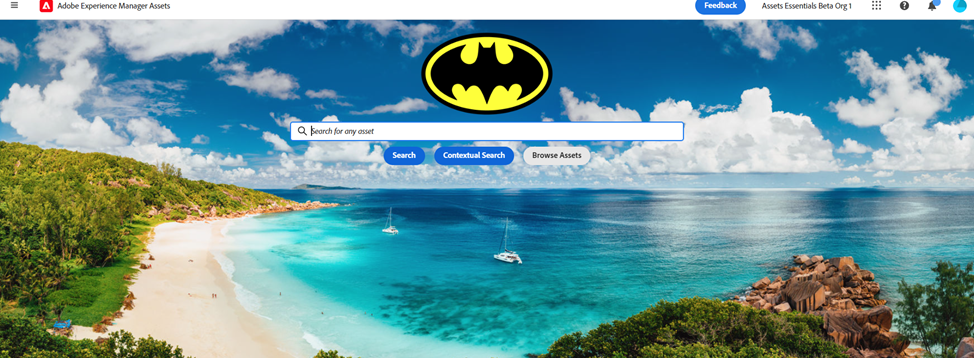

# Middelen zoeken in [!DNL Assets view] {#search-assets}

>[!CONTEXTUALHELP]
>id="assets_search"
>title="Zoeken in middelen"
>abstract="Zoek naar activa door een sleutelwoord in de bar van het Onderzoek te specificeren of door activa te filtreren die op hun status, dossiertype, MIME type, grootte, verwezenlijking, wijziging, en vervaldata worden gebaseerd. Naast de standaardfilters kunt u ook aangepaste filters toepassen. U kunt de gefilterde resultaten opslaan als een opgeslagen zoekopdracht of als een slimme verzameling."
>additional-url="https://experienceleague.adobe.com/docs/experience-manager-assets-essentials/help/manage-collections.html?lang=en#manage-smart-collection" text="Slimme verzamelingen maken"

[!DNL Assets view] biedt effectief zoeken, dat werkt standaard. De zoekopdracht is uitgebreid omdat er in volledige tekst wordt gezocht. Met de krachtige zoekfunctionaliteit kunt u snel de juiste middelen vinden en de snelheid van de inhoud verbeteren. [!DNL Assets view] biedt zoekopdrachten in volledige tekst en zoekopdrachten via metagegevens, zoals slimme tags, titel, gemaakte datum en copyright.

Elementen zoeken:

* Klik in het zoekvak boven aan de pagina. Standaard wordt gezocht in de map waarin u momenteel bladert. Voer een van de volgende handelingen uit:

  

   * Zoeken met een trefwoord en desgewenst map wijzigen. Druk op Return.

   * Begin met het werken met een onlangs weergegeven element door er direct naar te zoeken. Klik in het zoekvak en selecteer een element dat onlangs is weergegeven in de suggesties.

## De zoekresultaten filteren {#refine-search-results}

U kunt de zoekresultaten filteren op basis van de volgende parameters.

*Afbeelding: gezochte elementen filteren op basis van verschillende parameters.*

* De Status van het element: Filter de onderzoeksresultaten gebruikend een `Approved`, `Rejected`, of `No Status` status van het element.

* Bestandstype: filtreer de zoekresultaten op de ondersteunde bestandstypen, namelijk `Images`, `Documents`, en `Videos`.
* MIME-type: filter voor een of meer ondersteunde bestandsindelingen. <!-- TBD:  [supported file formats](/help/assets/supported-file-formats-assets-view.md). -->
* Afbeeldingsgrootte: geef een van de minimale en maximale afmetingen op voor het filteren van afbeeldingen. De grootte wordt opgegeven in pixelafmetingen en is niet de bestandsgrootte van de afbeeldingen.
* Aanmaakdatum: de aanmaakdatum van het element zoals vermeld in de metagegevens. De standaard datumnotatie die wordt gebruikt is `yyyy-mm-dd`.
* Gewijzigde datum: de datum waarop de elementen als laatste zijn gewijzigd. De standaard datumnotatie die wordt gebruikt is `yyyy-mm-dd`.

* Vervaldatum: filter de zoekresultaten op basis van een `Expired` status van het element. Daarnaast kunt u een datumbereik voor de vervaldatum voor elementen opgeven om de zoekresultaten verder te filteren.

* Aangepaste filters: [Aangepaste filters toevoegen](#custom-filters) aan de gebruikersinterface van de middelenweergave. Pas de aangepaste filters toe naast de standaardfilters om de zoekresultaten te verfijnen.

U kunt de gezochte middelen in stijgende of dalende orde van sorteren `Name`, `Relevancy`, `Size`, `Modified`, en `Created`.

## Aangepaste filters beheren {#custom-filters}

**Vereiste machtigingen:**  `Can Edit`, `Owner`of Beheerder.

In de weergave Elementen kunt u ook aangepaste filters toevoegen aan de gebruikersinterface. Vervolgens kunt u deze aangepaste filters toepassen naast de [standaardfilters](#refine-search-results) om de zoekresultaten te verfijnen.

De middelenweergave biedt de volgende aangepaste filters:

<table>
    <tbody>
     <tr>
      <th><strong>Aangepaste filternaam</strong></th>
      <th><strong>Beschrijving</strong></th>
     </tr>
     <tr>
      <td>Titel</td>
      <td>Filter elementen met de titel van het element. De titel die u opgeeft in de hoofdlettergevoelige zoekcriteria moet overeenkomen met de exacte titel van het element om in de resultaten te worden weergegeven.</td>
     </tr>
     <tr>
      <td>Naam</td>
      <td>Filter elementen met de naam van het elementbestand. De naam die u opgeeft in de hoofdlettergevoelige zoekcriteria moet overeenkomen met de exacte bestandsnaam van het element om in de resultaten te worden weergegeven.</td>
     </tr>
     <tr>
      <td>Elementgrootte</td>
      <td>Filter elementen door een formaatbereik in bytes te definiëren in de zoekcriteria voor een element dat in de resultaten moet worden weergegeven.</td>
     </tr>
     <tr>
      <td>Vooraf gedefinieerde labels</td>
      <td>Filter elementen met de slimme tag voor elementen. De naam van de slimme tag die u opgeeft in de hoofdlettergevoelige zoekcriteria, moet overeenkomen met de exacte naam van de slimme tag van het element om in de resultaten te worden weergegeven. U kunt niet meerdere slimme tags opgeven in zoekcriteria.</td>
     </tr>    
    </tbody>
   </table>

<!--
   You can use a wildcard operator (*) to enable Assets view to display assets in the results that partially match the search criteria. For example, if you define <b>ma*</b> as the search criteria, Assets view displays assets with title, such as, market, marketing, man, manchester, and so on in the results.

   You can use a wildcard operator (*) to enable Assets view to display assets in the results that partially match the search criteria.

   You can use a wildcard operator (*) to enable Assets view to display assets in the results that partially match the search criteria. You can specify multiple smart tags separated by a comma in the search criteria.

   -->

### Aangepaste filters toevoegen {#add-custom-filters}

Aangepaste filters toevoegen:

1. Klik op **[!UICONTROL Filters]**.

1. In de **[!UICONTROL Custom Filters]** sectie, klikken **[!UICONTROL Edit]** of **[!UICONTROL Add Filters]**.

   

1. Op de **[!UICONTROL Custom filters management]** selecteert u de filters die u aan de bestaande lijst met filters wilt toevoegen. Selecteren **[!UICONTROL Custom Filters]** om alle filters te selecteren.

1. Klikken **[!UICONTROL Confirm]** om de filters aan de gebruikersinterface toe te voegen.

### Aangepaste filters verwijderen {#remove-custom-filters}

Aangepaste filters verwijderen:

1. Klik op **[!UICONTROL Filters]**.

1. In de **[!UICONTROL Custom Filters]** sectie, klikken **[!UICONTROL Edit]**.

1. Op de **[!UICONTROL Custom filters management]** schakelt u de filters uit die u uit de bestaande lijst met filters wilt verwijderen.

1. Klikken **[!UICONTROL Confirm]** om de filters uit de gebruikersinterface te verwijderen.

## Middelen zoeken met [!DNL Adobe Firefly] {#search-firefly}

U kunt zoeken naar elementen die niet beschikbaar zijn in een van de mappen met elementen door de opdracht [!DNL Adobe Firefly] zoekfunctie voor elementen binnen [!DNL Experience Manager Assets]. Op deze manier kunt u op efficiënte wijze elementen in real-time genereren die niet in de mappen met elementen zijn opgeslagen.

### Voordat u begint

U moet een actieve [!DNL Adobe Express] abonnement.

### Elementen genereren

Nieuwe elementen genereren met [!DNL Adobe Firefly]:

1. Ga naar de [!DNL AEM Assets] werkruimte.
1. Typ de naam van het element in de zoekbalk boven aan de pagina. 
U kunt bijvoorbeeld een element zoeken met het trefwoord `Bugatti Type 57`. Bij het zoeken naar het element worden geen resultaten gevonden, omdat het element in geen van de elementmappen aanwezig is.
1. Typ de elementnaam in de zoekbalk midden op de pagina en klik op **[!UICONTROL Generate]**.
   
   *Afbeelding: Geen resultaten gevonden voor Bugatti Type 57 in de elementenmap.*  
De nieuwe elementen worden gegenereerd.
   
   *Afbeelding: Referentie-elementen doorzocht met [!DNL Adobe Firefly] zoekfunctie voor middelen.*  
U kunt deze elementen uploaden naar de map van uw voorkeur, zodat u ze gemakkelijk kunt openen.

### Elementen uploaden

Het gegenereerde element uploaden naar de gegevensopslagplaats:

1. Klik op **[!UICONTROL Upload]**.
1. Selecteer de elementmap waarnaar u het element wilt uploaden en klik op **[!UICONTROL Select Folder]**.
   
   *Afbeelding: selecteer de map die u wilt uploaden.*

## Opgeslagen zoekopdrachten {#saved-search}

Zoekfuncties zijn heel eenvoudig in [!DNL Assets view]. Vanuit het zoekvak kunt u gewoon een trefwoord typen en op Enter drukken om de resultaten weer te geven. U kunt ook snel met één klik nogmaals zoeken naar de laatst doorzochte trefwoorden.

U kunt de zoekresultaten ook filteren op basis van specifieke criteria voor metagegevens en het type element. Voor veelgebruikte filters om de zoekervaring te verbeteren, [!DNL Assets view] Hiermee kunt u de zoekparameters opslaan. Vervolgens kunt u de opgeslagen zoekopdracht selecteren en het filter toepassen met één klik.

Als u een opgeslagen zoekopdracht wilt maken, zoekt u naar een element, past u een of meer filters toe en klikt u op **[!UICONTROL Save as]** > **[!UICONTROL Saved Search]** in de [!UICONTROL Filters] deelvenster. U kunt ook op **[!UICONTROL Save as]** en selecteert u **[!UICONTROL Smart Collection]** om de resultaten op te slaan als een slimme verzameling. Zie [Een slimme verzameling maken](manage-collections-assets-view.md#create-a-smart-collection) voor meer informatie .

<!-- TBD: Search behavior. Full-text search. Ranking and rank boosts. Hidden assets.
Report poor UX that users can only save a filtered search and not a simple search.
.
Are other supported files fully indexed and support full-text search? Eg. audio/videos files can at best have metadata indexed.
Anything about ranking of assets displayed in search results?

What about temporarily hiding an asset (suspending search on it) from the search results? If an asset is undergoing review collaboration, should it be used by others? Should it be hidden in search?

When userA is searching and userB add an asset that matches search results, will the asset display in search as soon as userA refreshes the page? Assuming indexing is near real-time. May not be so for bulk uploads.
-->

## Werken met zoekresultaten {#work-with-search-results}

U kunt de elementen selecteren die in de zoekresultaten worden weergegeven en de volgende handelingen uitvoeren:

* **Vergelijkbare afbeelding zoeken**: Zoek vergelijkbare afbeeldingselementen in de interface Middelen op basis van de metagegevens en slimme tags.

* **Details**: Elementeigenschappen weergeven en bewerken.

* **Downloaden**: Download een middel.

* **Toevoegen aan verzameling**: Voeg het geselecteerde element toe aan een verzameling.

* **Vastmaken aan snelle toegang**: [Een element vastzetten](my-workspace-assets-view.md) voor snellere toegang wanneer u het later nodig hebt. Alle vastgezette items worden weergegeven in het dialoogvenster **Snelle toegang** van Mijn werkruimte.

* **Openen in Adobe Express**: Bewerk een afbeelding in de geïntegreerde Adobe Express vanuit het Experience Manager Assets-scherm.

* **Bewerken**: Bewerk de afbeelding met Adobe Express.

* **Koppeling delen**: [Koppelingen delen](share-links-for-assets-view.md) voor een middel met andere gebruikers zodat zij tot het kunnen toegang hebben en downloaden.

* **Verwijderen**: Een element verwijderen.

* **Kopiëren**: Kopieer een element naar een andere maplocatie.

* **Verplaatsen**: Verplaats een element naar een andere maplocatie.

* **Naam wijzigen**: Wijzig de naam van een element.

* **Kopiëren naar bibliotheken**: Voeg een element toe aan de bibliotheek.

* **Taken toewijzen**: Taken toewijzen aan gebruikers voor een element.

* **Controle**: [De bewerkingen controleren](manage-notifications-assets-view.md) uitgevoerd op een element.

## Eerste homepage van zoekopdracht configureren {#configuring-search-first-homepage}

Met Experience Manager Assets kunt u de standaardbestemmingspagina voor uw organisatie selecteren. Wanneer u de startpagina Zoekopdracht eerst gebruikt, hebt u ook de mogelijkheid om de branding van de pagina aan te passen door de achtergrond- en logoafbeeldingen zo te configureren dat deze overeenkomen met uw merk.

Voer de onderstaande stappen uit om de eerste homepage van de zoekopdracht te configureren:

1. Ga naar **[!UICONTROL Settings]** > **[!UICONTROL General Settings]**.
1. Selecteer **[!UICONTROL Search first]**. Het opent verder onderzoek eerst verwante configuratie. U kunt instellen [uitlijning](#setting-alignment-search-bar) of [achtergrond- en logoafbeelding instellen](#setting-background-image-and-logo) van uw homepage.

### Uitlijning van zoekbalk instellen {#setting-alignment-search-bar}

[!DNL Assets view] kunt u de uitlijning van de zoekbalk wijzigen. U kunt de zoekbalk in het midden of boven aan het scherm weergeven. Selecteer de gewenste uitlijning en klik op **[!UICONTROL Save]**.

### Achtergrond- en logoafbeelding van homepage instellen {#setting-background-image-and-logo}

U kunt het merklogo en de achtergrondafbeelding toevoegen aan uw eerste zoekpagina. Voer de volgende stappen uit:

1. Navigeren naar **[!UICONTROL Background and Logo image]** deel onder **[!UICONTROL Homepage]**.
1. Klikken **[!UICONTROL Replace]** om afbeeldingen te zoeken in de bestaande gegevensopslagruimte.
1. Klik op **[!UICONTROL Save]**. [Voorvertoning](#preview-configured-homepage) de wijzigingen om de wijzigingen te herzien.

### Voorvertoning geconfigureerde homepage {#preview-configured-homepage}

U kunt een voorvertoning weergeven om de lay-out en opmaak van de eerste homepage van de zoekopdracht te controleren. Gebruiken **[!UICONTROL Preview]** kunt u de layout herstellen of de layout naar wens wijzigen. Voer de onderstaande stappen uit om een voorvertoning van de geconfigureerde homepage weer te geven:

1. Klikken **[!UICONTROL General Settings]** en selecteert u **[!UICONTROL Search first]**.
1. Navigeren naar **[!UICONTROL Customize search first homepage]** en klik op **[!UICONTROL Preview]**. Doorschakelen **[!UICONTROL Dark theme]** om de homepage in het donkere of lichte thema voor te vertonen.
1. Klikken **[!UICONTROL Close]** om het voorvertoningsscherm te sluiten.

   

## Contextueel zoeken {#contextual-search}

U kunt ook zoeken in middelen die beschikbaar zijn in de repository door tekstherinneringen te definiëren. Experience Manager Assets transformeert automatisch die tekstherinneringen om filters te zoeken en toont de onderzoeksresultaten. Met het deelvenster Filters kunt u automatische filters weergeven en wijzigen om de zoekresultaten verder te beperken.

### Toegang tot contextafhankelijke zoekopdracht {#access-contextual-search}

Toegang krijgen tot contextafhankelijke zoekopdrachten in Experience Manager Assets:

1. Klikken **[!UICONTROL Search]** in het linkerdeelvenster.

   

1. Definieer de tekstprompt in het tekstvak Zoeken en klik op **[!UICONTROL Contextual Search]**.

   

   [!DNL Experience Manager Assets] geeft de zoekresultaten weer.

### Ondersteunde filters {#supported-filters}

Contextueel zoeken ondersteunt de volgende filters uit de verpakking. Baseer uw tekstherinneringen op deze filters om aangewezen onderzoeksresultaten te bekijken.

* Hoogte afbeelding

* Breedte afbeelding

* Bestandstype: afbeelding, document, video of map.

* MIME-type: JPG, PNG, TIFF, GIF, MP4, PDF, PPTX, DOCX of XLSX

* Aanmaakdatum

* Datum gewijzigd

* Vervaldatum

* De status van het element: Goedgekeurd, Afgewezen, of al

* Verlopen activa

### Voorbeelden voor de tekstaanwijzingen {#text-prompts-examples}

**Voorbeeld 1**

**Tekstvraag**: Afbeeldingen gemaakt deze maand.

[!DNL Experience Manager Assets] past de volgende filters automatisch toe en toont de onderzoeksresultaten:

**Voorbeeld 2**

**Tekstprompt**: Afbeeldingen van minimaal 200 px hoog en 100 px breed met strand en heldere lucht.

[!DNL Experience Manager Assets] past de volgende filters automatisch toe en toont de onderzoeksresultaten:

**Voorbeeld 3**

**Tekstprompt**: Ik heb beelden van blauwe hemel nodig die 1500 en 2500 pixelhoogte zijn en in de afgelopen maand worden gecreeerd die niet verlopen en goedgekeurd zijn.

[!DNL Experience Manager Assets] past de volgende filters automatisch toe en toont de onderzoeksresultaten:

De volgende video illustreert het proces van begin tot eind van de toegang tot van het Contextual Onderzoek Gebruikersinterface tot het bepalen van tekstherinneringen, en het bekijken van de onderzoeksresultaten.

>[!VIDEO](https://video.tv.adobe.com/v/3428407)

### Contextueel zoeken uitschakelen {#disable-contextual-search}

Beheerders hebben ook de mogelijkheid om contextafhankelijke zoekopdrachten voor gebruikers in uw organisatie uit te schakelen. Voer daartoe de volgende stappen uit:

1. Ga naar **[!UICONTROL Settings]** > **[!UICONTROL General Settings]**.

1. In de [!UICONTROL Contextual Search] in, schakelt u de **[!UICONTROL Enable Contextual Search for your organization]** Schakel deze optie in om de functie Contextual Search uit te schakelen voor alle gebruikers in uw organisatie.

### Feedback op contextuele zoekopdrachten {#contextual-search-feedback}

Als u feedback moet geven over de functie Contextual Search, klikt u op  en klik op het pictogram Feedback. Selecteer het type feedback, geef het onderwerp en de beschrijving op en klik op **[!UICONTROL Submit]**.

## Volgende stappen {#next-steps}

* [Een video bekijken om elementen te zoeken in de weergave Middelen](https://experienceleague.adobe.com/docs/experience-manager-learn/assets-essentials/basics/using.html)

* Feedback geven op het product met de [!UICONTROL Feedback] optie beschikbaar in de gebruikersinterface van de weergave Elementen

* Documentfeedback geven met [!UICONTROL Edit this page]  of [!UICONTROL Log an issue]  beschikbaar op de rechterzijbalk

* Contact [Klantenservice](https://experienceleague.adobe.com/?support-solution=General#support)
