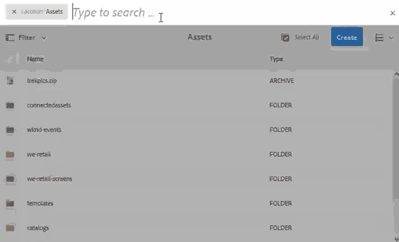

# Middelen zoeken in AEM {#search-assets-in-aem}

U kunt een hogere snelheid voor inhoud bereiken met gebruikersvriendelijke opties voor het detecteren van elementen in Experience Manager. Uw teams kunnen tijd aan markt met naadloze, intelligente onderzoekservaring verminderen gebruikend out-of-the-box functionaliteit en douanemethodes. Het zoeken naar middelen is van cruciaal belang voor het gebruik van een systeem voor het beheer van digitale activa — of het nu gaat om verder gebruik door creatieve ondernemingen, voor een robuust beheer van activa door zakelijke gebruikers en marketeers, of voor beheer door DAM-beheerders. Eenvoudige, geavanceerde en aangepaste zoekopdrachten die u kunt uitvoeren via de gebruikersinterface van AEM Assets of andere apps en oppervlakken helpen deze gebruiksgevallen te verhelpen.

AEM steunt de volgende gebruiksgevallen en dit artikel beschrijft het gebruik, de concepten, de configuraties, de beperkingen, en het oplossen van problemen voor deze gebruiksgevallen.

| Assets doorzoeken | Configuratie en beheer | Werken met zoekresultaten |
|--- |--- |--- |
| [Standaardzoekopdrachten](#searchbasics) | [Zoekindex](#searchindex) | [Resultaten sorteren](#sort) |
| [Gebruiksinterface voor zoeken begrijpen](#searchui) |  | [Eigenschappen en metagegevens van een element controleren](#checkinfo) |
| [Zoeken in suggesties](#searchsuggestions) | [Verplichte metagegevens](#mandatorymetadata) | [Downloaden](#download) |
| [Zoekresultaten en gedrag begrijpen](#searchbehavior) | [Zoekfacetten wijzigen](#searchfacets) | [Bulkupdates van metagegevens](#metadataupdates) |
| [Zoeken in rang en opvoeren](#searchrank) | [Tekst extraheren](#extracttextupload) | [Slimme verzamelingen](#collections) |
| [Geavanceerd zoeken: filteren en zoekbereik](#scope) | [Aangepaste voorspelling](#custompredicates) | [Onverwachte resultaten](#unexpectedresults) begrijpen en [problemen oplossen](#troubleshoot) |
| [Zoeken in andere oplossingen en apps](#beyondomnisearch):  Asset Link  Desktop-app        [Adobe Stock-afbeeldingen](#adobestock)      [Dynamische media-elementen](#dynamicmedia) |  |  |
| [Kiezer/kiezer voor element](#assetselector) |  |  |
| [Beperkingen](#tips) en [tips](#limitations) |  |  |
| [Illustreerde voorbeelden](#samples) |  |  |

Zoek elementen met behulp van het veld Onderzoek boven aan de AEM-webinterface. Ga naar **[!UICONTROL Middelen]** > **[!UICONTROL Dossiers]** in AEM, klik  in hoogste bar, ga onderzoekssleutelwoord in, en druk terugkeer. U kunt ook de trefwoordsneltoets `/` (slash) gebruiken om het veld Onderzoek te openen. `Location:Assets` is vooraf geselecteerd om de zoekopdrachten te beperken tot DAM-middelen. U kunt geavanceerde zoekopdrachten uitvoeren om het [zoekbereik](#scope)te vergroten of te beperken.

Gebruik het deelvenster **[!UICONTROL Filters]** om te zoeken naar elementen, mappen, tags en metagegevens. U kunt de zoekresultaten filteren op basis van de verschillende opties (voorspelling), zoals bestandstype, bestandsgrootte, datum van laatste wijziging, status van het element, gegevens over inzichten en Adobe Stock-licenties. U kunt het deelvenster Filters aanpassen en zoekvoorvertoningen toevoegen/verwijderen met behulp van [zoekfacetten](/help/assets/search-facets.md).

De zoekfunctie van AEM ondersteunt het zoeken naar verzamelingen en het zoeken naar elementen in een verzameling. Zie [zoekverzamelingen](/help/assets/manage-collections.md).

## Zoekinterface begrijpen {#searchui}

Verken uzelf met de zoekinterface en de beschikbare acties.

 Werken met delen van de Resultaten van middelenzoekopdrachten interface ** Afbeelding: Werken met delen van de interface voor zoekresultaten van middelen

**** A. Sla de zoekopdracht op als een slimme verzameling. **** B. Filters (voorspellingen) om de zoekresultaten te verfijnen. **C.** Geef bestanden, mappen of beide weer in de zoekresultaten. **** D. Klik op Filters om de linkertrack te openen of te sluiten. **** E. Zoeklocatie is DAM. ************ F. Het gebied van het onderzoek met user-provided onderzoekssleutelwoord **G. Schakel het selectievakje in om alle zoekresultaten te selecteren** H. Aantal weergegeven zoekresultaten van de totale zoekresultaten **I. Sluit zoekopdracht** J. Schakelen tussen de kaartweergave en de lijstweergave

### Dynamische zoekfacetten {#dynamicfacets}

U kunt de gewenste elementen sneller vinden op de pagina met zoekresultaten met behulp van het dynamisch bijgewerkte aantal verwachte zoekresultaten in de zoekfacetten. Het verwachte aantal elementen wordt bijgewerkt, zelfs voordat het zoekfilter wordt toegepast. Door het verwachte aantal op het filter te zien, kunt u snel en efficiënt door de zoekresultaten navigeren. Zie Elementen [zoeken in AEM](/help/assets/search-assets.md)voor meer informatie.

Zie het geschatte aantal elementen zonder de zoekresultaten te filteren in zoekfacetten.

## Suggesties zoeken terwijl u typt {#searchsuggestions}

Wanneer u een trefwoord begint te typen, stelt AEM de mogelijke zoektrefwoorden of trefwoorden voor. De suggesties zijn gebaseerd op de middelen in AEM. AEM indexeert alle meta-gegevensgebieden om met onderzoek te helpen. Voor zoeksuggesties gebruikt het systeem de waarden van de volgende paar metagegevensvelden. Als u zoeksuggesties wilt doen, kunt u de volgende velden vullen met de juiste trefwoorden:

* Elementlabels. (afbeeldingen naar `jcr:content/metadata/cq:tags`)
* Titel van element. (afbeeldingen naar `jcr:content/metadata/dc:title`)
* Beschrijving van element. (afbeeldingen naar `jcr:content/metadata/dc:description`)
* Titel in de gegevensopslagruimte van het JCR. De waarde wordt mogelijk toegewezen aan de titel van het element. (afbeeldingen naar `jcr:content/jcr:title`)
* Beschrijving in de gegevensopslagruimte van de JCR. De waarde wordt mogelijk toegewezen aan de beschrijving van het element. (afbeeldingen naar `jcr:content/jcr:description`)

## Zoekresultaten en gedrag begrijpen {#searchbehavior}

### Standaardzoektermen en -resultaten {#searchbasics}

U kunt trefwoordzoekopdrachten uitvoeren vanuit het veld UniverseelZoeken. De trefwoordzoekopdracht is niet hoofdlettergevoelig en bestaat uit een zoekopdracht in volledige tekst (in de veelgebruikte metagegevensvelden). Als meer dan één sleutelwoord wordt gebruikt, `AND` is de standaardexploitant tussen de sleutelwoorden. De resultaten worden gesorteerd op relevantie, te beginnen met de dichtstbijzijnde overeenkomsten. Voor meerdere trefwoorden zijn relevantere resultaten de elementen die beide termen in de metagegevens bevatten. Trefwoorden die in de metagegevens voorkomen, krijgen een hogere positie dan trefwoorden die in andere metagegevensvelden worden weergegeven.

Met AEM kan een bepaalde zoekterm een hoger gewicht krijgen. Ook is het mogelijk de positie van een paar doelactiva voor specifieke zoektermen te versterken. AEM-beheerders kunnen deze configuraties uitvoeren zoals hieronder wordt beschreven.

Om de relevante activa snel te vinden, verstrekt de rijke interface het filtreren, het sorteren, en selectiemechanismen. U kunt resultaten filteren op basis van meerdere criteria en het aantal gezochte elementen voor verschillende filters bekijken. U kunt de zoekopdracht ook opnieuw uitvoeren door de query in het veld Onderzoek te wijzigen. Wanneer u de zoektermen of filters wijzigt, blijven de andere filters van toepassing om de context van de zoekopdracht te behouden.

Het kan voorkomen dat de zoekresultaten een aantal onverwachte elementen bevatten. Zie [onverwachte resultaten](#unexpectedresults)voor meer informatie.

AEM kan vele dossierformaten zoeken en de onderzoeksfilters kunnen worden aangepast aan uw bedrijfsvereisten. Neem contact op met uw beheerders voor meer informatie over de zoekopties die beschikbaar worden gesteld voor uw DAM-opslagplaats en over de beperkingen die uw aanmelding kan hebben.

<!-- 
### Results with and without Enhanced Smart Tags {#withsmarttags}

By default, AEM search combines the search terms with an AND clause. For example, consider searching for keywords woman running. Only the assets with both woman and running keywords in the metadata appear in the search results by default. The same behavior is retained when special characters (periods, underscores, or dashes) are used with the keywords. The following search queries return the same results:

* `woman running`
* `woman.running`
* `woman-running`

However, the query `woman -running` returns assets without `running` in their metadata.
Using smart tags adds an extra `OR` clause to find any of the search terms as the applied smart tags. An asset tagged with either `woman` or `running` using Smart Tags also appear in such a search query. So the search results are a combination of,

* Assets with `woman` and `running` keywords in the metadata (default behavior).

* Assets smart tagged with either of the keywords (Smart Tags behavior).
-->

### Rangschikking en boosting zoeken {#searchrank}

De zoekresultaten die overeenkomen met alle zoektermen in metagegevensvelden worden eerst weergegeven, gevolgd door de zoekresultaten die overeenkomen met een van de zoektermen in de slimme tags. In het bovenstaande voorbeeld is de weergavevolgorde van zoekresultaten bij benadering:

1. Komt overeen met `woman running` de waarden in de verschillende metagegevensvelden.
1. Komt overeen met `woman running` in slimme tags.
1. Komt overeen met `woman` of van `running` in slimme tags.

U kunt de relevantie van trefwoorden voor bepaalde elementen verbeteren om zoekopdrachten op basis van trefwoorden te stimuleren. Met andere woorden, de afbeeldingen waarvoor u specifieke trefwoorden promoot, worden boven aan de zoekresultaten weergegeven wanneer u op basis van deze trefwoorden zoekt.

1. Open vanuit de gebruikersinterface Elementen de pagina met eigenschappen voor het element. Klik op **[!UICONTROL Geavanceerd]** en klik of tik op **[!UICONTROL Toevoegen]** onder **[!UICONTROL Vergroten voor zoektrefwoorden]**.
1. Geef in het vak **[!UICONTROL Zoeken bevorderen]** een trefwoord op waarvoor u de zoekactie naar de afbeelding wilt opvoeren en klik op **[!UICONTROL Toevoegen]**. U kunt meerdere trefwoorden op dezelfde manier opgeven.
1. Klik/tik op **[!UICONTROL Opslaan en sluiten]**. Het element dat u voor dit trefwoord hebt gepromoot, wordt weergegeven in de beste zoekresultaten.

U kunt dit in uw voordeel gebruiken door de positie van bepaalde elementen in de zoekresultaten voor het doeltrefwoord te verhogen. Zie de onderstaande voorbeeldvideo. Zie [Zoeken in AEM](https://helpx.adobe.com/experience-manager/kt/help/assets/search-feature-video-use.html)voor meer informatie.

>[!VIDEO](https://video.tv.adobe.com/v/16766/?quality=6)

*Begrijp hoe de onderzoeksresultaten worden gerangschikt en hoe de rang kan worden beïnvloed.*

## Geavanceerd zoeken {#scope}

AEM biedt verschillende methoden, zoals filters die van toepassing zijn op de gezochte elementen, zodat u de gewenste elementen sneller kunt vinden. Hieronder worden enkele veelgebruikte methoden beschreven. Enkele [geïllustreerde voorbeelden](#samples) worden hieronder gedeeld.

**Bestanden of mappen** zoeken: Zie bestanden, mappen of beide in de zoekresultaten. In het deelvenster **[!UICONTROL Filters]** kunt u de juiste optie selecteren. Zie [zoekinterface](#searchui).

**Zoeken naar elementen in een map**: U kunt de zoekopdracht beperken tot een specifieke map. Voeg in het deelvenster **[!UICONTROL Filters]** het pad van een map toe. U kunt slechts één map tegelijk selecteren.

Zoekresultaten beperken tot een map door een mappad toe te voegen in het deelvenster Filters

<!--
### Find similar images {#visualsearch}

To find images that are visually similar to a user-selected image, click **[!UICONTROL Find Similar]** option from the card view of an image or from the toolbar. AEM displays the smart tagged images from the DAM repository that are similar to a user-selected image. See [how to configure similarity search](#configvisualsearch).

*Figure: Find similar images using the option in the card view*
-->

### Adobe Stock-afbeeldingen {#adobestock}

Vanuit de AEM-gebruikersinterface kunnen gebruikers zoeken in [Adobe Stock-middelen](/help/assets/aem-assets-adobe-stock.md) en een licentie voor de vereiste middelen aanschaffen. Toevoegen `Location: Adobe Stock` in de balk Zoeken. U kunt ook het deelvenster Filters gebruiken om alle middelen te zoeken waarvoor een licentie is verleend of om een bepaald middel te zoeken aan de hand van het bestandsnummer van Adobe Stock.

### Dynamische media-elementen {#dmassets}

U kunt filteren voor dynamische media-afbeeldingen door **[!UICONTROL Dynamische media > Sets]** te selecteren in het deelvenster **[!UICONTROL Filters]** . Het filter en toont activa zoals beeldreeksen, carrousels, gemengde media reeksen, en spin reeksen.

### Zoeken met specifieke waarden in metagegevensvelden {#gqlsearch}

U kunt voor elementen die op nauwkeurige waarden van specifieke meta-gegevensgebieden, zoals, titel, beschrijving, en auteur worden gebaseerd. Met de zoekfunctie voor volledige tekst GQL haalt u alleen die elementen op waarvan de metagegevenswaarde exact overeenkomt met uw zoekopdracht. De namen van de eigenschappen (bijvoorbeeld auteur, titel, enzovoort) en de waarden zijn hoofdlettergevoelig.

| Metagegevensveld | Facetwaarde en gebruik |
|---|---|
| Titel | titel:John |
| Creator | maker:John |
| Locatie | locatie:NA |
| Beschrijving | beschrijving:&quot;Voorbeeldafbeelding&quot; |
| Gereedschap Maker | creatortool:&quot;Adobe Photoshop CC 2015&quot; |
| Copyrighteigenaar | copyrightowner:&quot;Adobe Systems&quot; |
| Medewerker | contribuant:John |
| Gebruiksvoorwaarden | usageterms:&quot;CopyRights Reserved&quot; |
| Gemaakt | gemaakt:YYYY-MM-DDTHH |
| Vervaldatum | verloopt:YYYY-MM-DDTHH |
| Op tijd | ontime:YYYY-MM-DDTHH |
| Uit-tijd | offtime:YYYY-MM-DDTHH |
| Tijdsbereik (verloopt dateontime, offtime) | facetveld: lager gebonden..bovenaan |
| Pad | /content/dam/&lt;naam map> |
| PDF-titel | pdftitle:&quot;Adobe-document&quot; |
| Subject | onderwerp: &quot;Opleiding&quot; |
| Tags | tags:&quot;Locatie en reizen&quot; |
| Type | type:&quot;image\png&quot; |
| Breedte van afbeelding | breedte:ondergrens..bovenaan |
| Hoogte van afbeelding | hoogte:ondergrens..bovenaan |
| Person | persoon:John |

De eigenschappen pad, limiet, grootte en volgorde kunnen niet met een andere eigenschap worden ORed.

Het sleutelwoord voor een user-generated bezit is zijn gebiedsetiket in de bezitsredacteur in kleine letters, met verwijderde ruimten.

Hier volgen enkele voorbeelden van zoekindelingen voor complexe query&#39;s:

* Alle elementen weergeven met meerdere facetvelden (bijvoorbeeld: title=Jan Smit en creator tool = Adobe Photoshop): `title:"John Doe" creatortool : Adobe*`
* Om alle activa te tonen wanneer de facetwaarde niet één enkel woord maar één zin is (bijvoorbeeld: title=Scott Reynolds): `title:"Scott Reynolds"`
* Elementen weergeven met meerdere waarden van één eigenschap (bijvoorbeeld: title=Scott Reynolds of Jan Smit): `title:"Scott Reynolds" OR "John Doe"`
* Elementen weergeven met eigenschapswaarden die beginnen met een specifieke tekenreeks (bijvoorbeeld: de titel is Scott Reynolds): `title:Scott*`
* Elementen weergeven met eigenschapswaarden die eindigen met een specifieke tekenreeks (bijvoorbeeld: de titel is Scott Reynolds): `title:*Reynolds`
* Elementen weergeven met een eigenschapswaarde die een specifieke tekenreeks bevat (bijvoorbeeld: titel = Bazel-vergaderruimte): `title:*Meeting*`
* Elementen weergeven die een bepaalde tekenreeks bevatten en een specifieke eigenschapswaarde hebben (bijvoorbeeld: zoek naar een Adobe-tekenreeks in elementen met de naam title=Jan Smit): `*Adobe* title:"John Doe"`

## Elementen zoeken vanuit andere AEM-aanbiedingen of -interfaces {#beyondomnisearch}

Met Adobe Experience Manager (AEM) wordt de DAM-opslagplaats verbonden met verschillende andere AEM-oplossingen, zodat u sneller toegang hebt tot digitale middelen en de creatieve workflows kunt stroomlijnen. Elke detectie van middelen begint met bladeren of zoeken. Het zoekgedrag blijft grotendeels hetzelfde op de verschillende oppervlakken en oplossingen. Sommige onderzoeksmethodes veranderen aangezien het doelpubliek, de gebruiksgevallen, en de gebruikersinterface over de oplossingen AEM variëren. De specifieke methoden worden gedocumenteerd voor de afzonderlijke oplossingen in de onderstaande koppelingen. De algemeen toepasselijke tips en gedragingen worden in dit artikel beschreven.

### Middelen zoeken vanuit het deelvenster Adobe Asset Link {#aal}

Met Adobe Asset Link hebben creatieve professionals nu toegang tot inhoud die is opgeslagen in AEM Assets, zonder de ondersteunde Adobe Creative Cloud-toepassingen te verlaten. Creative Cloud kan naadloos door middelen bladeren, zoeken, uitchecken en inchecken via het deelvenster in de app in de Creative Cloud-apps: Photoshop, Illustrator en InDesign. Met Asset Link kunnen gebruikers ook visueel vergelijkbare resultaten zoeken. De visuele resultaten van de zoekweergave worden aangedreven door de computerleeralgoritmen van Adobe Sensei en helpen gebruikers bij het zoeken naar beelden die er esthetisch op lijken. Zie [Zoeken naar en bladeren door middelen](https://helpx.adobe.com/enterprise/using/manage-assets-using-adobe-asset-link.html#UseAdobeAssetLink) met Adobe Asset Link.

### Middelen zoeken in de AEM-bureaubladtoepassing {#desktopapp}

Creatieve professionals gebruiken de desktop-app om de AEM-middelen gemakkelijk doorzoekbaar en beschikbaar te maken op hun lokale bureaublad (Windows of Mac). Creative Cloud kan de gewenste middelen eenvoudig weergeven in Mac Finder of Windows Verkenner, geopend in bureaubladtoepassingen en lokaal gewijzigd - de wijzigingen worden weer opgeslagen in AEM met een nieuwe versie die in de opslagplaats is gemaakt. De toepassing ondersteunt basiszoekopdrachten met een of meer trefwoorden, * en ? jokertekens en operator AND. Zie middelen  zoeken, zoeken en voorvertonen in de bureaubladtoepassing.

### Middelen zoeken in Brand Portal {#brandportal}

De gebruikers van de lijn-van-zaken en de marketers gebruiken het Portaal van het Merk om de goedgekeurde digitale activa met hun uitgebreide interne teams, partners, en resellers efficiënt en veilig te delen. Zie [zoekmiddelen op Brand Portal](https://docs.adobe.com/content/help/en/experience-manager-brand-portal/using/search-capabilities/brand-portal-searching.html).

### Adobe Stock-afbeeldingen zoeken {#adobestock-1}

Vanuit de AEM-gebruikersinterface kunnen gebruikers zoeken in Adobe Stock-middelen en een licentie voor de vereiste middelen aanschaffen. Toevoegen `Location: Adobe Stock` in het veld Onderzoek. U kunt ook het deelvenster **[!UICONTROL Filters]** gebruiken om alle middelen met of zonder licentie te zoeken of om een bepaald middel te zoeken aan de hand van het Adobe Stock-bestandsnummer. Zie Adobe Stock-afbeeldingen [beheren in AEM](/help/assets/aem-assets-adobe-stock.md#usemanage).

### Dynamische media-elementen zoeken {#dynamicmedia}

U kunt filteren voor dynamische media-afbeeldingen door **[!UICONTROL Dynamische media]** > **[!UICONTROL Sets]** te selecteren in het deelvenster **[!UICONTROL Filters]** . Het filter en toont activa zoals beeldreeksen, carrousels, gemengde media reeksen, en spin reeksen. Tijdens het ontwerpen van webpagina&#39;s kunnen de auteurs naar sets zoeken in de Inhoudszoeker. Een filter voor sets is beschikbaar in een pop-upmenu.

### Middelen zoeken in de Inhoudszoeker bij het ontwerpen van webpagina&#39;s {#contentfinder}

Auteurs kunnen de Inhoudszoeker gebruiken om in de DAM-opslagplaats te zoeken naar de relevante elementen en de elementen te gebruiken op de webpagina&#39;s die ze maken.

<!-- Authors can also use the Connected Assets functionality to search for assets that are available on a remote AEM deployment. Authors can then use these assets in web pages on a local AEM deployment. See [use remote assets](use-assets-across-connected-assets-instances.md#use-remote-assets).
-->

### Verzamelingen zoeken {#collections}

De zoekfunctie van AEM ondersteunt het zoeken naar verzamelingen en het zoeken naar elementen in een verzameling. Zie [zoekverzamelingen](/help/assets/manage-collections.md).

## Elementkiezer {#assetselector}

Met de functie Asset Selector kunt u de DAM-middelen op een speciale manier zoeken, filteren en doorbladeren. Asset Selector is beschikbaar op `https://[aem_server]:[port]/aem/assetpicker.html`. U kunt de metagegevens ophalen van elementen die u selecteert met de elementkiezer. U kunt de toepassing starten met ondersteunde aanvraagparameters, zoals het type element (afbeelding, video, tekst) en de selectiemodus (enkele of meerdere selecties). Deze parameters stellen de context van de elementenkiezer voor een bepaalde zoekinstantie in en blijven tijdens de selectie intact.

De elementenkiezer gebruikt het HTML5- `Window.postMessage` bericht om gegevens voor het geselecteerde element naar de ontvanger te verzenden. De assetkiezer is gebaseerd op de woordenlijst van de grondkiezer van Granite. De elementenkiezer werkt standaard in de modus Bladeren.

U kunt de volgende aanvraagparameters in een URL doorgeven om de elementenkiezer in een bepaalde context te starten:

| Naam | Waarden | Voorbeeld | Doel |
|---|---|---|---|
| bronachtervoegsel (B) | Mappad als resfix van de bron in de URL:[https://localhost:4502/aem/assetpicker.html/&lt;folder_path>](https://localhost:4502/aem/assetpicker.html) | Als u de elementenkiezer wilt starten terwijl een bepaalde map is geselecteerd, bijvoorbeeld met de map /content/dam/we-retail/en/activities geselecteerd, moet de URL de volgende notatie hebben: [https://localhost:4502/aem/assetpicker.html/content/dam/we-retail/en/activities?assettype=images](https://localhost:4502/aem/assetpicker.html/content/dam/we-retail/en/activities?assettype=images) | Als u wilt dat een bepaalde map wordt geselecteerd wanneer de elementenkiezer wordt gestart, geeft u deze door als een bronachtervoegsel. |
| mode | enkelvoudig, meerdere | [https://localhost:4502/aem/assetpicker.html?mode=multiplehttps://localhost:4502/aem/assetpicker.html?mode=single](https://localhost:4502/aem/assetpicker.html?mode=multiplehttps://localhost:4502/aem/assetpicker.html?mode=single) | In meerdere modi kunt u meerdere elementen tegelijk selecteren met de elementkiezer. |
| mimetype | Mimetype(s) (`/jcr:content/metadata/dc:format`) van een element (jokerteken wordt ook ondersteund) | <ul><li>[https://localhost:4502/aem/assetpicker.html?mimetype=image/png](https://localhost:4502/aem/assetpicker.html?mimetype=image/png)</li><li>[https://localhost:4502/aem/assetpicker.html?mimetype=*png](https://localhost:4502/aem/assetpicker.html?mimetype=*png)</li><li>[https://localhost:4502/aem/assetpicker.html?mimetype=*presentation](https://localhost:4502/aem/assetpicker.html?mimetype=*presentation)</li><li>[https://localhost:4502/aem/assetpicker.html?mimetype=*presentation&amp;mimetype=*png](https://localhost:4502/aem/assetpicker.html?mimetype=*presentation&mimetype=*png)</li></ul> | Hiermee kunt u elementen filteren op basis van MIME-typen |
| dialoogvenster | true, false | [https://localhost:4502/aem/assetpicker.html?dialog=true](https://localhost:4502/aem/assetpicker.html?dialog=true) | Gebruik deze parameters om de elementenkiezer te openen als granietdialoogvenster. Deze optie is alleen van toepassing wanneer u de elementenkiezer start via Granite Path Field en deze configureert als pickerSrc URL. |
| assettype (S) | afbeeldingen, documenten, multimedia, archieven | <ul><li>[https://localhost:4502/aem/assetpicker.html?assettype=images](https://localhost:4502/aem/assetpicker.html?assettype=images)</li><li>[https://localhost:4502/aem/assetpicker.html?assettype=documents](https://localhost:4502/aem/assetpicker.html?assettype=documents)</li><li>[https://localhost:4502/aem/assetpicker.html?assettype=multimedia](https://localhost:4502/aem/assetpicker.html?assettype=multimedia)</li><li>[https://localhost:4502/aem/assetpicker.html?assettype=archives](https://localhost:4502/aem/assetpicker.html?assettype=archives)</li></ul> | Gebruik deze optie om elementtypen te filteren op basis van de doorgegeven waarde. |
| basis | &lt;folder_path> | [https://localhost:4502/aem/assetpicker.html?assettype=images&amp;root=/content/dam/we-retail/en/activities](https://localhost:4502/aem/assetpicker.html?assettype=images&root=/content/dam/we-retail/en/activities) | Gebruik deze optie om de hoofdmap voor de elementenkiezer op te geven. In dit geval kunt u met de elementenkiezer alleen onderliggende elementen (direct/indirect) in de hoofdmap selecteren. |

Ga naar `https://[AEM server]:[port]/aem/assetpicker`om de interface van de elementenkiezer te openen. Navigeer naar de gewenste map en selecteer een of meer elementen. U kunt ook naar het gewenste element zoeken in het vak Zoeken, naar wens een filter toepassen en het vervolgens selecteren.

Bladeren en element selecteren in de elementkiezer

## Beperkingen {#limitations}

De zoekfunctie in AEM Assets heeft de volgende beperkingen:

* Geef geen regelafstand op in de zoekopdracht als de zoekopdracht anders niet werkt.
* AEM kan de zoekterm blijven weergeven nadat u eigenschappen van een element hebt geselecteerd uit de gezochte resultaten en vervolgens de zoekopdracht hebt geannuleerd (CQ-4273540).
* Wanneer u naar mappen of bestanden en mappen zoekt, kunnen de zoekresultaten op geen enkele parameter worden gesorteerd.
* Als u op de geretourneerde waarde drukt zonder iets te koppelen op de zoekbalk, retourneert AEM een lijst met alleen bestanden en niet mappen. Als u specifiek naar mappen zoekt zonder een trefwoord te gebruiken, geeft AEM geen resultaten.

Het visuele onderzoek of het gelijkenis onderzoek heeft de volgende beperkingen:

* Visueel onderzoek werkt het best met grotere bewaarplaatsen. Hoewel er geen minimaal aantal afbeeldingen vereist is voor goede resultaten, is de kwaliteit van overeenkomsten met een paar afbeeldingen mogelijk minder goed dan de overeenkomsten met een grote opslagplaats.
* U kunt het model niet wijzigen of AEM trainen om vergelijkbare afbeeldingen te zoeken. Als u bijvoorbeeld slimme tags toevoegt of verwijdert aan een paar elementen, verandert het model niet. De elementen worden wel uitgesloten van de visueel vergelijkbare zoekresultaten.

## Zoektips {#tips}

* Gebruik bij het controleren van de revisiestatus van de middelen de juiste optie om te bepalen welke middelen zijn goedgekeurd of welke activa nog moeten worden goedgekeurd.
* Gebruik de Insights-voorspelling om te zoeken naar ondersteunde middelen op basis van de gebruiksstatistieken die zijn verkregen van verschillende Creative-apps. Gebruiksgegevens worden gegroepeerd onder Gebruiksscore, Impressies, Klikken en Mediakanalen waar de elementen categorieën weergeven.
* Schakel het selectievakje in als u alle zoekresultaten wilt selecteren of de gefilterde zoekresultaten wilt gebruiken voor de selectie. Alle doorzochte elementen worden geselecteerd, ongeacht het aantal elementen dat in de huidige gebruikersweergave wordt weergegeven. U kunt bijvoorbeeld alle geselecteerde elementen downloaden, eigenschappen van metagegevens bulksgewijs bijwerken voor alle geselecteerde elementen of geselecteerde elementen toevoegen aan een verzameling.
* Zie [verplichte metagegevens](#mandatorymetadata)voor informatie over het zoeken naar elementen die de verplichte metagegevens niet bevatten.
* Zoeken gebruikt alle metagegevensvelden. Een generieke zoekopdracht, zoals zoeken naar 12, retourneert doorgaans veel resultaten. Voor betere resultaten gebruikt u dubbele (geen enkele) aanhalingstekens of zorgt u ervoor dat het getal aangrenzend is aan een woord zonder speciaal teken (bijvoorbeeld *shoe12*).
* Bij zoeken in volledige tekst worden onder andere operatoren zoals -, ^ ondersteund. Als u deze letters wilt doorzoeken als letterlijke tekenreeksen, plaatst u de zoekexpressie tussen dubbele aanhalingstekens. Gebruik bijvoorbeeld &quot;Notebook - Beauty&quot; in plaats van &quot;Notebook - Beauty&quot;.
* Als de zoekresultaten te veel zijn, beperkt u het [zoekbereik](#scope) tot nul-in op de gewenste elementen. Het werkt het beste als u een idee hebt van hoe u beter kunt zoeken naar de gewenste elementen, bijvoorbeeld een specifiek bestandstype, een specifieke locatie, specifieke metagegevens, enzovoort.

* **Tags**: Met tags kunt u elementen categoriseren waarin u efficiënter kunt bladeren en zoeken. Tags helpen andere gebruikers en workflows de juiste taxonomie te geven. AEM biedt methoden om elementen automatisch te labelen met gebruik van de kunstmatig intelligente services van Adobe Sensei, waarmee u uw middelen steeds beter kunt labelen met gebruik en training. Wanneer u naar elementen zoekt, wordt met de slimme tags rekening gehouden als de functie op uw account is ingeschakeld. Het werkt naast de ingebouwde zoekfunctionaliteit. Zie [zoekgedrag](#searchbehavior). Als u de volgorde waarin de zoekresultaten worden weergegeven, wilt optimaliseren, kunt u de zoekpositie [van een aantal geselecteerde elementen](#searchrank) verhogen.

* **Indexeren**: Alleen geïndexeerde metagegevens en elementen worden geretourneerd in de zoekresultaten. Voor betere dekking en betere prestaties, zorg behoorlijk indexeren en volg de beste praktijken. Zie [indexeren](#searchindex).

## Enkele voorbeelden van zoekopdrachten {#samples}

Gebruik dubbele aanhalingstekens rond trefwoorden om te zoeken naar elementen die de exacte woordgroep bevatten in de exacte volgorde die de gebruiker heeft opgegeven.

Gedrag zoeken met en zonder aanhalingstekens

**Zoeken met jokerteken** sterretje: Als u de zoekopdracht wilt uitbreiden, gebruikt u een sterretje voor of na het zoekwoord om het gewenste aantal tekens te zoeken. Als u bijvoorbeeld zoekt naar tekst zonder sterretje, worden er geen elementen geretourneerd die een variatie van het woord bevatten (inclusief in de metagegevens). Een sterretje vervangt het gehele aantal tekens. Bijvoorbeeld,

* `run` retourneert elementen met trefwoord exact uitvoeren
* `run*` retourneert elementen met actieve, actieve, weglopende enzovoort.
* `*run` retourneert outrun, reerun enzovoort.
* `*run*` retourneert alle mogelijke combinaties.

Het gebruik van jokertekens voor sterretjes in het zoeken naar elementen illustreren aan de hand van een voorbeeld

**Zoeken met jokerteken voor** vraagtekens: Als u de zoekopdracht wilt uitbreiden, gebruikt u een of meer &#39;?&#39; tekens die exact overeenkomen met het aantal tekens. In de volgende afbeelding, bijvoorbeeld:

* `run???` query komt niet overeen met enig element.

* `run????` De query komt overeen met het woord `running` met vier tekens erna `run`.

* `??run` De query komt overeen met het woord `rerun` met twee tekens ervoor `run`.

Het gebruik van jokertekens in de zoekfunctie voor elementen illustreren aan de hand van een voorbeeld

**Een trefwoord** uitsluiten: Gebruik een streepje om te zoeken naar elementen die geen trefwoord bevatten. De query retourneert bijvoorbeeld elementen die wel `running -shoe` , maar niet `running``shoe`. Op dezelfde manier retourneert `camp -night` query elementen die wel `camp` maar niet `night`bevatten. Merk op dat de `camp-night` vraag activa terugkeert die zowel `camp` als `night`bevatten.

*Cijfer bevatten:Gebruik van streepje om te zoeken naar elementen die geen uitgesloten trefwoord bevatten*

<!--
## Configuration and administration tasks related to search functionality {#configadmin}

### Search index configurations {#searchindex}

Asset discovery relies on indexing of DAM contents, including the metadata. Faster and accurate asset discovery relies on optimized indexing and appropriate configurations. See [indexing](/help/operations/indexing.md).

### Sort on Name column {#sortbyname}

In list view, you can sort the search results just as you can sort assets in any folder. Sorting does not work on the `Name` column by default. To sort by the `Name` column, overlay `/libs/dam/gui/content/commons/availablecolumns` and change the value of sortable to `True`.

<!--
### Visual or similarity search {#configvisualsearch}

Visual search uses smart tagging and requires AEM 6.5.2.0 or later. After configuring smart tagging functionality, follow these steps.

1. In AEM CRXDE, in `/oak:index/lucene` node, add the following properties and values and save the changes.

    * `costPerEntry` property of type `Double` with the value `10`.

    * `costPerExecution` property of type `Double` with the value `2`.

    * `refresh` property of type `Boolean` with the value `true`.

   This configuration allows searches from the appropriate index.

1. To create Lucene index, in CRXDE, at `/oak:index/damAssetLucene/indexRules/dam:Asset/properties`, create node named `imageFeatures` of type `nt-unstructured`. In `imageFeatures` node,

    * Add `name` property of type `String` with the value `jcr:content/metadata/imageFeatures/haystack0`.

    * Add `nodeScopeIndex` property of type `Boolean` with the value of `true`.

    * Add `propertyIndex` property of type `Boolean` with the value of `true`.

    * Add `useInSimilarity` property of type `Boolean` with the value `true`.

   Save the changes.

1. Access `/oak:index/damAssetLucene/indexRules/dam:Asset/properties/predictedTags` and add `similarityTags` property of type `Boolean` with the value of `true`.
1. Apply Smart Tags to the assets in your AEM repository. See [how to configure smart tags](https://docs.adobe.com/content/help/en/experience-manager-learn/assets/metadata/smart-tags-technical-video-setup.html).
1. In CRXDE, in `/oak-index/damAssetLucene` node, set the `reindex` property to `true`. Save the changes.
1. (Optional) If you have customized search form then copy the `/libs/settings/dam/search/facets/assets/jcr%3Acontent/items/similaritysearch` node to `/conf/global/settings/dam/search/facets/assets/jcr:content/items`. Save all the changes.

For related information, see [understand smart tags in AEM](https://helpx.adobe.com/experience-manager/kt/help/assets/smart-tags-feature-video-understand.html) and [how to manage smart tags](/help/assets/smart-tags.md).

-->
<!--

### Mandatory metadata {#mandatorymetadata}

Business users, administrators, or DAM librarians can define some metadata as mandatory metadata that is a must for the business processes to work. For various reasons, some assets may be missing this metadata, such as legacy assets or assets migrated in bulk. Assets with missing or invalid metadata are detected and reported based on the indexed metadata property. To configure it, see [mandatory metadata](/help/assets/metadata-schemas.md#defining-mandatory-metadata).

### Modify search facets {#searchfacets}

To improve the speed of discovery, AEM Assets offers search facets using which you can filter the search results. The Filters panel includes a few standard facets by default. Administrators can customize the Filters panel to modify the default facets using the in-built predicates. AEM provides a good collection of in-built predicates and an editor to customize the facets. See [search facets](/help/assets/search-facets.md).

### Extract text when uploading assets {#extracttextupload}

You can configure AEM to extract the text from the assets when users upload assets, such as PSD or PDF files. AEM indexes the extracted text and helps users search these assets based on the extracted text. See [upload assets](/help/assets/manage-digital-assets.md#uploading-assets).

<!-- Check with gklebus if this customization is possible in Cloud Service now

### Custom predicates to filter search results {#custompredicates}

Predicates are used to create facets. Administrators can customize the search facets in the Filters panel using pre-configured predicates. These predicates can be customized using overlays. See [create custom predicates](/help/assets/searchx.md).

You can search for digital assets based on one or more of the following properties. Filters that apply on some of these properties are available by default and some other filters can be custom-created to apply on the other properties.

| Search field | Search property values |
|---|---|
| MIME Types | Images, Documents, Multimedia, Archives, or Other. |
| Last Modified | Hour, Day, Week, Month, or Year. |
| File Size | Small, Medium, or Large. |
| Publish Status | Published or Unpublished. |
| Approved Status | Approved or Rejected. |
| Orientation | Horizontal, Vertical, or Square. |
| Style | Color, or Black & White. |
| Video Height | Specified as a minimum and maximum value. Value is stored in the metadata of video renditions only. |
| Video Width | Specified as a minimum and maximum value. Value is stored in the metadata of video renditions only. |
| Video Format | DVI, Flash, MPEG4, MPEG, OGG Theora, QuickTime, Windows Media. Value is stored in the metadata of the source video and any renditions. |
| Video Codec | x264. Value is stored in the metadata of video renditions only. |
| Video Bitrate | Specified as a minimum and maximum value. Value is stored in the metadata of video renditions only. |
| Audio Codec | Libvorbis, Lame MP3, AAC Encoding. Value is stored in the metadata of video renditions only. |
| Audio Bitrate | Specified as a minimum and maximum value. Value is stored in the metadata of video renditions only. |

-->

## Werken met resultaten voor middelenzoekopdrachten {#aftersearch}

Wanneer bepaalde gezochte elementen aan uw criteria voldoen, kunt u de volgende taken uitvoeren met of de volgende acties uitvoeren op deze zoekresultaten:

* Eigenschappen van metagegevens en andere informatie weergeven.
* Download een of meer middelen.
* Gebruik Desktophandelingen om deze middelen in de bureaubladtoepassing te openen.
* Slimme verzamelingen maken.

### Gezochte resultaten sorteren {#sort}

Door de zoekresultaten te sorteren, kunt u sneller de vereiste middelen vinden. Zoekresultaten sorteren werkt alleen in de lijstweergave en wanneer u **[!UICONTROL [Bestanden](#searchui)]**in het deelvenster**[!UICONTROL  Filters ]**selecteert. AEM Assets gebruikt server-zijsorteren om snel alle activa (hoe talrijk ook) binnen een omslag of resultaten van een onderzoeksvraag te sorteren. Sorteren op de server levert sneller en nauwkeuriger resultaten op dan sorteren op de client.

In de lijstweergave kunt u de zoekresultaten op dezelfde manier sorteren als elementen in een willekeurige map. Sorteren werkt op deze kolommen: Titel, Status, Dimensies, Grootte, Classificatie, Gebruik, (Datum) Gewijzigd, (Datum) Gepubliceerd, Workflow en Uitgecheckt.

Zie sorteren op kolom [Naam](#sortbyname)configureren. Zie [beperkingen](#limitations)voor beperkingen van de sorteerfunctionaliteit.

### Gedetailleerde informatie over een element controleren {#checkinfo}

Op de pagina met zoekresultaten kunt u gedetailleerde informatie over een doorzocht element controleren.

Als u alle metagegevens van een element wilt weergeven, selecteert u het element en klikt u op de **[!UICONTROL eigenschappen]** op de werkbalk.

Als u de opmerkingen over een element of de versiegeschiedenis van een element wilt controleren, klikt u op het element om een voorvertoning op grote grootte te openen. Open de tijdlijn in de linkertrack en selecteer **[!UICONTROL Opmerkingen]** of **[!UICONTROL Versies]**. U kunt de tijdlijnactiviteit zoals commentaren of versies in chronologische orde ook sorteren.

Tijdlijnitems voor een zoekmiddel sorteren

### Gezochte middelen downloaden {#download}

U kunt de gezochte elementen en hun vertoningen downloaden enkel aangezien u regelmatige activa van omslagen downloadt. Selecteer een of meer middelen in de zoekresultaten en klik op **[!UICONTROL Downloaden]** op de werkbalk.

### Eigenschappen van metagegevens voor bulkupdates {#metadataupdates}

Het is mogelijk om bulkupdates uit te voeren naar de algemene metagegevensvelden van meerdere elementen. Selecteer een of meer elementen in de zoekresultaten. Klik op **[!UICONTROL Eigenschappen]** op de werkbalk en werk de metagegevens naar wens bij. Klik op **[!UICONTROL Opslaan en Sluiten]** als u klaar bent. De eerder bestaande metagegevens in de bijgewerkte velden worden overschreven.

Voor de elementen die in één map of verzameling beschikbaar zijn, is het eenvoudiger om de metagegevens bulksgewijs [bij te](/help/assets/manage-metadata.md#manage-assets-metadata)werken. Voor de elementen die beschikbaar zijn in verschillende mappen of voldoen aan een algemeen criterium, is het sneller om de metagegevens bulksgewijs bij te werken door te zoeken.

### Slimme verzamelingen {#collections-1}

Een verzameling is een geordende set elementen die elementen van verschillende locaties kunnen bevatten, omdat verzamelingen alleen verwijzingen naar deze elementen bevatten. Verzamelingen zijn van de volgende twee typen:

* Een statische referentielijst met elementen, mappen en andere verzamelingen.
* Een dynamische lijst (slimme verzameling) die elementen in de verzameling vult op basis van zoekcriteria.

U kunt slimme verzamelingen maken op basis van de zoekcriteria. Selecteer **[!UICONTROL Bestanden]** in het deelvenster **[!UICONTROL Filters]** en klik op Slimme verzameling **** opslaan. Zie Verzamelingen [beheren](/help/assets/manage-collections.md).

## Onverwachte zoekresultaten {#unexpectedresults}

**Zoeken naar ontbrekende metagegevens**: Bij het zoeken naar elementen waarvoor de verplichte metagegevens ontbreken, kan AEM elementen weergeven die geldige metagegevens hebben. Ontbrekende metagegevens worden gedetecteerd en gerapporteerd op basis van de eigenschap voor geïndexeerde metagegevens. Zelfs als de metagegevens van de elementen vast zijn, worden deze als ontbrekende metagegevens weergegeven totdat de indexering opnieuw plaatsvindt. Zie [verplichte metagegevens](/help/assets/metadata-schemas.md#defining-mandatory-metadata).

**Te veel zoekresultaten**: U kunt voorkomen dat u te veel zoekresultaten krijgt door de zoekresultaten te beperken. Als u bijvoorbeeld naar elementen wilt zoeken in DAM, selecteert u deze `Location:Assets` in de balk Zoeken. Zie [zoekbereik](#scope)voor meer zoekfilters.

<!-- Another reason to get more than expected search results can be use of smarts tags. See [search behavior with smart tags](#withsmarttags). 
-->

<!--
**Partially related or unrelated search results**: AEM may display seemingly partially related or unrelated assets, alongside the desired assets in the search results. If you enable Enhanced Smart Tags, the search behavior changes slightly. See how it changes [after smart tagging](#withsmarttags).
-->

**Geen suggesties voor automatisch aanvullen van nieuw geüploade elementen**: De metagegevens (titels, tags, enzovoort) van de onlangs geüploade elementen zijn niet direct beschikbaar als suggesties wanneer u een trefwoord in de zoekbalk gaat typen. AEM-elementen wachten tot een time-outperiode (standaard één uur) is verstreken voordat een achtergrondtaak wordt uitgevoerd om de metagegevens voor alle nieuw geüploade of bijgewerkte elementen te indexeren en voegen de metagegevens vervolgens toe aan de lijst met suggesties.

**Geen zoekresultaten**: Als AEM en een lege pagina voor een onderzoeksvraag toont, kunnen de volgende redenen zijn:

* Er bestaan geen elementen die overeenkomen met uw query.
* U voegt witruimte toe vóór de zoekquery. Het is een [bekende beperking](#limitations).

* Een niet-ondersteund metagegevensveld bevat het trefwoord waarnaar u zoekt. Niet alle metagegevensvelden worden in aanmerking genomen voor zoekopdrachten. Zie [bereik](#scope).
* De tijd op tijd en off time wordt gevormd voor activa en het onderzoek werd gemaakt tijdens activa off-time.

**Zoekfilter/voorspelling is niet beschikbaar**: Als een verwachte aanpassing aan onderzoeksfilters niet beschikbaar op het gebruikersinterface is, contacteer uw beheerder om te controleren of werd de aanpassing uitgevoerd voor alle auteurs en op de productieserver u gebruikt. Het is mogelijk dat de configuratie onjuist was.

## Problemen met zoekopdrachten oplossen {#troubleshoot}

Zie de volgende onderwerpen en mogelijke maatregelen:

* Neem contact op met de beheerder als een verwacht zoekfilter/voorspeld niet zichtbaar is.
* Bij het zoeken naar visueel vergelijkbare afbeeldingen kan het gebeuren dat een verwachte afbeelding in de zoekresultaten ontbreekt. Controleer of deze elementen geïndexeerd en slim gecodeerd zijn.
* Bij het zoeken naar visueel vergelijkbare afbeeldingen wordt soms een schijnbaar irrelevante afbeelding weergegeven in de zoekresultaten. AEM geeft zoveel mogelijk relevante activa weer. Eventuele minder relevante afbeeldingen worden aan de resultaten toegevoegd, maar met een lagere zoekpositie. De kwaliteit van de overeenkomsten en de relevantie van de gezochte elementen nemen af wanneer u de zoekresultaten omlaag schuift.
