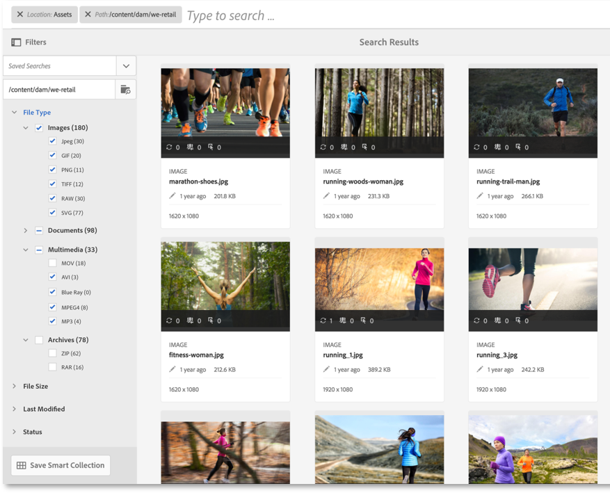
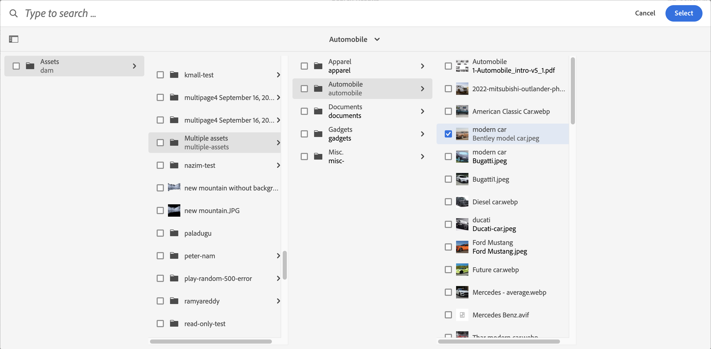

# Middelen zoeken in AEM {#search-assets-in-aem}

| Versie | Artikelkoppeling |
| -------- | ---------------------------- |
| AEM 6.5 | [&#x200B; klik hier &#x200B;](https://experienceleague.adobe.com/docs/experience-manager-65/assets/using/search-assets.html?lang=nl-NL) |
| AEM as a Cloud Service | Dit artikel |

[!DNL Adobe Experience Manager Assets] biedt robuuste methoden voor het zoeken naar elementen waarmee u een hogere snelheid van de inhoud kunt bereiken. Uw teams kunnen tijd aan markt met naadloze, intelligente ervaring van middelenonderzoek verminderen gebruikend out-of-the-box functionaliteit en douanemethodes. De mogelijkheid van zoekmiddelen staat centraal in het gebruik van een systeem voor het beheer van digitale middelen — of het nu gaat om verder gebruik door klanten, voor een robuust beheer van bedrijfsmiddelen door zakelijke gebruikers en marketeers of voor beheer door DAM-beheerders. Eenvoudige, geavanceerde en aangepaste zoekopdrachten die u kunt uitvoeren via de gebruikersinterface van [!DNL Assets] of andere apps en oppervlakken helpen deze gebruiksgevallen te verhelpen.

Het zoeken naar middelen in AEM ondersteunt de volgende gebruiksgevallen en in dit artikel worden het gebruik, de concepten, configuraties, beperkingen en probleemoplossing voor deze gebruiksgevallen beschreven.

| Zoeken in middelen | Zoekfuncties configureren en beheren | Werken met resultaten voor middelenzoekopdrachten |
|---|---|---|
| [&#x200B; Basisonderzoeken &#x200B;](#searchbasics) | [&#x200B; index van het Onderzoek &#x200B;](#searchindex) | [&#x200B; de resultaten van de Soort &#x200B;](#sort) |
| [&#x200B; Begrijp onderzoek UI &#x200B;](#searchui) | [&#x200B; extractie van de Tekst &#x200B;](#extracttextupload) | [&#x200B; de eigenschappen en meta-gegevens van de Controle van activa &#x200B;](#checkinfo) |
| [&#x200B; suggesties van het Onderzoek &#x200B;](#searchsuggestions) | [&#x200B; Verplichte meta-gegevens &#x200B;](#mandatorymetadata) | [&#x200B; Download &#x200B;](#download) |
| [&#x200B; begrijp onderzoeksresultaten en gedrag &#x200B;](#searchbehavior) | [&#x200B; wijzig onderzoeksfacetten &#x200B;](#searchfacets) | [&#x200B; Bulk meta-gegevensupdates &#x200B;](#metadata-updates) |
| [&#x200B; rang van het Onderzoek en het opvoeren &#x200B;](#searchrank) | [&#x200B; de Voorspelden van de Douane &#x200B;](#custompredicates) | [&#x200B; Slimme inzamelingen &#x200B;](#collections) |
| [&#x200B; Geavanceerd onderzoek: het filtreren en werkingsgebied van onderzoek &#x200B;](#scope) | | [&#x200B; begrijp en los onverwachte resultaten &#x200B;](#unexpected-results) problemen op |
| [&#x200B; Onderzoek van andere oplossingen en apps &#x200B;](#search-assets-other-surfaces):<ul><li>[&#x200B; de Verbinding van Activa van Adobe &#x200B;](#aal)</li><li>[&#x200B; Brand Portal &#x200B;](#brand-portal)</li><li>[&#x200B; Experience Manager Desktop app &#x200B;](#desktop-app)</li><li>[&#x200B; de beelden van Adobe Stock &#x200B;](#adobe-stock)</li><li>[&#x200B; Dynamische activa van Media &#x200B;](#search-dynamic-media-assets)</li></ul> | | |
| [&#x200B; selecteur van Activa &#x200B;](#asset-picker) | | |
| [&#x200B; Beperkingen &#x200B;](#limitations) en [&#x200B; Uiteinden &#x200B;](#tips) | | |
| [&#x200B; Afgedrukte voorbeelden &#x200B;](#samples) | | |

Zoek elementen met behulp van het veld Onderzoek boven aan de webinterface van [!DNL Experience Manager] . Ga naar **[!UICONTROL Assets]** > **[!UICONTROL Files]** in [!DNL Experience Manager], klik  in hoogste bar, ga onderzoekssleutelwoord in, en selecteer `Return`. U kunt ook de trefwoordsneltoets `/` (slash) gebruiken om het veld Onderzoek te openen. `Location:Assets` is vooraf geselecteerd om de zoekopdrachten te beperken tot DAM-elementen. `Path:/content/dam` wordt ook weergegeven wanneer u zoekopdrachten uitvoert op het hoofdniveau in de map **[!UICONTROL Files]** . Als u naar een andere map navigeert, wordt in `Path:/content/dam/<folder name>` in het veld Onderzoek weergegeven om het zoekbereik te beperken tot de huidige map. [!DNL Experience Manager] biedt suggesties wanneer u een zoekwoord begint te typen.

Gebruik het deelvenster **[!UICONTROL Filters]** om te zoeken naar elementen, mappen, tags en metagegevens. U kunt zoekresultaten filteren op basis van de verschillende opties (voorspelling), zoals bestandstype, bestandsgrootte, datum van laatste wijziging, status van element, gegevens over inzichten en Adobe Stock-licenties. U kunt het paneel van Filters aanpassen en onderzoek toevoegen of verwijderen voorspelt gebruikend [&#x200B; onderzoeksfacetten &#x200B;](/help/assets/search-facets.md). Het filter [!UICONTROL File Type] in het deelvenster [!UICONTROL Filters] heeft selectievakjes met gemengde status. Tenzij u alle geneste voorspellen (of indelingen) selecteert, worden de selectievakjes op het eerste niveau daarom gedeeltelijk gecontroleerd.

De zoekfunctie van [!DNL Experience Manager] ondersteunt het zoeken naar verzamelingen en het zoeken naar elementen in een verzameling. Zie [&#x200B; onderzoeksinzamelingen &#x200B;](/help/assets/manage-collections.md).

## Interface voor middelenzoekopdrachten begrijpen {#searchui}

Verken uzelf met de interface voor het zoeken naar middelen en de beschikbare acties.
<!--

-->

*Figuur: Begrijp [!DNL Experience Manager Assets] interface van onderzoeksresultaten.*

**A.** sparen onderzoek als slimme inzameling.
**B.** Filters of voorspelt om de onderzoeksresultaten te beperken.
**C.** de dossiers van de vertoning, omslagen, of allebei.
**D.** de plaats van het Onderzoek is DAM.
**E.** toegang Opgeslagen Zoekopdrachten.
**F.** klik Filters om het linkerspoor te openen of te sluiten.
**G.** toont Assets als standaardonderzoek.
**H.** de plaats van het Onderzoek is DAM.
**I.** het gebied van het Onderzoek met user-provided onderzoekssleutelwoord.
**J.** selecteer de geladen onderzoeksresultaten.
**K.** Soort door Gemaakt, Gewijzigd, Naam, niets.
**L.** Soort door het stijgen of Aflopende orde.
**M.** Aantal getoonde onderzoeksresultaten uit de totale onderzoeksresultaten. **N.** Dichte onderzoek.
**O.** Schakelaar tussen kaartmening en lijstmening.

### Dynamische zoekfacetten {#dynamicfacets}

U kunt de gewenste elementen sneller vinden op de pagina met zoekresultaten met behulp van het dynamisch bijgewerkte aantal verwachte zoekresultaten in de zoekfacetten. Het verwachte aantal elementen wordt bijgewerkt, zelfs voordat het zoekfilter wordt toegepast. Door het verwachte aantal op het filter te zien, kunt u snel en efficiënt door de zoekresultaten navigeren.

*Cijfer: Zie het benaderende aantal activa zonder het filtreren onderzoeksresultaten in onderzoeksfacetten.*

Experience Manager Assets geeft standaard facetaantallen voor twee eigenschappen weer:

* Elementtype (jcr :content/metadata/dc :format)

* Goedkeuringsstatus (jcr :content /metadata/dam :status)

Vanaf augustus 2023 bevat Experience Manager Assets een nieuwe versie 9 van de index van `damAssetLucene` . In de vorige versies, `damAssetLucene-8` en lager, wordt de modus `statistical` gebruikt om toegangsbeheer te controleren op een voorbeeld van de items voor elk aantal zoekfacetten.

`damAssetLucene-9` wijzigt het gedrag van het tellen van de facet van de Vraag van Oak om toegangsbeheer op de facettellingen niet meer te evalueren die door de onderliggende onderzoeksindex zijn teruggekeerd, wat in de snellere tijden van de onderzoeksreactie resulteert. Dit heeft tot gevolg dat gebruikers mogelijk waarden voor het aantal facetten krijgen, waaronder elementen waartoe ze geen toegang hebben. Deze gebruikers hebben geen toegang tot, kunnen geen gegevens downloaden van of lezen over deze elementen, inclusief de paden, of kunnen geen verdere informatie over deze elementen krijgen.

Als u op het vorige gedrag (`statistical` wijze) moet schakelen, zie [&#x200B; Inhoud Onderzoek en het Indexeren &#x200B;](https://experienceleague.adobe.com/docs/experience-manager-cloud-service/content/operations/indexing.html?lang=nl-NL) om een douaneversie van de `damAssetLucene-9` index tot stand te brengen. Adobe raadt u niet aan over te schakelen op de modus `secure` vanwege de invloed op de responstijden van zoekopdrachten met grote resultaatsets.

Voor meer informatie over Oak facetmogelijkheden, met inbegrip van een gedetailleerde beschrijving van deze wijzen, zie [&#x200B; Facets - de Documentatie van Oak - de Index van Lucene &#x200B;](https://jackrabbit.apache.org/oak/docs/query/lucene.html#facets).

## Suggesties zoeken terwijl u typt {#searchsuggestions}

Wanneer u een trefwoord begint te typen, stelt Experience Manager de mogelijke zoektrefwoorden of trefwoorden voor. De suggesties zijn gebaseerd op de middelen in Experience Manager. Experience Manager indexeert alle metagegevensvelden om te helpen met zoeken. Voor zoeksuggesties gebruikt het systeem de waarden van de volgende paar metagegevensvelden. Als u zoeksuggesties wilt doen, kunt u de volgende velden vullen met de juiste trefwoorden:

* Elementlabels. (afbeeldingen `jcr:content/metadata/cq:tags` )
* Titel van element. (afbeeldingen `jcr:content/metadata/dc:title` )
* Beschrijving van element. (afbeeldingen `jcr:content/metadata/dc:description` )
* Titel in de gegevensopslagruimte van het JCR. De waarde wordt mogelijk toegewezen aan de titel van het element. (afbeeldingen `jcr:content/jcr:title` )
* Beschrijving in de gegevensopslagruimte van de JCR. De waarde wordt mogelijk toegewezen aan de beschrijving van het element. (afbeeldingen `jcr:content/jcr:description` )

## Zoekresultaten en gedrag begrijpen {#searchbehavior}

### Standaardzoektermen en -resultaten {#searchbasics}

U kunt trefwoordzoekopdrachten uitvoeren vanuit het veld UniverseelZoeken. De trefwoordzoekopdracht is niet hoofdlettergevoelig en bestaat uit een zoekopdracht in volledige tekst (in de veelgebruikte metagegevensvelden). Als er meerdere trefwoorden worden gebruikt, is `AND` de standaardoperator tussen de trefwoorden.

De resultaten worden gesorteerd op relevantie, te beginnen met de dichtstbijzijnde overeenkomsten. Voor meerdere trefwoorden zijn relevantere resultaten de elementen die beide termen in de metagegevens bevatten. Trefwoorden die in de metagegevens voorkomen, krijgen een hogere positie dan trefwoorden die in andere metagegevensvelden worden weergegeven. Met [!DNL Experience Manager] kunt u een bepaalde zoekterm een hogere waarde geven. Ook, is het mogelijk om [&#x200B; de rang &#x200B;](#searchrank) van een paar gerichte activa voor specifieke onderzoekstermijnen op te voeren.

Om de relevante activa snel te vinden, verstrekt de rijke interface het filtreren, het sorteren, en selectiemechanismen. U kunt resultaten filteren op basis van meerdere criteria en het aantal gezochte elementen voor verschillende filters bekijken. U kunt de zoekopdracht ook opnieuw uitvoeren door de query in het veld Onderzoek te wijzigen. Wanneer u de zoektermen of filters wijzigt, blijven de andere filters van toepassing om de context van de zoekopdracht te behouden.

Wanneer de resultaten veel elementen zijn, geeft [!DNL Experience Manager] de eerste 100 weer in de kaartweergave en 200 in de lijstweergave. Wanneer gebruikers schuiven, worden meer elementen geladen. Dit is om de prestaties te verbeteren. Bekijk een videodemonstratie van het [&#x200B; aantal getoonde activa &#x200B;](https://www.youtube.com/watch?v=LcrGPDLDf4o).

Het kan voorkomen dat de zoekresultaten een aantal onverwachte elementen bevatten. Voor meer info, zie [&#x200B; onverwachte resultaten &#x200B;](#unexpected-results).

[!DNL Experience Manager] kan in een groot aantal bestandsindelingen zoeken en de zoekfilters kunnen aan uw zakelijke vereisten worden aangepast. Neem contact op met uw beheerder om te weten welke zoekopties beschikbaar worden gesteld voor uw DAM-opslagplaats en welke beperkingen uw account heeft.

<!-- 
### Results with and without enhanced Smart Tags {#withsmarttags}

By default, [!DNL Experience Manager] search combines the search terms with an AND clause. For example, consider searching for keywords woman running. Only the assets with both woman and running keywords in the metadata appear in the search results by default. The same behavior is retained when special characters (periods, underscores, or dashes) are used with the keywords. The following search queries return the same results:

* `woman running`
* `woman.running`
* `woman-running`

However, the query `woman -running` returns assets without `running` in their metadata.
Using Smart Tags adds an extra `OR` clause to find any of the search terms as the applied smart tags. An asset tagged with either `woman` or `running` using Smart Tags also appear in such a search query. So the search results are a combination of,

* Assets with `woman` and `running` keywords in the metadata (default behavior).

* Assets smart tagged with either of the keywords (Smart Tags behavior).
-->

### Rangschikking en boosting zoeken {#searchrank}

De zoekresultaten die overeenkomen met alle zoektermen in metagegevensvelden worden eerst weergegeven, gevolgd door de zoekresultaten die overeenkomen met een van de zoektermen in de slimme tags. In het bovenstaande voorbeeld is de weergavevolgorde van zoekresultaten bij benadering:

1. Komt overeen met `woman running` in de verschillende metagegevensvelden.
1. Komt overeen met `woman running` in slimme tags.
1. Komt overeen met `woman` of `running` in slimme tags.

U kunt de relevantie van trefwoorden voor bepaalde elementen verbeteren om zoekopdrachten op basis van trefwoorden te stimuleren. Met andere woorden, de afbeeldingen waarvoor u specifieke trefwoorden promoot, worden boven aan de zoekresultaten weergegeven wanneer u op basis van deze trefwoorden zoekt.

1. Open vanuit de gebruikersinterface van [!DNL Assets] de eigenschappenpagina voor het element. Klik op **[!UICONTROL Advanced]** en klik op **[!UICONTROL Add]** onder **[!UICONTROL Elevate for search keywords]** .
1. Geef in het vak **[!UICONTROL Search Promote]** een trefwoord op waarvoor u de zoekopdracht naar de afbeelding wilt opvoeren en klik vervolgens op **[!UICONTROL Add]** . U kunt meerdere trefwoorden op dezelfde manier opgeven.
1. Klik op **[!UICONTROL Save & Close]**. Het element dat u voor dit trefwoord hebt gepromoot, wordt weergegeven in de beste zoekresultaten.

U kunt dit in uw voordeel gebruiken door de positie van bepaalde elementen in de zoekresultaten voor het doeltrefwoord te verhogen. Zie de onderstaande voorbeeldvideo. Voor gedetailleerde info, zie [&#x200B; onderzoek in  [!DNL Experience Manager] &#x200B;](https://experienceleague.adobe.com/docs/experience-manager-learn/assets/search-and-discovery/search-boost.html?lang=nl-NL).

>[!VIDEO](https://video.tv.adobe.com/v/3444067/?captions=dut&quality=6)

*Video: Begrijp hoe de onderzoeksresultaten gerangschikt zijn en hoe de rang kan worden beïnvloed.*

## De grootte van een elementbatch configureren om zoekresultaten weer te geven {#configure-asset-batch-size}

Beheerders kunnen nu de batchgrootte configureren van elementen die worden weergegeven wanneer u een zoekopdracht uitvoert. De resultaten van het activaonderzoek tonen in veelvouden van het gevormde aantal van de partijgrootte wanneer u verder neer scrolt om de resultaten te laden. U kunt kiezen uit de beschikbare batchformaten van 200, 500 en 1000 elementen. Als u een lagere batch-grootte instelt, resulteert dit in snellere zoekresponstijden.

Als u bijvoorbeeld de limiet voor het aantal resultaten instelt op een batch van 200 elementen, geeft Experience Manager Assets een batch-grootte van 200 elementen weer in de zoekresultaten wanneer u de zoekopdracht uitvoert. Wanneer u omlaag schuift om door de onderzoeksresultaten te navigeren, wordt de volgende partij van 200 activa getoond. Het proces gaat door tot alle activa die de onderzoeksvraag aanpassen worden getoond.

De grootte van de elementbatch configureren:

1. Navigeer naar **[!UICONTROL Tools]** > **[!UICONTROL Assets]** > **[!UICONTROL Assets Configurations]** > **[!UICONTROL Assets Omnisearch Configuration]** .

1. Selecteer de limiet voor het aantal resultaten en klik op **[!UICONTROL Save]** .

   

## Geavanceerd zoeken {#scope}

[!DNL Experience Manager] biedt verschillende methoden, zoals filters die van toepassing zijn op de gezochte elementen, zodat u de gewenste elementen sneller kunt vinden. Hieronder worden enkele veelgebruikte methoden beschreven. Sommige [&#x200B; geïllustreerde voorbeelden &#x200B;](#samples) worden hieronder gedeeld.

**Onderzoek naar dossiers of omslagen**: In de onderzoeksresultaten, zie of dossiers, omslagen, of allebei. In het deelvenster **[!UICONTROL Filters]** kunt u de juiste optie selecteren. Zie [&#x200B; onderzoeksinterface &#x200B;](#searchui).

**Onderzoek naar activa binnen een omslag**: U kunt het onderzoek tot een specifieke omslag beperken. Voeg in het deelvenster **[!UICONTROL Filters]** het pad van een map toe. U kunt slechts één map tegelijk selecteren.

<!--

-->

*Cijfer: De onderzoeksresultaten van de grens aan een omslag door een omslagweg in het paneel van Filters toe te voegen.*

### Vergelijkbare afbeeldingen zoeken {#visualsearch}

Als u afbeeldingen wilt zoeken die visueel lijken op een door de gebruiker geselecteerde afbeelding, klikt u op de optie **[!UICONTROL Find Similar]** in de kaartweergave van een afbeelding of op de werkbalk. In [!DNL Experience Manager] worden de slimme getagde afbeeldingen uit de DAM-opslagplaats weergegeven die lijken op een door de gebruiker geselecteerde afbeelding.

*Cijfer: Vind gelijkaardige beelden gebruikend de optie in de kaartmening.*

### Adobe Stock-afbeeldingen {#adobe-stock}

Van binnen het [!DNL Experience Manager] gebruikersinterface, kunnen de gebruikers [&#x200B; activa van Adobe Stock &#x200B;](/help/assets/aem-assets-adobe-stock.md) zoeken en de vereiste activa vergunning geven. Voeg `Location: Adobe Stock` toe in de balk Zoeken. U kunt ook het deelvenster Filters gebruiken om alle middelen te zoeken waarvoor een licentie is verleend of om een bepaald element te zoeken aan de hand van het Adobe Stock-bestandsnummer.

### Dynamische media-elementen {#dmassets}

U kunt filteren op dynamische media-afbeeldingen door **[!UICONTROL Dynamic Media]** > **[!UICONTROL Sets]** te selecteren in het deelvenster **[!UICONTROL Filters]**. Het filter en toont activa zoals beeldreeksen, carrousels, gemengde media reeksen, en spin reeksen.

### GQL-zoekopdracht met specifieke waarden in metagegevensvelden {#gql-search}

U kunt zoeken in elementen op basis van exacte waarden van metagegevensvelden, zoals titel, beschrijving en maker. Met de zoekfunctie voor volledige tekst GQL haalt u alleen die elementen op waarvan de metagegevenswaarde exact overeenkomt met uw zoekopdracht. De namen van de eigenschappen (Maker, Titel, enzovoort) en de waarden zijn hoofdlettergevoelig.

| Metagegevensveld | Facetwaarde en gebruik |
|---|---|
| Titel | title:John |
| Maker | creator :John |
| Locatie | location:NA |
| Beschrijving | beschrijving:&quot;Voorbeeldafbeelding&quot; |
| Gereedschap Maker | creatortool:&quot;Adobe Photoshop&quot; |
| Copyrighteigenaar | copyrightowner:&quot;Adobe Systems&quot; |
| Medewerker | contribuant :John |
| Gebruiksvoorwaarden | usageterms:&quot;CopyRights Reserved&quot; |
| Gemaakt | created:YYYY-MM-DDTHH |
| Vervaldatum | verloopt :YYYY-MM-DDTHH |
| Op tijd | ontime :YYYY-MM-DDTHH |
| Uit-tijd | offtime :YYYY-MM-DDTHH |
| Tijdsbereik (verloopt dateontime, offtime) | facet field : lowerbound..bovenaan |
| Pad | /content/dam/&lt;naam map> |
| PDF-titel | pdftitle:&quot;Adobe-document&quot; |
| Onderwerp | onderwerp: &quot;Opleiding&quot; |
| Tags | tags:&quot;Locatie en reizen&quot; |
| Type | type:&quot;image\png&quot; |
| Breedte van afbeelding | width :lowerbound..bovenaan |
| Hoogte van afbeelding | height:lowerbound..bovenaan |
| Persoon | person:John |

De eigenschappen `path` , `limit` , `size` en `orderby` kunnen niet met een `OR` -operator worden gecombineerd met een andere eigenschap.

<!-- TBD: Where are the limit, size, orderby properties defined?
-->

Het sleutelwoord voor een user-generated bezit is zijn gebiedsetiket in de bezitsredacteur in kleine letters, met verwijderde ruimten.

Hier volgen enkele voorbeelden van zoekindelingen voor complexe query&#39;s:

* Alle elementen met meerdere facetvelden weergeven (bijvoorbeeld: title=Jan Smit en creator tool = Adobe Photoshop): `title:"John Doe" creatortool:Adobe*`
* Om alle activa te tonen wanneer de facetwaarde niet één enkel woord maar een zin (bijvoorbeeld: title=Scott Reynolds) is: `title:"Scott Reynolds"`
* Elementen weergeven met meerdere waarden van één eigenschap (bijvoorbeeld: title=Scott Reynolds of Jan Smit): `title:"Scott Reynolds" OR "John Doe"`
* Elementen weergeven waarvan de eigenschapswaarden beginnen met een specifieke tekenreeks (bijvoorbeeld: title is Scott Reynolds): `title:Scott*`
* Elementen met eigenschapswaarden die eindigen met een specifieke tekenreeks (bijvoorbeeld: title is Scott Reynolds) weergeven: `title:*Reynolds`
* Elementen weergeven met een eigenschapswaarde die een specifieke tekenreeks bevat (bijvoorbeeld: title = Basel Meeting Room): `title:*Meeting*`
* Elementen weergeven die een bepaalde tekenreeks bevatten en een specifieke eigenschapswaarde hebben (bijvoorbeeld: zoeken naar tekenreeks Adobe in elementen met de naam title=Jan Smit): `*Adobe* title:"John Doe"`

## Middelen zoeken vanuit andere [!DNL Experience Manager] aanbiedingen of interfaces {#search-assets-other-surfaces}

[!DNL Adobe Experience Manager] maakt een verbinding tussen DAM-opslagplaats en verschillende andere [!DNL Experience Manager] -oplossingen om sneller toegang te krijgen tot digitale middelen en de creatieve workflows te stroomlijnen. Elke detectie van middelen begint met bladeren of zoeken. Het zoekgedrag blijft grotendeels hetzelfde op de verschillende oppervlakken en oplossingen. Sommige zoekmethoden veranderen als het doelpubliek, de gebruiksgevallen en de gebruikersinterface voor de [!DNL Experience Manager] -oplossingen. De specifieke methoden worden gedocumenteerd voor de afzonderlijke oplossingen in de onderstaande koppelingen. De algemeen toepasselijke tips en gedragingen worden in dit artikel beschreven.

### Middelen zoeken vanuit het deelvenster Adobe Asset Link {#aal}

Met Adobe Asset Link hebben creatieve professionals nu toegang tot inhoud die is opgeslagen in [!DNL Experience Manager Assets] zonder de ondersteunde Adobe Creative Cloud-apps te verlaten. Creatieve personen kunnen naadloos door elementen bladeren, zoeken, uitchecken en inchecken via het deelvenster in de app in de apps: [!DNL Adobe Creative Cloud] , [!DNL Adobe Photoshop] en [!DNL Adobe Illustrator] . [!DNL Adobe InDesign] Met Asset Link kunnen gebruikers ook visueel vergelijkbare resultaten zoeken. De visuele resultaten van de zoekweergave worden aangedreven door Adobe AI-computerleeralgoritmen en helpen gebruikers bij het zoeken naar esthetisch vergelijkbare afbeeldingen. Zie [&#x200B; onderzoek en doorblader activa &#x200B;](https://helpx.adobe.com/nl/enterprise/using/manage-assets-using-adobe-asset-link.html#UseAdobeAssetLink) gebruikend de Verbinding van Activa van Adobe.

### Middelen zoeken in de [!DNL Experience Manager] bureaubladtoepassing {#desktop-app}

Creative-professionals gebruiken de bureaubladtoepassing om de [!DNL Experience Manager Assets] gemakkelijk doorzoekbaar te maken en beschikbaar te maken op hun lokale bureaublad (Win of Mac). Creative Cloud kan de gewenste middelen eenvoudig weergeven in Mac Finder of Windows Verkenner, geopend in bureaubladtoepassingen en lokaal gewijzigd. De wijzigingen worden opgeslagen in [!DNL Experience Manager] met een nieuwe versie die in de opslagplaats is gemaakt. De toepassing ondersteunt standaardzoekopdrachten met een of meer trefwoorden, `*` en `?` jokertekens en `AND` operator. Zie [&#x200B; doorbladeren, onderzoek, en voorproefactiva &#x200B;](https://experienceleague.adobe.com/docs/experience-manager-desktop-app/using/using.html?lang=nl-NL#browse-search-preview-assets) in Desktop app.

### Middelen zoeken in [!DNL Brand Portal] {#brand-portal}

Line-of-business gebruikers en marketers gebruiken Brand Portal om de goedgekeurde digitale middelen efficiënt en veilig te delen met hun uitgebreide interne teams, partners en wederverkopers. Zie [&#x200B; onderzoeksactiva op Brand Portal &#x200B;](https://experienceleague.adobe.com/docs/experience-manager-brand-portal/using/search-capabilities/brand-portal-searching.html?lang=nl-NL).

### [!DNL Adobe Stock] afbeeldingen zoeken {#adobe-stock1}

Vanuit de gebruikersinterface van [!DNL Experience Manager] kunnen gebruikers zoeken in Adobe Stock-middelen en een licentie voor de vereiste middelen aanschaffen. Voeg `Location: Adobe Stock` toe in het veld Onderzoek. U kunt ook het deelvenster **[!UICONTROL Filters]** gebruiken om alle onder licentie gegeven of niet-gelicentieerde elementen te zoeken of een bepaald element te zoeken aan de hand van het Adobe Stock-bestandsnummer. Zie [&#x200B;  [!DNL Adobe Stock]  beelden in  [!DNL Experience Manager]](/help/assets/aem-assets-adobe-stock.md#usemanage) beheren.

### Zoeken in [!DNL Dynamic Media] elementen {#search-dynamic-media-assets}

U kunt filteren op dynamische media-afbeeldingen door **[!UICONTROL Dynamic Media]** > **[!UICONTROL Sets]** te selecteren in het deelvenster **[!UICONTROL Filters]**. Het filtert op en toont assets zoals afbeeldingsets, carrousels, gemengde mediasets, en spinsets. Tijdens het ontwerpen van webpagina&#39;s kunnen auteurs naar sets zoeken in de Inhoudszoeker. Een filter voor sets is beschikbaar in een pop-upmenu.

### Middelen zoeken in de Inhoudszoeker bij het ontwerpen van webpagina&#39;s {#content-finder}

Auteurs kunnen de Inhoudszoeker gebruiken om in de DAM-opslagplaats te zoeken naar de relevante elementen en de elementen te gebruiken op de webpagina&#39;s die ze maken. Auteurs kunnen ook de Connected Assets-functionaliteit gebruiken om te zoeken naar elementen die beschikbaar zijn op een externe [!DNL Experience Manager] -implementatie. Auteurs kunnen deze elementen vervolgens op webpagina&#39;s gebruiken bij een lokale [!DNL Experience Manager] -implementatie. Zie [&#x200B; gebruik verre activa &#x200B;](/help/assets/use-assets-across-connected-assets-instances.md#use-remote-assets).

### Verzamelingen zoeken {#collections}

De zoekfunctie van [!DNL Experience Manager] ondersteunt het zoeken naar verzamelingen en het zoeken naar elementen in een verzameling. Zie [&#x200B; onderzoeksinzamelingen &#x200B;](/help/assets/manage-collections.md).

## Elementkiezer {#asset-picker}

[&#x200B; de Selecteur van Activa van AEM &#x200B;](/help/assets/overview-asset-selector.md) (genoemd activa plukker in vroegere versies van [!DNL Adobe Experience Manager]) laat u zoeken, filteren, en doorbladeren de activa DAM op een speciale manier. Asset Selector is beschikbaar via `https://[aem_server]:[port]/aem/assetpicker.html` . U kunt de metagegevens ophalen van elementen die u selecteert met de elementkiezer. U kunt de toepassing starten met ondersteunde aanvraagparameters, zoals het type element (afbeelding, video, tekst) en de selectiemodus (enkele of meerdere selecties). Deze parameters stellen de context van de elementenkiezer voor een bepaalde zoekinstantie in en blijven tijdens de selectie intact.

De elementenkiezer gebruikt het HTML5 `Window.postMessage` -bericht om gegevens voor het geselecteerde element naar de ontvanger te verzenden. Deze functie werkt alleen in de modus Bladeren en alleen met de resultatenpagina van Omnsearch.

Geef de volgende aanvraagparameters in een URL door om de elementenkiezer in een bepaalde context te starten:

| Naam | Waarden | Voorbeeld | Doel |
|---|---|---|---|
| bronachtervoegsel (B) | De weg van de omslag als middelachtervoegsel in URL: [&#x200B; https://localhost :4502 /aem/assetpicker.html/&lt;folder_path> &#x200B;](https://localhost:4502/aem/assetpicker.html) | Als u de elementenkiezer wilt starten terwijl een bepaalde map is geselecteerd en de map `/content/dam/we-retail/en/activities` geselecteerd is, moet de URL de volgende vorm hebben: `https://localhost:4502/aem/assetpicker.html/content/dam/we-retail/en/activities?assettype=images` | Als u wilt dat een bepaalde map wordt geselecteerd wanneer de elementenkiezer wordt gestart, geeft u deze door als een bronachtervoegsel. |
| `mode` | enkelvoudig, meerdere | <ul><li>`https://localhost:4502/aem/assetpicker.html?mode=single`</li><li>`https://localhost:4502/aem/assetpicker.html?mode=multiple`</li></ul> | In meerdere modi kunt u meerdere elementen tegelijk selecteren met de elementkiezer. |
| `dialog` | true, false | [&#x200B; https://localhost :4502 /aem/assetpicker.html?dialog=true &#x200B;](https://localhost:4502/aem/assetpicker.html?dialog=true) | Gebruik deze parameters om de elementenkiezer te openen als granietdialoogvenster. Deze optie is alleen van toepassing wanneer u de elementenkiezer start via Granite Path Field en deze configureert als pickerSrc URL. |
| `root` | &lt;folder_path> | `https://localhost:4502/aem/assetpicker.html?assettype=images&root=/content/dam/we-retail/en/activities` | Gebruik deze optie om de hoofdmap voor de elementenkiezer op te geven. In dit geval kunt u met de elementenkiezer alleen onderliggende elementen (direct/indirect) in de hoofdmap selecteren. |
| `viewmode` | zoeken | | De elementkiezer starten in de zoekmodus met de parameters `assettype` en `mimetype` . |
| `assettype` | Afbeeldingen, documenten, multimedia, archieven. | <ul><li>`https://localhost:4502/aem/assetpicker.html?viewmode=search&assettype=images`</li><li> `https://localhost:4502/aem/assetpicker.html?viewmode=search&assettype=documents` </li><li> `https://localhost:4502/aem/assetpicker.html?viewmode=search&assettype=multimedia` </li><li> `https://localhost:4502/aem/assetpicker.html?viewmode=search&assettype=archives` </li></ul> | Gebruik de optie om elementtypen te filteren op basis van de opgegeven waarde. |
| `mimetype` | MIME-type (`/jcr:content/metadata/dc:format`) van een element (jokerteken wordt ook ondersteund). | <ul><li>`https://localhost:4502/aem/assetpicker.html?mimetype=image/png`</li><li>`https://localhost:4502/aem/assetpicker.html?mimetype=*png`</li><li>`https://localhost:4502/aem/assetpicker.html?mimetype=*presentation`</li><li>`https://localhost:4502/aem/assetpicker.html?mimetype=*presentation&mimetype=*png`</li></ul> | Gebruik deze optie om elementen te filteren op basis van het MIME-type. |

Ga naar `https://[aem_server]:[port]/aem/assetpicker` als u de interface van de elementenkiezer wilt openen. Navigeer naar de gewenste map en selecteer een of meer elementen. U kunt ook naar het gewenste element zoeken in het vak Zoeken, naar wens een filter toepassen en het vervolgens selecteren.

<!---->

*Cijfer: doorblader en selecteer activa in de activaselecteur.*

## Beperkingen {#limitations}

De zoekfunctie in [!DNL Experience Manager Assets] heeft de volgende beperkingen:

* Geef geen regelafstand op in de zoekopdracht als de zoekopdracht anders niet werkt.
* [!DNL Experience Manager] blijft mogelijk de zoekterm weergeven nadat u eigenschappen van een element hebt geselecteerd in de gezochte resultaten en vervolgens de zoekopdracht hebt geannuleerd. <!-- (CQ-4273540) -->
* Wanneer u naar mappen of bestanden en mappen zoekt, kunnen de zoekresultaten op geen enkele parameter worden gesorteerd.
* Als u `Return` selecteert zonder op de zoekbalk te typen, retourneert [!DNL Experience Manager] een lijst met alleen bestanden en niet mappen. Als u specifiek naar mappen zoekt zonder een trefwoord te gebruiken, geeft [!DNL Experience Manager] geen resultaten.
* U kunt zoeken in volledige tekst op mappen. Geef een zoekterm op die de zoekopdracht moet gebruiken.

Het visuele onderzoek of het gelijkenis onderzoek heeft de volgende beperkingen:

* Het visuele onderzoek werkt het best met een grote bewaarplaats. Hoewel er geen minimaal aantal afbeeldingen vereist is voor goede resultaten, is de kwaliteit van overeenkomsten met een paar afbeeldingen minder goed dan de overeenkomsten met een grote opslagplaats.
* U kunt het model of de training [!DNL Experience Manager] niet wijzigen om vergelijkbare afbeeldingen te zoeken. Als u bijvoorbeeld slimme tags toevoegt of verwijdert aan een paar elementen, verandert het model niet. De elementen worden wel uitgesloten van de visueel vergelijkbare zoekresultaten.

De zoekfunctionaliteit kan prestatiebeperkingen hebben in de volgende scenario&#39;s:

* De kaartweergave heeft een snellere laadtijd dan de lijstweergave om de zoekresultaten weer te geven.

## Zoektips {#tips}

* Gebruik bij het controleren van de revisiestatus van de middelen de juiste optie om te bepalen welke middelen zijn goedgekeurd of welke activa nog moeten worden goedgekeurd.
* Gebruik de Insights-voorspelling om te zoeken naar ondersteunde middelen op basis van hun gebruiksstatistieken die zijn verkregen van verschillende Creative-apps. Gebruiksgegevens worden gegroepeerd onder Gebruiksscore, Impressies, Klikken en Mediakanalen waar de elementen categorieën weergeven.
* Schakel het selectievakje **[!UICONTROL Select All]** in om de gezochte elementen te selecteren. In [!DNL Experience Manager] worden in eerste instantie 100 elementen weergegeven in de kaartweergave en 200 elementen in de lijstweergave. Er worden meer elementen geladen wanneer u door de zoekresultaten schuift. U kunt meer elementen selecteren dan de geladen elementen. Het aantal geselecteerde elementen wordt in de rechterbovenhoek van de pagina met zoekresultaten weergegeven. U kunt de selectie bijvoorbeeld activeren door de geselecteerde elementen te downloaden, de eigenschappen van metagegevens voor de geselecteerde elementen bulksgewijs bij te werken of de geselecteerde elementen aan een verzameling toe te voegen. Wanneer er meer elementen zijn geselecteerd dan worden weergegeven, wordt een actie toegepast op alle geselecteerde elementen of wordt in een dialoogvenster het aantal elementen weergegeven waarop de actie wordt toegepast. Als u een handeling wilt toepassen op de elementen die niet zijn geladen, moet u ervoor zorgen dat alle elementen expliciet zijn geselecteerd.
* Om naar activa te zoeken die niet de verplichte meta-gegevens bevatten, zie [&#x200B; verplichte meta-gegevens &#x200B;](#mandatorymetadata).
* Zoeken gebruikt alle metagegevensvelden. Een generieke zoekopdracht, zoals zoeken naar 12, retourneert doorgaans veel resultaten. Voor betere resultaten gebruikt u dubbele (geen enkele) aanhalingstekens of zorgt u ervoor dat het getal aangrenzend is aan een woord zonder speciaal teken (bijvoorbeeld `shoe12` ).
* Bij zoeken in volledige tekst kunnen operatoren zoals `-` en `^` worden gebruikt. Als u deze letters wilt doorzoeken als letterlijke tekenreeksen, plaatst u de zoekexpressie tussen dubbele aanhalingstekens. Gebruik bijvoorbeeld `"Notebook - Beauty"` in plaats van `Notebook - Beauty` .
* Als de onderzoeksresultaten teveel zijn, beperkt het [&#x200B; werkingsgebied van onderzoek &#x200B;](#scope) tot nul-binnen op de gewenste activa. Het werkt het beste als u een idee hebt van hoe u beter kunt zoeken naar de gewenste elementen, bijvoorbeeld een specifiek bestandstype, een specifieke locatie, specifieke metagegevens, enzovoort.

* **het Etiketteren**: De markeringen helpen u activa categoriseren die kunnen worden doorzocht en efficiënter gezocht. Tags helpen andere gebruikers en workflows de juiste taxonomie te geven. [!DNL Experience Manager] biedt methoden om elementen automatisch van tags te voorzien met gebruik van Adobe AI-services. Deze services worden steeds beter in staat gesteld om uw elementen van tags te voorzien met gebruik en training. Wanneer u naar elementen zoekt, worden de slimme tags in de code opgenomen. Het werkt naast de ingebouwde zoekfunctionaliteit. Zie [&#x200B; onderzoeksgedrag &#x200B;](#searchbehavior). Om de orde te optimaliseren waarin de onderzoeksresultaten worden getoond, kunt u [&#x200B; het onderzoek het rangschikken &#x200B;](#searchrank) van een paar uitgezochte activa opvoeren.

* **het Indexeren**: Slechts worden de geïndexeerde meta-gegevens en de activa teruggekeerd in de onderzoeksresultaten. Voor betere dekking en betere prestaties, zorg behoorlijk indexeren en volg de beste praktijken. Zie [&#x200B; indexerend &#x200B;](#searchindex).

Zie meer [&#x200B; beste praktijken van het Onderzoek &#x200B;](search-best-practices.md).

## Enkele voorbeelden ter illustratie van zoekopdrachten {#samples}

Gebruik dubbele aanhalingstekens rond trefwoorden om te zoeken naar elementen die de exacte woordgroep bevatten in de exacte volgorde die de gebruiker heeft opgegeven.

*Cijfer: Het gedrag van het onderzoek met en zonder aanhalingstekens.*

**Onderzoek met asteriskvervanging**: Om het onderzoek te verbreden, gebruik een asterisk vóór of na het onderzoekswoord om het even welk aantal karakters aan te passen. Als u bijvoorbeeld zoekt naar tekst zonder sterretje, worden er geen elementen geretourneerd die een variatie van het woord bevatten (inclusief in de metagegevens). Een sterretje vervangt het gehele aantal tekens. Bijvoorbeeld:

* `run` retourneert elementen met trefwoord exact uitvoeren
* `run*` retourneert elementen met `running` , `run` , `runaway` , enzovoort.
* `*run` retourneert elementen met `outrun` , `rerun` , enzovoort.
* `*run*` retourneert alle mogelijke combinaties.

*Cijfer: Het illustreren gebruik van asteriskvervanging in het onderzoek van Activa dat een voorbeeld gebruikt.*

**Onderzoek met vraagteken vervanging**: Om het onderzoek uit te breiden, gebruik één of meerdere &#39;?&#39; tekens die exact overeenkomen met het aantal tekens. In de volgende afbeelding, bijvoorbeeld:

* `run???` -query komt niet overeen met een element.

* `run????` -query komt overeen met het woord `running` met vier tekens na `run` .

* `??run` -query komt overeen met het woord `rerun` met twee tekens ervoor `run` .

*Cijfer: Het illustreren gebruik van vraagteken vervanging in het onderzoek van Activa gebruikend een voorbeeld.*

**sluit een sleutelwoord** uit: Het streepje van het gebruik aan onderzoek naar activa die geen sleutelwoord bevatten. `running -shoe` -query retourneert bijvoorbeeld elementen die `running` bevatten, maar niet `shoe` . Op dezelfde manier retourneert `camp -night` -query elementen die `camp` maar niet `night` bevatten. De query `camp-night` retourneert elementen die zowel `camp` als `night` bevatten.

 bevatten

*Cijfer: Gebruik van streepje aan onderzoek naar activa die geen uitgesloten sleutelwoord bevatten.*

## AI-zoekopdracht {#ai-search}

AI het Onderzoek is een geavanceerd onderzoeksvermogen dat de betekenis en de intentie achter de vraag van een gebruiker eerder dan het baseren op nauwkeurige sleutelwoordgelijken begrijpt. Het gebruikt kunstmatige intelligentie (AI) en machine het leren om nauwkeurigere en context-bewuste resultaten te leveren.

In tegenstelling tot de traditionele op trefwoorden gebaseerde zoekopdracht, waarbij naar exacte termen wordt gezocht, worden in AI-zoekopdrachten de relaties tussen woorden, concepten en gebruikersintentie geïnterpreteerd. Dit zorgt ervoor dat de gebruikers vinden wat zij-zelfs als hun vraag verschillend wordt gephrased, typos bevat, of in een andere taal is.

Sommige hiervan zijn de belangrijkste voordelen:

* **Meertalige steun**: Onderzoek over veelvoudige talen zonder nauwkeurige vertalingen te vereisen. Gebruikers kunnen relevante inhoud vinden, ongeacht hun querytaal.

* **handvatten spelfouten**: Interpreteert typos en spelfouten, die nauwkeurige resultaten zelfs met imperfecte input verzekeren.

* **begrijpt synoniemen**: Levert resultaten voor verwante termijnen en uitdrukkingen, zodat te hoeven de gebruikers niet om het juiste sleutelwoord te raden.

* **context-Aware onderzoek**: Erkent de bedoeling achter een vraag, niet alleen de nauwkeurige woorden.

### Voorbeelden van AI-zoekopdrachten {#examples-ai-search}

**Vraag van het Voorbeeld**: *Vrouw die koffie* drinkt

Bij de traditionele zoekopdracht op basis van trefwoorden wordt gezocht naar exacte overeenkomsten met metagegevens van elementen, zoals `Woman` , `drinking` en `Coffee` , en worden elementen geretourneerd die al deze termen bevatten in de metagegevens.

AI-zoekopdrachten komen echter overeen met vergelijkbare woorden, zoals `Girl` , `Lady` in het geval van `Woman` en `Cappuccino` en `Latte` in het geval van `Coffee` .

Op dezelfde manier kunt u deze vraag in het Spaans of de spelfout `Woman` als `Wman` specificeren en nog steeds dezelfde resultaten krijgen.

### AI-zoekopdrachten in de beheerweergave in- of uitschakelen {#enable-disable-ai-search}

Voer de volgende stappen uit om AI-zoekopdrachten in Admin-weergave in of uit te schakelen:

1. Ga naar **[!UICONTROL Tools]** >> **[!UICONTROL Assets]** >> **[!UICONTROL Assets Configurations]** >> **[!UICONTROL Assets Omnisearch Configuration]** .

1. Selecteer in de sectie **[!UICONTROL Search]** de optie **[!UICONTROL AI Search]** om AI-zoekopdrachten in te schakelen of **[!UICONTROL Keyword]** om het uit te schakelen.

    toe onbruikbaar

1. Klik op **[!UICONTROL Save]**.

## Configuratie- en beheertaken met betrekking tot zoekfunctionaliteit {#configadmin}

### Indexconfiguraties zoeken {#searchindex}

Asset Discovery is afhankelijk van indexering van de DAM-inhoud, inclusief de metagegevens. Snellere en nauwkeurige detectie van bedrijfsmiddelen is afhankelijk van geoptimaliseerde indexering en geschikte configuraties. Zie [&#x200B; indexerend &#x200B;](/help/operations/indexing.md).

### Verplichte metagegevens {#mandatorymetadata}

Zakelijke gebruikers, beheerders of DAM-bibliotheken kunnen bepaalde metagegevens definiëren als verplichte metagegevens die nodig zijn om de bedrijfsprocessen te laten werken. Om verschillende redenen ontbreken deze metagegevens mogelijk bij sommige elementen, zoals oudere elementen of elementen die in bulk zijn gemigreerd. Assets met ontbrekende of ongeldige metagegevens wordt gedetecteerd en gerapporteerd op basis van de eigenschap voor geïndexeerde metagegevens. Om het te vormen, zie [&#x200B; verplichte meta-gegevens &#x200B;](/help/assets/metadata-schemas.md#defining-mandatory-metadata).

### Zoekfacetten wijzigen {#searchfacets}

[!DNL Experience Manager Assets] biedt zoekfacetten waarmee u de zoekresultaten kunt filteren, zodat de zoekresultaten sneller worden gevonden. Het deelvenster Filters bevat standaard enkele standaardfacetten. Beheerders kunnen het deelvenster Filters aanpassen om de standaardfacetten te wijzigen met behulp van de ingebouwde voorspelling. [!DNL Experience Manager] biedt een goede verzameling ingebouwde voorspellingen en een editor om de facetten aan te passen. Zie [&#x200B; onderzoeksfacetten &#x200B;](/help/assets/search-facets.md).

### Tekst extraheren tijdens het uploaden van elementen {#extracttextupload}

U kunt [!DNL Experience Manager] zo configureren dat de tekst uit de elementen wordt gehaald wanneer gebruikers elementen uploaden, zoals PSD- of PDF-bestanden. [!DNL Experience Manager] indexeert de geëxtraheerde tekst en helpt gebruikers deze elementen te doorzoeken op basis van de geëxtraheerde tekst. Zie [&#x200B; activa &#x200B;](/help/assets/manage-digital-assets.md#uploading-assets) uploaden.

### Aangepaste voorspelling van filterzoekresultaten {#custompredicates}

Voorspellen worden gebruikt om facetten te maken. Beheerders kunnen de zoekfacetten in het deelvenster Filters aanpassen met behulp van vooraf geconfigureerde voorspellingen. Deze voorspelling kan worden aangepast met behulp van overlays. Zie [&#x200B; tot douanevoorspelling &#x200B;](/help/assets/search-facets.md) leiden.

U kunt naar digitale elementen zoeken op basis van een of meer van de volgende eigenschappen. Filters die op sommige van deze eigenschappen van toepassing zijn, zijn standaard beschikbaar en sommige andere filters kunnen op maat worden gemaakt om op de andere eigenschappen toe te passen.

| Zoekveld | Waarden van eigenschappen zoeken |
|-----------------|----------------------------------------------------------------------------------------------------------------------------------------|
| MIME-typen | Afbeeldingen, Documenten, Multimedia, Archieven of Overige. |
| Laatst gewijzigd | Uur, Dag, Week, Maand of Jaar. |
| Bestandsgrootte | Klein, Medium of Groot |
| Status publiceren | Gepubliceerd of Niet gepubliceerd. |
| Goedgekeurde status | Goedgekeurd of geweigerd. |
| Afdrukstand | Horizontaal, Verticaal of Vierkant. |
| Stijl | Kleur, of Zwart-wit. |
| Videohoogte | Opgegeven als minimum- en maximumwaarde. Waarde wordt alleen opgeslagen in de metagegevens van video-uitvoeringen. |
| Videobreedte | Opgegeven als minimum- en maximumwaarde. Waarde wordt alleen opgeslagen in de metagegevens van video-uitvoeringen. |
| Video-indeling | DVI, Flash, MPEG4, MPEG, OGG Theora, QuickTime, Windows Media. Waarde wordt opgeslagen in de metagegevens van de bronvideo en eventuele uitvoeringen. |
| Videocodec | x264. Waarde wordt alleen opgeslagen in de metagegevens van video-uitvoeringen. |
| Videobitsnelheid | Opgegeven als minimum- en maximumwaarde. Waarde wordt alleen opgeslagen in de metagegevens van video-uitvoeringen. |
| Audiocodec | Libvorbis, Lame MP3, AAC-codering. Waarde wordt alleen opgeslagen in de metagegevens van video-uitvoeringen. |
| Audiobitsnelheid | Opgegeven als minimum- en maximumwaarde. Waarde wordt alleen opgeslagen in de metagegevens van video-uitvoeringen. |

## Werken met resultaten voor middelenzoekopdrachten {#aftersearch}

U kunt de volgende handelingen uitvoeren met de elementen die u hebt gezocht in [!DNL Experience Manager] :

* Eigenschappen van metagegevens en andere informatie weergeven.
* Download een of meer middelen.
* Gebruik Desktophandelingen om deze middelen in de bureaubladtoepassing te openen.
* Slimme verzamelingen maken.
* Een versie maken
* Een workflow starten
* Relatieve of ongerelateerde elementen
* Pas filters toe met behulp van het deelvenster Filters dat na het uitvoeren van de zoekopdracht automatisch wordt weergegeven om de zoekresultaten te beperken.
* Navigeren naar de middelenlocatie

### Zoekresultaten sorteren {#sort}

U kunt zoekresultaten sorteren om sneller de vereiste elementen te vinden. U kunt de zoekresultaten alleen sorteren in de lijstweergave en als u **[[!UICONTROL Files]](#searchui)** in het deelvenster **[!UICONTROL Filters]** selecteert. [!DNL Assets] gebruikt sorteren op de server om snel alle elementen (hoe talrijk ook) in een map of resultaten van een zoekopdracht te sorteren. Sorteren op de server levert sneller en nauwkeuriger resultaten op dan sorteren op de client.

In de lijstweergave kunt u de zoekresultaten op dezelfde manier sorteren als elementen in een willekeurige map. Sorteren werkt op deze kolommen: Naam, Titel, Status, Dimensies, Grootte, Classificatie, Gebruik (Gemaakt op), (Datum) Gewijzigd, (Datum) Gepubliceerd, Workflow en Uitgecheckt.

<!--For limitations of sort functionality, see [limitations](#limitations).-->

### Gedetailleerde informatie over een element controleren {#checkinfo}

Op de pagina met zoekresultaten kunt u gedetailleerde informatie over een doorzocht element controleren.

Als u alle metagegevens van een element wilt weergeven, selecteert u het element en klikt u op **[!UICONTROL properties]** in de werkbalk.

Als u de opmerkingen over een asset of de versiegeschiedenis van een asset wilt controleren, klikt u op de asset om een voorvertoning op grote grootte te openen. Open de tijdlijn in het linkerspoor en selecteer **[!UICONTROL Comments]** of **[!UICONTROL Versions]**. U kunt de tijdlijnactiviteit zoals opmerkingen of versies ook in chronologische volgorde sorteren.

*Cijfer: De chronologieingangen van de soort voor een onderzoeksactiva.*

### Gezochte middelen downloaden {#download}

U kunt de gezochte elementen en hun vertoningen downloaden enkel aangezien u regelmatige activa van omslagen downloadt. Selecteer een of meer elementen in de zoekresultaten en klik op **[!UICONTROL Download]** op de werkbalk. Zie [&#x200B; downloadactiva &#x200B;](/help/assets/download-assets-from-aem.md)

### Eigenschappen van metagegevens voor bulkupdates {#metadata-updates}

Het is mogelijk om bulkupdates uit te voeren naar de algemene metagegevensvelden van meerdere elementen. Selecteer een of meer elementen in de zoekresultaten. Klik op **[!UICONTROL Properties]** op de werkbalk en werk de metagegevens naar wens bij. Klik op **[!UICONTROL Save and Close]** als u klaar bent. De eerder bestaande metagegevens in de bijgewerkte velden worden overschreven.

Voor de activa die in één enkele omslag of een inzameling beschikbaar zijn, is het gemakkelijker om [&#x200B; de meta-gegevens in bulk &#x200B;](/help/assets/bulk-metadata-edit.md) bij te werken zonder de onderzoeksfunctionaliteit te gebruiken. Voor de elementen die beschikbaar zijn in verschillende mappen of voldoen aan een algemeen criterium, is het sneller om de metagegevens bulksgewijs bij te werken door te zoeken.

### Slimme verzamelingen {#smart-collections}

Een verzameling is een geordende set elementen die elementen van verschillende locaties kunnen bevatten, omdat verzamelingen alleen verwijzingen naar deze elementen bevatten. Verzamelingen zijn van de volgende twee typen:

* Een statische referentielijst met elementen, mappen en andere verzamelingen.
* Een dynamische lijst (slimme verzameling) die elementen in de verzameling vult op basis van zoekcriteria.

U kunt slimme verzamelingen maken op basis van de zoekcriteria. Selecteer in het deelvenster **[!UICONTROL Filters]** de optie **[!UICONTROL Files]** en klik op **[!UICONTROL Save Smart Collection]**. Zie [Verzamelingen beheren](/help/assets/manage-collections.md).

### Een versie maken {#create-version}

Maak een versie voor de elementen die in de zoekresultaten worden weergegeven. Selecteer het element en klik op **[!UICONTROL Create]** > **[!UICONTROL Version]** . Voeg een optioneel label of een opmerking toe en klik op **[!UICONTROL Create]** . U kunt ook meerdere elementen tegelijk selecteren en er versies voor maken.

### Een workflow maken {#create-workflow}

Net als bij de functie voor het maken van een versie kunt u ook een workflow maken voor de elementen die in de zoekresultaten worden weergegeven. Selecteer de elementen en klik op **[!UICONTROL Create]** > **[!UICONTROL Workflow]** . Selecteer het workflowmodel, geef een titel voor de workflow op en klik op **[!UICONTROL Start]** .

### Relatieve en niet-gerelateerde elementen {#relate-unrelate-assets}

Verwante en losse elementen die in de zoekresultaten worden weergegeven. Selecteer de elementen en klik op **[!UICONTROL Relate]** of **[!UICONTROL Unrelate]** .

### Navigeren naar de locatie van de elementenmap {#navigate-asset-folder-location}

Navigeer naar de maplocatie voor elementen die in de zoekresultaten worden weergegeven. Selecteer het element en klik op **[!UICONTROL Show File Location]** .

## Onverwachte zoekresultaten en problemen {#unexpected-results}

<!--
**Partially related or unrelated search results**: Experience Manager may display seemingly partially related or unrelated assets, alongside the desired assets in the search results. If you enable Enhanced Smart Tags, the search behavior changes slightly. See how it changes [after smart tagging](#withsmarttags).
-->

| Fout, problemen, symptomen | Mogelijke reden | Mogelijke oplossing of begrip van het probleem |
|---|---|---|
| Onjuiste resultaten bij het zoeken naar elementen met ontbrekende metagegevens. | Bij het zoeken naar elementen waarvoor de verplichte metagegevens ontbreken, geeft [!DNL Experience Manager] mogelijk elementen weer met geldige metagegevens. De resultaten zijn gebaseerd op de eigenschap voor geïndexeerde metagegevens. | Nadat de metagegevens zijn bijgewerkt, moet de index opnieuw worden geïndexeerd om de juiste status van metagegevens voor elementen weer te geven. Zie [&#x200B; verplichte meta-gegevens &#x200B;](metadata-schemas.md#define-mandatory-metadata). |
| Te veel zoekresultaten. | Brede zoekparameter. | Overweeg het beperken van het [&#x200B; werkingsgebied van onderzoek &#x200B;](#scope). Het gebruik van slimme tags kan meer zoekresultaten opleveren dan u had verwacht. Zie [&#x200B; onderzoeksgedrag met slimme markeringen &#x200B;](#withsmarttags). |
| Onverwante of gedeeltelijk verwante zoekresultaten. | Wijzigingen in zoekgedrag met slimme tags. | Begrijp [&#x200B; hoe het onderzoek na slim etiketteren &#x200B;](#withsmarttags) verandert. |
| Geen suggesties voor automatisch aanvullen van elementen. | Nieuw geüploade elementen zijn nog niet geïndexeerd. De metagegevens zijn niet direct beschikbaar als suggesties wanneer u een trefwoord in de zoekbalk typt. | [!DNL Experience Manager] wacht tot een time-outperiode (standaard één uur) is verstreken voordat een achtergrondtaak wordt uitgevoerd om de metagegevens voor alle nieuw geüploade of bijgewerkte elementen te indexeren en voegt de metagegevens vervolgens toe aan de lijst met suggesties. |
| Geen zoekresultaten. | <ul><li>Assets die overeenkomt met uw query, bestaat niet. </li><li> Whitespace toegevoegd vóór de zoekquery. </li><li> Niet-ondersteund metagegevensveld bevat het trefwoord waarnaar u hebt gezocht.</li><li> Zoeken tijdens offline uitvoering van een element. </li></ul> | <ul><li>Zoeken met een ander trefwoord. U kunt ook slim labelen of zoeken op basis van gelijkenis gebruiken om de zoekresultaten te verbeteren. </li><li>[&#x200B; Bekende beperking &#x200B;](#limitations).</li><li>Niet alle metagegevensvelden worden in aanmerking genomen voor zoekopdrachten. Zie [&#x200B; werkingsgebied &#x200B;](#scope).</li><li>Later zoeken of on-time en off-time wijzigen voor de vereiste elementen.</li></ul> |
| Zoekfilter of voorspelling is niet beschikbaar. | <ul><li>Het zoekfilter is niet geconfigureerd.</li><li>Het is niet beschikbaar voor uw aanmelding.</li><li>(Minder waarschijnlijk) De onderzoeksopties worden niet aangepast op de plaatsing u gebruikt.</li></ul> | <ul><li>Neem contact op met de beheerder om te controleren of de zoekaanpassingen beschikbaar zijn of niet.</li><li>Neem contact op met de beheerder om te controleren of uw account de rechten/machtigingen heeft om de aanpassing te gebruiken.</li><li>Neem contact op met de beheerder en controleer de beschikbare aanpassingen voor de [!DNL Assets] -implementatie die u gebruikt.</li></ul> |
| Bij het zoeken naar visueel vergelijkbare afbeeldingen ontbreekt een verwachte afbeelding. | <ul><li>Afbeelding is niet beschikbaar in [!DNL Experience Manager] .</li><li>Afbeelding is niet geïndexeerd. Doorgaans wanneer het onlangs is geüpload.</li><li>Afbeelding heeft geen slimme tags.</li></ul> | <ul><li>Voeg de afbeelding toe aan [!DNL Assets] .</li><li>Neem contact op met de beheerder om de gegevensopslagruimte opnieuw te indexeren. Zorg er ook voor dat u de juiste index gebruikt.</li><li>Neem contact op met de beheerder om de relevante elementen een slimme tag te geven.</li></ul> |
| Bij het zoeken naar visueel vergelijkbare afbeeldingen wordt een irrelevante afbeelding weergegeven. | Visuele zoekfunctionaliteit. | In [!DNL Experience Manager] worden zoveel mogelijk relevante elementen weergegeven. Eventuele minder relevante afbeeldingen worden aan de resultaten toegevoegd, maar met een lagere zoekpositie. De kwaliteit van de overeenkomsten en de relevantie van de gezochte elementen nemen af wanneer u de zoekresultaten omlaag schuift. |
| Wanneer u zoekresultaten selecteert en gebruikt, wordt niet op alle gezochte elementen ingegaan. | Met de optie [!UICONTROL Select All] selecteert u alleen de eerste 100 zoekresultaten in de kaartweergave en de eerste 200 zoekresultaten in de lijstweergave. | |

**zie ook**

* [&#x200B; beste praktijken van het Onderzoek &#x200B;](search-best-practices.md)
* [Assets vertalen](translate-assets.md)
* [Door Assets ondersteunde bestandsindelingen](file-format-support.md)
* [Verbonden elementen](use-assets-across-connected-assets-instances.md)
* [Elementen rapporteren](asset-reports.md)
* [Metagegevensschema&#39;s](metadata-schemas.md)
* [Elementen downloaden](download-assets-from-aem.md)
* [Metagegevens beheren](manage-metadata.md)
* [Zoeken in facetten](search-facets.md)
* [Verzamelingen beheren](manage-collections.md)
* [Bulkmetagegevens importeren](metadata-import-export.md)
* [Assets publiceren naar AEM en Dynamic Media](/help/assets/publish-assets-to-aem-and-dm.md)

>[!MORELIKETHIS]
>
>* [[!DNL Experience Manager]  gids van de onderzoeksimplementatie &#x200B;](https://experienceleague.adobe.com/docs/experience-manager-learn/sites/developing/search-tutorial-develop.html?lang=nl-NL)
>* [&#x200B; Geavanceerde configuratie om onderzoeksresultaten &#x200B;](https://experienceleague.adobe.com/docs/experience-manager-learn/assets/search-and-discovery/search-boost.html?lang=nl-NL) op te voeren
