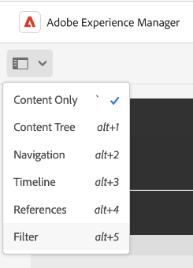

# Aanbevolen werkwijzen voor zoeken in AEM Assets

[!DNL Adobe Experience Manager Assets] biedt robuuste methoden voor het zoeken naar elementen waarmee u een hogere snelheid van de inhoud kunt bereiken. Soms kan het lastig en tijdrovend zijn om het juiste middel te vinden. Zoekmiddelen in [!DNL Adobe Experience Manager Assets] is van cruciaal belang voor het gebruik van een systeem voor het beheer van digitale activa - of het nu gaat om verder gebruik door de creatieve sector, voor een robuust beheer van activa door de zakelijke gebruikers en marketeers, of voor beheer door DAM-beheerders.

Dit Help-document bevat AEM best practices voor zoeken met behulp van verschillende scenario&#39;s om AEM gebruikers te helpen bij het uitvoeren van basiszoekopdrachten op een geavanceerd niveau.

## Zoeken naar Experience Managers openen {#access-experience-manager-search}

Hieronder volgen de basisstappen die u in Experience Manager moet uitvoeren voordat u begint met zoeken:

* In de **Admin-weergave**Ga naar Middelen > Bestanden in Experience Manager en klik op het zoekpictogram op de bovenste balk. U kunt ook een slash (/) gebruiken om het veld Universeel zoeken te openen.
In de **Weergave Elementen**, is de zoekbalk bovenaan zichtbaar en is rechtstreeks toegankelijk.
* `Location:Assets` en `Path:/content/dam` zijn geselecteerd om het zoekbereik te beperken tot uw Experience Manager Assets-opslagplaats. Als u naar een andere map navigeert, `Path:/content/dam/<folder name>` wordt weergegeven in het veld Universeel zoeken om het zoekbereik te beperken tot de huidige map.

## Standaardzoekopdracht {#basic-search}

**Scenario 1: Een basiszoekopdracht uitvoeren met een `classic car` als het zoekwoord.**

De trefwoordzoekopdracht is niet hoofdlettergevoelig en bestaat uit een zoekopdracht in volledige tekst in de metagegevensvelden die in het element zijn opgenomen *volledige tekst zoeken* index (configureerbaar in de indexdefinitie). Als meer dan één sleutelwoord wordt gebruikt, **AND is de standaardoperator tussen de trefwoorden, en beschouwt een zoekopdracht naar &#39;klassieke auto&#39; dus als &#39;klassieke EN auto&#39;**.

De zoekresultaten die overeenkomen met alle zoektermen in metagegevensvelden worden eerst weergegeven, gevolgd door de zoekresultaten die overeenkomen met een van de zoektermen in de slimme tags. De weergavevolgorde van zoekresultaten is bij benadering:

1. Komt overeen met `Classic Car` in de verschillende metagegevensvelden.
2. Komt overeen met `Classic Car` in slimme tags.
3. Komt overeen met `Classic` of van `Car` in slimme tags.

Opgeven `classic car` als zoekwoord en klik op Zoeken. U kunt de zoeksuggesties in een vervolgkeuzelijst bekijken terwijl u het trefwoord typt. De onderzoekssuggesties zijn gebaseerd op de inhoud van de onderzoeksindex op uw plaatsing van de Experience Manager. Als u de juiste elementen niet kunt weergeven in het keuzemenu, drukt u op Enter om de lijst met resultaten weer te geven. De resultaten worden gesorteerd op relevantie, beginnend bij de dichtstbijzijnde overeenkomsten.

<!---->

U kunt de zoekopdracht specifieker maken door het trefwoord in dubbele aanhalingstekens (&quot; &quot;) toe te voegen. Deze zoekopdracht bevat alleen Elementen die de opgegeven termen bevatten. De zoekcriteria zien er zo uit - `"classic car"`. De zoekresultaten met beide termen `classic` en `car` worden weergegeven.

<!---->

Als u in het dialoogvenster **[!UICONTROL Assets view]** ook.

>[!VIDEO](https://video.tv.adobe.com/v/3425489)

## Bestanden en mappen {#files-folders}

**Scenario 2: alle bestanden zoeken met de opdracht `classic car` trefwoord in de `automobile` map.**

Met het filter Bestanden en mappen kunt u uw zoekopdracht beperken. Gebruik de opties Bestanden, Mappen of Bestanden en Mappen in de vervolgkeuzelijst op basis van uw vereisten. U kunt kiezen uit Bestanden, Mappen of Bestanden en Mappen in het dialoogvenster **[!UICONTROL Admin view]** alleen. In de **[!UICONTROL Assets view]**, ga naar [!UICONTROL Path] en blader de omslag waar u een onderzoek wilt uitvoeren.

* Gebruik de **[!UICONTROL Files]** als u specifiek naar bestanden moet zoeken op een specifiek pad in de opslagplaats. U hoeft niet naar mappen in het gedefinieerde pad te zoeken.
* Gebruik de **[!UICONTROL Folders]** als u de zoekopdracht wilt beperken tot mappen op een bepaald pad.
* Gebruik de **[!UICONTROL Files and Folders]** als u alle beschikbare middelen op het opgegeven pad in de repository moet doorzoeken.

Voer de volgende stappen uit om dit scenario te bereiken:

1. Opgeven `classic car` als zoekwoord en klik op Zoeken.
2. Klik op Filters en definieer het mappad voor het dialoogvenster `automobile` map. Bijvoorbeeld: `/content/dam/multiple-assets/automobile`
Selecteer de map in het pad en navigeer naar de vereiste map als u in de specifieke map wilt zoeken.
3. Selecteer Bestanden in de vervolgkeuzelijst om alle bestanden met het trefwoord weer te geven `classic car`.

<!---->

>[!VIDEO](https://video.tv.adobe.com/v/3425487)

## Operatoren {#operators}

**Scenario 3: zoeken naar `Classic Car` of `Car` trefwoorden met behulp van verschillende operatorcombinaties om de zoekopdracht te beperken.**

Het bovenstaande scenario uitvoeren in **[!UICONTROL Admin view]** kunt u een combinatie van verschillende operatoren gebruiken om uw zoekervaring te verbeteren. De ondersteunde operatoren zijn:

### AND, operator {#and-operator}

AND operator is de standaardoperator tussen twee trefwoorden in Universeel zoeken. Wanneer u bijvoorbeeld `classic car` in de zoekbalk de resultaten met `classic` en `car` trefwoorden worden standaard in de zoekresultaten weergegeven.

### OR, operator {#or-operator}

Als u specifiek wilt zijn voor de zoekresultaten en een optie wilt opnemen in de zoekresultaten, kunt u de operator OR gebruiken. Bijvoorbeeld de `classic OR car` sleutelwoord verstrekt onderzoeksresultaten van één van beiden van sleutelwoorden in hun meta-gegevens.

### NOT, operator {#not-operator}

Wanneer u resultaten wilt terugwinnen exclusief sommige sleutelwoorden, kunt u de NOT exploitant gebruiken. De operator NOT gebruikt het afbreekstreepje (-) om AEM zoekopdracht te sturen naar wat van de zoekresultaten moet worden uitgesloten. Bijvoorbeeld de `car - classic` zoekquery die metagegevens bevat `car` maar exclusief `classic`.

Op dezelfde manier kun je naar alle auto&#39;s zoeken, maar niet naar jeep. De query ziet er als volgt uit: `car - jeep`. Alle elementen worden weergegeven met metagegevens `car` maar sluit elementen met metagegevens uit `jeep`.

**[!UICONTROL Assets view]** ondersteunt het gebruik van operatoren niet.

## Jokertekens {#wildcards}

Jokertekens worden gebruikt om een of meer tekens in de zoekopdracht te vervangen. Het bovenstaande scenario uitvoeren in **[!UICONTROL Admin view]**, kunt u een combinatie diverse vervangingen gebruiken om uw onderzoekservaring te verbeteren. Er worden twee jokertekens gebruikt om de zoekopdracht uit te voeren - Vraagteken (?) en sterretje (*). Het symbool van het vraagteken wordt gebruikt om één enkel karakter te zoeken, terwijl het asterisksymbool wordt gebruikt om veelvoudige karakters te zoeken.

### Vraagteken (?) {#question-mark}

Het symbool van het vraagteken kan als voorwaardelijke exploitant worden gebruikt om uw onderzoek in Experience Manager te verlichten.

* `car?` de vraag past het woord met één karakter na auto aan. Bijvoorbeeld de winkelwagen.
* `?car` de vraag past het woord met één karakter vóór auto aan. Bijvoorbeeld, litteken.
* `car????` de vraag past het woord met vier karakters na auto aan. Bijvoorbeeld was.

### Sterretje (*) {#asterisk}

Sterretje is een jokertekenoperator die wordt gebruikt om uw zoekopdracht uit te breiden door minder tekens te typen. Wanneer u de begintekens kent van het element waarnaar u zoekt, maar de rest niet kent, kunt u de asteriskoperator in de zoekopdracht gebruiken. Bijvoorbeeld de `*car` de vraag keert alle activa met postfix auto beschikbaar in hun meta-gegevens terug. De resultaten zouden klassieke auto&#39;s, sportauto&#39;s, klassieke en sportwagens kunnen zijn, enzovoort. Hieronder volgen enkele voorbeelden van het gebruik van de asteriskoperator op verschillende manieren:

* `*car*` retourneert alle mogelijke combinaties.
* `car*` retourneert elementen met was, drager, vervoer, enzovoort.
* `*car` retourneert bezittingen met moderne auto&#39;s, sportauto&#39;s enzovoort.

>[!VIDEO](https://video.tv.adobe.com/v/3425488)

**[!UICONTROL Assets view]** ondersteunt het gebruik van jokertekens niet.

## Filters {#filters}

Adobe Experience Manager biedt verschillende zoekfilters waarmee u de zoekopdracht kunt verfijnen en segmenteren met behulp van een bereikquery. Wanneer u niet zeker weet wat de titel of de meta-beschrijving van een element is, kunt u verschillende zoekfilters gebruiken om de zoekopdracht relevanter te maken. U kunt zoekfilters gebruiken met of zonder een trefwoord te typen. Als u het deelvenster Filters in het dialoogvenster **[!UICONTROL Admin view]** klikt u op de knop **GlobalNav** pictogram en selecteer **[!UICONTROL Filters]**. Als u het deelvenster Filters in **[!UICONTROL Assets view]**, klikt u op [!UICONTROL Filters] naast de zoekbalk.

U kunt een of meer filters selecteren om uw zoekopdracht in Adobe Experience Manager te verfijnen.
<!--The following filters are available out of the box for all the users of Experience Manager:

* File Type Search Filters  
* File Size Search Filters 
* Date of Creation 
* Created by 
* Last Modified date 
* Last Modified by 
* Search by Language 
* Search by Status 
* Search based on Orientation 
* Search by Style 
* Search based on insights 
* Search by Adobe Stock 
* Color specific Asset search 
* Content fragment model 
 -->

<!--**Scenario 5: Search for an Asset named 'classic car' in Black color which has either meta description or a similar asset in Japanese language.**  
 
To perform a search on such a requirement, type 'classic car' in the search bar.  Navigate to the filters panel and expand the language search filter drop-down. Type "ja-jp", which represents the Japanese language. Expand the 'Asset Color' filter and select black color or add the hexadecimal code for the black color (#000000).

-->

**Scenario 4: zoek naar niet-gepubliceerde PDF-bestandstypedocumenten met de opdracht `classic car` trefwoord erin.**

Voer de volgende stappen uit in **[!UICONTROL Admin view]**:

1. Type `classic car` in de zoekbalk.
1. Ga naar Filters. Onder [!UICONTROL File Type], uitbreiden [!UICONTROL Documents], verdere uitbreiding [!UICONTROL Word Processing].
1. Selecteren [!UICONTROL PDF].
1. Ga naar [!UICONTROL Status] > [!UICONTROL Publish] > [!UICONTROL Unpublished].

<!---->

Voer de volgende stappen uit in **[!UICONTROL Assets view]**:

1. Type `classic car` in de zoekbalk.
1. Ga naar Filters. Onder [!UICONTROL MIME Type], selecteert u [!UICONTROL PDF].
1. Ga naar [!UICONTROL Asset Status], selecteert u [!UICONTROL All] alle gepubliceerde en niet-gepubliceerde activa op te nemen.

**Scenario 5: alle afbeeldingen behalve PNG zoeken**

Wanneer u niet zeker weet wat de titel of de meta-beschrijving van een element is, kunt u verschillende zoekfilters gebruiken om de zoekopdracht relevanter te maken. Bijvoorbeeld om elementen te zoeken in **[!UICONTROL Admin view]** volgt u de onderstaande stappen:

1. Ga naar zoekfilters.
1. Ga naar Filters. Onder [!UICONTROL File Type], uitbreiden [!UICONTROL Images] en selecteert u [!UICONTROL Web enabled]
1. Schakel PNG uit.

<!---->

Om activa te zoeken gebruikend het vermelde scenario in **[!UICONTROL Assets view]** volgt u de onderstaande stappen:

1. Ga naar zoekfilters.
1. Ga naar Filters. Onder [!UICONTROL MIME Type]selecteert u alle opgegeven MIME-typen, maar deselecteert u PNG.

>[!VIDEO](https://video.tv.adobe.com/v/3425486)

## Geavanceerd zoeken {#advanced-search}

AEM zoekopdracht stelt u in staat complexe zoekopdrachten met minder moeite te maken. Hieronder volgen de verschillende voorbeelden die u helpen bij het maken van complexe zoekopdrachten:

**Scenario 6: Zoeken naar alle documenten in de gegevensopslagruimte van de Experience Manager met `classic car` in hun metagegevens. De inhoud van het document moet `classic car` trefwoord erin.**

Met Adobe Experience Manager kunt u meerdere criteria aan uw zoekopdracht toevoegen. U kunt een combinatie van trefwoorden, operator(s) en filter(s) gebruiken om de zoekresultaten te beperken.

Een zoekopdracht naar scenario 6 uitvoeren:

1. Typ de `classic car` in de zoekbalk.
2. Navigeer naar het deelvenster Filters en selecteer Documenten onder Bestandstype.
3. Verfijn uw zoekopdracht met de jokerteken voor sterretjes. Type `"classic car"` om alle elementen te zoeken die het `classic car` trefwoord.

<!---->

Scenario 6 kan niet worden uitgevoerd in **[!UICONTROL Assets view]** omdat het het gebruik van Wokjes niet steunt.

**Scenario 7: Zoeken naar alle documenten in de gegevensopslagruimte van de Experience Manager waarin de inhoud van het document moet worden opgenomen `car` maar niet `classic`. Dezelfde voorwaarde geldt voor metagegevens van een element.**

Een zoekopdracht uitvoeren naar scenario 7:

Typ de `car - classic` in de zoekbalk. Navigeer naar het deelvenster Filters en selecteer Documenten onder Bestandstype. De prioriteitsvolgorde van de zoekopdracht is gebaseerd op: Prioriteit 1: Metagegevensprioriteit 2: Slimme tags

<!---->

Scenario 7 kan niet worden uitgevoerd in **[!UICONTROL Assets view]** omdat het het gebruik van Wokjes niet steunt.

<!--
**Scenario 9: Search for all images except PNG**

When you are unsure about the title or meta description of an asset, you can use various search filters to make your search more relevant. Follow the steps below:

1. Go to search filters. 
1. Under [!UICONTROL File Type], expand [!UICONTROL Images] and select [!UICONTROL Web enabled]
1. Deselect PNG.

**Method 1:** Go to search bar and type `images - PNG`. All the images appear excluding PNG.

**Method 2:** Go to search filters. Under [!UICONTROL File Type], expand [!UICONTROL Images] > select [!UICONTROL Web enabled] > deselect PNG.

-->

**Scenario 8: Zoeken naar metagegevenstags met jeep met metagegevens**

U kunt specifieke criteria vastleggen met behulp van verschillende zoekfilters. Tag is een trefwoord dat aan een element wordt toegewezen om het element identificeerbaar te maken onder een groot aantal elementen. In dit scenario kunt u bijvoorbeeld zoeken naar elementen met *juweel* -tags. Typ `tags:jeep` in de zoekbalk. Alleen elementen die aan deze criteria voldoen, worden vermeld in de zoekresultaten.

<!---->

Als u in het dialoogvenster **[!UICONTROL Assets view]** ook.

>[!VIDEO](https://video.tv.adobe.com/v/3425490)

**Scenario 9: vergelijkbare overeenkomst zoeken voor rode kleurenauto**

Wanneer u een zoekopdracht uitvoert op AEM, kunt u de resultaten filteren door vergelijkbare elementen weer te geven als de geselecteerde. U kunt de **Gelijkend zoeken** om uw zoekopdracht te beperken tot de exacte of vergelijkbare overeenkomst met het doorzochte element. Op deze manier kunt u gemakkelijker middelen vinden die vergelijkbare slimme tags hebben als het geselecteerde element. Wanneer u bijvoorbeeld naar soortgelijke elementen wilt zoeken, voert u de volgende stappen uit:

1. Zoek het element naar uw wensen.
1. Houd de cursor boven het element > klik op ellips > selecteer [!UICONTROL Find Similar].
of Selecteer het element > navigeer naar de ellips rechtsboven > selecteer [!UICONTROL Find Similar].

   

1. Let op de zoekbalk. De miniatuur van het geselecteerde element verschijnt op de zoekbalk om aan te geven dat u een zoekopdracht wilt uitvoeren. Hierdoor worden elementen met vergelijkbare slimme tags geretourneerd.

Voer de volgende stappen uit in **[!UICONTROL Assets view]**:

1. Zoek het element naar uw wensen.
1. Selecteer de afbeelding > navigeer naar [!UICONTROL Find Similar Image] aan de bovenkant bij navbar.
U gaat naar de verzameling elementen met vergelijkbare kleuren en metagegevens.

## Aangepaste zoekfacetten {#custom-search-facets}

Met zoekfacetten in Adobe Experience Manager kunt u op meerdere manieren zoeken naar elementen in plaats van in één, vooraf bepaalde of taxonomische volgorde. U kunt zoekfacetten aanpassen en voorspelden toevoegen naar wens. Lezen [Zoeken in gezichten](https://experienceleague.adobe.com/docs/experience-manager-cloud-service/content/assets/admin/search-facets.html?lang=en#) voor de geleidelijke gids over het toevoegen van een douane predikaat.

<!--**Scenario 10: Search assets based on Sku ID**
to be added later
-->

**Scenario 10: Specifieke elementen zoeken op basis van de datum waarop ze voor het laatst zijn gewijzigd of verlopen**

Met datumbeperkingen kunt u uw aangepaste zoekopdracht beperken tot een bepaalde periode, bijvoorbeeld met de zoekfilters voor de tijdsperiode. Als u naar bovenstaande vereiste wilt zoeken, typt u `classic car` in de zoekbalk. Selecteer het datumbereik in het dialoogvenster [!UICONTROL Created Date] en [!UICONTROL Last Modified] datumfilters.

Als u in het dialoogvenster [!UICONTROL Assets view] ook.

## De relevantie van trefwoorden vergroten {#boosting-keywords}

U kunt de relevantie van trefwoorden voor bepaalde elementen verbeteren om zoekopdrachten op basis van trefwoorden te stimuleren. Met andere woorden, de afbeeldingen waarvoor u specifieke trefwoorden promoot, worden boven aan de zoekresultaten weergegeven wanneer u op basis van deze trefwoorden zoekt.

1. Open vanuit de gebruikersinterface Assets de pagina met eigenschappen voor de asset. Klikken [!UICONTROL Advanced] en klik op [!UICONTROL Add] krachtens [!UICONTROL Elevate for search keywords].
2. Geef in het vak Zoeken bevorderen een trefwoord op waarvoor u de zoekopdracht naar de afbeelding wilt opvoeren en klik vervolgens op [!UICONTROL Add]. U kunt meerdere trefwoorden op dezelfde manier opgeven.
3. Klik op [!UICONTROL Save & Close]. Het element dat u voor dit trefwoord hebt gepromoot, wordt weergegeven in de beste zoekresultaten.

## Noteerbare dingen bij het uitvoeren van een zoekopdracht in Experience Manager {#notable-things}

* Geef metagegevens van het middel op om het middel voor te bereiden waarop kan worden gezocht met het universeel zoekalgoritme. Controleer of de metagegevens van het element zijn bijgewerkt.
* Gebruik dubbele aanhalingstekens (&quot; &quot;) om de zoekopdracht precies en op het punt te plaatsen.
* Controleer het pad waarnaar u zoekt. Selecteer de gewenste optie in de map, het bestand of het bestand en de map om de zoekopdracht op de juiste locatie uit te voeren.
* U kunt de filters controleren die u op uw onderzoek op de Universele bar van het Onderzoek toepast.
* Als u geen resultaten krijgt, controleert u het pad dat u zoekt. Controleer ook de map waaruit u de zoekopdracht uitvoert. Als u bijvoorbeeld een zoekopdracht uitvoert in de map &#39;Automobile&#39; maar het trefwoord dat u gebruikt, is gerelateerd aan &#39;Apparels&#39;, zijn de zoekresultaten niet geschikt.
* Schakel deze optie in als u witruimte hebt toegevoegd vóór het trefwoord waarnaar u zoekt.
* Door trefwoorden, operatoren en filters met elkaar te combineren, kunt u de zoekervaring gemakkelijker en op een hoger niveau brengen.

<!--
* Use stemming search approach while searching for the asset. It means using an exact keyword that you are looking for.
* Specify Smart tags to the asset properties to boost the ranking of the search results.
The newly added assets are not indexed.
-->

## Verschillen tussen [!UICONTROL Admin view] en [!UICONTROL Assets view] Zoeken {#differences-asset-and-admin-view}

<table>
    <tr>
        <th> Parameters </th>
        <th> Admin-weergave </th>
        <th> Weergave Elementen </th>
    </tr>
    <tr>
        <td> Aangepaste facetten </td>
        <td> U kunt <a href="https://experienceleague.adobe.com/docs/experience-manager-cloud-service/content/assets/admin/search-facets.html?lang=en">aangepaste zoekfacetten volgens de vereiste.</td>
        <td> De aangepaste facetten worden gedeeltelijk ondersteund in de weergave Elementen. De ondersteunde facetten zijn:
            <ul>
            <li> Voorspelde labels
            <li> Naam
            <li> Voorspelde betrouwbaarheid van tags
            <li> Elementgrootte
            <li> Titel
            </ul>
        </td>
    </tr>
    <tr>
        <td> Operatoren </td>
        <td> Ondersteuning AND, OR en NOT </td>
        <td> Niet ondersteund </td>
    </tr>
    <tr>
        <td> Jokertekens </td>
        <td> Ondersteunt vraagteken (?) en sterretje (*)</td>
        <td> Niet ondersteund </td>
    </tr>
    <tr>
        <td> Zoekresultaten verhogen </td>
        <td> Ondersteund </td>
        <td> Niet ondersteund </td>
    </tr>
     <tr>
        <td> Alle filters tegelijk wissen </td>
        <td> Niet ondersteund </td>
        <td> Ondersteund</td>
    </tr>
     <tr>
        <td> Bestanden/mappen/bestanden en mappen </td>
        <td> Ondersteund </td>
        <td> Een optie voor het selecteren van een map is beschikbaar onder Bestandstype </td>
    </tr>
     <tr>
        <td> Status van element </td>
        <td> 
            Ondersteunde opties zijn:
            <ul>
            <li> Publiceren
            <li> Gepubliceerde datum
            <li> Laatst gepubliceerd door
            <li> Goedkeuring 
            <li> Afhandeling
            <li> Vervaldatum
            <li> Dynamic Media
            </ul>
        </td>
        <td>
        Ondersteunde opties zijn:
            <ul>
            <li> Alles
            <li> Goedgekeurd
            <li> Geweigerd
            <li> Geen status
            </ul> 
        </td>
    </tr>
     <tr>
        <td> Bestandstype </td>
        <td>
        Ondersteunde opties zijn:
            <ul>
            <li> Afbeeldingen
            <li> Documenten
            <li> Multimedia
            <li> Archieven 
            </ul>
            Deze hebben nog meer hiërarchische opties.
        </td>
        <td>
        Ondersteunde opties zijn:
            <ul>
            <li> Afbeeldingen
            <li> Documenten
            <li> Video
            <li> Map 
            </ul> 
        Meer opties worden weergegeven onder MIME-type.
        </td>
    </tr>
     <tr>
        <td> Bestandsgrootte </td>
        <td>
        Ondersteunde opties zijn:
            <ul>
            <li> Van - naar
            <li> Grootte (bytes, kB, MB, GB)
            </ul> 
        </td>
        <td> Niet ondersteund </td>
    </tr>
     <tr>
        <td> Overige filters </td>
        <td>
            <ul>
            <li> Taal
            <li> Status
            <li> Afdrukstand
            <li> Stijl 
            <li> Inzichten
            <li> Voorraad
            <li> Elementkleur
            <li> Inhoudsfragmentmodel
            </ul> 
        </td>
        <td> Niet ondersteund </td>
    </tr>
</table>

>[!MORELIKETHIS]
>
>* [Assets doorzoeken](https://experienceleague.adobe.com/docs/experience-manager-cloud-service/content/assets/manage/search-assets.html?lang=en)
>* [Facetten doorzoeken](https://experienceleague.adobe.com/docs/experience-manager-cloud-service/content/assets/admin/search-facets.html?lang=en)
