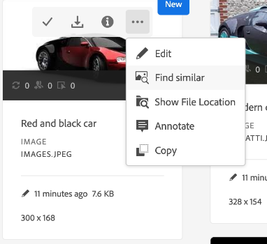
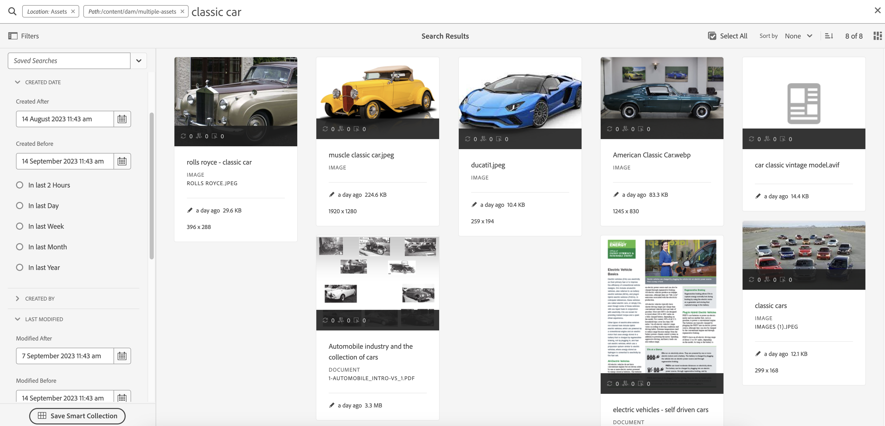

# Aanbevolen werkwijzen voor zoeken in AEM Assets

| [ Beste praktijken van Meta-gegevens ](/help/assets/metadata-best-practices.md) | [ Content Hub ](/help/assets/product-overview.md) | [ Dynamic Media met mogelijkheden OpenAPI ](/help/assets/dynamic-media-open-apis-overview.md) | [ de ontwikkelaarsdocumentatie van AEM Assets ](https://developer.adobe.com/experience-cloud/experience-manager-apis/) |
| --------------------------- |---------|----|-----|

[!DNL Adobe Experience Manager Assets] biedt robuuste methoden voor het zoeken naar elementen waarmee u een hogere snelheid van de inhoud kunt bereiken. Soms kan het lastig en tijdrovend zijn om het juiste middel te vinden. Zoekmiddelen in [!DNL Adobe Experience Manager Assets] zijn dan ook van cruciaal belang voor het gebruik van een digitaal assetmanagementsysteem - of het nu gaat om verder gebruik door creatieve klanten, voor een robuust beheer van bedrijfsmiddelen door zakelijke gebruikers en marketers of voor beheer door DAM-beheerders.

Dit Help-document bevat AEM best practices voor zoeken met behulp van verschillende scenario&#39;s om AEM gebruikers te helpen bij het uitvoeren van basiszoekopdrachten op een geavanceerd niveau.

## Zoeken naar Experience Managers openen {#access-experience-manager-search}

Hieronder volgen de basisstappen die u in Experience Manager moet uitvoeren voordat u begint met zoeken:

* In de **mening Admin**, ga naar Assets > Dossiers in Experience Manager en klik het onderzoekspictogram op de hoogste bar. U kunt ook een slash (/) gebruiken om het veld Universeel zoeken te openen.
In de **mening van Assets**, is de onderzoeksbar zichtbaar op de bovenkant en kan direct worden betreden.
* `Location:Assets` en `Path:/content/dam` zijn vooraf geselecteerd om het zoekbereik te beperken tot uw Experience Manager Assets-opslagplaats. Als u naar een andere map navigeert, wordt in `Path:/content/dam/<folder name>` in het veld Universeel zoeken weergegeven om het zoekbereik te beperken tot de huidige map.

## Standaardzoekopdracht {#basic-search}

**Scenario 1: Voer een basisonderzoek uit gebruikend a `classic car` als onderzoekssleutelwoord.**

Het sleutelwoordonderzoek is niet case-sensitive en is een full-text onderzoek over de meta-gegevensgebieden die in het volledige de tekstonderzoek van Activa *index van 0} inbegrepen zijn (configureerbaar in de indexdefinitie).* Als meer dan één sleutelwoord wordt gebruikt, **EN is de standaardexploitant tussen de sleutelwoorden, aldus, overweegt het een onderzoek naar &quot;klassieke auto&quot;om &quot;klassieke EN auto&quot;te zijn**.

De zoekresultaten die overeenkomen met alle zoektermen in metagegevensvelden worden eerst weergegeven, gevolgd door de zoekresultaten die overeenkomen met een van de zoektermen in de slimme tags. De weergavevolgorde van zoekresultaten is bij benadering:

1. Komt overeen met `Classic Car` in de verschillende metagegevensvelden.
2. Komt overeen met `Classic Car` in slimme tags.
3. Komt overeen met `Classic` of `Car` in slimme tags.

Geef `classic car` op als zoektrefwoord en klik op Zoeken. U kunt de zoeksuggesties in een vervolgkeuzelijst bekijken terwijl u het trefwoord typt. De onderzoekssuggesties zijn gebaseerd op de inhoud van de onderzoeksindex op uw plaatsing van de Experience Manager. Als u de juiste elementen niet kunt weergeven in het keuzemenu, drukt u op Enter om de lijst met resultaten weer te geven. De resultaten worden gesorteerd op relevantie, beginnend bij de dichtstbijzijnde overeenkomsten.

<!---->

U kunt de zoekopdracht specifieker maken door het trefwoord in dubbele aanhalingstekens (&quot; &quot;) toe te voegen. Deze zoekopdracht omvat alleen Assets die de opgegeven termen samen bevatten. De zoekcriteria zien er als volgt uit: `"classic car"` . Daarom worden de zoekresultaten met zowel de termen `classic` als `car` weergegeven.

<!---->

De zoekopdracht geeft vergelijkbare resultaten als u ook in de **[!UICONTROL Assets view]** werkt.

>[!VIDEO](https://video.tv.adobe.com/v/3425489)

## Bestanden en mappen {#files-folders}

**Scenario 2: Onderzoek naar alle dossiers die het `classic car` sleutelwoord binnen de `automobile` omslag gebruiken.**

Met het filter Bestanden en mappen kunt u uw zoekopdracht beperken. Gebruik de opties Bestanden, Mappen of Bestanden en Mappen in de vervolgkeuzelijst op basis van uw vereisten. De optie om te kiezen uit Bestanden, Mappen of Bestanden en Mappen is alleen beschikbaar in de **[!UICONTROL Admin view]** . Ga in **[!UICONTROL Assets view]** naar [!UICONTROL Path] en blader naar de map waarin u een zoekopdracht wilt uitvoeren.

* Gebruik de optie **[!UICONTROL Files]** wanneer u specifiek naar bestanden moet zoeken op een specifiek pad in de opslagplaats. U hoeft niet naar mappen in het gedefinieerde pad te zoeken.
* Gebruik de optie **[!UICONTROL Folders]** als u de zoekopdracht wilt beperken tot mappen op een bepaald pad.
* Gebruik de optie **[!UICONTROL Files and Folders]** als u alle beschikbare middelen op het opgegeven pad in de opslagplaats moet doorzoeken.

Voer de volgende stappen uit om dit scenario te bereiken:

1. Geef `classic car` op als zoektrefwoord en klik op Zoeken.
2. Klik op Filters en definieer het mappad voor de map `automobile` . Bijvoorbeeld: `/content/dam/multiple-assets/automobile`
Selecteer de map in het pad en navigeer naar de vereiste map als u in de specifieke map wilt zoeken.
3. Selecteer Bestanden in de vervolgkeuzelijst om alle bestanden met het trefwoord `classic car` weer te geven.

<!---->

>[!VIDEO](https://video.tv.adobe.com/v/3425487)

## Operatoren {#operators}

**Scenario 3: Onderzoek naar `Classic Car` of `Car` sleutelwoorden die diverse exploitantcombinaties gebruiken om uw onderzoek te versmallen.**

Als u het bovenstaande scenario in **[!UICONTROL Admin view]** wilt uitvoeren, kunt u een combinatie van verschillende operatoren gebruiken om uw zoekervaring te verbeteren. De ondersteunde operatoren zijn:

### AND, operator {#and-operator}

AND operator is de standaardoperator tussen twee trefwoorden in Universeel zoeken. Wanneer u bijvoorbeeld `classic car` in de zoekbalk typt, worden de resultaten met `classic` - en `car` -trefwoorden standaard in de zoekresultaten weergegeven.

### OR, operator {#or-operator}

Als u specifiek wilt zijn voor de zoekresultaten en een optie wilt opnemen in de zoekresultaten, kunt u de operator OR gebruiken. Het trefwoord `classic OR car` biedt bijvoorbeeld zoekresultaten met de twee trefwoorden in de metagegevens.

### NOT, operator {#not-operator}

Wanneer u resultaten wilt terugwinnen exclusief sommige sleutelwoorden, kunt u de NOT exploitant gebruiken. De operator NOT gebruikt het afbreekstreepje (-) om AEM zoekopdracht te sturen naar wat van de zoekresultaten moet worden uitgesloten. De zoekquery van `car - classic` die bijvoorbeeld metagegevens opgeeft die `car` bevatten maar `classic` niet.

Op dezelfde manier kun je naar alle auto&#39;s zoeken, maar niet naar jeep. De query ziet er als volgt uit: `car - jeep`. Alle elementen worden weergegeven met metagegevens `car` , maar elementen met metagegevens `jeep` worden uitgesloten.

**[!UICONTROL Assets view]** biedt geen ondersteuning voor het gebruik van operatoren.

## Jokertekens {#wildcards}

Jokertekens worden gebruikt om een of meer tekens in de zoekopdracht te vervangen. Om het bovenstaande scenario in **[!UICONTROL Admin view]** uit te voeren, kunt u een combinatie diverse vervangingen gebruiken om uw onderzoekservaring te verbeteren. Er worden twee jokertekens gebruikt om de zoekopdracht uit te voeren - Vraagteken (?) en sterretje (*). Het symbool van het vraagteken wordt gebruikt om één enkel karakter te zoeken, terwijl het asterisksymbool wordt gebruikt om veelvoudige karakters te zoeken.

### Vraagteken (?) {#question-mark}

Het symbool van het vraagteken kan als voorwaardelijke exploitant worden gebruikt om uw onderzoek in Experience Manager te verlichten.

* `car?` -query komt overeen met het woord met één teken na de auto. Bijvoorbeeld de winkelwagen.
* `?car` -query komt overeen met het woord met één teken vóór de auto. Bijvoorbeeld, litteken.
* `car????` -query komt overeen met het woord met vier tekens na de auto. Bijvoorbeeld was.

### Sterretje (*) {#asterisk}

Sterretje is een jokertekenoperator die wordt gebruikt om uw zoekopdracht uit te breiden door minder tekens te typen. Wanneer u de begintekens kent van het element waarnaar u zoekt, maar de rest niet kent, kunt u de asteriskoperator in de zoekopdracht gebruiken. De query `*car` retourneert bijvoorbeeld alle elementen met postfix-auto beschikbaar in de metagegevens. De resultaten zouden klassieke auto&#39;s, sportauto&#39;s, klassieke en sportwagens kunnen zijn, enzovoort. Hieronder volgen enkele voorbeelden van het gebruik van de asteriskoperator op verschillende manieren:

* `*car*` retourneert alle mogelijke combinaties.
* `car*` retourneert elementen met was, drager, vervoer, enzovoort.
* `*car` retourneert elementen met moderne auto&#39;s, sportauto&#39;s enzovoort.

>[!VIDEO](https://video.tv.adobe.com/v/3425488)

**[!UICONTROL Assets view]** ondersteunt het gebruik van jokertekens niet.

## Filters {#filters}

Adobe Experience Manager biedt verschillende zoekfilters waarmee u de zoekopdracht kunt verfijnen en segmenteren met behulp van een bereikquery. Wanneer u niet zeker weet wat de titel of de meta-beschrijving van een element is, kunt u verschillende zoekfilters gebruiken om de zoekopdracht relevanter te maken. U kunt zoekfilters gebruiken met of zonder een trefwoord te typen. Om het filterenpaneel in **[!UICONTROL Admin view]** te openen, klik het **GlobalNav** pictogram en selecteer **[!UICONTROL Filters]**. Als u het deelvenster Filters in **[!UICONTROL Assets view]** wilt openen, klikt u op [!UICONTROL Filters] naast de zoekbalk.

U kunt een of meer filters selecteren om uw zoekopdracht in Adobe Experience Manager te verfijnen.
<!--The following filters are available out of the box for all the users of Experience Manager:

* File Type Search Filters  
* File Size Search Filters 
* Date of Creation 
* Created by 
* Last Modified date 
* Last Modified by 
* Search by Language 
* Search by Status 
* Search based on Orientation 
* Search by Style 
* Search based on insights 
* Search by Adobe Stock 
* Color specific Asset search 
* Content fragment model 
 -->

<!--**Scenario 5: Search for an Asset named 'classic car' in Black color which has either meta description or a similar asset in Japanese language.**  
 
To perform a search on such a requirement, type 'classic car' in the search bar.  Navigate to the filters panel and expand the language search filter drop-down. Type "ja-jp", which represents the Japanese language. Expand the 'Asset Color' filter and select black color or add the hexadecimal code for the black color (#000000).

-->

**Scenario 4: Onderzoek naar unpublished het dossiertype van PDF documenten met het `classic car` sleutelwoord in het.**

Voer de volgende stappen uit in **[!UICONTROL Admin view]** :

1. Typ `classic car` in de zoekbalk.
1. Ga naar Filters. Vouw [!UICONTROL Documents] onder [!UICONTROL File Type] verder uit [!UICONTROL Word Processing] .
1. Selecteer [!UICONTROL PDF] .
1. Ga naar [!UICONTROL Status] > [!UICONTROL Publish] > [!UICONTROL Unpublished] .

<!---->

Voer de volgende stappen uit in **[!UICONTROL Assets view]** :

1. Typ `classic car` in de zoekbalk.
1. Ga naar Filters. Selecteer onder [!UICONTROL MIME Type] de optie [!UICONTROL PDF] .
1. Ga naar [!UICONTROL Asset Status] en selecteer [!UICONTROL All] om alle gepubliceerde en niet-gepubliceerde elementen op te nemen.

**Scenario 5: Onderzoek naar alle beelden behalve PNG**

Wanneer u niet zeker weet wat de titel of de meta-beschrijving van een element is, kunt u verschillende zoekfilters gebruiken om de zoekopdracht relevanter te maken. Als u bijvoorbeeld elementen wilt zoeken in **[!UICONTROL Admin view]** , voert u de volgende stappen uit:

1. Ga naar zoekfilters.
1. Ga naar Filters. Vouw [!UICONTROL Images] uit onder [!UICONTROL File Type] en selecteer [!UICONTROL Web enabled]
1. Schakel PNG uit.

<!---->

Voer de volgende stappen uit om elementen te zoeken met behulp van het vermelde scenario in **[!UICONTROL Assets view]** :

1. Ga naar zoekfilters.
1. Ga naar Filters. Selecteer onder [!UICONTROL MIME Type] alle opgegeven MIME-typen, maar hef de selectie van PNG op.

>[!VIDEO](https://video.tv.adobe.com/v/3425486)

## Geavanceerd zoeken {#advanced-search}

AEM zoekopdracht stelt u in staat complexe zoekopdrachten met minder moeite te maken. Hieronder volgen de verschillende voorbeelden die u helpen bij het maken van complexe zoekopdrachten:

**Scenario 6: Onderzoek naar alle documenten in de bewaarplaats van de Experience Manager met `classic car` in hun meta-gegevens. De inhoud van het document moet daarin `classic car` trefwoord bevatten.**

Met Adobe Experience Manager kunt u meerdere criteria aan uw zoekopdracht toevoegen. U kunt een combinatie van trefwoorden, operator(s) en filter(s) gebruiken om de zoekresultaten te beperken.

Een zoekopdracht naar scenario 6 uitvoeren:

1. Typ het trefwoord `classic car` in de zoekbalk.
2. Navigeer naar het deelvenster Filters en selecteer Documenten onder Bestandstype.
3. Verfijn uw zoekopdracht met de jokerteken voor sterretjes. Typ `"classic car"` om te zoeken in alle elementen die het trefwoord `classic car` bevatten.

<!---->

Scenario 6 kan niet worden uitgevoerd in **[!UICONTROL Assets view]** omdat het het gebruik van jokertekens niet ondersteunt.

**Scenario 7: Onderzoek naar alle documenten in de bewaarplaats van de Experience Manager waarin de inhoud van het document `car` moet omvatten maar `classic` uitsluiten. De zelfde voorwaarde is op meta-gegevens van een activa van toepassing.**

Een zoekopdracht uitvoeren naar scenario 7:

Typ het trefwoord `car - classic` in de zoekbalk. Navigeer naar het deelvenster Filters en selecteer Documenten onder Bestandstype. De prioritaire orde van onderzoek is gebaseerd op het volgende:
Prioriteit 1: Metagegevens
Prioriteit 2: Slimme tags

<!---->

Scenario 7 kan niet worden uitgevoerd in **[!UICONTROL Assets view]** omdat dit het gebruik van jokertekens niet ondersteunt.

<!--
**Scenario 9: Search for all images except PNG**

When you are unsure about the title or meta description of an asset, you can use various search filters to make your search more relevant. Follow the steps below:

1. Go to search filters. 
1. Under [!UICONTROL File Type], expand [!UICONTROL Images] and select [!UICONTROL Web enabled]
1. Deselect PNG.

**Method 1:** Go to search bar and type `images - PNG`. All the images appear excluding PNG.

**Method 2:** Go to search filters. Under [!UICONTROL File Type], expand [!UICONTROL Images] > select [!UICONTROL Web enabled] > deselect PNG.

-->

**Scenario 8: Onderzoek naar meta-gegevensmarkeringen met meta-gegevensjeep**

U kunt specifieke criteria vastleggen met behulp van verschillende zoekfilters. Tag is een trefwoord dat aan een element wordt toegewezen om het element identificeerbaar te maken onder een groot aantal elementen. Bijvoorbeeld, in dit scenario, onderzoek naar activa met *jeep* markeringen in het. Typ hiervoor `tags:jeep` in de zoekbalk. Alleen elementen die aan deze criteria voldoen, worden vermeld in de zoekresultaten.

<!---->

De zoekopdracht geeft vergelijkbare resultaten als u ook in de **[!UICONTROL Assets view]** werkt.

>[!VIDEO](https://video.tv.adobe.com/v/3425490)

**Scenario 9: Vind gelijkaardige gelijke gelijke voor rode kleurenauto**

Wanneer u een zoekopdracht uitvoert op AEM, kunt u de resultaten filteren door vergelijkbare elementen weer te geven als de geselecteerde. U kunt de **Vondst Vergelijkbare** optie gebruiken om uw onderzoek tot de nauwkeurige of gelijkaardige gelijke van de gezochte Activa te beperken. Op deze manier kunt u gemakkelijker middelen vinden die vergelijkbare slimme tags hebben als het geselecteerde element. Wanneer u bijvoorbeeld naar soortgelijke elementen wilt zoeken, voert u de volgende stappen uit:

1. Zoek het element naar uw wensen.
1. Houd de cursor boven het element > klik op ellips > selecteer [!UICONTROL Find Similar] .
of
Selecteer het element > navigeer naar de ellips rechtsboven > selecteer [!UICONTROL Find Similar] .

   

1. Let op de zoekbalk. De miniatuur van het geselecteerde element verschijnt op de zoekbalk om aan te geven dat u een zoekopdracht wilt uitvoeren. Hierdoor worden elementen met vergelijkbare slimme tags geretourneerd.

Voer de volgende stappen uit in **[!UICONTROL Assets view]** :

1. Zoek het element naar uw wensen.
1. Selecteer de afbeelding > navigeer naar de optie [!UICONTROL Find Similar Image] op de navigatiebalk bovenaan.
U gaat naar de verzameling elementen met vergelijkbare kleuren en metagegevens.

## Aangepaste zoekfacetten {#custom-search-facets}

Met zoekfacetten in Adobe Experience Manager kunt u op meerdere manieren zoeken naar elementen in plaats van in één, vooraf bepaalde of taxonomische volgorde. U kunt zoekfacetten aanpassen en voorspelden toevoegen naar wens. Lees [ Facetten van het Onderzoek ](https://experienceleague.adobe.com/docs/experience-manager-cloud-service/content/assets/admin/search-facets.html?lang=en#) voor de geleidelijke gids over het toevoegen van een douane predikaat.

<!--**Scenario 10: Search assets based on Sku ID**
to be added later
-->

**Scenario 10: Onderzoek specifieke activa die op hun laatste gewijzigde of vervaldatum worden gebaseerd**

Met datumbeperkingen kunt u uw aangepaste zoekopdracht beperken tot een bepaalde periode, bijvoorbeeld met de zoekfilters voor de tijdsperiode. Typ `classic car` in de zoekbalk om naar de bovenstaande vereiste te zoeken. Selecteer het datumbereik in de datumfilters [!UICONTROL Created Date] en [!UICONTROL Last Modified] .

De zoekopdracht geeft vergelijkbare resultaten als u ook in de [!UICONTROL Assets view] werkt.

## De relevantie van trefwoorden vergroten {#boosting-keywords}

U kunt de relevantie van trefwoorden voor bepaalde elementen verbeteren om zoekopdrachten op basis van trefwoorden te stimuleren. Met andere woorden, de afbeeldingen waarvoor u specifieke trefwoorden promoot, worden boven aan de zoekresultaten weergegeven wanneer u op basis van deze trefwoorden zoekt.

1. Open vanuit de gebruikersinterface Assets de pagina met eigenschappen voor de asset. Klik op [!UICONTROL Advanced] en klik op [!UICONTROL Add] onder [!UICONTROL Elevate for search keywords] .
2. Geef in het vak Zoeken bevorderen een trefwoord op waarvoor u de zoekopdracht naar de afbeelding wilt opvoeren en klik vervolgens op [!UICONTROL Add] . U kunt meerdere trefwoorden op dezelfde manier opgeven.
3. Klik op [!UICONTROL Save & Close]. Het element dat u voor dit trefwoord hebt gepromoot, wordt weergegeven in de beste zoekresultaten.

## Noteerbare dingen bij het uitvoeren van een zoekopdracht in Experience Manager {#notable-things}

* Geef metagegevens van het middel op om het middel voor te bereiden waarop kan worden gezocht met het universeel zoekalgoritme. Controleer of de metagegevens van het element zijn bijgewerkt.
* Gebruik dubbele aanhalingstekens (&quot; &quot;) om de zoekopdracht precies en op het punt te plaatsen.
* Controleer het pad waarnaar u zoekt. Selecteer de gewenste optie in de map, het bestand of het bestand en de map om de zoekopdracht op de juiste locatie uit te voeren.
* U kunt de filters controleren die u op uw onderzoek op de Universele bar van het Onderzoek toepast.
* Als u geen resultaten krijgt, controleert u het pad dat u zoekt. Controleer ook de map waaruit u de zoekopdracht uitvoert. Als u bijvoorbeeld een zoekopdracht uitvoert in de map &#39;Automobile&#39; maar het trefwoord dat u gebruikt, is gerelateerd aan &#39;Apparels&#39;, zijn de zoekresultaten niet geschikt.
* Schakel deze optie in als u witruimte hebt toegevoegd vóór het trefwoord waarnaar u zoekt.
* Door trefwoorden, operatoren en filters met elkaar te combineren, kunt u de zoekervaring gemakkelijker en op een hoger niveau brengen.

<!--
* Use stemming search approach while searching for the asset. It means using an exact keyword that you are looking for.
* Specify Smart tags to the asset properties to boost the ranking of the search results.
The newly added assets are not indexed.
-->

## Verschillen tussen [!UICONTROL Admin view] en [!UICONTROL Assets view] Zoeken {#differences-asset-and-admin-view}

<table>
    <tr>
        <th> Parameters </th>
        <th> Admin-weergave </th>
        <th> Assets View </th>
    </tr>
    <tr>
        <td> Aangepaste facetten </td>
        <td> U kunt <a href="https://experienceleague.adobe.com/docs/experience-manager-cloud-service/content/assets/admin/search-facets.html?lang=en"> facetten van het douaneonderzoek toevoegen zoals door het vereiste.</td>
        <td> De aangepaste facetten worden gedeeltelijk ondersteund in de Assets-weergave. De ondersteunde facetten zijn:
            <ul>
            <li> Voorspelde labels
            <li> Naam
            <li> Voorspelde betrouwbaarheid van tags
            <li> Elementgrootte
            <li> Titel
            </ul>
        </td>
    </tr>
    <tr>
        <td> Operatoren </td>
        <td> Ondersteuning AND, OR en NOT </td>
        <td> Niet ondersteund </td>
    </tr>
    <tr>
        <td> Jokertekens </td>
        <td> Ondersteunt vraagteken (?) en sterretje (*)</td>
        <td> Niet ondersteund </td>
    </tr>
    <tr>
        <td> Zoekresultaten verhogen </td>
        <td> Ondersteund </td>
        <td> Niet ondersteund </td>
    </tr>
     <tr>
        <td> Alle filters tegelijk wissen </td>
        <td> Niet ondersteund </td>
        <td> Ondersteund</td>
    </tr>
     <tr>
        <td> Bestanden/mappen/bestanden en mappen </td>
        <td> Ondersteund </td>
        <td> Een optie voor het selecteren van een map is beschikbaar onder Bestandstype </td>
    </tr>
     <tr>
        <td> Status van element </td>
        <td> 
            Ondersteunde opties zijn:
            <ul>
            <li> Publish
            <li> Gepubliceerde datum
            <li> Laatst gepubliceerd door
            <li> Goedkeuring 
            <li> Afhandeling
            <li> Vervaldatum
            <li> Dynamic Media
            </ul>
        </td>
        <td>
        Ondersteunde opties zijn:
            <ul>
            <li> Alles
            <li> Goedgekeurd
            <li> Geweigerd
            <li> Geen status
            </ul> 
        </td>
    </tr>
     <tr>
        <td> Bestandstype </td>
        <td>
        Ondersteunde opties zijn:
            <ul>
            <li> Afbeeldingen
            <li> Documenten
            <li> Multimedia
            <li> Archieven 
            </ul>
            Deze hebben nog meer hiërarchische opties.
        </td>
        <td>
        Ondersteunde opties zijn:
            <ul>
            <li> Afbeeldingen
            <li> Documenten
            <li> Video
            <li> Map 
            </ul> 
        Meer opties worden weergegeven onder MIME-type.
        </td>
    </tr>
     <tr>
        <td> Bestandsgrootte </td>
        <td>
        Ondersteunde opties zijn:
            <ul>
            <li> Van - naar
            <li> Grootte (bytes, kB, MB, GB)
            </ul> 
        </td>
        <td> Niet ondersteund </td>
    </tr>
     <tr>
        <td> Overige filters </td>
        <td>
            <ul>
            <li> Taal
            <li> Status
            <li> Afdrukstand
            <li> Stijl 
            <li> Inzichten
            <li> Voorraad
            <li> Elementkleur
            <li> Inhoudsfragmentmodel
            </ul> 
        </td>
        <td> Niet ondersteund </td>
    </tr>
</table>

>[!MORELIKETHIS]
>
>* [Assets doorzoeken](https://experienceleague.adobe.com/docs/experience-manager-cloud-service/content/assets/manage/search-assets.html?lang=en)
>* [Facetten doorzoeken](https://experienceleague.adobe.com/docs/experience-manager-cloud-service/content/assets/admin/search-facets.html?lang=en)
