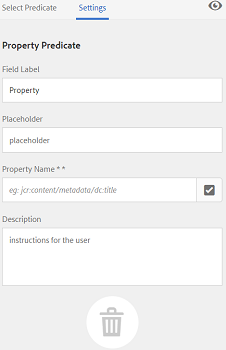
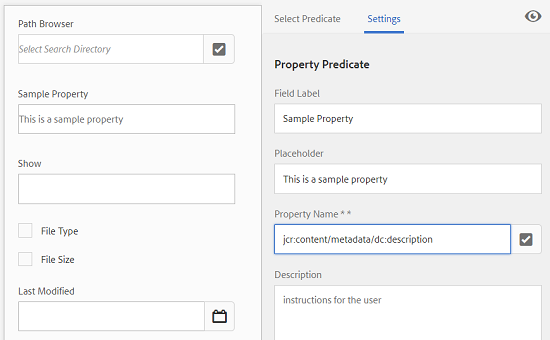

# Facetten doorzoeken {#search-facets}

Leer hoe u zoekfacetten in AEM maakt, wijzigt en gebruikt.

Een bedrijfsbrede implementatie van Adobe Experience Manager (AEM)-middelen biedt de mogelijkheid om veel middelen op te slaan. Soms kan het lastig en tijdrovend zijn om het juiste middel te vinden als u alleen de algemene zoekmogelijkheden van AEM gebruikt.

Gebruik zoekfacetten in het deelvenster Filters om de zoekervaring gedetailleerder te maken en de zoekfunctionaliteit efficiënter en veelzijdiger te maken. De facetten van het onderzoek voegen veelvoudige afmetingen (predikaten) toe die u toelaten om complexere onderzoeken uit te voeren. Het deelvenster Filters bevat een aantal standaardfacetten. U kunt ook aangepaste zoekfacetten toevoegen.

Samengevat kunt u met zoekfacetten op verschillende manieren naar elementen zoeken in plaats van in één, vooraf bepaalde, taxonomische volgorde. U kunt gemakkelijk tot het gewenste niveau van detail voor een gerichter onderzoek boor.

Als u bijvoorbeeld een afbeelding zoekt, kunt u kiezen of u een bitmap- of een vectorafbeelding wilt. U kunt het zoekbereik verder verkleinen door het MIME-type voor de afbeelding op te geven. Op dezelfde manier kunt u bij het zoeken naar documenten de indeling opgeven, bijvoorbeeld PDF of MS Word.

## Een voorspelling toevoegen {#adding-a-predicate}

De zoekfacetten die in het deelvenster Filters worden weergegeven, worden in het onderliggende zoekformulier gedefinieerd aan de hand van voorspelden. Als u meer of verschillende facetten wilt weergeven, voegt u voorspelingen toe aan het standaardformulier of gebruikt u een aangepast formulier dat naar keuze facetten bevat.

Voor zoekopdrachten in volledige tekst voegt u de voorspelling toe aan het formulier. `Fulltext` Gebruik de voorspelling van de eigenschap om te zoeken naar elementen die overeenkomen met één eigenschap die u opgeeft. Gebruik de voorspelling Opties om te zoeken in elementen die overeenkomen met een of meer waarden voor een bepaalde eigenschap. Voeg de Datumbereik-voorspelling toe aan zoekelementen die binnen een opgegeven datumbereik zijn gemaakt.

1. Tik of klik op het AEM-logo en ga naar **[!UICONTROL Tools]** > **[!UICONTROL General]** > **[!UICONTROL Search Forms]**.
1. Selecteer op de pagina Formulieren zoeken de optie **[!UICONTROL Assets Admin Search Rail]** en tik vervolgens op **Edit** .

   

1. In the Edit Search Forms page, drag a predicate from the **[!UICONTROL Select Predicate]** tab to the main pane. Sleep bijvoorbeeld **[!UICONTROL Property Predicate]**.

   

   Sleep een voorspelling om de zoekfilters aan te passen

1. Voer op het tabblad Instellingen een veldlabel, plaatsaanduidingstekst en beschrijving voor de voorspelling in. Geef een geldige naam op voor de eigenschap metadata die u aan de voorspelling wilt koppelen.

   Het koptekstlabel op het tabblad Instellingen geeft het type van de geselecteerde voorspelling aan.

   

   Gebruik het tabblad Instellingen om de vereiste opties voor een voorspelling op te geven

1. Geef in het veld **[!UICONTROL Property Name]** een geldige naam op voor de metadata-eigenschap die u aan het predicaat wilt koppelen. Dit is de naam op basis waarvan de zoekopdracht wordt uitgevoerd. Voer bijvoorbeeld `jcr:content/metadata/dc:description` of `./jcr:content/metadata/dc:description` in.

   U kunt ook een bestaand knooppunt selecteren in het dialoogvenster Selecteren.

   

   Een metagegevenseigenschap koppelen aan een voorspelling in het veld Eigenschapnaam

1. Tik/klik op de **[!UICONTROL Preview]** voorvertoning  om een voorvertoning van het deelvenster Filters te genereren zoals deze wordt weergegeven nadat u de voorvertoning hebt toegevoegd.
1. Bekijk de lay-out van de voorspelling in de modus Voorbeeld.

   

   Voorbeeld van het zoekformulier bekijken voordat de wijzigingen worden verzonden

1. Tik op of klik op de **[!UICONTROL Close]** close  in de rechterbovenhoek van de voorvertoning om de voorvertoning te sluiten.
1. Tik **[!UICONTROL Done]** om de instellingen op te slaan.
1. Navigeer naar het deelvenster Zoeken in de gebruikersinterface Elementen. De voorspelling van de eigenschap wordt toegevoegd aan het deelvenster.
1. Voer in het tekstvak een beschrijving in voor het element dat u wilt doorzoeken. Voer bijvoorbeeld &quot;Adobe&quot; in. Wanneer u een zoekopdracht uitvoert, worden elementen met een beschrijving die overeenkomt met &quot;Adobe&quot;, weergegeven in de zoekresultaten.

## Een voorspelling van opties toevoegen {#adding-an-options-predicate}

Met de voorspelling Opties kunt u meerdere zoekopties toevoegen in het deelvenster Filters. U kunt een of meer van deze opties selecteren in het deelvenster Filters om te zoeken naar elementen. Als u bijvoorbeeld naar elementen wilt zoeken op basis van het bestandstype, configureert u opties, zoals Afbeeldingen, Multimedia, Documenten en Archieven, in het zoekformulier. Nadat u deze opties hebt geconfigureerd, wordt de zoekopdracht uitgevoerd op elementen van het type GIF, JPEG, PNG, enzovoort, wanneer u de optie Afbeeldingen selecteert in het deelvenster Filters.

Als u de opties wilt toewijzen aan de desbetreffende eigenschap, maakt u een knooppuntstructuur voor de opties en geeft u het pad van het bovenliggende knooppunt op in de eigenschap Eigenschapnaam van de voorspelling van opties. Het bovenliggende knooppunt moet van het type zijn `sling`: `OrderedFolder`. De opties moeten van type zijn `nt:unstructured`. De optieknooppunten zouden de eigenschappen moeten hebben `jcr:title` en `value` gevormd.

De `jcr:title` eigenschap is een gebruiksvriendelijke naam voor de optie die wordt weergegeven in het deelvenster Filters. Het `value` veld wordt gebruikt in de query om overeen te komen met de opgegeven eigenschap.

Wanneer u een optie selecteert, wordt het onderzoek uitgevoerd gebaseerd op het `value` bezit van de optieknoop en zijn kindknopen, als om het even welk. De volledige boom onder de optieknoop wordt getransformeerd en het `value` bezit van elke kindknoop wordt gecombineerd gebruikend OF verrichting om de onderzoeksvraag te vormen.

Als u bijvoorbeeld &quot;Afbeeldingen&quot; selecteert voor bestandstypen, wordt de zoekquery voor de assets samengesteld door de eigenschap `value` te combineren met een OR-bewerking. De zoekquery voor afbeeldingen wordt bijvoorbeeld samengesteld door de resultaten te combineren die overeenkomen met *afbeelding/jpeg*, *afbeelding/gif*, *afbeelding/png*, *afbeelding/pjpeg* en *afbeelding/tiff* voor de eigenschap `jcr:content/metadata/dc:format` met behulp van een OR-bewerking.

Het bezit van de waarde van een dossiertype, zoals die in CRXDE wordt gezien wordt gebruikt voor onderzoeksvragen om te werken

In plaats van handmatig een knooppuntstructuur voor de opties in de CRX-opslagplaats te maken, kunt u de opties in een JSON-bestand definiëren door overeenkomstige sleutel-waardeparen op te geven. Geef het pad van het JSON-bestand op in het veld **[!UICONTROL Property Name]**. U kunt bijvoorbeeld de sleutel-waardeparen `image/bmp`, `image/gif`, `image/jpeg` en `image/png` definiëren en hun waarden opgeven zoals getoond in het volgende JSON-voorbeeldbestand. In het veld **[!UICONTROL Property Name]** kunt u het CRX-pad voor dit bestand opgeven.

```json
{
    "options" :
 [
          {"value" : "image/bmp","text" : "BMP"},
          {"value" : "image/gif","text" : "GIF"},
          {"value" : "image/jpeg","text" : "JPEG"},
          {"value" : "image/png","text" : "PNG"}
 ]
}
```

Als u een bestaand knooppunt wilt gebruiken, geeft u dit op in het dialoogvenster Selecteren.

>[!NOTE]
>
>De voorspelling van Opties is een aangepaste omslag die bezitsvoorspelling omvat om het beschreven gedrag aan te tonen. Momenteel, is er geen REST eindpunt beschikbaar om de functionaliteit te steunen native.

1. Tap the AEM logo, and then go to **[!UICONTROL Tools > General > Search Forms]**.
1. Selecteer op de pagina **[!UICONTROL Search Forms]** de optie **[!UICONTROL Assets Admin Search Rail]** en tik vervolgens op het pictogram Bewerken.
1. Sleep op de pagina **[!UICONTROL Edit Search Form]** **[!UICONTROL Options Predicate]** van het tabblad **[!UICONTROL Select Predicate]** naar het hoofdvenster.
1. Voer op het tabblad **[!UICONTROL Settings]** een label en een naam voor de eigenschap in. Als u bijvoorbeeld assets wilt zoeken op basis van hun indeling, geeft u een gebruikersvriendelijke naam voor het label op, bijvoorbeeld **[!UICONTROL File Type]**. Geef de eigenschap op op basis waarvan de zoekopdracht in het eigenschapsveld moet worden uitgevoerd, bijvoorbeeld `jcr:content/metadata/dc:format.`
1. Voer een van de volgende handelingen uit:

   * In the **[!UICONTROL Property Name]** field, mention the path of the JSON file where you define the nodes for the options and specify corresponding key-value pairs.
   * Tik  naast het veld Opties om de weergavetekst en de waarde op te geven voor de opties die u wilt opgeven in het deelvenster Filters. Tik op een andere optie  en herhaal deze stap om deze optie toe te voegen.

1. Zorg ervoor dat **[!UICONTROL Single Select]** is uitgeschakeld, zodat de gebruiker meerdere opties voor bestandstypen tegelijk kan selecteren (bijvoorbeeld Afbeeldingen, Documenten, Multimedia en Archieven). Als u **[!UICONTROL Single Select]** selecteert, kan de gebruiker slechts één optie tegelijk selecteren voor bestandstypen.

   

   De beschikbare velden in de voorspelling Opties

1. Voer in het veld **Beschrijving** een optionele beschrijving in en klik op **[!UICONTROL Done]**.
1. Navigeer naar het deelvenster Zoeken. De voorspelling Opties wordt toegevoegd aan het deelvenster **Zoeken** . De opties voor **[!UICONTROL File Type]** worden weergegeven als selectievakjes.

## Een voorspelling van een eigenschap met meerdere waarden toevoegen {#adding-a-multi-value-property-predicate}

Met de `Multi Value Property` voorspelling kunt u elementen zoeken naar meerdere waarden. Overweeg een scenario waarbij u afbeeldingen van meerdere producten in AEM-elementen hebt en de metagegevens voor elke afbeelding een SKU-nummer bevatten dat aan het product is gekoppeld. Met deze voorspelling kunt u op basis van meerdere SKU-nummers zoeken naar productafbeeldingen.

1. Klik op het AEM-logo en ga naar **[!UICONTROL Tools]** > **[!UICONTROL General]** > **[!UICONTROL Search Forms]**.
1. Selecteer op de pagina Formulieren zoeken **[!UICONTROL Assets Admin Search Rail]** de optie **Aemassets_edit** .
1. Sleep op de pagina Zoekformulier bewerken een **[!UICONTROL Multi Value Property Predicate]** van het tabblad **[!UICONTROL Select Predicate]** naar het hoofdvenster.
1. In the **[!UICONTROL Settings]** tab, enter a label and placeholder text for the predicate. Specify the property name based on which the search is to be performed in the property field, for example `jcr:content/metadata/dc:value`. U kunt ook een knooppunt selecteren in het dialoogvenster Selecteren.
1. Zorg ervoor dat **[!UICONTROL Delimiter Support]** is geselecteerd. Geef in het veld **[!UICONTROL Input Delimiters]** scheidingstekens op om afzonderlijke waarden van elkaar te scheiden. Standaard wordt een komma opgegeven als scheidingsteken. U kunt een ander scheidingsteken opgeven.
1. Voer in het veld **Beschrijving** een optionele beschrijving in en tik op **[!UICONTROL Done]**.
1. Ga naar het deelvenster Filters in de gebruikersinterface Assets. Het predicaat **[!UICONTROL Multi Value Property]** wordt toegevoegd aan het deelvenster.
1. Geef meerdere waarden op in het veld Meerdere waarden, gescheiden door de scheidingstekens, en voer de zoekopdracht uit. Met de functie voor voorspellen wordt een exacte tekstovereenkomst opgehaald voor de waarden die u opgeeft.

## Een voorspelling van tags toevoegen {#adding-a-tags-predicate}

Met de `Tags` voorspelling kunt u op tags gebaseerde zoekopdrachten naar elementen uitvoeren. Standaard zoekt AEM-elementen naar elementen op basis van een of meer tags die overeenkomen met de tags die u opgeeft. Met andere woorden, de zoekquery voert een OR-bewerking uit met de opgegeven tags. U kunt echter de optie Alle tags afstemmen gebruiken om te zoeken naar elementen die alle tags bevatten die u opgeeft.

1. Klik op het AEM-logo en ga naar **[!UICONTROL Tools]** > **[!UICONTROL General]** > **[!UICONTROL Search Forms]**.
1. Selecteer op de pagina Formulieren zoeken de optie **[!UICONTROL Assets Admin Search Rail]** en tik vervolgens op **Edit** .
1. In the Edit Search Form page, drag **[!UICONTROL Tags Predicate]** from the Select Predicate tab to the main pane.
1. Voer op het tabblad Instellingen een plaatsaanduidingstekst in voor de voorspelling. Specify the property name based on which the search is to be performed in the property field, for example *jcr:content/metadata/cq:tags*. U kunt ook een knooppunt in CRXDE selecteren in het dialoogvenster Selecteren.
1. Configureer de padeigenschap Root-tags van deze voorspelling om verschillende tags in de lijst Tags te vullen.
1. Selecteer **[!UICONTROL Show match all tags option]** om te zoeken naar assets die alle tags bevatten die u opgeeft.

   

   Typische instellingen van labels voorspellen

1. Voer in het **[!UICONTROL Description]** veld een optionele beschrijving in en klik/tik op **[!UICONTROL Done]**.
1. Navigeer naar het deelvenster Zoeken. The **[!UICONTROL Tags]** predicate is added to the Search panel.
1. Geef tags op op basis waarvan u de elementen wilt zoeken of een selectie wilt maken in de lijst met suggesties.
1. Select **[!UICONTROL Match all]** to search for matches that include all tags that you specify.

## Andere voorspellingen toevoegen {#adding-other-predicates}

Net als bij de manier waarop u een voorspelling van eigenschappen of een voorspelling van opties toevoegt, kunt u de volgende aanvullende voorspelling toevoegen aan het deelvenster Zoeken:

<table>
 <tbody>
  <tr>
   <td><p><strong>Naam voorspelling</strong></p> </td>
   <td><p><strong>Beschrijving</strong></p> </td>
   <td><p><strong>Eigenschappen</strong></p> </td>
  </tr>
  <tr>
   <td><p>Fulltext</p> </td>
   <td>Zoekvoorspelling om volledige tekstzoekopdrachten uit te voeren op een volledig elementknooppunt. Het wordt in kaart gebracht met <code>jcr</code>:<code>contains</code> operator. U kunt een relatief pad opgeven als u een volledige tekstzoekopdracht wilt uitvoeren op een bepaald gedeelte van het knooppunt met elementen.</td>
   <td>
    <ul>
     <li>Label</li>
     <li>Plaatsaanduiding</li>
     <li>Eigenschapnaam</li>
     <li>Beschrijving</li>
    </ul> </td>
  </tr>
  <tr>
   <td>Padbrowser</td>
   <td>Zoekvoorspelling voor het zoeken naar elementen in mappen en submappen op een vooraf geconfigureerd hoofdpad</td>
   <td>
    <ul>
     <li>Plaatsaanduiding</li>
     <li>Basispad</li>
     <li>Beschrijving</li>
    </ul> </td>
  </tr>
  <tr>
   <td><p>Pad</p> </td>
   <td><p>Gebruik deze optie om resultaten op de locatie te filteren. U kunt verschillende paden opgeven als opties.</p> </td>
   <td>
    <ul>
     <li>Label</li>
     <li>Pad</li>
     <li>Beschrijving</li>
    </ul> </td>
  </tr>
  <tr>
   <td><p>Status publiceren</p> </td>
   <td><p>Zoeken voorspellen om middelen te zoeken op basis van hun publicatiestatus</p> </td>
   <td>
    <ul>
     <li>Label</li>
     <li>Eigenschapnaam</li>
     <li>Beschrijving</li>
    </ul> </td>
  </tr>
  <tr>
   <td><p>Relatieve datum</p> </td>
   <td><p>Zoeken voorspelt dat er wordt gezocht naar elementen op basis van de relatieve datum waarop deze zijn gemaakt. U kunt bijvoorbeeld opties configureren, zoals 2 maanden geleden, 3 weken geleden enzovoort. </p> </td>
   <td>
    <ul>
     <li>Label</li>
     <li>Eigenschapnaam</li>
     <li>Relatieve datum</li>
    </ul> </td>
  </tr>
  <tr>
   <td><p>Bereik</p> </td>
   <td><p>Zoeken voorspelt hoe elementen binnen een opgegeven bereik moeten worden gezocht. In het paneel van het Onderzoek, kunt u minimum en maximumwaarden voor de waaier specificeren.</p> </td>
   <td>
    <ul>
     <li>Label</li>
     <li>Eigenschapnaam</li>
     <li>Beschrijving</li>
    </ul> </td>
  </tr>
  <tr>
   <td><p>Datumbereik</p> </td>
   <td><p>Zoeken voorspelt hoe u elementen die binnen een opgegeven bereik zijn gemaakt, kunt zoeken naar een datumeigenschap. In het deelvenster Zoeken kunt u begin- en einddatums opgeven met behulp van datumkiezers.</p> </td>
   <td>
    <ul>
     <li>Label</li>
     <li>Plaatsaanduiding</li>
     <li>Eigenschapnaam</li>
     <li>Tekst bereik (van)</li>
     <li>Tekst bereik (naar)</li>
     <li>Beschrijving</li>
    </ul> </td>
  </tr>
  <tr>
   <td><p>Date</p> </td>
   <td><p>Zoeken voorspelt hoe elementen op basis van een schuifregelaar worden doorzocht op basis van een eigenschap date.</p> </td>
   <td>
    <ul>
     <li>Label</li>
     <li>Eigenschapnaam</li>
     <li>Beschrijving</li>
    </ul> </td>
  </tr>
  <tr>
   <td><p>Bestandsgrootte</p> </td>
   <td><p>Zoeken voorspelt hoe u elementen kunt zoeken op basis van hun grootte. Het is een op meer details gebaseerde voorspelling waarbij u de schuifopties van een configureerbaar knooppunt selecteert. De standaardopties worden gedefinieerd op /libs/dam/options/predicates/filesize in de CRX-opslagplaats. De bestandsgrootte wordt opgegeven in bytes.</p> </td>
   <td>
    <ul>
     <li>Label</li>
     <li>Eigenschapnaam</li>
     <li>Pad</li>
     <li>Beschrijving</li>
    </ul> </td>
  </tr>
  <tr>
   <td>Element laatst gewijzigd</td>
   <td>Zoekvoorspelling voor zoeken in onlangs gewijzigde elementen </td>
   <td>
    <ul>
     <li>Eigenschapnaam</li>
     <li>Waarde van eigenschap</li>
     <li>Beschrijving</li>
    </ul> </td>
  </tr>
  <tr>
   <td>Status publiceren</td>
   <td>Zoeken voorspellen om te zoeken naar elementen op basis van hun publicatiestatus </td>
   <td>
    <ul>
     <li>Label</li>
     <li>Eigenschapnaam</li>
     <li>Beschrijving</li>
    </ul> </td>
  </tr>
  <tr>
   <td>Classificatie</td>
   <td>Zoeken voorspelt dat er wordt gezocht naar elementen op basis van hun gemiddelde waardering </td>
   <td>
    <ul>
     <li>Label</li>
     <li>Eigenschapnaam</li>
     <li>Optiepad</li>
     <li>Beschrijving</li>
    </ul> </td>
  </tr>
  <tr>
   <td>Vervalstatus</td>
   <td>Zoeken voorspelt dat naar elementen wordt gezocht op basis van hun vervalstatus </td>
   <td>
    <ul>
     <li>Label</li>
     <li>Eigenschapnaam</li>
     <li>Beschrijving</li>
    </ul> </td>
  </tr>
  <tr>
   <td>Verborgen</td>
   <td>Zoekvoorspelling die een verborgen veldeigenschap definieert voor het zoeken naar elementen</td>
   <td>
    <ul>
     <li>Eigenschapnaam</li>
     <li>Waarde van eigenschap</li>
     <li>Beschrijving</li>
    </ul> </td>
  </tr>
 </tbody>
</table>

## Standaardzoekfacetten herstellen {#restoring-default-search-facets}

Standaard wordt een vergrendelingspictogram vóór **[!UICONTROL Assets Admin Search Rail]** op de **[!UICONTROL Search Forms]** pagina weergegeven. Het vergrendelingspictogram verdwijnt als u zoekfacetten aan het formulier toevoegt die aangeven dat het standaardformulier is gewijzigd.

Het pictogram Vergrendelen aan de hand van een optie op de pagina Formulieren zoeken geeft aan dat de standaardinstellingen intact zijn en niet zijn aangepast.

Voer de volgende stappen uit om de standaardzoekfacet te herstellen:

1. Selecteer **[!UICONTROL Assets Admin Search Rail]** op de **[!UICONTROL Search Forms]** pagina.
1. Tik op het pictogram **[!UICONTROL Delete]** Verwijderen  op de werkbalk.
1. Tik in het bevestigingsdialoogvenster **[!UICONTROL Delete]** om de aangepaste wijzigingen te verwijderen.

   Nadat u de aangepaste wijzigingen in zoekfacetten hebt verwijderd, verschijnt het vergrendelingspictogram opnieuw vóór **[!UICONTROL Assets Admin Search Rail]** op de pagina **[!UICONTROL Search Forms]**.

## Gebruikersmachtigingen {#user-permissions}

Als er geen beheerdersrol aan u is toegewezen, volgt hier een lijst met machtigingen die u nodig hebt voor het uitvoeren van bewerkingen, verwijderen en voorvertoningen van handelingen met zoekfacetten.

<table>
 <tbody>
  <tr>
   <td><strong>Actie</strong></td>
   <td><strong>Machtigingen</strong></td>
  </tr>
  <tr>
   <td>Bewerken </td>
   <td>De lees en schrijft toestemmingen op de <code>/apps</code> knoop in CRX<br /> </td>
  </tr>
  <tr>
   <td>Verwijderen</td>
   <td>De lees, schrijft en schrapt toestemmingen op de <code>/apps</code> knoop in CRX</td>
  </tr>
  <tr>
   <td>Voorvertoning</td>
   <td>De lees, schrijft, en schrapt toestemmingen op de <code>/var/dam/content</code> knoop in CRX. Ook, lees en schrijf toestemmingen op <code>/apps</code> knoop.</td>
  </tr>
 </tbody>
</table>

>[!MORELIKETHIS]
>
>* [Digitale middelen zoeken](search-assets.md)

