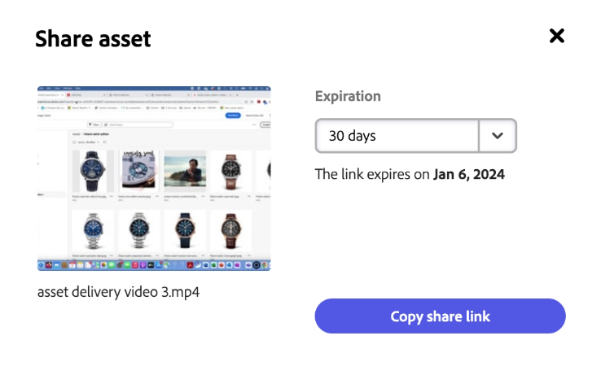

# Elementen delen in Content Hub {#search-assets-as-a-link}

Het delen van elementen via een koppeling is een handige manier om de bronnen beschikbaar te maken voor [!DNL the Content Hub] gebruikers. Met deze functionaliteit kunnen geautoriseerde gebruikers de elementen die met hen worden gedeeld, openen en downloaden. Bij het downloaden van elementen van een gedeelde koppeling [!DNL the Content Hub] gebruikt een asynchrone dienst die sneller en ononderbroken download aanbiedt.

## Eén element delen {#share-a-single-asset}

U kunt één element delen door de volgende stappen uit te voeren:

1. Selecteer een element en klik op de knop  om elementen te delen.

   

1. Gebruik de **[!UICONTROL Expiration]** om een vervaldatum voor de koppeling op te geven. Selecteer een van de beschikbare opties, zoals 24 uur, 1 week, 30 dagen, 90 dagen, 1 jaar of geef een aangepaste datum op.

1. Klik op **[!UICONTROL Copy share link]**. U kunt de gekopieerde koppeling vervolgens delen met de ontvanger.

## Meerdere elementen delen {#share-multiple-assets}

[!DNL The Content Hub] kunt u meerdere elementen delen via een gedeelde koppeling. Voer de volgende stappen uit:

1. Selecteer elementen die u met de geautoriseerde ontvanger wilt delen. U kunt meerdere elementen een voor een selecteren of op **[!UICONTROL Select All]** om alle beschikbare elementen tegelijk te selecteren. De **[!UICONTROL Select All]** Deze optie wordt alleen weergegeven wanneer u ten minste één element selecteert.

1. Klik op de knop  pictogram.

   

1. In de voorbeeldsectie kunt u ook elementen verwijderen naar wens. Gebruik de **[!UICONTROL Expiration]** om een vervaldatum voor de koppeling op te geven. Selecteer een van de beschikbare opties, zoals 24 uur, 1 week, 30 dagen, 90 dagen, 1 jaar of geef een aangepaste datum op.

1. Klik op **[!UICONTROL Copy share link]**. U kunt de gekopieerde koppeling vervolgens delen met de ontvanger.

## Elementen voorvertonen en delen {#preview-assets}

U kunt een voorvertoning weergeven van een digitaal element dat u wilt delen, voordat u het deelt met een ontvanger van de koppeling. Klik op het element waarvan u een voorvertoning wilt weergeven. De [!DNL Content Hub] geeft het dialoogvenster [gedetailleerde weergave van het element](asset-properties-content-hub.md).

Klik op de knop  om elementen te delen. Gebruik de **[!UICONTROL Expiration]** om een vervaldatum voor de koppeling op te geven. Selecteer een van de beschikbare opties, zoals 24 uur, 1 week, 30 dagen, 90 dagen, 1 jaar of geef een aangepaste datum op. Klik op **[!UICONTROL Copy share link]**. U kunt de gekopieerde koppeling vervolgens delen met de ontvanger.

## Toegang tot gedeelde elementen {#access-shared-assets}

Nadat de koppeling voor elementen is gedeeld, kunnen de geautoriseerde ontvangers op de koppeling klikken om een voorbeeld van de gedeelde elementen te bekijken of deze te downloaden in een webbrowser.

Klik op de gedeelde koppeling en klik op het downloadpictogram op de elementenkaart om een element te downloaden.  U kunt ook meerdere elementen selecteren en op **[!UICONTROL Download]**. <!--You can either download original assets or Original+Renditions of an asset.--> [!DNL The Content Hub] Hiermee downloadt u elk element een voor een naar het lokale bestandssysteem.

