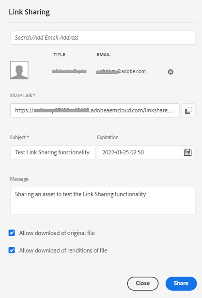

# Elementen delen en distribueren die worden beheerd in [!DNL Experience Manager] {#share-assets-from-aem}

| Versie | Artikelkoppeling |
| -------- | ---------------------------- |
| AEM 6,5 | [Klik hier](https://experienceleague.adobe.com/docs/experience-manager-65/assets/administer/link-sharing.html?lang=en) |
| AEM as a Cloud Service | Dit artikel |

[!DNL Adobe Experience Manager Assets] kunt u elementen, mappen en verzamelingen delen met leden van uw organisatie en externe entiteiten, waaronder partners en leveranciers. Gebruik de volgende methoden om elementen te delen van [!DNL Experience Manager Assets] als [!DNL Cloud Service]:

* [Delen als koppeling](#sharelink)
* [Elementen downloaden](/help/assets/download-assets-from-aem.md) en delen afzonderlijk.
* Delen met [[!DNL Experience Manager] bureaubladtoepassing](https://experienceleague.adobe.com/docs/experience-manager-desktop-app/using/introduction.html).
* Delen met [[!DNL Adobe Asset Link]](https://www.adobe.com/creativecloud/business/enterprise/adobe-asset-link.html).
* Delen met [[!DNL Brand Portal]](https://experienceleague.adobe.com/docs/experience-manager-brand-portal/using/introduction/brand-portal.html).

## Elementen delen als koppeling {#sharelink}

Het delen van elementen via een koppeling is een handige manier om de bronnen beschikbaar te maken voor externe partijen, marketers en andere [!DNL Experience Manager] gebruikers. Met deze functionaliteit kunnen anonieme gebruikers de elementen openen en downloaden die met hen worden gedeeld. Bij het downloaden van elementen van een gedeelde koppeling [!DNL Experience Manager Assets] gebruikt een asynchrone dienst die sneller en ononderbroken download aanbiedt. De te downloaden elementen worden op de achtergrond in ZIP-archieven van beheerbare bestandsgrootte in een wachtrij geplaatst. Voor grote downloads wordt de download gebundeld in meerdere bestanden van 100 GB per bestandsgrootte.

<!--
Users with administrator privileges or with read permissions at `/var/dam/share` location are able to view the links shared with them. 
-->

>[!NOTE]
>
>* U hebt ACL toestemming op de omslag of de activa nodig uitgeven die u als verbinding wilt delen.
>* [Uitgaande e-mailberichten inschakelen](/help/implementing/developing/introduction/development-guidelines.md#sending-email) voordat u een koppeling met de gebruikers deelt.

Er zijn twee manieren om de elementen te delen met behulp van de functie voor het delen van koppelingen:

1. Een gedeelde koppeling genereren, [de elementkoppeling kopiëren en delen](#copy-and-share-assets-link) met andere gebruikers. De standaardvervaltijd van de verbinding is één dag. U kunt de vervaltijd niet wijzigen wanneer u de gekopieerde koppeling deelt met andere gebruikers.

1. Een gedeelde koppeling genereren en [de elementkoppeling via e-mail delen](#share-assets-link-through-email). In dit geval kunt u de standaardwaarden wijzigen, zoals de vervaldatum en -tijd, en het downloaden van de oorspronkelijke elementen en de uitvoeringen toestaan. U kunt e-mail naar meerdere gebruikers verzenden door hun e-mailadres toe te voegen.

   

### De elementkoppeling kopiëren en delen{#copy-and-share-asset-link}

Elementen delen als een openbare URL:

1. Aanmelden bij [!DNL Experience Manager Assets] en navigeer naar **[!UICONTROL Files]**.
1. Selecteer de elementen of map met elementen. Klik **[!UICONTROL Share Link]** op de werkbalk.
1. De **[!UICONTROL Link Sharing]** wordt weergegeven met een koppeling naar automatisch gegenereerde elementen in het dialoogvenster **[!UICONTROL Share Link]** veld.
1. Kopieer de elementkoppeling en deel deze met de gebruikers.

### Koppeling met middelen delen via e-mailkennisgeving {#share-assets-link-through-email}

Elementen delen via e-mail:

1. Selecteer de elementen of map met elementen. Klik **[!UICONTROL Share Link]** op de werkbalk.
1. De **[!UICONTROL Link Sharing]** wordt weergegeven met een koppeling naar automatisch gegenereerde elementen in het dialoogvenster **[!UICONTROL Share Link]** veld.

   * Typ in het vak E-mailadres de e-mailadres van de gebruiker met wie u de koppeling wilt delen. U kunt de koppeling delen met meerdere gebruikers. Als de gebruiker lid is van uw organisatie, selecteert u de desbetreffende e-mailadres in de suggesties in de vervolgkeuzelijst. Als de gebruiker extern is, typt u de volledige e-mailid en drukt u op **[!UICONTROL Enter]**; de e-mailadres wordt toegevoegd aan de lijst met gebruikers.

   * In de **[!UICONTROL Subject]** Typ een onderwerp om het doel van de gedeelde elementen op te geven.
   * In de **[!UICONTROL Message]** Typ indien nodig een bericht.
   * In de **[!UICONTROL Expiration]** in het veld gebruikt u de datumkiezer om een vervaldatum en -tijd voor de koppeling op te geven.
   * De optie **[!UICONTROL Allow download of original file]** Schakel het selectievakje in zodat de ontvangers de oorspronkelijke vertoning kunnen downloaden.

1. Klik op **[!UICONTROL Share]**. Een bericht bevestigt dat de koppeling wordt gedeeld met de gebruikers. De gebruikers ontvangen een e-mail met de gedeelde koppeling.

   

### Elementen downloaden via de elementkoppeling

Elke gebruiker die toegang heeft tot de koppeling voor gedeelde elementen, kan de elementen downloaden die in een ZIP-map zijn gebundeld. Het downloadproces is hetzelfde, ongeacht of een gebruiker de gekopieerde elementkoppeling opent of de via e-mail gedeelde elementkoppeling gebruikt.

* Klik op de elementkoppeling of plak de URL in uw browser. De [!UICONTROL Link Share] interface opent waar u kunt op [!UICONTROL Card View] of [!UICONTROL List View].

* In de [!UICONTROL Card View]kunt u de muis boven het gedeelde element of de map met gedeelde elementen plaatsen om de elementen te selecteren of in de wachtrij voor downloaden.

* Standaard wordt in de gebruikersinterface het **[!UICONTROL Download Inbox]** -optie. Het geeft de lijst weer van alle gedeelde elementen of mappen die samen met hun status in de wachtrij voor downloaden staan.

* Bij het selecteren van de middelen of map, kunt u een **[!UICONTROL Queue Download]** verschijnt op het scherm. Klik op de knop **[!UICONTROL Queue Download]** om het downloadproces te starten.

  

* Klik tijdens het voorbereiden van het downloadbestand op **[!UICONTROL Download Inbox]** om de status van uw download weer te geven. Voor grote downloads klikt u op de knop **[!UICONTROL Refresh]** om de status bij te werken.

  

* Als de verwerking is voltooid, klikt u op **[!UICONTROL Download]** om het ZIP-bestand te downloaden.

<!--
You can also copy the auto-generated link and share it with the users. The default expiration time for the link is one day.
-->

>[!NOTE]
>
>Als een gedeeld element naar een andere locatie wordt verplaatst, werkt de koppeling niet meer. Maak de koppeling opnieuw en deel deze opnieuw met de gebruikers.

<!--
## Share assets as a link {#sharelink}

To generate the URL for assets you want to share with users, use the Link Sharing dialog. Users with administrator privileges or with read permissions at `/var/dam/share` location are able to view the links shared with them. Sharing assets through a link is a convenient way of making resources available to external parties without them having to first log in to Experience Manager Assets.

>[!NOTE]
>
>* You need Edit ACL permission on the folder or the asset that you want to share as a link.
>* Before you share a link with users, ensure that Day CQ Mail Service is configured. Otherwise, an error occurs.

1. In the Assets user interface, select the asset to share as a link.
1. From the toolbar, click/tap the **[!UICONTROL Share Link]**.

   An asset link is auto-created in the **[!UICONTROL Share Link]** field. Copy this link and share it with the users. The default expiration time for the link is one day.

   Alternatively, proceed to perform steps 3-7 of this procedure to add email recipients, configure the expiration time for the link, and send it from the dialog.

   >[!NOTE]
   >
   >If a shared asset is moved to a different location, its link stops working. Re-create the link and re-share with the users.

1. From the web console, open the **[!UICONTROL Day CQ Link Externalizer]** configuration and modify the following properties in the **[!UICONTROL Domains]** field with the values mentioned against each:

    * local
    * author
    * publish

   For the local and author properties, provide the URL for the local and author instance respectively. Both local and author properties have the same value if you run a single Experience Manager author instance. For publish, provide the URL for the publish instance.

1. In the email address box of the **[!UICONTROL Link Sharing]** dialog, type the email ID of the user you want to share the link with. You can also share the link with multiple users.

   If the user is a member of your organization, select the user's email ID from the suggested email IDs that appear in the list below the typing area. For an external user, type the complete email ID and then select it from the list.

   To enable emails to be sent out to users, configure the SMTP server details in [Day CQ Mail Service](/help/assets/configure-asset-sharing.md#configmailservice).

   >[!NOTE]
   >
   >If you enter an email ID of a user that is not a member of your organization, the words "External User" are prefixed with the email ID of the user.

1. In the **[!UICONTROL Subject]** box, enter a subject for the asset you want to share.
1. In the **[!UICONTROL Message]** box, enter an optional message.
1. In the **[!UICONTROL Expiration]** field, specify an expiration date and time for the link using the date picker. By default, the expiration date is set for a week from the date you share the link.
1. To let users download the original image along with the renditions, select **[!UICONTROL Allow download of original file]**.

   >[!NOTE]
   >
   >By default, users can only download the renditions of the asset that you share as a link.

1. Click **[!UICONTROL Share]**. A message confirms that the link is shared with the users through an email.
1. To view the shared asset, click/tap the link in the email that is sent to the user. The shared asset is displayed in the **[!UICONTROL Adobe Marketing Cloud]** page.

   To toggle to the list view, click/tap the layout icon in the toolbar.

1. To generate a preview of the asset, click/tap the shared asset. To close the preview and return to the **[!UICONTROL Marketing Cloud]** page, click/tap **[!UICONTROL Back]** in the toolbar. If you have shared a folder, click/tap **[!UICONTROL Parent Folder]** to return to the parent folder.

   >[!NOTE]
   >
   >Experience Manager supports generating the preview of assets of these MIME types: JPG, PNG, GIF, BMP, INDD, PDF, and PPT. You can only download the assets of the other MIME types.

1. To download the shared asset, click/tap **[!UICONTROL Select]** from the toolbar, click/tap the asset, and then click/tap **[!UICONTROL Download]** from the toolbar.
1. To view the assets you shared as links, go to the Assets user interface and click/tap the GlobalNav icon. Choose **[!UICONTROL Navigation]** from the list to display the Navigation pane.
1. From the Navigation pane, choose **[!UICONTROL Shared Links]** to display a list of shared assets.
1. To un-share an asset, select it and tap/click **[!UICONTROL Unshare]** from the toolbar.

A message confirms that you unshared the asset. In addition, the entry for the asset is removed from the list.
-->

## Elementen downloaden en afzonderlijk delen {#download-and-share-assets}

Gebruikers kunnen de vereiste middelen downloaden en deze delen buiten [!DNL Experience Manager]. Zie voor meer informatie [hoe te om activa te zoeken](/help/assets/search-assets.md), [hoe te om activa te downloaden](/help/assets/download-assets-from-aem.md), en [hoe verzamelingen te downloaden](manage-collections.md#download-a-collection)

## Elementen delen met creatieve professionals {#share-with-creatives}

Marketers en zakelijke gebruikers kunnen hun goedgekeurde bedrijfsmiddelen eenvoudig delen met hun creatieve professionals.

* **Experience Manager-bureaubladtoepassing**: De app werkt in Windows en Mac. Zie [Overzicht van desktop-app](https://experienceleague.adobe.com/docs/experience-manager-desktop-app/using/introduction.html). Als u wilt weten hoe geautoriseerde desktopgebruikers gemakkelijk toegang kunnen krijgen tot de gedeelde elementen, raadpleegt u [elementen zoeken, zoeken en voorvertonen](https://experienceleague.adobe.com/docs/experience-manager-desktop-app/using/using.html#browse-search-preview-assets). De desktopgebruikers kunnen elementen maken en deze delen met hun collega&#39;s die Experience Manager gebruikers zijn, bijvoorbeeld door nieuwe afbeeldingen te uploaden. Zie [elementen uploaden met bureaubladtoepassing](https://experienceleague.adobe.com/docs/experience-manager-desktop-app/using/using.html#upload-and-add-new-assets-to-aem).

* **Adobe-itemkoppeling**: De creatieve professionals kunnen hun middelen rechtstreeks van binnen zoeken en gebruiken [!DNL Adobe InDesign], [!DNL Adobe Illustrator], en [!DNL Adobe Photoshop].

## Assets delen configureren {#configure-sharing}

De verschillende opties om de activa te delen vereisen specifieke configuratie en hebben specifieke eerste vereisten.

### Delen van koppelingen voor elementen configureren {#asset-link-sharing}

<!-- TBD: Web Console is not there so how to configure Day CQ email service? Or is it not required now? -->

Gebruik het dialoogvenster Koppelen om de URL te genereren voor elementen die u met gebruikers wilt delen. Gebruikers met beheerdersrechten of met leesmachtigingen op `/var/dam/share` de locatie kan de koppelingen weergeven die met hen worden gedeeld. Het delen van elementen via een koppeling is een handige manier om bronnen beschikbaar te maken voor externe partijen zonder dat ze zich eerst moeten aanmelden bij [!DNL Assets].

>[!NOTE]
>
>Als u koppelingen van uw instantie Auteur naar externe entiteiten wilt delen, dient u alleen de volgende URL&#39;s beschikbaar te maken voor `GET` verzoeken. Blokkeer andere URL&#39;s om ervoor te zorgen dat de instantie Auteur beveiligd is.
>
>* `[aem_server]:[port]/linkshare.html`
>* `[aem_server]:[port]/linksharepreview.html`
>* `[aem_server]:[port]/linkexpired.html`

<!--
## Configure Day CQ mail service {#configmailservice}

Before you can share assets as links, configure the email service.

1. Click or tap the Experience Manager logo, and then navigate to **[!UICONTROL Tools]** &gt; **[!UICONTROL Operations]** &gt; **[!UICONTROL Web Console]**.
1. From the list of services, locate **[!UICONTROL Day CQ Mail Service]**.
1. Click the **[!UICONTROL Edit]** icon beside the service, and configure the following parameters for **Day CQ Mail Service]** with the details mentioned against their names:

    * SMTP server host name: email server host name
    * SMTP server port: email server port
    * SMTP user: email server user name
    * SMTP password: email server password

1. Click/tap **[!UICONTROL Save]**.
-->

<!-- TBD: Commenting as Web Console is not available. Document the appropriate OSGi config method if available in CS.
### Configure maximum data size {#maxdatasize}

When you download assets from the link shared using the Link Sharing feature, Experience Manager compresses the asset hierarchy from the repository and then returns the asset in a ZIP file. However, in the absence of limits to the amount of data that can be compressed in a ZIP file, huge amounts of data is subjected to compression, which causes out of memory errors in JVM. To secure the system from a potential denial of service attack due to this situation, you can configure the maximum size of the downloaded files. If uncompressed size of the asset exceeds the configured value, asset download requests are rejected. The default value is 100 MB.

1. Click/Tap the Experience Manager logo and then go to **[!UICONTROL Tools]** &gt; **[!UICONTROL Operations]** &gt; **[!UICONTROL Web Console]**.
1. From the web console, locate the **[!UICONTROL Day CQ DAM Adhoc Asset Share Proxy Servlet]** configuration.
1. Open the configuration in edit mode, and modify the value of the **[!UICONTROL Max Content Size (uncompressed)]** parameter.
1. Save the changes.
-->

<!--
Add content or link about how to configure sharing via BP, DA, AAL, etc.
-->

### Desktopacties inschakelen voor gebruik met bureaubladtoepassing {#desktop-actions}

Van binnen [!DNL Assets] in een browser, kunt u de middelenlocaties of uitchecken verkennen en het middel openen voor bewerking in uw desktoptoepassing. Deze opties worden desktophandelingen genoemd en om deze in te schakelen, raadpleegt u [bureaubladhandelingen inschakelen in [!DNL Assets] webinterface](https://experienceleague.adobe.com/docs/experience-manager-desktop-app/using/using.html#desktopactions-v2).

### Te gebruiken configuraties [!DNL Adobe Asset Link] {#configure-asset-link}

Adobe Asset Link stroomlijnt de samenwerking tussen ontwerpers en marketers bij het maken van inhoud. Het verbindt [!DNL Adobe Experience Manager Assets] with [!DNL Creative Cloud] bureaubladapps [!DNL Adobe InDesign], [!DNL Adobe Photoshop], en [!DNL Adobe Illustrator]. De [!DNL Adobe Asset Link] paneel stelt ontwerpers in staat toegang te krijgen tot inhoud die is opgeslagen in [!DNL Assets] zonder de creatieve toepassingen die ze het meest kennen, over te laten.

Zie [hoe te vormen [!DNL Assets] gebruiken met [!DNL Adobe Asset Link]](https://helpx.adobe.com/enterprise/using/configure-aem-assets-for-asset-link.html).

## Aanbevolen werkwijzen en problemen oplossen {#bestpractices}

* Elementmappen of -verzamelingen die in hun naam een witruimte bevatten, worden mogelijk niet gedeeld.
* Als gebruikers de gedeelde elementen niet kunnen downloaden, vraagt u de beheerder van de Experience Manager om de downloadlimieten. De standaardwaarde is 100 MB.
* Een gebruiker kan alleen een voorvertoning weergeven van een video die wordt gedeeld via het delen van koppelingen als voor de video een statische video-uitvoering beschikbaar is op `/jcr:content/renditions` locatie in het knooppunt van de video in de opslagplaats. De voorvertoning is niet afhankelijk van de beschikbaarheid van een [!DNL Dynamic Media] uitvoering.
* Wanneer u een video-element downloadt via gedeelde koppelingen, wordt de [!DNL Dynamic Media] Uitvoeringen worden niet opgenomen in het gedownloade archief.

<!--
* If you cannot send email with links to shared assets or if the other users cannot receive your email, check with your Experience Manager administrator if the [email service](/help/assets/configure-asset-sharing.md#configmailservice) is configured or not. 
* If you cannot share assets using link sharing functionality, ensure that you have the appropriate permissions. See [share assets](#sharelink).
-->

<!-- TBD: Add content or link about how to share using Brand Portal when it is available on [!DNL Cloud Service].
-->

**Zie ook**

* [Elementen vertalen](translate-assets.md)
* [HTTP-API voor assets](mac-api-assets.md)
* [Ondersteunde bestandsindelingen](file-format-support.md)
* [Assets doorzoeken](search-assets.md)
* [Verbonden elementen](use-assets-across-connected-assets-instances.md)
* [Rapporten over assets](asset-reports.md)
* [Metagegevensschema&#39;s](metadata-schemas.md)
* [Elementen downloaden](download-assets-from-aem.md)
* [Metagegevens beheren](manage-metadata.md)
* [Facetten doorzoeken](search-facets.md)
* [Verzamelingen beheren](manage-collections.md)
* [Bulkmetagegevens importeren](metadata-import-export.md)