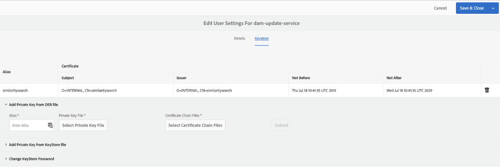

# Experience Manager configureren voor slimme tags aan elementen {#configure-aem-for-smart-tagging}

Door elementen te labelen met een woordenschat die door de taxonomie wordt bepaald, kunt u de elementen eenvoudig herkennen en ophalen door zoekopdrachten op basis van tags. Adobe biedt slimme tags die gebruikmaken van algoritmen voor kunstmatige intelligentie en het leren van machines om afbeeldingen op te leiden. Slimme tags gebruiken een kunstmatig intelligentieframework van [Adobe Sensei](https://www.adobe.com/sensei/experience-cloud-artificial-intelligence.html) om het algoritme voor beeldherkenning op te leiden voor uw tagstructuur en bedrijfscatonomie.

De functie Slimme tags kan als een invoegtoepassing worden aangeschaft [!DNL Experience Manager]. Nadat u de aankoop hebt gedaan, wordt een e-mail verzonden naar de beheerder van uw organisatie met een koppeling naar de Adobe Developer Console. De beheerder opent de koppeling om de slimme tags te integreren met [!DNL Experience Manager] gebruik van Adobe Developer Console.

<!-- TBD: 
1. Can a similar flowchart be created about how training works in CS? 
2. Is there a link to buy SCS or initiate a sales call.
3. Keystroke all steps and check all screenshots.
-->

## Integreren met Adobe Developer Console {#aio-integration}

Voordat u de afbeeldingen kunt voorzien van tags met behulp van SCS, dient u ze te integreren [!DNL Adobe Experience Manager] met de service Slimme tags met behulp van Adobe Developer Console. Aan de achterkant verifieert de [!DNL Experience Manager] server uw servicegegevens met de Adobe Developer Console-gateway voordat uw verzoek naar de service wordt doorgestuurd.

* Creeer een configuratie binnen [!DNL Experience Manager] om een openbare sleutel te produceren. [Overheidscertificaat](#obtain-public-certificate) verkrijgen voor OAuth-integratie.
* [Maak een integratie in Adobe Developer Console](#create-aio-integration) en upload de gegenereerde openbare sleutel.
* [Configureer slimme tags](#configure-smart-content-service) in uw [!DNL Experience Manager] exemplaar met behulp van de API-sleutel en andere referenties uit de Adobe Developer Console.
* [Test de configuratie](#validate-the-configuration).
* [Opnieuw configureren na verlopen](#certrenew)van certificaat.

### Vereisten voor de integratie van Adobe Developer Console {#prerequisite-for-aio-integration}

Voordat u Slimme tags kunt gebruiken, moet u het volgende doen om een integratie te maken in Adobe Developer Console:

* Een Adobe ID-account met beheerdersrechten voor de organisatie.
* De slimme tags zijn ingeschakeld voor uw organisatie.

### Obtain a public certificate {#obtain-public-certificate}

Met een openbaar certificaat kunt u uw profiel verifiëren op Adobe Developer Console. U maakt een certificaat vanuit [!DNL Experience Manager]de toepassing zelf.

1. Ga in de [!DNL Experience Manager] gebruikersinterface naar **[!UICONTROL Tools]** > **[!UICONTROL Security]** > **[!UICONTROL Adobe IMS Configurations]**.

1. Klik op de [!UICONTROL Adobe IMS Configurations] pagina **[!UICONTROL Create]**. From **[!UICONTROL Cloud Solution]** menu, select **[!UICONTROL Smart Tags]**.

1. Selecteer **[!UICONTROL Create new certificate]**. Geef een naam op en klik op **[!UICONTROL Create certificate]**. Klik op **[!UICONTROL OK]**.

1. Klik op **[!UICONTROL Download Public Key]**.

   

### Een integratie maken {#create-aio-integration}

Als u slimme tags wilt gebruiken, maakt u een integratie in Adobe Developer Console om API-sleutel, technische account-id, organisatie-id en clientgeheim te genereren.

1. Ga naar [https://console.adobe.io](https://console.adobe.io/) in een browser. Selecteer de aangewezen rekening en verifieer dat de bijbehorende organisatierol systeembeheerder is.
1. Maak een project met de gewenste naam. Klik op **[!UICONTROL Add API]**.
1. Selecteer op de **[!UICONTROL Add an API]** pagina **[!UICONTROL Experience Cloud]** en selecteer **[!UICONTROL Smart Content]**. Klik op **[!UICONTROL Next]**.
1. Selecteer **[!UICONTROL Upload your public key]**. Geef het certificaatbestand op dat u hebt gedownload van [!DNL Experience Manager]. Er [!UICONTROL Public key(s) uploaded successfully] wordt een bericht weergegeven. Klik op **[!UICONTROL Next]**.
1. [!UICONTROL Create a new Service Account (JWT) credential] De pagina toont de openbare sleutel voor de de dienstrekening enkel gevormd. Klik op **[!UICONTROL Next]**.
1. Selecteer op de **[!UICONTROL Select product profiles]** pagina **[!UICONTROL Smart Content Services]**. Klik **[!UICONTROL Save configured API]**. Op een pagina wordt meer informatie over de configuratie weergegeven. Laat deze pagina open om deze waarden in Experience Manager te kopiëren en toe te voegen wanneer u Slimme tags verder configureert in [!DNL Experience Manager].

   

### Slimme tags configureren {#configure-smart-content-service}

Als u de integratie wilt configureren, gebruikt u de waarden Payload, Client Secret, Authorization Server en API-sleutelvelden uit de integratie met de Adobe Developer Console.

1. Ga in de [!DNL Experience Manager] gebruikersinterface naar **[!UICONTROL Tools]** > **[!UICONTROL Security]** > **[!UICONTROL Adobe IMS Configurations]**.
1. Geef de gewenste **[!UICONTROL Adobe IMS Technical Account Configuration]** toegangspagina op **[!UICONTROL Title]**.
1. Geef in **[!UICONTROL Authorization Server]** veld de `https://ims-na1.adobelogin.com` URL op.
1. Geef in het **[!UICONTROL API Key]** veld **[!UICONTROL Client ID]** de gegevens op [!DNL Adobe Developer Console].
1. Geef in het **[!UICONTROL Client Secret]** veld de **[!UICONTROL Client Secret]** gegevens op van de [!DNL Adobe Developer Console]. Klik op **[!UICONTROL Retrieve Client Secret]** optie om deze weer te geven.
1. Klik in [!DNL Adobe Developer Console]het project op de linkermarge **[!UICONTROL Service Account (JWT)]** . Klik op **[!UICONTROL Generate JWT]** tab. Klik **[!UICONTROL Copy]** om de getoonde te kopiëren **[!UICONTROL JWT Payload]**. Geef deze waarde op in het **[!UICONTROL Payload]** veld in [!DNL Experience Manager]. Klik op **[!UICONTROL Create]**.

### De configuratie valideren {#validate-the-configuration}

Nadat u de configuratie hebt voltooid, volg deze stappen om de configuratie te bevestigen.

1. Ga in de [!DNL Experience Manager] gebruikersinterface naar **[!UICONTROL Tools]** > **[!UICONTROL Security]** > **[!UICONTROL Adobe IMS Configurations]**.

1. Selecteer de configuratie Slimme tags. Klik op **[!UICONTROL Check Health]** de werkbalk. Klik op **[!UICONTROL Check]**. Een dialoog met [!UICONTROL Healthy configuration] bericht bevestigt dat de configuratie werkt.

### Opnieuw configureren als een certificaat verloopt {#certrenew}

Wanneer het certificaat verloopt, wordt het niet meer vertrouwd. Voer de volgende stappen uit om een nieuw certificaat toe te voegen. U kunt een verlopen certificaat niet vernieuwen.

1. Log in your [!DNL Experience Manager] deployment as an administrator. Klik op **[!UICONTROL Tools]** > **[!UICONTROL Security]** > **[!UICONTROL Users]**.

1. Zoek en klik op **[!UICONTROL dam-update-service]** Gebruiker. Klik op **[!UICONTROL Keystore]** tabblad.
1. Verwijder het bestaande **[!UICONTROL similaritysearch]** sleutelarchief met het verlopen certificaat. Klik op **[!UICONTROL Save & Close]**.

   

   *Afbeelding: Verwijder het bestaande`similaritysearch`item in het sleutelarchief om een nieuw beveiligingscertificaat toe te voegen.*

1. Ga in de [!DNL Experience Manager] gebruikersinterface naar **[!UICONTROL Tools]** > **[!UICONTROL Security]** > **[!UICONTROL Adobe IMS Configurations]**. Open de beschikbare configuratie voor slimme tags. Als u een openbaar certificaat wilt downloaden, klikt u op **[!UICONTROL Download Public Certificate]**.

1. Open [https://console.adobe.io](https://console.adobe.io) en navigeer naar de bestaande service in het project. Upload het nieuwe certificaat en configureer het. Zie de instructies in de integratie [van Adobe Developer Console](#create-aio-integration)maken voor meer informatie over de configuratie.

## Slimme tags toepassen op nieuw geüploade elementen inschakelen (optioneel) {#enable-smart-tagging-for-uploaded-assets}

1. Ga [!DNL Experience Manager]naar **[!UICONTROL Tools > Workflow > Models]**.
1. Selecteer op de pagina **[!UICONTROL Workflow Models]** het **[!UICONTROL DAM Update Asset]**-workflowmodel.
1. Klik op **[!UICONTROL Edit]** de werkbalk.
1. Vouw het zijpaneel uit om de stappen weer te geven. Sleep de stap **[!UICONTROL Smart Tag Asset]** die beschikbaar is in de DAM-workflowsectie en plaats deze na de stap **[!UICONTROL Process Thumbnails]**.

   

   *Afbeelding: Voeg de stap Slimme tag-elementen toe na de stap met de procesminiaturen in de DAM-workflow Element bijwerken.*

1. Open de stap die u wilt configureren. Zorg er onder **[!UICONTROL Advanced Settings]** dat de **[!UICONTROL Handler Advance]** optie is geselecteerd.

   

1. Selecteer op het **[!UICONTROL Arguments]** tabblad **[!UICONTROL Ignore Errors]** of de workflow fouten bij het voorspellen van tags moet negeren. Als u elementen wilt labelen wanneer ze worden geüpload, ongeacht of slimme tags zijn ingeschakeld in mappen, selecteert u **[!UICONTROL Ignore Smart Tag Flag]**.

1. Klik **[!UICONTROL OK]** om de processtap te sluiten en sla de workflow op. Klik op **[!UICONTROL Sync]**.

>[!MORELIKETHIS]
>
>* [Elementen labelen met behulp van intelligente service](smart-tags.md)

