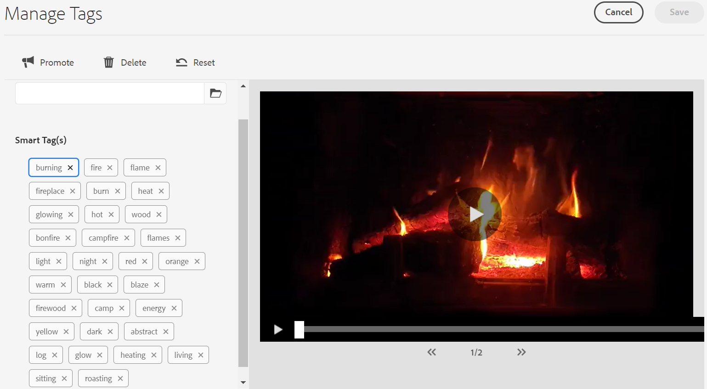

# Slimme tag toewijzen aan video-elementen {#video-smart-tags}

De groeiende behoefte aan nieuwe inhoud vraagt om minder handmatige inspanningen om op korte termijn aantrekkelijke digitale ervaringen te bieden. [!DNL Adobe Experience Manager] als Cloud Service ondersteunt geautomatiseerde codering van video-elementen met behulp van artificiële intelligentie. Het kan tijdrovend zijn om de video&#39;s handmatig te labelen. Intelligente tags voor video&#39;s die door Adobe Sensei worden aangedreven, maken echter gebruik van kunstmatige intelligentiemodellen om video-inhoud te analyseren en tags toe te voegen aan de video-elementen. Hierdoor verkort u tijd voor DAM-gebruikers om hun klanten rijke ervaringen te bieden. Adobe genereert twee sets met tags voor een video. Eén set komt overeen met objecten, scènes en kenmerken in die video. de andere reeks heeft betrekking op handelingen zoals drinken , lopen en joggen .

De videobestandsindelingen (en de bijbehorende codecs) die worden ondersteund voor slimme tags zijn MP4 (H264/AVC), MKV (H264/AVC), MOV (H264/AVC, Motion JPEG), AVI (indeo4), FLV (H264/AVC, vp6f) en WMV (WC MV2). Bovendien kunnen video&#39;s tot 300 MB worden gelabeld met deze functie. De automatische codering van video-elementen vindt plaats als standaardverwerking van elementen (samen met het maken van miniaturen en het uitnemen van metagegevens) nadat een video is geüpload of wanneer een herverwerking wordt gestart. De slimme tags worden weergegeven in aflopende volgorde van hun [betrouwbaarheidsscore](#confidence-score-video-tag) in element [!UICONTROL Properties]. Videocodering is standaard ingeschakeld in [!DNL Adobe Experience Manager] de vorm van een Cloud Service. U kunt echter de optie [Weigeren om slimme tags](#opt-out-video-smart-tagging) aan video toe te wijzen in een map.

## Slimme tags toepassen op video&#39;s tijdens het uploaden {#smart-tag-assets-on-ingestion}

Wanneer u video-elementen [](add-assets.md#upload-assets) uploadt naar [!DNL Adobe Experience Manager] de Cloud Service, worden de video&#39;s . Als de verwerking is voltooid, raadpleegt u het [!UICONTROL Basic] tabblad van de [!UICONTROL Properties] elementpagina. Slimme tags worden automatisch toegevoegd aan de video onder [!UICONTROL Smart Tags]. De Dienst van de asset compute gebruikt Adobe Sensei om deze slimme markeringen tot stand te brengen.


De toegepaste slimme tags worden gesorteerd in aflopende volgorde van [betrouwbaarheidsscore](#confidence-score-video-tag), gecombineerd voor object- en actietags, binnen [!UICONTROL Smart Tags].

>[!IMPORTANT]
>
>U wordt geadviseerd om deze automatisch geproduceerde markeringen te herzien om ervoor te zorgen dat zij aan uw merk en zijn waarden in overeenstemming zijn.

## Bestaande video&#39;s slim labelen in DAM {#smart-tag-existing-videos}

De bestaande video-elementen in DAM worden niet automatisch gecodeerd als slimme tags. U moet slimme tags [!UICONTROL Reprocess Assets] handmatig genereren.

Voer de volgende stappen uit om slimme tags toe te wijzen aan video-elementen of mappen (inclusief submappen) van elementen die al in de opslagplaats voor elementen bestaan:

1. Selecteer het [!DNL Adobe Experience Manager] logo en selecteer vervolgens elementen op de [!UICONTROL Navigation] pagina.

1. Selecteer deze optie [!UICONTROL Files] om de interface Elementen weer te geven.

1. Navigeer naar de map waarop u slimme tags wilt toepassen.

1. Selecteer de volledige map of specifieke video-elementen.

1. Selecteer het pictogram  Elementen opnieuw verwerken en selecteer de [!UICONTROL Reprocess Assets] [!UICONTROL Full Process] optie.


Als het proces is voltooid, navigeert u naar de [!UICONTROL Properties] pagina van elk video-element in de map. De automatisch toegevoegde labels worden weergegeven in de [!UICONTROL Smart Tags] sectie op het [!UICONTROL Basic] tabblad. Deze toegepaste slimme tags worden gesorteerd in aflopende volgorde van [betrouwbaarheidsscore](#confidence-score-video-tag).

## Zoeken naar gelabelde video&#39;s {#search-smart-tagged-videos}

Als u de video-elementen wilt zoeken op basis van de automatisch gegenereerde slimme tags, gebruikt u [Omnissearch](search-assets.md#search-assets-in-aem):

1. Selecteer het  van het zoekpictogram om het zoekveld weer te geven.

1. Geef in het veld Onderzoek een tag op die u niet expliciet aan een video hebt toegevoegd.

1. Zoeken op basis van de tag.

De zoekresultaten geven de video-elementen weer op basis van de tag die u hebt opgegeven.

Uw zoekresultaten zijn een combinatie van video-elementen met gezochte trefwoorden in de metagegevens en de video-elementen die zijn gelabeld met de gezochte trefwoorden. De zoekresultaten die overeenkomen met alle zoektermen in metagegevensvelden worden echter eerst weergegeven, gevolgd door de zoekresultaten die overeenkomen met een van de zoektermen in de slimme tags. Zie [ [!DNL Experience Manager] Zoekresultaten met slimme tags](smart-tags.md#understandsearch)voor meer informatie.

## Slimme videolabels modereren {#moderate-video-smart-tags}

[!DNL Adobe Experience Manager] Hiermee kunt u de slimme tags op de volgende manieren curven:

* Verwijder onjuiste tags die zijn toegewezen aan uw merkvideo&#39;s.

* U kunt zoekopdrachten op basis van tags verfijnen voor video&#39;s door ervoor te zorgen dat de video wordt weergegeven in de zoekresultaten voor de meest relevante tags. Hierdoor wordt de kans dat niet-verwante video&#39;s in zoekresultaten worden weergegeven, weggenomen.

* U kunt een tag een hogere positie geven om de relevantie ervan voor een video te vergroten. Door een tag voor een video te promoten, neemt de kans toe dat de video in de zoekresultaten wordt weergegeven wanneer een zoekopdracht op basis van die tag wordt uitgevoerd.

Zie Slimme tags [](smart-tags.md#manage-smart-tags-and-searches)beheren voor meer informatie over het reduceren van slimme tags voor elementen.



>[!NOTE]
>
>Tags die met de stappen in Slimme tags [](smart-tags.md#manage-smart-tags-and-searches) beheren worden gemodereerd, worden niet onthouden bij het opnieuw verwerken van het element. De originele set labels wordt opnieuw weergegeven.

## Slimme tags toepassen op video uitschakelen {#opt-out-video-smart-tagging}

Wanneer het automatisch labelen van video&#39;s tegelijkertijd met andere taken voor middelenverwerking wordt uitgevoerd, zoals het maken van miniaturen en het uitnemen van metagegevens, kan dit tijdrovend zijn. Als u de verwerking van elementen wilt versnellen, kunt u de optie Slimme tags toepassen bij het uploaden van video&#39;s op mapniveau uitschakelen.

U kunt het genereren van automatische slimme-videolabels uitschakelen voor elementen die naar een specifieke map zijn geüpload:

1. Open [!UICONTROL Asset Processing] tabblad in map [!UICONTROL Properties].

1. De optie in [!UICONTROL Smart Tags for Videos] het menu is standaard [!UICONTROL Inherited] geselecteerd en de slimme tag video is ingeschakeld.

   Als de [!UICONTROL Inherited] optie is geselecteerd, wordt het pad van de overgeërfde map ook weergegeven met de informatie of deze is ingesteld op [!UICONTROL Enable] of [!UICONTROL Disable].

   

1. Schakel deze optie in [!UICONTROL Disable] om slimme tags toe te wijzen aan video&#39;s die naar de map zijn geüpload.

>[!IMPORTANT]
>
>Als u er bij het uploaden voor hebt gekozen om geen tags aan video&#39;s toe te wijzen in een map en u wilt de video&#39;s na het uploaden een slimme tag geven, gebruikt u **[!UICONTROL Enable Smart Tags for Videos]** de optie [!UICONTROL Asset Processing] op het tabblad van de map [!UICONTROL Properties] en [[!UICONTROL Reprocess Asset]](#smart-tag-existing-videos) kiest u deze optie om slimme tags toe te voegen aan de video.

## Vertrouwensscore {#confidence-score-video-tag}

[!DNL Adobe Experience Manager] past een minimale betrouwbaarheidsdrempel toe voor slimme tags voor objecten en handelingen om te voorkomen dat er te veel tags voor elk video-element zijn, waardoor de indexering wordt vertraagd. De zoekresultaten van uw middelen worden gerangschikt op basis van de betrouwbaarheidsscores, die over het algemeen de zoekresultaten verbeteren en verder gaan dan wat een inspectie van de toegewezen tags van een video-element suggereert. Onnauwkeurige tags hebben vaak lage betrouwbaarheidsscores, zodat ze zelden boven aan de lijst Slimme tags voor elementen worden weergegeven.

De standaardwaarde voor actie- en objecttags in [!DNL Adobe Experience Manager] is 0,7 (moet een waarde tussen 0 en 1 zijn). Als bepaalde video-elementen niet zijn gecodeerd met een specifieke tag, geeft dit aan dat het algoritme minder dan 70% zeker is van de voorspelde tags. De standaarddrempel is mogelijk niet altijd optimaal voor alle gebruikers. U kunt, daarom, de waarde van de betrouwbaarheidsscore in configuratie veranderen OSGI.

Om de configuratie van de betrouwbaarheidsscore OSGI aan het project toe te voegen dat aan [!DNL Adobe Experience Manager] als Cloud Service door de Manager van de Wolk wordt opgesteld:

* In het [!DNL Adobe Experience Manager] project (`ui.config` sinds Archetype 24, of eerder `ui.apps`) omvat de configuratie `config.author` OSGi, een config dossier genoemd `com.adobe.cq.assetcompute.impl.senseisdk.SenseiSdkImpl.cfg.json` met de volgende inhoud:

```json
{
  "minVideoActionConfidenceScore":0.5,
  "minVideoObjectConfidenceScore":0.5,
}
```

>[!NOTE]
>
>Handmatige tags krijgen een betrouwbaarheid van 100% (maximale betrouwbaarheid). Daarom als er videoactiva met handmarkeringen zijn die de onderzoeksvraag aanpassen, worden zij getoond vóór slimme markeringen die de onderzoeksvraag aanpassen.

## Beperkingen {#video-smart-tagging-limitations}

* De training voor de service Slimme tags (of Uitgebreide slimme tags) voor het coderen van uw video-elementen wordt nog niet ondersteund.

* De voortgang van de codering wordt niet weergegeven.

* Alleen video&#39;s van maximaal 300 MB zijn geschikt voor tags. De Adobe Sensei service Smart plaatst de video&#39;s die aan deze criteria voldoen van tags en slaat het coderen van andere video&#39;s in een map over.

* Alleen de video&#39;s in deze bestandsindelingen (en ondersteunde codecs): MP4 (H264/AVC), MKV (H264/AVC), MOV (H264/AVC, Motion JPEG), AVI (indeo4), FLV (H264/AVC, vp6f) en WMV (WV 2)—kan worden gelabeld.

>[!MORELIKETHIS]
>
>* [Slimme tags beheren en zoeken naar middelen](smart-tags.md#manage-smart-tags-and-searches)
>* [De service Slimme tags toepassen en uw afbeeldingen labelen](smart-tags.md)

