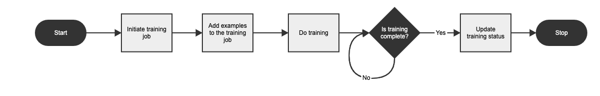

# De service Slimme tags toepassen en uw afbeeldingen labelen {#train-service-tag-assets}

Organisaties die met digitale middelen te maken hebben, maken steeds vaker gebruik van een door taxonomie gecontroleerde woordenlijst in metagegevens van bedrijfsmiddelen. In wezen, omvat het een lijst van sleutelwoorden die de werknemers, de partners, en de klanten algemeen gebruiken om naar hun digitale activa te verwijzen en te zoeken. Door elementen te labelen met een woordenschat die door de taxonomie wordt bepaald, kunt u de elementen eenvoudig herkennen en ophalen door zoekopdrachten op basis van tags.

Vergeleken met natuurlijke taalwoordenboeken, helpt het etiketteren op basis van bedrijfstaxonomie de activa met de zaken van een bedrijf te richten en zorgt ervoor dat de meest relevante activa in onderzoeken verschijnen. Een autofabrikant kan bijvoorbeeld autoafbeeldingen labelen met modelnamen, zodat alleen relevante afbeeldingen worden weergegeven wanneer er wordt gezocht naar een promotiecampagne.

Op de achtergrond gebruiken de Slimme tags een kunstmatig intelligentiekader van [Adobe Sensei](https://www.adobe.com/sensei/experience-cloud-artificial-intelligence.html) om het algoritme voor beeldherkenning op te leiden op uw tagstructuur en bedrijfsclassificatie. Deze inhoudsinfo wordt vervolgens gebruikt om relevante tags toe te passen op een andere set elementen.

<!-- TBD: Create a similar flowchart for how training works in CS.
 
-->

Voer de volgende taken uit als u slimme tags wilt gebruiken:

* [Integreer Experience Manager met Adobe Developer Console](#integrate-aem-with-aio).
* [Leer labelmodellen en richtlijnen](#understand-tag-models-guidelines).
* [Trein het model](#train-model).
* [Tags toewijzen aan uw digitale elementen](#tag-assets).
* [De tags en zoekopdrachten](#manage-smart-tags-and-searches)beheren.

Slimme tags zijn alleen van toepassing op [!DNL Adobe Experience Manager Assets] klanten. De slimme tags kunnen als een invoegtoepassing worden aangeschaft [!DNL Experience Manager].

<!-- TBD: Is there a link to buy SCS or initiate a sales call. How are AIO services sold? -->

## Integreren [!DNL Experience Manager] met Adobe Developer Console {#integrate-aem-with-aio}

Met Adobe Developer Console kunt u [!DNL Adobe Experience Manager] de slimme tags integreren. Gebruik deze configuratie om de dienst van Slimme Markeringen van binnen toegang te hebben [!DNL Experience Manager].

Zie Experience Manager [configureren voor slimme tags van elementen](smart-tags-configuration.md) voor taken om de slimme tags te configureren. Aan de achterkant verifieert de [!DNL Experience Manager] server uw servicegegevens met de Adobe Developer Console-gateway voordat uw verzoek naar de service Slimme tags wordt doorgestuurd.

## Leer labelmodellen en -richtlijnen {#understand-tag-models-guidelines}

Een tagmodel is een groep gerelateerde tags die een visueel aspect van de afbeelding hebben. Een schoenenverzameling kan bijvoorbeeld verschillende tags hebben, maar alle tags zijn gerelateerd aan schoenen en kunnen tot hetzelfde tagmodel behoren. Tags kunnen alleen betrekking hebben op de duidelijk verschillende visuele aspecten van afbeeldingen. Als u de inhoudsweergave van een trainingsmodel in wilt begrijpen, visualiseert u een trainingsmodel als een entiteit op hoofdniveau die bestaat uit een groep handmatig toegevoegde tags en voorbeeldafbeeldingen voor elke tag. [!DNL Experience Manager] Elke tag kan uitsluitend op een afbeelding worden toegepast.

Labels die op realistische wijze niet kunnen worden verwerkt, hebben betrekking op:

* Niet-visuele, abstracte aspecten, zoals het jaar of het seizoen waarin een product wordt uitgebracht, de sfeer van of de emotie die door een afbeelding wordt opgeroepen.
* Fijne visuele verschillen in producten zoals overhemden met en zonder halsbanden of op producten ingebedde logo&#39;s van kleine producten.

Voordat u een tagmodel maakt en de service traint, moet u een set unieke tags identificeren die de objecten in de afbeeldingen het beste beschrijven in de context van uw bedrijf. Zorg ervoor dat de elementen in de beheerde set voldoen aan [de trainingsrichtlijnen](#training-guidelines).

### Richtlijnen voor training {#training-guidelines}

De afbeeldingen in uw trainingsset moeten aan de volgende richtlijnen voldoen:

**Hoeveelheid en grootte:** Minimaal 10 afbeeldingen en maximaal 50 afbeeldingen per tag.

**Coherentie**: Afbeeldingen voor een tag moeten visueel op elkaar lijken. U kunt de tags met betrekking tot dezelfde visuele aspecten (zoals hetzelfde type objecten in een afbeelding) het beste samenvoegen tot één tagmodel. Het is bijvoorbeeld geen goed idee om al deze afbeeldingen als `my-party` (voor training) te labelen, omdat ze er anders uitzien.

**Dekking**: De beelden in de training moeten voldoende uiteenlopend zijn. Het is de bedoeling om enkele maar redelijk uiteenlopende voorbeelden te geven, zodat AEM leert zich te richten op de juiste zaken. Als u dezelfde tag toepast op visueel verschillende afbeeldingen, moet u ten minste vijf voorbeelden van elke soort opnemen. Neem voor het vervolgkeuzemodel ** van het label bijvoorbeeld meer trainingsafbeeldingen op, vergelijkbaar met de gemarkeerde afbeelding hieronder, zodat de service vergelijkbare afbeeldingen nauwkeuriger kan identificeren tijdens het labelen.

**Vervorming/obstructie**: De dienst rijdt beter op beelden die minder afleiding hebben (vooraanstaande achtergronden, niet-verwante begeleiding, zoals voorwerpen/personen met het hoofdonderwerp). Voor de tag *casual-shoe* is de tweede afbeelding bijvoorbeeld geen goede trainingskandidaat.

**Volledigheid:** Als een afbeelding in aanmerking komt voor meer dan één tag, voegt u alle relevante tags toe voordat u de afbeelding opneemt voor training. Als het bijvoorbeeld gaat om tags zoals *regenjas* en *modelweergave*, voegt u beide tags toe aan de desbetreffende asset voordat u dit opneemt voor training.

**Aantal tags**: Adobe raadt u aan een model op te leiden met ten minste twee verschillende tags en ten minste 10 verschillende afbeeldingen voor elke tag. Voeg in één tagmodel niet meer dan 50 tags toe.

**Aantal voorbeelden**: Voeg voor elke tag ten minste 10 voorbeelden toe. Adobe raadt echter ongeveer 30 voorbeelden aan. Er worden maximaal 50 voorbeelden per tag ondersteund.

**Voorkomen van valse positieven en conflicten**: Adobe raadt u aan één tagmodel te maken voor één visueel aspect. Structuur de labelmodellen zodanig dat overlappende codes tussen de modellen worden voorkomen. Gebruik bijvoorbeeld geen gemeenschappelijke tags, zoals `sneakers` in twee verschillende modelnamen `shoes` en `footwear`. Het trainingsproces overschrijft het ene getrainde tagmodel met het andere voor een algemeen trefwoord.

**Voorbeelden**: Hier volgen nog enkele voorbeelden van:

* Maak een labelmodel dat het volgende bevat:
   * alleen de labels die betrekking hebben op automodellen.
   * alleen de labels die betrekking hebben op kleuren van overhemden.
   * alleen de labels voor jassen voor vrouwen en mannen.
* Niet maken,
   * een tagmodel dat automodellen bevat die in 2019 en 2020 zijn uitgebracht .
   * meerdere tagmodellen met dezelfde paar automodellen.

**Afbeeldingen die worden gebruikt om te trainen**: U kunt dezelfde afbeeldingen gebruiken om verschillende tagmodellen te trainen. De optie Koppel een afbeelding echter niet aan meer dan één tag in een labelmodel. Daarom is het mogelijk om dezelfde afbeelding te voorzien van verschillende tags die bij verschillende labelmodellen horen.

U kunt de training niet ongedaan maken. Aan de hand van de bovenstaande richtlijnen kunt u goede afbeeldingen kiezen om te trainen.

## Het model trainen voor uw douanetags {#train-model}

Voer de volgende stappen uit om een model voor uw bedrijfsspecifieke tags te maken en op te leiden:

1. Maak de benodigde labels en de juiste codestructuur. Upload de relevante afbeeldingen in de DAM-opslagplaats.
1. Ga in [!DNL Experience Manager] de gebruikersinterface naar **[!UICONTROL Assets]** > **[!UICONTROL Training Model]**.
1. Klik op **[!UICONTROL Create]**. Geef een **[!UICONTROL Title]**, **[!UICONTROL Description]**.
1. Blader en selecteer de tags van de bestaande tags in `cq:tags` waarvoor u het model wilt trainen. Klik op **[!UICONTROL Next]**.
1. Klik in het **[!UICONTROL Select Assets]** dialoogvenster op **[!UICONTROL Add Assets]** elk label. Zoek in de DAM-opslagplaats of blader door de opslagplaats om ten minste 10 en ten hoogste 50 afbeeldingen te selecteren. Selecteer elementen en niet de map. Als u de afbeeldingen hebt geselecteerd, klikt u op **[!UICONTROL Select]**.
1. Als u een voorvertoning van de miniaturen van de geselecteerde afbeeldingen wilt weergeven, klikt u op de accordeon vóór een tag. U kunt de selectie wijzigen door op **[!UICONTROL Add Assets]** te klikken. Als u tevreden bent met de selectie, klikt u op **[!UICONTROL Submit]**. In de gebruikersinterface wordt onder aan de pagina een melding weergegeven dat de training wordt gestart.
1. Controleer de status van de training in de **[!UICONTROL Status]** kolom voor elk tagmodel. Mogelijke statussen zijn [!UICONTROL Pending], [!UICONTROL Trained]en [!UICONTROL Failed].

*Afbeelding: Stappen van de trainingsworkflow om het coderingsmodel te trainen.*

### Trainingsstatus en rapport weergeven {#training-status}

Als u wilt controleren of de service Slimme tags is opgeleid voor uw tags in de trainingsset met elementen, raadpleegt u het workflowrapport voor training in de rapportconsole.

1. Ga in [!DNL Experience Manager] interface naar **[!UICONTROL Tools > Assets > Reports]**.
1. In the **[!UICONTROL Asset Reports]** page, click **[!UICONTROL Create]**.
1. Select the **[!UICONTROL Smart Tags Training]** report, and then click **[!UICONTROL Next]** from the toolbar.
1. Geef een titel en beschrijving voor het rapport op. Laat onder **[!UICONTROL Schedule Report]** de optie **[!UICONTROL Now]** ingeschakeld. Als u het rapport voor later wilt plannen, selecteert u **[!UICONTROL Later]** en geeft u een datum en tijd op. Then, click **[!UICONTROL Create]** from the toolbar.
1. Selecteer op de pagina **[!UICONTROL Asset Reports]** het rapport dat u hebt gegenereerd. Klik op de werkbalk om het rapport weer te geven. **[!UICONTROL View]**
1. Bekijk de details van het rapport. Het rapport geeft de trainingsstatus weer voor de tags die u hebt getraind. The green color in the **[!UICONTROL Training Status]** column indicates that the Smart Tags service is trained for the tag. Een gele kleur geeft aan dat de service niet volledig is getraind voor een bepaalde tag. Voeg in dit geval meer afbeeldingen met de desbetreffende tag toe en voer de trainingsworkflow uit om de service volledig op de tag te trainen. Als dit rapport uw tags niet bevat, voert u de trainingsworkflow voor deze tags opnieuw uit.Tags
1. Als u het rapport wilt downloaden, selecteert u het in de lijst en klikt u op **[!UICONTROL Download]** de werkbalk. Het rapport wordt gedownload als een Microsoft Excel-spreadsheet.

## Elementen labelen {#tag-assets}

Nadat u de service Slimme tags hebt opgeleid, kunt u de codeerworkflow activeren en automatisch de juiste tags toepassen op een andere set vergelijkbare elementen. U kunt de workflow voor labelen periodiek of telkens wanneer dat nodig is toepassen. De workflow voor labelen is van toepassing op zowel elementen als mappen.

### Elementen labelen vanaf de workflowconsole {#tagging-assets-from-the-workflow-console}

1. Ga in de interface van Experience Manager naar **[!UICONTROL Tools > Workflow > Models]**.
1. From the **[!UICONTROL Workflow Models]** page, select the **[!UICONTROL DAM Smart Tags Assets]** workflow and then click **[!UICONTROL Start Workflow]** from the toolbar.

   

1. Blader in het **[!UICONTROL Run Workflow]** dialoogvenster naar de payload-map met elementen waarop u de tags automatisch wilt toepassen.
1. Geef een titel voor de workflow en een optionele opmerking op. Klik op **[!UICONTROL Run]**.

   

   Navigeer naar de map met middelen en controleer de tags om te controleren of uw elementen correct zijn gecodeerd. Zie Slimme tags [beheren voor meer informatie](#manage-smart-tags-and-searches).

### Elementen labelen vanaf de tijdlijn {#tagging-assets-from-the-timeline}

1. Selecteer in de gebruikersinterface Middelen de map met elementen of specifieke elementen waarop u slimme tags wilt toepassen.
1. Open vanuit de linkerbovenhoek de **[!UICONTROL Timeline]** aanwijzer.
1. Open acties onder aan de linkerzijbalk en klik op **[!UICONTROL Start Workflow]**.

   

1. Selecteer de **[!UICONTROL DAM Smart Tag Assets]** workflow en geef een titel op voor de workflow.
1. Klik op **[!UICONTROL Start]**. De workflow past de labels toe op elementen. Navigeer naar de map met middelen en controleer de tags om te controleren of uw elementen correct zijn gecodeerd. Zie Slimme tags [beheren voor meer informatie](#manage-smart-tags-and-searches).

>[!NOTE]
>
>In de volgende coderingscycli worden alleen de gewijzigde elementen opnieuw gecodeerd met nieuw opgeleide tags. Zelfs ongewijzigde elementen worden echter gecodeerd als de ruimte tussen de laatste en huidige coderingscycli voor de coderingsworkflow meer dan 24 uur bedraagt. Voor workflows met periodieke labels worden ongewijzigde elementen gecodeerd wanneer de tijdruimte langer is dan zes maanden.

### Geüploade elementen labelen {#tag-uploaded-assets}

Met Experience Manager kunt u automatisch de elementen labelen die gebruikers uploaden naar DAM. Hiertoe configureren beheerders een workflow om een beschikbare stap aan slimme-tagelementen toe te voegen. Zie [hoe u slimme tags kunt inschakelen voor geüploade elementen](/help/assets/smart-tags-configuration.md#enable-smart-tagging-for-uploaded-assets).

## Slimme tags en zoekopdrachten naar afbeeldingen beheren {#manage-smart-tags-and-searches}

U kunt slimme tags beheren om eventuele onjuiste tags te verwijderen die aan uw merkafbeeldingen zijn toegewezen, zodat alleen de meest relevante tags worden weergegeven.

Als u slimme tags modereert, kunt u zoekopdrachten op basis van tags naar afbeeldingen verder verfijnen door ervoor te zorgen dat de afbeelding in de zoekresultaten wordt weergegeven voor de meest relevante tags. In feite wordt hiermee de kans dat niet-verwante afbeeldingen in zoekresultaten worden weergegeven, verkleind.

U kunt ook een hogere rangorde aan een tag toewijzen om de relevantie ervan voor een afbeelding te vergroten. Door een tag voor een afbeelding te promoten, neemt de kans toe dat de afbeelding in de zoekresultaten wordt weergegeven wanneer een zoekopdracht op basis van de desbetreffende tag wordt uitgevoerd.

1. Zoek in het vak Onderzoek naar elementen op basis van een tag.
1. Controleer de zoekresultaten om een afbeelding te identificeren die u niet relevant vindt voor uw zoekopdracht.
1. Select the image, and then click the **[!UICONTROL Manage Tags]** icon from the toolbar.
1. Controleer de tags op de **[!UICONTROL Manage Tags]** pagina. Als u niet wilt dat de afbeelding wordt doorzocht op basis van een specifieke tag, selecteert u de tag en klikt u op het verwijderpictogram op de werkbalk. U kunt ook op het `X` symbool naast het label klikken.
1. Als u een hogere rangorde aan een tag wilt toewijzen, selecteert u de tag en klikt u op het promotiepictogram op de werkbalk. De tag die u promoot, wordt verplaatst naar de **[!UICONTROL Tags]** sectie.
1. Click **[!UICONTROL Save]**, and then click **[!UICONTROL OK]** to close the Success dialog.
1. Navigeer naar de pagina met eigenschappen voor de afbeelding. Let erop dat de tag die u hebt bevorderd een grote relevantie krijgt en daarom hoger wordt weergegeven in de zoekresultaten.

### AEM-zoekresultaten begrijpen met slimme tags {#understandsearch}

Standaard combineert AEM-zoekopdrachten de zoektermen met een `AND` component. Het gebruik van slimme tags verandert dit standaardgedrag niet. Als u slimme tags gebruikt, voegt u een extra `OR` component toe om te zoeken naar zoektermen in de lijst, worden slimme tags toegepast. For example, consider searching for `woman running`. Elementen met alleen `woman` of alleen `running` trefwoorden in de metagegevens worden niet standaard in de zoekresultaten weergegeven. Een element dat is gelabeld met slimme tags `woman` `running` of met slimme tags, wordt echter weergegeven in een dergelijke zoekopdracht. De zoekresultaten zijn dus een combinatie van:

* elementen met `woman` en `running` trefwoorden in de metagegevens.

* elementen die zijn gelabeld met een van de trefwoorden.

De zoekresultaten die overeenkomen met alle zoektermen in metagegevensvelden worden eerst weergegeven, gevolgd door de zoekresultaten die overeenkomen met een van de zoektermen in de slimme tags. In het bovenstaande voorbeeld is de weergavevolgorde van zoekresultaten bij benadering:

1. komt overeen met `woman running` de waarden in de verschillende metagegevensvelden.
1. overeenkomende waarden `woman running` in slimme tags.
1. overeenkomende met `woman` of van `running` in slimme tags.

### Beperkingen voor tags {#limitations}

Verbeterde slimme tags zijn gebaseerd op leermodellen van merkafbeeldingen en hun tags. Deze modellen zijn niet altijd perfect bij het identificeren van tags. De huidige versie van de slimme tags heeft de volgende beperkingen:

* Kan subtiele verschillen in afbeeldingen niet herkennen. Bijvoorbeeld dunne en standaard gemonteerde hemden.
* Kan geen tags identificeren op basis van kleine patronen/delen van een afbeelding. Bijvoorbeeld logo&#39;s op T-shirts.
* Tags worden ondersteund in de landinstellingen waarin AEM wordt ondersteund. Zie Opmerkingen bij de release [Slimme tags voor een lijst met talen](https://docs.adobe.com/content/help/en/experience-manager-64/release-notes/smart-content-service-release-notes.html).

Als u wilt zoeken naar elementen met slimme tags (normaal of uitgebreid), gebruikt u de opdracht Middelen zoeken (zoeken in volledige tekst). Er is geen afzonderlijke zoekvoorspelling voor slimme tags.

>[!NOTE]
>
>Of u met slimme tags op uw tags kunt trainen en deze kunt toepassen op andere afbeeldingen, is afhankelijk van de kwaliteit van de afbeeldingen die u gebruikt voor training.
>Voor de beste resultaten raadt Adobe aan visueel vergelijkbare afbeeldingen te gebruiken om de service voor elke tag op te leiden.

>[!MORELIKETHIS]
>
>* [Experience Manager configureren voor slimme tags](smart-tags-configuration.md)
>* [Begrijp hoe slimme tags u helpen elementen te beheren](https://medium.com/adobetech/efficient-asset-management-with-enhanced-smart-tags-887bd47dbb3f)

