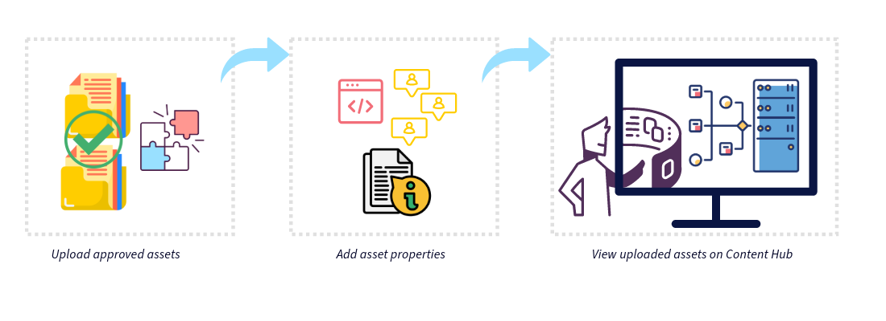

# Door een merk goedgekeurde middelen uploaden naar Content Hub {#upload-brand-approved-assets-content-hub}

>[!CONTEXTUALHELP]
>id="upload_assets_content_hub"
>title="Door een merk goedgekeurde middelen uploaden naar Content Hub"
>abstract="Voeg goedgekeurde middelen toe aan Content Hub via een lokaal bestandssysteem of importeer elementen van OneDrive- of Dropbox-gegevensbronnen. Alle middelen worden op het hoogste niveau in Content Hub weergegeven, ongeacht de mapstructuur, om de zoekmogelijkheden te verbeteren."

| [ Beste praktijken van het Onderzoek ](/help/assets/search-best-practices.md) | [ Beste praktijken van Meta-gegevens ](/help/assets/metadata-best-practices.md) | [ Content Hub ](/help/assets/product-overview.md) | [ Dynamic Media met mogelijkheden OpenAPI ](/help/assets/dynamic-media-open-apis-overview.md) | [ de ontwikkelaarsdocumentatie van AEM Assets ](https://developer.adobe.com/experience-cloud/experience-manager-apis/) |
| ------------- | --------------------------- |---------|----|-----|

>[!AVAILABILITY]
>
>Content Hub-gids is nu beschikbaar in de PDF-indeling. Download de volledige handleiding en gebruik Adobe Acrobat AI Assistant om je vragen te beantwoorden.
>
>[!BADGE  de PDF van de Gids van Content Hub ]{type=Informative url="https://helpx.adobe.com/content/dam/help/en/experience-manager/aem-assets/content-hub.pdf"}

[ de gebruikers van Content Hub met rechten om activa ](/help/assets/deploy-content-hub.md#onboard-content-hub-users-add-assets) toe te voegen kunnen activa aan Content Hub of van lokaal dossiersysteem of de invoeractiva van OneDrive of de gegevensbronnen van de Dropbox toevoegen. Alle middelen worden op het hoogste niveau weergegeven in Content Hub, ongeacht de mapstructuur die beschikbaar is op uw lokale bestandssysteem of de gegevensbronnen OneDrive en Dropbox om de zoekmogelijkheden te verbeteren.

De elementen die zijn gemarkeerd als `Approved` in Assets as a Cloud Service, zijn automatisch beschikbaar in Content Hub. Voor meer informatie, zie [ activa voor Content Hub ](/help/assets/approve-assets-content-hub.md) goedkeuren.

Content Hub biedt u de volgende mogelijkheden om uw assetzoekopdracht verder te verbeteren:

* Definieer de belangrijkste gegevens die relevant zijn voor het uploaden van uw middelen, zoals de naam van de campagne, trefwoorden, kanalen, enzovoort.

* Automatisch meer eigenschappen genereren voor elk element bij een correct geüpload object, zoals bestandsgrootte, indeling, resolutie en enkele andere eigenschappen.

* Gebruik de kunstmatige intelligentie die door [ wordt verstrekt Adobe Sensei ](https://www.adobe.com/sensei.html) om relevante markeringen op al uw geupload activa automatisch toe te passen. Deze labels, met de juiste naam Slimme tags, verhogen de snelheid van de inhoud van uw projecten door u te helpen snel relevante elementen te vinden.

Zorg ervoor dat u slechts uw [ merk goedgekeurde activa aan Content Hub ](/help/assets/approve-assets.md) uploadt.

## Vereisten {#prerequisites-add-assets}

[ de gebruikers van Content Hub met rechten om activa toe te voegen ](/help/assets/deploy-content-hub.md#onboard-content-hub-users-add-assets) kan activa aan Content Hub uploaden.

## Elementen toevoegen aan Content Hub vanuit een lokaal bestandssysteem {#add-assets-local-file-system}

Voer de volgende stappen uit om elementen aan Content Hub toe te voegen:

1. Klik op **[!UICONTROL Add Assets]** om het dialoogvenster **[!UICONTROL Add your approved assets]** weer te geven waarin u een upload kunt maken.

1. In de sectie **[!UICONTROL Drag files or folders here]** die beschikbaar is in het rechterdeelvenster, kunt u de elementen van het lokale bestandssysteem slepen of op **[!UICONTROL Browse]** klikken om handmatig bestanden of mappen te selecteren die beschikbaar zijn op het lokale bestandssysteem. Deze lijst met bestanden die deel uitmaken van de upload, is beschikbaar als een lijst.

   U kunt geselecteerde afbeeldingen ook voorvertonen met behulp van de miniaturen en op het X-pictogram klikken om een bepaalde afbeelding uit de lijst te verwijderen. Het X-pictogram wordt alleen weergegeven wanneer u de muis boven de naam of grootte van de afbeelding houdt. U kunt ook op **[!UICONTROL Remove all]** klikken om alle items uit de uploadlijst te verwijderen.

   Als u het uploadproces wilt voltooien en **[!UICONTROL Upload button]** wilt inschakelen, moet u uw elementen groeperen onder een campagnenaam.

   

1. Definieer de naam voor het uploaden met behulp van het veld **[!UICONTROL Campaign name]** . U kunt een bestaande naam gebruiken of een nieuwe naam maken. De Content Hub biedt u meer opties terwijl u de naam typt. <!--You can define multiple Campaign names for your upload. While you are typing a name, either click anywhere else within the dialog box or press the `,` (Comma) key to register the name.-->

   Als beste praktijken, beveelt de Adobe het specificeren van waarden in de rest gebieden evenals het leidt tot een verbeterde onderzoekservaring voor uw geupload activa.

1. Definieer ook waarden voor de velden **[!UICONTROL Keywords]** , **[!UICONTROL Channels]** , **[!UICONTROL Timeframe]** en **[!UICONTROL Region]** . Tags toevoegen en elementen groeperen op trefwoorden, kanalen en locatie stelt iedereen die uw goedgekeurde bedrijfsinhoud gebruikt in staat deze elementen te vinden en te organiseren.

1. Klik op **[!UICONTROL Upload]** om elementen te uploaden naar de Content Hub. Het bevestigingsvak [!UICONTROL Review details] wordt weergegeven. Klik op [!UICONTROL Continue].

1. Assets begint met uploaden. Klik op [!UICONTROL New Upload] om de uploadprocedure opnieuw te starten. Klik op [!UICONTROL Done] om het uploaden te voltooien.

Beheerders kunnen ook de verplichte en optionele velden configureren die worden weergegeven tijdens het uploaden van elementen, zoals de naam van een campagne, trefwoorden, kanalen enzovoort. Voor meer informatie, zie [ het gebruikersinterface van Content Hub ](configure-content-hub-ui-options.md#configure-upload-options-content-hub) vormen.

## Middelen aan Content Hub toevoegen vanuit OneDrive- of Dropbox-gegevensbronnen {#add-assets-onedrive-dropbox}

Middelen toevoegen aan Content Hub vanaf OneDrive- of Dropbox-gegevensbronnen:

1. Klik op **[!UICONTROL Add Assets]** om het dialoogvenster **[!UICONTROL Add your approved assets]** weer te geven waarin u elementen kunt importeren van OneDrive of Dropbox.

1. Klik op **[!UICONTROL OneDrive]** of **[!UICONTROL Dropbox]** om het importproces te starten. Content Hub vraagt u zich aan te melden bij uw OneDrive- of Dropbox-account en vervolgens de mapstructuur OneDrive of Dropbox in het linkerdeelvenster weer te geven.

1. Klik op het plus-pictogram naast het bestand of de mapnaam om het item in de lijst met geselecteerde items weer te geven. Na het selecteren van alle dossiers die u aan het portaal van Content Hub moet toevoegen, herhaal stap 3 tot 6 van [ activa aan Content Hub van het lokale dossiersysteem ](#add-assets-local-file-system) toevoegen om het uploadproces te voltooien.

   

Beheerders kunnen ook de verplichte en optionele velden configureren die worden weergegeven tijdens het uploaden van elementen, zoals de naam van een campagne, trefwoorden, kanalen enzovoort. Voor meer informatie, zie [ het gebruikersinterface van Content Hub ](configure-content-hub-ui-options.md#configure-upload-options-content-hub) vormen.

## Middelen beheren die met Content Hub zijn geüpload {#manage-assets-uploaded-using-content-hub}

[ de gebruikers van Content Hub met rechten om activa ](/help/assets/deploy-content-hub.md#onboard-content-hub-users-add-assets) toe te voegen kunnen [ activa aan Content Hub ](/help/assets/upload-brand-approved-assets.md) of van lokaal dossiersysteem of de invoeractiva van OneDrive of de gegevensbronnen van de Dropbox toevoegen. Alle middelen worden op het hoogste niveau weergegeven in Content Hub, ongeacht de mapstructuur die beschikbaar is op uw lokale bestandssysteem of de gegevensbronnen OneDrive en Dropbox om de zoekmogelijkheden te verbeteren.

De vertoning van activa die gebruikend Content Hub worden geupload hangt af van als u [ de auto-goedkeuringsknevel ](/help/assets/configure-content-hub-ui-options.md#configure-import-options-content-hub) hebt toegelaten:

* Als de schakeloptie **[!UICONTROL Auto-approval]** is ingeschakeld, zijn de elementen die u uploadt met Content Hub automatisch beschikbaar.

* Als de schakeloptie **[!UICONTROL Auto-approval]** is uitgeschakeld, worden de elementen die u uploadt met Content Hub niet automatisch weergegeven. De middelen zijn beschikbaar in de `hydrated-assets` map van uw as a Cloud Service omgeving van Assets. Navigeer aan de omslag en [ bulkgeef ](#bulk-approve-assets-content-hub) het statuut van die activa `Approved` voor die activa uit om in Content Hub te tonen.

